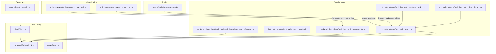
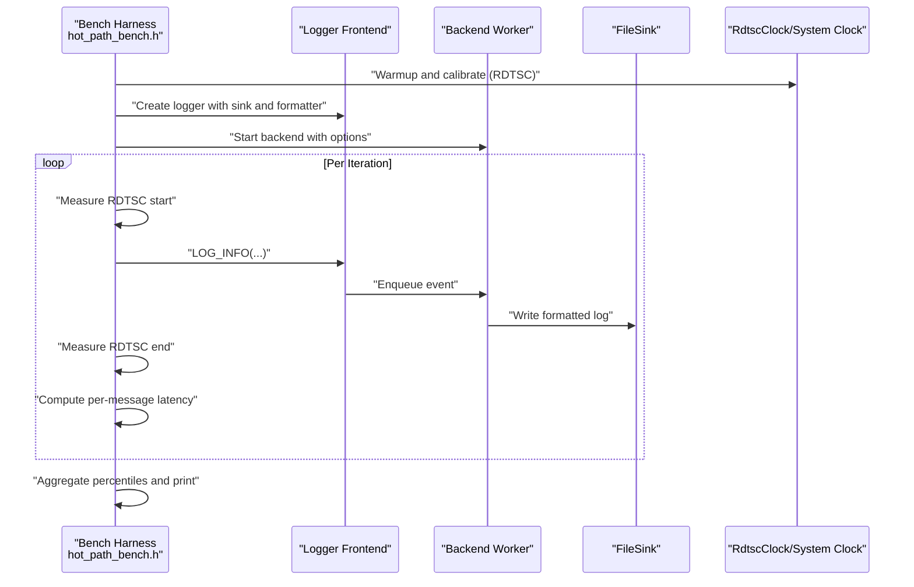
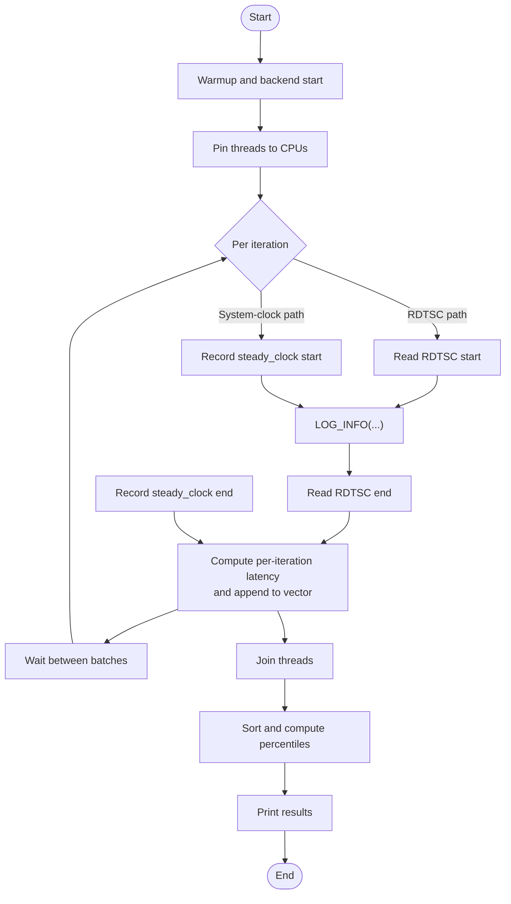
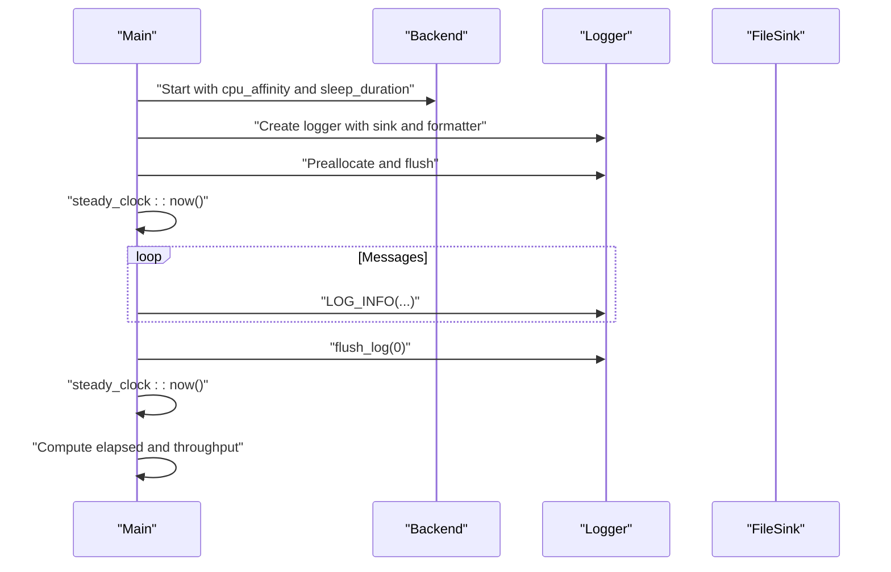
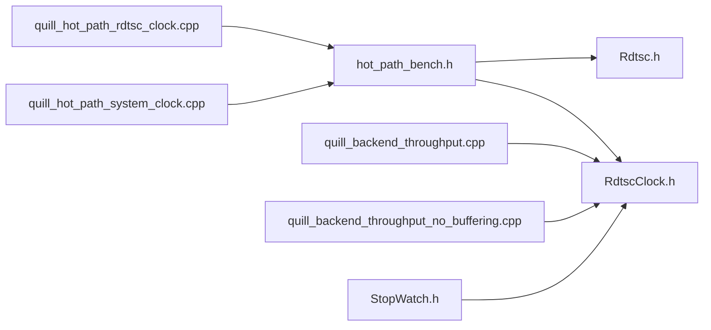

# Benchmarking & Profiling

<cite>
**Referenced Files in This Document**
- [quill_hot_path_rdtsc_clock.cpp](file://benchmarks/hot_path_latency/quill_hot_path_rdtsc_clock.cpp)
- [quill_hot_path_system_clock.cpp](file://benchmarks/hot_path_latency/quill_hot_path_system_clock.cpp)
- [hot_path_bench.h](file://benchmarks/hot_path_latency/hot_path_bench.h)
- [hot_path_bench_config.h](file://benchmarks/hot_path_latency/hot_path_bench_config.h)
- [quill_backend_throughput.cpp](file://benchmarks/backend_throughput/quill_backend_throughput.cpp)
- [quill_backend_throughput_no_buffering.cpp](file://benchmarks/backend_throughput/quill_backend_throughput_no_buffering.cpp)
- [RdtscClock.h](file://include/quill/backend/RdtscClock.h)
- [Rdtsc.h](file://include/quill/core/Rdtsc.h)
- [StopWatch.h](file://include/quill/StopWatch.h)
- [stopwatch.cpp](file://examples/stopwatch.cpp)
- [generate_latency_chart_url.py](file://scripts/generate_latency_chart_url.py)
- [generate_throughput_chart_url.py](file://scripts/generate_throughput_chart_url.py)
- [CodeCoverage.cmake](file://cmake/CodeCoverage.cmake)
</cite>

## Table of Contents
1. [Introduction](#introduction)
2. [Project Structure](#project-structure)
3. [Core Components](#core-components)
4. [Architecture Overview](#architecture-overview)
5. [Detailed Component Analysis](#detailed-component-analysis)
6. [Dependency Analysis](#dependency-analysis)
7. [Performance Considerations](#performance-considerations)
8. [Troubleshooting Guide](#troubleshooting-guide)
9. [Conclusion](#conclusion)
10. [Appendices](#appendices)

## Introduction
This document describes the benchmarking and profiling capabilities present in the repository, focusing on latency measurement using RDTSC and system clocks, throughput testing of backend workers, buffering impact analysis, hot path performance measurement, and critical path identification. It also covers benchmark suite organization, automated result visualization, profiling tool integration, performance counter usage, sampling-based analysis, statistical interpretation of results, and cross-platform considerations.

## Project Structure
The performance-related assets are organized primarily under:
- benchmarks/hot_path_latency: latency benchmarks comparing RDTSC and system clocks
- benchmarks/backend_throughput: throughput benchmarks for backend worker performance and buffering impact
- include/quill/backend and include/quill/core: performance-critical timing and clock utilities
- examples: usage examples for timing utilities
- scripts: tools to generate charts from benchmark results
- cmake: code coverage integration



**Diagram sources**
- [quill_hot_path_rdtsc_clock.cpp:1-95](file://benchmarks/hot_path_latency/quill_hot_path_rdtsc_clock.cpp#L1-L95)
- [quill_hot_path_system_clock.cpp:1-98](file://benchmarks/hot_path_latency/quill_hot_path_system_clock.cpp#L1-L98)
- [hot_path_bench.h:1-202](file://benchmarks/hot_path_latency/hot_path_bench.h#L1-L202)
- [hot_path_bench_config.h:1-37](file://benchmarks/hot_path_latency/hot_path_bench_config.h#L1-L37)
- [quill_backend_throughput.cpp:1-69](file://benchmarks/backend_throughput/quill_backend_throughput.cpp#L1-L69)
- [quill_backend_throughput_no_buffering.cpp:1-72](file://benchmarks/backend_throughput/quill_backend_throughput_no_buffering.cpp#L1-L72)
- [RdtscClock.h:1-265](file://include/quill/backend/RdtscClock.h#L1-L265)
- [Rdtsc.h:1-114](file://include/quill/core/Rdtsc.h#L1-L114)
- [StopWatch.h:1-144](file://include/quill/StopWatch.h#L1-L144)
- [stopwatch.cpp:1-52](file://examples/stopwatch.cpp#L1-L52)
- [generate_latency_chart_url.py:1-201](file://scripts/generate_latency_chart_url.py#L1-L201)
- [generate_throughput_chart_url.py:1-106](file://scripts/generate_throughput_chart_url.py#L1-L106)
- [CodeCoverage.cmake:1-158](file://cmake/CodeCoverage.cmake#L1-L158)

**Section sources**
- [quill_hot_path_rdtsc_clock.cpp:1-95](file://benchmarks/hot_path_latency/quill_hot_path_rdtsc_clock.cpp#L1-L95)
- [quill_hot_path_system_clock.cpp:1-98](file://benchmarks/hot_path_latency/quill_hot_path_system_clock.cpp#L1-L98)
- [hot_path_bench.h:1-202](file://benchmarks/hot_path_latency/hot_path_bench.h#L1-L202)
- [hot_path_bench_config.h:1-37](file://benchmarks/hot_path_latency/hot_path_bench_config.h#L1-L37)
- [quill_backend_throughput.cpp:1-69](file://benchmarks/backend_throughput/quill_backend_throughput.cpp#L1-L69)
- [quill_backend_throughput_no_buffering.cpp:1-72](file://benchmarks/backend_throughput/quill_backend_throughput_no_buffering.cpp#L1-L72)
- [RdtscClock.h:1-265](file://include/quill/backend/RdtscClock.h#L1-L265)
- [Rdtsc.h:1-114](file://include/quill/core/Rdtsc.h#L1-L114)
- [StopWatch.h:1-144](file://include/quill/StopWatch.h#L1-L144)
- [stopwatch.cpp:1-52](file://examples/stopwatch.cpp#L1-L52)
- [generate_latency_chart_url.py:1-201](file://scripts/generate_latency_chart_url.py#L1-L201)
- [generate_throughput_chart_url.py:1-106](file://scripts/generate_throughput_chart_url.py#L1-L106)
- [CodeCoverage.cmake:1-158](file://cmake/CodeCoverage.cmake#L1-L158)

## Core Components
- Hot path latency benchmarks:
  - RDTSC-based hot path latency: measures per-iteration latency using cycle counters and converts to nanoseconds via a calibrated RDTSC clock.
  - System-clock-based hot path latency: measures latency using steady/system clocks for comparison.
  - Shared benchmark harness coordinates thread pinning, warmup, batching, and percentile reporting.
- Backend throughput benchmarks:
  - Measures total time for N logged messages and computes millions of messages per second.
  - Includes a variant disabling buffering to assess impact of internal queues/transit buffers.
- Timing utilities:
  - RDTSC calibration and conversion to wall time with periodic resynchronization.
  - Platform-aware rdtsc() intrinsic selection.
  - Stopwatch utilities supporting both TSC and system clocks for ad-hoc measurements.

Key implementation references:
- Hot path harness and RDTSC invocation: [hot_path_bench.h:100-124](file://benchmarks/hot_path_latency/hot_path_bench.h#L100-L124)
- System-clock latency benchmark: [quill_hot_path_system_clock.cpp:55-60](file://benchmarks/hot_path_latency/quill_hot_path_system_clock.cpp#L55-L60)
- Backend throughput timing: [quill_backend_throughput.cpp:48-67](file://benchmarks/backend_throughput/quill_backend_throughput.cpp#L48-L67)
- RDTSC calibration and resync: [RdtscClock.h:119-230](file://include/quill/backend/RdtscClock.h#L119-L230)
- Platform-specific rdtsc(): [Rdtsc.h:42-110](file://include/quill/core/Rdtsc.h#L42-L110)
- Stopwatch utilities: [StopWatch.h:44-113](file://include/quill/StopWatch.h#L44-L113)

**Section sources**
- [hot_path_bench.h:1-202](file://benchmarks/hot_path_latency/hot_path_bench.h#L1-L202)
- [quill_hot_path_system_clock.cpp:1-98](file://benchmarks/hot_path_latency/quill_hot_path_system_clock.cpp#L1-L98)
- [quill_backend_throughput.cpp:1-69](file://benchmarks/backend_throughput/quill_backend_throughput.cpp#L1-L69)
- [RdtscClock.h:1-265](file://include/quill/backend/RdtscClock.h#L1-L265)
- [Rdtsc.h:1-114](file://include/quill/core/Rdtsc.h#L1-L114)
- [StopWatch.h:1-144](file://include/quill/StopWatch.h#L1-L144)

## Architecture Overview
The benchmarking architecture separates concerns into:
- Bench harness: orchestrates threads, warmup, batching, and latency aggregation.
- Logger frontends: configured with file sinks and formatter options.
- Backend worker: processes queued events; throughput benchmarks measure end-to-end time.
- Timing subsystem: RDTSC calibration and conversion to wall time; system-clock alternatives.



**Diagram sources**
- [hot_path_bench.h:100-124](file://benchmarks/hot_path_latency/hot_path_bench.h#L100-L124)
- [quill_hot_path_rdtsc_clock.cpp:53-83](file://benchmarks/hot_path_latency/quill_hot_path_rdtsc_clock.cpp#L53-L83)
- [RdtscClock.h:119-166](file://include/quill/backend/RdtscClock.h#L119-L166)

## Detailed Component Analysis

### Hot Path Latency Benchmark (RDTSC vs System Clock)
- Methodology:
  - RDTSC path: Uses cycle-based measurement around the logging call; per-iteration latency is computed and averaged per thread; percentiles are reported.
  - System-clock path: Uses steady/system clock timestamps for comparison.
- Configuration:
  - Thread counts, iterations, and messages per iteration are configurable.
  - Wait durations between batches prevent backend overload and stabilize measurements.
- Critical path identification:
  - The hot path is bracketed by RDTSC reads around the logging function call, capturing the minimal overhead of formatting and enqueueing.



**Diagram sources**
- [hot_path_bench.h:100-124](file://benchmarks/hot_path_latency/hot_path_bench.h#L100-L124)
- [hot_path_bench_config.h:21-37](file://benchmarks/hot_path_latency/hot_path_bench_config.h#L21-L37)
- [quill_hot_path_rdtsc_clock.cpp:76-83](file://benchmarks/hot_path_latency/quill_hot_path_rdtsc_clock.cpp#L76-L83)
- [quill_hot_path_system_clock.cpp:79-86](file://benchmarks/hot_path_latency/quill_hot_path_system_clock.cpp#L79-L86)

**Section sources**
- [hot_path_bench.h:1-202](file://benchmarks/hot_path_latency/hot_path_bench.h#L1-L202)
- [hot_path_bench_config.h:1-37](file://benchmarks/hot_path_latency/hot_path_bench_config.h#L1-L37)
- [quill_hot_path_rdtsc_clock.cpp:1-95](file://benchmarks/hot_path_latency/quill_hot_path_rdtsc_clock.cpp#L1-L95)
- [quill_hot_path_system_clock.cpp:1-98](file://benchmarks/hot_path_latency/quill_hot_path_system_clock.cpp#L1-L98)

### Backend Throughput Benchmark (Buffering Impact)
- Methodology:
  - Measures total wall-clock time for a fixed number of log messages.
  - Computes throughput as millions of messages per second.
  - Two variants:
    - Default: normal buffering behavior.
    - No-buffering: sets transit buffer hard/soft limits to 1 to force near-direct processing and assess overhead.
- Control flow:
  - Backend worker started with tuned options.
  - Preallocation and flush used to stabilize timing.



**Diagram sources**
- [quill_backend_throughput.cpp:14-67](file://benchmarks/backend_throughput/quill_backend_throughput.cpp#L14-L67)
- [quill_backend_throughput_no_buffering.cpp:14-71](file://benchmarks/backend_throughput/quill_backend_throughput_no_buffering.cpp#L14-L71)

**Section sources**
- [quill_backend_throughput.cpp:1-69](file://benchmarks/backend_throughput/quill_backend_throughput.cpp#L1-L69)
- [quill_backend_throughput_no_buffering.cpp:1-72](file://benchmarks/backend_throughput/quill_backend_throughput_no_buffering.cpp#L1-L72)

### Timing Subsystem and Critical Path Measurement
- RDTSC calibration:
  - Periodic calibration against system time with convergence checks; maintains a base pair and versioning to avoid resync on each call.
- Safe conversion:
  - Provides both fast, non-resyncing conversion and safe conversion with atomic consistency.
- Stopwatch utilities:
  - StopWatchTsc uses calibrated rdtsc() and nanoseconds-per-tick scaling.
  - StopWatchChrono uses steady_clock for system-based timing.

```mermaid
classDiagram
class RdtscClock {
+double ns_per_tick()
+uint64_t time_since_epoch(rdtsc_value)
+uint64_t time_since_epoch_safe(rdtsc_value)
+bool resync(lag)
}
class RdtscTicks {
+double ns_per_tick()
}
class StopWatch_Tsc {
+elapsed_as<T>()
+reset()
}
class StopWatch_Chrono {
+elapsed_as<T>()
+reset()
}
RdtscClock --> RdtscTicks : "calibration"
StopWatch_Tsc --> RdtscClock : "uses"
StopWatch_Chrono --> "steady_clock" : "uses"
```

**Diagram sources**
- [RdtscClock.h:36-230](file://include/quill/backend/RdtscClock.h#L36-L230)
- [Rdtsc.h:42-110](file://include/quill/core/Rdtsc.h#L42-L110)
- [StopWatch.h:44-113](file://include/quill/StopWatch.h#L44-L113)

**Section sources**
- [RdtscClock.h:1-265](file://include/quill/backend/RdtscClock.h#L1-L265)
- [Rdtsc.h:1-114](file://include/quill/core/Rdtsc.h#L1-L114)
- [StopWatch.h:1-144](file://include/quill/StopWatch.h#L1-L144)
- [stopwatch.cpp:1-52](file://examples/stopwatch.cpp#L1-L52)

## Dependency Analysis
- Bench harness depends on:
  - Logger frontends and sinks for I/O.
  - Backend worker for processing logs.
  - Timing utilities for latency measurement.
- Hot path benchmarks depend on:
  - RDTSC calibration and conversion.
  - Platform-specific rdtsc() intrinsic selection.
- Throughput benchmarks depend on:
  - Backend worker startup and sink configuration.
  - Steady clock for total time measurement.



**Diagram sources**
- [hot_path_bench.h:1-202](file://benchmarks/hot_path_latency/hot_path_bench.h#L1-L202)
- [quill_hot_path_system_clock.cpp:1-98](file://benchmarks/hot_path_latency/quill_hot_path_system_clock.cpp#L1-L98)
- [quill_hot_path_rdtsc_clock.cpp:1-95](file://benchmarks/hot_path_latency/quill_hot_path_rdtsc_clock.cpp#L1-L95)
- [quill_backend_throughput.cpp:1-69](file://benchmarks/backend_throughput/quill_backend_throughput.cpp#L1-L69)
- [quill_backend_throughput_no_buffering.cpp:1-72](file://benchmarks/backend_throughput/quill_backend_throughput_no_buffering.cpp#L1-L72)
- [RdtscClock.h:1-265](file://include/quill/backend/RdtscClock.h#L1-L265)
- [Rdtsc.h:1-114](file://include/quill/core/Rdtsc.h#L1-L114)
- [StopWatch.h:1-144](file://include/quill/StopWatch.h#L1-L144)

**Section sources**
- [hot_path_bench.h:1-202](file://benchmarks/hot_path_latency/hot_path_bench.h#L1-L202)
- [quill_hot_path_system_clock.cpp:1-98](file://benchmarks/hot_path_latency/quill_hot_path_system_clock.cpp#L1-L98)
- [quill_hot_path_rdtsc_clock.cpp:1-95](file://benchmarks/hot_path_latency/quill_hot_path_rdtsc_clock.cpp#L1-L95)
- [quill_backend_throughput.cpp:1-69](file://benchmarks/backend_throughput/quill_backend_throughput.cpp#L1-L69)
- [quill_backend_throughput_no_buffering.cpp:1-72](file://benchmarks/backend_throughput/quill_backend_throughput_no_buffering.cpp#L1-L72)
- [RdtscClock.h:1-265](file://include/quill/backend/RdtscClock.h#L1-L265)
- [Rdtsc.h:1-114](file://include/quill/core/Rdtsc.h#L1-L114)
- [StopWatch.h:1-144](file://include/quill/StopWatch.h#L1-L144)

## Performance Considerations
- Latency measurement methodology:
  - RDTSC path: captures cycles around the logging call; requires calibration to convert to nanoseconds; suitable for hot path micro-benchmarking.
  - System-clock path: provides wall-clock latency for comparison; useful for end-to-end latency analysis.
- Throughput methodology:
  - Total time measured for N messages; throughput derived as millions of messages per second.
  - Buffering impact: setting transit buffer limits to 1 isolates backend worker processing overhead.
- Hot path and critical path:
  - The hot path is bracketed by RDTSC reads around the logging call; percentiles capture tail latency behavior.
- Platform-specific considerations:
  - Platform-aware rdtsc() selection ensures correctness across architectures; fallback to steady_clock on unsupported platforms.
- Statistical analysis:
  - Percentiles (50th, 75th, 90th, 95th, 99th, 99.9th) are computed from aggregated per-iteration latencies.
- Automated visualization:
  - Scripts parse markdown tables and produce chart URLs for latency and throughput comparisons.

**Section sources**
- [hot_path_bench.h:175-202](file://benchmarks/hot_path_latency/hot_path_bench.h#L175-L202)
- [hot_path_bench_config.h:21-37](file://benchmarks/hot_path_latency/hot_path_bench_config.h#L21-L37)
- [quill_backend_throughput.cpp:48-67](file://benchmarks/backend_throughput/quill_backend_throughput.cpp#L48-L67)
- [quill_backend_throughput_no_buffering.cpp:21-23](file://benchmarks/backend_throughput/quill_backend_throughput_no_buffering.cpp#L21-L23)
- [RdtscClock.h:119-230](file://include/quill/backend/RdtscClock.h#L119-L230)
- [Rdtsc.h:15-36](file://include/quill/core/Rdtsc.h#L15-L36)
- [generate_latency_chart_url.py:1-201](file://scripts/generate_latency_chart_url.py#L1-L201)
- [generate_throughput_chart_url.py:1-106](file://scripts/generate_throughput_chart_url.py#L1-L106)

## Troubleshooting Guide
- Backend not ready:
  - Benchmarks include short sleeps after starting the backend; ensure sufficient initialization time before logging.
- Thread affinity:
  - Bench harness pins threads to CPUs; ensure host has adequate cores and permissions.
- Buffering effects:
  - Use the no-buffering variant to isolate backend worker processing; compare with default to quantify buffering overhead.
- Calibration stability:
  - RDTSC calibration converges over trials; if timestamps appear incorrect, verify CPU frequency stability and interrupts.
- Visualizing results:
  - Use provided scripts to generate chart URLs from markdown tables for latency and throughput.

**Section sources**
- [quill_hot_path_rdtsc_clock.cpp:32-42](file://benchmarks/hot_path_latency/quill_hot_path_rdtsc_clock.cpp#L32-L42)
- [quill_hot_path_system_clock.cpp:32-42](file://benchmarks/hot_path_latency/quill_hot_path_system_clock.cpp#L32-L42)
- [quill_backend_throughput.cpp:17-25](file://benchmarks/backend_throughput/quill_backend_throughput.cpp#L17-L25)
- [quill_backend_throughput_no_buffering.cpp:17-26](file://benchmarks/backend_throughput/quill_backend_throughput_no_buffering.cpp#L17-L26)
- [RdtscClock.h:196-230](file://include/quill/backend/RdtscClock.h#L196-L230)
- [generate_latency_chart_url.py:1-201](file://scripts/generate_latency_chart_url.py#L1-L201)
- [generate_throughput_chart_url.py:1-106](file://scripts/generate_throughput_chart_url.py#L1-L106)

## Conclusion
The repository provides a comprehensive, modular benchmarking framework for evaluating Quill’s logging performance. It supports precise hot path latency measurement using RDTSC and system clocks, robust throughput testing with and without buffering, and practical tools for statistical analysis and visualization. The timing subsystem ensures accurate conversions and safe usage across platforms, enabling reliable performance regression testing and continuous monitoring.

## Appendices

### Benchmark Suite Organization
- Hot path latency:
  - RDTSC path: [quill_hot_path_rdtsc_clock.cpp:1-95](file://benchmarks/hot_path_latency/quill_hot_path_rdtsc_clock.cpp#L1-L95)
  - System-clock path: [quill_hot_path_system_clock.cpp:1-98](file://benchmarks/hot_path_latency/quill_hot_path_system_clock.cpp#L1-L98)
  - Harness and configuration: [hot_path_bench.h:1-202](file://benchmarks/hot_path_latency/hot_path_bench.h#L1-L202), [hot_path_bench_config.h:1-37](file://benchmarks/hot_path_latency/hot_path_bench_config.h#L1-L37)
- Backend throughput:
  - Default: [quill_backend_throughput.cpp:1-69](file://benchmarks/backend_throughput/quill_backend_throughput.cpp#L1-L69)
  - No-buffering: [quill_backend_throughput_no_buffering.cpp:1-72](file://benchmarks/backend_throughput/quill_backend_throughput_no_buffering.cpp#L1-L72)
- Timing utilities:
  - RDTSC clock: [RdtscClock.h:1-265](file://include/quill/backend/RdtscClock.h#L1-L265)
  - Platform rdtsc(): [Rdtsc.h:1-114](file://include/quill/core/Rdtsc.h#L1-L114)
  - Stopwatch: [StopWatch.h:1-144](file://include/quill/StopWatch.h#L1-L144)
- Examples:
  - Stopwatch usage: [stopwatch.cpp:1-52](file://examples/stopwatch.cpp#L1-L52)
- Visualization:
  - Latency charts: [generate_latency_chart_url.py:1-201](file://scripts/generate_latency_chart_url.py#L1-L201)
  - Throughput charts: [generate_throughput_chart_url.py:1-106](file://scripts/generate_throughput_chart_url.py#L1-L106)
- Tooling:
  - Code coverage: [CodeCoverage.cmake:1-158](file://cmake/CodeCoverage.cmake#L1-L158)

**Section sources**
- [quill_hot_path_rdtsc_clock.cpp:1-95](file://benchmarks/hot_path_latency/quill_hot_path_rdtsc_clock.cpp#L1-L95)
- [quill_hot_path_system_clock.cpp:1-98](file://benchmarks/hot_path_latency/quill_hot_path_system_clock.cpp#L1-L98)
- [hot_path_bench.h:1-202](file://benchmarks/hot_path_latency/hot_path_bench.h#L1-L202)
- [hot_path_bench_config.h:1-37](file://benchmarks/hot_path_latency/hot_path_bench_config.h#L1-L37)
- [quill_backend_throughput.cpp:1-69](file://benchmarks/backend_throughput/quill_backend_throughput.cpp#L1-L69)
- [quill_backend_throughput_no_buffering.cpp:1-72](file://benchmarks/backend_throughput/quill_backend_throughput_no_buffering.cpp#L1-L72)
- [RdtscClock.h:1-265](file://include/quill/backend/RdtscClock.h#L1-L265)
- [Rdtsc.h:1-114](file://include/quill/core/Rdtsc.h#L1-L114)
- [StopWatch.h:1-144](file://include/quill/StopWatch.h#L1-L144)
- [stopwatch.cpp:1-52](file://examples/stopwatch.cpp#L1-L52)
- [generate_latency_chart_url.py:1-201](file://scripts/generate_latency_chart_url.py#L1-L201)
- [generate_throughput_chart_url.py:1-106](file://scripts/generate_throughput_chart_url.py#L1-L106)
- [CodeCoverage.cmake:1-158](file://cmake/CodeCoverage.cmake#L1-L158)