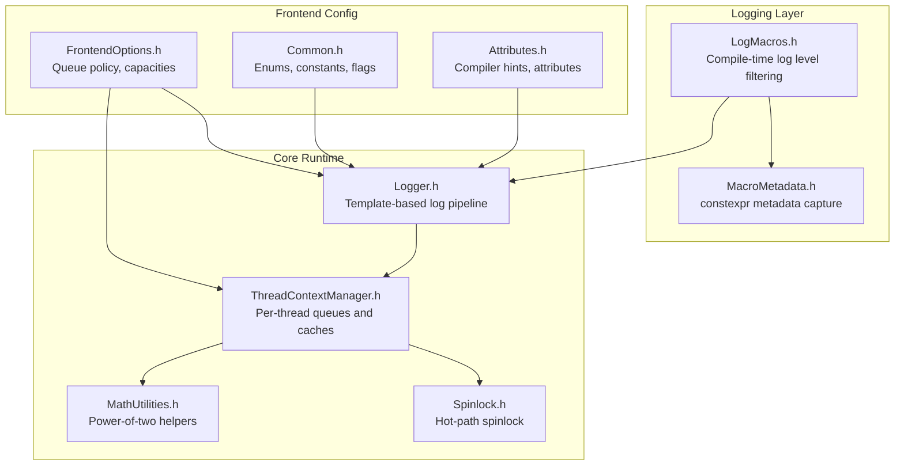
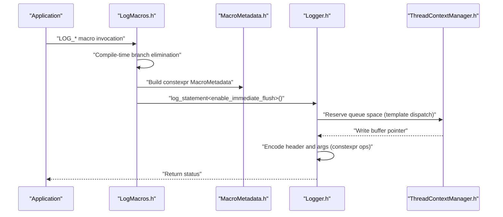
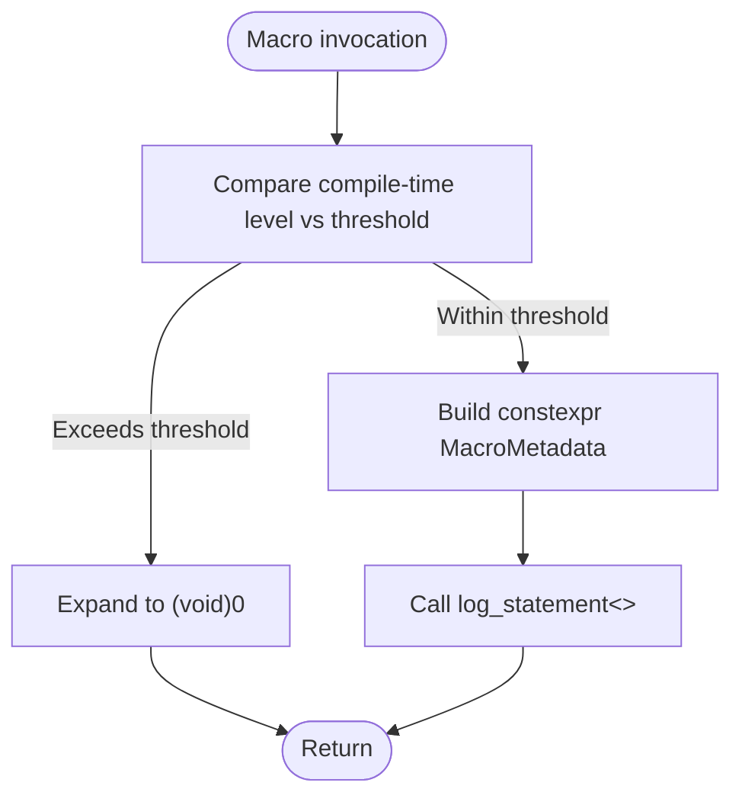
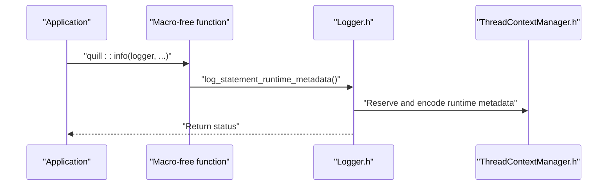
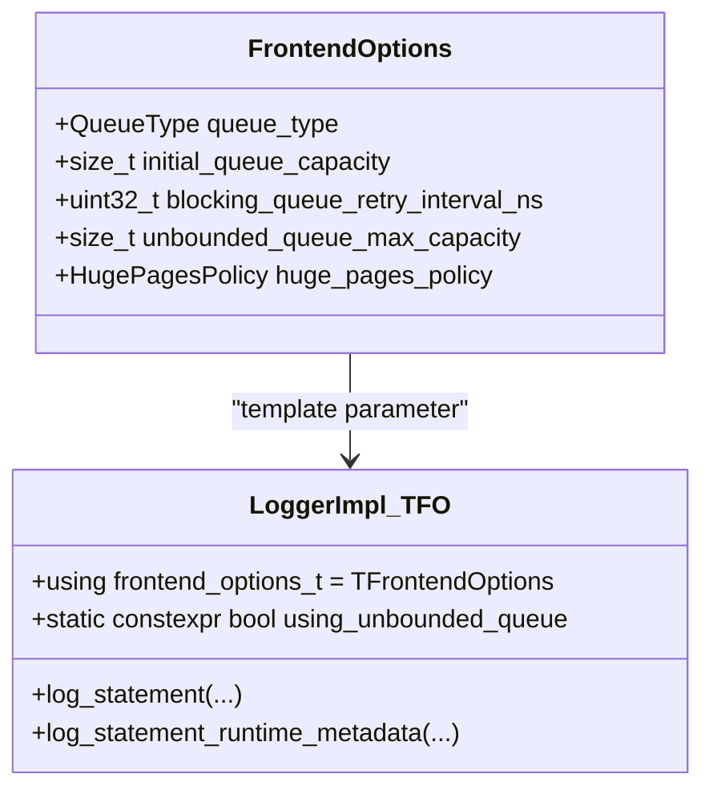
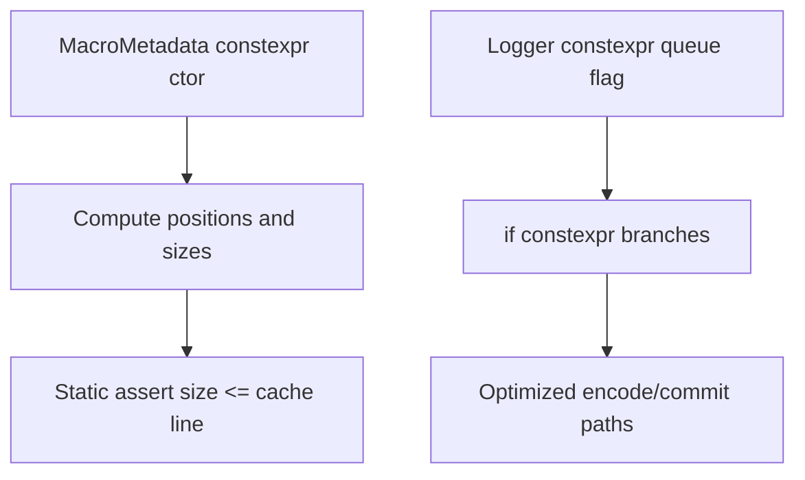
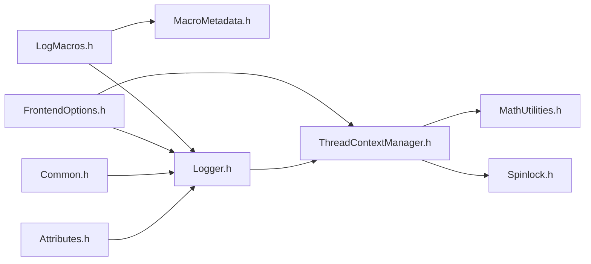

# Compile-time Optimizations

<cite>
**Referenced Files in This Document**
- [LogMacros.h](file://include/quill/LogMacros.h)
- [FrontendOptions.h](file://include/quill/core/FrontendOptions.h)
- [Common.h](file://include/quill/core/Common.h)
- [Attributes.h](file://include/quill/core/Attributes.h)
- [MacroMetadata.h](file://include/quill/core/MacroMetadata.h)
- [Logger.h](file://include/quill/Logger.h)
- [ThreadContextManager.h](file://include/quill/core/ThreadContextManager.h)
- [MathUtilities.h](file://include/quill/core/MathUtilities.h)
- [Spinlock.h](file://include/quill/core/Spinlock.h)
- [console_logging_macro_free.cpp](file://examples/console_logging_macro_free.cpp)
- [macro_free_mode.rst](file://docs/macro_free_mode.rst)
- [compile_time_bench.cpp](file://benchmarks/compile_time/compile_time_bench.cpp)
</cite>

## Table of Contents
1. [Introduction](#introduction)
2. [Project Structure](#project-structure)
3. [Core Components](#core-components)
4. [Architecture Overview](#architecture-overview)
5. [Detailed Component Analysis](#detailed-component-analysis)
6. [Dependency Analysis](#dependency-analysis)
7. [Performance Considerations](#performance-considerations)
8. [Troubleshooting Guide](#troubleshooting-guide)
9. [Conclusion](#conclusion)
10. [Appendices](#appendices)

## Introduction
This document explains Quill’s compile-time optimization techniques and how they eliminate unnecessary code paths, reduce overhead, and maximize performance. It covers:
- Log level filtering via compile-time macro selection
- Macro-free mode and its trade-offs
- Template specialization and constexpr usage
- FrontendOptions configuration effects on dead code elimination
- Compiler-specific hints and attributes
- Practical examples and benchmark guidance

## Project Structure
Quill organizes compile-time optimizations primarily in:
- Logging macros and compile-time metadata
- Frontend configuration and queue policies
- Logger internals leveraging templates and constexpr
- Thread-local context and queue specialization
- Utility math and spinlock primitives

**Diagram sources**
- [LogMacros.h:1-800](file://include/quill/LogMacros.h#L1-L800)
- [MacroMetadata.h:1-195](file://include/quill/core/MacroMetadata.h#L1-L195)
- [FrontendOptions.h:1-52](file://include/quill/core/FrontendOptions.h#L1-L52)
- [Common.h:1-183](file://include/quill/core/Common.h#L1-L183)
- [Attributes.h:1-181](file://include/quill/core/Attributes.h#L1-L181)
- [Logger.h:1-508](file://include/quill/Logger.h#L1-L508)
- [ThreadContextManager.h:1-430](file://include/quill/core/ThreadContextManager.h#L1-L430)
- [MathUtilities.h:1-73](file://include/quill/core/MathUtilities.h#L1-L73)
- [Spinlock.h:1-75](file://include/quill/core/Spinlock.h#L1-L75)

**Section sources**
- [LogMacros.h:1-800](file://include/quill/LogMacros.h#L1-L800)
- [FrontendOptions.h:1-52](file://include/quill/core/FrontendOptions.h#L1-L52)
- [Common.h:1-183](file://include/quill/core/Common.h#L1-L183)
- [Attributes.h:1-181](file://include/quill/core/Attributes.h#L1-L181)
- [Logger.h:1-508](file://include/quill/Logger.h#L1-L508)
- [ThreadContextManager.h:1-430](file://include/quill/core/ThreadContextManager.h#L1-L430)
- [MathUtilities.h:1-73](file://include/quill/core/MathUtilities.h#L1-L73)
- [Spinlock.h:1-75](file://include/quill/core/Spinlock.h#L1-L75)

## Core Components
- Compile-time log level filtering: Macro selection gates entire log level branches at compile time, enabling zero-cost logging when levels are filtered out.
- Macro-free mode: Function-based logging avoids macros but incurs runtime overhead and cannot be fully compiled out.
- Template specialization: Logger and queue types are specialized via FrontendOptions, enabling compile-time decisions for queue behavior and hot paths.
- constexpr and static assertions: Metadata, sizes, and alignment are computed at compile time; assertions validate invariants without runtime cost.
- FrontendOptions: Controls queue type, capacities, and huge pages policy, directly affecting dead code elimination and runtime performance.

**Section sources**
- [LogMacros.h:14-45](file://include/quill/LogMacros.h#L14-L45)
- [macro_free_mode.rst:1-51](file://docs/macro_free_mode.rst#L1-L51)
- [FrontendOptions.h:16-50](file://include/quill/core/FrontendOptions.h#L16-L50)
- [Logger.h:47-56](file://include/quill/Logger.h#L47-L56)
- [MacroMetadata.h:38-51](file://include/quill/core/MacroMetadata.h#L38-L51)

## Architecture Overview
The compile-time optimization pipeline:
- Macro selection compiles out unwanted log levels
- MacroMetadata captures compile-time metadata
- Logger uses template specialization to choose queue behavior
- ThreadContextManager provides per-thread queues and caches
- Hot-path attributes and spinlocks optimize runtime

**Diagram sources**
- [LogMacros.h:306-314](file://include/quill/LogMacros.h#L306-L314)
- [MacroMetadata.h:38-51](file://include/quill/core/MacroMetadata.h#L38-L51)
- [Logger.h:75-136](file://include/quill/Logger.h#L75-L136)
- [ThreadContextManager.h:100-131](file://include/quill/core/ThreadContextManager.h#L100-L131)

## Detailed Component Analysis

### Log Level Filtering and Macro Selection
- Compile-time constants define numeric values for each log level.
- A global compile-time threshold disables higher/equal levels via macro guards.
- When filtered out, macro expansions become no-ops, eliminating branches and metadata creation.

**Diagram sources**
- [LogMacros.h:28-40](file://include/quill/LogMacros.h#L28-L40)
- [LogMacros.h:373-432](file://include/quill/LogMacros.h#L373-L432)

**Section sources**
- [LogMacros.h:14-45](file://include/quill/LogMacros.h#L14-L45)
- [LogMacros.h:28-40](file://include/quill/LogMacros.h#L28-L40)
- [LogMacros.h:373-432](file://include/quill/LogMacros.h#L373-L432)

### Macro-free Mode Implementation and Trade-offs
- Macro-free functions call through the same Logger API but rely on runtime metadata and argument evaluation.
- No compile-time removal of disabled levels; additional safety checks and metadata copies increase latency.
- Recommended for scenarios favoring simplicity over peak hot-path performance.

**Diagram sources**
- [macro_free_mode.rst:10-26](file://docs/macro_free_mode.rst#L10-L26)
- [console_logging_macro_free.cpp:35-60](file://examples/console_logging_macro_free.cpp#L35-L60)
- [Logger.h:155-260](file://include/quill/Logger.h#L155-L260)

**Section sources**
- [macro_free_mode.rst:1-51](file://docs/macro_free_mode.rst#L1-L51)
- [console_logging_macro_free.cpp:1-62](file://examples/console_logging_macro_free.cpp#L1-L62)
- [Logger.h:155-260](file://include/quill/Logger.h#L155-L260)

### Template Specialization and FrontendOptions
- LoggerImpl is templated on FrontendOptions, enabling compile-time decisions for queue behavior and hot paths.
- FrontendOptions controls queue type, capacities, and huge pages policy, influencing dead code elimination and runtime performance.

**Diagram sources**
- [FrontendOptions.h:16-50](file://include/quill/core/FrontendOptions.h#L16-L50)
- [Logger.h:47-56](file://include/quill/Logger.h#L47-L56)

**Section sources**
- [FrontendOptions.h:16-50](file://include/quill/core/FrontendOptions.h#L16-L50)
- [Logger.h:47-56](file://include/quill/Logger.h#L47-L56)

### constexpr Optimizations and Static Assertions
- MacroMetadata stores compile-time metadata and exposes constexpr helpers for named argument detection and string views.
- Logger uses constexpr expressions to compute sizes and dispatch queue behavior.
- Static assertions validate sizes and invariants at compile time.

**Diagram sources**
- [MacroMetadata.h:38-51](file://include/quill/core/MacroMetadata.h#L38-L51)
- [MacroMetadata.h:192-194](file://include/quill/core/MacroMetadata.h#L192-L194)
- [Logger.h:53-55](file://include/quill/Logger.h#L53-L55)
- [Logger.h:457-475](file://include/quill/Logger.h#L457-L475)

**Section sources**
- [MacroMetadata.h:38-51](file://include/quill/core/MacroMetadata.h#L38-L51)
- [MacroMetadata.h:192-194](file://include/quill/core/MacroMetadata.h#L192-L194)
- [Logger.h:53-55](file://include/quill/Logger.h#L53-L55)
- [Logger.h:457-475](file://include/quill/Logger.h#L457-L475)

### FrontendOptions Configuration Effects
- QueueType selection influences compile-time branches for blocking/dropping and unbounded/bounded behavior.
- Initial and max capacities affect queue growth and dead code elimination for shrinking paths.
- HugePagesPolicy impacts memory layout and TLB behavior; compile-time selection avoids runtime checks.

**Section sources**
- [FrontendOptions.h:16-50](file://include/quill/core/FrontendOptions.h#L16-L50)
- [ThreadContextManager.h:67-80](file://include/quill/core/ThreadContextManager.h#L67-L80)
- [ThreadContextManager.h:100-131](file://include/quill/core/ThreadContextManager.h#L100-L131)

### Compiler-Specific Hints and Attributes
- Hot/cold attributes guide branch prediction and code placement.
- Likely/Unlikely hints inform branch probability.
- Visibility and RTTI toggles adapt behavior across platforms.

**Section sources**
- [Attributes.h:104-148](file://include/quill/core/Attributes.h#L104-L148)
- [Common.h:14-18](file://include/quill/core/Common.h#L14-L18)

### Practical Examples and Benchmarks
- Compile-time benchmarks demonstrate the effect of macro filtering and macro-free mode on compilation time and hot-path performance.
- Example macro-free program illustrates function-based logging.

**Section sources**
- [compile_time_bench.cpp](file://benchmarks/compile_time/compile_time_bench.cpp)
- [console_logging_macro_free.cpp:1-62](file://examples/console_logging_macro_free.cpp#L1-L62)

## Dependency Analysis
Compile-time optimization depends on tight coupling between macros, metadata, and template-driven runtime paths.

**Diagram sources**
- [LogMacros.h:1-800](file://include/quill/LogMacros.h#L1-L800)
- [MacroMetadata.h:1-195](file://include/quill/core/MacroMetadata.h#L1-L195)
- [FrontendOptions.h:1-52](file://include/quill/core/FrontendOptions.h#L1-L52)
- [Logger.h:1-508](file://include/quill/Logger.h#L1-L508)
- [ThreadContextManager.h:1-430](file://include/quill/core/ThreadContextManager.h#L1-L430)
- [Common.h:1-183](file://include/quill/core/Common.h#L1-L183)
- [Attributes.h:1-181](file://include/quill/core/Attributes.h#L1-L181)
- [MathUtilities.h:1-73](file://include/quill/core/MathUtilities.h#L1-L73)
- [Spinlock.h:1-75](file://include/quill/core/Spinlock.h#L1-L75)

**Section sources**
- [LogMacros.h:1-800](file://include/quill/LogMacros.h#L1-L800)
- [Logger.h:1-508](file://include/quill/Logger.h#L1-L508)
- [ThreadContextManager.h:1-430](file://include/quill/core/ThreadContextManager.h#L1-L430)

## Performance Considerations
- Prefer macro-based logging for hot paths to benefit from compile-time filtering and zero-cost branches.
- Macro-free mode simplifies code but adds runtime metadata copying, argument evaluation, and reduced backend throughput.
- Tune FrontendOptions for workload characteristics: bounded vs unbounded queues, retry intervals, and huge pages policy.
- Use hot/cold attributes and branch hints to improve branch prediction accuracy.

[No sources needed since this section provides general guidance]

## Troubleshooting Guide
- If unexpected log levels appear, verify the compile-time threshold and ensure macros are properly guarded.
- For macro-free mode slowness, confirm that hot paths use macros and that runtime metadata is only used where necessary.
- Validate FrontendOptions choices to avoid unintended blocking/dropping behavior.

**Section sources**
- [LogMacros.h:14-45](file://include/quill/LogMacros.h#L14-L45)
- [macro_free_mode.rst:10-26](file://docs/macro_free_mode.rst#L10-L26)
- [FrontendOptions.h:16-50](file://include/quill/core/FrontendOptions.h#L16-L50)

## Conclusion
Quill’s compile-time optimizations center on macro-based filtering, constexpr metadata, and template-driven runtime specialization. Macro-free mode offers convenience at the cost of runtime overhead. Proper configuration of FrontendOptions and judicious use of compiler attributes yield significant performance gains for production systems.

[No sources needed since this section summarizes without analyzing specific files]

## Appendices
- Benchmark references:
  - [compile_time_bench.cpp](file://benchmarks/compile_time/compile_time_bench.cpp)
- Example references:
  - [console_logging_macro_free.cpp](file://examples/console_logging_macro_free.cpp)