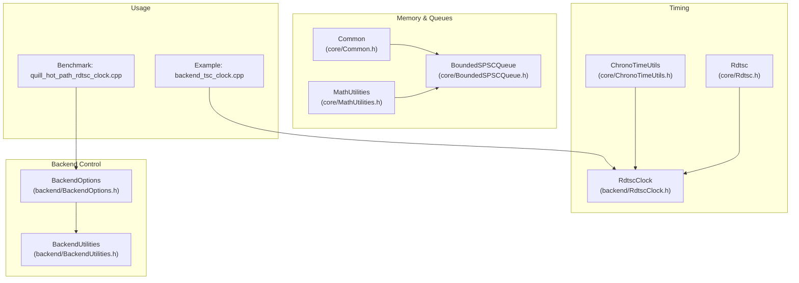
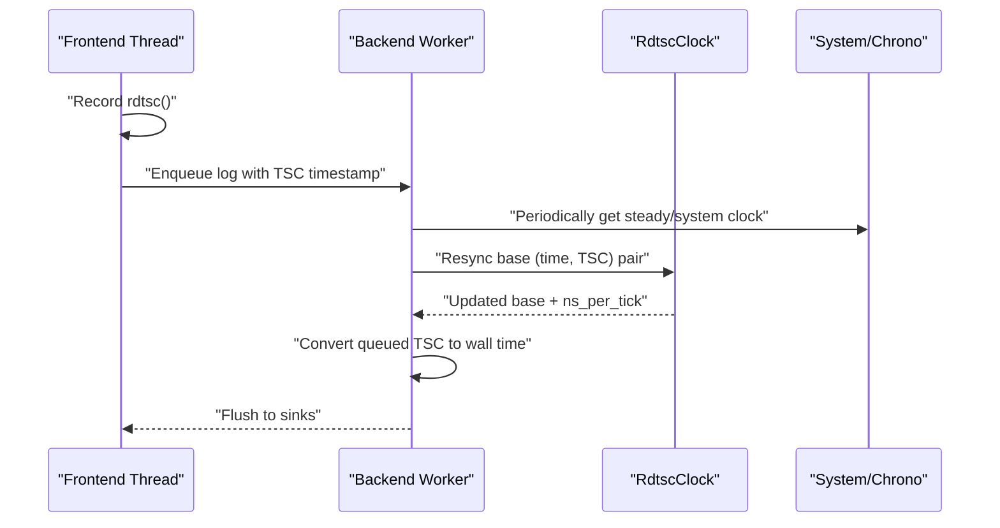
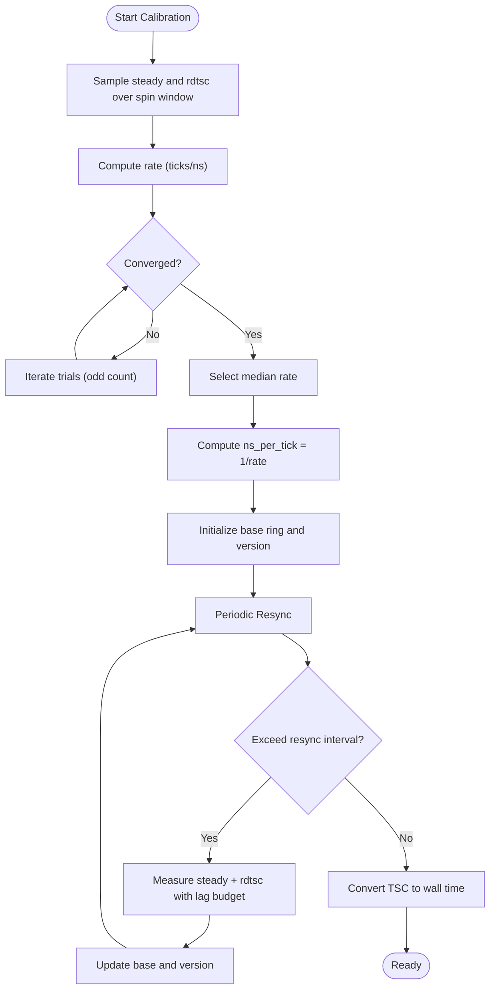
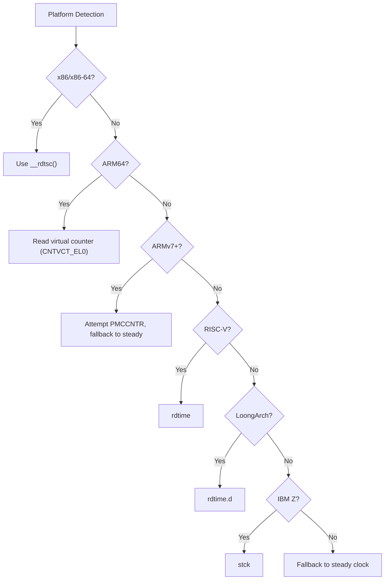
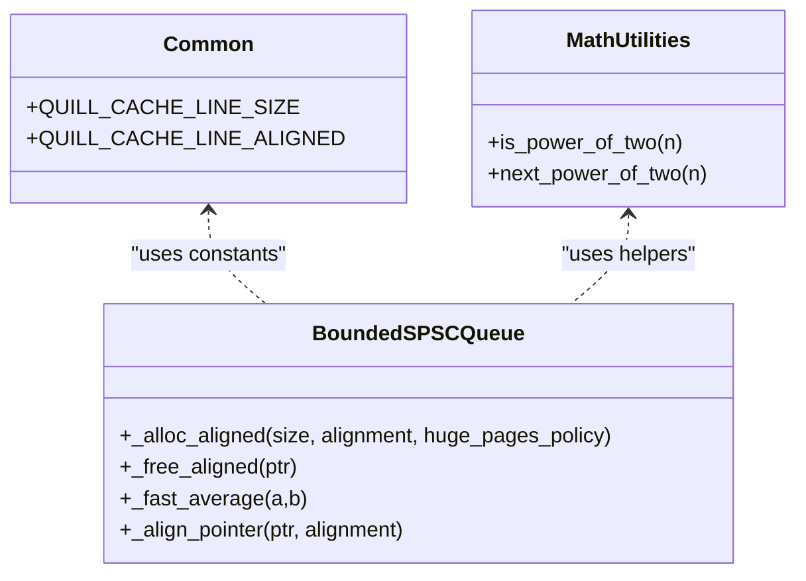
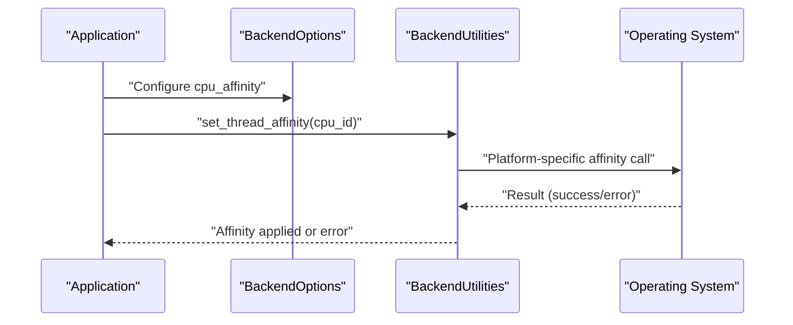
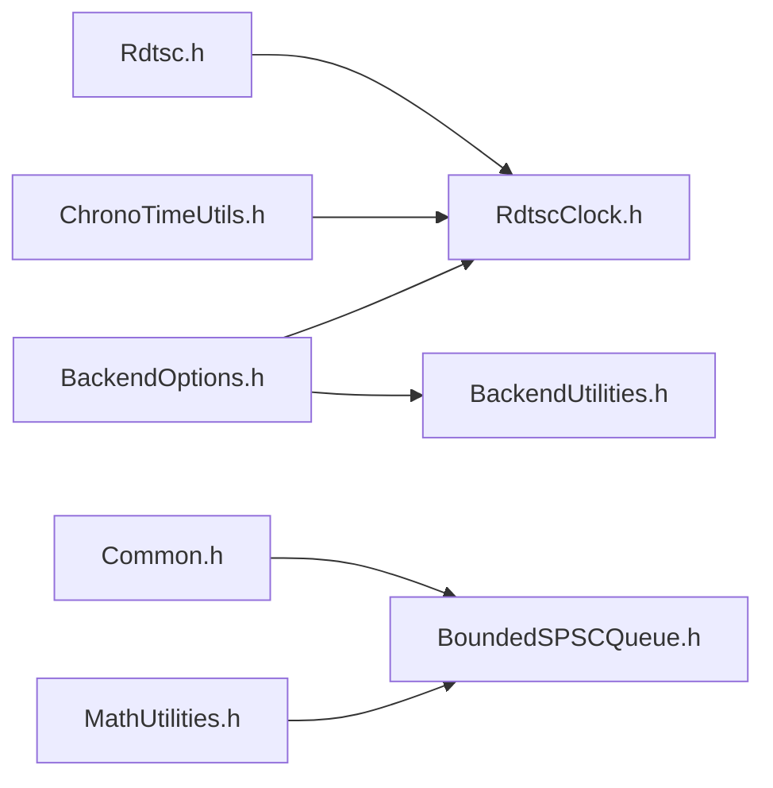

# Hardware-Specific Optimizations

<cite>
**Referenced Files in This Document**
- [RdtscClock.h](file://include/quill/backend/RdtscClock.h)
- [Rdtsc.h](file://include/quill/core/Rdtsc.h)
- [ChronoTimeUtils.h](file://include/quill/core/ChronoTimeUtils.h)
- [Common.h](file://include/quill/core/Common.h)
- [MathUtilities.h](file://include/quill/core/MathUtilities.h)
- [BoundedSPSCQueue.h](file://include/quill/core/BoundedSPSCQueue.h)
- [BackendUtilities.h](file://include/quill/backend/BackendUtilities.h)
- [BackendOptions.h](file://include/quill/backend/BackendOptions.h)
- [backend_tsc_clock.cpp](file://examples/backend_tsc_clock.cpp)
- [quill_hot_path_rdtsc_clock.cpp](file://benchmarks/hot_path_latency/quill_hot_path_rdtsc_clock.cpp)
- [RdtscClockTest.cpp](file://test/unit_tests/RdtscClockTest.cpp)
- [BackendTscClockTest.cpp](file://test/integration_tests/BackendTscClockTest.cpp)
</cite>

## Table of Contents
1. [Introduction](#introduction)
2. [Project Structure](#project-structure)
3. [Core Components](#core-components)
4. [Architecture Overview](#architecture-overview)
5. [Detailed Component Analysis](#detailed-component-analysis)
6. [Dependency Analysis](#dependency-analysis)
7. [Performance Considerations](#performance-considerations)
8. [Troubleshooting Guide](#troubleshooting-guide)
9. [Conclusion](#conclusion)

## Introduction
This document explains Quill’s hardware-specific optimization techniques with a focus on high-resolution timing via TSC (Time Stamp Counter), platform-specific instruction usage, memory layout and access optimizations, NUMA-awareness and CPU affinity, and virtual memory strategies. It also covers how the backend synchronizes TSC-based timestamps with system time, and how users can configure the backend for optimal multi-core scaling and low-latency logging.

## Project Structure
The hardware-related optimizations span a few key areas:
- Timing and synchronization: backend TSC clock, platform-specific rdtsc implementations, and steady/system clock utilities
- Memory and queues: cache-line alignment, flush primitives, and huge page support
- Backend configuration: CPU affinity, resynchronization intervals, and busy-wait/yield policies
- Examples and benchmarks: demonstrating TSC usage and latency measurements

**Diagram sources**
- [RdtscClock.h:36-265](file://include/quill/backend/RdtscClock.h#L36-L265)
- [Rdtsc.h:15-114](file://include/quill/core/Rdtsc.h#L15-L114)
- [ChronoTimeUtils.h:18-28](file://include/quill/core/ChronoTimeUtils.h#L18-L28)
- [Common.h:123-183](file://include/quill/core/Common.h#L123-L183)
- [MathUtilities.h:19-70](file://include/quill/core/MathUtilities.h#L19-L70)
- [BoundedSPSCQueue.h:246-356](file://include/quill/core/BoundedSPSCQueue.h#L246-L356)
- [BackendUtilities.h:56-116](file://include/quill/backend/BackendUtilities.h#L56-L116)
- [BackendOptions.h:30-283](file://include/quill/backend/BackendOptions.h#L30-L283)
- [backend_tsc_clock.cpp:1-63](file://examples/backend_tsc_clock.cpp#L1-L63)
- [quill_hot_path_rdtsc_clock.cpp:32-40](file://benchmarks/hot_path_latency/quill_hot_path_rdtsc_clock.cpp#L32-L40)

**Section sources**
- [RdtscClock.h:36-265](file://include/quill/backend/RdtscClock.h#L36-L265)
- [Rdtsc.h:15-114](file://include/quill/core/Rdtsc.h#L15-L114)
- [Common.h:123-183](file://include/quill/core/Common.h#L123-L183)
- [BoundedSPSCQueue.h:246-356](file://include/quill/core/BoundedSPSCQueue.h#L246-L356)
- [BackendUtilities.h:56-116](file://include/quill/backend/BackendUtilities.h#L56-L116)
- [BackendOptions.h:30-283](file://include/quill/backend/BackendOptions.h#L30-L283)
- [backend_tsc_clock.cpp:1-63](file://examples/backend_tsc_clock.cpp#L1-L63)
- [quill_hot_path_rdtsc_clock.cpp:32-40](file://benchmarks/hot_path_latency/quill_hot_path_rdtsc_clock.cpp#L32-L40)

## Core Components
- Platform-specific TSC acquisition:
  - x86/x86-64: uses standard intrinsic to read TSC
  - ARM64: uses virtual counter register
  - ARMv7 and older: attempts PMCCNTR with fallback to steady clock
  - RISC-V: uses rdtime
  - LoongArch: uses rdtime.d
  - IBM Z (s390x): uses stck
  - Others: falls back to steady clock
- Backend TSC clock:
  - Calibrates ticks-per-nanosecond via repeated steady-clock and rdtsc sampling
  - Maintains a ring of base offsets and versions to avoid frequent resync
  - Provides thread-safe conversion from raw rdtsc to nanoseconds since epoch
- Memory and queue optimizations:
  - Cache-line constants and alignment macros
  - Flush primitives for write-out of cache lines
  - Huge page allocation on Linux with policy controls
- Backend control:
  - CPU affinity setter for Windows/macOS/Linux
  - Resync interval for TSC-to-wall-time synchronization
  - Busy-wait vs yield policy and sleep duration tuning

**Section sources**
- [Rdtsc.h:42-110](file://include/quill/core/Rdtsc.h#L42-L110)
- [RdtscClock.h:42-234](file://include/quill/backend/RdtscClock.h#L42-L234)
- [Common.h:123-131](file://include/quill/core/Common.h#L123-L131)
- [BoundedSPSCQueue.h:210-219](file://include/quill/core/BoundedSPSCQueue.h#L210-L219)
- [BoundedSPSCQueue.h:246-303](file://include/quill/core/BoundedSPSCQueue.h#L246-L303)
- [BackendUtilities.h:56-116](file://include/quill/backend/BackendUtilities.h#L56-L116)
- [BackendOptions.h:147-154](file://include/quill/backend/BackendOptions.h#L147-L154)
- [BackendOptions.h:206-207](file://include/quill/backend/BackendOptions.h#L206-L207)

## Architecture Overview
The backend maintains a synchronized TSC-derived wall-clock. Frontends timestamp with platform rdtsc and optionally use TSC as the clock source. The backend periodically resynchronizes to system time to mitigate drift and maintain monotonicity.

**Diagram sources**
- [RdtscClock.h:119-166](file://include/quill/backend/RdtscClock.h#L119-L166)
- [RdtscClock.h:196-230](file://include/quill/backend/RdtscClock.h#L196-L230)
- [Rdtsc.h:104-110](file://include/quill/core/Rdtsc.h#L104-L110)
- [ChronoTimeUtils.h:18-28](file://include/quill/core/ChronoTimeUtils.h#L18-L28)

## Detailed Component Analysis

### TSC Clock Calibration and Synchronization
- Calibration:
  - Repeatedly samples steady clock and rdtsc over a spin window
  - Computes median ticks-per-nanosecond and derives inverse for conversions
  - Converges early if median stabilizes within threshold
- Synchronization:
  - Maintains a ring buffer of base pairs (base_time, base_tsc)
  - Uses atomic versioning to avoid ABA issues
  - Resyncs when drift exceeds configured interval, with exponential backoff on failure

**Diagram sources**
- [RdtscClock.h:65-113](file://include/quill/backend/RdtscClock.h#L65-L113)
- [RdtscClock.h:196-230](file://include/quill/backend/RdtscClock.h#L196-L230)
- [RdtscClock.h:147-166](file://include/quill/backend/RdtscClock.h#L147-L166)

**Section sources**
- [RdtscClock.h:65-113](file://include/quill/backend/RdtscClock.h#L65-L113)
- [RdtscClock.h:119-166](file://include/quill/backend/RdtscClock.h#L119-L166)
- [RdtscClock.h:196-230](file://include/quill/backend/RdtscClock.h#L196-L230)
- [RdtscClockTest.cpp:10-31](file://test/unit_tests/RdtscClockTest.cpp#L10-L31)

### Platform-Specific TSC Instructions
- x86/x86-64: uses standard intrinsic to read TSC
- ARM64: uses virtual counter register
- ARMv7 and older: attempts PMCCNTR with fallback to steady clock
- RISC-V: rdtime
- LoongArch: rdtime.d
- IBM Z (s390x): stck
- Others: fallback to steady clock

**Diagram sources**
- [Rdtsc.h:15-36](file://include/quill/core/Rdtsc.h#L15-L36)
- [Rdtsc.h:42-110](file://include/quill/core/Rdtsc.h#L42-L110)

**Section sources**
- [Rdtsc.h:15-36](file://include/quill/core/Rdtsc.h#L15-L36)
- [Rdtsc.h:42-110](file://include/quill/core/Rdtsc.h#L42-L110)

### Memory Layout and Access Optimizations
- Cache-line constants and alignment:
  - Defines cache-line size and alignment constants used across the codebase
- Cache-line flush:
  - Uses flush primitive to write out modified cache lines during bulk operations
- Alignment helpers:
  - Pointer alignment and power-of-two sizing utilities
- Huge pages:
  - Linux mmap with optional huge TLB flag and fallback policy

**Diagram sources**
- [Common.h:123-131](file://include/quill/core/Common.h#L123-L131)
- [BoundedSPSCQueue.h:210-219](file://include/quill/core/BoundedSPSCQueue.h#L210-L219)
- [BoundedSPSCQueue.h:228-234](file://include/quill/core/BoundedSPSCQueue.h#L228-L234)
- [BoundedSPSCQueue.h:246-303](file://include/quill/core/BoundedSPSCQueue.h#L246-L303)
- [MathUtilities.h:25-70](file://include/quill/core/MathUtilities.h#L25-L70)

**Section sources**
- [Common.h:123-131](file://include/quill/core/Common.h#L123-L131)
- [BoundedSPSCQueue.h:210-219](file://include/quill/core/BoundedSPSCQueue.h#L210-L219)
- [BoundedSPSCQueue.h:228-234](file://include/quill/core/BoundedSPSCQueue.h#L228-L234)
- [BoundedSPSCQueue.h:246-303](file://include/quill/core/BoundedSPSCQueue.h#L246-L303)
- [MathUtilities.h:25-70](file://include/quill/core/MathUtilities.h#L25-L70)

### NUMA Awareness, CPU Affinity, and Multi-Core Scaling
- CPU affinity:
  - Cross-platform setter for backend thread affinity
  - Windows: SetThreadAffinityMask
  - macOS: thread affinity policy
  - Linux/BSD: sched_setaffinity/pthread_setaffinity
- Backend options:
  - cpu_affinity field to pin backend thread
  - enable_yield_when_idle and sleep_duration tune busy-wait behavior
  - log_timestamp_ordering_grace_period balances ordering correctness and throughput
- Example usage:
  - Benchmarks demonstrate setting backend cpu_affinity

**Diagram sources**
- [BackendOptions.h:147-154](file://include/quill/backend/BackendOptions.h#L147-L154)
- [BackendUtilities.h:56-116](file://include/quill/backend/BackendUtilities.h#L56-L116)
- [quill_hot_path_rdtsc_clock.cpp:32-37](file://benchmarks/hot_path_latency/quill_hot_path_rdtsc_clock.cpp#L32-L37)

**Section sources**
- [BackendUtilities.h:56-116](file://include/quill/backend/BackendUtilities.h#L56-L116)
- [BackendOptions.h:147-154](file://include/quill/backend/BackendOptions.h#L147-L154)
- [quill_hot_path_rdtsc_clock.cpp:32-37](file://benchmarks/hot_path_latency/quill_hot_path_rdtsc_clock.cpp#L32-L37)

### Virtual Memory and Huge Page Support
- Allocation:
  - Linux: mmap with MAP_HUGETLB flag controlled by HugePagesPolicy
  - Fallback to normal pages when Try fails
  - Windows: uses aligned allocation
- Metadata:
  - Stores original allocation size and offset for proper free

**Section sources**
- [BoundedSPSCQueue.h:267-283](file://include/quill/core/BoundedSPSCQueue.h#L267-L283)
- [BoundedSPSCQueue.h:285-303](file://include/quill/core/BoundedSPSCQueue.h#L285-L303)
- [Common.h:174-180](file://include/quill/core/Common.h#L174-L180)

### Example: Using Backend TSC Clock
- Demonstrates retrieving backend TSC epoch time and converting raw TSC counts to wall times
- Shows how to synchronize application timestamps with backend timestamps

**Section sources**
- [backend_tsc_clock.cpp:35-62](file://examples/backend_tsc_clock.cpp#L35-L62)
- [BackendTscClockTest.cpp:48-62](file://test/integration_tests/BackendTscClockTest.cpp#L48-L62)

## Dependency Analysis
- RdtscClock depends on:
  - Platform rdtsc implementation for raw counts
  - Steady/system clocks for calibration and resync
- BoundedSPSCQueue depends on:
  - Common cache-line constants
  - Math utilities for alignment and sizing
- BackendUtilities depends on:
  - Platform threading APIs for affinity
- BackendOptions coordinates:
  - CPU affinity, resync interval, and scheduling policies

**Diagram sources**
- [Rdtsc.h:15-36](file://include/quill/core/Rdtsc.h#L15-L36)
- [RdtscClock.h:10-21](file://include/quill/backend/RdtscClock.h#L10-L21)
- [ChronoTimeUtils.h:18-28](file://include/quill/core/ChronoTimeUtils.h#L18-L28)
- [Common.h:123-131](file://include/quill/core/Common.h#L123-L131)
- [MathUtilities.h:19-70](file://include/quill/core/MathUtilities.h#L19-L70)
- [BoundedSPSCQueue.h:246-303](file://include/quill/core/BoundedSPSCQueue.h#L246-L303)
- [BackendOptions.h:147-154](file://include/quill/backend/BackendOptions.h#L147-L154)
- [BackendUtilities.h:56-116](file://include/quill/backend/BackendUtilities.h#L56-L116)

**Section sources**
- [RdtscClock.h:10-21](file://include/quill/backend/RdtscClock.h#L10-L21)
- [Rdtsc.h:15-36](file://include/quill/core/Rdtsc.h#L15-L36)
- [Common.h:123-131](file://include/quill/core/Common.h#L123-L131)
- [MathUtilities.h:19-70](file://include/quill/core/MathUtilities.h#L19-L70)
- [BoundedSPSCQueue.h:246-303](file://include/quill/core/BoundedSPSCQueue.h#L246-L303)
- [BackendOptions.h:147-154](file://include/quill/backend/BackendOptions.h#L147-L154)
- [BackendUtilities.h:56-116](file://include/quill/backend/BackendUtilities.h#L56-L116)

## Performance Considerations
- TSC calibration:
  - Early convergence reduces overhead; median selection improves robustness
- Resync strategy:
  - Exponential backoff increases resync interval on failure to reduce contention
- Cache-line alignment:
  - Aligns producer/consumer positions and flushes to minimize false sharing
- Busy-wait tuning:
  - enable_yield_when_idle and sleep_duration balance CPU usage and latency
- Huge pages:
  - Reduces TLB pressure and improves throughput on large allocations

[No sources needed since this section provides general guidance]

## Troubleshooting Guide
- TSC synchronization failures:
  - Backend logs a warning when resync fails twice; expect timestamps to drift until next successful resync
- CPU affinity errors:
  - Platform-specific errors are surfaced via exceptions; verify permissions and core IDs
- Validation:
  - Unit and integration tests confirm TSC-to-wall-time bounds and backend synchronization

**Section sources**
- [RdtscClock.h:136-143](file://include/quill/backend/RdtscClock.h#L136-L143)
- [BackendUtilities.h:63-70](file://include/quill/backend/BackendUtilities.h#L63-L70)
- [BackendUtilities.h:110-115](file://include/quill/backend/BackendUtilities.h#L110-L115)
- [RdtscClockTest.cpp:33-47](file://test/unit_tests/RdtscClockTest.cpp#L33-L47)
- [BackendTscClockTest.cpp:45-65](file://test/integration_tests/BackendTscClockTest.cpp#L45-L65)

## Conclusion
Quill’s hardware optimizations center on precise, platform-aware timing and efficient memory/data-path handling. The backend’s TSC clock provides high-resolution, synchronized timestamps with robust calibration and resync logic. Memory utilities enforce cache-line alignment and support huge pages for large buffers. Backend options expose CPU affinity and scheduling knobs for predictable, scalable multi-core operation. Together, these techniques deliver low-latency, high-throughput logging across diverse platforms.