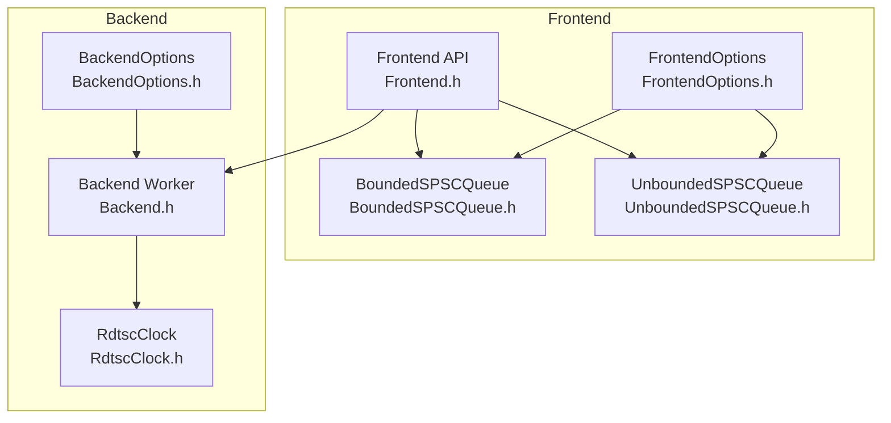
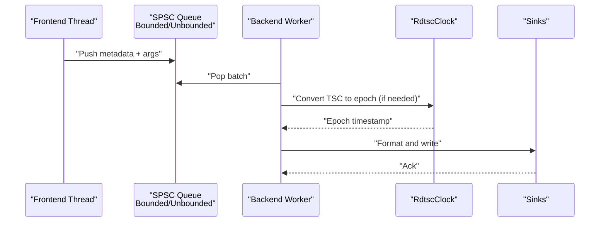
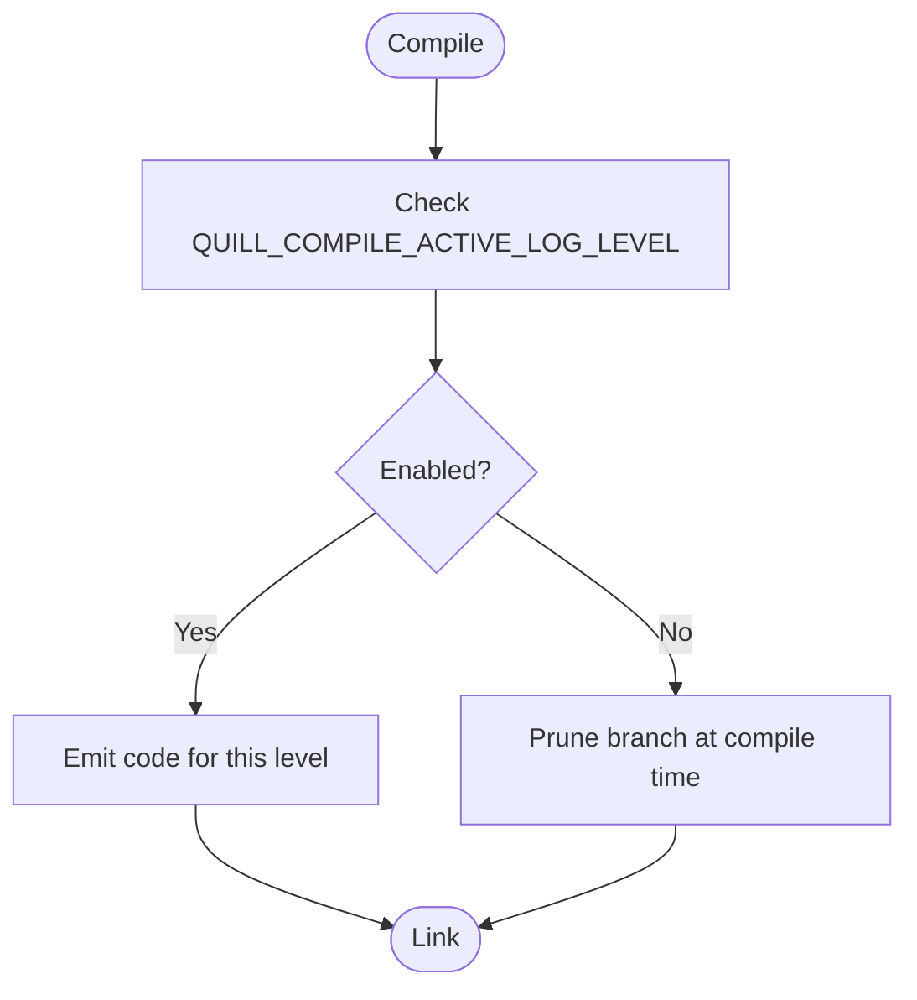
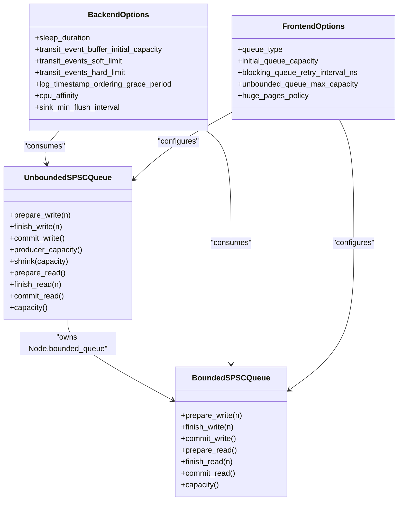
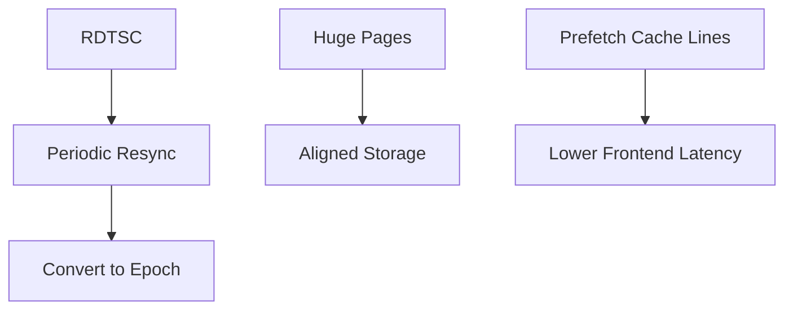
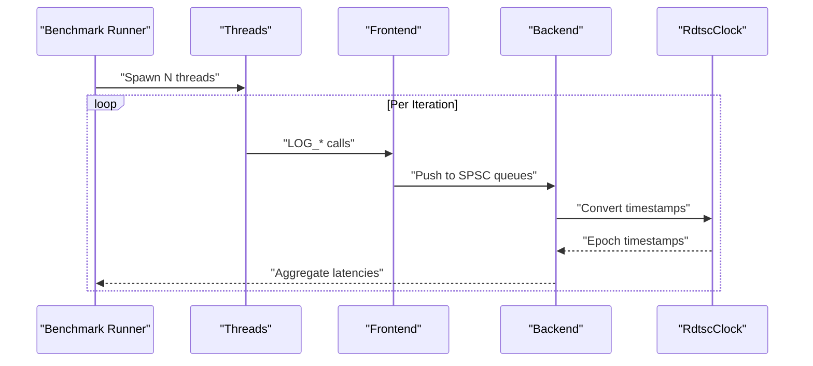
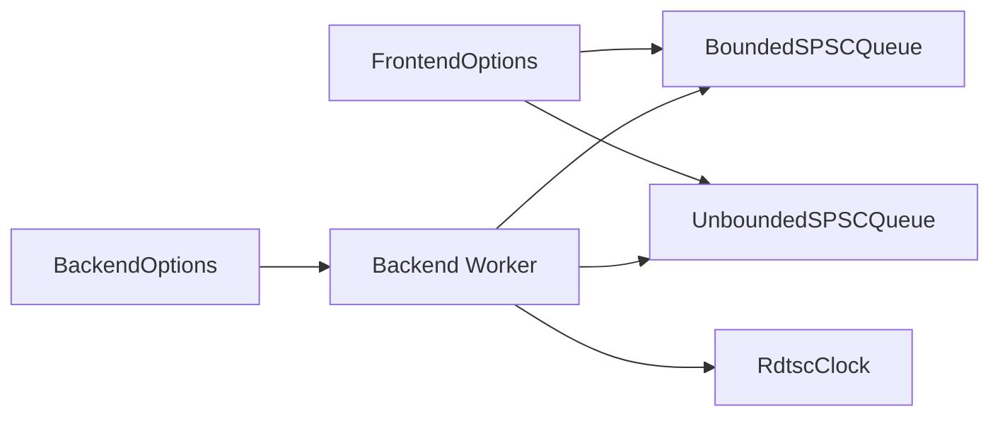

# Performance Optimization

<cite>
**Referenced Files in This Document**
- [README.md](file://README.md)
- [Frontend.h](file://include/quill/Frontend.h)
- [Backend.h](file://include/quill/Backend.h)
- [BoundedSPSCQueue.h](file://include/quill/core/BoundedSPSCQueue.h)
- [UnboundedSPSCQueue.h](file://include/quill/core/UnboundedSPSCQueue.h)
- [RdtscClock.h](file://include/quill/backend/RdtscClock.h)
- [LogMacros.h](file://include/quill/LogMacros.h)
- [LogFunctions.h](file://include/quill/LogFunctions.h)
- [FrontendOptions.h](file://include/quill/core/FrontendOptions.h)
- [BackendOptions.h](file://include/quill/backend/BackendOptions.h)
- [hot_path_bench.h](file://benchmarks/hot_path_latency/hot_path_bench.h)
- [hot_path_bench_config.h](file://benchmarks/hot_path_latency/hot_path_bench_config.h)
- [quill_backend_throughput.cpp](file://benchmarks/backend_throughput/quill_backend_throughput.cpp)
- [compile_time_bench.cpp](file://benchmarks/compile_time/compile_time_bench.cpp)
</cite>

## Table of Contents
1. [Introduction](#introduction)
2. [Project Structure](#project-structure)
3. [Core Components](#core-components)
4. [Architecture Overview](#architecture-overview)
5. [Detailed Component Analysis](#detailed-component-analysis)
6. [Dependency Analysis](#dependency-analysis)
7. [Performance Considerations](#performance-considerations)
8. [Troubleshooting Guide](#troubleshooting-guide)
9. [Conclusion](#conclusion)
10. [Appendices](#appendices)

## Introduction
This document provides a comprehensive guide to optimizing Quill’s high-performance logging pipeline. It covers compile-time optimizations (log level filtering, macro-free mode, template specialization), runtime tuning (queues, memory allocation, CPU scheduling), benchmarking methodologies, hardware-specific optimizations (TSC clock, huge pages, cache-friendly layouts), latency and throughput strategies, and continuous performance evaluation. The goal is to help users achieve optimal latency and throughput while minimizing overhead and memory footprint.

## Project Structure
Quill’s performance-critical subsystems are organized into:
- Frontend: lightweight logging API with minimal headers and fast SPSC queues per thread
- Backend: dedicated worker thread for formatting and I/O with tunable batching and ordering
- Core queues: lock-free bounded and unbounded SPSC queues with cache-line alignment and optional huge pages
- Clocking: RDTSC-based clock with periodic resynchronization for epoch conversion
- Benchmarks: latency, throughput, and compile-time performance suites

**Diagram sources**
- [Frontend.h:1-373](file://include/quill/Frontend.h#L1-L373)
- [Backend.h:1-246](file://include/quill/Backend.h#L1-L246)
- [BoundedSPSCQueue.h:1-356](file://include/quill/core/BoundedSPSCQueue.h#L1-L356)
- [UnboundedSPSCQueue.h:1-345](file://include/quill/core/UnboundedSPSCQueue.h#L1-L345)
- [RdtscClock.h:1-265](file://include/quill/backend/RdtscClock.h#L1-L265)
- [FrontendOptions.h:1-52](file://include/quill/core/FrontendOptions.h#L1-L52)
- [BackendOptions.h:1-283](file://include/quill/backend/BackendOptions.h#L1-L283)

**Section sources**
- [README.md:223-462](file://README.md#L223-L462)

## Core Components
- Frontend API: exposes logger creation, sink management, and queue introspection. It supports shrinking unbounded queues and retrieving capacities for monitoring.
- Backend worker: runs a dedicated thread that drains frontend queues, orders messages by timestamp, formats, and writes to sinks.
- Queues: BoundedSPSCQueue uses a ring buffer with cache-line-aligned storage and optional huge pages; UnboundedSPSCQueue dynamically grows nodes and supports shrinking.
- Clocking: RdtscClock converts TSC ticks to epoch time with periodic resync and provides a thread-safe conversion path.
- Options: FrontendOptions controls queue type, capacity, retry intervals, and huge pages policy. BackendOptions controls thread name, yielding, sleep duration, transit buffer sizes, ordering grace period, CPU affinity, and flush intervals.

**Section sources**
- [Frontend.h:39-111](file://include/quill/Frontend.h#L39-L111)
- [Backend.h:36-171](file://include/quill/Backend.h#L36-L171)
- [BoundedSPSCQueue.h:54-196](file://include/quill/core/BoundedSPSCQueue.h#L54-L196)
- [UnboundedSPSCQueue.h:42-240](file://include/quill/core/UnboundedSPSCQueue.h#L42-L240)
- [RdtscClock.h:36-193](file://include/quill/backend/RdtscClock.h#L36-L193)
- [FrontendOptions.h:16-50](file://include/quill/core/FrontendOptions.h#L16-L50)
- [BackendOptions.h:30-281](file://include/quill/backend/BackendOptions.h#L30-L281)

## Architecture Overview
The hot path is designed for minimal overhead:
- Frontend thread pushes a small metadata header and serialized arguments into a per-thread SPSC queue
- Backend worker atomically advances positions and processes batches, applying formatting and writing to sinks
- Optional TSC timestamps are converted to epoch time via RdtscClock with periodic resync

**Diagram sources**
- [Frontend.h:148-198](file://include/quill/Frontend.h#L148-L198)
- [Backend.h:36-171](file://include/quill/Backend.h#L36-L171)
- [BoundedSPSCQueue.h:105-169](file://include/quill/core/BoundedSPSCQueue.h#L105-L169)
- [UnboundedSPSCQueue.h:115-223](file://include/quill/core/UnboundedSPSCQueue.h#L115-L223)
- [RdtscClock.h:147-193](file://include/quill/backend/RdtscClock.h#L147-L193)

## Detailed Component Analysis

### Compile-Time Optimizations
- Log level filtering: compile-time elimination of disabled log levels reduces branches and metadata instances. Configure via a compile-time macro to disable levels equal to or above a threshold.
- Macro-free mode: convenience API without macros trades off runtime metadata copying, argument evaluation, and compile-time removal. Prefer macros for hot paths.

**Diagram sources**
- [LogMacros.h:14-45](file://include/quill/LogMacros.h#L14-L45)
- [LogFunctions.h:21-48](file://include/quill/LogFunctions.h#L21-L48)

**Section sources**
- [LogMacros.h:14-45](file://include/quill/LogMacros.h#L14-L45)
- [LogFunctions.h:21-48](file://include/quill/LogFunctions.h#L21-L48)

### Runtime Performance Tuning
- Queue configuration:
  - Bounded vs Unbounded: bounded queues never reallocate; unbounded queues grow and can shrink to reduce memory usage post-burst.
  - Blocking vs Dropping: bounded blocking yields when full; bounded dropping drops messages when full; unbounded blocking retries; unbounded dropping grows until max capacity.
  - Huge pages: enable on Linux to reduce TLB pressure for hot queues.
- Memory allocation strategies:
  - Bounded queue uses aligned allocations with optional huge pages; unbounded queue allocates nodes on demand and supports shrinking.
  - Monitor and shrink queues on idle threads to reclaim memory.
- CPU scheduling optimization:
  - Backend sleep duration and yielding; CPU affinity for backend thread; grace period for strict timestamp ordering.

**Diagram sources**
- [BoundedSPSCQueue.h:54-196](file://include/quill/core/BoundedSPSCQueue.h#L54-L196)
- [UnboundedSPSCQueue.h:42-240](file://include/quill/core/UnboundedSPSCQueue.h#L42-L240)
- [BackendOptions.h:30-281](file://include/quill/backend/BackendOptions.h#L30-L281)
- [FrontendOptions.h:16-50](file://include/quill/core/FrontendOptions.h#L16-L50)

**Section sources**
- [Frontend.h:45-111](file://include/quill/Frontend.h#L45-L111)
- [BoundedSPSCQueue.h:54-196](file://include/quill/core/BoundedSPSCQueue.h#L54-L196)
- [UnboundedSPSCQueue.h:79-183](file://include/quill/core/UnboundedSPSCQueue.h#L79-L183)
- [BackendOptions.h:30-281](file://include/quill/backend/BackendOptions.h#L30-L281)
- [FrontendOptions.h:16-50](file://include/quill/core/FrontendOptions.h#L16-L50)

### Hardware-Specific Optimizations
- TSC clock usage: RDTSC provides high-resolution timestamps; BackendOptions supports TSC-based clocks with periodic resync to system time.
- Huge pages: BoundedSPSCQueue supports huge pages on Linux to reduce TLB misses; configure via FrontendOptions.
- Cache-friendly layouts: queues use cache-line alignment and prefetching on x86 architectures.

**Diagram sources**
- [RdtscClock.h:119-193](file://include/quill/backend/RdtscClock.h#L119-L193)
- [BoundedSPSCQueue.h:60-94](file://include/quill/core/BoundedSPSCQueue.h#L60-L94)
- [BackendOptions.h:206-207](file://include/quill/backend/BackendOptions.h#L206-L207)

**Section sources**
- [RdtscClock.h:36-193](file://include/quill/backend/RdtscClock.h#L36-L193)
- [BoundedSPSCQueue.h:60-94](file://include/quill/core/BoundedSPSCQueue.h#L60-L94)
- [BackendOptions.h:206-207](file://include/quill/backend/BackendOptions.h#L206-L207)

### Benchmarking Methodologies and Measurement
- Hot-path latency: measures per-message latency across 1/4 threads; uses RDTSC-derived timing and thread affinities; reports percentiles.
- Throughput: measures messages per second over a large iteration count; configures backend sleep and ordering grace period.
- Compile-time: compiles a large number of log statements to assess macro expansion and template instantiation costs.

**Diagram sources**
- [hot_path_bench.h:61-124](file://benchmarks/hot_path_latency/hot_path_bench.h#L61-L124)
- [hot_path_bench_config.h:19-37](file://benchmarks/hot_path_latency/hot_path_bench_config.h#L19-L37)
- [quill_backend_throughput.cpp:14-68](file://benchmarks/backend_throughput/quill_backend_throughput.cpp#L14-L68)
- [compile_time_bench.cpp:1-800](file://benchmarks/compile_time/compile_time_bench.cpp#L1-L800)

**Section sources**
- [hot_path_bench.h:61-124](file://benchmarks/hot_path_latency/hot_path_bench.h#L61-L124)
- [hot_path_bench_config.h:19-37](file://benchmarks/hot_path_latency/hot_path_bench_config.h#L19-L37)
- [quill_backend_throughput.cpp:14-68](file://benchmarks/backend_throughput/quill_backend_throughput.cpp#L14-L68)
- [compile_time_bench.cpp:1-800](file://benchmarks/compile_time/compile_time_bench.cpp#L1-L800)

### Latency Optimization Techniques
- Use macros for compile-time filtering and zero-cost branches
- Pin backend thread to a dedicated CPU and minimize contention
- Reduce frontend-to-backend queue pressure by tuning sleep duration and grace period
- Enable huge pages for queues on Linux to reduce TLB misses
- Keep log messages concise and avoid expensive argument evaluation

### Throughput Maximization Strategies
- Prefer unbounded queues with bounded growth to avoid drops under bursty loads
- Increase initial queue capacity and adjust retry intervals for blocking modes
- Tune backend sleep duration and enabling yielding to balance CPU usage and latency
- Use minimal formatting and avoid unnecessary sinks for high-throughput scenarios

### Memory Usage Minimization Approaches
- Shrink unbounded queues after bursts to reclaim memory
- Use bounded queues for predictable memory footprints
- Disable huge pages if memory pressure is high and TLB benefits are negligible

## Dependency Analysis
Key dependencies and interactions:
- FrontendOptions drives queue sizing and huge pages policy
- BackendOptions controls backend behavior, ordering, and flush policies
- Bounded/Unbounded queues depend on platform-specific memory allocation and alignment
- RdtscClock depends on CPU cycle counters and periodic resync

**Diagram sources**
- [FrontendOptions.h:16-50](file://include/quill/core/FrontendOptions.h#L16-L50)
- [BackendOptions.h:30-281](file://include/quill/backend/BackendOptions.h#L30-L281)
- [BoundedSPSCQueue.h:54-196](file://include/quill/core/BoundedSPSCQueue.h#L54-L196)
- [UnboundedSPSCQueue.h:42-240](file://include/quill/core/UnboundedSPSCQueue.h#L42-L240)
- [RdtscClock.h:36-193](file://include/quill/backend/RdtscClock.h#L36-L193)

**Section sources**
- [FrontendOptions.h:16-50](file://include/quill/core/FrontendOptions.h#L16-L50)
- [BackendOptions.h:30-281](file://include/quill/backend/BackendOptions.h#L30-L281)
- [BoundedSPSCQueue.h:54-196](file://include/quill/core/BoundedSPSCQueue.h#L54-L196)
- [UnboundedSPSCQueue.h:42-240](file://include/quill/core/UnboundedSPSCQueue.h#L42-L240)
- [RdtscClock.h:36-193](file://include/quill/backend/RdtscClock.h#L36-L193)

## Performance Considerations
- Choose macro-based logging for hot paths to eliminate runtime metadata overhead
- Use TSC clocks for sub-nanosecond resolution; tune resync interval to balance accuracy and overhead
- Adjust backend sleep duration and yielding to reduce CPU contention while maintaining responsiveness
- Monitor queue capacities and shrink unbounded queues to control memory usage
- Use huge pages on Linux for large queues to reduce TLB misses

## Troubleshooting Guide
Common issues and remedies:
- Frontend queue pressure causing drops or blocking: increase initial capacity, tune retry intervals, or switch to dropping mode
- Out-of-order timestamps: increase grace period or disable strict ordering for lower overhead
- Backend thread starved: reduce sleep duration, enable yielding, or adjust CPU affinity
- High memory usage: shrink unbounded queues, switch to bounded queues, or disable huge pages

**Section sources**
- [Frontend.h:45-111](file://include/quill/Frontend.h#L45-L111)
- [BackendOptions.h:49-132](file://include/quill/backend/BackendOptions.h#L49-L132)
- [BoundedSPSCQueue.h:60-94](file://include/quill/core/BoundedSPSCQueue.h#L60-L94)
- [UnboundedSPSCQueue.h:166-183](file://include/quill/core/UnboundedSPSCQueue.h#L166-L183)

## Conclusion
Quill’s performance hinges on a lock-free frontend-to-backend pipeline, configurable queues, and precise clock synchronization. Optimal results come from combining compile-time filtering, careful queue sizing, CPU scheduling tuning, and hardware-aware memory strategies. Benchmarks provide reproducible measurements for latency and throughput, enabling continuous performance evaluation and regression detection.

## Appendices
- Platform-specific notes:
  - Linux: huge pages supported for queues; CPU affinity and NUMA awareness recommended
  - Windows: backend thread naming and signal handling differ; ensure proper initialization
- Compiler-specific notes:
  - Clang/GCC: use compile-time filtering macros and avoid unnecessary instantiations
- Deployment-specific tuning:
  - Isolate backend thread on a dedicated core; reduce interrupts and CPU frequency scaling for consistent latency