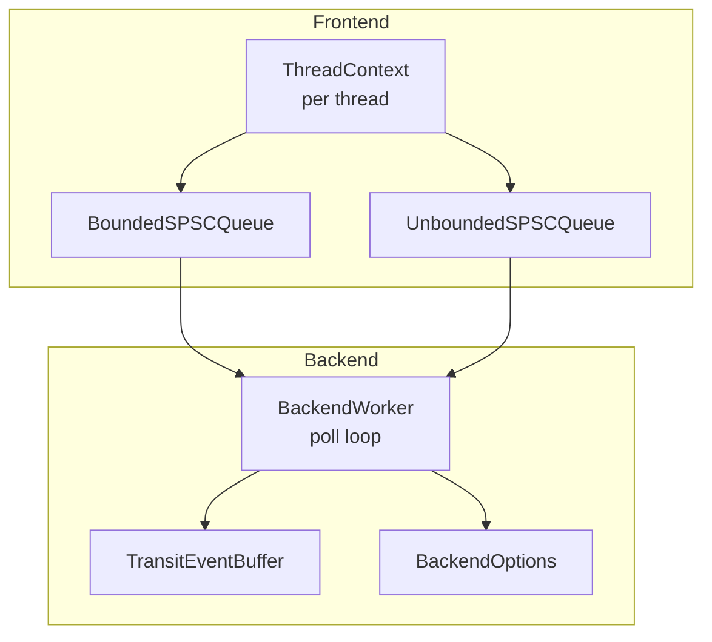
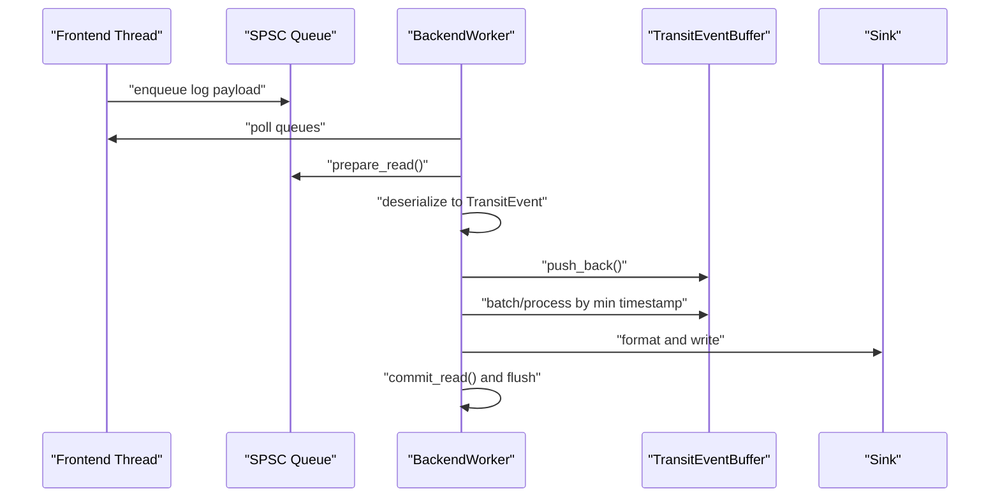
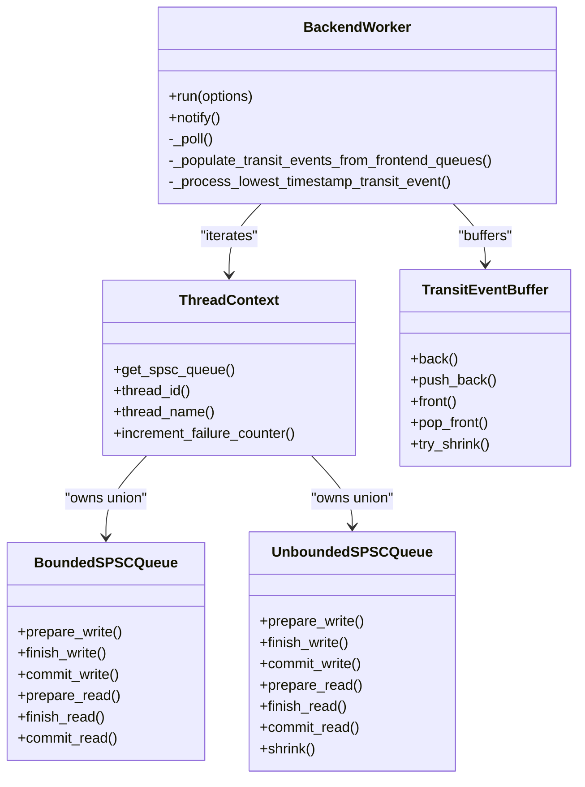

# Runtime Performance Tuning

<cite>
**Referenced Files in This Document**
- [BackendOptions.h](file://include/quill/backend/BackendOptions.h)
- [FrontendOptions.h](file://include/quill/core/FrontendOptions.h)
- [BoundedSPSCQueue.h](file://include/quill/core/BoundedSPSCQueue.h)
- [UnboundedSPSCQueue.h](file://include/quill/core/UnboundedSPSCQueue.h)
- [ThreadContextManager.h](file://include/quill/core/ThreadContextManager.h)
- [BackendWorker.h](file://include/quill/backend/BackendWorker.h)
- [TransitEventBuffer.h](file://include/quill/backend/TransitEventBuffer.h)
- [Common.h](file://include/quill/core/Common.h)
- [MathUtilities.h](file://include/quill/core/MathUtilities.h)
- [RdtscClock.h](file://include/quill/backend/RdtscClock.h)
- [hot_path_bench.h](file://benchmarks/hot_path_latency/hot_path_bench.h)
- [quill_backend_throughput.cpp](file://benchmarks/backend_throughput/quill_backend_throughput.cpp)
- [bounded_dropping_queue_frontend.cpp](file://examples/bounded_dropping_queue_frontend.cpp)
</cite>

## Table of Contents
1. [Introduction](#introduction)
2. [Project Structure](#project-structure)
3. [Core Components](#core-components)
4. [Architecture Overview](#architecture-overview)
5. [Detailed Component Analysis](#detailed-component-analysis)
6. [Dependency Analysis](#dependency-analysis)
7. [Performance Considerations](#performance-considerations)
8. [Troubleshooting Guide](#troubleshooting-guide)
9. [Conclusion](#conclusion)
10. [Appendices](#appendices)

## Introduction
This document explains Quill’s runtime performance tuning capabilities with a focus on queue configuration, thread context management, memory management, CPU scheduling, runtime metrics, and practical tuning guidelines. It synthesizes the implementation details from the backend and frontend queues, thread-local context management, and backend worker behavior to help you optimize throughput, latency, and resource usage across diverse workloads and CPU architectures.

## Project Structure
Quill’s performance-critical path spans:
- Frontend: per-thread SPSC queues (bounded and unbounded) and thread-local context management
- Backend: a dedicated worker thread that polls queues, buffers events, formats, and flushes to sinks
- Utilities: CPU affinity helpers, RDTSC synchronization, math utilities for capacities, and performance benchmarks

**Diagram sources**
- [ThreadContextManager.h:53-214](file://include/quill/core/ThreadContextManager.h#L53-L214)
- [BoundedSPSCQueue.h:54-356](file://include/quill/core/BoundedSPSCQueue.h#L54-L356)
- [UnboundedSPSCQueue.h:42-345](file://include/quill/core/UnboundedSPSCQueue.h#L42-L345)
- [BackendWorker.h:305-395](file://include/quill/backend/BackendWorker.h#L305-L395)
- [TransitEventBuffer.h:19-162](file://include/quill/backend/TransitEventBuffer.h#L19-L162)
- [BackendOptions.h:30-281](file://include/quill/backend/BackendOptions.h#L30-L281)

**Section sources**
- [ThreadContextManager.h:53-214](file://include/quill/core/ThreadContextManager.h#L53-L214)
- [BoundedSPSCQueue.h:54-356](file://include/quill/core/BoundedSPSCQueue.h#L54-L356)
- [UnboundedSPSCQueue.h:42-345](file://include/quill/core/UnboundedSPSCQueue.h#L42-L345)
- [BackendWorker.h:305-395](file://include/quill/backend/BackendWorker.h#L305-L395)
- [TransitEventBuffer.h:19-162](file://include/quill/backend/TransitEventBuffer.h#L19-L162)
- [BackendOptions.h:30-281](file://include/quill/backend/BackendOptions.h#L30-L281)

## Core Components
- Queue configuration: choose between bounded and unbounded SPSC queues, configure capacities, and tune blocking/dropping policies.
- Thread context management: per-thread thread-local context with cached thread identity and queue unions for efficient access.
- Backend worker: polling loop with configurable sleep/yield, strict timestamp ordering grace period, and hooks for instrumentation.
- Transit event buffering: unbounded per-thread buffers that expand as needed and shrink when idle.
- Memory utilities: cache-line alignment, huge pages policy, and math utilities for power-of-two capacities.

**Section sources**
- [FrontendOptions.h:16-52](file://include/quill/core/FrontendOptions.h#L16-L52)
- [BoundedSPSCQueue.h:54-356](file://include/quill/core/BoundedSPSCQueue.h#L54-L356)
- [UnboundedSPSCQueue.h:42-345](file://include/quill/core/UnboundedSPSCQueue.h#L42-L345)
- [ThreadContextManager.h:53-214](file://include/quill/core/ThreadContextManager.h#L53-L214)
- [BackendWorker.h:305-395](file://include/quill/backend/BackendWorker.h#L305-L395)
- [TransitEventBuffer.h:19-162](file://include/quill/backend/TransitEventBuffer.h#L19-L162)
- [Common.h:129-183](file://include/quill/core/Common.h#L129-L183)
- [MathUtilities.h:19-73](file://include/quill/core/MathUtilities.h#L19-L73)

## Architecture Overview
The runtime pipeline:
- Each frontend thread owns a queue (bounded or unbounded) and a ThreadContext.
- The backend worker periodically polls all ThreadContexts, deserializes log messages into TransitEvents, enforces timestamp ordering, formats, and writes to sinks.
- The worker supports CPU affinity, sleep/yield strategies, and flush intervals.

**Diagram sources**
- [BackendWorker.h:479-573](file://include/quill/backend/BackendWorker.h#L479-L573)
- [BackendWorker.h:795-864](file://include/quill/backend/BackendWorker.h#L795-L864)
- [TransitEventBuffer.h:72-98](file://include/quill/backend/TransitEventBuffer.h#L72-L98)
- [BoundedSPSCQueue.h:147-169](file://include/quill/core/BoundedSPSCQueue.h#L147-L169)
- [UnboundedSPSCQueue.h:190-223](file://include/quill/core/UnboundedSPSCQueue.h#L190-L223)

## Detailed Component Analysis

### Queue Configuration Options: Bounded vs Unbounded
- BoundedSPSCQueue
  - Fixed-capacity ring buffer with power-of-two sizing and cache-line aligned positions.
  - Supports huge pages policy on Linux via mmap with MAP_HUGETLB.
  - Uses clflush/prefetch intrinsics on x86 to improve cache behavior.
  - Capacity must be a power of two; enforced by math utilities.
- UnboundedSPSCQueue
  - Linked list of bounded nodes; doubles capacity on overflow up to a configurable maximum.
  - Supports shrinking the queue to a smaller power-of-two capacity.
  - Provides blocking or dropping semantics depending on the queue type selected via FrontendOptions.

Key tunables:
- initial_queue_capacity (FrontendOptions)
- unbounded_queue_max_capacity (FrontendOptions)
- blocking_queue_retry_interval_ns (FrontendOptions)
- huge_pages_policy (FrontendOptions)

Operational notes:
- BoundedDropping queues increment a failure counter when dropping; the backend periodically reports drops.
- Unbounded queues can reallocate nodes and commit writes atomically before switching to a new node.

**Section sources**
- [BoundedSPSCQueue.h:54-356](file://include/quill/core/BoundedSPSCQueue.h#L54-L356)
- [UnboundedSPSCQueue.h:42-345](file://include/quill/core/UnboundedSPSCQueue.h#L42-L345)
- [FrontendOptions.h:16-52](file://include/quill/core/FrontendOptions.h#L16-L52)
- [MathUtilities.h:19-73](file://include/quill/core/MathUtilities.h#L19-L73)
- [BackendWorker.h:1074-1105](file://include/quill/backend/BackendWorker.h#L1074-L1105)

### Thread Context Management Optimization
- ThreadContext encapsulates:
  - A union of either BoundedSPSCQueue or UnboundedSPSCQueue for the owning thread.
  - A per-thread cached thread_id and thread_name.
  - A shared pointer to a per-thread TransitEventBuffer.
  - A failure counter for bounded queues (dropping/blocking).
- ThreadContextManager maintains a registry of contexts, supports registering/unregistering, and tracks invalid contexts.
- ScopedThreadContext creates a thread-local ThreadContext and registers it automatically.

Optimization highlights:
- Per-thread thread-local storage reduces contention and improves locality.
- Cached thread identity avoids repeated system calls.
- Shared TransitEventBuffer per thread minimizes allocations and improves cache locality.

**Section sources**
- [ThreadContextManager.h:53-214](file://include/quill/core/ThreadContextManager.h#L53-L214)
- [ThreadContextManager.h:216-338](file://include/quill/core/ThreadContextManager.h#L216-L338)
- [ThreadContextManager.h:405-422](file://include/quill/core/ThreadContextManager.h#L405-L422)

### Memory Management Techniques
- Cache-line alignment and padding:
  - Atomic writer/reader positions are cache-line aligned to avoid false sharing.
  - Prefetch and clflush optimizations on x86 reduce cache pollution and improve throughput.
- Huge pages:
  - BoundedSPSCQueue supports huge pages on Linux via mmap flags; policy is configurable.
- Buffer pooling and expansion:
  - TransitEventBuffer expands by doubling capacity and relocates elements when full; can shrink to initial capacity when idle.
- Zero-copy and efficient serialization:
  - DeferredFormatCodec uses memcpy when trivially copyable; otherwise placement-new with alignment-aware storage.

Practical tips:
- Enable huge pages for high-throughput scenarios on Linux when memory allows.
- Keep initial_queue_capacity a power of two for optimal modulo masking.
- Monitor failure counters to detect pressure on bounded queues.

**Section sources**
- [BoundedSPSCQueue.h:199-326](file://include/quill/core/BoundedSPSCQueue.h#L199-L326)
- [TransitEventBuffer.h:128-148](file://include/quill/backend/TransitEventBuffer.h#L128-L148)
- [Common.h:129-131](file://include/quill/core/Common.h#L129-L131)
- [MathUtilities.h:45-70](file://include/quill/core/MathUtilities.h#L45-L70)

### CPU Scheduling Optimization and NUMA Awareness
- Backend CPU affinity:
  - BackendOptions supports pinning the backend thread to a specific CPU via cpu_affinity.
- Sleep vs yield:
  - BackendOptions controls sleep_duration and enable_yield_when_idle to balance responsiveness and CPU usage.
- Timestamp ordering grace period:
  - log_timestamp_ordering_grace_period introduces a small grace window to ensure ordering across threads with slightly different queue arrival times.
- Benchmarks demonstrate CPU pinning for main and backend threads to reduce context switches and improve cache locality.

**Section sources**
- [BackendOptions.h:147-154](file://include/quill/backend/BackendOptions.h#L147-L154)
- [BackendOptions.h:48-49](file://include/quill/backend/BackendOptions.h#L48-L49)
- [BackendOptions.h:132-132](file://include/quill/backend/BackendOptions.h#L132-L132)
- [hot_path_bench.h:29-38](file://benchmarks/hot_path_latency/hot_path_bench.h#L29-L38)
- [quill_backend_throughput.cpp:17-22](file://benchmarks/backend_throughput/quill_backend_throughput.cpp#L17-L22)

### Runtime Metrics Collection and Monitoring Hooks
- Backend worker hooks:
  - backend_worker_on_poll_begin and backend_worker_on_poll_end allow instrumentation (e.g., profiling tools).
- Failure counters:
  - Bounded queues increment a failure counter on blocking/dropping; backend periodically reports counts.
- RDTSC synchronization:
  - RdtscClock calibrates ns-per-tick and resynchronizes at a configurable interval to keep TSC-derived timestamps accurate.

**Section sources**
- [BackendWorker.h:260-279](file://include/quill/backend/BackendWorker.h#L260-L279)
- [BackendWorker.h:1074-1105](file://include/quill/backend/BackendWorker.h#L1074-L1105)
- [RdtscClock.h:61-133](file://include/quill/backend/RdtscClock.h#L61-L133)
- [BackendOptions.h:180-192](file://include/quill/backend/BackendOptions.h#L180-L192)

### Adaptive Tuning Mechanisms
- Transit event batching:
  - When cached events exceed soft limit, the backend processes a batch to reduce overhead.
- Graceful backpressure:
  - Strict timestamp ordering grace period prevents out-of-order logs at the cost of minor latency.
- Dynamic queue resizing:
  - Unbounded queues double capacity when full, up to a maximum; can shrink when idle.

**Section sources**
- [BackendWorker.h:323-339](file://include/quill/backend/BackendWorker.h#L323-L339)
- [BackendWorker.h:481-484](file://include/quill/backend/BackendWorker.h#L481-L484)
- [UnboundedSPSCQueue.h:244-297](file://include/quill/core/UnboundedSPSCQueue.h#L244-L297)
- [TransitEventBuffer.h:109-125](file://include/quill/backend/TransitEventBuffer.h#L109-L125)

## Dependency Analysis

**Diagram sources**
- [ThreadContextManager.h:53-214](file://include/quill/core/ThreadContextManager.h#L53-L214)
- [BoundedSPSCQueue.h:105-169](file://include/quill/core/BoundedSPSCQueue.h#L105-L169)
- [UnboundedSPSCQueue.h:115-223](file://include/quill/core/UnboundedSPSCQueue.h#L115-L223)
- [BackendWorker.h:305-395](file://include/quill/backend/BackendWorker.h#L305-L395)
- [TransitEventBuffer.h:72-98](file://include/quill/backend/TransitEventBuffer.h#L72-L98)

**Section sources**
- [ThreadContextManager.h:53-214](file://include/quill/core/ThreadContextManager.h#L53-L214)
- [BoundedSPSCQueue.h:105-169](file://include/quill/core/BoundedSPSCQueue.h#L105-L169)
- [UnboundedSPSCQueue.h:115-223](file://include/quill/core/UnboundedSPSCQueue.h#L115-L223)
- [BackendWorker.h:305-395](file://include/quill/backend/BackendWorker.h#L305-L395)
- [TransitEventBuffer.h:72-98](file://include/quill/backend/TransitEventBuffer.h#L72-L98)

## Performance Considerations
- Queue selection:
  - Prefer UnboundedBlocking for bursty workloads to avoid blocking; use UnboundedDropping to cap memory growth.
  - Use BoundedBlocking for predictable latency; BoundedDropping for loss-tolerant high-throughput.
- Capacity sizing:
  - initial_queue_capacity should be a power of two; tune based on typical burst sizes.
  - unbounded_queue_max_capacity limits memory growth; monitor failure counters to adjust.
- Memory:
  - Enable huge pages on Linux for large queues to reduce TLB misses.
  - Align to cache lines; leverage prefetch/clflush on x86 for improved cache behavior.
- Backend scheduling:
  - Pin backend thread to a CPU; reduce sleep_duration or enable yield when idle for lower latency.
  - Use strict timestamp ordering grace period judiciously; larger values increase ordering correctness but may reduce throughput.
- Formatting and sinks:
  - Reuse formatters across sinks to avoid repeated allocations.
  - Tune sink_min_flush_interval to balance latency and I/O overhead.

[No sources needed since this section provides general guidance]

## Troubleshooting Guide
- Excessive drops or blocking:
  - Inspect failure counters reported by the backend; adjust queue type or capacity accordingly.
- Out-of-order logs:
  - Increase log_timestamp_ordering_grace_period; verify clock sources and avoid excessive jitter.
- Backend stalls:
  - Reduce sleep_duration or enable yield; confirm CPU affinity is set appropriately.
- Memory pressure:
  - Enable huge pages; shrink queues when idle; monitor TransitEventBuffer growth.

**Section sources**
- [BackendWorker.h:1074-1105](file://include/quill/backend/BackendWorker.h#L1074-L1105)
- [BackendOptions.h:132-132](file://include/quill/backend/BackendOptions.h#L132-L132)
- [BackendOptions.h:147-154](file://include/quill/backend/BackendOptions.h#L147-L154)

## Conclusion
Quill’s performance tuning centers on flexible queue configuration, efficient per-thread context management, and a highly optimized backend polling loop. By selecting appropriate queue types, sizing capacities thoughtfully, leveraging CPU affinity and memory optimizations, and using backend hooks and metrics, you can achieve low-latency, high-throughput logging tailored to your workload and architecture.

[No sources needed since this section summarizes without analyzing specific files]

## Appendices

### Practical Tuning Guidelines
- Throughput-heavy workloads:
  - Use UnboundedBlocking with large initial_queue_capacity and huge pages.
  - Pin backend thread; set sleep_duration near zero or enable yield.
  - Keep sink_min_flush_interval modest to reduce I/O stalls.
- Latency-sensitive workloads:
  - Use BoundedDropping with small initial_queue_capacity to cap memory.
  - Increase log_timestamp_ordering_grace_period moderately to ensure ordering.
  - Pin both main and backend threads to reduce contention.
- Memory-constrained environments:
  - Use BoundedDropping or UnboundedDropping; monitor failure counters.
  - Shrink queues after idle periods; prefer smaller initial capacities.
- Multi-core NUMA systems:
  - Pin frontend threads to cores near memory; pin backend to a shared non-critical core.
  - Consider per-core queues and sinks to minimize cross-socket traffic.

[No sources needed since this section provides general guidance]

### Real-Time Monitoring Approaches
- Use backend_worker_on_poll_begin/on_poll_end hooks for instrumentation.
- Track failure counters for bounded queues to detect backpressure.
- Measure end-to-end latency with RDTSC-based benchmarks and CPU pinning.

**Section sources**
- [BackendOptions.h:180-192](file://include/quill/backend/BackendOptions.h#L180-L192)
- [hot_path_bench.h:97-124](file://benchmarks/hot_path_latency/hot_path_bench.h#L97-L124)
- [quill_backend_throughput.cpp:17-22](file://benchmarks/backend_throughput/quill_backend_throughput.cpp#L17-L22)

### Example References
- Bounded dropping queue configuration:
  - [bounded_dropping_queue_frontend.cpp:21-32](file://examples/bounded_dropping_queue_frontend.cpp#L21-L32)
- Backend throughput benchmark with CPU pinning:
  - [quill_backend_throughput.cpp:17-22](file://benchmarks/backend_throughput/quill_backend_throughput.cpp#L17-L22)

**Section sources**
- [bounded_dropping_queue_frontend.cpp:21-32](file://examples/bounded_dropping_queue_frontend.cpp#L21-L32)
- [quill_backend_throughput.cpp:17-22](file://benchmarks/backend_throughput/quill_backend_throughput.cpp#L17-L22)