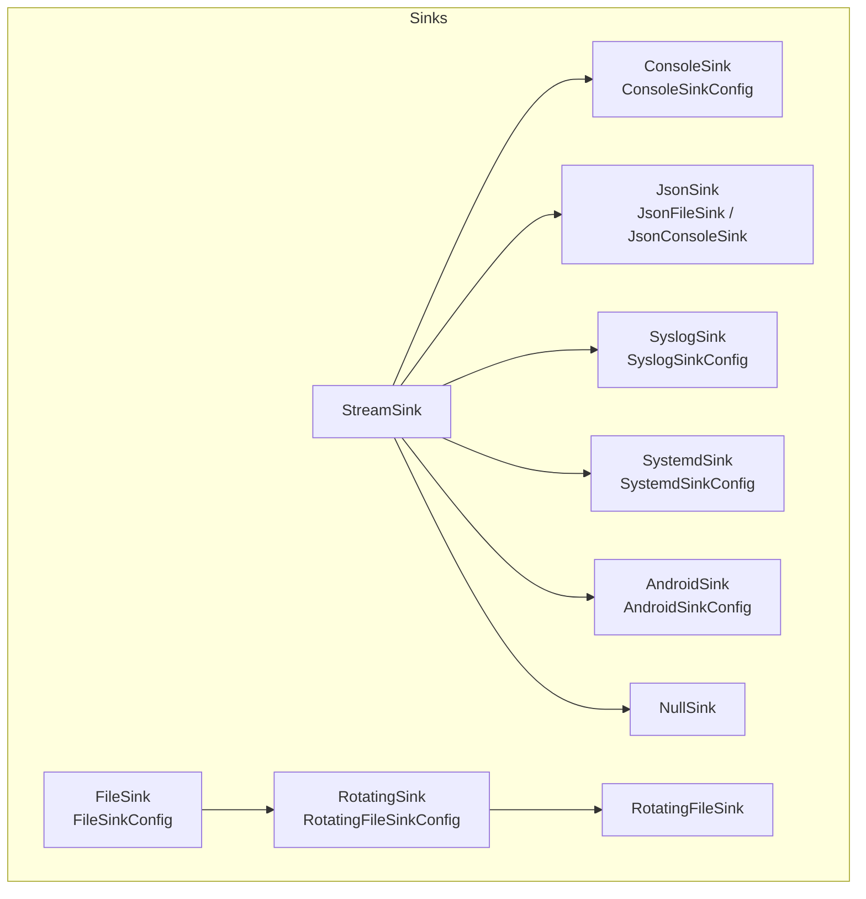
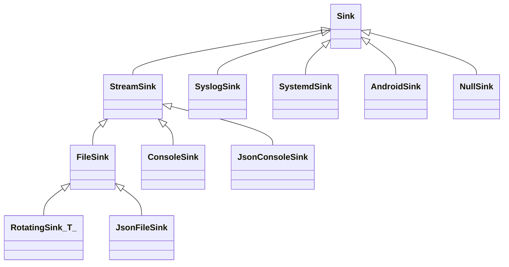
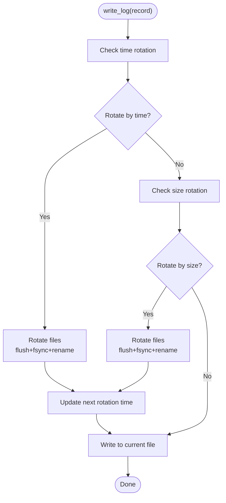
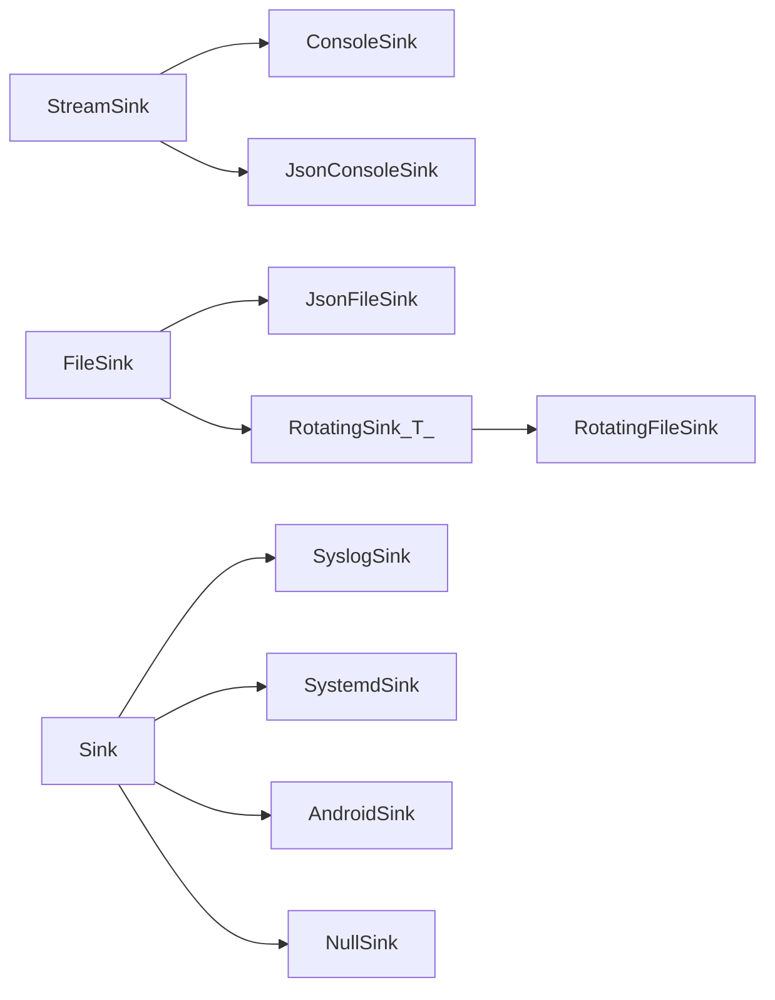

# Built-in Sinks

<cite>
**Referenced Files in This Document**
- [ConsoleSink.h](file://include/quill/sinks/ConsoleSink.h)
- [FileSink.h](file://include/quill/sinks/FileSink.h)
- [JsonSink.h](file://include/quill/sinks/JsonSink.h)
- [RotatingFileSink.h](file://include/quill/sinks/RotatingFileSink.h)
- [RotatingSink.h](file://include/quill/sinks/RotatingSink.h)
- [SyslogSink.h](file://include/quill/sinks/SyslogSink.h)
- [SystemdSink.h](file://include/quill/sinks/SystemdSink.h)
- [AndroidSink.h](file://include/quill/sinks/AndroidSink.h)
- [NullSink.h](file://include/quill/sinks/NullSink.h)
- [StreamSink.h](file://include/quill/sinks/StreamSink.h)
- [rotating_file_logging.cpp](file://examples/rotating_file_logging.cpp)
- [rotating_json_file_logging.cpp](file://examples/rotating_json_file_logging.cpp)
- [custom_console_colours.cpp](file://examples/custom_console_colours.cpp)
- [json_file_logging.cpp](file://examples/json_file_logging.cpp)
- [json_console_logging.cpp](file://examples/json_console_logging.cpp)
- [console_logging.cpp](file://examples/console_logging.cpp)
- [file_logging.cpp](file://examples/file_logging.cpp)
</cite>

## Table of Contents
1. [Introduction](#introduction)
2. [Project Structure](#project-structure)
3. [Core Components](#core-components)
4. [Architecture Overview](#architecture-overview)
5. [Detailed Component Analysis](#detailed-component-analysis)
6. [Dependency Analysis](#dependency-analysis)
7. [Performance Considerations](#performance-considerations)
8. [Troubleshooting Guide](#troubleshooting-guide)
9. [Conclusion](#conclusion)
10. [Appendices](#appendices)

## Introduction
This document provides comprehensive documentation for Quill’s built-in sink types. It explains configuration, behavior, and practical use cases for each sink, including ConsoleSink, FileSink, JsonSink, RotatingFileSink, SyslogSink, SystemdSink, AndroidSink, NullSink, and StreamSink. Guidance is included for color support, buffering, encoding, rotation policies, and platform-specific features.

## Project Structure
Quill organizes sinks under include/quill/sinks/*. Each sink exposes a configuration class and a concrete sink implementation. Many sinks inherit from a common base (e.g., StreamSink or FileSink) to share formatting, buffering, and I/O utilities.

**Diagram sources**
- [ConsoleSink.h:331-410](file://include/quill/sinks/ConsoleSink.h#L331-L410)
- [FileSink.h:226-521](file://include/quill/sinks/FileSink.h#L226-L521)
- [JsonSink.h:140-162](file://include/quill/sinks/JsonSink.h#L140-L162)
- [RotatingFileSink.h:13-14](file://include/quill/sinks/RotatingFileSink.h#L13-L14)
- [RotatingSink.h:262-316](file://include/quill/sinks/RotatingSink.h#L262-L316)
- [SyslogSink.h:137-182](file://include/quill/sinks/SyslogSink.h#L137-L182)
- [SystemdSink.h:119-179](file://include/quill/sinks/SystemdSink.h#L119-L179)
- [AndroidSink.h:88-125](file://include/quill/sinks/AndroidSink.h#L88-L125)
- [NullSink.h:24-38](file://include/quill/sinks/NullSink.h#L24-L38)
- [StreamSink.h:67-145](file://include/quill/sinks/StreamSink.h#L67-L145)

**Section sources**
- [ConsoleSink.h:44-328](file://include/quill/sinks/ConsoleSink.h#L44-L328)
- [FileSink.h:64-220](file://include/quill/sinks/FileSink.h#L64-L220)
- [JsonSink.h:29-135](file://include/quill/sinks/JsonSink.h#L29-L135)
- [RotatingSink.h:39-257](file://include/quill/sinks/RotatingSink.h#L39-L257)
- [SyslogSink.h:54-129](file://include/quill/sinks/SyslogSink.h#L54-L129)
- [SystemdSink.h:58-111](file://include/quill/sinks/SystemdSink.h#L58-L111)
- [AndroidSink.h:30-80](file://include/quill/sinks/AndroidSink.h#L30-L80)
- [NullSink.h:24-38](file://include/quill/sinks/NullSink.h#L24-L38)
- [StreamSink.h:67-308](file://include/quill/sinks/StreamSink.h#L67-L308)

## Core Components
- ConsoleSink: Colorized console output with configurable color mode and per-level colors. Supports stdout/stderr and optional custom pattern overrides.
- FileSink: File-based logging with buffering, fsync control, filename append options, and timezone-aware timestamps.
- JsonSink: Structured JSON logging with customizable fields and metadata handling.
- RotatingFileSink: File rotation by size and time with configurable naming schemes and backup retention.
- SyslogSink: Integration with system logging daemons via syslog API with facility and priority mapping.
- SystemdSink: Integration with systemd journal with structured fields and level mapping.
- AndroidSink: Mobile platform logging via Android logcat with tag and level mapping.
- NullSink: No-op sink for performance testing and benchmarking.
- StreamSink: Base class for stream-based sinks, handling safe writes, flush, and file event notifications.

**Section sources**
- [ConsoleSink.h:331-410](file://include/quill/sinks/ConsoleSink.h#L331-L410)
- [FileSink.h:226-521](file://include/quill/sinks/FileSink.h#L226-L521)
- [JsonSink.h:140-162](file://include/quill/sinks/JsonSink.h#L140-L162)
- [RotatingFileSink.h:13-14](file://include/quill/sinks/RotatingFileSink.h#L13-L14)
- [SyslogSink.h:137-182](file://include/quill/sinks/SyslogSink.h#L137-L182)
- [SystemdSink.h:119-179](file://include/quill/sinks/SystemdSink.h#L119-L179)
- [AndroidSink.h:88-125](file://include/quill/sinks/AndroidSink.h#L88-L125)
- [NullSink.h:24-38](file://include/quill/sinks/NullSink.h#L24-L38)
- [StreamSink.h:67-308](file://include/quill/sinks/StreamSink.h#L67-L308)

## Architecture Overview
The sinks build on a layered design:
- StreamSink provides stream abstraction and safe write/flush logic.
- FileSink extends StreamSink with file-specific features (buffering, fsync, filename handling).
- RotatingSink<T> wraps a base sink (e.g., FileSink) to add rotation by size/time and manage backup files.
- Specialized sinks (ConsoleSink, JsonSink variants, SyslogSink, SystemdSink, AndroidSink, NullSink) inherit from StreamSink or base sink classes to implement platform-specific behavior.

**Diagram sources**
- [StreamSink.h:67-145](file://include/quill/sinks/StreamSink.h#L67-L145)
- [FileSink.h:226-257](file://include/quill/sinks/FileSink.h#L226-L257)
- [RotatingSink.h:262-316](file://include/quill/sinks/RotatingSink.h#L262-L316)
- [ConsoleSink.h:331-410](file://include/quill/sinks/ConsoleSink.h#L331-L410)
- [JsonSink.h:140-162](file://include/quill/sinks/JsonSink.h#L140-L162)
- [SyslogSink.h:137-182](file://include/quill/sinks/SyslogSink.h#L137-L182)
- [SystemdSink.h:119-179](file://include/quill/sinks/SystemdSink.h#L119-L179)
- [AndroidSink.h:88-125](file://include/quill/sinks/AndroidSink.h#L88-L125)
- [NullSink.h:24-38](file://include/quill/sinks/NullSink.h#L24-L38)

## Detailed Component Analysis

### ConsoleSink
- Purpose: Colorized console logging to stdout/stderr with automatic or forced color support.
- Color support:
  - ColorMode: Always, Automatic, Never.
  - Per-level colors configurable via ConsoleSinkConfig::Colours.
  - Automatic detection of terminal capability and environment variable TERM.
  - Windows ANSI support activation when needed.
- Terminal formatting:
  - Optional custom pattern formatter override per sink.
  - Resets color after each message when enabled.
- Platform-specific:
  - Uses isatty/_isatty to detect terminals.
  - Windows console handle flags and ENABLE_VIRTUAL_TERMINAL_PROCESSING.
- Typical use cases:
  - Local development with colored logs.
  - CI environments where color is desired or suppressed.

Configuration highlights
- set_colour_mode(mode)
- set_colours(colours)
- set_stream("stdout"|"stderr")
- set_override_pattern_formatter_options(options)

Performance characteristics
- Minimal overhead when colors disabled.
- Small per-message string concatenation for color codes.

Use case recommendations
- Prefer Automatic for most interactive terminals.
- Use Always in CI or when piping to files where color codes are stripped.
- Combine with custom pattern overrides for compact logs.

**Section sources**
- [ConsoleSink.h:44-328](file://include/quill/sinks/ConsoleSink.h#L44-L328)
- [ConsoleSink.h:331-410](file://include/quill/sinks/ConsoleSink.h#L331-L410)
- [custom_console_colours.cpp](file://examples/custom_console_colours.cpp)
- [console_logging.cpp](file://examples/console_logging.cpp)

### FileSink
- Purpose: File-based logging with configurable buffering, fsync, and filename options.
- Buffering:
  - Custom write buffer size with minimum enforced.
  - set_write_buffer_size(bytes)
- File permissions and open modes:
  - set_open_mode("a"|"w") or custom string.
  - Cross-platform open/close with O_CLOEXEC and SH_DENYNO semantics.
- fsync control:
  - set_fsync_enabled(true/false)
  - set_minimum_fsync_interval(ms)
- Filename append:
  - set_filename_append_option(FilenameAppendOption::{None, StartDate, StartDateTime, StartCustomTimestampFormat})
  - Custom strftime pattern for filename timestamp.
- Timezone:
  - set_timezone(Timezone::{LocalTime, GmtTime})
- Event hooks:
  - FileEventNotifier callbacks for before_open, after_open, before_close, after_close, before_write.

Performance characteristics
- Buffered writes reduce syscall overhead.
- fsync disabled by default; enable only when durability is required.

Use case recommendations
- Use buffered writes for throughput.
- Enable fsync for compliance or durability-sensitive workloads.
- Append timestamps to filenames to avoid log rotation conflicts.

**Section sources**
- [FileSink.h:64-220](file://include/quill/sinks/FileSink.h#L64-L220)
- [FileSink.h:226-521](file://include/quill/sinks/FileSink.h#L226-L521)
- [file_logging.cpp](file://examples/file_logging.cpp)

### JsonSink
- Purpose: Structured JSON logging with default fields and customizable metadata.
- Default fields include timestamp, file/line, thread info, logger name, log level, and message.
- Customization:
  - Derived classes can override generate_json_message(...) to add/remove fields.
  - Supports named arguments as key-value pairs.
- Variants:
  - JsonFileSink: JSON to file.
  - JsonConsoleSink: JSON to stdout.

Performance characteristics
- Preallocates memory for JSON messages; replaces newlines in message format to preserve single-line JSON.
- Efficient string building with fmtquill::memory_buffer.

Use case recommendations
- Use JsonFileSink for centralized log aggregation.
- Use JsonConsoleSink for machine-readable stdout consumption.

**Section sources**
- [JsonSink.h:29-135](file://include/quill/sinks/JsonSink.h#L29-L135)
- [JsonSink.h:140-162](file://include/quill/sinks/JsonSink.h#L140-L162)
- [json_file_logging.cpp](file://examples/json_file_logging.cpp)
- [json_console_logging.cpp](file://examples/json_console_logging.cpp)

### RotatingFileSink
- Purpose: Rotates log files by size or time with configurable naming and retention.
- Rotation policies:
  - Size-based: set_rotation_max_file_size(bytes)
  - Time-based: set_rotation_frequency_and_interval('M'|'H', interval) or set_rotation_time_daily("HH:MM").
  - Naming schemes: Index, Date, DateAndTime.
  - Backup retention: set_max_backup_files(n), set_overwrite_rolled_files(true/false).
  - Startup rotation: set_rotation_on_creation(true/false).
  - Cleanup old files on open: set_remove_old_files(true/false).
- Implementation:
  - Inherits from RotatingSink<FileSink>.
  - Manages a deque of FileInfo for rotated files.
  - Calculates next rotation time based on frequency and interval.
  - Renames files with index/date suffixes and enforces limits.

**Diagram sources**
- [RotatingSink.h:335-369](file://include/quill/sinks/RotatingSink.h#L335-L369)
- [RotatingSink.h:396-487](file://include/quill/sinks/RotatingSink.h#L396-L487)

**Section sources**
- [RotatingFileSink.h:13-14](file://include/quill/sinks/RotatingFileSink.h#L13-L14)
- [RotatingSink.h:39-257](file://include/quill/sinks/RotatingSink.h#L39-L257)
- [RotatingSink.h:262-316](file://include/quill/sinks/RotatingSink.h#L262-L316)
- [RotatingSink.h:335-487](file://include/quill/sinks/RotatingSink.h#L335-L487)
- [rotating_file_logging.cpp](file://examples/rotating_file_logging.cpp)
- [rotating_json_file_logging.cpp](file://examples/rotating_json_file_logging.cpp)

### SyslogSink
- Purpose: Sends logs to system logging daemon via syslog API.
- Configuration:
  - set_identifier(name)
  - set_options(openlog options)
  - set_facility(facility)
  - set_format_message(true/false)
  - set_log_level_mapping(array[12] of syslog priorities)
- Behavior:
  - Uses openlog/closelog on construction/destruction.
  - Maps Quill log levels to syslog priorities.
  - Optionally formats message using the logger’s formatter.

Platform notes
- Macro collision warning with syslog.h LOG_* constants and Quill unprefixed LOG_ macros.
- Recommended to include SyslogSink in a .cpp translation unit or define QUILL_DISABLE_NON_PREFIXED_MACROS.

**Section sources**
- [SyslogSink.h:54-129](file://include/quill/sinks/SyslogSink.h#L54-L129)
- [SyslogSink.h:137-182](file://include/quill/sinks/SyslogSink.h#L137-L182)

### SystemdSink
- Purpose: Sends logs to systemd journal with structured fields.
- Configuration:
  - set_identifier(name)
  - set_format_message(true/false)
  - set_log_level_mapping(array[12] of systemd priorities)
- Behavior:
  - Uses sd_journal_send with fields like MESSAGE, PRIORITY, TID, SYSLOG_IDENTIFIER, CODE_FILE/LINE/FUNC.
  - Throws on failure with QuillError.

Platform notes
- Macro collision warning with systemd.h LOG_* constants and Quill unprefixed LOG_ macros.
- Recommended to include SystemdSink in a .cpp translation unit or define QUILL_DISABLE_NON_PREFIXED_MACROS.

**Section sources**
- [SystemdSink.h:58-111](file://include/quill/sinks/SystemdSink.h#L58-L111)
- [SystemdSink.h:119-179](file://include/quill/sinks/SystemdSink.h#L119-L179)

### AndroidSink
- Purpose: Sends logs to Android logcat.
- Configuration:
  - set_tag(tag)
  - set_format_message(true/false)
  - set_log_level_mapping(array[12] of Android log levels)
- Behavior:
  - Uses __android_log_print with configured tag and level mapping.

**Section sources**
- [AndroidSink.h:30-80](file://include/quill/sinks/AndroidSink.h#L30-L80)
- [AndroidSink.h:88-125](file://include/quill/sinks/AndroidSink.h#L88-L125)

### NullSink
- Purpose: No-op sink for performance testing and benchmarking.
- Behavior:
  - Ignores all writes and flushes.

**Section sources**
- [NullSink.h:24-38](file://include/quill/sinks/NullSink.h#L24-L38)

### StreamSink
- Purpose: Base class for stream-based sinks.
- Features:
  - Accepts "stdout", "stderr", "/dev/null", or file path.
  - Safe fwrite with partial-write handling and error propagation.
  - Optional FileEventNotifier hooks.
  - Flush and write_log implementations.

**Section sources**
- [StreamSink.h:67-308](file://include/quill/sinks/StreamSink.h#L67-L308)

## Dependency Analysis
- ConsoleSink depends on StreamSink and ConsoleSinkConfig; integrates with terminal detection and Windows console APIs.
- FileSink depends on StreamSink and adds file-specific buffering, fsync, and filename handling.
- JsonSink templates on a base sink to produce JSON; JsonFileSink and JsonConsoleSink specialize for file and console respectively.
- RotatingFileSink aliases RotatingSink<FileSink>; RotatingSink<T> manages rotation logic and file renaming.
- SyslogSink, SystemdSink, AndroidSink depend on platform headers; they map Quill log levels to platform priorities.
- NullSink depends on Sink only.

**Diagram sources**
- [ConsoleSink.h:331-410](file://include/quill/sinks/ConsoleSink.h#L331-L410)
- [JsonSink.h:140-162](file://include/quill/sinks/JsonSink.h#L140-L162)
- [RotatingFileSink.h:13-14](file://include/quill/sinks/RotatingFileSink.h#L13-L14)
- [RotatingSink.h:262-316](file://include/quill/sinks/RotatingSink.h#L262-L316)
- [SyslogSink.h:137-182](file://include/quill/sinks/SyslogSink.h#L137-L182)
- [SystemdSink.h:119-179](file://include/quill/sinks/SystemdSink.h#L119-L179)
- [AndroidSink.h:88-125](file://include/quill/sinks/AndroidSink.h#L88-L125)
- [NullSink.h:24-38](file://include/quill/sinks/NullSink.h#L24-L38)

**Section sources**
- [ConsoleSink.h:331-410](file://include/quill/sinks/ConsoleSink.h#L331-L410)
- [FileSink.h:226-521](file://include/quill/sinks/FileSink.h#L226-L521)
- [JsonSink.h:140-162](file://include/quill/sinks/JsonSink.h#L140-L162)
- [RotatingFileSink.h:13-14](file://include/quill/sinks/RotatingFileSink.h#L13-L14)
- [RotatingSink.h:262-316](file://include/quill/sinks/RotatingSink.h#L262-L316)
- [SyslogSink.h:137-182](file://include/quill/sinks/SyslogSink.h#L137-L182)
- [SystemdSink.h:119-179](file://include/quill/sinks/SystemdSink.h#L119-L179)
- [AndroidSink.h:88-125](file://include/quill/sinks/AndroidSink.h#L88-L125)
- [NullSink.h:24-38](file://include/quill/sinks/NullSink.h#L24-L38)
- [StreamSink.h:67-308](file://include/quill/sinks/StreamSink.h#L67-L308)

## Performance Considerations
- ConsoleSink
  - Color codes add small overhead; disable in non-interactive contexts.
- FileSink
  - Buffered writes improve throughput; tune set_write_buffer_size for workload.
  - fsync increases durability but reduces throughput; use set_minimum_fsync_interval to limit frequency.
- JsonSink
  - Preallocated buffers minimize allocations; avoid very large custom fields.
- RotatingFileSink
  - Rotation triggers flush+fsync; batch writes to reduce rotation frequency.
  - Index/date naming avoids filename collisions; choose scheme based on cleanup needs.
- Syslog/Systemd/Android
  - Structured fields add minimal overhead; ensure identifiers/tags are concise.

[No sources needed since this section provides general guidance]

## Troubleshooting Guide
- Console color issues
  - Verify terminal support and TERM environment; use Automatic mode or Always as needed.
  - On Windows, ensure ENABLE_VIRTUAL_TERMINAL_PROCESSING is enabled.
- File open failures
  - Inspect errno and error messages; retries are attempted for transient failures.
  - On Windows, handles are opened with SH_DENYNO and inheritable flags disabled.
- fsync errors
  - Ensure fsync is enabled only when necessary; adjust minimum interval.
- Rotation anomalies
  - Confirm rotation_max_file_size is at least the smallest expected message size.
  - Validate rotation naming scheme and backup limits.
- Platform macro collisions
  - Include SyslogSink/SystemdSink in .cpp translation units or define QUILL_DISABLE_NON_PREFIXED_MACROS.

**Section sources**
- [ConsoleSink.h:154-250](file://include/quill/sinks/ConsoleSink.h#L154-L250)
- [FileSink.h:362-463](file://include/quill/sinks/FileSink.h#L362-L463)
- [RotatingSink.h:396-487](file://include/quill/sinks/RotatingSink.h#L396-L487)
- [SyslogSink.h:24-46](file://include/quill/sinks/SyslogSink.h#L24-L46)
- [SystemdSink.h:28-50](file://include/quill/sinks/SystemdSink.h#L28-L50)

## Conclusion
Quill’s built-in sinks provide a robust, cross-platform logging infrastructure. Choose ConsoleSink for development, FileSink for durable file logs, JsonSink for structured ingestion, RotatingFileSink for long-running services, and platform sinks (Syslog/Systemd/Android) for system integration. Configure buffering, rotation, and formatting to match your performance and operational requirements.

[No sources needed since this section summarizes without analyzing specific files]

## Appendices

### Configuration Examples by Sink Type
- ConsoleSink
  - Example: [custom_console_colours.cpp](file://examples/custom_console_colours.cpp), [console_logging.cpp](file://examples/console_logging.cpp)
- FileSink
  - Example: [file_logging.cpp](file://examples/file_logging.cpp)
- JsonSink
  - Examples: [json_file_logging.cpp](file://examples/json_file_logging.cpp), [json_console_logging.cpp](file://examples/json_console_logging.cpp)
- RotatingFileSink
  - Examples: [rotating_file_logging.cpp](file://examples/rotating_file_logging.cpp), [rotating_json_file_logging.cpp](file://examples/rotating_json_file_logging.cpp)

**Section sources**
- [custom_console_colours.cpp](file://examples/custom_console_colours.cpp)
- [console_logging.cpp](file://examples/console_logging.cpp)
- [file_logging.cpp](file://examples/file_logging.cpp)
- [json_file_logging.cpp](file://examples/json_file_logging.cpp)
- [json_console_logging.cpp](file://examples/json_console_logging.cpp)
- [rotating_file_logging.cpp](file://examples/rotating_file_logging.cpp)
- [rotating_json_file_logging.cpp](file://examples/rotating_json_file_logging.cpp)