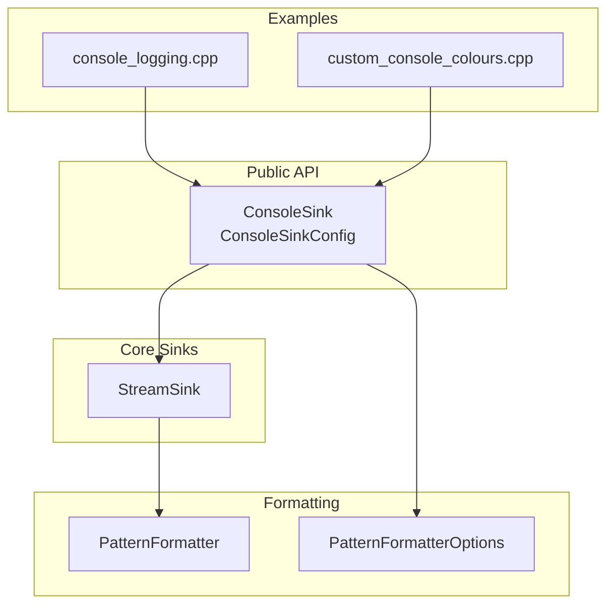
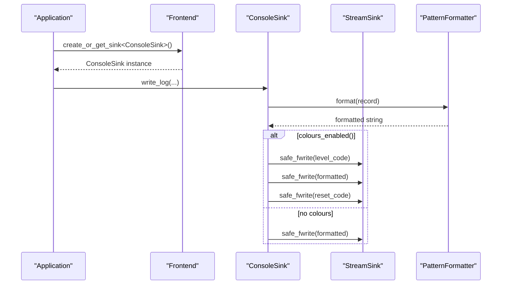
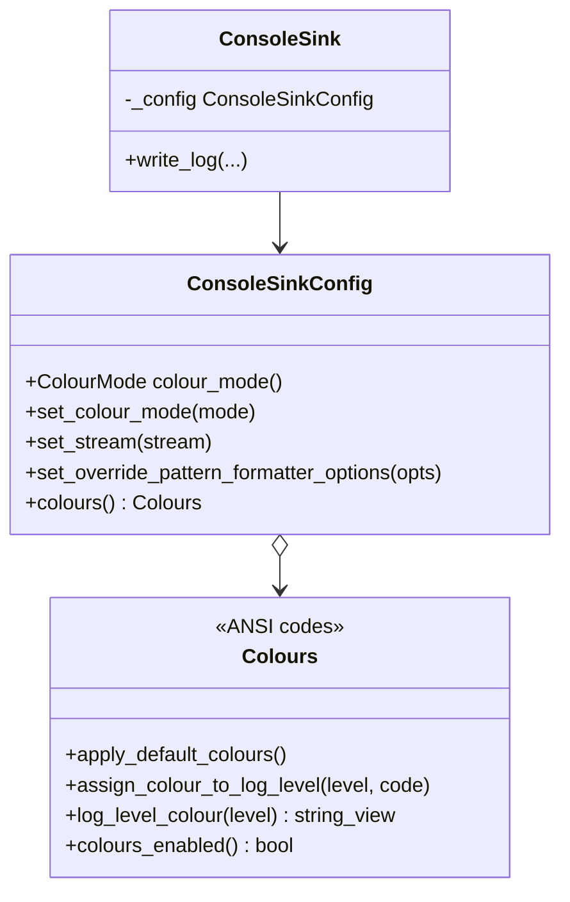
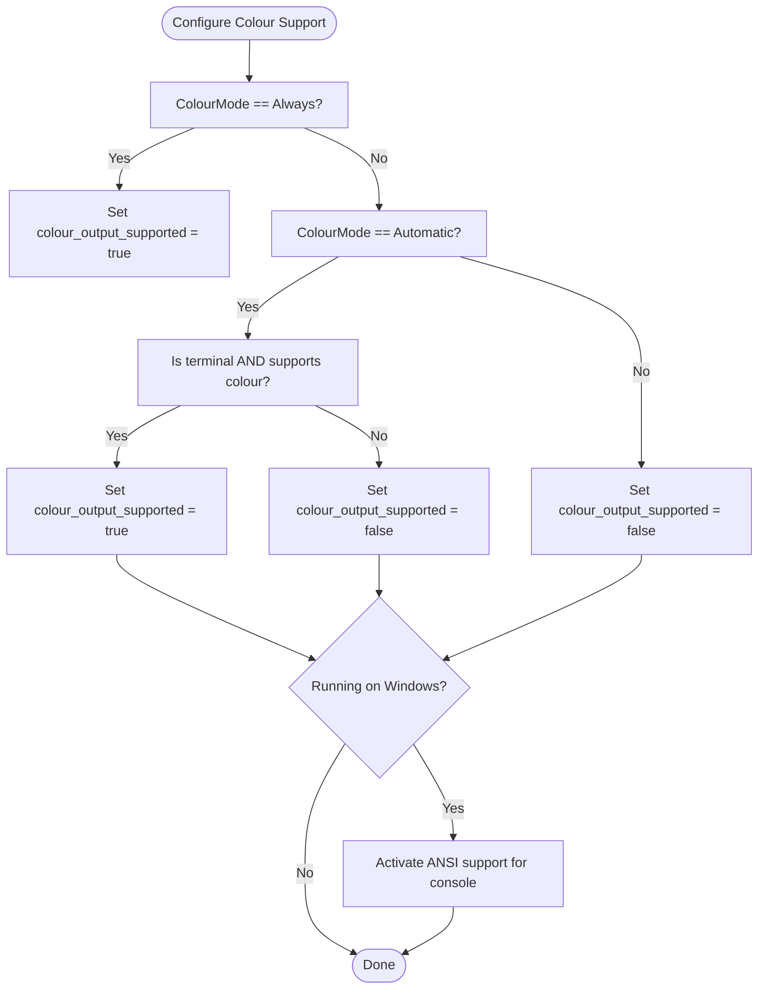
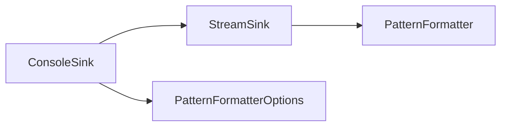

# Console Sink

<cite>
**Referenced Files in This Document**
- [ConsoleSink.h](file://include/quill/sinks/ConsoleSink.h)
- [StreamSink.h](file://include/quill/sinks/StreamSink.h)
- [PatternFormatter.h](file://include/quill/backend/PatternFormatter.h)
- [PatternFormatterOptions.h](file://include/quill/core/PatternFormatterOptions.h)
- [console_logging.cpp](file://examples/console_logging.cpp)
- [custom_console_colours.cpp](file://examples/custom_console_colours.cpp)
- [ConsoleSinkStdoutMultipleFormatsTest.cpp](file://test/integration_tests/ConsoleSinkStdoutMultipleFormatsTest.cpp)
- [ConsoleSinkStderrMultipleFormatsTest.cpp](file://test/integration_tests/ConsoleSinkStderrMultipleFormatsTest.cpp)
</cite>

## Table of Contents
1. [Introduction](#introduction)
2. [Project Structure](#project-structure)
3. [Core Components](#core-components)
4. [Architecture Overview](#architecture-overview)
5. [Detailed Component Analysis](#detailed-component-analysis)
6. [Dependency Analysis](#dependency-analysis)
7. [Performance Considerations](#performance-considerations)
8. [Troubleshooting Guide](#troubleshooting-guide)
9. [Conclusion](#conclusion)
10. [Appendices](#appendices)

## Introduction
This document explains ConsoleSink, Quill’s terminal output sink. It covers ConsoleSinkConfig and its colour subsystem, including colour mode options, custom per-level colour assignment, automatic terminal detection, and platform-specific colour activation. It also documents stream selection (stdout vs stderr), pattern formatter overrides, and colour formatting codes. Practical examples demonstrate basic console logging, custom colour schemes, and JSON console logging. Platform-specific notes address Windows ANSI support and Unix terminal environment detection. Finally, performance characteristics and use-case recommendations are provided for development, debugging, and production scenarios.

## Project Structure
ConsoleSink is implemented as a specialized sink that writes to stdout or stderr with optional ANSI colouring. It composes with StreamSink for stream handling and integrates with the broader logging pipeline via the Frontend and Backend.

**Diagram sources**
- [ConsoleSink.h:44-410](file://include/quill/sinks/ConsoleSink.h#L44-L410)
- [StreamSink.h:67-314](file://include/quill/sinks/StreamSink.h#L67-L314)
- [PatternFormatter.h:33-608](file://include/quill/backend/PatternFormatter.h#L33-L608)
- [PatternFormatterOptions.h:23-170](file://include/quill/core/PatternFormatterOptions.h#L23-L170)
- [console_logging.cpp:14-72](file://examples/console_logging.cpp#L14-L72)
- [custom_console_colours.cpp:14-48](file://examples/custom_console_colours.cpp#L14-L48)

**Section sources**
- [ConsoleSink.h:44-410](file://include/quill/sinks/ConsoleSink.h#L44-L410)
- [StreamSink.h:67-314](file://include/quill/sinks/StreamSink.h#L67-L314)
- [PatternFormatter.h:33-608](file://include/quill/backend/PatternFormatter.h#L33-L608)
- [PatternFormatterOptions.h:23-170](file://include/quill/core/PatternFormatterOptions.h#L23-L170)
- [console_logging.cpp:14-72](file://examples/console_logging.cpp#L14-L72)
- [custom_console_colours.cpp:14-48](file://examples/custom_console_colours.cpp#L14-L48)

## Core Components
- ConsoleSinkConfig: Provides configuration for ConsoleSink, including:
  - ColourMode: Always, Automatic, Never
  - Colours: Per-level colour assignment and ANSI code constants
  - Stream selection: stdout or stderr
  - Pattern formatter override: per-sink PatternFormatterOptions
- ConsoleSink: A sink that writes formatted log records to stdout/stderr, optionally wrapping messages with ANSI colour codes based on log level.
- StreamSink: Base class handling stream initialization, safe writing, and flushing for stdout/stderr.
- PatternFormatter and PatternFormatterOptions: Formatting engine and options controlling how log records are rendered.

Key responsibilities:
- ConsoleSinkConfig sets up colour support and formatter overrides.
- ConsoleSink applies colours around formatted records when enabled.
- StreamSink ensures robust writes to console streams and flushes.

**Section sources**
- [ConsoleSink.h:44-328](file://include/quill/sinks/ConsoleSink.h#L44-L328)
- [ConsoleSink.h:331-410](file://include/quill/sinks/ConsoleSink.h#L331-L410)
- [StreamSink.h:67-314](file://include/quill/sinks/StreamSink.h#L67-L314)
- [PatternFormatter.h:33-181](file://include/quill/backend/PatternFormatter.h#L33-L181)
- [PatternFormatterOptions.h:23-170](file://include/quill/core/PatternFormatterOptions.h#L23-L170)

## Architecture Overview
Console logging flow:
- Frontend creates a ConsoleSink with a ConsoleSinkConfig.
- ConsoleSink delegates formatting to the logger’s formatter or uses its override.
- If colouring is enabled, ConsoleSink prefixes the record with a level-specific ANSI code and appends a reset code after writing.

**Diagram sources**
- [ConsoleSink.h:375-405](file://include/quill/sinks/ConsoleSink.h#L375-L405)
- [StreamSink.h:152-180](file://include/quill/sinks/StreamSink.h#L152-L180)
- [PatternFormatter.h:97-177](file://include/quill/backend/PatternFormatter.h#L97-L177)

## Detailed Component Analysis

### ConsoleSinkConfig and Colours
- ColourMode:
  - Always: forces colour output regardless of environment
  - Automatic: enables colour only when the output is a terminal and the terminal supports colour
  - Never: disables colour output
- Colours:
  - Predefined ANSI codes for effects and foreground/background colours
  - Per-level assignment via assign_colour_to_log_level
  - Default mapping for TraceL3..Backtrace
  - Colours are only applied when colours_enabled() is true
- Terminal detection and colour activation:
  - Automatic mode checks if the output is a terminal and whether the environment suggests colour support
  - On Windows, ANSI support is activated by adjusting console mode flags
  - On Unix-like systems, TERM environment variable is inspected against a curated list of compatible terminals

**Diagram sources**
- [ConsoleSink.h:44-328](file://include/quill/sinks/ConsoleSink.h#L44-L328)
- [ConsoleSink.h:331-410](file://include/quill/sinks/ConsoleSink.h#L331-L410)

**Section sources**
- [ConsoleSink.h:44-328](file://include/quill/sinks/ConsoleSink.h#L44-L328)
- [ConsoleSink.h:154-250](file://include/quill/sinks/ConsoleSink.h#L154-L250)

### Stream Selection: stdout vs stderr
- ConsoleSinkConfig.set_stream accepts "stdout" or "stderr"
- StreamSink resolves these identifiers to the corresponding FILE*
- Tests demonstrate using stderr for console output in integration tests

Practical guidance:
- Use stderr for diagnostic/error messages to keep them separate from normal program output
- Use stdout for standard informational logs

**Section sources**
- [ConsoleSink.h:284-296](file://include/quill/sinks/ConsoleSink.h#L284-L296)
- [StreamSink.h:86-98](file://include/quill/sinks/StreamSink.h#L86-L98)
- [ConsoleSinkStderrMultipleFormatsTest.cpp:29-37](file://test/integration_tests/ConsoleSinkStderrMultipleFormatsTest.cpp#L29-L37)
- [ConsoleSinkStdoutMultipleFormatsTest.cpp:34-42](file://test/integration_tests/ConsoleSinkStdoutMultipleFormatsTest.cpp#L34-L42)

### Pattern Formatter Overrides
- ConsoleSinkConfig.set_override_pattern_formatter_options allows per-sink formatting options
- If provided, ConsoleSink uses these options instead of the logger’s defaults
- Useful for concise console output or structured logging scenarios

Example usage:
- Empty format pattern to bypass formatting overhead when emitting structured logs
- Custom timestamp and timezone options tailored for console readability

**Section sources**
- [ConsoleSink.h:299-310](file://include/quill/sinks/ConsoleSink.h#L299-L310)
- [PatternFormatterOptions.h:27-40](file://include/quill/core/PatternFormatterOptions.h#L27-L40)
- [PatternFormatter.h:97-177](file://include/quill/backend/PatternFormatter.h#L97-L177)

### Colour Formatting Codes
- Effects: reset, bold, dark, underline, blink, reverse, concealed, clear_line
- Foreground: black, red, green, yellow, blue, magenta, cyan, white
- Background: on_black, on_red, on_green, on_yellow, on_blue, on_magenta, on_cyan, on_white
- Bold variants and composite codes (e.g., bold-on-red) are provided

ConsoleSink applies the level-specific code before the formatted record and resets afterwards when colours are enabled.

**Section sources**
- [ConsoleSink.h:114-149](file://include/quill/sinks/ConsoleSink.h#L114-L149)
- [ConsoleSink.h:383-397](file://include/quill/sinks/ConsoleSink.h#L383-L397)

### Platform-Specific Considerations

#### Windows ANSI Support
- Automatic colour activation attempts to enable ANSI processing for the console handle
- Uses Windows console mode flags to turn on virtual terminal processing and processed output
- This enables ANSI escape sequences to render colours in modern Windows terminals

**Diagram sources**
- [ConsoleSink.h:231-250](file://include/quill/sinks/ConsoleSink.h#L231-L250)
- [ConsoleSink.h:202-227](file://include/quill/sinks/ConsoleSink.h#L202-L227)

**Section sources**
- [ConsoleSink.h:154-189](file://include/quill/sinks/ConsoleSink.h#L154-L189)
- [ConsoleSink.h:202-227](file://include/quill/sinks/ConsoleSink.h#L202-L227)

#### Unix Terminal Compatibility
- Environment detection relies on the TERM variable
- A curated list of terminals is matched against TERM; if any match is found, colour output is considered supported
- If TERM is unset or does not match, colour output is disabled

**Section sources**
- [ConsoleSink.h:154-189](file://include/quill/sinks/ConsoleSink.h#L154-L189)

### Practical Examples

#### Basic Console Logging
- Demonstrates creating a ConsoleSink, attaching it to a logger, and emitting logs at various levels
- Shows formatting with libfmt and logging standard types

**Section sources**
- [console_logging.cpp:14-72](file://examples/console_logging.cpp#L14-L72)

#### Custom Colour Scheme
- Shows assigning a custom colour to a specific log level (e.g., Info)
- Demonstrates overriding default colours while retaining others

**Section sources**
- [custom_console_colours.cpp:14-48](file://examples/custom_console_colours.cpp#L14-L48)

#### JSON Console Logging
- Uses a dedicated JSON console sink and sets an empty format pattern to avoid redundant formatting
- Emphasizes that PatternFormatter is primarily for non-structured logs

**Section sources**
- [console_logging.cpp:14-72](file://examples/console_logging.cpp#L14-L72)

## Dependency Analysis
ConsoleSink depends on:
- StreamSink for stream handling and safe writes
- PatternFormatter for formatting log records
- PatternFormatterOptions for configurable formatting

**Diagram sources**
- [ConsoleSink.h:331-410](file://include/quill/sinks/ConsoleSink.h#L331-L410)
- [StreamSink.h:67-314](file://include/quill/sinks/StreamSink.h#L67-L314)
- [PatternFormatter.h:33-181](file://include/quill/backend/PatternFormatter.h#L33-L181)

**Section sources**
- [ConsoleSink.h:331-410](file://include/quill/sinks/ConsoleSink.h#L331-L410)
- [StreamSink.h:67-314](file://include/quill/sinks/StreamSink.h#L67-L314)
- [PatternFormatter.h:33-181](file://include/quill/backend/PatternFormatter.h#L33-L181)

## Performance Considerations
- Console output is I/O bound; performance is primarily affected by:
  - Terminal rendering and console driver performance
  - Use of colour codes adds small overhead per message
- Recommendations:
  - Use Automatic colour mode to avoid unnecessary colour overhead when piping to files or non-terminals
  - Prefer Always only when you require consistent colouring in all environments
  - Use Never for high-volume console logging where colouring is unnecessary
- Stream selection:
  - stderr is often buffered differently by shells and terminals; choose based on desired separation of concerns
- Formatting:
  - For JSON-only console logging, set an empty format pattern to minimize formatting overhead

[No sources needed since this section provides general guidance]

## Troubleshooting Guide
- Colours not appearing:
  - Verify ColourMode setting (Always vs Automatic vs Never)
  - On Unix, ensure TERM matches a known terminal in the supported list
  - On Windows, confirm console supports ANSI; the sink attempts to enable it automatically
- Mixed output or incorrect stream:
  - Confirm set_stream is "stdout" or "stderr"
  - Tests show stderr usage for console logging scenarios
- Unexpected formatting:
  - Check override_pattern_formatter_options; an empty pattern bypasses formatting
  - Ensure PatternFormatterOptions are set appropriately for the intended output

**Section sources**
- [ConsoleSink.h:231-250](file://include/quill/sinks/ConsoleSink.h#L231-L250)
- [ConsoleSink.h:154-189](file://include/quill/sinks/ConsoleSink.h#L154-L189)
- [ConsoleSinkStderrMultipleFormatsTest.cpp:29-37](file://test/integration_tests/ConsoleSinkStderrMultipleFormatsTest.cpp#L29-L37)
- [ConsoleSinkStdoutMultipleFormatsTest.cpp:34-42](file://test/integration_tests/ConsoleSinkStdoutMultipleFormatsTest.cpp#L34-L42)

## Conclusion
ConsoleSink provides a flexible, cross-platform console output sink with configurable colouring, stream selection, and formatting. Its design cleanly separates colour logic from formatting and stream handling, enabling efficient and readable console logging across development, debugging, and production contexts. Use Automatic mode for portability, Always for controlled environments, and Never for high-throughput scenarios where colouring is unnecessary.

[No sources needed since this section summarizes without analyzing specific files]

## Appendices

### API Summary: ConsoleSinkConfig
- set_colour_mode(mode): Choose Always, Automatic, or Never
- set_stream(stream): Select "stdout" or "stderr"
- set_override_pattern_formatter_options(opts): Override formatter options for this sink
- colours(): Access Colours for per-level assignments

**Section sources**
- [ConsoleSink.h:266-319](file://include/quill/sinks/ConsoleSink.h#L266-L319)

### API Summary: Colours
- apply_default_colours(): Apply default ANSI mappings
- assign_colour_to_log_level(level, code): Assign a code to a log level
- log_level_colour(level): Retrieve the code for a log level
- colours_enabled(): Indicates if colouring is active

**Section sources**
- [ConsoleSink.h:67-112](file://include/quill/sinks/ConsoleSink.h#L67-L112)

### Safe Writing and Platform Notes
- StreamSink.safe_fwrite optimizes console writes on Windows using native console APIs when available
- Falls back to standard fwrite when console handles are not available

**Section sources**
- [StreamSink.h:214-278](file://include/quill/sinks/StreamSink.h#L214-L278)