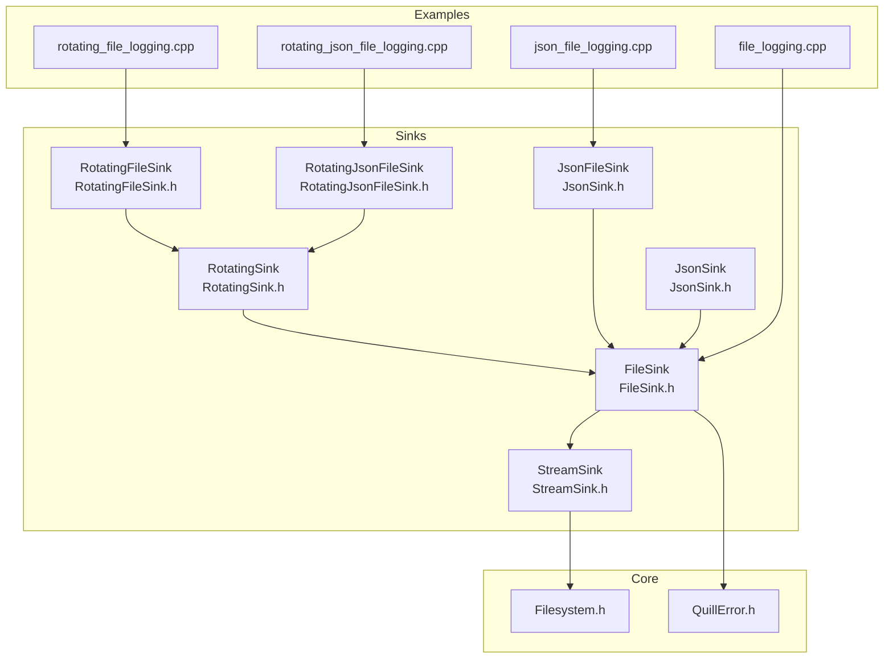
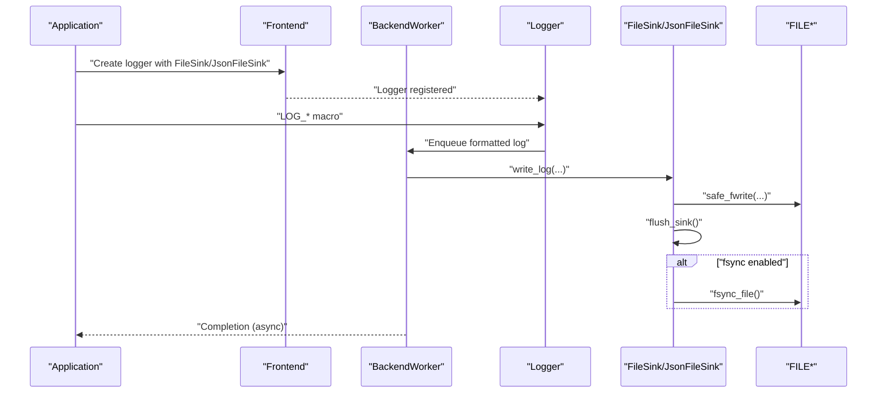
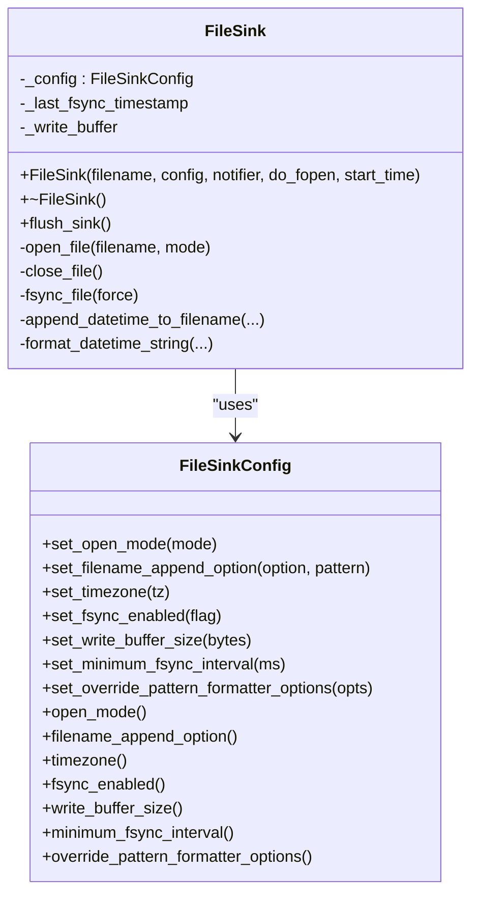
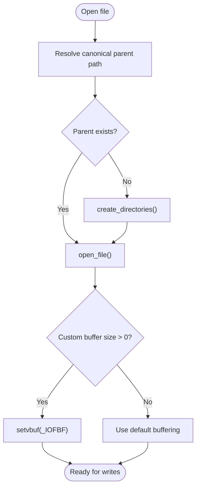
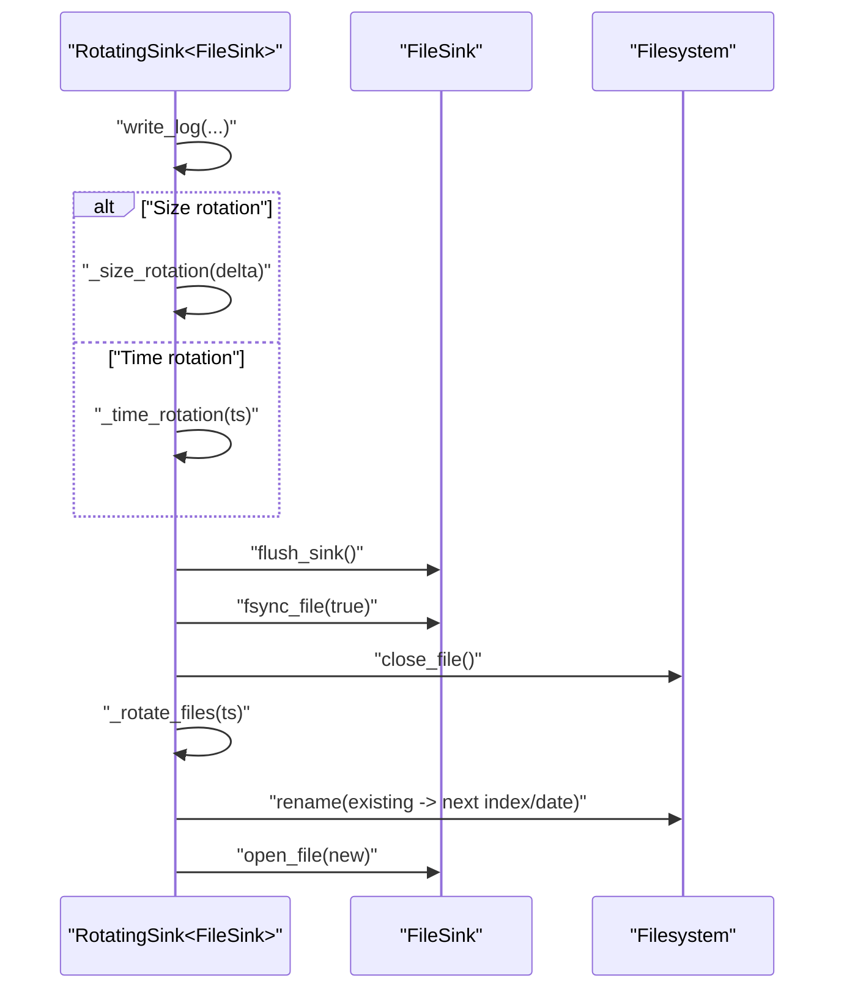
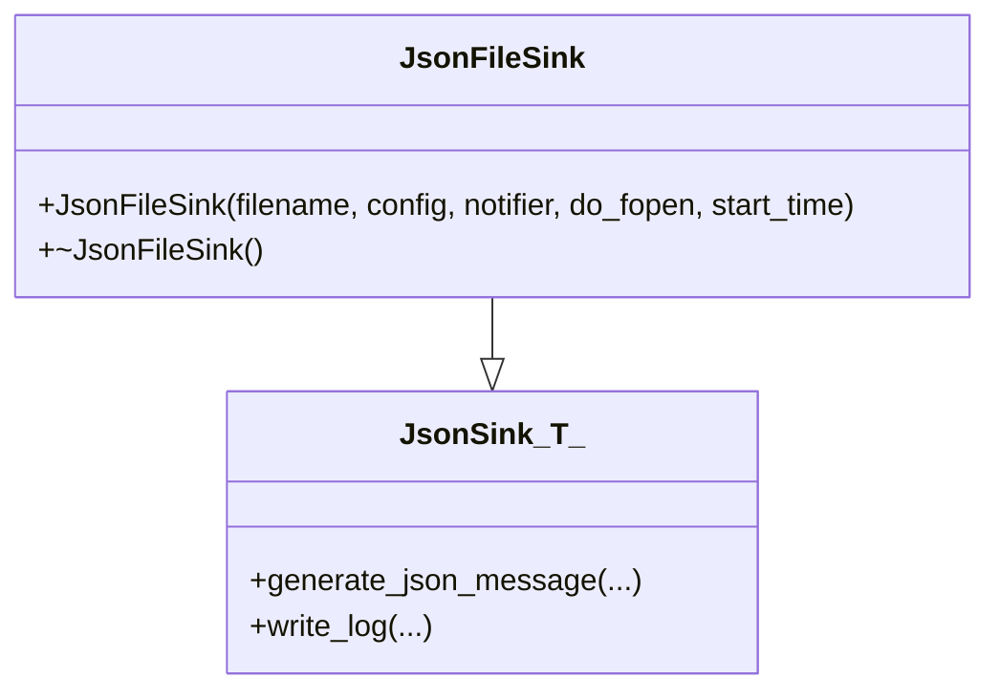
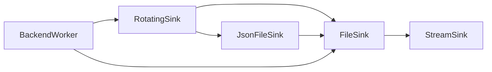

# File Sink

<cite>
**Referenced Files in This Document**
- [FileSink.h](file://include/quill/sinks/FileSink.h)
- [StreamSink.h](file://include/quill/sinks/StreamSink.h)
- [RotatingSink.h](file://include/quill/sinks/RotatingSink.h)
- [RotatingFileSink.h](file://include/quill/sinks/RotatingFileSink.h)
- [RotatingJsonFileSink.h](file://include/quill/sinks/RotatingJsonFileSink.h)
- [JsonSink.h](file://include/quill/sinks/JsonSink.h)
- [Filesystem.h](file://include/quill/core/Filesystem.h)
- [QuillError.h](file://include/quill/core/QuillError.h)
- [file_logging.cpp](file://examples/file_logging.cpp)
- [rotating_file_logging.cpp](file://examples/rotating_file_logging.cpp)
- [json_file_logging.cpp](file://examples/json_file_logging.cpp)
- [rotating_json_file_logging.cpp](file://examples/rotating_json_file_logging.cpp)
- [FileSinkTest.cpp](file://test/unit_tests/FileSinkTest.cpp)
- [BackendWorker.h](file://include/quill/backend/BackendWorker.h)
</cite>

## Table of Contents
1. [Introduction](#introduction)
2. [Project Structure](#project-structure)
3. [Core Components](#core-components)
4. [Architecture Overview](#architecture-overview)
5. [Detailed Component Analysis](#detailed-component-analysis)
6. [Dependency Analysis](#dependency-analysis)
7. [Performance Considerations](#performance-considerations)
8. [Troubleshooting Guide](#troubleshooting-guide)
9. [Conclusion](#conclusion)
10. [Appendices](#appendices)

## Introduction
This document provides comprehensive documentation for FileSink, Quill’s file output sink. It covers file creation modes, append vs truncate behavior, file permissions, encoding options, buffering strategies (including synchronous and asynchronous file writing), buffer sizes, and flush policies. It also explains file path handling, directory creation, and file naming conventions. Practical examples are included for basic file logging, log rotation integration, and structured JSON file logging. The document addresses file locking mechanisms, concurrent access handling, and file system compatibility. Performance considerations such as buffer management, I/O optimization, and disk space monitoring are discussed, along with configuration recommendations for development, testing, and production environments.

## Project Structure
The FileSink family resides in the sinks module and builds upon a shared StreamSink base. Rotating variants wrap FileSink or JsonFileSink to provide time- and size-based rotation. Examples demonstrate typical usage patterns, and unit tests validate configuration and behavior.

**Diagram sources**
- [FileSink.h:226-527](file://include/quill/sinks/FileSink.h#L226-L527)
- [StreamSink.h:67-314](file://include/quill/sinks/StreamSink.h#L67-L314)
- [RotatingSink.h:262-845](file://include/quill/sinks/RotatingSink.h#L262-L845)
- [RotatingFileSink.h:13-15](file://include/quill/sinks/RotatingFileSink.h#L13-L15)
- [RotatingJsonFileSink.h:14-16](file://include/quill/sinks/RotatingJsonFileSink.h#L14-L16)
- [JsonSink.h:32-165](file://include/quill/sinks/JsonSink.h#L32-L165)
- [Filesystem.h:51-68](file://include/quill/core/Filesystem.h#L51-L68)
- [QuillError.h:45-57](file://include/quill/core/QuillError.h#L45-L57)
- [file_logging.cpp:36-55](file://examples/file_logging.cpp#L36-L55)
- [rotating_file_logging.cpp:21-32](file://examples/rotating_file_logging.cpp#L21-L32)
- [json_file_logging.cpp:28-42](file://examples/json_file_logging.cpp#L28-L42)
- [rotating_json_file_logging.cpp:21-32](file://examples/rotating_json_file_logging.cpp#L21-L32)

**Section sources**
- [FileSink.h:226-527](file://include/quill/sinks/FileSink.h#L226-L527)
- [StreamSink.h:67-314](file://include/quill/sinks/StreamSink.h#L67-L314)
- [RotatingSink.h:262-845](file://include/quill/sinks/RotatingSink.h#L262-L845)
- [RotatingFileSink.h:13-15](file://include/quill/sinks/RotatingFileSink.h#L13-L15)
- [RotatingJsonFileSink.h:14-16](file://include/quill/sinks/RotatingJsonFileSink.h#L14-L16)
- [JsonSink.h:32-165](file://include/quill/sinks/JsonSink.h#L32-L165)
- [Filesystem.h:51-68](file://include/quill/core/Filesystem.h#L51-L68)
- [QuillError.h:45-57](file://include/quill/core/QuillError.h#L45-L57)
- [file_logging.cpp:36-55](file://examples/file_logging.cpp#L36-L55)
- [rotating_file_logging.cpp:21-32](file://examples/rotating_file_logging.cpp#L21-L32)
- [json_file_logging.cpp:28-42](file://examples/json_file_logging.cpp#L28-L42)
- [rotating_json_file_logging.cpp:21-32](file://examples/rotating_json_file_logging.cpp#L21-L32)

## Core Components
- FileSinkConfig: Controls open mode, filename append behavior, timezone, fsync, write buffer size, minimum fsync interval, and optional pattern formatter overrides.
- FileSink: Implements file writing via StreamSink, supports filename append, buffering, fsync, and reopening when the file is deleted externally.
- StreamSink: Base class handling directory creation, canonical path resolution, safe fwrite, flush, and file event notifications.
- RotatingSink<T>: Template wrapper around a base sink (FileSink or JsonFileSink) providing time-based and size-based rotation, naming schemes, and backup retention.
- RotatingFileSink and RotatingJsonFileSink: Type aliases for rotating file and JSON sinks.
- JsonSink<T> and JsonFileSink: JSON formatting layer that generates newline-delimited JSON records and writes them via the underlying sink.

Key behaviors:
- Open modes: 'w' (truncate) and 'a' (append). On Unix, 'w' uses O_TRUNC; 'a' uses O_APPEND. On Windows, file sharing is configured to allow readers while writing.
- Buffering: Customizable user buffer size via set_write_buffer_size; defaults to 64 KB. When set to 0, default stdio buffering is used.
- fsync: Controlled by set_fsync_enabled and set_minimum_fsync_interval; enforced during flush and rotation.
- Filename append: StartDate, StartDateTime, StartCustomTimestampFormat; strftime-based patterns.
- Directory creation: Canonical path resolution and automatic directory creation for non-existent paths.

**Section sources**
- [FileSink.h:64-220](file://include/quill/sinks/FileSink.h#L64-L220)
- [FileSink.h:226-527](file://include/quill/sinks/FileSink.h#L226-L527)
- [StreamSink.h:67-314](file://include/quill/sinks/StreamSink.h#L67-L314)
- [RotatingSink.h:39-257](file://include/quill/sinks/RotatingSink.h#L39-L257)
- [JsonSink.h:32-165](file://include/quill/sinks/JsonSink.h#L32-L165)

## Architecture Overview
The file logging pipeline integrates frontend macros, backend worker, and sinks. The backend worker schedules flushes and rotations asynchronously, while sinks perform actual I/O with buffering and optional fsync.

**Diagram sources**
- [BackendWorker.h:138-200](file://include/quill/backend/BackendWorker.h#L138-L200)
- [StreamSink.h:152-193](file://include/quill/sinks/StreamSink.h#L152-L193)
- [FileSink.h:264-288](file://include/quill/sinks/FileSink.h#L264-L288)

**Section sources**
- [BackendWorker.h:138-200](file://include/quill/backend/BackendWorker.h#L138-L200)
- [StreamSink.h:152-193](file://include/quill/sinks/StreamSink.h#L152-L193)
- [FileSink.h:264-288](file://include/quill/sinks/FileSink.h#L264-L288)

## Detailed Component Analysis

### FileSinkConfig and FileSink
- Open modes:
  - 'w': Truncate semantics on Unix via O_TRUNC; Windows uses _fsopen with _SH_DENYNO to allow reads.
  - 'a': Append semantics on Unix via O_APPEND; Windows uses _fsopen with _SH_DENYNO.
- Filename append options:
  - StartDate: appends "_YYYYMMDD".
  - StartDateTime: appends "_YYYYMMDD_HHMMSS".
  - StartCustomTimestampFormat: accepts a strftime pattern.
- Timezone: LocalTime or GmtTime affects filename timestamps and time-based operations.
- fsync:
  - set_fsync_enabled toggles fsync on flush.
  - set_minimum_fsync_interval throttles fsync calls to reduce disk wear.
  - Minimum interval requires fsync to be enabled; otherwise construction throws.
- Buffering:
  - set_write_buffer_size controls user-level buffer size; enforced via setvbuf with _IOFBF.
  - Minimum buffer size is 4 KB; 0 disables custom buffering.
- Event hooks:
  - FileEventNotifier callbacks fire around open/close and before write.

**Diagram sources**
- [FileSink.h:64-220](file://include/quill/sinks/FileSink.h#L64-L220)
- [FileSink.h:226-527](file://include/quill/sinks/FileSink.h#L226-L527)

**Section sources**
- [FileSink.h:64-220](file://include/quill/sinks/FileSink.h#L64-L220)
- [FileSink.h:226-527](file://include/quill/sinks/FileSink.h#L226-L527)
- [FileSinkTest.cpp:31-51](file://test/unit_tests/FileSinkTest.cpp#L31-L51)

### StreamSink: Directory Creation, Safe Write, and Flush
- Directory creation:
  - Ensures parent directory exists and resolves to a canonical path.
  - Uses filesystem status checks and create_directories with error propagation.
- Safe write:
  - Handles partial writes and errors robustly.
  - On Windows console streams (stdout/stderr), uses WriteFile to avoid CRLF issues.
- Flush:
  - fflush with error handling; resets write flag on success.

**Diagram sources**
- [StreamSink.h:101-144](file://include/quill/sinks/StreamSink.h#L101-L144)
- [FileSink.h:362-439](file://include/quill/sinks/FileSink.h#L362-L439)

**Section sources**
- [StreamSink.h:101-144](file://include/quill/sinks/StreamSink.h#L101-L144)
- [FileSink.h:362-439](file://include/quill/sinks/FileSink.h#L362-L439)

### RotatingSink: Time and Size-Based Rotation
- Rotation triggers:
  - Time-based: Daily/Hourly/Minutely with intervals or daily time-of-day.
  - Size-based: Max file size threshold.
- Naming schemes:
  - Index: logfile.1, logfile.2, ...
  - Date: logfile.YYYYMMDD
  - DateAndTime: logfile.YYYYMMDD_HHMMSS
- Backup retention:
  - Max backup files; overwrite oldest when exceeded.
- Startup behavior:
  - Optionally remove old files on "w" mode.
  - Optionally force rotation on creation.
- Safety:
  - Flush and fsync before rotation to capture accurate file size.
  - Robust rename with retry for antivirus interference.

**Diagram sources**
- [RotatingSink.h:335-487](file://include/quill/sinks/RotatingSink.h#L335-L487)
- [FileSink.h:264-288](file://include/quill/sinks/FileSink.h#L264-L288)

**Section sources**
- [RotatingSink.h:39-257](file://include/quill/sinks/RotatingSink.h#L39-L257)
- [RotatingSink.h:335-487](file://include/quill/sinks/RotatingSink.h#L335-L487)

### JsonFileSink: Structured JSON Logging
- Generates newline-delimited JSON records with fields such as timestamp, file, line, thread, logger, log level, and message.
- Named arguments are embedded as key-value pairs.
- Can be combined with console logging for dual outputs.

**Diagram sources**
- [JsonSink.h:32-165](file://include/quill/sinks/JsonSink.h#L32-L165)

**Section sources**
- [JsonSink.h:32-165](file://include/quill/sinks/JsonSink.h#L32-L165)

### Practical Examples
- Basic file logging: Demonstrates creating a FileSink with open mode 'w', optional filename append, and pattern formatting.
- Rotating file logging: Shows daily rotation and size-based rotation with a small max file size for demonstration.
- JSON file logging: Shows JsonFileSink usage and combining with console logging.

**Section sources**
- [file_logging.cpp:36-55](file://examples/file_logging.cpp#L36-L55)
- [rotating_file_logging.cpp:21-32](file://examples/rotating_file_logging.cpp#L21-L32)
- [json_file_logging.cpp:28-42](file://examples/json_file_logging.cpp#L28-L42)

## Dependency Analysis
- FileSink depends on StreamSink for I/O primitives and on Filesystem for path handling.
- RotatingSink<T> composes FileSink or JsonFileSink and adds rotation logic.
- JsonFileSink composes JsonSink<FileSink>.
- BackendWorker orchestrates asynchronous flushes and rotations.

**Diagram sources**
- [FileSink.h:226-527](file://include/quill/sinks/FileSink.h#L226-L527)
- [StreamSink.h:67-314](file://include/quill/sinks/StreamSink.h#L67-L314)
- [RotatingSink.h:262-845](file://include/quill/sinks/RotatingSink.h#L262-L845)
- [JsonSink.h:140-152](file://include/quill/sinks/JsonSink.h#L140-L152)
- [BackendWorker.h:138-200](file://include/quill/backend/BackendWorker.h#L138-L200)

**Section sources**
- [FileSink.h:226-527](file://include/quill/sinks/FileSink.h#L226-L527)
- [StreamSink.h:67-314](file://include/quill/sinks/StreamSink.h#L67-L314)
- [RotatingSink.h:262-845](file://include/quill/sinks/RotatingSink.h#L262-L845)
- [JsonSink.h:140-152](file://include/quill/sinks/JsonSink.h#L140-L152)
- [BackendWorker.h:138-200](file://include/quill/backend/BackendWorker.h#L138-L200)

## Performance Considerations
- Buffer management:
  - Custom write buffers improve throughput; default 64 KB is reasonable for most workloads.
  - Disabling custom buffering falls back to stdio defaults.
- I/O optimization:
  - fsync can be throttled via minimum interval to reduce disk wear.
  - On Windows, _SH_DENYNO allows concurrent readers; on Unix, O_CLOEXEC prevents unintended FD inheritance.
- Disk space monitoring:
  - RotatingSink tracks file sizes and rotates before exceeding thresholds.
  - Consider monitoring free disk space externally to prevent stalls.
- Concurrency:
  - File handles are not shared across threads; each sink maintains its own FILE*.
  - Backend worker performs flushes asynchronously, minimizing frontend latency.

[No sources needed since this section provides general guidance]

## Troubleshooting Guide
- fsync interval without fsync enabled:
  - Construction throws an error; enable fsync or set interval to zero.
- Filename append pattern missing:
  - Using StartCustomTimestampFormat without a pattern throws; supply a valid strftime pattern.
- Directory creation failures:
  - Canonicalization and create_directories propagate errors; verify permissions and path validity.
- File deletion during runtime:
  - flush_sink detects missing files and reopens in "w" mode automatically.
- Write failures:
  - safe_fwrite handles partial writes and errors; inspect errno and stream state.

**Section sources**
- [FileSinkTest.cpp:31-51](file://test/unit_tests/FileSinkTest.cpp#L31-L51)
- [FileSink.h:86-104](file://include/quill/sinks/FileSink.h#L86-L104)
- [StreamSink.h:115-140](file://include/quill/sinks/StreamSink.h#L115-L140)
- [FileSink.h:279-287](file://include/quill/sinks/FileSink.h#L279-L287)
- [StreamSink.h:214-278](file://include/quill/sinks/StreamSink.h#L214-L278)

## Conclusion
FileSink provides a robust, configurable foundation for file logging in Quill. It supports flexible open modes, filename append strategies, buffering, and fsync control. StreamSink ensures reliable directory handling and safe writes. Rotating variants integrate seamlessly for time- and size-based rotation with multiple naming schemes. JsonFileSink enables structured JSON logging suitable for downstream processing. With proper configuration and awareness of platform-specific behaviors, FileSink delivers high-performance, production-ready file logging.

[No sources needed since this section summarizes without analyzing specific files]

## Appendices

### Configuration Recommendations
- Development:
  - Use 'w' mode with filename append for uniqueness.
  - Enable fsync for durability; consider larger write buffer size.
  - Disable fsync throttling (interval 0) for fast iteration.
- Testing:
  - Prefer 'w' mode to avoid cross-test contamination.
  - Keep small max file size in rotating configurations for deterministic behavior.
- Production:
  - Use 'a' mode for continuous logs.
  - Enable fsync with a moderate minimum interval to balance durability and wear.
  - Configure rotation by size and time; set conservative backup limits.
  - Monitor disk space and configure alerts.

[No sources needed since this section provides general guidance]