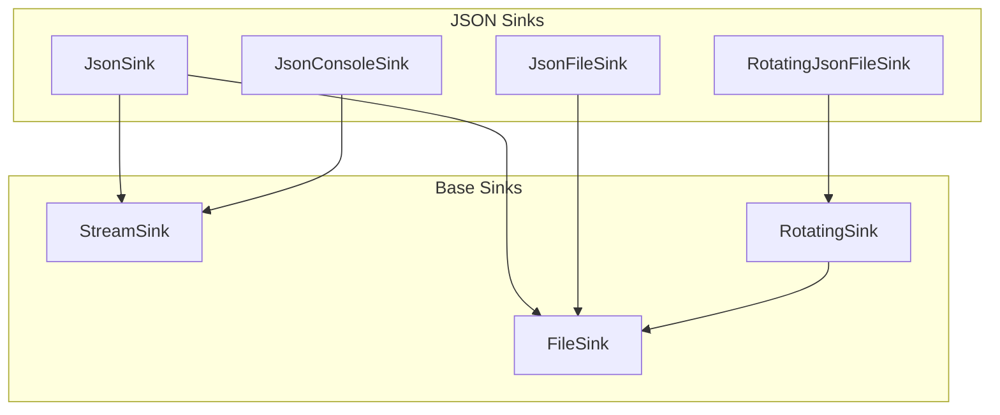
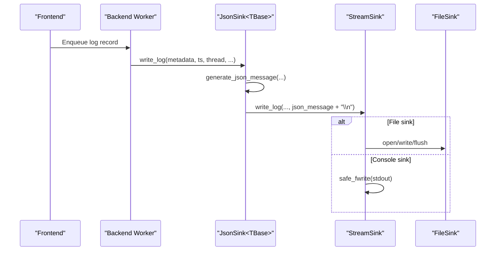
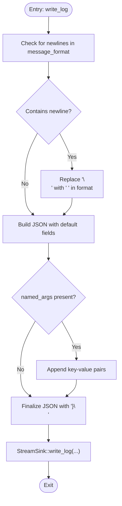
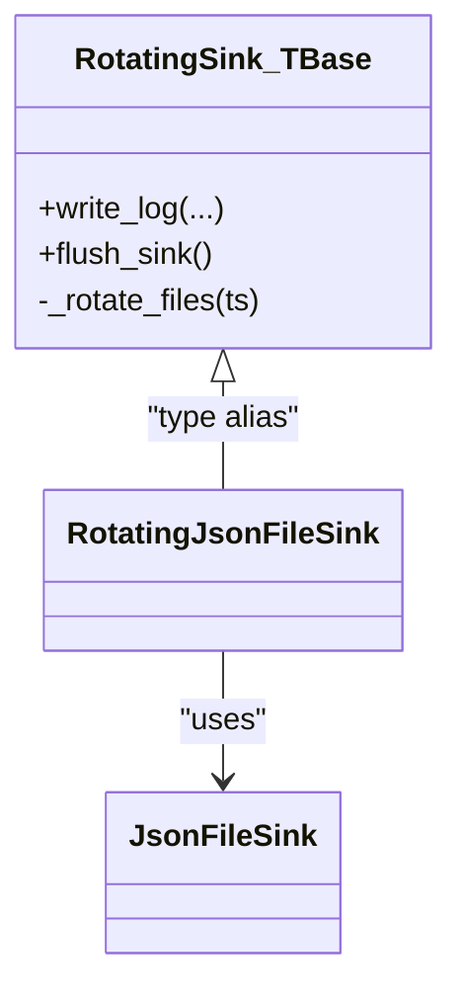
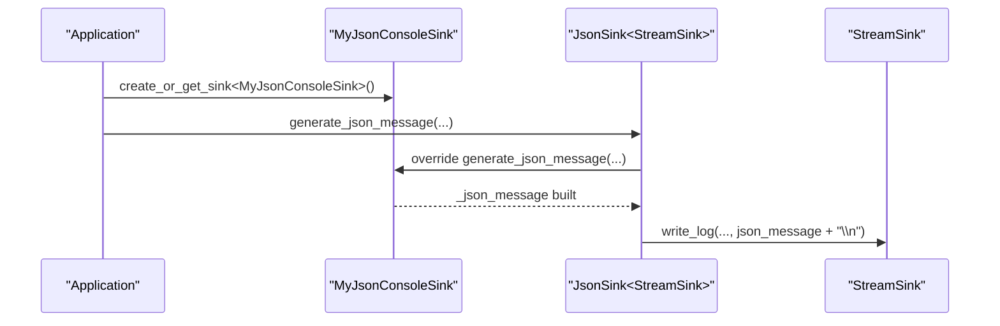
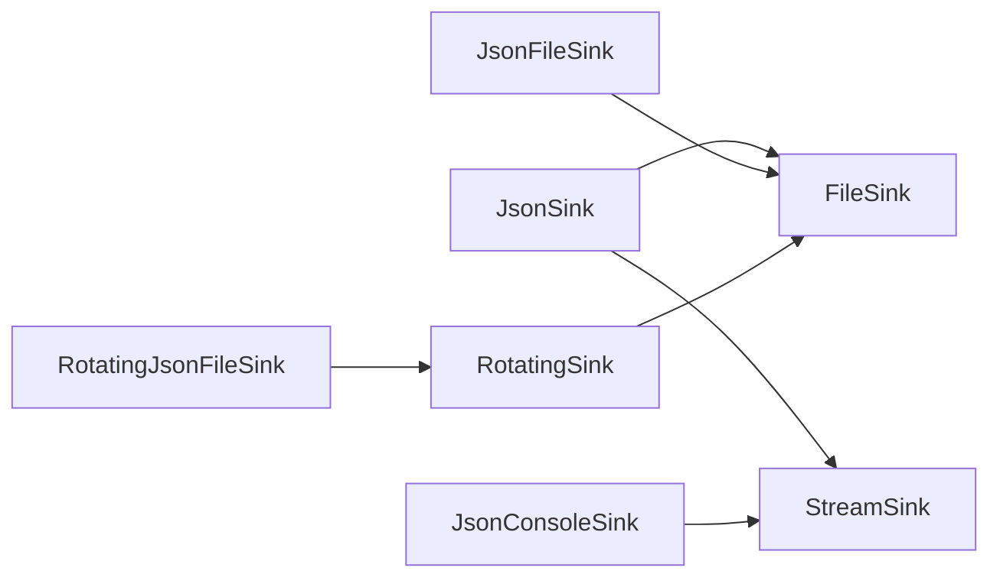

# JSON Sink

<cite>
**Referenced Files in This Document**
- [JsonSink.h](file://include/quill/sinks/JsonSink.h)
- [JsonFileSink.h](file://include/quill/sinks/JsonFileSink.h)
- [RotatingJsonFileSink.h](file://include/quill/sinks/RotatingJsonFileSink.h)
- [FileSink.h](file://include/quill/sinks/FileSink.h)
- [StreamSink.h](file://include/quill/sinks/StreamSink.h)
- [RotatingSink.h](file://include/quill/sinks/RotatingSink.h)
- [PatternFormatterOptions.h](file://include/quill/core/PatternFormatterOptions.h)
- [json_console_logging.cpp](file://examples/json_console_logging.cpp)
- [json_console_logging_custom_json.cpp](file://examples/json_console_logging_custom_json.cpp)
- [json_file_logging.cpp](file://examples/json_file_logging.cpp)
- [rotating_json_file_logging.cpp](file://examples/rotating_json_file_logging.cpp)
- [rotating_json_file_logging_custom_json.cpp](file://examples/rotating_json_file_logging_custom_json.cpp)
- [json_logging.rst](file://docs/json_logging.rst)
</cite>

## Table of Contents
1. [Introduction](#introduction)
2. [Project Structure](#project-structure)
3. [Core Components](#core-components)
4. [Architecture Overview](#architecture-overview)
5. [Detailed Component Analysis](#detailed-component-analysis)
6. [Dependency Analysis](#dependency-analysis)
7. [Performance Considerations](#performance-considerations)
8. [Troubleshooting Guide](#troubleshooting-guide)
9. [Conclusion](#conclusion)
10. [Appendices](#appendices)

## Introduction
This document explains Quill’s JSON sink infrastructure for structured logging. It covers how JSON is produced, customized, and emitted to console, files, and rotating files. It also documents metadata inclusion (log level, timestamp, thread info), named arguments, and integration with file rotation. Practical examples show basic JSON logging, custom JSON structures, and rotating JSON file logging. Guidance on performance, memory usage, throughput, and schema evolution is included to help integrate with downstream systems.

## Project Structure
The JSON sink family is implemented as layered sinks:
- JsonSink<TBase>: a generic JSON formatter that builds a JSON message and delegates writing to the underlying stream.
- JsonFileSink: JSON to file via FileSink.
- JsonConsoleSink: JSON to stdout via StreamSink.
- RotatingJsonFileSink: JSON to rotating files via RotatingSink<JsonFileSink>.

**Diagram sources**
- [JsonSink.h:32-162](file://include/quill/sinks/JsonSink.h#L32-L162)
- [JsonFileSink.h:140-152](file://include/quill/sinks/JsonSink.h#L140-L152)
- [RotatingJsonFileSink.h:14](file://include/quill/sinks/RotatingJsonFileSink.h#L14)
- [FileSink.h:226-527](file://include/quill/sinks/FileSink.h#L226-L527)
- [StreamSink.h:67-314](file://include/quill/sinks/StreamSink.h#L67-L314)
- [RotatingSink.h:262-316](file://include/quill/sinks/RotatingSink.h#L262-L316)

**Section sources**
- [JsonSink.h:29-162](file://include/quill/sinks/JsonSink.h#L29-L162)
- [JsonFileSink.h:140-152](file://include/quill/sinks/JsonSink.h#L140-L152)
- [RotatingJsonFileSink.h:14](file://include/quill/sinks/RotatingJsonFileSink.h#L14)
- [FileSink.h:226-527](file://include/quill/sinks/FileSink.h#L226-L527)
- [StreamSink.h:67-314](file://include/quill/sinks/StreamSink.h#L67-L314)
- [RotatingSink.h:262-316](file://include/quill/sinks/RotatingSink.h#L262-L316)

## Core Components
- JsonSink<TBase>: Provides the JSON message generation and enforces newline termination. It accepts metadata, thread/process identifiers, logger name, log level, and named arguments, then constructs a JSON payload and writes it via the base stream.
- JsonFileSink: A specialization of JsonSink<FileSink>, enabling JSON output to files with configurable file behavior.
- JsonConsoleSink: A specialization of JsonSink<StreamSink>, enabling JSON output to stdout.
- RotatingJsonFileSink: A type alias for RotatingSink<JsonFileSink>, enabling JSON output with rotation policies.

Key behaviors:
- JSON schema defaults include timestamp, file name, line number, thread_id, logger, log_level, and message. Named arguments are appended as key-value pairs.
- Newlines in the original message are sanitized to maintain valid JSON.
- The final JSON record ends with a newline.

**Section sources**
- [JsonSink.h:58-129](file://include/quill/sinks/JsonSink.h#L58-L129)
- [JsonSink.h:140-162](file://include/quill/sinks/JsonSink.h#L140-L162)
- [JsonFileSink.h:140-152](file://include/quill/sinks/JsonSink.h#L140-L152)
- [RotatingJsonFileSink.h:14](file://include/quill/sinks/RotatingJsonFileSink.h#L14)

## Architecture Overview
The JSON sink pipeline integrates with Quill’s backend and frontend. The frontend logs are queued and processed by the backend worker, which invokes the sink’s write_log method. For JSON sinks, the JsonSink<TBase>::write_log method builds the JSON record and forwards it to the base stream via StreamSink::write_log.

**Diagram sources**
- [JsonSink.h:58-93](file://include/quill/sinks/JsonSink.h#L58-L93)
- [StreamSink.h:152-180](file://include/quill/sinks/StreamSink.h#L152-L180)
- [FileSink.h:264-288](file://include/quill/sinks/FileSink.h#L264-L288)

## Detailed Component Analysis

### JsonSink<TBase> Implementation
JsonSink<TBase> is a template-based JSON formatter that:
- Sanitizes the message format by replacing newlines with spaces to keep JSON valid.
- Builds a JSON record with default fields: timestamp, file_name, line, thread_id, logger, log_level, message.
- Appends named arguments as additional key-value pairs.
- Appends "}\n" to finalize the record and delegates writing to the base stream.

**Diagram sources**
- [JsonSink.h:66-93](file://include/quill/sinks/JsonSink.h#L66-L93)
- [JsonSink.h:104-129](file://include/quill/sinks/JsonSink.h#L104-L129)

**Section sources**
- [JsonSink.h:58-129](file://include/quill/sinks/JsonSink.h#L58-L129)

### JsonFileSink and JsonConsoleSink
- JsonFileSink: Inherits from JsonSink<FileSink>, enabling JSON output to files with configurable open mode, filename append options, and buffering.
- JsonConsoleSink: Inherits from JsonSink<StreamSink>, enabling JSON output to stdout.

Both sinks reuse JsonSink<TBase>::generate_json_message unless overridden.

**Section sources**
- [JsonSink.h:140-162](file://include/quill/sinks/JsonSink.h#L140-L162)
- [FileSink.h:64-220](file://include/quill/sinks/FileSink.h#L64-L220)

### RotatingJsonFileSink
RotatingJsonFileSink is defined as RotatingSink<JsonFileSink>. It inherits rotation capabilities (size/time-based) and applies them to JSON file output.

**Diagram sources**
- [RotatingJsonFileSink.h:14](file://include/quill/sinks/RotatingJsonFileSink.h#L14)
- [RotatingSink.h:262-316](file://include/quill/sinks/RotatingSink.h#L262-L316)

**Section sources**
- [RotatingJsonFileSink.h:14](file://include/quill/sinks/RotatingJsonFileSink.h#L14)
- [RotatingSink.h:262-316](file://include/quill/sinks/RotatingSink.h#L262-L316)

### Custom JSON Formatting
To customize JSON output, derive from JsonConsoleSink or JsonFileSink and override generate_json_message. Examples demonstrate:
- Minimal JSON with timestamp, log level, and message.
- Custom timestamp formatting and additional fields.

**Diagram sources**
- [json_console_logging_custom_json.cpp:12-40](file://examples/json_console_logging_custom_json.cpp#L12-L40)
- [JsonSink.h:104-129](file://include/quill/sinks/JsonSink.h#L104-L129)

**Section sources**
- [json_console_logging_custom_json.cpp:12-40](file://examples/json_console_logging_custom_json.cpp#L12-L40)
- [json_file_logging.cpp:49-73](file://examples/json_file_logging.cpp#L49-L73)

## Dependency Analysis
- JsonSink<TBase> depends on:
  - Base stream via StreamSink for writing.
  - File-based behavior via FileSink for file-backed JSON sinks.
  - Formatting utilities for JSON construction.
- RotatingJsonFileSink depends on RotatingSink<JsonFileSink>, which depends on FileSink and filesystem utilities for rotation.

**Diagram sources**
- [JsonSink.h:32-162](file://include/quill/sinks/JsonSink.h#L32-L162)
- [FileSink.h:226-527](file://include/quill/sinks/FileSink.h#L226-L527)
- [StreamSink.h:67-314](file://include/quill/sinks/StreamSink.h#L67-L314)
- [RotatingSink.h:262-316](file://include/quill/sinks/RotatingSink.h#L262-L316)

**Section sources**
- [JsonSink.h:32-162](file://include/quill/sinks/JsonSink.h#L32-L162)
- [RotatingSink.h:262-316](file://include/quill/sinks/RotatingSink.h#L262-L316)

## Performance Considerations
- JSON construction:
  - JsonSink<TBase> uses a preallocated buffer for building the JSON message and appends fields incrementally. This minimizes allocations and improves throughput.
- Writing:
  - StreamSink::safe_fwrite handles partial writes and platform-specific console output (Windows WriteFile for stdout/stderr).
  - FileSink supports configurable write buffers and optional fsync to balance performance and durability.
- Rotation overhead:
  - RotatingSink flushes and fsyncs before rotation, then renames files with index/date suffixes. This ensures atomicity and avoids collisions.
- Throughput tips:
  - Prefer minimal JSON schemas when high throughput is required.
  - Use buffered file I/O and tune write buffer sizes via FileSinkConfig.
  - Avoid excessive metadata fields in JSON records to reduce serialization cost.

[No sources needed since this section provides general guidance]

## Troubleshooting Guide
Common issues and resolutions:
- Newlines in messages:
  - JsonSink<TBase> replaces newlines in the message format to keep JSON valid. If your message spans lines, consider using a single-line format or customizing the message.
- File rotation conflicts:
  - RotatingSink cleans and recovers files based on naming schemes. Ensure consistent naming and backup limits to avoid unexpected file retention.
- Buffering and fsync:
  - If durability is critical, enable fsync and set a minimum fsync interval. For high throughput, consider disabling fsync or increasing intervals.
- Console output:
  - JsonConsoleSink writes to stdout. On Windows, StreamSink uses WriteFile for console streams to avoid extra carriage returns.

**Section sources**
- [JsonSink.h:66-80](file://include/quill/sinks/JsonSink.h#L66-L80)
- [RotatingSink.h:490-654](file://include/quill/sinks/RotatingSink.h#L490-L654)
- [FileSink.h:146-220](file://include/quill/sinks/FileSink.h#L146-L220)
- [StreamSink.h:224-278](file://include/quill/sinks/StreamSink.h#L224-L278)

## Conclusion
Quill’s JSON sink provides a flexible, high-performance foundation for structured logging. It supports default JSON schemas enriched with metadata and named arguments, and it integrates seamlessly with file and console outputs, including rotation. Customization hooks allow tailoring JSON structure to downstream systems, while configuration options enable balancing performance, durability, and storage management.

[No sources needed since this section summarizes without analyzing specific files]

## Appendices

### Practical Examples
- Basic JSON console logging:
  - Demonstrates creating a JSON console sink, configuring an empty pattern formatter, and logging with named arguments.
  - Example path: [json_console_logging.cpp](file://examples/json_console_logging.cpp)
- Custom JSON console logging:
  - Shows deriving from JsonConsoleSink and overriding generate_json_message to tailor the JSON structure.
  - Example path: [json_console_logging_custom_json.cpp](file://examples/json_console_logging_custom_json.cpp)
- JSON file logging:
  - Shows logging JSON to a file and optionally combining with a standard console logger.
  - Example path: [json_file_logging.cpp](file://examples/json_file_logging.cpp)
- Rotating JSON file logging:
  - Demonstrates rotating JSON logs by size and time with a rotating JSON file sink.
  - Example path: [rotating_json_file_logging.cpp](file://examples/rotating_json_file_logging.cpp)
- Custom rotating JSON file logging:
  - Shows deriving from RotatingJsonFileSink to customize JSON fields and timestamp formatting.
  - Example path: [rotating_json_file_logging_custom_json.cpp](file://examples/rotating_json_file_logging_custom_json.cpp)

**Section sources**
- [json_console_logging.cpp:17-34](file://examples/json_console_logging.cpp#L17-L34)
- [json_console_logging_custom_json.cpp:12-40](file://examples/json_console_logging_custom_json.cpp#L12-L40)
- [json_file_logging.cpp:27-47](file://examples/json_file_logging.cpp#L27-L47)
- [rotating_json_file_logging.cpp:20-43](file://examples/rotating_json_file_logging.cpp#L20-L43)
- [rotating_json_file_logging_custom_json.cpp:21-64](file://examples/rotating_json_file_logging_custom_json.cpp#L21-L64)

### JSON Schema Options and Field Customization
- Default JSON fields:
  - timestamp, file_name, line, thread_id, logger, log_level, message.
- Named arguments:
  - Automatically appended as key-value pairs when provided.
- Customization:
  - Override generate_json_message to change field order, add/remove fields, or alter formatting.
- Pretty printing vs compact:
  - The default implementation produces compact JSON records. To emit pretty-printed JSON, implement a custom formatter that adds indentation and line breaks in generate_json_message.

**Section sources**
- [JsonSink.h:104-129](file://include/quill/sinks/JsonSink.h#L104-L129)
- [json_console_logging_custom_json.cpp:24-39](file://examples/json_console_logging_custom_json.cpp#L24-L39)

### Metadata Handling
- Included metadata:
  - Timestamp (nanoseconds since epoch), file name, line number, thread_id, logger name, log level description, and short code.
- Thread and process info:
  - thread_id and process_id are passed to the sink; thread_name is available but not included by default.
- Custom fields:
  - Extend generate_json_message to include additional metadata such as hostname, correlation IDs, or environment-specific attributes.

**Section sources**
- [JsonSink.h:58-64](file://include/quill/sinks/JsonSink.h#L58-L64)
- [JsonSink.h:104-129](file://include/quill/sinks/JsonSink.h#L104-L129)

### Integration with File Rotation, Console, and Custom Streams
- File rotation:
  - Use RotatingJsonFileSink with rotation policies (size/time/daily). Backup limits and naming schemes are configurable.
- Console output:
  - Use JsonConsoleSink for JSON to stdout. Combine with a standard logger for dual-format output.
- Custom streams:
  - Derive from JsonSink<TBase> and override write_log or generate_json_message to target custom streams or protocols.

**Section sources**
- [RotatingJsonFileSink.h:14](file://include/quill/sinks/RotatingJsonFileSink.h#L14)
- [RotatingSink.h:396-487](file://include/quill/sinks/RotatingSink.h#L396-L487)
- [json_file_logging.cpp:49-73](file://examples/json_file_logging.cpp#L49-L73)

### Configuration Recommendations
- Console-only JSON logging:
  - Empty pattern formatter to avoid redundant formatting overhead.
  - Example path: [json_console_logging.cpp](file://examples/json_console_logging.cpp)
- File-only JSON logging:
  - Configure FileSinkConfig with desired open mode, filename append option, and write buffer size.
  - Example path: [json_file_logging.cpp](file://examples/json_file_logging.cpp)
- Rotating JSON logging:
  - Choose rotation frequency/time or size thresholds. Limit backups and enable overwrite policy as needed.
  - Example path: [rotating_json_file_logging.cpp](file://examples/rotating_json_file_logging.cpp)
- Downstream integration:
  - Align JSON fields with your log aggregation system’s expectations. Consider adding correlation IDs, service metadata, and environment tags.

**Section sources**
- [json_console_logging.cpp:22-24](file://examples/json_console_logging.cpp#L22-L24)
- [json_file_logging.cpp:32-37](file://examples/json_file_logging.cpp#L32-L37)
- [rotating_json_file_logging.cpp:26-32](file://examples/rotating_json_file_logging.cpp#L26-L32)

### JSON Parsing and Schema Evolution
- Parsing requirements:
  - Ensure downstream parsers handle escaped characters and embedded quotes in JSON values.
- Field validation:
  - Validate presence of required fields (e.g., timestamp, log_level) and enforce types.
- Schema evolution:
  - Add optional fields gradually and avoid removing fields to maintain backward compatibility.
  - Use a version field if significant structural changes are necessary.

[No sources needed since this section provides general guidance]