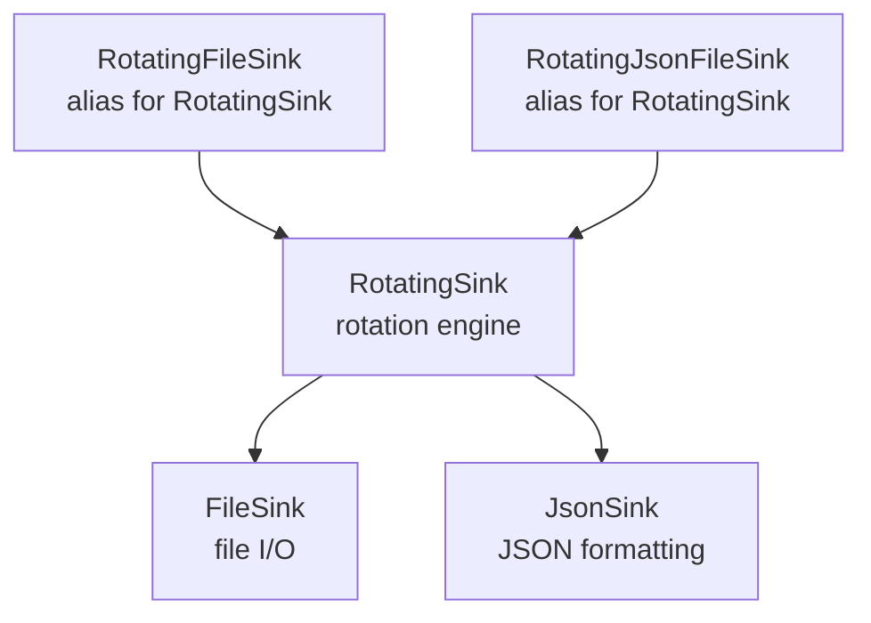
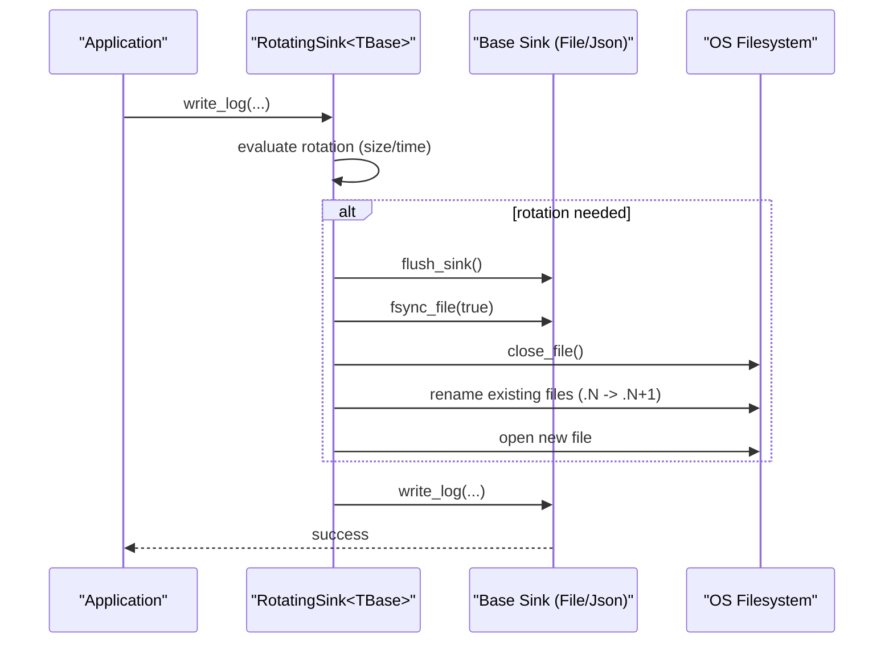
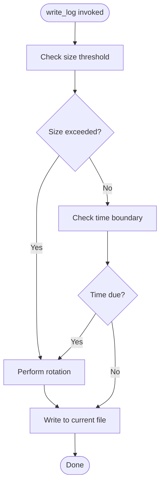
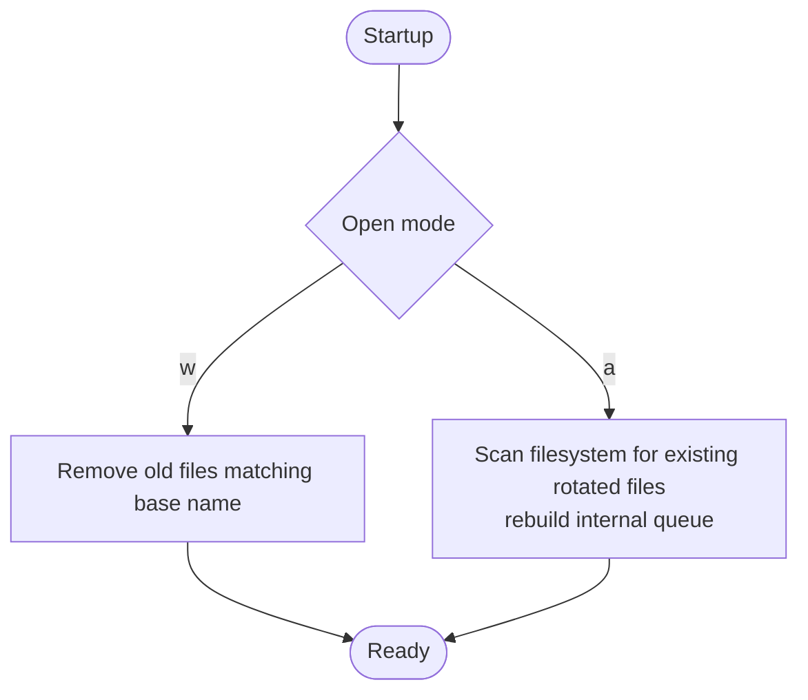
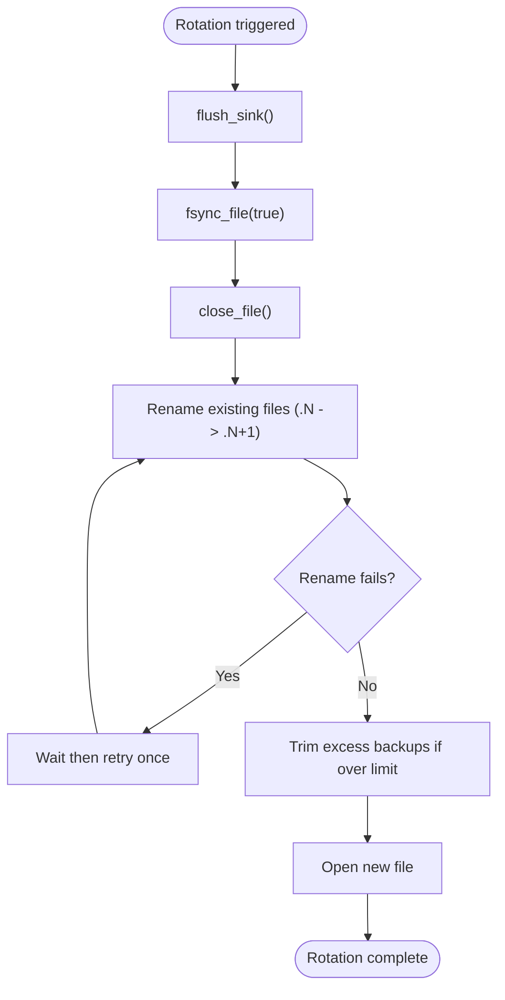
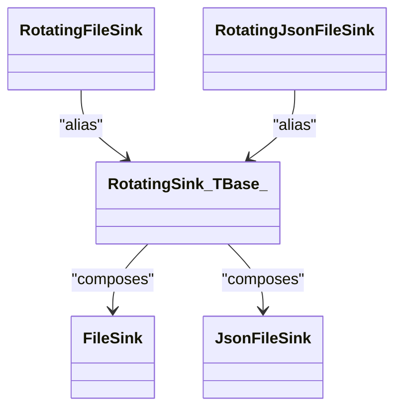

# Rotating File Sink

<cite>
**Referenced Files in This Document**
- [RotatingFileSink.h](file://include/quill/sinks/RotatingFileSink.h)
- [RotatingSink.h](file://include/quill/sinks/RotatingSink.h)
- [RotatingJsonFileSink.h](file://include/quill/sinks/RotatingJsonFileSink.h)
- [FileSink.h](file://include/quill/sinks/FileSink.h)
- [JsonSink.h](file://include/quill/sinks/JsonSink.h)
- [rotating_file_logging.cpp](file://examples/rotating_file_logging.cpp)
- [rotating_json_file_logging.cpp](file://examples/rotating_json_file_logging.cpp)
- [rotating_json_file_logging_custom_json.cpp](file://examples/rotating_json_file_logging_custom_json.cpp)
- [RotatingFileSinkTest.cpp](file://test/unit_tests/RotatingFileSinkTest.cpp)
</cite>

## Table of Contents
1. [Introduction](#introduction)
2. [Project Structure](#project-structure)
3. [Core Components](#core-components)
4. [Architecture Overview](#architecture-overview)
5. [Detailed Component Analysis](#detailed-component-analysis)
6. [Dependency Analysis](#dependency-analysis)
7. [Performance Considerations](#performance-considerations)
8. [Troubleshooting Guide](#troubleshooting-guide)
9. [Conclusion](#conclusion)
10. [Appendices](#appendices)

## Introduction
This document explains Quill’s rotating file sink implementation, focusing on how rotation policies are configured and enforced, how archives are managed, and how concurrency and disk resources are handled. It covers size-based rotation, time-based rotation (daily, hourly, minute intervals), hybrid strategies combining both, and archive naming/cleanup policies. Practical examples show basic rotating file logging, JSON rotating logs, and custom JSON formatting. Guidance is included for performance, disk space management, backup strategies, integration with external tools, monitoring, and troubleshooting.

## Project Structure
Quill’s rotating file sink is implemented as a template wrapper around a base file sink. The primary building blocks are:
- RotatingFileSink: alias for rotating over FileSink
- RotatingJsonFileSink: alias for rotating over JsonFileSink
- RotatingSink<TBase>: the generic rotating engine that orchestrates rotation decisions, file renaming, and lifecycle
- FileSink and JsonSink: underlying sinks that handle actual file I/O and JSON formatting

**Diagram sources**
- [RotatingFileSink.h:13](file://include/quill/sinks/RotatingFileSink.h#L13)
- [RotatingJsonFileSink.h:14](file://include/quill/sinks/RotatingJsonFileSink.h#L14)
- [RotatingSink.h:262](file://include/quill/sinks/RotatingSink.h#L262)
- [FileSink.h:140](file://include/quill/sinks/FileSink.h#L140)
- [JsonSink.h:140](file://include/quill/sinks/JsonSink.h#L140)

**Section sources**
- [RotatingFileSink.h:13](file://include/quill/sinks/RotatingFileSink.h#L13)
- [RotatingJsonFileSink.h:14](file://include/quill/sinks/RotatingJsonFileSink.h#L14)
- [RotatingSink.h:262](file://include/quill/sinks/RotatingSink.h#L262)

## Core Components
- RotatingFileSinkConfig: configuration container for rotation behavior, including:
  - Size thresholds (bytes)
  - Time-based rotation frequency and interval
  - Daily rotation time-of-day
  - Backup file limits and overwrite policy
  - Archive naming scheme (index/date/date-and-time)
  - Startup rotation behavior and old-file cleanup
- RotatingSink<TBase>: the rotating engine that:
  - Decides when to rotate based on size and/or time
  - Renames and rotates files atomically
  - Manages backup counts and cleanup
  - Handles concurrent access by flushing and fsync before rotation
  - Supports rotation-on-creation and filename collision cleanup

Key behaviors:
- Rotation triggers: either size threshold exceeded OR time boundary reached
- Hybrid rotation: both size and time can be active concurrently
- Naming schemes:
  - Index: .1, .2, .3...
  - Date: .YYYYMMDD
  - DateAndTime: .YYYYMMDD_HHMMSS
- Cleanup: optional removal of old files on startup and enforcement of backup limits

**Section sources**
- [RotatingSink.h:39](file://include/quill/sinks/RotatingSink.h#L39)
- [RotatingSink.h:278](file://include/quill/sinks/RotatingSink.h#L278)
- [RotatingSink.h:373](file://include/quill/sinks/RotatingSink.h#L373)
- [RotatingSink.h:386](file://include/quill/sinks/RotatingSink.h#L386)
- [RotatingSink.h:396](file://include/quill/sinks/RotatingSink.h#L396)
- [RotatingSink.h:490](file://include/quill/sinks/RotatingSink.h#L490)
- [RotatingSink.h:810](file://include/quill/sinks/RotatingSink.h#L810)

## Architecture Overview
The rotating sink composes a base sink (FileSink or JsonFileSink) with rotation logic. At write time, the engine evaluates rotation conditions and performs atomic file rotation when needed.

**Diagram sources**
- [RotatingSink.h:335](file://include/quill/sinks/RotatingSink.h#L335)
- [RotatingSink.h:373](file://include/quill/sinks/RotatingSink.h#L373)
- [RotatingSink.h:386](file://include/quill/sinks/RotatingSink.h#L386)
- [RotatingSink.h:396](file://include/quill/sinks/RotatingSink.h#L396)

## Detailed Component Analysis

### Rotation Policies and Triggers
- Size-based rotation:
  - Configured via set_rotation_max_file_size(bytes)
  - Triggered when current file size plus incoming log size exceeds threshold
- Time-based rotation:
  - set_rotation_frequency_and_interval('M'|'H', interval) supports minute/hour intervals
  - set_rotation_time_daily("HH:MM") schedules daily rotation at a specific time-of-day
  - Initial and subsequent rotation timestamps computed using configured timezone
- Hybrid rotation:
  - Both size and time can be active; either condition triggers rotation
- Rotation-on-creation:
  - set_rotation_on_creation(true) rotates existing non-empty file on sink construction

**Diagram sources**
- [RotatingSink.h:335](file://include/quill/sinks/RotatingSink.h#L335)
- [RotatingSink.h:373](file://include/quill/sinks/RotatingSink.h#L373)
- [RotatingSink.h:386](file://include/quill/sinks/RotatingSink.h#L386)

**Section sources**
- [RotatingSink.h:66](file://include/quill/sinks/RotatingSink.h#L66)
- [RotatingSink.h:87](file://include/quill/sinks/RotatingSink.h#L87)
- [RotatingSink.h:116](file://include/quill/sinks/RotatingSink.h#L116)
- [RotatingSink.h:166](file://include/quill/sinks/RotatingSink.h#L166)
- [RotatingSink.h:729](file://include/quill/sinks/RotatingSink.h#L729)
- [RotatingSink.h:785](file://include/quill/sinks/RotatingSink.h#L785)

### Archive Management and Naming
- Naming schemes:
  - Index: appends .1, .2, .3... to rotated files
  - Date: appends .YYYYMMDD
  - DateAndTime: appends .YYYYMMDD_HHMMSS
- Backup limits:
  - set_max_backup_files(n) controls how many rotated files to retain
  - set_overwrite_rolled_files(true/false) determines whether oldest backups are overwritten when limit is hit
- Startup cleanup:
  - set_remove_old_files(true) removes colliding old files on 'w' mode
  - Recovery on 'a' mode rebuilds internal file index from existing files

**Diagram sources**
- [RotatingSink.h:490](file://include/quill/sinks/RotatingSink.h#L490)
- [RotatingSink.h:562](file://include/quill/sinks/RotatingSink.h#L562)
- [RotatingSink.h:650](file://include/quill/sinks/RotatingSink.h#L650)

**Section sources**
- [RotatingSink.h:154](file://include/quill/sinks/RotatingSink.h#L154)
- [RotatingSink.h:127](file://include/quill/sinks/RotatingSink.h#L127)
- [RotatingSink.h:135](file://include/quill/sinks/RotatingSink.h#L135)
- [RotatingSink.h:147](file://include/quill/sinks/RotatingSink.h#L147)
- [RotatingSink.h:810](file://include/quill/sinks/RotatingSink.h#L810)

### Concurrent Access and Disk Safety
- Before rotation, the engine flushes buffered writes and fsyncs to ensure durability
- File rename is retried once with a short delay to mitigate transient locks (e.g., antivirus)
- Backup limit enforcement trims the oldest file when exceeding configured count

**Diagram sources**
- [RotatingSink.h:406](file://include/quill/sinks/RotatingSink.h#L406)
- [RotatingSink.h:415](file://include/quill/sinks/RotatingSink.h#L415)
- [RotatingSink.h:430](file://include/quill/sinks/RotatingSink.h#L430)
- [RotatingSink.h:679](file://include/quill/sinks/RotatingSink.h#L679)
- [RotatingSink.h:470](file://include/quill/sinks/RotatingSink.h#L470)

**Section sources**
- [RotatingSink.h:406](file://include/quill/sinks/RotatingSink.h#L406)
- [RotatingSink.h:679](file://include/quill/sinks/RotatingSink.h#L679)
- [RotatingSink.h:470](file://include/quill/sinks/RotatingSink.h#L470)

### Practical Examples

- Basic rotating file logging
  - Demonstrates daily rotation and size-based rotation with a small threshold
  - Uses RotatingFileSink with filename append and open mode

  **Section sources**
  - [rotating_file_logging.cpp:21](file://examples/rotating_file_logging.cpp#L21)
  - [rotating_file_logging.cpp:29](file://examples/rotating_file_logging.cpp#L29)
  - [rotating_file_logging.cpp:30](file://examples/rotating_file_logging.cpp#L30)

- JSON rotating logs
  - Demonstrates RotatingJsonFileSink with daily rotation and size threshold
  - Uses JsonFileSink formatting

  **Section sources**
  - [rotating_json_file_logging.cpp:21](file://examples/rotating_json_file_logging.cpp#L21)
  - [rotating_json_file_logging.cpp:29](file://examples/rotating_json_file_logging.cpp#L29)
  - [rotating_json_file_logging.cpp:30](file://examples/rotating_json_file_logging.cpp#L30)
  - [JsonSink.h:140](file://include/quill/sinks/JsonSink.h#L140)

- Custom JSON formatting
  - Extends RotatingJsonFileSink to customize JSON fields and timestamp formatting

  **Section sources**
  - [rotating_json_file_logging_custom_json.cpp:21](file://examples/rotating_json_file_logging_custom_json.cpp#L21)
  - [rotating_json_file_logging_custom_json.cpp:33](file://examples/rotating_json_file_logging_custom_json.cpp#L33)
  - [rotating_json_file_logging_custom_json.cpp:46](file://examples/rotating_json_file_logging_custom_json.cpp#L46)

### Validation and Behavior Coverage
Unit tests validate:
- Index naming with and without backup limits, including overwrite behavior
- Date and DateAndTime naming with backup limits and overwrite behavior
- Time-based rotations (minutes, hours, daily at time)
- Startup cleanup and recovery scenarios
- Rotation-on-creation behavior with different naming schemes
- Invalid parameter detection

**Section sources**
- [RotatingFileSinkTest.cpp:13](file://test/unit_tests/RotatingFileSinkTest.cpp#L13)
- [RotatingFileSinkTest.cpp:73](file://test/unit_tests/RotatingFileSinkTest.cpp#L73)
- [RotatingFileSinkTest.cpp:470](file://test/unit_tests/RotatingFileSinkTest.cpp#L470)
- [RotatingFileSinkTest.cpp:1099](file://test/unit_tests/RotatingFileSinkTest.cpp#L1099)
- [RotatingFileSinkTest.cpp:1472](file://test/unit_tests/RotatingFileSinkTest.cpp#L1472)
- [RotatingFileSinkTest.cpp:1612](file://test/unit_tests/RotatingFileSinkTest.cpp#L1612)
- [RotatingFileSinkTest.cpp:1697](file://test/unit_tests/RotatingFileSinkTest.cpp#L1697)
- [RotatingFileSinkTest.cpp:2179](file://test/unit_tests/RotatingFileSinkTest.cpp#L2179)
- [RotatingFileSinkTest.cpp:2247](file://test/unit_tests/RotatingFileSinkTest.cpp#L2247)
- [RotatingFileSinkTest.cpp:1935](file://test/unit_tests/RotatingFileSinkTest.cpp#L1935)

## Dependency Analysis
RotatingFileSink and RotatingJsonFileSink are thin aliases that instantiate RotatingSink over FileSink and JsonFileSink respectively. The rotating engine depends on:
- Filesystem utilities for file operations and path manipulation
- Time utilities for calculating rotation boundaries and formatting timestamps
- Base sink for actual write operations and JSON formatting

**Diagram sources**
- [RotatingFileSink.h:13](file://include/quill/sinks/RotatingFileSink.h#L13)
- [RotatingJsonFileSink.h:14](file://include/quill/sinks/RotatingJsonFileSink.h#L14)
- [RotatingSink.h:262](file://include/quill/sinks/RotatingSink.h#L262)
- [FileSink.h:140](file://include/quill/sinks/FileSink.h#L140)
- [JsonSink.h:140](file://include/quill/sinks/JsonSink.h#L140)

**Section sources**
- [RotatingSink.h:11](file://include/quill/sinks/RotatingSink.h#L11)
- [RotatingSink.h:14](file://include/quill/sinks/RotatingSink.h#L14)

## Performance Considerations
- Rotation cost:
  - Flushing and fsync occur before rotation to ensure durability
  - File rename is retried once to handle transient locks (antivirus)
- Buffering:
  - Base FileSink supports configurable write buffer size and fsync interval to reduce disk overhead
- Throughput:
  - Frequent fsync can impact latency; tune fsync settings in FileSinkConfig when appropriate
- Disk space:
  - Backup limits prevent unbounded growth; choose naming scheme and limits aligned to retention needs
- Concurrency:
  - Rotation is serialized per sink; ensure minimal contention by avoiding excessive rotation triggers

[No sources needed since this section provides general guidance]

## Troubleshooting Guide
Common issues and remedies:
- Rotation not happening:
  - Verify size threshold is set appropriately and time rotation is configured if needed
  - Confirm rotation_on_creation is enabled if expecting pre-existing files to be rotated on startup
- Excessive disk usage:
  - Reduce max_backup_files or enable overwrite_rolled_files to enforce stricter limits
- Antivirus or file lock conflicts:
  - The engine retries rename once; if persistent, consider disabling fsync or adjusting antivirus exclusions
- Unexpected file collisions on startup:
  - Enable remove_old_files(true) with 'w' mode to clean up; verify naming scheme alignment
- Invalid configuration:
  - Size threshold must be at least 512 bytes; interval must be > 0; time-of-day format must be "HH:MM"

**Section sources**
- [RotatingSink.h:72](file://include/quill/sinks/RotatingSink.h#L72)
- [RotatingSink.h:103](file://include/quill/sinks/RotatingSink.h#L103)
- [RotatingSink.h:200](file://include/quill/sinks/RotatingSink.h#L200)
- [RotatingSink.h:679](file://include/quill/sinks/RotatingSink.h#L679)
- [RotatingFileSinkTest.cpp:1935](file://test/unit_tests/RotatingFileSinkTest.cpp#L1935)

## Conclusion
Quill’s rotating file sink provides robust, configurable rotation across size and time with flexible archive naming and strict retention controls. Its design balances safety (flush/fsync) and performance (buffering and retry logic), while unit tests validate a broad range of real-world scenarios. Choose naming schemes and limits appropriate to your application’s throughput and retention needs, and integrate with external log rotation tools where necessary.

[No sources needed since this section summarizes without analyzing specific files]

## Appendices

### Configuration Recommendations
- High-throughput services:
  - Increase rotation size threshold; consider time-based rotation to cap file sizes
  - Tune FileSinkConfig write buffer size and fsync interval to balance durability and latency
- Compliance-heavy environments:
  - Use Date or DateAndTime naming to simplify archival and retrieval
  - Enforce strict backup limits and overwrite behavior to control storage footprint
- Development/testing:
  - Use small size thresholds and frequent time intervals to exercise rotation logic
  - Enable rotation_on_creation to simulate fresh runs

[No sources needed since this section provides general guidance]