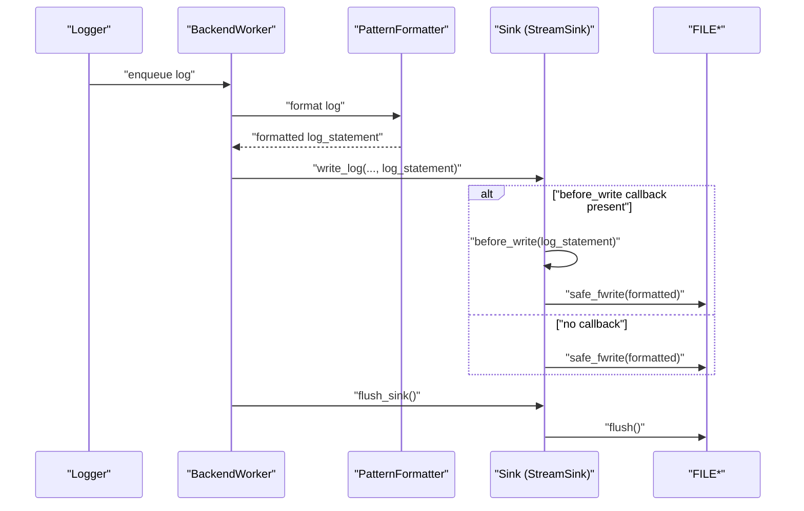
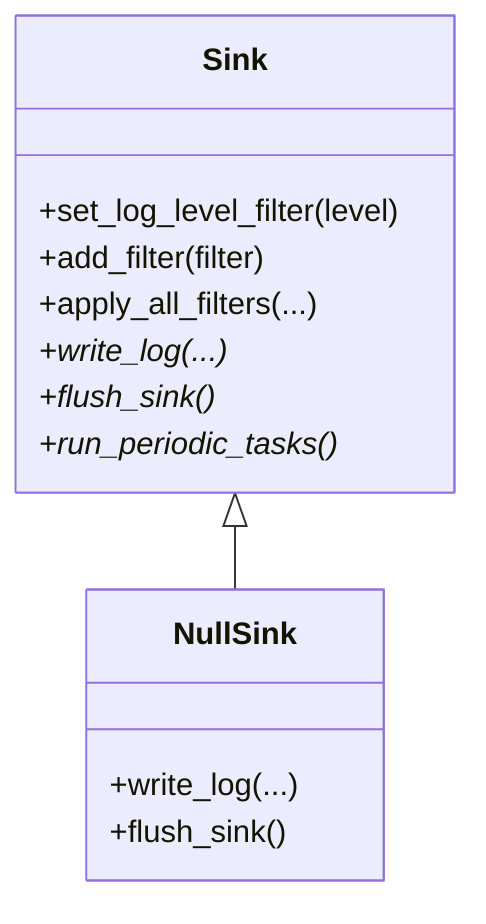
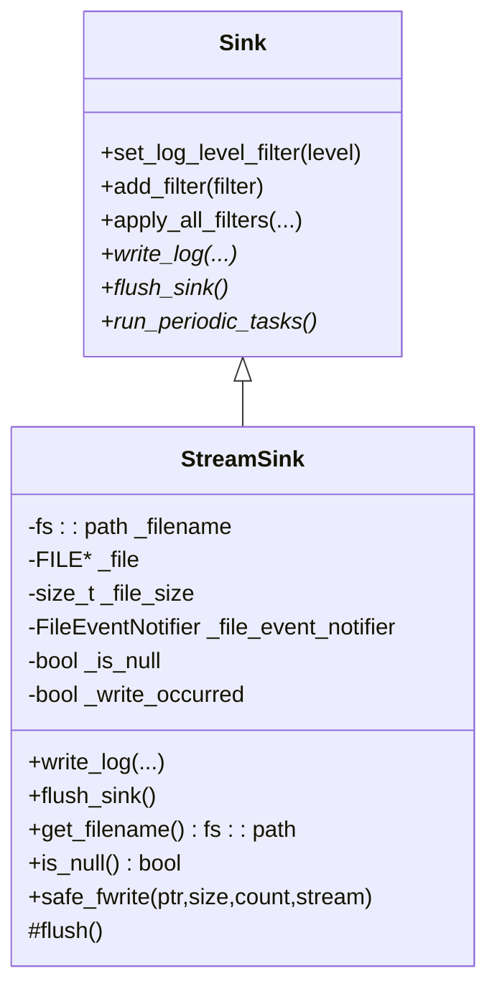
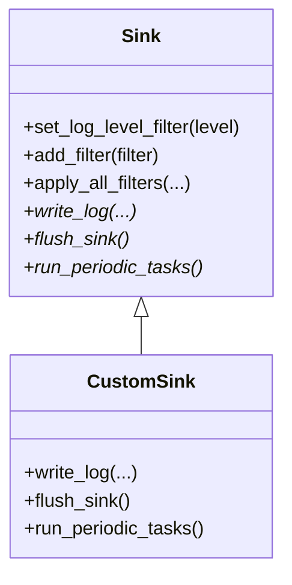
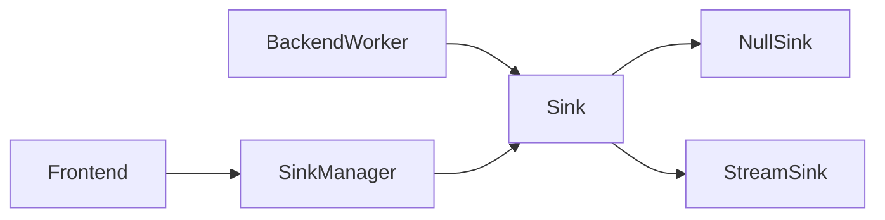

# Specialized Sinks

<cite>
**Referenced Files in This Document**
- [NullSink.h](file://include/quill/sinks/NullSink.h)
- [StreamSink.h](file://include/quill/sinks/StreamSink.h)
- [Sink.h](file://include/quill/sinks/Sink.h)
- [BackendWorker.h](file://include/quill/backend/BackendWorker.h)
- [Frontend.h](file://include/quill/Frontend.h)
- [SinkManager.h](file://include/quill/core/SinkManager.h)
- [sink_types.rst](file://docs/sink_types.rst)
- [sinks.rst](file://docs/sinks.rst)
- [user_defined_sink.cpp](file://examples/user_defined_sink.cpp)
- [UserSinkTest.cpp](file://test/integration_tests/UserSinkTest.cpp)
- [CsvWriter.h](file://include/quill/CsvWriter.h)
</cite>

## Table of Contents
1. [Introduction](#introduction)
2. [Project Structure](#project-structure)
3. [Core Components](#core-components)
4. [Architecture Overview](#architecture-overview)
5. [Detailed Component Analysis](#detailed-component-analysis)
6. [Dependency Analysis](#dependency-analysis)
7. [Performance Considerations](#performance-considerations)
8. [Troubleshooting Guide](#troubleshooting-guide)
9. [Conclusion](#conclusion)
10. [Appendices](#appendices)

## Introduction
This document focuses on specialized sink types in the logging framework, specifically NullSink and StreamSink. NullSink is a sink that discards all log messages and is ideal for performance testing, benchmarking, and load testing when output is not required. StreamSink is a base class for stream-based sinks that handles stream management, formatting integration, and provides extension patterns for custom sinks. The document explains usage patterns, performance implications, memory usage characteristics, and integration considerations for both sinks.

## Project Structure
The specialized sinks are part of the sinks module and integrate with the broader logging pipeline:
- Sink is the abstract base class for all sinks.
- NullSink inherits from Sink and discards logs.
- StreamSink inherits from Sink and manages FILE* streams, formatting integration, and optional file event notifications.
- BackendWorker coordinates formatting and dispatch to sinks.
- Frontend and SinkManager provide creation and retrieval of sinks.

```mermaid
graph TB
subgraph "Sinks Module"
SinkBase["Sink (abstract)"]
NullSink["NullSink"]
StreamSink["StreamSink"]
end
subgraph "Backend"
BackendWorker["BackendWorker"]
end
subgraph "Frontend"
Frontend["Frontend"]
SinkManager["SinkManager"]
end
BackendWorker --> SinkBase
Frontend --> SinkManager
SinkManager --> SinkBase
SinkBase --> NullSink
SinkBase --> StreamSink
```

**Diagram sources**
- [Sink.h:40-218](file://include/quill/sinks/Sink.h#L40-L218)
- [NullSink.h:24-38](file://include/quill/sinks/NullSink.h#L24-L38)
- [StreamSink.h:67-314](file://include/quill/sinks/StreamSink.h#L67-L314)
- [BackendWorker.h:1010-1039](file://include/quill/backend/BackendWorker.h#L1010-L1039)
- [Frontend.h:151-202](file://include/quill/Frontend.h#L151-L202)
- [SinkManager.h:28-103](file://include/quill/core/SinkManager.h#L28-L103)

**Section sources**
- [Sink.h:40-218](file://include/quill/sinks/Sink.h#L40-L218)
- [NullSink.h:24-38](file://include/quill/sinks/NullSink.h#L24-L38)
- [StreamSink.h:67-314](file://include/quill/sinks/StreamSink.h#L67-L314)
- [BackendWorker.h:1010-1039](file://include/quill/backend/BackendWorker.h#L1010-L1039)
- [Frontend.h:151-202](file://include/quill/Frontend.h#L151-L202)
- [SinkManager.h:28-103](file://include/quill/core/SinkManager.h#L28-L103)

## Core Components
- Sink: Abstract base class defining the interface for write_log, flush_sink, filters, and periodic tasks. It also manages pattern formatter overrides and log level filtering.
- NullSink: Inherits from Sink and implements empty body for write_log and flush_sink, effectively discarding all logs.
- StreamSink: Inherits from Sink and manages FILE* streams, including stdout, stderr, and files. It integrates formatting via PatternFormatter and supports optional file event callbacks.

Key responsibilities:
- NullSink: Zero-copy discard path for performance testing.
- StreamSink: Safe stream writing, flushing, and optional event hooks.

**Section sources**
- [Sink.h:40-218](file://include/quill/sinks/Sink.h#L40-L218)
- [NullSink.h:24-38](file://include/quill/sinks/NullSink.h#L24-L38)
- [StreamSink.h:67-314](file://include/quill/sinks/StreamSink.h#L67-L314)

## Architecture Overview
The logging pipeline formats messages once per logger and dispatches them to all sinks. StreamSink participates in this pipeline and optionally invokes file event callbacks before writing.



**Diagram sources**
- [BackendWorker.h:1010-1039](file://include/quill/backend/BackendWorker.h#L1010-L1039)
- [StreamSink.h:152-193](file://include/quill/sinks/StreamSink.h#L152-L193)

**Section sources**
- [BackendWorker.h:1010-1039](file://include/quill/backend/BackendWorker.h#L1010-L1039)
- [StreamSink.h:152-193](file://include/quill/sinks/StreamSink.h#L152-L193)

## Detailed Component Analysis

### NullSink Analysis
NullSink is a minimal sink that discards all log records. It is ideal for:
- Performance testing and benchmarking where output is unnecessary.
- Load testing scenarios where the goal is to measure throughput without I/O overhead.
- Development and CI environments where logs are disabled to reduce noise.

Implementation highlights:
- write_log is a no-op, avoiding any formatting or I/O.
- flush_sink is a no-op, minimizing backend overhead.

Usage patterns:
- Replace a regular sink with NullSink to disable output while keeping logging calls active.
- Combine with other sinks for selective output suppression.



**Diagram sources**
- [Sink.h:40-218](file://include/quill/sinks/Sink.h#L40-L218)
- [NullSink.h:24-38](file://include/quill/sinks/NullSink.h#L24-L38)

Practical example references:
- Using NullSink for performance testing: see [sink_types.rst:72-76](file://docs/sink_types.rst#L72-L76).

**Section sources**
- [NullSink.h:24-38](file://include/quill/sinks/NullSink.h#L24-L38)
- [sink_types.rst:72-76](file://docs/sink_types.rst#L72-L76)

### StreamSink Analysis
StreamSink is a base class for stream-based sinks. It manages FILE* streams, integrates with PatternFormatter, and supports optional file event notifications.

Key capabilities:
- Stream selection: stdout, stderr, or file paths.
- Directory creation and canonicalization for file paths.
- Safe writing with partial-write handling and platform-specific optimizations.
- Optional before_write callback to transform or intercept log statements.
- Periodic flush behavior controlled by flush_sink.



**Diagram sources**
- [Sink.h:40-218](file://include/quill/sinks/Sink.h#L40-L218)
- [StreamSink.h:67-314](file://include/quill/sinks/StreamSink.h#L67-L314)

Stream handling and formatting integration:
- Formatting occurs once per logger and is passed to sinks via log_statement.
- StreamSink writes the formatted string to the underlying stream.
- Optional before_write callback can modify the log statement prior to writing.

Platform-specific behavior:
- On Windows with console streams (stdout/stderr), StreamSink uses low-level WriteFile for correctness and performance.

**Section sources**
- [StreamSink.h:67-314](file://include/quill/sinks/StreamSink.h#L67-L314)
- [BackendWorker.h:1010-1039](file://include/quill/backend/BackendWorker.h#L1010-L1039)

### Custom Sink Extension Patterns
To create a custom sink:
- Derive from Sink and implement write_log, flush_sink, and optionally run_periodic_tasks.
- Use Frontend::create_or_get_sink to register and reuse sinks.
- Optionally override pattern formatter options for specific sinks.



**Diagram sources**
- [Sink.h:40-218](file://include/quill/sinks/Sink.h#L40-L218)
- [user_defined_sink.cpp:18-73](file://examples/user_defined_sink.cpp#L18-L73)

Integration examples:
- Creating a custom sink and logger: [user_defined_sink.cpp:75-90](file://examples/user_defined_sink.cpp#L75-L90)
- Sharing sinks across loggers and verifying counts: [UserSinkTest.cpp:54-119](file://test/integration_tests/UserSinkTest.cpp#L54-L119)

**Section sources**
- [user_defined_sink.cpp:18-73](file://examples/user_defined_sink.cpp#L18-L73)
- [UserSinkTest.cpp:54-119](file://test/integration_tests/UserSinkTest.cpp#L54-L119)

## Dependency Analysis
- Sink defines the contract and formatting/filtering integration.
- StreamSink depends on filesystem utilities, FILE*, and optional event notifier.
- BackendWorker formats messages once and dispatches to sinks.
- Frontend and SinkManager coordinate sink creation and retrieval.



**Diagram sources**
- [BackendWorker.h:1010-1039](file://include/quill/backend/BackendWorker.h#L1010-L1039)
- [Sink.h:40-218](file://include/quill/sinks/Sink.h#L40-L218)
- [NullSink.h:24-38](file://include/quill/sinks/NullSink.h#L24-L38)
- [StreamSink.h:67-314](file://include/quill/sinks/StreamSink.h#L67-L314)
- [Frontend.h:151-202](file://include/quill/Frontend.h#L151-L202)
- [SinkManager.h:28-103](file://include/quill/core/SinkManager.h#L28-L103)

**Section sources**
- [BackendWorker.h:1010-1039](file://include/quill/backend/BackendWorker.h#L1010-L1039)
- [Sink.h:40-218](file://include/quill/sinks/Sink.h#L40-L218)
- [NullSink.h:24-38](file://include/quill/sinks/NullSink.h#L24-L38)
- [StreamSink.h:67-314](file://include/quill/sinks/StreamSink.h#L67-L314)
- [Frontend.h:151-202](file://include/quill/Frontend.h#L151-L202)
- [SinkManager.h:28-103](file://include/quill/core/SinkManager.h#L28-L103)

## Performance Considerations
- NullSink:
  - Zero formatting and I/O overhead.
  - Ideal for measuring raw frontend throughput and backend worker performance.
  - Reduces memory pressure from buffers and avoids disk/network contention.
- StreamSink:
  - Safe writing with partial-write handling prevents stalls and improves reliability.
  - Platform-specific optimizations (e.g., WriteFile on Windows for console) improve throughput.
  - Optional before_write callback adds CPU cost; use judiciously.
  - Frequent flushes increase syscall overhead; rely on periodic flush behavior.
- Formatting:
  - BackendWorker formats once per logger and reuses the formatted string across sinks.
  - PatternFormatterOptions can be overridden per sink to minimize formatting cost.

Memory usage patterns:
- NullSink: Minimal heap allocations; primarily stack-based.
- StreamSink: Maintains file size and write occurrence flags; negligible heap growth per write.

Integration considerations:
- Use NullSink for baseline measurements and regression detection.
- Use StreamSink-derived sinks for production logging with appropriate buffering and rotation policies.

[No sources needed since this section provides general guidance]

## Troubleshooting Guide
Common issues and resolutions:
- Stream write failures:
  - safe_fwrite handles partial writes and errors; check errno and stream state.
  - On Windows console streams, ensure proper handle conversion and error reporting.
- File event notifier:
  - before_write callback must return a valid string; ensure thread-safety if modifying shared state.
- Flushing:
  - flush_sink only operates when writes occurred; verify _write_occurred flag and stream validity.
- Filtering and log level:
  - Ensure log level filters are configured appropriately; filtered logs will not reach sinks.

**Section sources**
- [StreamSink.h:152-193](file://include/quill/sinks/StreamSink.h#L152-L193)
- [StreamSink.h:214-278](file://include/quill/sinks/StreamSink.h#L214-L278)
- [Sink.h:65-104](file://include/quill/sinks/Sink.h#L65-L104)

## Conclusion
NullSink and StreamSink serve distinct roles in the logging ecosystem. NullSink enables high-throughput performance testing by eliminating output overhead, while StreamSink provides a robust, extensible foundation for stream-based logging with safe I/O and formatting integration. Together, they support flexible logging architectures, from development and benchmarking to production deployments.

[No sources needed since this section summarizes without analyzing specific files]

## Appendices

### Practical Examples and References
- Null sink usage for performance testing: [sink_types.rst:72-76](file://docs/sink_types.rst#L72-L76)
- Custom sink development: [user_defined_sink.cpp:75-90](file://examples/user_defined_sink.cpp#L75-L90)
- Sink sharing and verification: [UserSinkTest.cpp:54-119](file://test/integration_tests/UserSinkTest.cpp#L54-L119)
- CsvWriter integration with sinks: [CsvWriter.h:145-176](file://include/quill/CsvWriter.h#L145-L176)

**Section sources**
- [sink_types.rst:72-76](file://docs/sink_types.rst#L72-L76)
- [user_defined_sink.cpp:75-90](file://examples/user_defined_sink.cpp#L75-L90)
- [UserSinkTest.cpp:54-119](file://test/integration_tests/UserSinkTest.cpp#L54-L119)
- [CsvWriter.h:145-176](file://include/quill/CsvWriter.h#L145-L176)