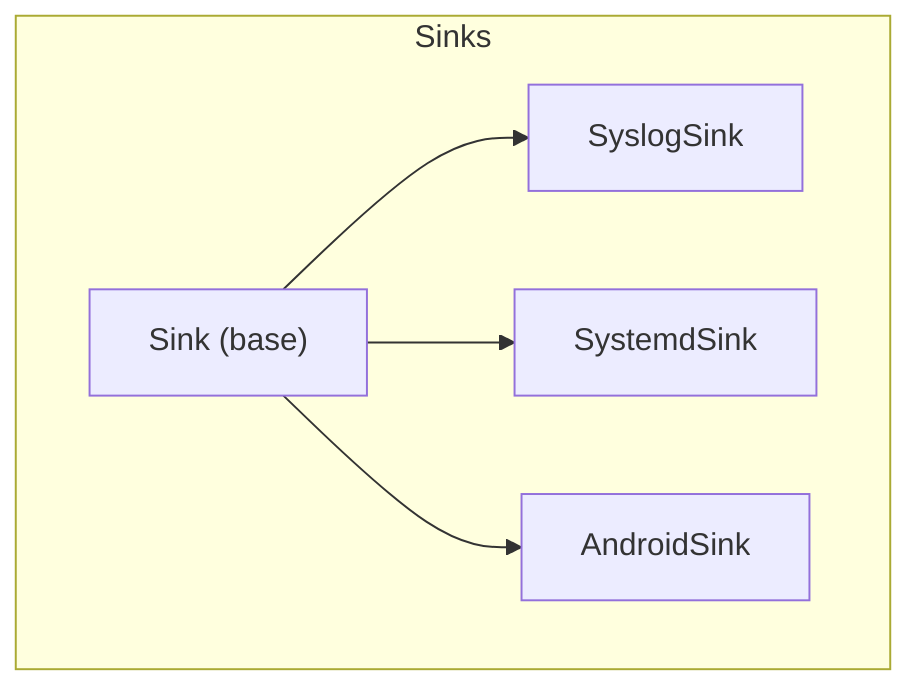
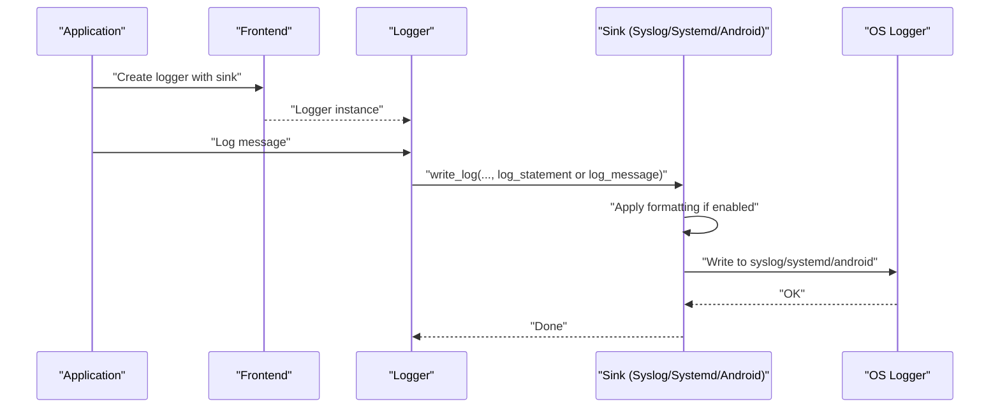
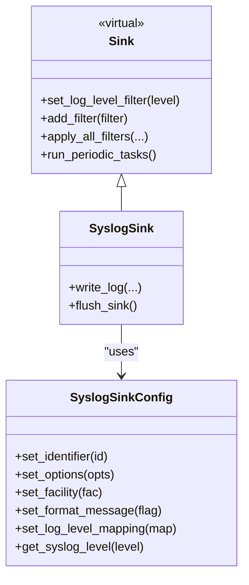
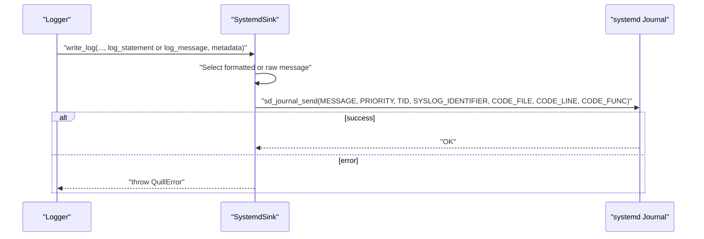
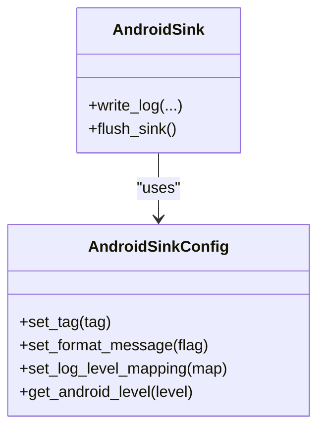
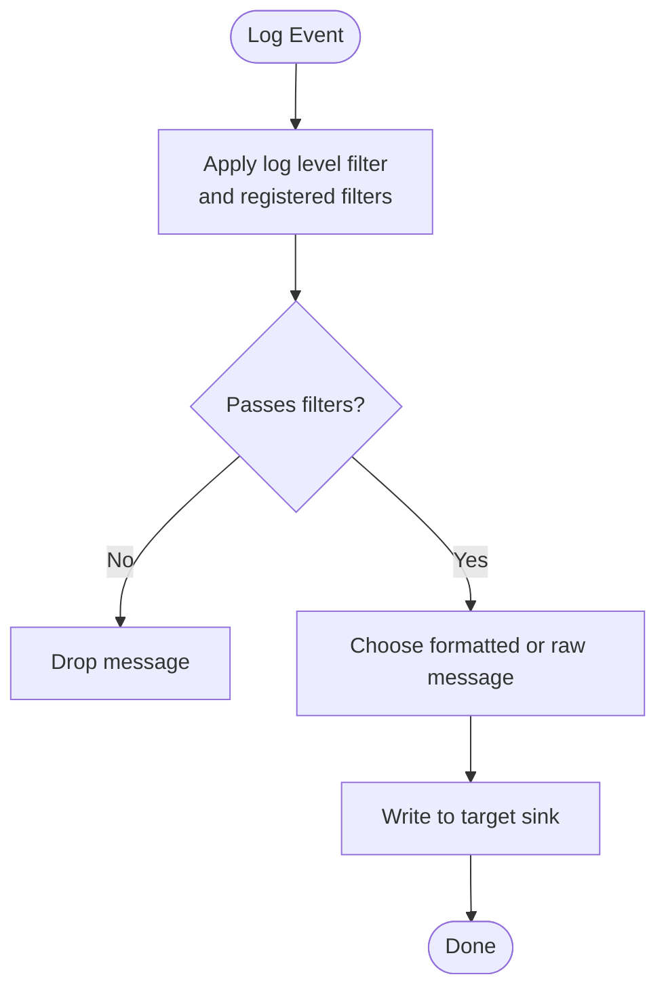
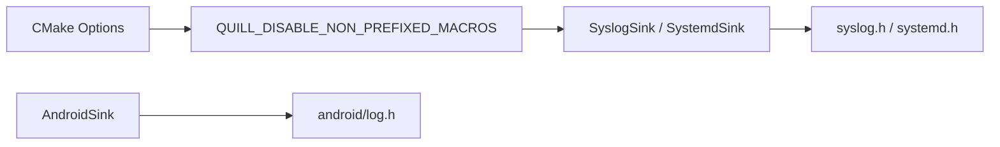

# System Integration Sinks

<cite>
**Referenced Files in This Document**
- [SyslogSink.h](file://include/quill/sinks/SyslogSink.h)
- [SystemdSink.h](file://include/quill/sinks/SystemdSink.h)
- [AndroidSink.h](file://include/quill/sinks/AndroidSink.h)
- [Sink.h](file://include/quill/sinks/Sink.h)
- [sink_types.rst](file://docs/sink_types.rst)
- [CMakeLists.txt](file://CMakeLists.txt)
</cite>

## Table of Contents
1. [Introduction](#introduction)
2. [Project Structure](#project-structure)
3. [Core Components](#core-components)
4. [Architecture Overview](#architecture-overview)
5. [Detailed Component Analysis](#detailed-component-analysis)
6. [Dependency Analysis](#dependency-analysis)
7. [Performance Considerations](#performance-considerations)
8. [Troubleshooting Guide](#troubleshooting-guide)
9. [Conclusion](#conclusion)
10. [Appendices](#appendices)

## Introduction
This document provides comprehensive documentation for three system integration sinks in the logging framework: SyslogSink, SystemdSink, and AndroidSink. It explains configuration options, mapping of log levels, formatting behavior, platform dependencies, and integration patterns. Practical examples are linked from the official documentation, and guidance is provided for performance, reliability, and troubleshooting across different deployment environments.

## Project Structure
The system integration sinks are implemented as specialized sinks that inherit from the base Sink interface. They integrate with platform logging systems:
- SyslogSink integrates with POSIX syslog facilities.
- SystemdSink integrates with the systemd journal.
- AndroidSink integrates with the Android NDK logging API.

**Diagram sources**
- [Sink.h:40-218](file://include/quill/sinks/Sink.h#L40-L218)
- [SyslogSink.h:137-182](file://include/quill/sinks/SyslogSink.h#L137-L182)
- [SystemdSink.h:119-179](file://include/quill/sinks/SystemdSink.h#L119-L179)
- [AndroidSink.h:88-125](file://include/quill/sinks/AndroidSink.h#L88-L125)

**Section sources**
- [Sink.h:40-218](file://include/quill/sinks/Sink.h#L40-L218)
- [SyslogSink.h:137-182](file://include/quill/sinks/SyslogSink.h#L137-L182)
- [SystemdSink.h:119-179](file://include/quill/sinks/SystemdSink.h#L119-L179)
- [AndroidSink.h:88-125](file://include/quill/sinks/AndroidSink.h#L88-L125)

## Core Components
- SyslogSink: Sends logs to the system logger using the syslog API. Supports configurable identifier, options, facility, optional message formatting, and a log level mapping to syslog priorities.
- SystemdSink: Sends logs to the systemd journal using sd_journal_send. Supports configurable identifier, optional message formatting, and a log level mapping to systemd priorities. Adds structured fields such as thread ID, source location, and logger name.
- AndroidSink: Sends logs to Android’s logcat using the NDK logging API. Supports configurable tag, optional message formatting, and a log level mapping to Android log levels.

Key configuration capabilities are exposed via dedicated Config classes for each sink, and the base Sink class provides filtering and formatting hooks.

**Section sources**
- [SyslogSink.h:54-129](file://include/quill/sinks/SyslogSink.h#L54-L129)
- [SyslogSink.h:137-182](file://include/quill/sinks/SyslogSink.h#L137-L182)
- [SystemdSink.h:58-111](file://include/quill/sinks/SystemdSink.h#L58-L111)
- [SystemdSink.h:119-179](file://include/quill/sinks/SystemdSink.h#L119-L179)
- [AndroidSink.h:30-80](file://include/quill/sinks/AndroidSink.h#L30-L80)
- [AndroidSink.h:88-125](file://include/quill/sinks/AndroidSink.h#L88-L125)
- [Sink.h:40-218](file://include/quill/sinks/Sink.h#L40-L218)

## Architecture Overview
The sinks follow a common pattern: they receive formatted or raw log statements from the logging pipeline, optionally apply formatting, and write to the target system logger. Filtering and formatting are handled by the base Sink class and optional formatter overrides.

**Diagram sources**
- [Sink.h:123-133](file://include/quill/sinks/Sink.h#L123-L133)
- [SyslogSink.h:157-175](file://include/quill/sinks/SyslogSink.h#L157-L175)
- [SystemdSink.h:137-172](file://include/quill/sinks/SystemdSink.h#L137-L172)
- [AndroidSink.h:105-118](file://include/quill/sinks/AndroidSink.h#L105-L118)

## Detailed Component Analysis

### SyslogSink
- Purpose: Write logs to the POSIX syslog facility.
- Configuration:
  - Identifier: Prepended to every syslog message (program name).
  - Options: Passed to openlog (e.g., flags controlling behavior).
  - Facility: Selects the syslog facility (type of program/service).
  - Format message: Toggle to choose between formatted log statement or raw message.
  - Level mapping: Maps Quill log levels to syslog priorities.
- Behavior:
  - Initializes syslog with openlog during construction.
  - Writes using syslog with the selected priority and message length clamped to int range.
  - No-op flush_sink.
- Formatting:
  - If formatting is enabled, the formatted log statement is used; otherwise the raw message is used.
- Platform considerations:
  - Macro collision warning with syslog.h LOG_* macros and Quill unprefixed LOG_* macros.
  - Recommended to instantiate SyslogSink in a .cpp translation unit or define QUILL_DISABLE_NON_PREFIXED_MACROS.

**Diagram sources**
- [Sink.h:40-218](file://include/quill/sinks/Sink.h#L40-L218)
- [SyslogSink.h:54-129](file://include/quill/sinks/SyslogSink.h#L54-L129)
- [SyslogSink.h:137-182](file://include/quill/sinks/SyslogSink.h#L137-L182)

**Section sources**
- [SyslogSink.h:54-129](file://include/quill/sinks/SyslogSink.h#L54-L129)
- [SyslogSink.h:137-182](file://include/quill/sinks/SyslogSink.h#L137-L182)
- [sink_types.rst:47-129](file://docs/sink_types.rst#L47-L129)

### SystemdSink
- Purpose: Write logs to the systemd journal with structured fields.
- Configuration:
  - Identifier: Used as the journal identifier (defaults to logger name if empty).
  - Format message: Toggle to choose formatted vs raw message.
  - Level mapping: Maps Quill log levels to systemd priorities.
- Behavior:
  - Uses sd_journal_send with fields such as MESSAGE, PRIORITY, TID, SYSLOG_IDENTIFIER, CODE_FILE, CODE_LINE, CODE_FUNC.
  - Throws a QuillError if journal write fails.
  - No-op flush_sink.
- Formatting:
  - If formatting is enabled, the formatted log statement is used; otherwise the raw message is used.
- Platform considerations:
  - Requires systemd development package and linking against libsystemd.
  - Macro collision warning similar to SyslogSink.

**Diagram sources**
- [SystemdSink.h:137-172](file://include/quill/sinks/SystemdSink.h#L137-L172)

**Section sources**
- [SystemdSink.h:58-111](file://include/quill/sinks/SystemdSink.h#L58-L111)
- [SystemdSink.h:119-179](file://include/quill/sinks/SystemdSink.h#L119-L179)
- [sink_types.rst:130-192](file://docs/sink_types.rst#L130-L192)

### AndroidSink
- Purpose: Write logs to Android logcat using the NDK logging API.
- Configuration:
  - Tag: Log tag prepended to each message (default is a reasonable default).
  - Format message: Toggle to choose formatted vs raw message.
  - Level mapping: Maps Quill log levels to Android log levels.
- Behavior:
  - Uses __android_log_print with the selected level and tag.
  - No-op flush_sink.
- Formatting:
  - If formatting is enabled, the formatted log statement is used; otherwise the raw message is used.
- Platform considerations:
  - Requires Android NDK headers and a device/emulator runtime.

**Diagram sources**
- [AndroidSink.h:30-80](file://include/quill/sinks/AndroidSink.h#L30-L80)
- [AndroidSink.h:88-125](file://include/quill/sinks/AndroidSink.h#L88-L125)

**Section sources**
- [AndroidSink.h:30-80](file://include/quill/sinks/AndroidSink.h#L30-L80)
- [AndroidSink.h:88-125](file://include/quill/sinks/AndroidSink.h#L88-L125)

### Conceptual Overview
- Filtering and formatting:
  - The base Sink class supports per-sink log level filtering and dynamic filter registration.
  - Optional formatter override options can be supplied to the base Sink constructor.
- Error handling:
  - SystemdSink throws on journal write failure.
  - SyslogSink and AndroidSink do not expose explicit error returns in write_log; failures are not propagated from the underlying APIs in these implementations.

**Section sources**
- [Sink.h:65-197](file://include/quill/sinks/Sink.h#L65-L197)

## Dependency Analysis
- Build-time dependencies:
  - SyslogSink: POSIX syslog availability.
  - SystemdSink: libsystemd development headers and linker support.
  - AndroidSink: Android NDK android/log.h.
- Macro collision mitigation:
  - Both SyslogSink and SystemdSink document macro conflicts with syslog.h LOG_* macros and Quill unprefixed LOG_* macros. Solutions include instantiating the sinks in .cpp translation units or defining QUILL_DISABLE_NON_PREFIXED_MACROS.
- CMake options:
  - The project exposes QUILL_DISABLE_NON_PREFIXED_MACROS to control macro generation behavior.

**Diagram sources**
- [CMakeLists.txt:16](file://CMakeLists.txt#L16)
- [SyslogSink.h:24-46](file://include/quill/sinks/SyslogSink.h#L24-L46)
- [SystemdSink.h:28-50](file://include/quill/sinks/SystemdSink.h#L28-L50)

**Section sources**
- [CMakeLists.txt:16](file://CMakeLists.txt#L16)
- [SyslogSink.h:24-46](file://include/quill/sinks/SyslogSink.h#L24-L46)
- [SystemdSink.h:28-50](file://include/quill/sinks/SystemdSink.h#L28-L50)

## Performance Considerations
- SyslogSink:
  - Uses openlog/closelog during construction/destruction; keep sinks alive to avoid repeated reinitialization overhead.
  - Message length is clamped to int range before writing.
- SystemdSink:
  - sd_journal_send is synchronous; consider the cost of structured field population (thread ID, source location).
  - Failure throws; ensure error handling does not degrade performance.
- AndroidSink:
  - __android_log_print is lightweight; formatting toggle allows minimizing overhead.
- General:
  - Prefer disabling formatting when throughput is critical.
  - Use per-sink log level filters to reduce unnecessary formatting and writes.

[No sources needed since this section provides general guidance]

## Troubleshooting Guide
- SyslogSink
  - Macro collision: Include SyslogSink in a .cpp translation unit or define QUILL_DISABLE_NON_PREFIXED_MACROS.
  - Facility/options: Verify facility and options match system expectations.
  - Missing output: Confirm openlog initialization succeeded and syslog daemon is running.
- SystemdSink
  - Macro collision: Same resolution as SyslogSink.
  - Linking: Ensure libsystemd is available and linked.
  - Permissions: Journal access depends on system permissions; verify service context and privileges.
  - Failures: sd_journal_send errors are thrown as QuillError; inspect error code.
- AndroidSink
  - Tag visibility: Ensure the tag is appropriate and visible in logcat filters.
  - NDK availability: Confirm android/log.h is present and device/emulator supports logging.
- General
  - Filtering: Use set_log_level_filter to suppress noisy levels.
  - Formatter override: Supply PatternFormatterOptions to the sink constructor to customize output.

**Section sources**
- [sink_types.rst:77-96](file://docs/sink_types.rst#L77-L96)
- [sink_types.rst:141-160](file://docs/sink_types.rst#L141-L160)
- [Sink.h:65-104](file://include/quill/sinks/Sink.h#L65-L104)
- [SystemdSink.h:168-171](file://include/quill/sinks/SystemdSink.h#L168-L171)

## Conclusion
SyslogSink, SystemdSink, and AndroidSink provide robust integration with major system logging infrastructures. Their configuration classes offer precise control over identifiers, formatting, and log level mappings. By following the documented macro collision mitigations, platform dependencies, and performance recommendations, you can reliably deploy these sinks across diverse environments.

[No sources needed since this section summarizes without analyzing specific files]

## Appendices

### Practical Examples and Integration Patterns
- SyslogSink example and macro collision guidance are provided in the documentation.
- SystemdSink example and systemd linking guidance are provided in the documentation.

**Section sources**
- [sink_types.rst:47-129](file://docs/sink_types.rst#L47-L129)
- [sink_types.rst:130-192](file://docs/sink_types.rst#L130-L192)