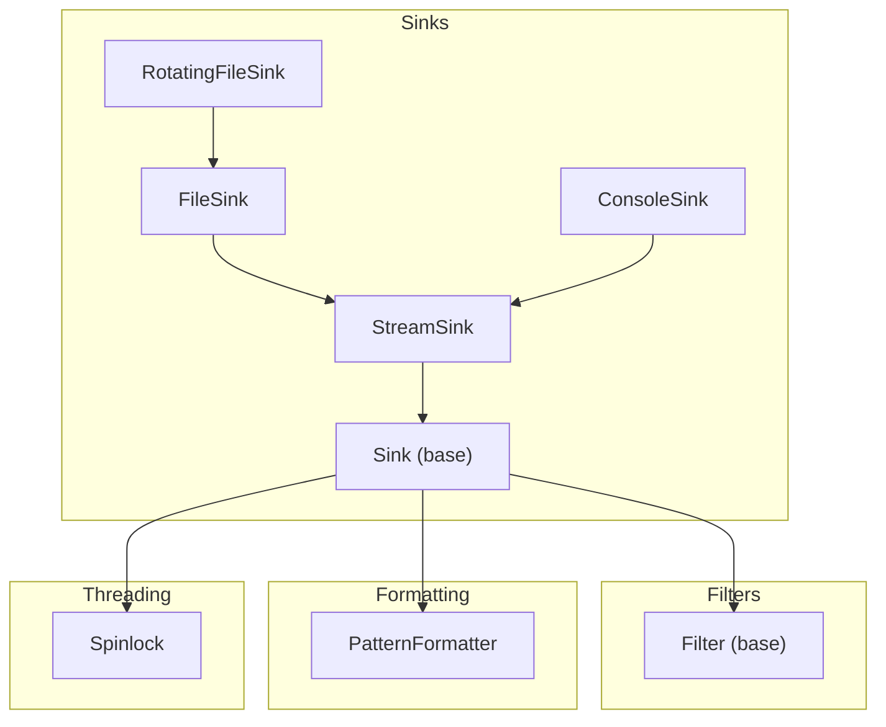
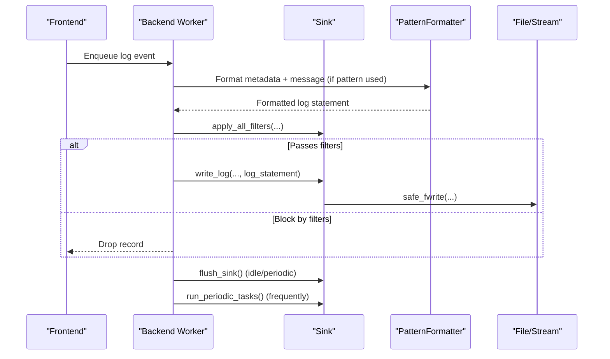
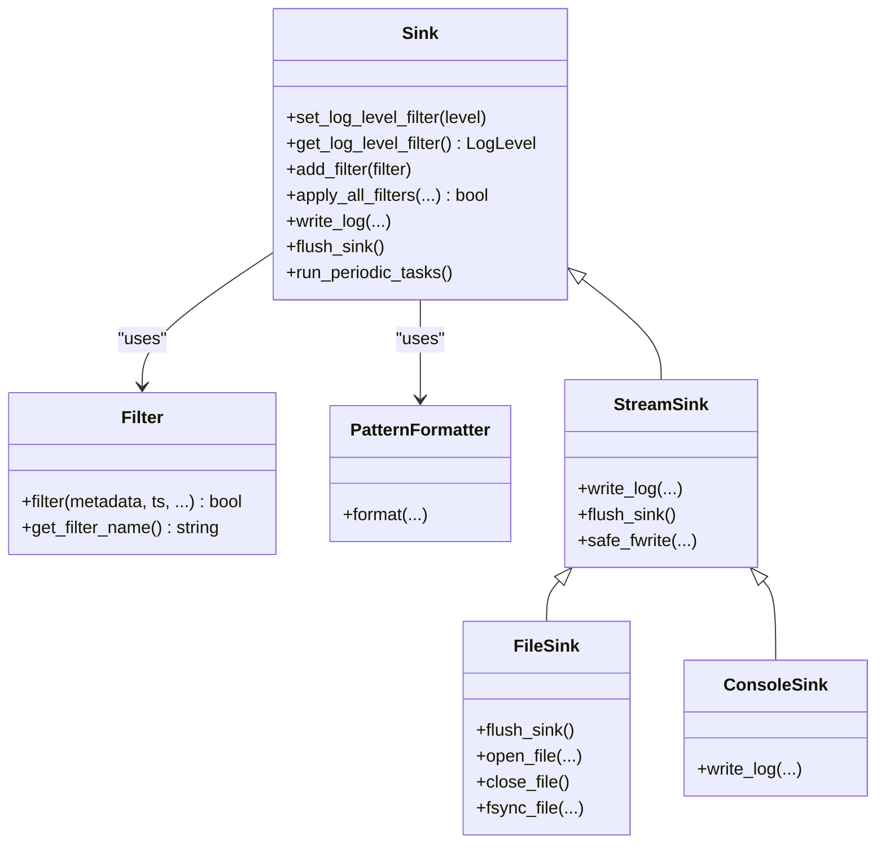

# Custom Sink Development

<cite>
**Referenced Files in This Document**
- [Sink.h](file://include/quill/sinks/Sink.h)
- [Filter.h](file://include/quill/filters/Filter.h)
- [PatternFormatter.h](file://include/quill/backend/PatternFormatter.h)
- [StreamSink.h](file://include/quill/sinks/StreamSink.h)
- [FileSink.h](file://include/quill/sinks/FileSink.h)
- [ConsoleSink.h](file://include/quill/sinks/ConsoleSink.h)
- [RotatingFileSink.h](file://include/quill/sinks/RotatingFileSink.h)
- [Spinlock.h](file://include/quill/core/Spinlock.h)
- [user_defined_sink.cpp](file://examples/user_defined_sink.cpp)
- [user_defined_filter.cpp](file://examples/user_defined_filter.cpp)
- [UserSinkTest.cpp](file://test/integration_tests/UserSinkTest.cpp)
</cite>

## Table of Contents
1. [Introduction](#introduction)
2. [Project Structure](#project-structure)
3. [Core Components](#core-components)
4. [Architecture Overview](#architecture-overview)
5. [Detailed Component Analysis](#detailed-component-analysis)
6. [Dependency Analysis](#dependency-analysis)
7. [Performance Considerations](#performance-considerations)
8. [Troubleshooting Guide](#troubleshooting-guide)
9. [Conclusion](#conclusion)
10. [Appendices](#appendices)

## Introduction
This guide explains how to develop custom sink implementations in Quill. It covers inheriting from the Sink base class, implementing required virtual methods, handling write_log parameters, formatting messages, and managing output destinations. It also documents error handling, exception safety, graceful degradation, filter integration, pattern formatter customization, thread-safety, synchronization, and practical examples such as network logging, database batching, and specialized output formats. Finally, it provides performance optimization and resource cleanup strategies for production-grade sinks.

## Project Structure
Quill organizes sink-related code under include/quill/sinks and related backend/formatter utilities under include/quill/backend and include/quill/core. The primary sink base class is in Sink.h, with concrete sinks like FileSink and ConsoleSink demonstrating typical patterns. Filters live under include/quill/filters, and formatting is handled by PatternFormatter. Threading primitives such as Spinlock are used for internal synchronization.

**Diagram sources**
- [Sink.h:40-218](file://include/quill/sinks/Sink.h#L40-L218)
- [StreamSink.h:67-314](file://include/quill/sinks/StreamSink.h#L67-L314)
- [FileSink.h:226-527](file://include/quill/sinks/FileSink.h#L226-L527)
- [ConsoleSink.h:331-412](file://include/quill/sinks/ConsoleSink.h#L331-L412)
- [RotatingFileSink.h:13-15](file://include/quill/sinks/RotatingFileSink.h#L13-L15)
- [Filter.h:26-72](file://include/quill/filters/Filter.h#L26-L72)
- [PatternFormatter.h:33-608](file://include/quill/backend/PatternFormatter.h#L33-L608)
- [Spinlock.h:18-75](file://include/quill/core/Spinlock.h#L18-L75)

**Section sources**
- [Sink.h:40-218](file://include/quill/sinks/Sink.h#L40-L218)
- [StreamSink.h:67-314](file://include/quill/sinks/StreamSink.h#L67-L314)
- [FileSink.h:226-527](file://include/quill/sinks/FileSink.h#L226-L527)
- [ConsoleSink.h:331-412](file://include/quill/sinks/ConsoleSink.h#L331-L412)
- [RotatingFileSink.h:13-15](file://include/quill/sinks/RotatingFileSink.h#L13-L15)
- [Filter.h:26-72](file://include/quill/filters/Filter.h#L26-L72)
- [PatternFormatter.h:33-608](file://include/quill/backend/PatternFormatter.h#L33-L608)
- [Spinlock.h:18-75](file://include/quill/core/Spinlock.h#L18-L75)

## Core Components
- Sink: Base class defining the interface for sinks, including write_log, flush_sink, run_periodic_tasks, log level filtering, and filter management. It maintains a thread-safe filter collection and a log level threshold.
- StreamSink: A stream-based sink that handles safe writes to stdout, stderr, files, or /dev/null, with flush and file event notifications.
- FileSink: Extends StreamSink to add file-specific behaviors such as buffering, fsync, filename rotation helpers, and robust file opening/closing.
- ConsoleSink: Extends StreamSink to add colored terminal output and configurable color modes.
- PatternFormatter: Formats log records according to a pattern, supporting attributes like timestamp, logger name, thread info, level, and message.
- Filter: Base class for user-defined filters applied to sinks.
- Spinlock: Lightweight spinlock used for internal synchronization in sinks.

Key responsibilities:
- write_log: Receives formatted metadata and the final log statement; performs the actual write to the chosen destination.
- flush_sink: Synchronizes buffered output; called during idle periods or explicit flush.
- run_periodic_tasks: Lightweight periodic maintenance; avoid heavy work here.
- apply_all_filters: Enforces log level threshold and runs registered filters; thread-safe via spinlock and atomic indicators.

**Section sources**
- [Sink.h:40-218](file://include/quill/sinks/Sink.h#L40-L218)
- [StreamSink.h:67-314](file://include/quill/sinks/StreamSink.h#L67-L314)
- [FileSink.h:226-527](file://include/quill/sinks/FileSink.h#L226-L527)
- [ConsoleSink.h:331-412](file://include/quill/sinks/ConsoleSink.h#L331-L412)
- [PatternFormatter.h:33-608](file://include/quill/backend/PatternFormatter.h#L33-L608)
- [Filter.h:26-72](file://include/quill/filters/Filter.h#L26-L72)
- [Spinlock.h:18-75](file://include/quill/core/Spinlock.h#L18-L75)

## Architecture Overview
The backend worker thread invokes sink methods with preprocessed metadata and formatted statements. Sinks can rely on PatternFormatter for default formatting or bypass it depending on configuration. Filters are applied before write_log is called.

**Diagram sources**
- [Sink.h:123-197](file://include/quill/sinks/Sink.h#L123-L197)
- [PatternFormatter.h:97-177](file://include/quill/backend/PatternFormatter.h#L97-L177)
- [StreamSink.h:152-193](file://include/quill/sinks/StreamSink.h#L152-L193)
- [FileSink.h:264-288](file://include/quill/sinks/FileSink.h#L264-L288)

## Detailed Component Analysis

### Step-by-Step: Creating a Custom Sink
Follow these steps to implement a custom sink:
1. Derive from quill::Sink.
2. Implement write_log to handle the final formatted log statement and write it to your destination.
3. Implement flush_sink to synchronize buffered output.
4. Optionally implement run_periodic_tasks for lightweight periodic work.
5. Optionally add filters via add_filter and enforce log level thresholds with set_log_level_filter.

Reference example:
- [user_defined_sink.cpp:18-73](file://examples/user_defined_sink.cpp#L18-L73)

Implementation notes:
- write_log receives a std::string_view for the final statement; exclude trailing newline if you manage it yourself.
- flush_sink is called when the backend is idle or when logger->flush_log() is invoked.
- run_periodic_tasks is frequently invoked; keep it lightweight.

**Section sources**
- [user_defined_sink.cpp:18-73](file://examples/user_defined_sink.cpp#L18-L73)
- [Sink.h:123-141](file://include/quill/sinks/Sink.h#L123-L141)

### write_log Implementation Details
Parameters:
- Metadata: MacroMetadata pointer, timestamp, thread identifiers, process ID, logger name, log level, level description, short code, optional named args.
- Message: log_message (raw) and log_statement (final formatted string).
- Behavior: write_log is invoked by the backend worker thread; avoid heavy work here.

Formatting and output:
- If you use PatternFormatter (default), log_statement contains the formatted line.
- If you override formatter options per sink, you can receive raw log_message and format it yourself.
- For streaming sinks, StreamSink::write_log writes the statement to stdout/stderr/file; you can wrap or extend it.

Error handling:
- StreamSink::safe_fwrite retries partial writes and throws QuillError on failure.
- FileSink adds robust file open/close and optional fsync with intervals.

Graceful degradation:
- If the underlying stream/file becomes unavailable, sinks should handle errors and continue without crashing the backend.

**Section sources**
- [Sink.h:123-128](file://include/quill/sinks/Sink.h#L123-L128)
- [PatternFormatter.h:97-177](file://include/quill/backend/PatternFormatter.h#L97-L177)
- [StreamSink.h:152-180](file://include/quill/sinks/StreamSink.h#L152-L180)
- [StreamSink.h:214-278](file://include/quill/sinks/StreamSink.h#L214-L278)
- [FileSink.h:362-463](file://include/quill/sinks/FileSink.h#L362-L463)

### Filter Integration
Adding filters:
- Call add_filter(std::unique_ptr<Filter>) on your sink instance. Thread-safe; can be called anytime.
- Filters are deduplicated by name; duplicates are rejected.

Filter logic:
- Implement Filter::filter with the provided metadata and message.
- Return true to allow the record; false to drop it.

Filter application:
- apply_all_filters checks log level threshold first, then evaluates all registered filters.
- A new-filter indicator is atomically set when filters are added; on first use after addition, filters are copied into a local collection under a spinlock.

Examples:
- [user_defined_filter.cpp:19-47](file://examples/user_defined_filter.cpp#L19-L47)
- [Filter.h:54-66](file://include/quill/filters/Filter.h#L54-L66)
- [Sink.h:85-104](file://include/quill/sinks/Sink.h#L85-L104)
- [Sink.h:156-197](file://include/quill/sinks/Sink.h#L156-L197)

**Section sources**
- [user_defined_filter.cpp:19-47](file://examples/user_defined_filter.cpp#L19-L47)
- [Filter.h:54-66](file://include/quill/filters/Filter.h#L54-L66)
- [Sink.h:85-104](file://include/quill/sinks/Sink.h#L85-L104)
- [Sink.h:156-197](file://include/quill/sinks/Sink.h#L156-L197)

### Pattern Formatter Customization
Default behavior:
- PatternFormatter formats records based on a format pattern and attributes (time, logger, thread, level, message, etc.).
- If the pattern is empty, formatting may be bypassed.

Override per sink:
- Pass PatternFormatterOptions to the sink constructor or via derived sink configuration to customize formatting for that sink.
- FileSink and ConsoleSink expose setters to override formatter options.

Custom formatting in a sink:
- If you bypass default formatting, you can format log_message and named_args yourself inside write_log.

References:
- [PatternFormatter.h:79-177](file://include/quill/backend/PatternFormatter.h#L79-L177)
- [FileSink.h:184-187](file://include/quill/sinks/FileSink.h#L184-L187)
- [ConsoleSink.h:307-310](file://include/quill/sinks/ConsoleSink.h#L307-L310)
- [Sink.h:47-50](file://include/quill/sinks/Sink.h#L47-L50)

**Section sources**
- [PatternFormatter.h:79-177](file://include/quill/backend/PatternFormatter.h#L79-L177)
- [FileSink.h:184-187](file://include/quill/sinks/FileSink.h#L184-L187)
- [ConsoleSink.h:307-310](file://include/quill/sinks/ConsoleSink.h#L307-L310)
- [Sink.h:47-50](file://include/quill/sinks/Sink.h#L47-L50)

### Thread Safety, Atomic Operations, and Synchronization
- Log level threshold is stored as atomic<LogLevel>.
- Filter collection updates are guarded by a spinlock; a relaxed atomic flag signals when filters have changed.
- apply_all_filters copies global filters into a local vector under lock, then evaluates them without holding the lock afterward.
- StreamSink::safe_fwrite and flush handle partial writes and throw on persistent errors.
- Backend worker invokes sinks from a single thread; sinks must be safe for concurrent calls from the backend thread.

References:
- [Sink.h:213-215](file://include/quill/sinks/Sink.h#L213-L215)
- [Sink.h:167-181](file://include/quill/sinks/Sink.h#L167-L181)
- [Spinlock.h:30-45](file://include/quill/core/Spinlock.h#L30-L45)
- [StreamSink.h:284-299](file://include/quill/sinks/StreamSink.h#L284-L299)

**Section sources**
- [Sink.h:213-215](file://include/quill/sinks/Sink.h#L213-L215)
- [Sink.h:167-181](file://include/quill/sinks/Sink.h#L167-L181)
- [Spinlock.h:30-45](file://include/quill/core/Spinlock.h#L30-L45)
- [StreamSink.h:284-299](file://include/quill/sinks/StreamSink.h#L284-L299)

### Practical Examples

#### Network Logging Sink
- Derive from Sink.
- In write_log, serialize the log_statement and send it over a socket or HTTP endpoint.
- In flush_sink, drain any buffered packets.
- In run_periodic_tasks, perform light maintenance (e.g., heartbeat ping).
- Add filters to drop noisy records or tag records for routing.

[No sources needed since this section describes a conceptual implementation pattern]

#### Database Integration Sink (Batching)
- Cache log statements in write_log (e.g., in-memory buffer).
- In flush_sink, bulk-insert into the database.
- In run_periodic_tasks, attempt periodic commits.
- Use filters to reduce volume or enrich records with tags/named args.

[No sources needed since this section describes a conceptual implementation pattern]

#### Specialized Output Formats
- Override formatter options per sink to emit CSV, JSON, or binary formats.
- For JSON, consider using a dedicated JSON sink variant and customizing metadata inclusion.

[No sources needed since this section describes a conceptual implementation pattern]

### Example Reference Implementations
- Minimal custom sink example: [user_defined_sink.cpp:18-73](file://examples/user_defined_sink.cpp#L18-L73)
- Custom filter example: [user_defined_filter.cpp:19-47](file://examples/user_defined_filter.cpp#L19-L47)
- Integration test validating sink lifecycle: [UserSinkTest.cpp:16-41](file://test/integration_tests/UserSinkTest.cpp#L16-L41)

**Section sources**
- [user_defined_sink.cpp:18-73](file://examples/user_defined_sink.cpp#L18-L73)
- [user_defined_filter.cpp:19-47](file://examples/user_defined_filter.cpp#L19-L47)
- [UserSinkTest.cpp:16-41](file://test/integration_tests/UserSinkTest.cpp#L16-L41)

## Dependency Analysis
The following diagram shows key dependencies among sink classes and their relationships to filters and formatting.

**Diagram sources**
- [Sink.h:40-218](file://include/quill/sinks/Sink.h#L40-L218)
- [Filter.h:26-72](file://include/quill/filters/Filter.h#L26-L72)
- [PatternFormatter.h:33-608](file://include/quill/backend/PatternFormatter.h#L33-L608)
- [StreamSink.h:67-314](file://include/quill/sinks/StreamSink.h#L67-L314)
- [FileSink.h:226-527](file://include/quill/sinks/FileSink.h#L226-L527)
- [ConsoleSink.h:331-412](file://include/quill/sinks/ConsoleSink.h#L331-L412)

**Section sources**
- [Sink.h:40-218](file://include/quill/sinks/Sink.h#L40-L218)
- [Filter.h:26-72](file://include/quill/filters/Filter.h#L26-L72)
- [PatternFormatter.h:33-608](file://include/quill/backend/PatternFormatter.h#L33-L608)
- [StreamSink.h:67-314](file://include/quill/sinks/StreamSink.h#L67-L314)
- [FileSink.h:226-527](file://include/quill/sinks/FileSink.h#L226-L527)
- [ConsoleSink.h:331-412](file://include/quill/sinks/ConsoleSink.h#L331-L412)

## Performance Considerations
- Keep write_log lightweight; avoid blocking I/O or heavy computation.
- Use StreamSink::safe_fwrite for reliable writes; it handles partial writes and throws on failure.
- Prefer batching in flush_sink or run_periodic_tasks to reduce syscall overhead.
- For file sinks, tune write buffer size and fsync intervals to balance durability and throughput.
- Avoid heavy work in run_periodic_tasks; it is frequently invoked.
- Use atomic counters and minimal locking; filters are copied locally after acquiring a spinlock.

[No sources needed since this section provides general guidance]

## Troubleshooting Guide
Common issues and remedies:
- Partial writes or stream errors: StreamSink::safe_fwrite throws QuillError; catch and handle appropriately in your sink wrapper or log the error and continue.
- File deletion or rotation: FileSink flush logic reopens missing files; ensure your sink handles re-open scenarios gracefully.
- Filter conflicts: Adding duplicate filter names throws; ensure unique names.
- Excessive backend slowdown: Avoid heavy operations in run_periodic_tasks; move heavy tasks to background threads.

**Section sources**
- [StreamSink.h:214-278](file://include/quill/sinks/StreamSink.h#L214-L278)
- [FileSink.h:264-288](file://include/quill/sinks/FileSink.h#L264-L288)
- [Sink.h:95-98](file://include/quill/sinks/Sink.h#L95-L98)

## Conclusion
To build a custom sink in Quill:
- Inherit from Sink and implement write_log, flush_sink, and optionally run_periodic_tasks.
- Manage output destinations safely using StreamSink utilities or implement your own I/O with proper error handling.
- Integrate filters via add_filter and rely on apply_all_filters for efficient, thread-safe filtering.
- Customize formatting with PatternFormatterOptions per sink or format messages yourself in write_log.
- Follow thread-safety guidelines: keep write_log non-blocking, use spinlocks for filter updates, and avoid heavy work in periodic tasks.
- Optimize for throughput with batching, tuned buffers, and minimal contention.

[No sources needed since this section summarizes without analyzing specific files]

## Appendices

### API Summary: Required Methods and Utilities
- write_log: Receives metadata and final formatted statement; perform the write.
- flush_sink: Synchronize buffered output.
- run_periodic_tasks: Lightweight periodic maintenance.
- set_log_level_filter/get_log_level_filter: Control minimum severity.
- add_filter: Register a filter by unique name.
- apply_all_filters: Internal filter pipeline invoked by the backend.

**Section sources**
- [Sink.h:123-141](file://include/quill/sinks/Sink.h#L123-L141)
- [Sink.h:65-78](file://include/quill/sinks/Sink.h#L65-L78)
- [Sink.h:85-104](file://include/quill/sinks/Sink.h#L85-L104)
- [Sink.h:156-197](file://include/quill/sinks/Sink.h#L156-L197)