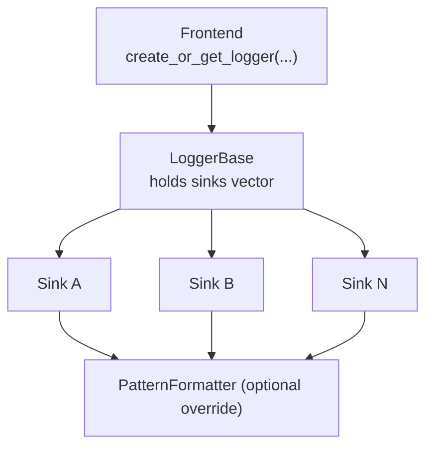
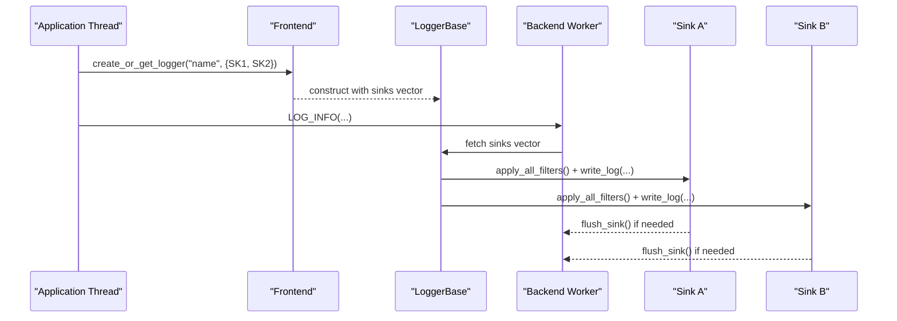
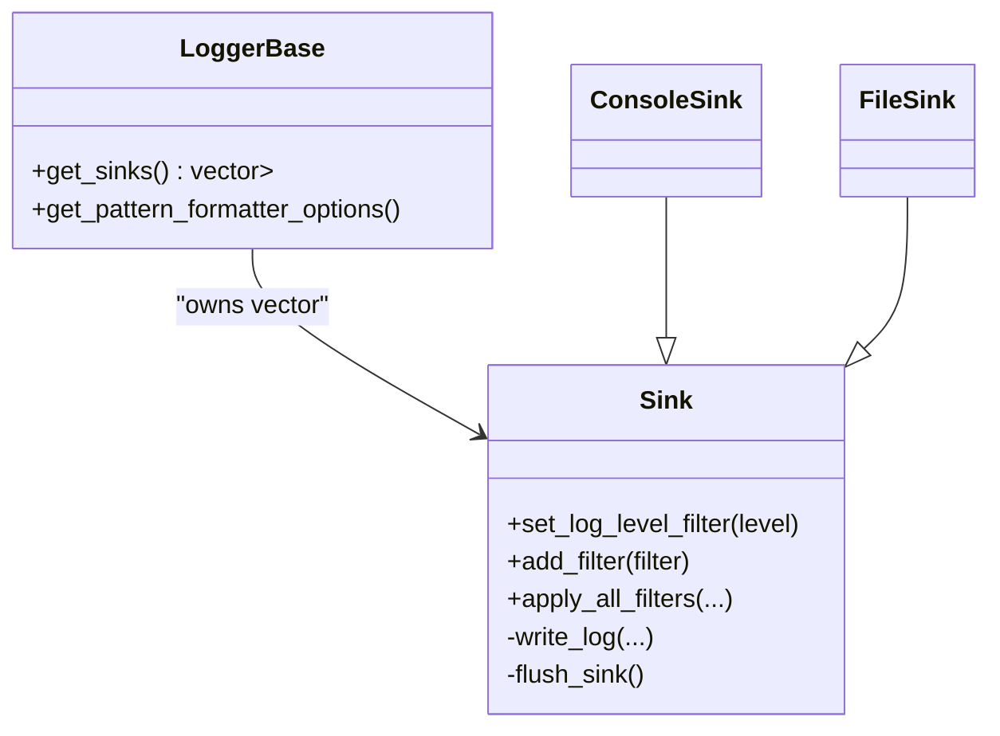

# Multiple Sink Configuration

<cite>
**Referenced Files in This Document**
- [Sink.h](file://include/quill/sinks/Sink.h)
- [ConsoleSink.h](file://include/quill/sinks/ConsoleSink.h)
- [FileSink.h](file://include/quill/sinks/FileSink.h)
- [LoggerBase.h](file://include/quill/core/LoggerBase.h)
- [Logger.h](file://include/quill/Logger.h)
- [Frontend.h](file://include/quill/Frontend.h)
- [SinkManager.h](file://include/quill/core/SinkManager.h)
- [MultipleSinksSameLoggerTest.cpp](file://test/integration_tests/MultipleSinksSameLoggerTest.cpp)
- [OverrideSinkFormatterTest.cpp](file://test/integration_tests/OverrideSinkFormatterTest.cpp)
- [SinkFilterTest.cpp](file://test/integration_tests/SinkFilterTest.cpp)
- [quill_docs_example_multiple_sinks_tags.cpp](file://docs/examples/quill_docs_example_multiple_sinks_tags.cpp)
- [quill_docs_example_tags_with_custom_sink.cpp](file://docs/examples/quill_docs_example_tags_with_custom_sink.cpp)
- [README.md](file://README.md)
</cite>

## Table of Contents
1. [Introduction](#introduction)
2. [Project Structure](#project-structure)
3. [Core Components](#core-components)
4. [Architecture Overview](#architecture-overview)
5. [Detailed Component Analysis](#detailed-component-analysis)
6. [Dependency Analysis](#dependency-analysis)
7. [Performance Considerations](#performance-considerations)
8. [Troubleshooting Guide](#troubleshooting-guide)
9. [Conclusion](#conclusion)
10. [Appendices](#appendices)

## Introduction
This document explains how to configure and manage multiple sinks simultaneously in Quill. It covers attaching multiple sinks to a single logger, the order of sink execution, conditional routing by log level, tags, and custom criteria, sink prioritization, distribution of messages across outputs, sink-specific formatting overrides, performance implications, and robust resource management and error handling.

## Project Structure
Quill’s multi-sink architecture centers on:
- LoggerBase holding a vector of sinks attached to a logger
- Frontend APIs to create or reuse sinks and loggers
- Sink base class with built-in filtering and formatter override support
- Concrete sinks (ConsoleSink, FileSink) and custom sinks
- Tests and examples demonstrating multi-sink scenarios

**Diagram sources**
- [Frontend.h:171-198](file://include/quill/Frontend.h#L171-L198)
- [LoggerBase.h:39-54](file://include/quill/core/LoggerBase.h#L39-L54)
- [Sink.h:47-50](file://include/quill/sinks/Sink.h#L47-L50)

**Section sources**
- [Frontend.h:171-198](file://include/quill/Frontend.h#L171-L198)
- [LoggerBase.h:39-54](file://include/quill/core/LoggerBase.h#L39-L54)
- [Sink.h:47-50](file://include/quill/sinks/Sink.h#L47-L50)

## Core Components
- Sink base class: Provides log level filtering, per-sink filters, and optional formatter override. It exposes write_log and flush_sink hooks for derived sinks.
- ConsoleSink: A stream-based sink supporting color configuration and stream selection (stdout/stderr).
- FileSink: A stream-based sink supporting buffered writes, fsync policies, filename append options, and timezone-aware filenames.
- LoggerBase: Holds the sinks vector and the logger-wide formatter options; provides accessors for sinks and formatter.
- Frontend: Exposes create_or_get_logger overloads that accept a vector of sinks, enabling multiple outputs per logger.

Key capabilities for multi-sink:
- Attach multiple sinks to one logger via a vector of shared_ptr<Sink>.
- Each sink independently applies its log level filter and any registered filters.
- Each sink may override the formatter independently.

**Section sources**
- [Sink.h:65-78](file://include/quill/sinks/Sink.h#L65-L78)
- [Sink.h:85-104](file://include/quill/sinks/Sink.h#L85-L104)
- [Sink.h:156-197](file://include/quill/sinks/Sink.h#L156-L197)
- [ConsoleSink.h:331-410](file://include/quill/sinks/ConsoleSink.h#L331-L410)
- [FileSink.h:226-288](file://include/quill/sinks/FileSink.h#L226-L288)
- [LoggerBase.h:96-99](file://include/quill/core/LoggerBase.h#L96-L99)
- [LoggerBase.h:86-89](file://include/quill/core/LoggerBase.h#L86-L89)
- [Frontend.h:171-198](file://include/quill/Frontend.h#L171-L198)

## Architecture Overview
At runtime, a logger forwards each formatted log record to all attached sinks. Each sink evaluates its own log level and filters before writing. Formatter overrides are resolved per sink.

**Diagram sources**
- [Frontend.h:171-198](file://include/quill/Frontend.h#L171-L198)
- [LoggerBase.h:96-99](file://include/quill/core/LoggerBase.h#L96-L99)
- [Sink.h:156-197](file://include/quill/sinks/Sink.h#L156-L197)

## Detailed Component Analysis

### Attaching Multiple Sinks to a Single Logger
- Use Frontend::create_or_get_logger with a vector of sinks to attach multiple outputs to one logger.
- The logger stores a vector of shared_ptr<Sink>, ensuring sinks remain alive as long as the logger exists.
- Sinks are used read-only by the backend; do not mutate their state after creation.

Practical example references:
- [MultipleSinksSameLoggerTest.cpp:54-56](file://test/integration_tests/MultipleSinksSameLoggerTest.cpp#L54-L56)
- [README.md:486-487](file://README.md#L486-L487)

**Section sources**
- [Frontend.h:171-198](file://include/quill/Frontend.h#L171-L198)
- [LoggerBase.h:96-99](file://include/quill/core/LoggerBase.h#L96-L99)

### Order of Sink Execution
- The backend iterates over the sinks vector in the order provided when constructing the logger and invokes write_log on each sink.
- There is no implicit prioritization; the order reflects the vector order.

Evidence:
- LoggerBase stores the sinks vector as-is and exposes it to the backend.
- Tests demonstrate identical message counts across multiple file/console outputs.

**Section sources**
- [LoggerBase.h:96-99](file://include/quill/core/LoggerBase.h#L96-L99)
- [MultipleSinksSameLoggerTest.cpp:54-56](file://test/integration_tests/MultipleSinksSameLoggerTest.cpp#L54-L56)

### Conditional Routing by Log Level
- Each sink maintains an atomic log level filter. Records below the sink’s filter are dropped for that sink.
- This operates before any custom filters.

References:
- [Sink.h:65-78](file://include/quill/sinks/Sink.h#L65-L78)
- [Sink.h:161-164](file://include/quill/sinks/Sink.h#L161-L164)

**Section sources**
- [Sink.h:65-78](file://include/quill/sinks/Sink.h#L65-L78)
- [Sink.h:161-164](file://include/quill/sinks/Sink.h#L161-L164)

### Conditional Routing by Tags
- Tag-based routing is achieved by registering a Filter per sink that inspects the log metadata tags.
- The example demonstrates adding a TagsFilter to each sink to route only messages carrying specific tags.

References:
- [quill_docs_example_multiple_sinks_tags.cpp:12-32](file://docs/examples/quill_docs_example_multiple_sinks_tags.cpp#L12-L32)
- [quill_docs_example_multiple_sinks_tags.cpp:40-43](file://docs/examples/quill_docs_example_multiple_sinks_tags.cpp#L40-L43)
- [quill_docs_example_multiple_sinks_tags.cpp:48-52](file://docs/examples/quill_docs_example_multiple_sinks_tags.cpp#L48-L52)

**Section sources**
- [quill_docs_example_multiple_sinks_tags.cpp:12-32](file://docs/examples/quill_docs_example_multiple_sinks_tags.cpp#L12-L32)
- [quill_docs_example_multiple_sinks_tags.cpp:40-43](file://docs/examples/quill_docs_example_multiple_sinks_tags.cpp#L40-L43)
- [quill_docs_example_multiple_sinks_tags.cpp:48-52](file://docs/examples/quill_docs_example_multiple_sinks_tags.cpp#L48-L52)

### Conditional Routing by Custom Criteria
- Implement a custom Filter subclass to evaluate any criteria (e.g., message content, named arguments, thread/process info).
- Register the filter on each sink via add_filter; the backend calls filter on each registered filter.

References:
- [SinkFilterTest.cpp:15-32](file://test/integration_tests/SinkFilterTest.cpp#L15-L32)
- [SinkFilterTest.cpp:74-80](file://test/integration_tests/SinkFilterTest.cpp#L74-L80)
- [Sink.h:85-104](file://include/quill/sinks/Sink.h#L85-L104)

**Section sources**
- [SinkFilterTest.cpp:15-32](file://test/integration_tests/SinkFilterTest.cpp#L15-L32)
- [SinkFilterTest.cpp:74-80](file://test/integration_tests/SinkFilterTest.cpp#L74-L80)
- [Sink.h:85-104](file://include/quill/sinks/Sink.h#L85-L104)

### Sink Prioritization and Distribution Across Outputs
- Prioritization is not automatic; it is controlled by the order of sinks in the vector and by each sink’s log level and filters.
- Distribution is per-record: each sink receives the formatted record and decides whether to write based on its filters.

References:
- [LoggerBase.h:96-99](file://include/quill/core/LoggerBase.h#L96-L99)
- [Sink.h:156-197](file://include/quill/sinks/Sink.h#L156-L197)

**Section sources**
- [LoggerBase.h:96-99](file://include/quill/core/LoggerBase.h#L96-L99)
- [Sink.h:156-197](file://include/quill/sinks/Sink.h#L156-L197)

### Tag-Based Routing Using Log Tags
- Use LOG_INFO_TAGS macros to attach tags to log statements.
- Configure sinks with filters that match the desired tag payload.
- The example shows routing to separate sinks based on tags.

References:
- [quill_docs_example_multiple_sinks_tags.cpp:48-52](file://docs/examples/quill_docs_example_multiple_sinks_tags.cpp#L48-L52)

**Section sources**
- [quill_docs_example_multiple_sinks_tags.cpp:48-52](file://docs/examples/quill_docs_example_multiple_sinks_tags.cpp#L48-L52)

### Sink-Specific Formatting Overrides
- Each sink can override the logger-wide formatter via set_override_pattern_formatter_options on its configuration object.
- The backend initializes a PatternFormatter per sink using the override if present; otherwise it uses the logger’s formatter.

References:
- [ConsoleSink.h:307-310](file://include/quill/sinks/ConsoleSink.h#L307-L310)
- [FileSink.h:184-187](file://include/quill/sinks/FileSink.h#L184-L187)
- [Sink.h:202-204](file://include/quill/sinks/Sink.h#L202-L204)

**Section sources**
- [ConsoleSink.h:307-310](file://include/quill/sinks/ConsoleSink.h#L307-L310)
- [FileSink.h:184-187](file://include/quill/sinks/FileSink.h#L184-L187)
- [Sink.h:202-204](file://include/quill/sinks/Sink.h#L202-L204)

### Practical Multi-Sink Scenarios

#### Console and File Logging
- Attach a ConsoleSink and a FileSink to the same logger to mirror logs to both outputs.
- Tests confirm identical message counts across both sinks.

References:
- [MultipleSinksSameLoggerTest.cpp:34-56](file://test/integration_tests/MultipleSinksSameLoggerTest.cpp#L34-L56)

**Section sources**
- [MultipleSinksSameLoggerTest.cpp:34-56](file://test/integration_tests/MultipleSinksSameLoggerTest.cpp#L34-L56)

#### Debug and Production Logging
- Route verbose logs (e.g., TraceL1–TraceL3) to a file while sending Info/Warn/Error to console by setting different log level filters per sink.

References:
- [Sink.h:65-78](file://include/quill/sinks/Sink.h#L65-L78)

**Section sources**
- [Sink.h:65-78](file://include/quill/sinks/Sink.h#L65-L78)

#### Structured Logging with Multiple Outputs
- Use a custom sink to emit structured data (e.g., JSON) to a dedicated output while other sinks handle plain text.

References:
- [quill_docs_example_tags_with_custom_sink.cpp:18-45](file://docs/examples/quill_docs_example_tags_with_custom_sink.cpp#L18-L45)

**Section sources**
- [quill_docs_example_tags_with_custom_sink.cpp:18-45](file://docs/examples/quill_docs_example_tags_with_custom_sink.cpp#L18-L45)

## Dependency Analysis
- LoggerBase depends on a vector of sinks and the logger-wide formatter options.
- Sink base class composes:
  - Per-sink log level filter
  - A collection of registered filters
  - Optional per-sink formatter override
- Frontend constructs loggers with a vector of sinks and exposes get_logger/create_or_get_logger overloads.

**Diagram sources**
- [LoggerBase.h:96-99](file://include/quill/core/LoggerBase.h#L96-L99)
- [Sink.h:65-78](file://include/quill/sinks/Sink.h#L65-L78)
- [Sink.h:85-104](file://include/quill/sinks/Sink.h#L85-L104)
- [ConsoleSink.h:331-410](file://include/quill/sinks/ConsoleSink.h#L331-L410)
- [FileSink.h:226-288](file://include/quill/sinks/FileSink.h#L226-L288)

**Section sources**
- [LoggerBase.h:96-99](file://include/quill/core/LoggerBase.h#L96-L99)
- [Sink.h:65-78](file://include/quill/sinks/Sink.h#L65-L78)
- [Sink.h:85-104](file://include/quill/sinks/Sink.h#L85-L104)
- [ConsoleSink.h:331-410](file://include/quill/sinks/ConsoleSink.h#L331-L410)
- [FileSink.h:226-288](file://include/quill/sinks/FileSink.h#L226-L288)

## Performance Considerations
- Each sink incurs independent formatting and I/O overhead; multiple sinks increase total I/O and CPU usage.
- Buffered writes and fsync policies (e.g., FileSink) influence throughput and durability trade-offs.
- Prefer dropping sinks for non-critical outputs in high-throughput scenarios.
- Immediate flush thresholds on the logger can reduce batching efficiency; use judiciously.

[No sources needed since this section provides general guidance]

## Troubleshooting Guide
- Duplicate filter names: Adding a filter with the same name to a sink throws an error. Ensure unique filter names.
- File handle and reopen behavior: FileSink flushes and reopens if the file disappears, improving resilience.
- Sink lifecycle: Sinks are kept alive by shared_ptr in the logger’s sinks vector; remove the logger to release sinks.

References:
- [SinkFilterTest.cpp:82-85](file://test/integration_tests/SinkFilterTest.cpp#L82-L85)
- [FileSink.h:274-288](file://include/quill/sinks/FileSink.h#L274-L288)
- [LoggerBase.h:96-99](file://include/quill/core/LoggerBase.h#L96-L99)

**Section sources**
- [SinkFilterTest.cpp:82-85](file://test/integration_tests/SinkFilterTest.cpp#L82-L85)
- [FileSink.h:274-288](file://include/quill/sinks/FileSink.h#L274-L288)
- [LoggerBase.h:96-99](file://include/quill/core/LoggerBase.h#L96-L99)

## Conclusion
Quill supports flexible multi-sink logging by attaching multiple sinks to a single logger. Execution order follows the vector order, with each sink applying its own log level and filters. Formatter overrides enable per-sink customization. Conditional routing can be implemented via log level, tags, or custom filters. Performance scales with the number of sinks and their I/O characteristics. Robustness is ensured by sink lifecycle management and file reopen logic.

[No sources needed since this section summarizes without analyzing specific files]

## Appendices

### Example References
- Multiple sinks to one logger: [MultipleSinksSameLoggerTest.cpp:54-56](file://test/integration_tests/MultipleSinksSameLoggerTest.cpp#L54-L56)
- Sink-specific formatter override: [OverrideSinkFormatterTest.cpp:50-58](file://test/integration_tests/OverrideSinkFormatterTest.cpp#L50-L58)
- Tag-based routing: [quill_docs_example_multiple_sinks_tags.cpp:40-43](file://docs/examples/quill_docs_example_multiple_sinks_tags.cpp#L40-L43)
- Custom sink with tags: [quill_docs_example_tags_with_custom_sink.cpp:53-65](file://docs/examples/quill_docs_example_tags_with_custom_sink.cpp#L53-L65)

**Section sources**
- [MultipleSinksSameLoggerTest.cpp:54-56](file://test/integration_tests/MultipleSinksSameLoggerTest.cpp#L54-L56)
- [OverrideSinkFormatterTest.cpp:50-58](file://test/integration_tests/OverrideSinkFormatterTest.cpp#L50-L58)
- [quill_docs_example_multiple_sinks_tags.cpp:40-43](file://docs/examples/quill_docs_example_multiple_sinks_tags.cpp#L40-L43)
- [quill_docs_example_tags_with_custom_sink.cpp:53-65](file://docs/examples/quill_docs_example_tags_with_custom_sink.cpp#L53-L65)