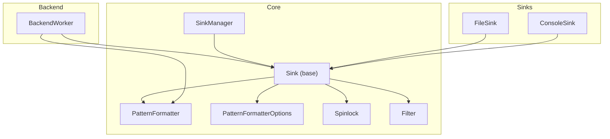
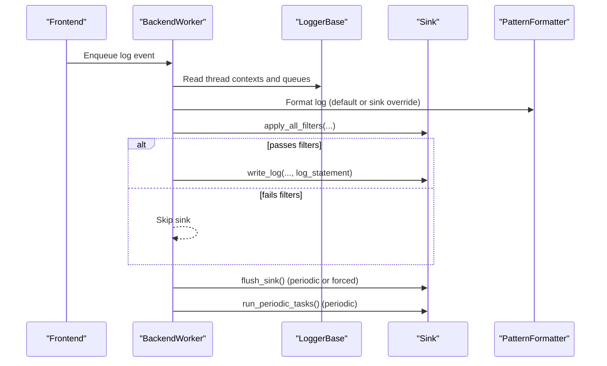
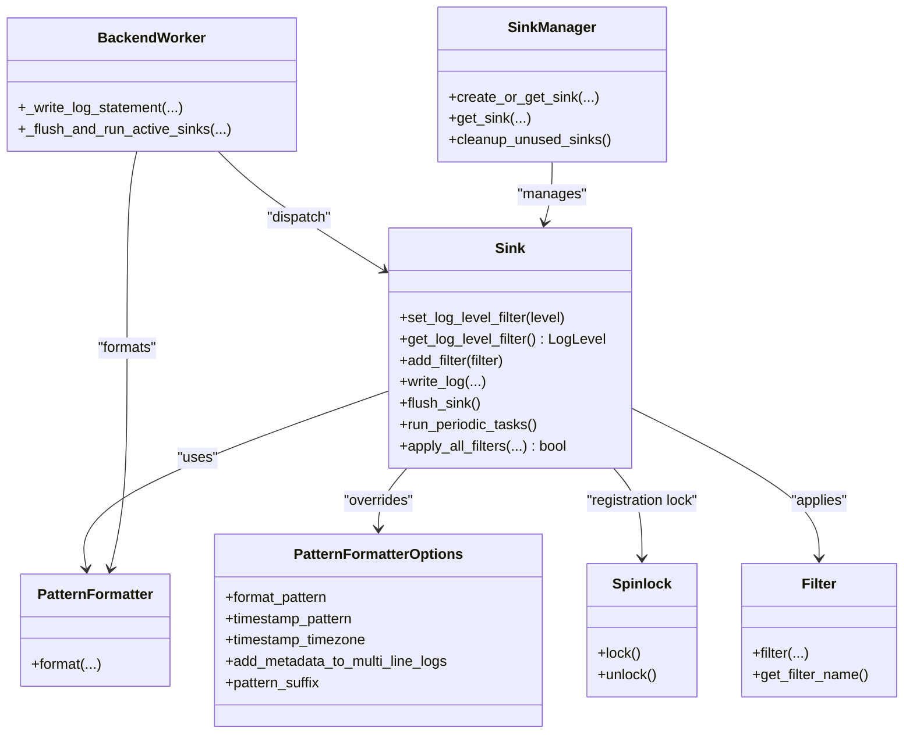

# Sink Interface & Base Functionality

<cite>
**Referenced Files in This Document**
- [Sink.h](file://include/quill/sinks/Sink.h)
- [PatternFormatter.h](file://include/quill/backend/PatternFormatter.h)
- [PatternFormatterOptions.h](file://include/quill/core/PatternFormatterOptions.h)
- [BackendWorker.h](file://include/quill/backend/BackendWorker.h)
- [Spinlock.h](file://include/quill/core/Spinlock.h)
- [SinkManager.h](file://include/quill/core/SinkManager.h)
- [Filter.h](file://include/quill/filters/Filter.h)
- [FileSink.h](file://include/quill/sinks/FileSink.h)
- [ConsoleSink.h](file://include/quill/sinks/ConsoleSink.h)
- [user_defined_sink.cpp](file://examples/user_defined_sink.cpp)
- [SinkFilterOverrideFormatTest.cpp](file://test/integration_tests/SinkFilterOverrideFormatTest.cpp)
- [MultilineMetadataOverrideFormatTest.cpp](file://test/integration_tests/MultilineMetadataOverrideFormatTest.cpp)
</cite>

## Table of Contents
1. [Introduction](#introduction)
2. [Project Structure](#project-structure)
3. [Core Components](#core-components)
4. [Architecture Overview](#architecture-overview)
5. [Detailed Component Analysis](#detailed-component-analysis)
6. [Dependency Analysis](#dependency-analysis)
7. [Performance Considerations](#performance-considerations)
8. [Troubleshooting Guide](#troubleshooting-guide)
9. [Conclusion](#conclusion)

## Introduction
This document explains the Sink base class and core sink functionality in the Quill logging library. It covers the abstract Sink interface, the write_log method signature and semantics, log level filtering, filter registration and management, pattern formatter override capabilities, flush synchronization, periodic task execution, thread safety, and the relationship between frontend and backend threads in the sink pipeline.

## Project Structure
The sink subsystem spans several modules:
- Core sink interface and base class
- Pattern formatting infrastructure
- Backend worker that drives formatting, filtering, and dispatch to sinks
- Spinlock-based synchronization primitives
- Sink manager for lifecycle and reuse
- Example and test coverage for custom sinks and overrides

**Diagram sources**
- [Sink.h:40-218](file://include/quill/sinks/Sink.h#L40-L218)
- [PatternFormatter.h:33-608](file://include/quill/backend/PatternFormatter.h#L33-L608)
- [PatternFormatterOptions.h:23-170](file://include/quill/core/PatternFormatterOptions.h#L23-L170)
- [BackendWorker.h:77-1765](file://include/quill/backend/BackendWorker.h#L77-L1765)
- [Spinlock.h:18-75](file://include/quill/core/Spinlock.h#L18-L75)
- [SinkManager.h:28-157](file://include/quill/core/SinkManager.h#L28-L157)
- [Filter.h:26-72](file://include/quill/filters/Filter.h#L26-L72)
- [FileSink.h:226-527](file://include/quill/sinks/FileSink.h#L226-L527)
- [ConsoleSink.h:331-412](file://include/quill/sinks/ConsoleSink.h#L331-L412)

**Section sources**
- [Sink.h:40-218](file://include/quill/sinks/Sink.h#L40-L218)
- [BackendWorker.h:77-1765](file://include/quill/backend/BackendWorker.h#L77-L1765)

## Core Components
- Sink base class: Defines the abstract interface for sinks, including write_log, flush_sink, run_periodic_tasks, log level filtering, and filter management.
- PatternFormatter and PatternFormatterOptions: Control how log records are formatted per sink or globally.
- BackendWorker: Orchestrates formatting, filtering, and dispatch to sinks; manages flush and periodic tasks.
- Spinlock and LockGuard: Provide lock-free spinlock primitives used for filter registration synchronization.
- SinkManager: Centralized registry for sinks keyed by name, ensuring reuse and cleanup.
- Filter: Base class for user-defined filters attached to sinks.

Key responsibilities:
- write_log: Implemented by derived sinks to emit formatted log statements.
- flush_sink: Ensures buffered output is synchronized with the sink’s destination.
- run_periodic_tasks: Provides periodic hooks for sinks to perform maintenance or batching.
- apply_all_filters: Applies log level threshold and registered filters to decide whether to write.

**Section sources**
- [Sink.h:40-218](file://include/quill/sinks/Sink.h#L40-L218)
- [PatternFormatter.h:33-608](file://include/quill/backend/PatternFormatter.h#L33-L608)
- [PatternFormatterOptions.h:23-170](file://include/quill/core/PatternFormatterOptions.h#L23-L170)
- [BackendWorker.h:1009-1068](file://include/quill/backend/BackendWorker.h#L1009-L1068)
- [Spinlock.h:18-75](file://include/quill/core/Spinlock.h#L18-L75)
- [SinkManager.h:28-157](file://include/quill/core/SinkManager.h#L28-L157)
- [Filter.h:26-72](file://include/quill/filters/Filter.h#L26-L72)

## Architecture Overview
The backend worker coordinates formatting, filtering, and dispatch:
- It formats logs either with the logger’s default PatternFormatter or with a sink-specific override.
- It applies the sink’s filters (including log level threshold) and invokes write_log only for passing records.
- Periodically, it triggers flush_sink and run_periodic_tasks across all active sinks.

**Diagram sources**
- [BackendWorker.h:1009-1068](file://include/quill/backend/BackendWorker.h#L1009-L1068)
- [Sink.h:123-197](file://include/quill/sinks/Sink.h#L123-L197)

**Section sources**
- [BackendWorker.h:1009-1068](file://include/quill/backend/BackendWorker.h#L1009-L1068)
- [Sink.h:123-197](file://include/quill/sinks/Sink.h#L123-L197)

## Detailed Component Analysis

### Sink Base Class and Abstract Interface
- write_log: Pure virtual method invoked by the backend worker with comprehensive metadata and the formatted log statement. Derived sinks implement emission to streams, files, or external systems.
- flush_sink: Pure virtual method for synchronization. Called periodically or when flush is requested.
- run_periodic_tasks: Virtual method for periodic maintenance; avoid heavy work to preserve backend thread performance.
- Log level filtering: set_log_level_filter/get_log_level_filter manage a per-sink atomic threshold. apply_all_filters short-circuits if log level is below threshold.
- Filter management: add_filter registers user-defined filters with name uniqueness checks; apply_all_filters updates local filter list when a new filter is added.

Thread safety:
- Atomic log level threshold and filter presence indicator.
- Spinlock protects global filter collection during registration.
- Backend worker accesses filters and formatting under proper synchronization.

Pattern formatter override:
- _override_pattern_formatter_options enables per-sink formatting customization.
- Backend initializes _override_pattern_formatter lazily and uses it to format records for that sink.

Periodic tasks and flush:
- Backend schedules flush_sink and run_periodic_tasks based on intervals and activity.

**Section sources**
- [Sink.h:40-218](file://include/quill/sinks/Sink.h#L40-L218)
- [Spinlock.h:18-75](file://include/quill/core/Spinlock.h#L18-L75)
- [BackendWorker.h:1284-1362](file://include/quill/backend/BackendWorker.h#L1284-L1362)

### Pattern Formatter Override and Customization
- PatternFormatterOptions controls format pattern, timestamp pattern/timezone, multi-line metadata behavior, and suffix.
- Sinks can override formatting via set_override_pattern_formatter_options in their configs (e.g., FileSinkConfig, ConsoleSinkConfig).
- BackendWorker lazily constructs a sink-specific PatternFormatter and uses it to produce log_statement passed to write_log.

Practical examples:
- Overriding format per sink and verifying filter receives the overridden statement.
- Multi-line formatting with optional metadata per line.

**Section sources**
- [PatternFormatterOptions.h:23-170](file://include/quill/core/PatternFormatterOptions.h#L23-L170)
- [PatternFormatter.h:33-608](file://include/quill/backend/PatternFormatter.h#L33-L608)
- [BackendWorker.h:1009-1068](file://include/quill/backend/BackendWorker.h#L1009-L1068)
- [FileSink.h:184-220](file://include/quill/sinks/FileSink.h#L184-L220)
- [ConsoleSink.h:307-320](file://include/quill/sinks/ConsoleSink.h#L307-L320)
- [SinkFilterOverrideFormatTest.cpp:56-76](file://test/integration_tests/SinkFilterOverrideFormatTest.cpp#L56-L76)
- [MultilineMetadataOverrideFormatTest.cpp:42-80](file://test/integration_tests/MultilineMetadataOverrideFormatTest.cpp#L42-L80)

### Filter Registration and Management
- add_filter enforces unique filter names and stores them in a global vector guarded by a spinlock.
- apply_all_filters:
  - First checks log level threshold.
  - Updates local filter list if a new filter was added (atomic flag).
  - Evaluates all filters with the same metadata and formatted statement.
- BackendWorker calls apply_all_filters before invoking write_log.

**Section sources**
- [Sink.h:85-197](file://include/quill/sinks/Sink.h#L85-L197)
- [Filter.h:26-72](file://include/quill/filters/Filter.h#L26-L72)
- [BackendWorker.h:1056-1067](file://include/quill/backend/BackendWorker.h#L1056-L1067)

### Flush and Periodic Task Execution
- flush_sink: Implemented by sinks to synchronize buffered output. BackendWorker calls it periodically based on sink_min_flush_interval and when queues are empty.
- run_periodic_tasks: Invoked by BackendWorker during idle periods to allow sinks to perform periodic work (e.g., batch commits).
- Example custom sink demonstrates caching messages and flushing them on flush_sink.

**Section sources**
- [Sink.h:133-141](file://include/quill/sinks/Sink.h#L133-L141)
- [BackendWorker.h:1284-1362](file://include/quill/backend/BackendWorker.h#L1284-L1362)
- [user_defined_sink.cpp:18-90](file://examples/user_defined_sink.cpp#L18-L90)

### Thread Safety, Atomic Operations, and Lock-Free Design
- Atomic log level threshold and “new filter” indicator minimize contention.
- Spinlock-based LockGuard protects filter registration critical sections.
- BackendWorker uses atomics and careful ordering to coordinate flush and periodic tasks without blocking the hot path.
- SinkManager uses a spinlock to guard its internal registry and supports cleanup of expired sinks.

**Section sources**
- [Sink.h:213-215](file://include/quill/sinks/Sink.h#L213-L215)
- [Spinlock.h:18-75](file://include/quill/core/Spinlock.h#L18-L75)
- [SinkManager.h:28-157](file://include/quill/core/SinkManager.h#L28-L157)

### Backend Worker Integration and Pipeline
- BackendWorker formats logs using either the logger’s PatternFormatter or a sink-specific override.
- It computes a single formatted log statement and passes it to sinks’ filters and write_log.
- After processing, it flushes sinks and runs periodic tasks according to scheduling.

**Section sources**
- [BackendWorker.h:1009-1068](file://include/quill/backend/BackendWorker.h#L1009-L1068)
- [BackendWorker.h:1284-1362](file://include/quill/backend/BackendWorker.h#L1284-L1362)

## Dependency Analysis

**Diagram sources**
- [Sink.h:40-218](file://include/quill/sinks/Sink.h#L40-L218)
- [PatternFormatter.h:33-608](file://include/quill/backend/PatternFormatter.h#L33-L608)
- [PatternFormatterOptions.h:23-170](file://include/quill/core/PatternFormatterOptions.h#L23-L170)
- [BackendWorker.h:1009-1068](file://include/quill/backend/BackendWorker.h#L1009-L1068)
- [Spinlock.h:18-75](file://include/quill/core/Spinlock.h#L18-L75)
- [SinkManager.h:28-157](file://include/quill/core/SinkManager.h#L28-L157)
- [Filter.h:26-72](file://include/quill/filters/Filter.h#L26-L72)

**Section sources**
- [Sink.h:40-218](file://include/quill/sinks/Sink.h#L40-L218)
- [BackendWorker.h:1009-1068](file://include/quill/backend/BackendWorker.h#L1009-L1068)

## Performance Considerations
- Use atomic thresholds and minimal locking for filtering decisions.
- Prefer per-sink pattern formatter overrides only when necessary to avoid repeated formatting overhead.
- Keep run_periodic_tasks lightweight; heavy work can degrade backend throughput.
- Choose appropriate sink configurations (e.g., buffering, fsync intervals) to balance durability and performance.

## Troubleshooting Guide
Common issues and remedies:
- Duplicate filter names: Adding a filter with an existing name throws an error. Ensure unique names when registering filters.
- Unexpected empty formatted output: Verify that the format pattern is not empty and that multi-line metadata handling matches expectations.
- Periodic tasks not running: Ensure backend is running and that run_periodic_tasks is not overloaded with heavy work.
- Flushing not observed: Confirm flush_sink is implemented by the sink and that flush is invoked or the backend’s flush interval permits it.

**Section sources**
- [Sink.h:95-98](file://include/quill/sinks/Sink.h#L95-L98)
- [BackendWorker.h:1284-1362](file://include/quill/backend/BackendWorker.h#L1284-L1362)

## Conclusion
The Sink base class provides a robust, thread-safe foundation for implementing custom logging destinations in Quill. Its design integrates tightly with BackendWorker to deliver efficient formatting, filtering, and dispatch. Pattern formatter overrides enable flexible per-sink formatting, while atomic operations and spinlocks maintain high-performance concurrency. Proper use of flush_sink and run_periodic_tasks ensures reliable synchronization and periodic maintenance without compromising backend throughput.