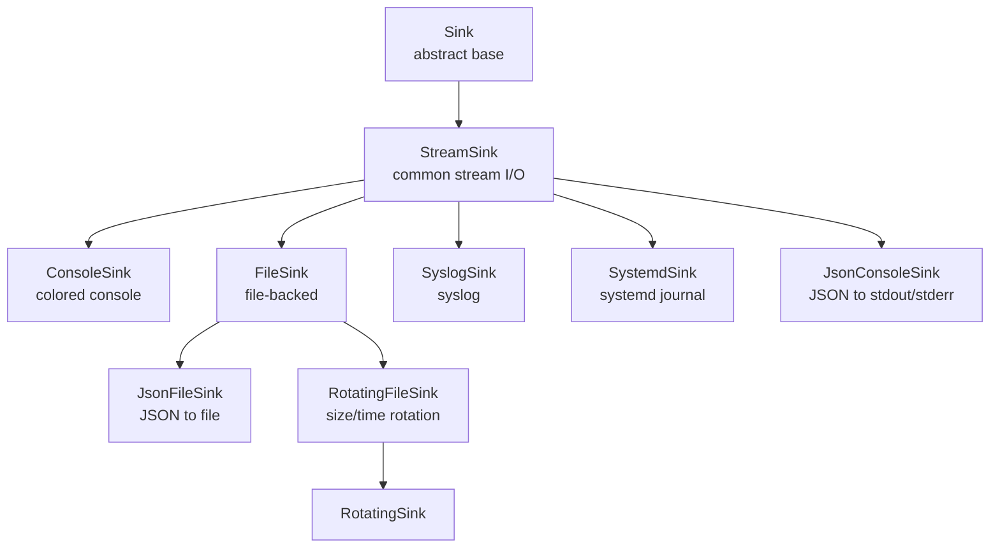
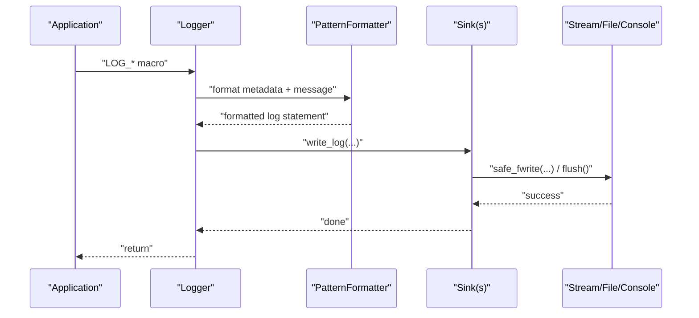
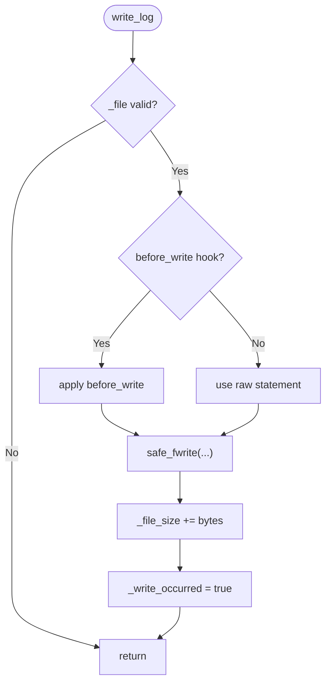
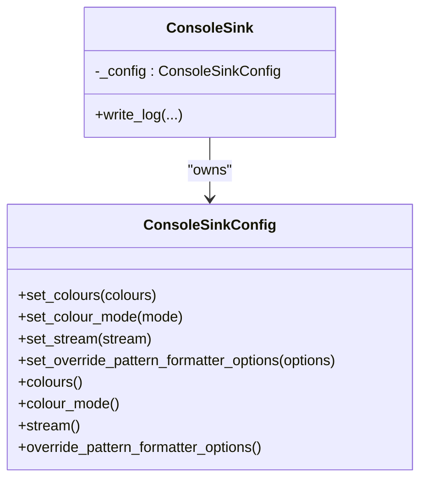
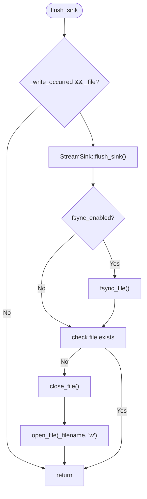
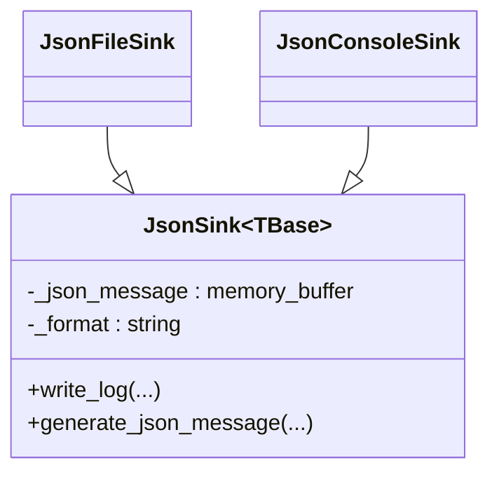
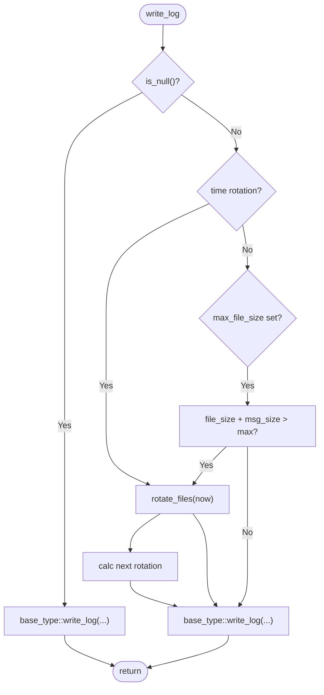
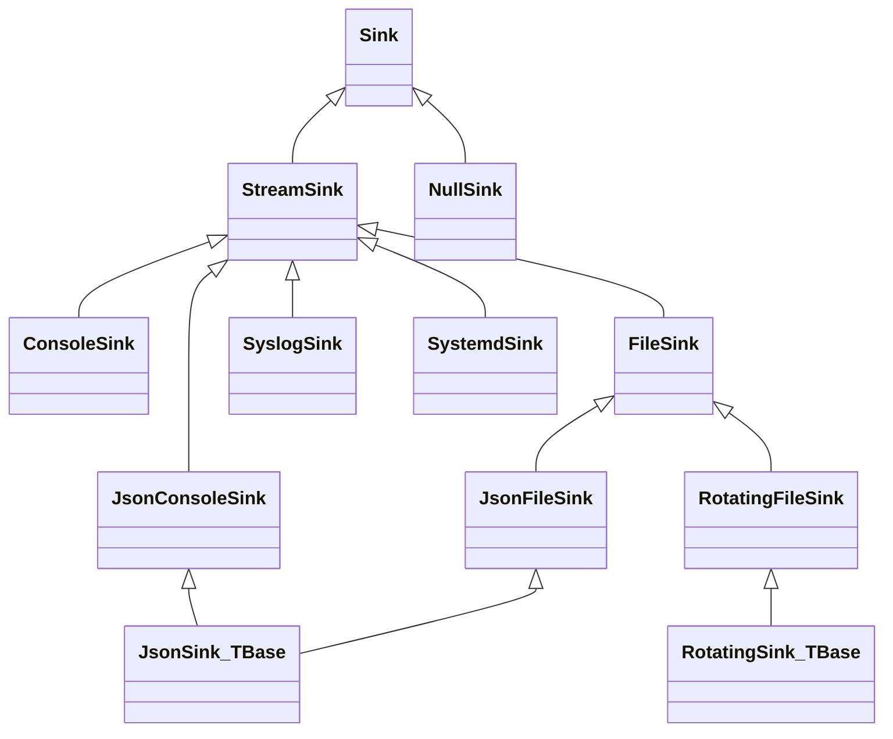

# Sink System

<cite>
**Referenced Files in This Document**
- [Sink.h](file://include/quill/sinks/Sink.h)
- [StreamSink.h](file://include/quill/sinks/StreamSink.h)
- [ConsoleSink.h](file://include/quill/sinks/ConsoleSink.h)
- [FileSink.h](file://include/quill/sinks/FileSink.h)
- [JsonSink.h](file://include/quill/sinks/JsonSink.h)
- [RotatingSink.h](file://include/quill/sinks/RotatingSink.h)
- [RotatingFileSink.h](file://include/quill/sinks/RotatingFileSink.h)
- [NullSink.h](file://include/quill/sinks/NullSink.h)
- [SyslogSink.h](file://include/quill/sinks/SyslogSink.h)
- [SystemdSink.h](file://include/quill/sinks/SystemdSink.h)
- [console_logging.cpp](file://examples/console_logging.cpp)
- [file_logging.cpp](file://examples/file_logging.cpp)
- [json_console_logging.cpp](file://examples/json_console_logging.cpp)
- [rotating_file_logging.cpp](file://examples/rotating_file_logging.cpp)
- [user_defined_sink.cpp](file://examples/user_defined_sink.cpp)
</cite>

## Table of Contents
1. [Introduction](#introduction)
2. [Project Structure](#project-structure)
3. [Core Components](#core-components)
4. [Architecture Overview](#architecture-overview)
5. [Detailed Component Analysis](#detailed-component-analysis)
6. [Dependency Analysis](#dependency-analysis)
7. [Performance Considerations](#performance-considerations)
8. [Troubleshooting Guide](#troubleshooting-guide)
9. [Conclusion](#conclusion)
10. [Appendices](#appendices)

## Introduction
This document explains Quill’s flexible output architecture centered around Sinks. It covers built-in sinks (ConsoleSink, FileSink, JsonSink, RotatingFileSink, NullSink, SyslogSink, SystemdSink), the Sink interface and base functionality that enables custom sink development, multiple sink configuration, conditional routing, priorities, formatting control, lifecycle management, thread-safety, and performance characteristics. Practical examples are referenced from the repository’s examples.

## Project Structure
Quill organizes sink implementations under include/quill/sinks/. The core hierarchy is:
- Sink (abstract base)
  - StreamSink (common streaming I/O)
    - ConsoleSink (colored console output)
    - FileSink (file-backed logging)
    - JsonSink (JSON formatting wrappers)
    - SyslogSink (system logger)
    - SystemdSink (systemd journal)
  - RotatingSink<TBase> (policy wrapper for size/time rotation)
    - RotatingFileSink (alias for RotatingSink<FileSink>)

**Diagram sources**
- [Sink.h:40-218](file://include/quill/sinks/Sink.h#L40-L218)
- [StreamSink.h:67-314](file://include/quill/sinks/StreamSink.h#L67-L314)
- [ConsoleSink.h:331-412](file://include/quill/sinks/ConsoleSink.h#L331-L412)
- [FileSink.h:226-527](file://include/quill/sinks/FileSink.h#L226-L527)
- [JsonSink.h:140-165](file://include/quill/sinks/JsonSink.h#L140-L165)
- [RotatingSink.h:262-800](file://include/quill/sinks/RotatingSink.h#L262-L800)
- [RotatingFileSink.h:13-15](file://include/quill/sinks/RotatingFileSink.h#L13-L15)

**Section sources**
- [Sink.h:40-218](file://include/quill/sinks/Sink.h#L40-L218)
- [StreamSink.h:67-314](file://include/quill/sinks/StreamSink.h#L67-L314)
- [ConsoleSink.h:331-412](file://include/quill/sinks/ConsoleSink.h#L331-L412)
- [FileSink.h:226-527](file://include/quill/sinks/FileSink.h#L226-L527)
- [JsonSink.h:140-165](file://include/quill/sinks/JsonSink.h#L140-L165)
- [RotatingSink.h:262-800](file://include/quill/sinks/RotatingSink.h#L262-L800)
- [RotatingFileSink.h:13-15](file://include/quill/sinks/RotatingFileSink.h#L13-L15)

## Core Components
- Sink: Abstract base defining the contract for write_log, flush_sink, periodic tasks, log level filtering, and filter registration. It exposes thread-safe filter management and applies filters before writing.
- StreamSink: Base for stream-based sinks. Handles safe writes, flush, optional before_write hooks, and null-device behavior. Supports stdout/stderr and file paths.
- ConsoleSink: Adds color support and configurable output stream selection (stdout/stderr) with automatic/forced color modes.
- FileSink: File-backed sink with configurable open mode, write buffering, fsync control, and filename append options.
- JsonSink: Template wrapper that generates JSON records from log metadata and arguments, with a pluggable generate_json_message hook.
- RotatingSink<TBase>: Policy wrapper adding size/time rotation and backup management to a base sink (typically FileSink).
- NullSink: No-op sink that discards logs.
- SyslogSink/SystemdSink: Native system integrations with configurable identifiers, facilities/options, and level mappings.

Key capabilities:
- Multiple sinks per logger: A logger can own multiple sinks to send logs to multiple destinations simultaneously.
- Conditional routing: Per-sink log level filters and per-sink filters enable selective delivery.
- Formatting control: Per-sink pattern formatter overrides and JSON sinks produce structured output.
- Lifecycle and thread-safety: Safe flush, periodic tasks, and robust error handling with exceptions on failure.

**Section sources**
- [Sink.h:40-218](file://include/quill/sinks/Sink.h#L40-L218)
- [StreamSink.h:67-314](file://include/quill/sinks/StreamSink.h#L67-L314)
- [ConsoleSink.h:44-328](file://include/quill/sinks/ConsoleSink.h#L44-L328)
- [FileSink.h:64-220](file://include/quill/sinks/FileSink.h#L64-L220)
- [JsonSink.h:29-165](file://include/quill/sinks/JsonSink.h#L29-L165)
- [RotatingSink.h:39-257](file://include/quill/sinks/RotatingSink.h#L39-L257)
- [NullSink.h:24-40](file://include/quill/sinks/NullSink.h#L24-L40)
- [SyslogSink.h:54-185](file://include/quill/sinks/SyslogSink.h#L54-L185)
- [SystemdSink.h:58-182](file://include/quill/sinks/SystemdSink.h#L58-L182)

## Architecture Overview
The logging pipeline routes formatted log statements to one or more sinks. Sinks receive metadata, timestamps, thread/process info, logger name, level, and the formatted message. They may apply additional formatting (e.g., JSON) and write to their destination.

**Diagram sources**
- [StreamSink.h:152-180](file://include/quill/sinks/StreamSink.h#L152-L180)
- [Sink.h:123-128](file://include/quill/sinks/Sink.h#L123-L128)

## Detailed Component Analysis

### Sink Interface and Base Functionality
- Responsibilities:
  - write_log: receives structured metadata and the formatted log statement.
  - flush_sink: synchronizes buffered output.
  - run_periodic_tasks: lightweight periodic work on the backend thread.
  - set_log_level_filter/get_log_level_filter: per-sink severity gating.
  - add_filter: register per-sink filters with thread-safe management.
  - apply_all_filters: short-circuits below log level, updates local filter list on changes, and evaluates all filters.

Thread-safety:
- Atomic log level and atomic “new filter” indicator.
- Spinlock guards global filter registry; filters are copied locally for evaluation.

Formatting override:
- Optional per-sink PatternFormatterOptions override used by backend to initialize a formatter for that sink.

**Section sources**
- [Sink.h:40-218](file://include/quill/sinks/Sink.h#L40-L218)

### StreamSink: Common Streaming Behavior
- Stream selection: stdout, stderr, file path, or /dev/null.
- Safe writes: retry partial writes, handle platform-specific console writes, and throw on errors.
- Event hooks: before_write hook allows transforming the log statement before writing.
- Flush: resets write flag and clears error state.

**Diagram sources**
- [StreamSink.h:152-180](file://include/quill/sinks/StreamSink.h#L152-L180)
- [StreamSink.h:214-278](file://include/quill/sinks/StreamSink.h#L214-L278)

**Section sources**
- [StreamSink.h:67-314](file://include/quill/sinks/StreamSink.h#L67-L314)

### ConsoleSink: Colored Console Output
- Configurable color mode (Always, Automatic, Never) and per-log-level color assignment.
- Automatic detection of terminal capability and environment support.
- Windows ANSI support activation when needed.
- Writes color codes before and after the formatted record.

**Diagram sources**
- [ConsoleSink.h:44-328](file://include/quill/sinks/ConsoleSink.h#L44-L328)
- [ConsoleSink.h:331-412](file://include/quill/sinks/ConsoleSink.h#L331-L412)

**Section sources**
- [ConsoleSink.h:44-328](file://include/quill/sinks/ConsoleSink.h#L44-L328)
- [ConsoleSink.h:331-412](file://include/quill/sinks/ConsoleSink.h#L331-L412)

### FileSink: File-Based Logging
- Filename append options: StartDate, StartDateTime, or custom strftime pattern.
- Open mode and write buffer sizing with minimum 4KB enforcement.
- Optional fsync with minimum interval to reduce disk wear.
- Robust file open with retries and cross-platform flags to avoid handle inheritance.
- Flush behavior: flushes stream and optionally fsyncs; reopens if file disappeared.

**Diagram sources**
- [FileSink.h:264-288](file://include/quill/sinks/FileSink.h#L264-L288)
- [FileSink.h:444-463](file://include/quill/sinks/FileSink.h#L444-L463)
- [FileSink.h:468-485](file://include/quill/sinks/FileSink.h#L468-L485)

**Section sources**
- [FileSink.h:64-220](file://include/quill/sinks/FileSink.h#L64-L220)
- [FileSink.h:264-288](file://include/quill/sinks/FileSink.h#L264-L288)
- [FileSink.h:444-463](file://include/quill/sinks/FileSink.h#L444-L463)
- [FileSink.h:468-485](file://include/quill/sinks/FileSink.h#L468-L485)

### JsonSink: Structured Logging
- Template wrapper that sanitizes message format (removes newlines) and builds a JSON record.
- Provides generate_json_message hook to customize fields and structure.
- Two built-ins:
  - JsonFileSink: JSON to file via FileSink.
  - JsonConsoleSink: JSON to stdout via StreamSink.

**Diagram sources**
- [JsonSink.h:29-165](file://include/quill/sinks/JsonSink.h#L29-L165)

**Section sources**
- [JsonSink.h:29-165](file://include/quill/sinks/JsonSink.h#L29-L165)

### RotatingFileSink and RotatingSink: Log Rotation Management
- Rotation triggers:
  - Size-based: when current file size plus incoming message exceeds configured max.
  - Time-based: hourly/minutely/daily at configured intervals or specific time-of-day.
- Backup management:
  - Index-based or date/date-time suffix naming.
  - Maximum backup files with overwrite policy.
  - Startup cleanup/recovery of existing rotated files.
- File rename with retry logic to handle OS-level locks.

**Diagram sources**
- [RotatingSink.h:335-369](file://include/quill/sinks/RotatingSink.h#L335-L369)
- [RotatingSink.h:396-487](file://include/quill/sinks/RotatingSink.h#L396-L487)

**Section sources**
- [RotatingSink.h:39-257](file://include/quill/sinks/RotatingSink.h#L39-L257)
- [RotatingSink.h:262-800](file://include/quill/sinks/RotatingSink.h#L262-L800)
- [RotatingFileSink.h:13-15](file://include/quill/sinks/RotatingFileSink.h#L13-L15)

### NullSink, SyslogSink, SystemdSink
- NullSink: Discards all logs.
- SyslogSink: Sends formatted or raw messages to syslog with configurable identifier, options, facility, and level mapping.
- SystemdSink: Sends to systemd journal with similar mapping and level controls.

**Section sources**
- [NullSink.h:24-40](file://include/quill/sinks/NullSink.h#L24-L40)
- [SyslogSink.h:54-185](file://include/quill/sinks/SyslogSink.h#L54-L185)
- [SystemdSink.h:58-182](file://include/quill/sinks/SystemdSink.h#L58-L182)

## Dependency Analysis
- Sink is the central abstraction; most sinks inherit from StreamSink or FileSink.
- RotatingSink is a CRTP-style template wrapper around a base sink type.
- JsonSink is a template wrapper around either FileSink or StreamSink.
- ConsoleSink depends on StreamSink and ConsoleSinkConfig.
- FileSink depends on StreamSink and FileSinkConfig.
- SyslogSink/SystemdSink depend on native system APIs and expose configuration classes.

**Diagram sources**
- [Sink.h:40-218](file://include/quill/sinks/Sink.h#L40-L218)
- [StreamSink.h:67-314](file://include/quill/sinks/StreamSink.h#L67-L314)
- [ConsoleSink.h:331-412](file://include/quill/sinks/ConsoleSink.h#L331-L412)
- [FileSink.h:226-527](file://include/quill/sinks/FileSink.h#L226-L527)
- [JsonSink.h:140-165](file://include/quill/sinks/JsonSink.h#L140-L165)
- [RotatingSink.h:262-800](file://include/quill/sinks/RotatingSink.h#L262-L800)
- [RotatingFileSink.h:13-15](file://include/quill/sinks/RotatingFileSink.h#L13-L15)
- [SyslogSink.h:137-185](file://include/quill/sinks/SyslogSink.h#L137-L185)
- [SystemdSink.h:119-182](file://include/quill/sinks/SystemdSink.h#L119-L182)
- [NullSink.h:24-40](file://include/quill/sinks/NullSink.h#L24-L40)

## Performance Considerations
- ConsoleSink:
  - Color code writes incur extra I/O; disable colors or set mode to Never for high throughput.
  - On Windows, ANSI activation adds overhead; Automatic mode avoids unnecessary setup.
- FileSink:
  - Custom write buffers improve throughput; minimum 4KB enforced.
  - fsync reduces durability guarantees but increases safety; use minimum_fsync_interval to limit overhead.
  - Filename append and timezone conversions are negligible compared to I/O.
- JsonSink:
  - JSON generation allocates buffers; prefer streaming JSON sinks for very high rates.
  - Avoid newline characters in message format to maintain single-line JSON records.
- RotatingFileSink:
  - Size/time checks add minimal CPU overhead; choose reasonable intervals and sizes.
  - Renaming and backup cleanup occur infrequently; consider backup limits to avoid excessive filesystem churn.
- StreamSink:
  - safe_fwrite handles partial writes and retries; errors are fatal to prevent silent corruption.
  - Using /dev/null or NullSink avoids I/O entirely for performance testing.

[No sources needed since this section provides general guidance]

## Troubleshooting Guide
Common issues and remedies:
- Partial write or zero-byte write:
  - safe_fwrite throws on persistent partial writes or zero writes without error; check disk space and stream validity.
- File open failures:
  - FileSink retries transient failures and validates setvbuf; confirm permissions and path existence.
- fsync errors:
  - FileSink flush_sink triggers fsync only when enabled; verify device supports fsync and interval settings.
- Windows console output:
  - ConsoleSink activates ANSI support; ensure terminal supports ANSI or switch to Never.
- Rotation conflicts:
  - RotatingSink cleans and recovers files on startup; ensure naming scheme and backup limits match expectations.
- Syslog/Systemd integration:
  - Avoid macro collisions by including headers in .cpp or defining QUILL_DISABLE_NON_PREFIXED_MACROS.

**Section sources**
- [StreamSink.h:214-278](file://include/quill/sinks/StreamSink.h#L214-L278)
- [FileSink.h:425-433](file://include/quill/sinks/FileSink.h#L425-L433)
- [ConsoleSink.h:231-250](file://include/quill/sinks/ConsoleSink.h#L231-L250)
- [RotatingSink.h:490-561](file://include/quill/sinks/RotatingSink.h#L490-L561)
- [SyslogSink.h:24-46](file://include/quill/sinks/SyslogSink.h#L24-L46)
- [SystemdSink.h:28-50](file://include/quill/sinks/SystemdSink.h#L28-L50)

## Conclusion
Quill’s sink system provides a robust, extensible foundation for diverse output targets. The Sink interface and StreamSink base encapsulate common behaviors, while specialized sinks tailor output formats and destinations. Built-in features like conditional routing, formatting overrides, rotation, and system integrations cover typical production needs. Custom sinks can be developed by implementing write_log and flush_sink, integrating seamlessly into the logging pipeline with thread-safe filter support and periodic tasks.

[No sources needed since this section summarizes without analyzing specific files]

## Appendices

### Practical Examples and References
- Console logging with colored output:
  - Example: [console_logging.cpp:20-72](file://examples/console_logging.cpp#L20-L72)
- File logging with pattern formatting and filename append:
  - Example: [file_logging.cpp:29-73](file://examples/file_logging.cpp#L29-L73)
- JSON console logging:
  - Example: [json_console_logging.cpp:9-54](file://examples/json_console_logging.cpp#L9-L54)
- Rotating file logging with size and time rotation:
  - Example: [rotating_file_logging.cpp:14-45](file://examples/rotating_file_logging.cpp#L14-L45)
- Custom sink implementation:
  - Example: [user_defined_sink.cpp:18-90](file://examples/user_defined_sink.cpp#L18-L90)

**Section sources**
- [console_logging.cpp:20-72](file://examples/console_logging.cpp#L20-L72)
- [file_logging.cpp:29-73](file://examples/file_logging.cpp#L29-L73)
- [json_console_logging.cpp:9-54](file://examples/json_console_logging.cpp#L9-L54)
- [rotating_file_logging.cpp:14-45](file://examples/rotating_file_logging.cpp#L14-L45)
- [user_defined_sink.cpp:18-90](file://examples/user_defined_sink.cpp#L18-L90)