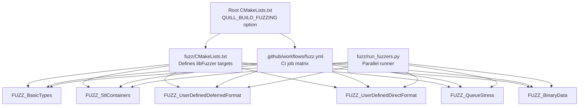
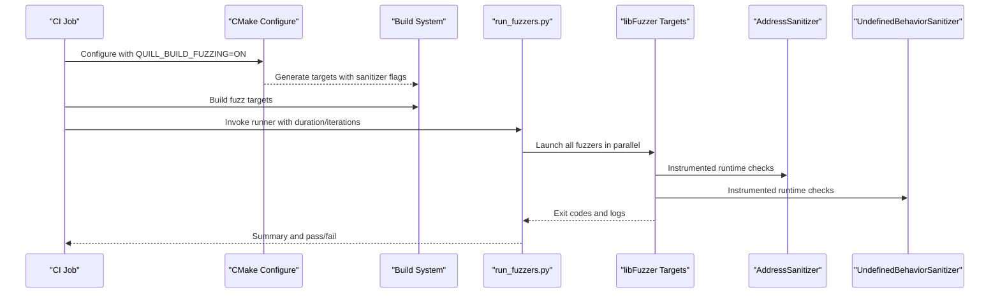
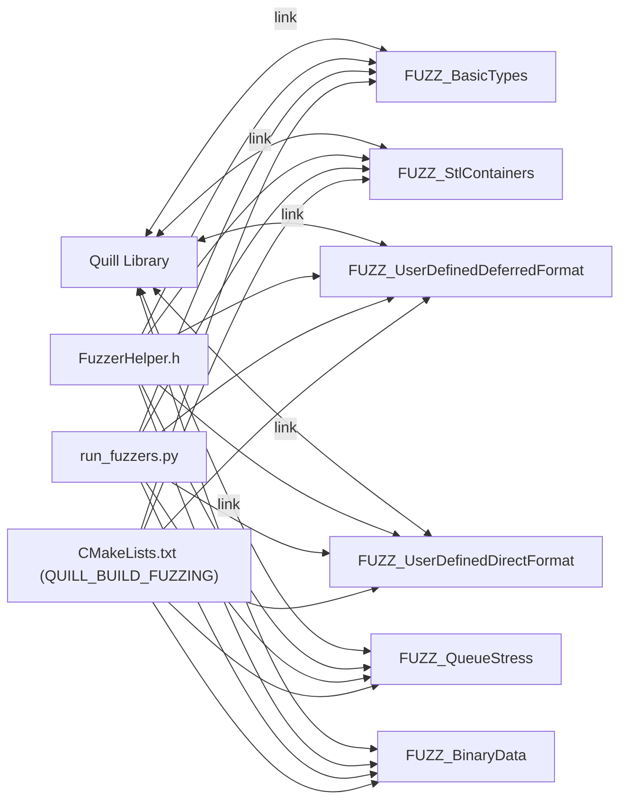

# Fuzzing & Security Testing

<cite>
**Referenced Files in This Document**
- [CMakeLists.txt](file://CMakeLists.txt)
- [.github/workflows/fuzz.yml](file://.github/workflows/fuzz.yml)
- [fuzz/CMakeLists.txt](file://fuzz/CMakeLists.txt)
- [fuzz/run_fuzzers.py](file://fuzz/run_fuzzers.py)
- [fuzz/fuzz.dict](file://fuzz/fuzz.dict)
- [fuzz/FuzzerHelper.h](file://fuzz/FuzzerHelper.h)
- [fuzz/BasicTypesFuzzer.cpp](file://fuzz/BasicTypesFuzzer.cpp)
- [fuzz/StlContainersFuzzer.cpp](file://fuzz/StlContainersFuzzer.cpp)
- [fuzz/UserDefinedDeferredFormatFuzzer.cpp](file://fuzz/UserDefinedDeferredFormatFuzzer.cpp)
- [fuzz/UserDefinedDirectFormatFuzzer.cpp](file://fuzz/UserDefinedDirectFormatFuzzer.cpp)
- [fuzz/QueueStressFuzzer.cpp](file://fuzz/QueueStressFuzzer.cpp)
- [fuzz/BinaryDataFuzzer.cpp](file://fuzz/BinaryDataFuzzer.cpp)
- [test/integration_tests/BinaryDataLoggingTest.cpp](file://test/integration_tests/BinaryDataLoggingTest.cpp)
- [test/integration_tests/BinaryFileWriterTest.cpp](file://test/integration_tests/BinaryFileWriterTest.cpp)
</cite>

## Table of Contents
1. [Introduction](#introduction)
2. [Project Structure](#project-structure)
3. [Core Components](#core-components)
4. [Architecture Overview](#architecture-overview)
5. [Detailed Component Analysis](#detailed-component-analysis)
6. [Dependency Analysis](#dependency-analysis)
7. [Performance Considerations](#performance-considerations)
8. [Troubleshooting Guide](#troubleshooting-guide)
9. [Conclusion](#conclusion)
10. [Appendices](#appendices)

## Introduction
This document describes Quill’s fuzzing and security testing framework. It explains how libFuzzer integrates with the project, how fuzzers are configured and executed, and how corpus management is handled. It covers the six fuzzer types: basic types, STL containers, user-defined deferred-format types, user-defined direct-format types, queue stress, and binary data. It also documents methodologies for logging inputs, format strings, user-defined types, and edge cases; crash reproduction; vulnerability detection; corpus curation; seed generation; and automated pipeline setup. Finally, it outlines security best practices, input sanitization validation, protection against malformed inputs, performance optimization, memory leak detection, and integration with continuous security testing workflows.

## Project Structure
Quill’s fuzzing infrastructure is organized under the fuzz directory and integrated into the main build via a dedicated option. The CI workflow automates fuzzing across all fuzzers.

**Diagram sources**
- [CMakeLists.txt:174-180](file://CMakeLists.txt#L174-L180)
- [fuzz/CMakeLists.txt:1-25](file://fuzz/CMakeLists.txt#L1-L25)
- [.github/workflows/fuzz.yml:24-80](file://.github/workflows/fuzz.yml#L24-L80)

**Section sources**
- [CMakeLists.txt:38-39](file://CMakeLists.txt#L38-L39)
- [CMakeLists.txt:174-180](file://CMakeLists.txt#L174-L180)
- [.github/workflows/fuzz.yml:24-80](file://.github/workflows/fuzz.yml#L24-L80)

## Core Components
- libFuzzer integration and sanitizer flags: Each fuzzer target compiles with -fsanitize=fuzzer,address,undefined and links the same.
- Fuzzer runner: A Python script orchestrates parallel execution, collects results, and reports errors.
- Dictionary: A fuzzing dictionary improves coverage for format specifiers, log levels, and special tokens.
- Shared initialization: A helper initializes the backend and logger once per fuzzer run, with optional binary mode and flush thresholds.

Key behaviors:
- Sanitizers: AddressSanitizer, UndefinedBehaviorSanitizer, and libFuzzer are enabled for all fuzzers.
- Parallel execution: The runner starts all fuzzers concurrently and aggregates results.
- Error detection: The runner scans fuzzer output for sanitizer and libFuzzer error patterns.
- Binary mode: Some fuzzers switch to binary sinks and disable printable character checks.

**Section sources**
- [fuzz/CMakeLists.txt:7-16](file://fuzz/CMakeLists.txt#L7-L16)
- [fuzz/run_fuzzers.py:100-135](file://fuzz/run_fuzzers.py#L100-L135)
- [fuzz/run_fuzzers.py:125-123](file://fuzz/run_fuzzers.py#L125-L123)
- [fuzz/run_fuzzers.py:163-224](file://fuzz/run_fuzzers.py#L163-L224)
- [fuzz/fuzz.dict:1-73](file://fuzz/fuzz.dict#L1-L73)
- [fuzz/FuzzerHelper.h:27-84](file://fuzz/FuzzerHelper.h#L27-L84)

## Architecture Overview
The fuzzing architecture comprises:
- Build-time selection via QUILL_BUILD_FUZZING.
- Target creation with sanitizer flags.
- Initialization of backend and logger per fuzzer.
- Execution via a Python runner that manages concurrency and error reporting.
- CI automation that builds and runs fuzzers in parallel.

**Diagram sources**
- [CMakeLists.txt:174-180](file://CMakeLists.txt#L174-L180)
- [fuzz/CMakeLists.txt:7-16](file://fuzz/CMakeLists.txt#L7-L16)
- [fuzz/run_fuzzers.py:264-283](file://fuzz/run_fuzzers.py#L264-L283)
- [.github/workflows/fuzz.yml:62-80](file://.github/workflows/fuzz.yml#L62-L80)

## Detailed Component Analysis

### Basic Types Fuzzer
Purpose: Validates encoding and formatting of primitive types, strings, and format specifiers.

Methodology:
- Uses a deterministic data extractor to parse bytes from the fuzzer input.
- Exercises std::string, char const*, std::string_view, integral and floating types, booleans, and chars.
- Applies format specifiers and LOGV macros.
- Tests boundaries, special floats, and empty strings.

Security focus:
- Validates robustness against malformed inputs and format strings.
- Ensures safe handling of C-strings and string views.

```mermaid
flowchart TD
Start(["LLVMFuzzerTestOneInput"]) --> Parse["Parse selector and data"]
Parse --> Switch{"Selector % 25"}
Switch --> S0["std::string"]
Switch --> S1["char const* (null-terminated)"]
Switch --> S2["std::string_view"]
Switch --> S3["int8_t"]
Switch --> S4["uint8_t"]
Switch --> S5["int16_t"]
Switch --> S6["uint16_t"]
Switch --> S7["int32_t"]
Switch --> S8["uint32_t"]
Switch --> S9["int64_t"]
Switch --> S10["uint64_t"]
Switch --> S11["float"]
Switch --> S12["double"]
Switch --> S13["long double"]
Switch --> S14["bool"]
Switch --> S15["char"]
Switch --> S16["Mixed types"]
Switch --> S17["Format specifiers (int)"]
Switch --> S18["Format specifiers (double)"]
Switch --> S19["LOGV macros"]
Switch --> S20["Multiple log levels"]
Switch --> S21["Multiple char const*"]
Switch --> S22["Signed/unsigned boundaries"]
Switch --> S23["Special floats (inf/nan)"]
Switch --> S24["Empty string"]
S0 --> End(["Return"])
S1 --> End
S2 --> End
S3 --> End
S4 --> End
S5 --> End
S6 --> End
S7 --> End
S8 --> End
S9 --> End
S10 --> End
S11 --> End
S12 --> End
S13 --> End
S14 --> End
S15 --> End
S16 --> End
S17 --> End
S18 --> End
S19 --> End
S20 --> End
S21 --> End
S22 --> End
S23 --> End
S24 --> End
```

**Diagram sources**
- [fuzz/BasicTypesFuzzer.cpp:167-366](file://fuzz/BasicTypesFuzzer.cpp#L167-L366)

**Section sources**
- [fuzz/BasicTypesFuzzer.cpp:14-166](file://fuzz/BasicTypesFuzzer.cpp#L14-L166)
- [fuzz/BasicTypesFuzzer.cpp:167-366](file://fuzz/BasicTypesFuzzer.cpp#L167-L366)

### STL Containers Fuzzer
Purpose: Exercises standard containers and chrono/time types through logging.

Methodology:
- Generates containers of varying sizes and element types.
- Tests vector, array, deque, list, forward_list, map, unordered_map, set, unordered_set, pair, tuple, optional, filesystem::path, and chrono types.
- Includes nested containers and complex combinations.

Security focus:
- Validates encoding of nested and heterogeneous containers.
- Ensures safe handling of optional and chrono types.

**Section sources**
- [fuzz/StlContainersFuzzer.cpp:40-124](file://fuzz/StlContainersFuzzer.cpp#L40-L124)
- [fuzz/StlContainersFuzzer.cpp:126-355](file://fuzz/StlContainersFuzzer.cpp#L126-L355)

### User-Defined Deferred Format Fuzzer
Purpose: Validates user-defined types with DeferredFormatCodec and custom formatters.

Methodology:
- Defines trivially copyable and complex user types with custom formatters.
- Exercises vectors, arrays, deques, lists, maps, sets, pairs, and nested structures.
- Tests large types, empty types, unaligned types, and very large strings.

Security focus:
- Ensures deferred encoding path handles arbitrary user types safely.
- Validates codec correctness for memcpy-based and non-memcpy-based types.

**Section sources**
- [fuzz/UserDefinedDeferredFormatFuzzer.cpp:24-94](file://fuzz/UserDefinedDeferredFormatFuzzer.cpp#L24-L94)
- [fuzz/UserDefinedDeferredFormatFuzzer.cpp:238-297](file://fuzz/UserDefinedDeferredFormatFuzzer.cpp#L238-L297)
- [fuzz/UserDefinedDeferredFormatFuzzer.cpp:299-562](file://fuzz/UserDefinedDeferredFormatFuzzer.cpp#L299-L562)

### User-Defined Direct Format Fuzzer
Purpose: Validates user-defined types with DirectFormatCodec and ostream operators.

Methodology:
- Defines trivially copyable and complex types with DirectFormatCodec and optional hash for unordered containers.
- Exercises enums (scoped/unscoped), large types, empty types, unaligned types, and very large strings.
- Tests vectors, arrays, deques, lists, maps, sets, unordered maps, and nested structures.

Security focus:
- Ensures direct encoding path is resilient to large and misaligned types.
- Validates enum encoding and hashing behavior.

**Section sources**
- [fuzz/UserDefinedDirectFormatFuzzer.cpp:27-106](file://fuzz/UserDefinedDirectFormatFuzzer.cpp#L27-L106)
- [fuzz/UserDefinedDirectFormatFuzzer.cpp:273-334](file://fuzz/UserDefinedDirectFormatFuzzer.cpp#L273-L334)
- [fuzz/UserDefinedDirectFormatFuzzer.cpp:336-627](file://fuzz/UserDefinedDirectFormatFuzzer.cpp#L336-L627)

### Queue Stress Fuzzer
Purpose: Stresses the queue under sustained load, wraparound, and mixed message sizes.

Methodology:
- Uses a high immediate flush threshold to increase queue pressure.
- Exercises variable-size messages, rapid bursts, alternating sizes, boundary sizes, and mixed log levels.
- Tests arithmetic types, char const*, char arrays, deferred/direct custom types, and enums.

Security focus:
- Validates queue growth, wraparound, and race conditions under sustained load.
- Ensures robustness across all encoding paths.

**Section sources**
- [fuzz/QueueStressFuzzer.cpp:11-14](file://fuzz/QueueStressFuzzer.cpp#L11-L14)
- [fuzz/QueueStressFuzzer.cpp:154-326](file://fuzz/QueueStressFuzzer.cpp#L154-L326)
- [fuzz/QueueStressFuzzer.cpp:328-800](file://fuzz/QueueStressFuzzer.cpp#L328-L800)

### Binary Data Fuzzer
Purpose: Validates binary data logging with BinaryDataDeferredFormatCodec.

Methodology:
- Logs variable-sized binary messages (0 bytes to 1MB).
- Tests null data, zero size, special bytes (0x00, 0xFF, newlines), aligned/unaligned data, and repeated patterns.
- Exercises different protocol tags and interleaving with text logs.

Security focus:
- Ensures raw binary serialization and deserialization are safe and correct.
- Validates binary sink behavior and pattern preservation.

**Section sources**
- [fuzz/BinaryDataFuzzer.cpp:13-16](file://fuzz/BinaryDataFuzzer.cpp#L13-L16)
- [fuzz/BinaryDataFuzzer.cpp:143-192](file://fuzz/BinaryDataFuzzer.cpp#L143-L192)
- [fuzz/BinaryDataFuzzer.cpp:194-546](file://fuzz/BinaryDataFuzzer.cpp#L194-L546)

### Fuzzer Execution and Crash Reproduction
Execution:
- Build with QUILL_BUILD_FUZZING=ON and Clang.
- Run the Python runner to start all fuzzers in parallel for a given duration or iteration count.
- The runner captures output, extracts run counts, and detects sanitizer/leak errors.

Crash reproduction:
- Use the captured fuzzer output to reproduce crashes locally with the same sanitizer flags.
- For binary fuzzers, ensure binary mode is enabled and the sink opens in binary mode.

**Section sources**
- [fuzz/run_fuzzers.py:336-500](file://fuzz/run_fuzzers.py#L336-L500)
- [fuzz/run_fuzzers.py:163-224](file://fuzz/run_fuzzers.py#L163-L224)
- [fuzz/FuzzerHelper.h:42-69](file://fuzz/FuzzerHelper.h#L42-L69)

### Vulnerability Detection Strategies
- Sanitizers: AddressSanitizer, UndefinedBehaviorSanitizer, and LeakSanitizer are enabled for all fuzzers.
- Runner scanning: Detects known error patterns from sanitizers and libFuzzer.
- CI integration: Automates fuzzing runs and reports failures.

**Section sources**
- [fuzz/CMakeLists.txt:7-16](file://fuzz/CMakeLists.txt#L7-L16)
- [fuzz/run_fuzzers.py:112-123](file://fuzz/run_fuzzers.py#L112-L123)
- [.github/workflows/fuzz.yml:62-80](file://.github/workflows/fuzz.yml#L62-L80)

### Corpus Management and Seed Generation
- Dictionary: A fuzzing dictionary improves coverage for format specifiers, log levels, common strings, special characters, numbers, floats, UTF-8, and container sizes.
- Seeds: The fuzzer inputs are derived from the corpus and guided by the dictionary and random strategies within each fuzzer.

**Section sources**
- [fuzz/fuzz.dict:1-73](file://fuzz/fuzz.dict#L1-L73)

### Automated Pipeline Setup
- CI workflow: Builds with QUILL_BUILD_FUZZING=ON and runs each fuzzer for a fixed duration.
- Parallelism: Matrix strategy runs all fuzzers concurrently.
- Toolchain: Uses Clang 19 and installs required packages.

**Section sources**
- [.github/workflows/fuzz.yml:24-80](file://.github/workflows/fuzz.yml#L24-L80)
- [CMakeLists.txt:174-180](file://CMakeLists.txt#L174-L180)

### Security Best Practices and Input Validation
- Disable printable character checks for binary mode to allow raw bytes.
- Use binary sinks with appropriate open modes for binary data.
- Validate and sanitize inputs before logging, especially for user-defined types and binary protocols.
- Prefer direct encoding for types with known layout and deferred encoding for complex formatting needs.

**Section sources**
- [fuzz/FuzzerHelper.h:35-48](file://fuzz/FuzzerHelper.h#L35-L48)
- [fuzz/BinaryDataFuzzer.cpp:13-16](file://fuzz/BinaryDataFuzzer.cpp#L13-L16)
- [test/integration_tests/BinaryFileWriterTest.cpp:77-96](file://test/integration_tests/BinaryFileWriterTest.cpp#L77-L96)

### Performance Optimization
- Adjust immediate flush thresholds for queue stress fuzzers to increase queue pressure.
- Use smaller queue capacities and varied message sizes to exercise growth and wraparound.
- Limit dictionary size and focus on high-impact tokens to improve convergence.

**Section sources**
- [fuzz/QueueStressFuzzer.cpp:11-12](file://fuzz/QueueStressFuzzer.cpp#L11-L12)
- [fuzz/FuzzerHelper.h:74-79](file://fuzz/FuzzerHelper.h#L74-L79)

### Memory Leak Detection
- Enable leak detection in the runner for slower but more thorough checks.
- Review sanitizer output for LeakSanitizer summaries and errors.

**Section sources**
- [fuzz/run_fuzzers.py:369-373](file://fuzz/run_fuzzers.py#L369-L373)
- [fuzz/run_fuzzers.py:115-123](file://fuzz/run_fuzzers.py#L115-L123)

## Dependency Analysis
The fuzzing targets depend on the Quill library and share a common helper for initialization and sink configuration. The CI workflow depends on CMake configuration and the Python runner.

**Diagram sources**
- [fuzz/CMakeLists.txt:6-16](file://fuzz/CMakeLists.txt#L6-L16)
- [fuzz/FuzzerHelper.h:3-6](file://fuzz/FuzzerHelper.h#L3-L6)
- [fuzz/run_fuzzers.py:103-110](file://fuzz/run_fuzzers.py#L103-L110)
- [CMakeLists.txt:174-180](file://CMakeLists.txt#L174-L180)

**Section sources**
- [fuzz/CMakeLists.txt:1-25](file://fuzz/CMakeLists.txt#L1-L25)
- [fuzz/FuzzerHelper.h:27-84](file://fuzz/FuzzerHelper.h#L27-L84)
- [fuzz/run_fuzzers.py:100-135](file://fuzz/run_fuzzers.py#L100-L135)

## Performance Considerations
- Sanitizer overhead: AddressSanitizer and UndefinedBehaviorSanitizer add overhead; use optimized builds for long runs.
- Queue pressure: Increase flush thresholds and vary message sizes to stress the system effectively.
- Concurrency: The runner parallelizes fuzzers; ensure sufficient CPU and memory resources.

[No sources needed since this section provides general guidance]

## Troubleshooting Guide
Common issues and resolutions:
- Missing fuzzers: Ensure QUILL_BUILD_FUZZING=ON and Clang is used.
- Sanitizer errors: Review runner output for patterns indicating memory errors or undefined behavior.
- Binary mode issues: Confirm binary sink configuration and pattern formatter options.
- Memory leaks: Enable leak detection in the runner and inspect LeakSanitizer output.

**Section sources**
- [CMakeLists.txt:174-177](file://CMakeLists.txt#L174-L177)
- [fuzz/run_fuzzers.py:112-123](file://fuzz/run_fuzzers.py#L112-L123)
- [fuzz/FuzzerHelper.h:35-48](file://fuzz/FuzzerHelper.h#L35-L48)
- [fuzz/run_fuzzers.py:369-373](file://fuzz/run_fuzzers.py#L369-L373)

## Conclusion
Quill’s fuzzing and security testing framework leverages libFuzzer with comprehensive sanitizers to validate robust input handling across basic types, containers, user-defined types, queue stress, and binary data. The CI-driven pipeline ensures continuous security testing, while the runner provides reliable execution, error detection, and reporting. By combining targeted fuzzers, a curated dictionary, and strict binary-mode handling, the framework identifies vulnerabilities early and maintains high-quality logging behavior under adversarial inputs.

[No sources needed since this section summarizes without analyzing specific files]

## Appendices

### Appendix A: CI Workflow Configuration
- Matrix strategy runs all fuzzers.
- Uses Clang 19 and installs required packages.
- Builds with QUILL_BUILD_FUZZING=ON and executes the runner with a fixed duration.

**Section sources**
- [.github/workflows/fuzz.yml:24-80](file://.github/workflows/fuzz.yml#L24-L80)

### Appendix B: Binary Data Logging Validation
- Integration tests demonstrate binary data serialization and file writer behavior.
- Edge cases with newline characters in binary data are verified.

**Section sources**
- [test/integration_tests/BinaryDataLoggingTest.cpp:119-232](file://test/integration_tests/BinaryDataLoggingTest.cpp#L119-L232)
- [test/integration_tests/BinaryFileWriterTest.cpp:71-296](file://test/integration_tests/BinaryFileWriterTest.cpp#L71-L296)