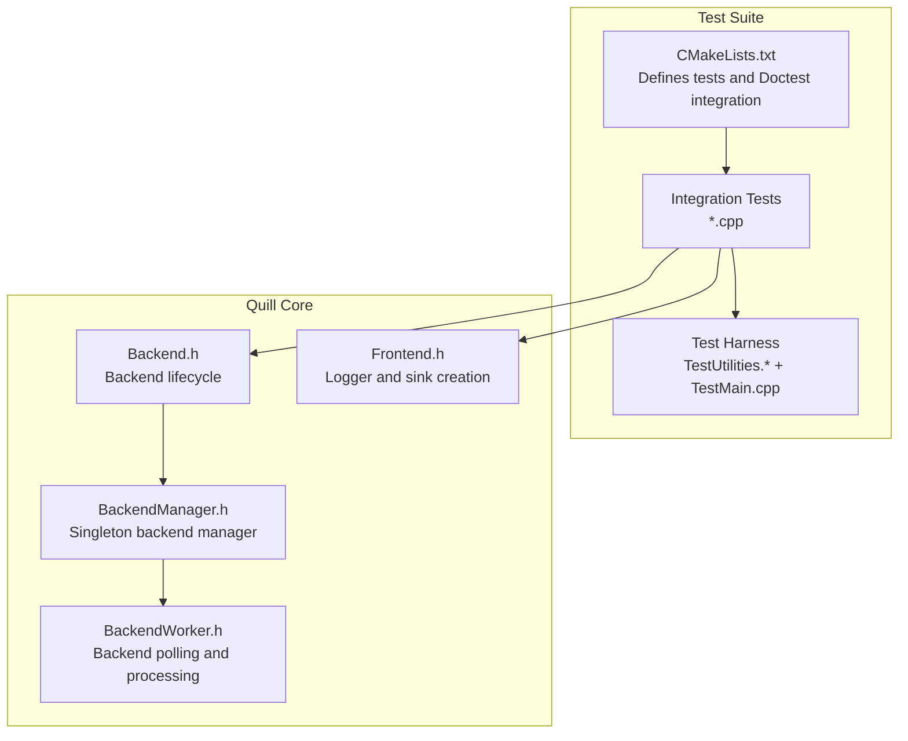
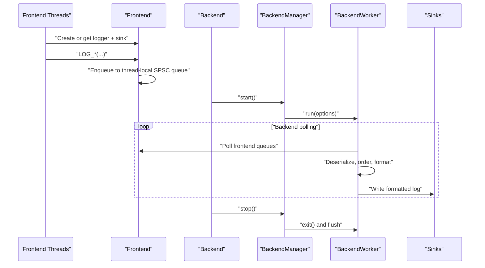
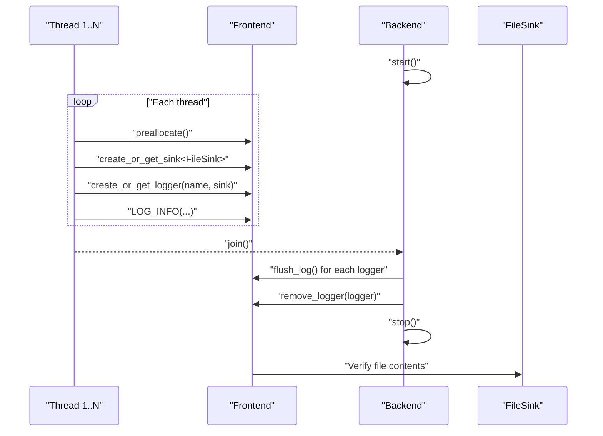
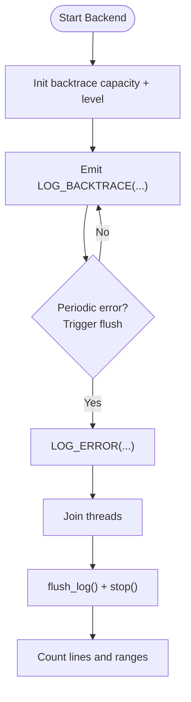
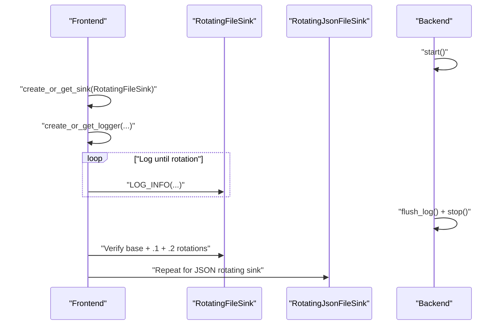
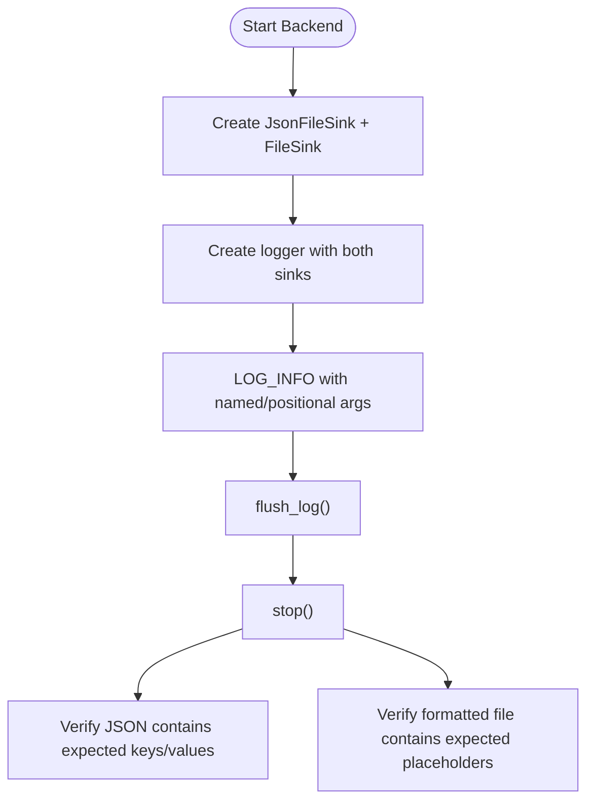
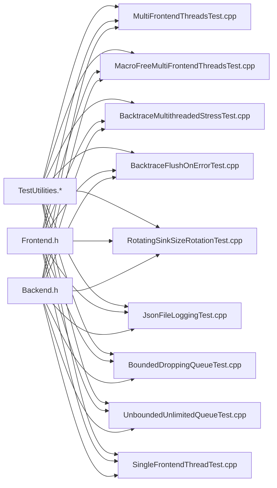

# Integration Testing

<cite>
**Referenced Files in This Document**
- [CMakeLists.txt](file://test/integration_tests/CMakeLists.txt)
- [TestUtilities.h](file://test/misc/TestUtilities.h)
- [TestUtilities.cpp](file://test/misc/TestUtilities.cpp)
- [TestMain.cpp](file://test/misc/TestMain.cpp)
- [MultiFrontendThreadsTest.cpp](file://test/integration_tests/MultiFrontendThreadsTest.cpp)
- [MacroFreeMultiFrontendThreadsTest.cpp](file://test/integration_tests/MacroFreeMultiFrontendThreadsTest.cpp)
- [BacktraceMultithreadedStressTest.cpp](file://test/integration_tests/BacktraceMultithreadedStressTest.cpp)
- [BacktraceFlushOnErrorTest.cpp](file://test/integration_tests/BacktraceFlushOnErrorTest.cpp)
- [RotatingSinkSizeRotationTest.cpp](file://test/integration_tests/RotatingSinkSizeRotationTest.cpp)
- [JsonFileLoggingTest.cpp](file://test/integration_tests/JsonFileLoggingTest.cpp)
- [BoundedDroppingQueueTest.cpp](file://test/integration_tests/BoundedDroppingQueueTest.cpp)
- [UnboundedUnlimitedQueueTest.cpp](file://test/integration_tests/UnboundedUnlimitedQueueTest.cpp)
- [SingleFrontendThreadTest.cpp](file://test/integration_tests/SingleFrontendThreadTest.cpp)
- [Backend.h](file://include/quill/Backend.h)
- [Frontend.h](file://include/quill/Frontend.h)
- [BackendManager.h](file://include/quill/backend/BackendManager.h)
- [BackendWorker.h](file://include/quill/backend/BackendWorker.h)
</cite>

## Table of Contents
1. [Introduction](#introduction)
2. [Project Structure](#project-structure)
3. [Core Components](#core-components)
4. [Architecture Overview](#architecture-overview)
5. [Detailed Component Analysis](#detailed-component-analysis)
6. [Dependency Analysis](#dependency-analysis)
7. [Performance Considerations](#performance-considerations)
8. [Troubleshooting Guide](#troubleshooting-guide)
9. [Conclusion](#conclusion)
10. [Appendices](#appendices)

## Introduction
This document provides comprehensive integration testing guidance for Quill’s multi-threaded and complex logging scenarios. It covers patterns for concurrent logging operations, thread-safety validation, cross-component interactions, and robustness under stress. It documents categories such as multi-frontend thread testing, backtrace functionality validation, rotating file operations, and structured logging verification. It also outlines test environment setup, test data generation, validation strategies for asynchronous logging behavior, performance regression testing, platform compatibility, automated testing procedures, debugging techniques, isolation strategies, and best practices for maintaining reliable integration test suites.

## Project Structure
Quill’s integration tests are organized under the test suite and driven by a CMake-based discovery mechanism. Each test file targets a specific aspect of the logging pipeline, from concurrency and backtraces to sinks and structured logs. The test harness provides utilities for file I/O, diagnostics, and timestamp ordering checks.

**Diagram sources**
- [CMakeLists.txt:1-161](file://test/integration_tests/CMakeLists.txt#L1-L161)
- [TestUtilities.h:1-31](file://test/misc/TestUtilities.h#L1-L31)
- [TestUtilities.cpp:1-171](file://test/misc/TestUtilities.cpp#L1-L171)
- [TestMain.cpp:1-3](file://test/misc/TestMain.cpp#L1-L3)
- [Backend.h:1-246](file://include/quill/Backend.h#L1-L246)
- [Frontend.h:1-373](file://include/quill/Frontend.h#L1-L373)
- [BackendManager.h:1-136](file://include/quill/backend/BackendManager.h#L1-L136)
- [BackendWorker.h:1-800](file://include/quill/backend/BackendWorker.h#L1-L800)

**Section sources**
- [CMakeLists.txt:1-161](file://test/integration_tests/CMakeLists.txt#L1-L161)
- [TestUtilities.h:1-31](file://test/misc/TestUtilities.h#L1-L31)
- [TestUtilities.cpp:1-171](file://test/misc/TestUtilities.cpp#L1-L171)
- [TestMain.cpp:1-3](file://test/misc/TestMain.cpp#L1-L3)

## Core Components
- Backend lifecycle: start/stop, notify, thread identity, and manual backend worker acquisition.
- Frontend lifecycle: preallocate, create/get sinks/loggers, remove loggers, and thread-local queue introspection.
- BackendManager: singleton backend manager coordinating startup, shutdown, and notifications.
- BackendWorker: main loop that polls frontend queues, orders messages, formats, and flushes to sinks.

These components underpin all integration tests, ensuring deterministic behavior, thread-safety, and predictable asynchronous processing.

**Section sources**
- [Backend.h:36-171](file://include/quill/Backend.h#L36-L171)
- [Frontend.h:45-321](file://include/quill/Frontend.h#L45-L321)
- [BackendManager.h:61-96](file://include/quill/backend/BackendManager.h#L61-L96)
- [BackendWorker.h:138-232](file://include/quill/backend/BackendWorker.h#L138-L232)

## Architecture Overview
The integration tests exercise the end-to-end logging pipeline: frontends submit log statements into thread-local SPSC queues; the backend polls, deserializes, orders, formats, and writes to sinks. Tests validate correctness under concurrency, memory pressure, rotation, and structured logging.

**Diagram sources**
- [Backend.h:36-143](file://include/quill/Backend.h#L36-L143)
- [BackendManager.h:61-96](file://include/quill/backend/BackendManager.h#L61-L96)
- [BackendWorker.h:305-395](file://include/quill/backend/BackendWorker.h#L305-L395)
- [Frontend.h:148-198](file://include/quill/Frontend.h#L148-L198)

## Detailed Component Analysis

### Multi-Frontend Thread Testing
Objective: Validate concurrent logging from multiple frontend threads into a single file sink, ensuring correctness and absence of races.

Key patterns:
- Start backend once.
- Spawn N threads; each creates its own logger and sink.
- Each thread logs M messages.
- Join threads, flush, remove loggers, stop backend.
- Verify file contains expected number of lines and per-thread messages.

**Diagram sources**
- [MultiFrontendThreadsTest.cpp:24-75](file://test/integration_tests/MultiFrontendThreadsTest.cpp#L24-L75)
- [Frontend.h:120-198](file://include/quill/Frontend.h#L120-L198)
- [Backend.h:36-71](file://include/quill/Backend.h#L36-L71)

**Section sources**
- [MultiFrontendThreadsTest.cpp:17-94](file://test/integration_tests/MultiFrontendThreadsTest.cpp#L17-L94)

### Macro-Free Multi-Frontend Threads
Objective: Validate macro-free logging APIs under multi-threading and verify level coverage.

Highlights:
- Uses function-based logging APIs instead of macros.
- Verifies trace levels and null-logger safety.
- Same lifecycle: start backend, spawn threads, flush/remove, stop backend.

**Section sources**
- [MacroFreeMultiFrontendThreadsTest.cpp:17-127](file://test/integration_tests/MacroFreeMultiFrontendThreadsTest.cpp#L17-L127)

### Backtrace Functionality Validation
Categories:
- Stress test with high-frequency logging and periodic flush triggers.
- Error-triggered backtrace flush with expected counts.

Validation strategies:
- Configure backtrace capacity and log level.
- Emit backtrace messages and occasional errors.
- Count flushed lines and verify ranges.
- Ensure deterministic ordering and presence of expected entries.

**Diagram sources**
- [BacktraceMultithreadedStressTest.cpp:38-90](file://test/integration_tests/BacktraceMultithreadedStressTest.cpp#L38-L90)
- [BacktraceFlushOnErrorTest.cpp:40-73](file://test/integration_tests/BacktraceFlushOnErrorTest.cpp#L40-L73)

**Section sources**
- [BacktraceMultithreadedStressTest.cpp:21-102](file://test/integration_tests/BacktraceMultithreadedStressTest.cpp#L21-L102)
- [BacktraceFlushOnErrorTest.cpp:17-108](file://test/integration_tests/BacktraceFlushOnErrorTest.cpp#L17-L108)

### Rotating File Operations
Objective: Validate size-based rotation and JSON rotation behavior.

Patterns:
- Configure rotating sink with small max file size.
- Emit sufficient messages to trigger rotation.
- Verify rotated file counts and sizes.

**Diagram sources**
- [RotatingSinkSizeRotationTest.cpp:30-71](file://test/integration_tests/RotatingSinkSizeRotationTest.cpp#L30-L71)

**Section sources**
- [RotatingSinkSizeRotationTest.cpp:17-95](file://test/integration_tests/RotatingSinkSizeRotationTest.cpp#L17-L95)

### Structured Logging Verification
Objective: Validate JSON and combined JSON+text logging, named arguments, non-printable characters, and extra positional arguments.

Patterns:
- Create dual sinks: JSON file and regular file.
- Log with named and positional arguments.
- Validate both JSON and formatted outputs.

**Diagram sources**
- [JsonFileLoggingTest.cpp:68-136](file://test/integration_tests/JsonFileLoggingTest.cpp#L68-L136)

**Section sources**
- [JsonFileLoggingTest.cpp:48-198](file://test/integration_tests/JsonFileLoggingTest.cpp#L48-L198)

### Queue Behavior Under Stress
- Bounded Dropping Queue: Validates drop semantics by asserting early messages are preserved while drops occur later.
- Unbounded Unlimited Queue: Validates unlimited growth behavior and optional large payload handling.

**Section sources**
- [BoundedDroppingQueueTest.cpp:27-81](file://test/integration_tests/BoundedDroppingQueueTest.cpp#L27-L81)
- [UnboundedUnlimitedQueueTest.cpp:27-91](file://test/integration_tests/UnboundedUnlimitedQueueTest.cpp#L27-L91)

### Single Frontend Thread Baseline
Objective: Establish baseline correctness for a single-threaded scenario with immediate flush toggles and default buffer behavior.

**Section sources**
- [SingleFrontendThreadTest.cpp:16-72](file://test/integration_tests/SingleFrontendThreadTest.cpp#L16-L72)

## Dependency Analysis
Integration tests depend on:
- Backend lifecycle and options.
- Frontend sink/logger creation and removal.
- Test utilities for file parsing, containment checks, and timestamp ordering.

**Diagram sources**
- [TestUtilities.h:16-28](file://test/misc/TestUtilities.h#L16-L28)
- [TestUtilities.cpp:20-88](file://test/misc/TestUtilities.cpp#L20-L88)
- [MultiFrontendThreadsTest.cpp:1-94](file://test/integration_tests/MultiFrontendThreadsTest.cpp#L1-L94)
- [MacroFreeMultiFrontendThreadsTest.cpp:1-127](file://test/integration_tests/MacroFreeMultiFrontendThreadsTest.cpp#L1-L127)
- [BacktraceMultithreadedStressTest.cpp:1-102](file://test/integration_tests/BacktraceMultithreadedStressTest.cpp#L1-L102)
- [BacktraceFlushOnErrorTest.cpp:1-108](file://test/integration_tests/BacktraceFlushOnErrorTest.cpp#L1-L108)
- [RotatingSinkSizeRotationTest.cpp:1-95](file://test/integration_tests/RotatingSinkSizeRotationTest.cpp#L1-L95)
- [JsonFileLoggingTest.cpp:1-198](file://test/integration_tests/JsonFileLoggingTest.cpp#L1-L198)
- [BoundedDroppingQueueTest.cpp:1-81](file://test/integration_tests/BoundedDroppingQueueTest.cpp#L1-L81)
- [UnboundedUnlimitedQueueTest.cpp:1-91](file://test/integration_tests/UnboundedUnlimitedQueueTest.cpp#L1-L91)
- [SingleFrontendThreadTest.cpp:1-72](file://test/integration_tests/SingleFrontendThreadTest.cpp#L1-L72)
- [Frontend.h:120-198](file://include/quill/Frontend.h#L120-L198)
- [Backend.h:36-71](file://include/quill/Backend.h#L36-L71)

**Section sources**
- [TestUtilities.h:16-28](file://test/misc/TestUtilities.h#L16-L28)
- [TestUtilities.cpp:20-88](file://test/misc/TestUtilities.cpp#L20-L88)
- [Frontend.h:120-198](file://include/quill/Frontend.h#L120-L198)
- [Backend.h:36-71](file://include/quill/Backend.h#L36-L71)

## Performance Considerations
- Concurrency scaling: measure throughput and latency across increasing thread counts; ensure backend sleep/notify tuning and queue capacities are balanced.
- Memory pressure: validate bounded vs. unbounded queue behavior; confirm drop semantics and growth limits.
- Rotation overhead: benchmark rotation frequency and file I/O impact.
- Structured logging costs: compare JSON vs. plain formatting overhead under load.
- Timestamp ordering: verify monotonicity and grace-period behavior when using TSC clocks.

[No sources needed since this section provides general guidance]

## Troubleshooting Guide
Common issues and remedies:
- Out-of-order timestamps: enable grace period and verify ordering logic; use timestamp diagnostics utilities.
- Missing logs after backend stop: ensure flush and proper lifecycle sequencing; avoid using loggers after stop.
- Dropped messages: tune queue types and capacities; validate soft/hard limits.
- Rotation anomalies: verify rotation thresholds and file permissions; confirm rotation file naming.
- Diagnostics: leverage test utilities to print failing lines and surrounding context for precise failure localization.

**Section sources**
- [TestUtilities.cpp:50-88](file://test/misc/TestUtilities.cpp#L50-L88)
- [TestUtilities.cpp:131-169](file://test/misc/TestUtilities.cpp#L131-L169)
- [BackendWorker.h:631-668](file://include/quill/backend/BackendWorker.h#L631-L668)

## Conclusion
Quill’s integration tests comprehensively validate multi-threaded logging, backtrace behavior, rotation, and structured logging. By leveraging the backend/frontend lifecycle, robust test utilities, and targeted scenarios, teams can ensure correctness, performance, and reliability across platforms and configurations. Adopting the patterns and strategies outlined here will help maintain a resilient integration test suite.

[No sources needed since this section summarizes without analyzing specific files]

## Appendices

### Test Environment Setup
- Build system: CMake discovers and builds Doctest-based tests; executables are placed under a dedicated test output directory.
- Sanitizers: optional Address and UndefinedBehavior sanitizers can be enabled via CMake flags; tests propagate sanitizer environment variables.
- Extensive tests: some tests guard optional large payload handling behind a feature flag.

**Section sources**
- [CMakeLists.txt:49-56](file://test/integration_tests/CMakeLists.txt#L49-L56)
- [CMakeLists.txt:39-41](file://test/integration_tests/CMakeLists.txt#L39-L41)

### Test Data Generation and Validation Strategies
- File parsing: read entire files into vectors of strings for fast scanning.
- Containment checks: locate substrings across lines to validate presence of expected content.
- Random data: generate random strings with configurable lengths for stress and edge-case coverage.
- Timestamp ordering: parse timestamps and verify near-monotonic ordering around potential out-of-order regions.

**Section sources**
- [TestUtilities.h:16-28](file://test/misc/TestUtilities.h#L16-L28)
- [TestUtilities.cpp:20-88](file://test/misc/TestUtilities.cpp#L20-L88)
- [TestUtilities.cpp:90-112](file://test/misc/TestUtilities.cpp#L90-L112)
- [TestUtilities.cpp:114-169](file://test/misc/TestUtilities.cpp#L114-L169)

### Automated Testing Procedures
- Discovery: CMake integrates Doctest discovery to register each test target.
- Execution: tests run via Doctest main; sanitizers can be configured centrally.
- Reporting: diagnostics include failing substring and surrounding lines for quick triage.

**Section sources**
- [CMakeLists.txt:59-56](file://test/integration_tests/CMakeLists.txt#L59-L56)
- [TestMain.cpp:1-3](file://test/misc/TestMain.cpp#L1-L3)

### Debugging Techniques for Integration Failures
- Inspect backend options and transit buffer limits to align with test expectations.
- Use preallocate in threads to reduce first-use contention.
- Validate logger removal and flush sequences to avoid dangling resources.
- Cross-check formatted and JSON outputs for argument mismatches.

**Section sources**
- [Frontend.h:45-53](file://include/quill/Frontend.h#L45-L53)
- [Frontend.h:233-289](file://include/quill/Frontend.h#L233-L289)
- [BackendWorker.h:305-395](file://include/quill/backend/BackendWorker.h#L305-L395)

### Test Isolation Strategies
- Per-test file naming to avoid cross-contamination.
- Explicit flush and logger removal before backend stop.
- Separate sinks per test to minimize shared-state interference.

**Section sources**
- [MultiFrontendThreadsTest.cpp:67-75](file://test/integration_tests/MultiFrontendThreadsTest.cpp#L67-L75)
- [JsonFileLoggingTest.cpp:128-136](file://test/integration_tests/JsonFileLoggingTest.cpp#L128-L136)

### Best Practices for Reliable Integration Test Suites
- Keep backend options minimal and deterministic.
- Prefer explicit flush and stop sequences.
- Validate counts and substrings rather than exact formatting.
- Use bounded queues for reproducible drop behavior; unbounded for growth validation.
- Guard expensive validations behind feature flags for CI speed.

**Section sources**
- [BoundedDroppingQueueTest.cpp:14-25](file://test/integration_tests/BoundedDroppingQueueTest.cpp#L14-L25)
- [UnboundedUnlimitedQueueTest.cpp:14-25](file://test/integration_tests/UnboundedUnlimitedQueueTest.cpp#L14-L25)
- [CMakeLists.txt:39-41](file://test/integration_tests/CMakeLists.txt#L39-L41)