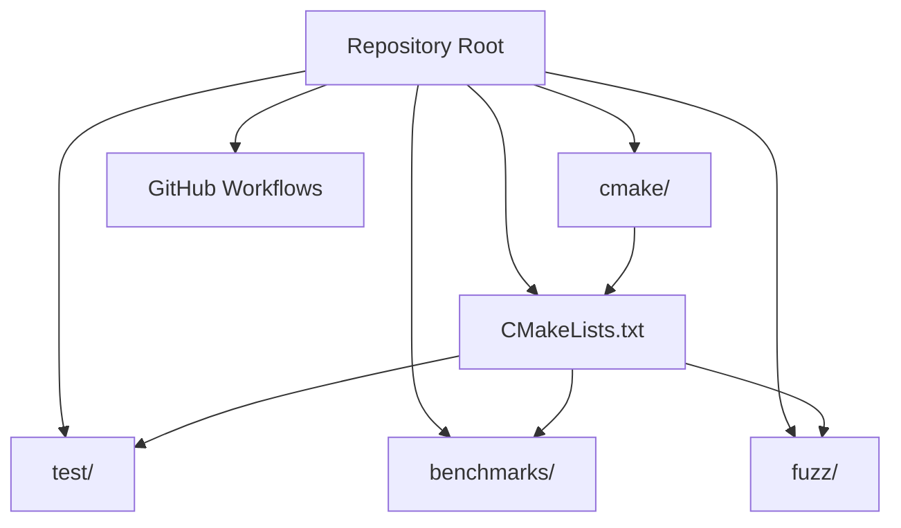
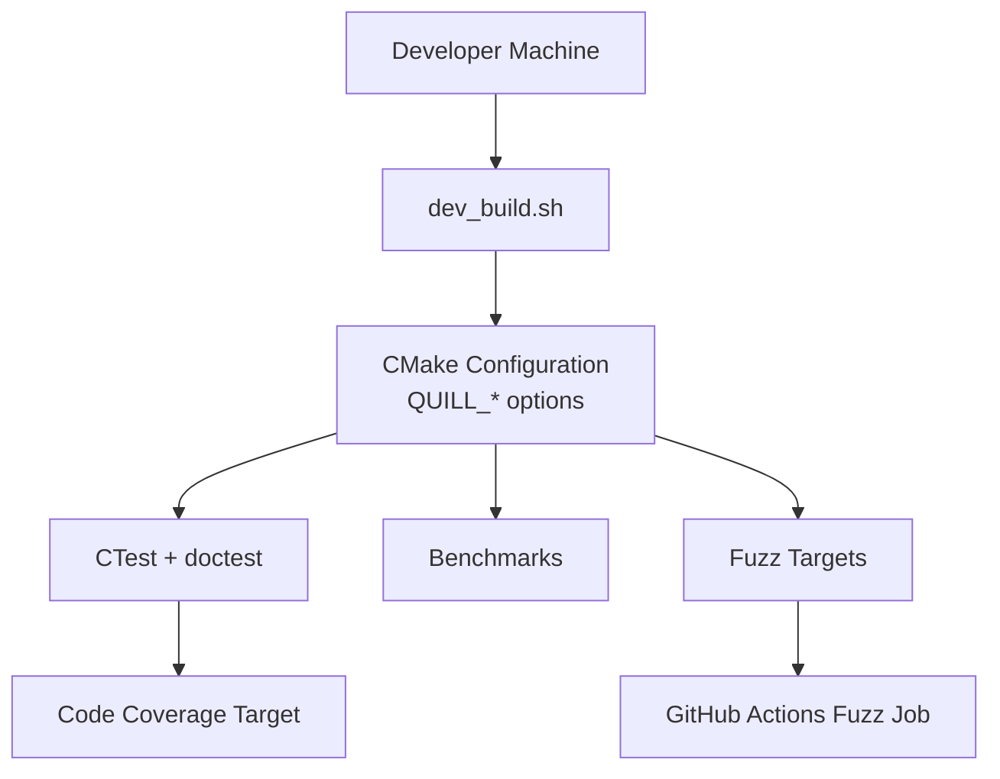
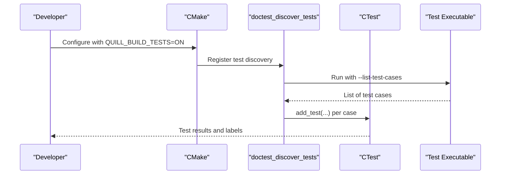
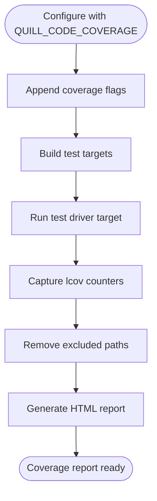
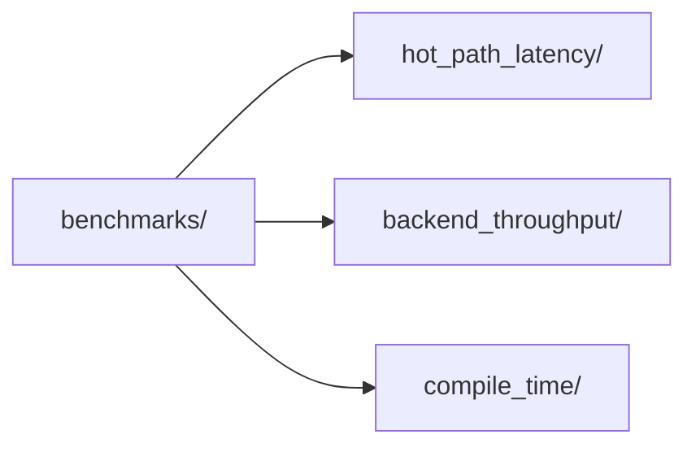
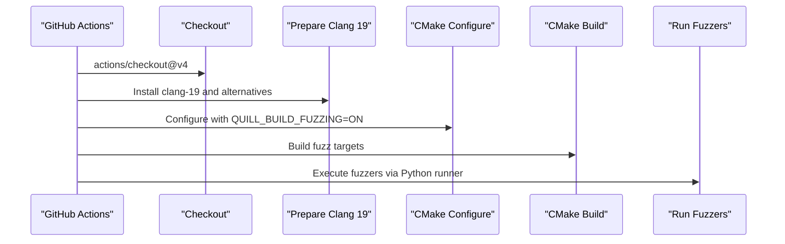
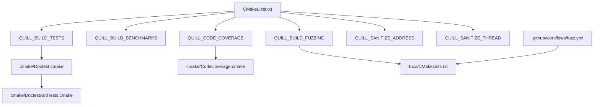

# Quality Assurance Processes

<cite>
**Referenced Files in This Document**
- [.clang-format](file://.clang-format)
- [CMakeLists.txt](file://CMakeLists.txt)
- [cmake/CodeCoverage.cmake](file://cmake/CodeCoverage.cmake)
- [cmake/Doctest.cmake](file://cmake/Doctest.cmake)
- [cmake/DoctestAddTests.cmake](file://cmake/DoctestAddTests.cmake)
- [.github/workflows/fuzz.yml](file://.github/workflows/fuzz.yml)
- [dev_build.sh](file://dev_build.sh)
- [fuzz/CMakeLists.txt](file://fuzz/CMakeLists.txt)
- [benchmarks/CMakeLists.txt](file://benchmarks/CMakeLists.txt)
- [test/CMakeLists.txt](file://test/CMakeLists.txt)
</cite>

## Table of Contents
1. [Introduction](#introduction)
2. [Project Structure](#project-structure)
3. [Core Components](#core-components)
4. [Architecture Overview](#architecture-overview)
5. [Detailed Component Analysis](#detailed-component-analysis)
6. [Dependency Analysis](#dependency-analysis)
7. [Performance Considerations](#performance-considerations)
8. [Troubleshooting Guide](#troubleshooting-guide)
9. [Conclusion](#conclusion)
10. [Appendices](#appendices)

## Introduction
This document describes the quality assurance processes and continuous integration practices for Quill. It covers automated testing, code coverage analysis, static analysis and formatting, performance benchmarking, fuzzing, and developer workflows. The goal is to provide a practical guide for contributors to understand how quality is ensured and how to maintain high standards across the project.

## Project Structure
Quill’s quality pipeline is primarily driven by CMake targets and GitHub Actions. The repository organizes QA artifacts into dedicated directories:
- Tests: unit and integration tests under test/.
- Benchmarks: latency, throughput, and compile-time performance under benchmarks/.
- Fuzzing: libFuzzer-based fuzz targets under fuzz/.
- CMake modules: reusable logic for coverage, test discovery, and utilities under cmake/.

**Diagram sources**
- [CMakeLists.txt](file://CMakeLists.txt)
- [test/CMakeLists.txt](file://test/CMakeLists.txt)
- [benchmarks/CMakeLists.txt](file://benchmarks/CMakeLists.txt)
- [fuzz/CMakeLists.txt](file://fuzz/CMakeLists.txt)

**Section sources**
- [CMakeLists.txt](file://CMakeLists.txt)
- [test/CMakeLists.txt](file://test/CMakeLists.txt)
- [benchmarks/CMakeLists.txt](file://benchmarks/CMakeLists.txt)
- [fuzz/CMakeLists.txt](file://fuzz/CMakeLists.txt)

## Core Components
- Automated testing with doctest and CTest:
  - doctest_discover_tests integrates with CTest to discover and register tests dynamically.
  - Tests are conditionally enabled via QUILL_BUILD_TESTS and CMake’s enable_testing().
- Code coverage:
  - CodeCoverage.cmake provides a reusable target to generate lcov reports when QUILL_CODE_COVERAGE is enabled.
- Static analysis and formatting:
  - .clang-format enforces consistent formatting across the codebase.
- Performance benchmarking:
  - Benchmarks are organized under benchmarks/ and built when QUILL_BUILD_BENCHMARKS is enabled.
- Fuzzing:
  - Fuzz targets are built when QUILL_BUILD_FUZZING is enabled and executed in CI via .github/workflows/fuzz.yml.

**Section sources**
- [cmake/Doctest.cmake](file://cmake/Doctest.cmake)
- [cmake/DoctestAddTests.cmake](file://cmake/DoctestAddTests.cmake)
- [CMakeLists.txt](file://CMakeLists.txt)
- [cmake/CodeCoverage.cmake](file://cmake/CodeCoverage.cmake)
- [.clang-format](file://.clang-format)
- [benchmarks/CMakeLists.txt](file://benchmarks/CMakeLists.txt)
- [fuzz/CMakeLists.txt](file://fuzz/CMakeLists.txt)
- [.github/workflows/fuzz.yml](file://.github/workflows/fuzz.yml)

## Architecture Overview
The QA architecture combines local developer workflows and CI-driven automation:
- Local development: dev_build.sh configures a comprehensive Debug build with examples, tests, benchmarks, and compile_commands.json export for editor tooling.
- CI: fuzz.yml builds and runs fuzzers with Clang 19, enabling reproducible fuzzing environments.
- CMake orchestration: QUILL_BUILD_TESTS, QUILL_BUILD_BENCHMARKS, QUILL_BUILD_FUZZING, QUILL_CODE_COVERAGE, and sanitizers are toggled via CMake options.

**Diagram sources**
- [dev_build.sh](file://dev_build.sh)
- [CMakeLists.txt](file://CMakeLists.txt)
- [cmake/Doctest.cmake](file://cmake/Doctest.cmake)
- [cmake/DoctestAddTests.cmake](file://cmake/DoctestAddTests.cmake)
- [cmake/CodeCoverage.cmake](file://cmake/CodeCoverage.cmake)
- [benchmarks/CMakeLists.txt](file://benchmarks/CMakeLists.txt)
- [fuzz/CMakeLists.txt](file://fuzz/CMakeLists.txt)
- [.github/workflows/fuzz.yml](file://.github/workflows/fuzz.yml)

## Detailed Component Analysis

### Automated Testing Pipeline
- Test discovery and registration:
  - doctest_discover_tests parses test executables to list test cases and registers them with CTest.
  - It supports JUnit XML output via reporter flags and allows adding labels and properties per test.
- Enabling tests:
  - QUILL_BUILD_TESTS triggers enable_testing() and includes the test subdirectory.
- Developer ergonomics:
  - dev_build.sh enables QUILL_BUILD_TESTS and builds the test targets for interactive runs.

**Diagram sources**
- [cmake/Doctest.cmake](file://cmake/Doctest.cmake)
- [cmake/DoctestAddTests.cmake](file://cmake/DoctestAddTests.cmake)
- [CMakeLists.txt](file://CMakeLists.txt)

**Section sources**
- [cmake/Doctest.cmake](file://cmake/Doctest.cmake)
- [cmake/DoctestAddTests.cmake](file://cmake/DoctestAddTests.cmake)
- [CMakeLists.txt](file://CMakeLists.txt)
- [dev_build.sh](file://dev_build.sh)

### Code Coverage Analysis
- Coverage target:
  - CodeCoverage.cmake defines a SETUP_TARGET_FOR_COVERAGE macro to generate lcov reports and HTML output.
  - It enforces debug flags and excludes non-source directories from coverage.
- Enabling coverage:
  - QUILL_CODE_COVERAGE appends coverage-related flags to the compiler and linker.
- Reporting:
  - The coverage target cleans counters, runs the test driver, captures lcov data, removes excluded paths, and generates an HTML report.

**Diagram sources**
- [cmake/CodeCoverage.cmake](file://cmake/CodeCoverage.cmake)
- [CMakeLists.txt](file://CMakeLists.txt)

**Section sources**
- [cmake/CodeCoverage.cmake](file://cmake/CodeCoverage.cmake)
- [CMakeLists.txt](file://CMakeLists.txt)

### Static Analysis and Formatting
- Formatting:
  - .clang-format defines formatting rules (indentation, column limits, standards) applied consistently across the codebase.
- Static analysis:
  - No dedicated .clang-tidy configuration is present in the repository. Contributors should run clang-tidy locally if desired, but it is not enforced by CI.

**Section sources**
- [.clang-format](file://.clang-format)

### Performance Benchmarking
- Benchmark suites:
  - Hot-path latency, backend throughput, and compile-time benchmarks are organized under benchmarks/.
- Building benchmarks:
  - QUILL_BUILD_BENCHMARKS enables building the benchmarks subdirectories.
- Monitoring:
  - Scripts for chart generation exist under scripts/, indicating intent to track and visualize performance metrics.

**Diagram sources**
- [benchmarks/CMakeLists.txt](file://benchmarks/CMakeLists.txt)

**Section sources**
- [benchmarks/CMakeLists.txt](file://benchmarks/CMakeLists.txt)

### Fuzzing Integration
- Fuzzer targets:
  - fuzz/CMakeLists.txt defines multiple fuzzers linked against the quill library with sanitizer flags.
- CI fuzzing:
  - .github/workflows/fuzz.yml configures a job to install Clang 19, configure with QUILL_BUILD_FUZZING, build, and run fuzzers for a fixed duration.

**Diagram sources**
- [.github/workflows/fuzz.yml](file://.github/workflows/fuzz.yml)
- [fuzz/CMakeLists.txt](file://fuzz/CMakeLists.txt)

**Section sources**
- [.github/workflows/fuzz.yml](file://.github/workflows/fuzz.yml)
- [fuzz/CMakeLists.txt](file://fuzz/CMakeLists.txt)

### Developer Workflow and Build Verification
- Comprehensive development build:
  - dev_build.sh configures a Debug build with examples, tests, benchmarks, and exports compile_commands.json for editor tooling.
- Build verification:
  - CMake enforces C++17 minimum and validates sanitizer and fuzzing prerequisites.
  - Sanitizer options (AddressSanitizer, ThreadSanitizer) can be toggled via QUILL_SANITIZE_ADDRESS and QUILL_SANITIZE_THREAD.

**Section sources**
- [dev_build.sh](file://dev_build.sh)
- [CMakeLists.txt](file://CMakeLists.txt)

## Dependency Analysis
Key QA-related dependencies and their relationships:
- CMake options drive inclusion of tests, benchmarks, fuzzing, and coverage.
- doctest discovery depends on test executables; CTest consumes discovered tests.
- Coverage target depends on lcov/genhtml availability and test driver exit code semantics.
- Fuzzing depends on Clang and sanitizer flags; CI installs Clang 19.

**Diagram sources**
- [CMakeLists.txt](file://CMakeLists.txt)
- [cmake/Doctest.cmake](file://cmake/Doctest.cmake)
- [cmake/DoctestAddTests.cmake](file://cmake/DoctestAddTests.cmake)
- [cmake/CodeCoverage.cmake](file://cmake/CodeCoverage.cmake)
- [fuzz/CMakeLists.txt](file://fuzz/CMakeLists.txt)
- [.github/workflows/fuzz.yml](file://.github/workflows/fuzz.yml)

**Section sources**
- [CMakeLists.txt](file://CMakeLists.txt)
- [cmake/Doctest.cmake](file://cmake/Doctest.cmake)
- [cmake/DoctestAddTests.cmake](file://cmake/DoctestAddTests.cmake)
- [cmake/CodeCoverage.cmake](file://cmake/CodeCoverage.cmake)
- [fuzz/CMakeLists.txt](file://fuzz/CMakeLists.txt)
- [.github/workflows/fuzz.yml](file://.github/workflows/fuzz.yml)

## Performance Considerations
- Benchmark suites:
  - Hot-path latency and backend throughput benchmarks are structured for repeatable measurements.
- Developer visibility:
  - dev_build.sh builds benchmarks alongside tests for local iteration.
- Reporting:
  - scripts/ contains helpers for generating chart URLs, supporting visualization of performance trends.

**Section sources**
- [benchmarks/CMakeLists.txt](file://benchmarks/CMakeLists.txt)
- [dev_build.sh](file://dev_build.sh)

## Troubleshooting Guide
- Coverage target not available:
  - Ensure QUILL_CODE_COVERAGE is enabled and the build type is Coverage. The coverage target is only active in coverage builds.
- lcov/genhtml missing:
  - The coverage target aborts if lcov or genhtml are not found. Install lcov and genhtml to generate reports.
- Sanitizer failures:
  - AddressSanitizer and ThreadSanitizer require compatible compiler flags. Verify QUILL_SANITIZE_ADDRESS and QUILL_SANITIZE_THREAD settings.
- Fuzzing prerequisites:
  - QUILL_BUILD_FUZZING requires a Clang compiler. CI installs Clang 19; locally ensure Clang is available.
- Test discovery issues:
  - doctest_discover_tests requires the test executable to exit with zero even on failures. Ensure the test driver adheres to this contract.

**Section sources**
- [cmake/CodeCoverage.cmake](file://cmake/CodeCoverage.cmake)
- [CMakeLists.txt](file://CMakeLists.txt)
- [cmake/Doctest.cmake](file://cmake/Doctest.cmake)
- [cmake/DoctestAddTests.cmake](file://cmake/DoctestAddTests.cmake)
- [fuzz/CMakeLists.txt](file://fuzz/CMakeLists.txt)
- [.github/workflows/fuzz.yml](file://.github/workflows/fuzz.yml)

## Conclusion
Quill’s quality assurance framework integrates CMake-driven test discovery, coverage analysis, performance benchmarks, and fuzzing. CI automates fuzzing with a controlled compiler environment, while developers benefit from a comprehensive local build script and formatting standards. Extending static analysis and documentation checks would further strengthen the pipeline.

## Appendices
- Best practices:
  - Keep QUILL_BUILD_TESTS enabled for local runs; use QUILL_CODE_COVERAGE for PRs targeting improved coverage.
  - Prefer Clang for fuzzing and sanitizer-enabled builds; ensure consistent formatting with .clang-format.
  - Use dev_build.sh for a full development environment and iterate on benchmarks locally before CI runs.
- Continuous improvement:
  - Consider adding a dedicated CodeQL workflow and .clang-tidy configuration for proactive static analysis.
  - Introduce codecov integration in CI to publish coverage reports and enforce coverage thresholds.