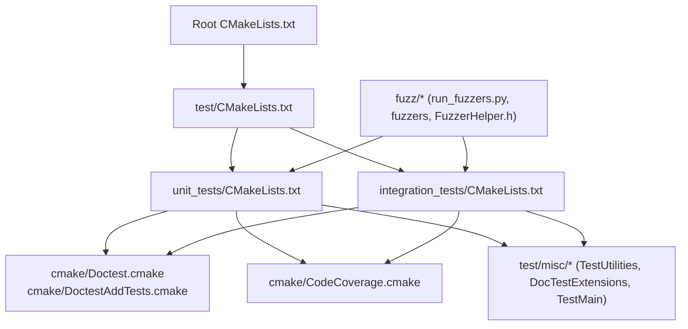
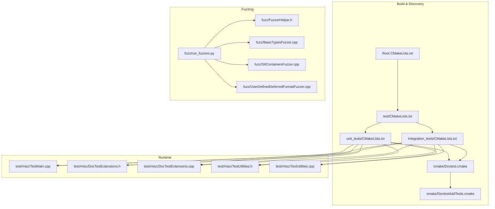
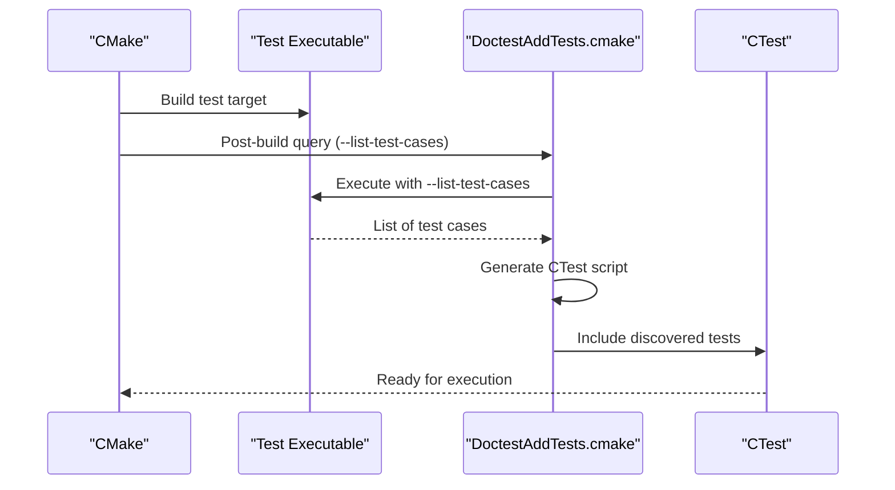
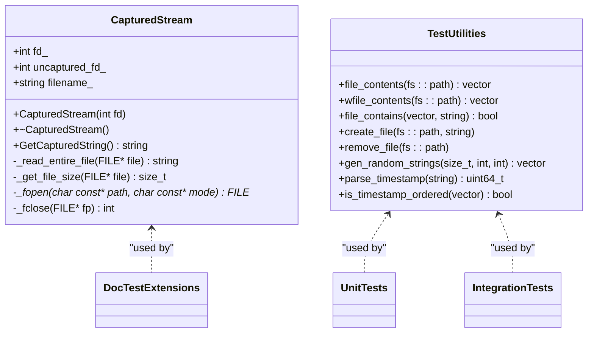
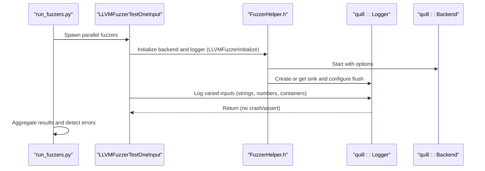
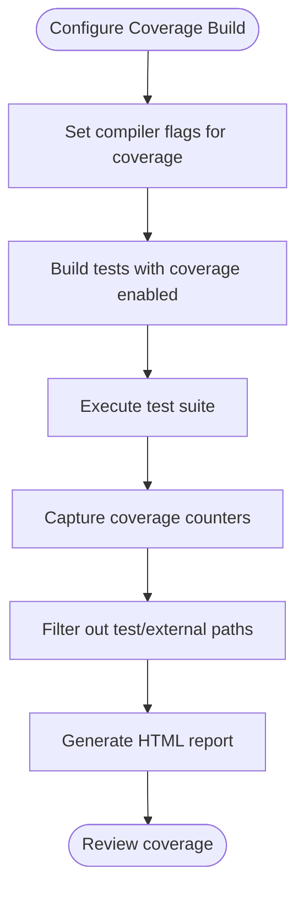
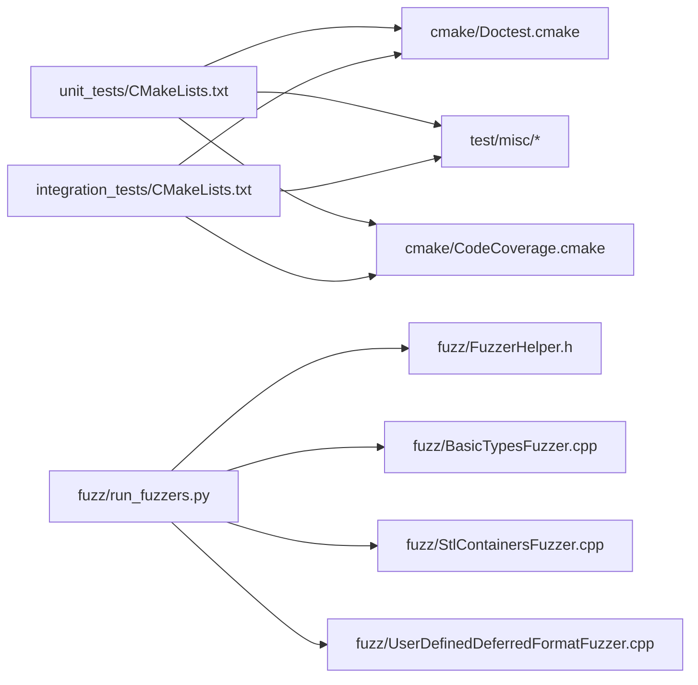

# Testing & Quality Assurance

<cite>
**Referenced Files in This Document**
- [CMakeLists.txt](file://CMakeLists.txt)
- [test/CMakeLists.txt](file://test/CMakeLists.txt)
- [test/unit_tests/CMakeLists.txt](file://test/unit_tests/CMakeLists.txt)
- [test/integration_tests/CMakeLists.txt](file://test/integration_tests/CMakeLists.txt)
- [cmake/Doctest.cmake](file://cmake/Doctest.cmake)
- [cmake/DoctestAddTests.cmake](file://cmake/DoctestAddTests.cmake)
- [cmake/CodeCoverage.cmake](file://cmake/CodeCoverage.cmake)
- [test/misc/TestMain.cpp](file://test/misc/TestMain.cpp)
- [test/misc/DocTestExtensions.h](file://test/misc/DocTestExtensions.h)
- [test/misc/DocTestExtensions.cpp](file://test/misc/DocTestExtensions.cpp)
- [test/misc/TestUtilities.h](file://test/misc/TestUtilities.h)
- [test/misc/TestUtilities.cpp](file://test/misc/TestUtilities.cpp)
- [fuzz/run_fuzzers.py](file://fuzz/run_fuzzers.py)
- [fuzz/FuzzerHelper.h](file://fuzz/FuzzerHelper.h)
- [fuzz/BasicTypesFuzzer.cpp](file://fuzz/BasicTypesFuzzer.cpp)
- [fuzz/StlContainersFuzzer.cpp](file://fuzz/StlContainersFuzzer.cpp)
- [fuzz/UserDefinedDeferredFormatFuzzer.cpp](file://fuzz/UserDefinedDeferredFormatFuzzer.cpp)
</cite>

## Table of Contents
1. [Introduction](#introduction)
2. [Project Structure](#project-structure)
3. [Core Components](#core-components)
4. [Architecture Overview](#architecture-overview)
5. [Detailed Component Analysis](#detailed-component-analysis)
6. [Dependency Analysis](#dependency-analysis)
7. [Performance Considerations](#performance-considerations)
8. [Troubleshooting Guide](#troubleshooting-guide)
9. [Conclusion](#conclusion)
10. [Appendices](#appendices)

## Introduction
This document describes Quill’s comprehensive testing and quality assurance framework. It covers:
- Unit testing with the doctest framework and custom extensions
- Integration testing for multi-threaded, performance-sensitive, and edge-case scenarios
- Fuzz testing with dedicated fuzzers, input extraction helpers, and security-focused sanitizers
- Testing infrastructure including utilities, mocks, and automated test discovery
- Quality assurance processes including code coverage, static analysis integration, and CI practices
- Best practices for designing effective tests, performance regression testing, and cross-platform compatibility

## Project Structure
Quill organizes tests into:
- Unit tests: focused on individual components and core utilities
- Integration tests: exercising end-to-end logging pipelines, sinks, queues, and concurrency
- Fuzzing: targeted fuzzers for basic types, STL containers, and user-defined deferred-format types
- Testing infrastructure: doctest integration, custom assertions, stream capture, and test utilities

**Diagram sources**
- [CMakeLists.txt](file://CMakeLists.txt)
- [test/CMakeLists.txt](file://test/CMakeLists.txt)
- [test/unit_tests/CMakeLists.txt](file://test/unit_tests/CMakeLists.txt)
- [test/integration_tests/CMakeLists.txt](file://test/integration_tests/CMakeLists.txt)
- [cmake/Doctest.cmake](file://cmake/Doctest.cmake)
- [cmake/DoctestAddTests.cmake](file://cmake/DoctestAddTests.cmake)
- [cmake/CodeCoverage.cmake](file://cmake/CodeCoverage.cmake)
- [test/misc/TestMain.cpp](file://test/misc/TestMain.cpp)
- [test/misc/DocTestExtensions.h](file://test/misc/DocTestExtensions.h)
- [test/misc/DocTestExtensions.cpp](file://test/misc/DocTestExtensions.cpp)
- [test/misc/TestUtilities.h](file://test/misc/TestUtilities.h)
- [test/misc/TestUtilities.cpp](file://test/misc/TestUtilities.cpp)
- [fuzz/run_fuzzers.py](file://fuzz/run_fuzzers.py)
- [fuzz/FuzzerHelper.h](file://fuzz/FuzzerHelper.h)

**Section sources**
- [test/CMakeLists.txt](file://test/CMakeLists.txt)
- [test/unit_tests/CMakeLists.txt](file://test/unit_tests/CMakeLists.txt)
- [test/integration_tests/CMakeLists.txt](file://test/integration_tests/CMakeLists.txt)

## Core Components
- Doctest integration: automatic test discovery and CTest registration with sanitizer-aware environment propagation
- Custom test utilities: file I/O helpers, timestamp ordering checks, and stream capture for stdout/stderr
- Fuzzing harnesses: reusable initialization, logging setup, and per-fuzzer input extraction
- Code coverage: configurable coverage build and reporting targets

Key capabilities:
- Automatic test case enumeration and per-case CTest registration
- Sanitizer-friendly execution environment for address and undefined-behavior detection
- Cross-platform stream capture for deterministic test output validation
- Fuzzer orchestration with parallel execution, RSS limits, and error pattern detection

**Section sources**
- [cmake/Doctest.cmake](file://cmake/Doctest.cmake)
- [cmake/DoctestAddTests.cmake](file://cmake/DoctestAddTests.cmake)
- [test/misc/DocTestExtensions.h](file://test/misc/DocTestExtensions.h)
- [test/misc/DocTestExtensions.cpp](file://test/misc/DocTestExtensions.cpp)
- [test/misc/TestUtilities.h](file://test/misc/TestUtilities.h)
- [test/misc/TestUtilities.cpp](file://test/misc/TestUtilities.cpp)
- [cmake/CodeCoverage.cmake](file://cmake/CodeCoverage.cmake)

## Architecture Overview
The testing architecture integrates CMake, doctest, and platform-specific utilities to deliver robust, portable, and automated testing.

**Diagram sources**
- [CMakeLists.txt](file://CMakeLists.txt)
- [test/CMakeLists.txt](file://test/CMakeLists.txt)
- [test/unit_tests/CMakeLists.txt](file://test/unit_tests/CMakeLists.txt)
- [test/integration_tests/CMakeLists.txt](file://test/integration_tests/CMakeLists.txt)
- [cmake/Doctest.cmake](file://cmake/Doctest.cmake)
- [cmake/DoctestAddTests.cmake](file://cmake/DoctestAddTests.cmake)
- [test/misc/TestMain.cpp](file://test/misc/TestMain.cpp)
- [test/misc/DocTestExtensions.h](file://test/misc/DocTestExtensions.h)
- [test/misc/DocTestExtensions.cpp](file://test/misc/DocTestExtensions.cpp)
- [test/misc/TestUtilities.h](file://test/misc/TestUtilities.h)
- [test/misc/TestUtilities.cpp](file://test/misc/TestUtilities.cpp)
- [fuzz/run_fuzzers.py](file://fuzz/run_fuzzers.py)
- [fuzz/FuzzerHelper.h](file://fuzz/FuzzerHelper.h)
- [fuzz/BasicTypesFuzzer.cpp](file://fuzz/BasicTypesFuzzer.cpp)
- [fuzz/StlContainersFuzzer.cpp](file://fuzz/StlContainersFuzzer.cpp)
- [fuzz/UserDefinedDeferredFormatFuzzer.cpp](file://fuzz/UserDefinedDeferredFormatFuzzer.cpp)

## Detailed Component Analysis

### Doctest Integration and Test Discovery
- Automatic discovery: CMake invokes a script to list test cases and generate per-case CTest entries
- Sanitizer propagation: when address sanitization is enabled, environment variables are injected into CTest runs
- JUnit output: optional JUnit XML reporting for CI consumption

**Diagram sources**
- [cmake/Doctest.cmake](file://cmake/Doctest.cmake)
- [cmake/DoctestAddTests.cmake](file://cmake/DoctestAddTests.cmake)

**Section sources**
- [cmake/Doctest.cmake](file://cmake/Doctest.cmake)
- [cmake/DoctestAddTests.cmake](file://cmake/DoctestAddTests.cmake)
- [test/unit_tests/CMakeLists.txt](file://test/unit_tests/CMakeLists.txt)
- [test/integration_tests/CMakeLists.txt](file://test/integration_tests/CMakeLists.txt)

### Test Utilities and Assertions
- File utilities: read file contents, search for substrings, create/remove files, generate random strings
- Timestamp utilities: parse timestamps and verify monotonic ordering
- Stream capture: redirect stdout/stderr to files and retrieve captured content deterministically
- Custom assertions: string comparison helpers for narrow and wide character strings

**Diagram sources**
- [test/misc/DocTestExtensions.h](file://test/misc/DocTestExtensions.h)
- [test/misc/DocTestExtensions.cpp](file://test/misc/DocTestExtensions.cpp)
- [test/misc/TestUtilities.h](file://test/misc/TestUtilities.h)
- [test/misc/TestUtilities.cpp](file://test/misc/TestUtilities.cpp)

**Section sources**
- [test/misc/DocTestExtensions.h](file://test/misc/DocTestExtensions.h)
- [test/misc/DocTestExtensions.cpp](file://test/misc/DocTestExtensions.cpp)
- [test/misc/TestUtilities.h](file://test/misc/TestUtilities.h)
- [test/misc/TestUtilities.cpp](file://test/misc/TestUtilities.cpp)

### Fuzzing Infrastructure and Harnesses
- Centralized initialization: backend and logger setup, immediate flush thresholds, binary/text modes
- Fuzzer orchestrator: parallel execution, RSS limits, iteration/time limits, error pattern detection
- Fuzzers:
  - BasicTypesFuzzer: exercises primitive types, format specifiers, and boundary values
  - StlContainersFuzzer: validates container logging and nested structures
  - UserDefinedDeferredFormatFuzzer: tests user-defined types with deferred formatting and alignment/padding edge cases

**Diagram sources**
- [fuzz/run_fuzzers.py](file://fuzz/run_fuzzers.py)
- [fuzz/FuzzerHelper.h](file://fuzz/FuzzerHelper.h)
- [fuzz/BasicTypesFuzzer.cpp](file://fuzz/BasicTypesFuzzer.cpp)
- [fuzz/StlContainersFuzzer.cpp](file://fuzz/StlContainersFuzzer.cpp)
- [fuzz/UserDefinedDeferredFormatFuzzer.cpp](file://fuzz/UserDefinedDeferredFormatFuzzer.cpp)

**Section sources**
- [fuzz/run_fuzzers.py](file://fuzz/run_fuzzers.py)
- [fuzz/FuzzerHelper.h](file://fuzz/FuzzerHelper.h)
- [fuzz/BasicTypesFuzzer.cpp](file://fuzz/BasicTypesFuzzer.cpp)
- [fuzz/StlContainersFuzzer.cpp](file://fuzz/StlContainersFuzzer.cpp)
- [fuzz/UserDefinedDeferredFormatFuzzer.cpp](file://fuzz/UserDefinedDeferredFormatFuzzer.cpp)

### Code Coverage
- Coverage build type enables profiling and test-coverage flags
- Custom target aggregates coverage counters and generates HTML reports
- Excludes tests and external paths by default for clarity

**Diagram sources**
- [cmake/CodeCoverage.cmake](file://cmake/CodeCoverage.cmake)

**Section sources**
- [cmake/CodeCoverage.cmake](file://cmake/CodeCoverage.cmake)

## Dependency Analysis
- Unit and integration tests depend on:
  - Doctest discovery and CTest registration
  - Test utilities for file and stream operations
  - Sanitizer environment propagation when enabled
- Fuzzers depend on:
  - Centralized initialization header for backend/logger setup
  - Fuzzer orchestrator for parallel execution and error detection

**Diagram sources**
- [test/unit_tests/CMakeLists.txt](file://test/unit_tests/CMakeLists.txt)
- [test/integration_tests/CMakeLists.txt](file://test/integration_tests/CMakeLists.txt)
- [cmake/Doctest.cmake](file://cmake/Doctest.cmake)
- [cmake/CodeCoverage.cmake](file://cmake/CodeCoverage.cmake)
- [test/misc/TestUtilities.h](file://test/misc/TestUtilities.h)
- [test/misc/DocTestExtensions.h](file://test/misc/DocTestExtensions.h)
- [fuzz/run_fuzzers.py](file://fuzz/run_fuzzers.py)
- [fuzz/FuzzerHelper.h](file://fuzz/FuzzerHelper.h)
- [fuzz/BasicTypesFuzzer.cpp](file://fuzz/BasicTypesFuzzer.cpp)
- [fuzz/StlContainersFuzzer.cpp](file://fuzz/StlContainersFuzzer.cpp)
- [fuzz/UserDefinedDeferredFormatFuzzer.cpp](file://fuzz/UserDefinedDeferredFormatFuzzer.cpp)

**Section sources**
- [test/unit_tests/CMakeLists.txt](file://test/unit_tests/CMakeLists.txt)
- [test/integration_tests/CMakeLists.txt](file://test/integration_tests/CMakeLists.txt)
- [cmake/Doctest.cmake](file://cmake/Doctest.cmake)
- [cmake/CodeCoverage.cmake](file://cmake/CodeCoverage.cmake)
- [fuzz/run_fuzzers.py](file://fuzz/run_fuzzers.py)
- [fuzz/FuzzerHelper.h](file://fuzz/FuzzerHelper.h)

## Performance Considerations
- Fuzzing throughput: orchestrator measures runs per second and total runtime; tune duration/iterations per fuzzer
- Memory limits: RSS cap prevents runaway memory growth during fuzzing
- Immediate flush thresholds: reduce backlog pressure in fuzzers to maintain steady throughput
- Timestamp ordering: utilities validate monotonicity to catch regressions in ordering assumptions

[No sources needed since this section provides general guidance]

## Troubleshooting Guide
Common issues and remedies:
- Test discovery failures: ensure the test executable exists and supports listing test cases
- Sanitizer errors: review captured stderr/stdout for ASan/UBSan summaries and stack traces
- Stream capture failures: verify temporary file creation permissions and platform-specific APIs
- Fuzzer timeouts: increase duration or adjust RSS limits; inspect error patterns for hangs vs crashes
- Coverage reports missing: confirm coverage build type and that test executables exit with zero status

**Section sources**
- [cmake/DoctestAddTests.cmake](file://cmake/DoctestAddTests.cmake)
- [test/misc/DocTestExtensions.cpp](file://test/misc/DocTestExtensions.cpp)
- [fuzz/run_fuzzers.py](file://fuzz/run_fuzzers.py)
- [cmake/CodeCoverage.cmake](file://cmake/CodeCoverage.cmake)

## Conclusion
Quill’s testing and QA framework combines automatic test discovery, robust utilities, and fuzzing to ensure correctness, performance, and resilience across platforms. The modular design allows incremental improvements and easy integration into CI pipelines.

[No sources needed since this section summarizes without analyzing specific files]

## Appendices

### Writing Effective Tests
- Prefer small, isolated unit tests with deterministic inputs and verifiable outputs
- Use stream capture to assert console or file sink behavior
- Validate timestamp ordering for multi-threaded scenarios
- Leverage random string generation for edge-case coverage

**Section sources**
- [test/misc/DocTestExtensions.h](file://test/misc/DocTestExtensions.h)
- [test/misc/DocTestExtensions.cpp](file://test/misc/DocTestExtensions.cpp)
- [test/misc/TestUtilities.cpp](file://test/misc/TestUtilities.cpp)

### Performance Regression Testing
- Measure runs-per-second for fuzzers and flag drops
- Track coverage deltas against baseline commits
- Use sanitizer-enabled builds to catch performance-related UB

**Section sources**
- [fuzz/run_fuzzers.py](file://fuzz/run_fuzzers.py)
- [cmake/CodeCoverage.cmake](file://cmake/CodeCoverage.cmake)

### Cross-Platform Compatibility
- Validate stream capture behavior on Windows and POSIX
- Confirm timestamp parsing and filesystem path handling across platforms
- Test with different compilers and sanitizers

**Section sources**
- [test/misc/DocTestExtensions.cpp](file://test/misc/DocTestExtensions.cpp)
- [test/misc/TestUtilities.cpp](file://test/misc/TestUtilities.cpp)