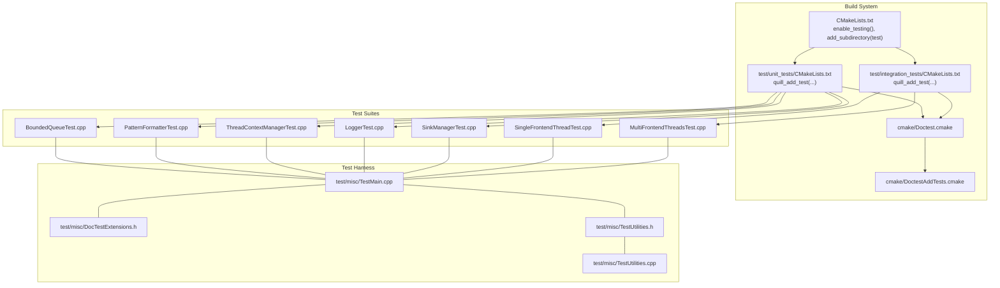
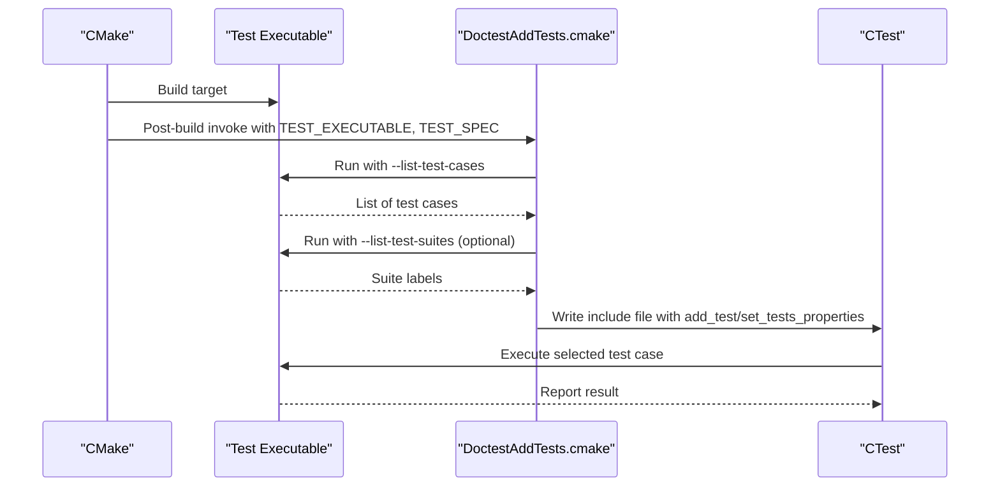
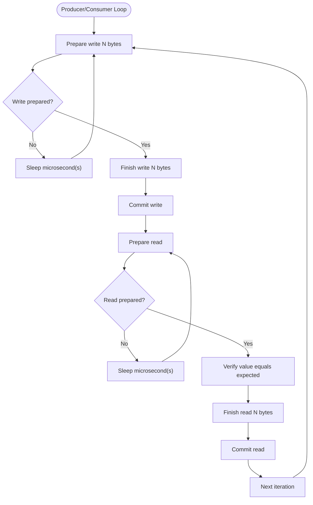
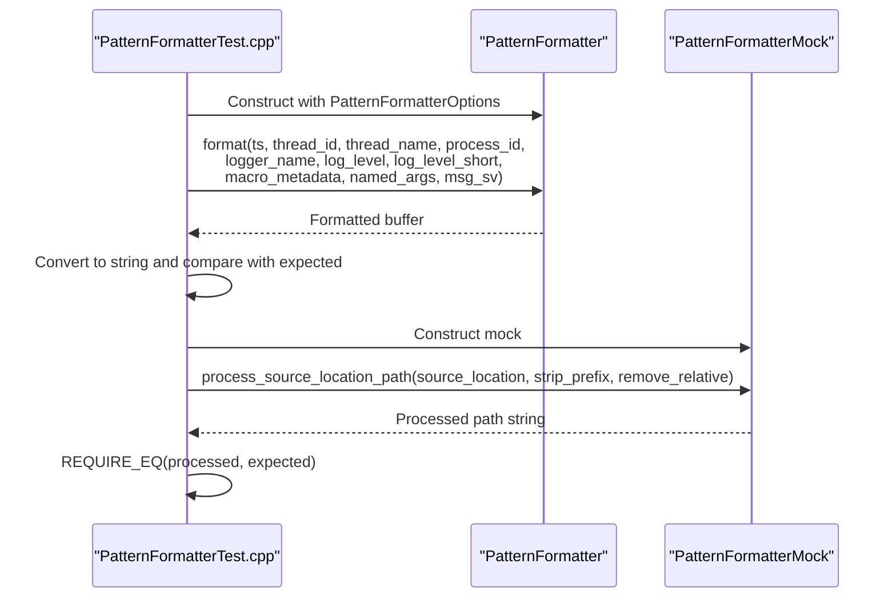
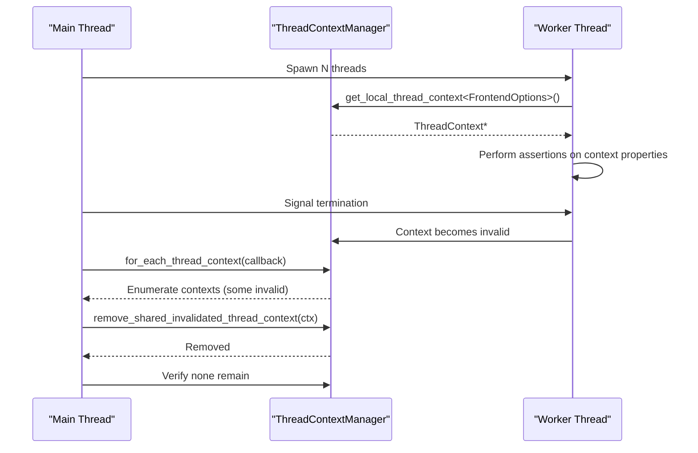
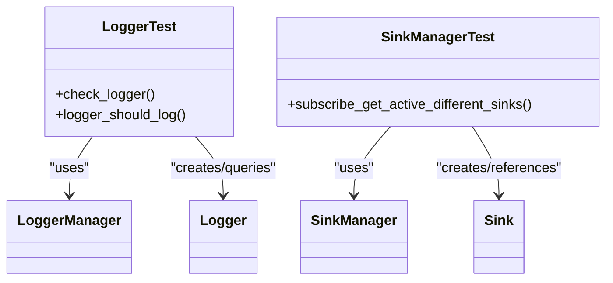
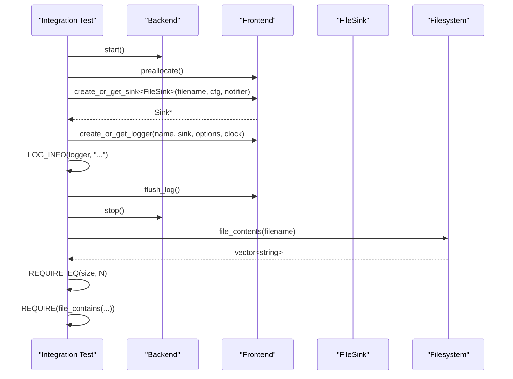
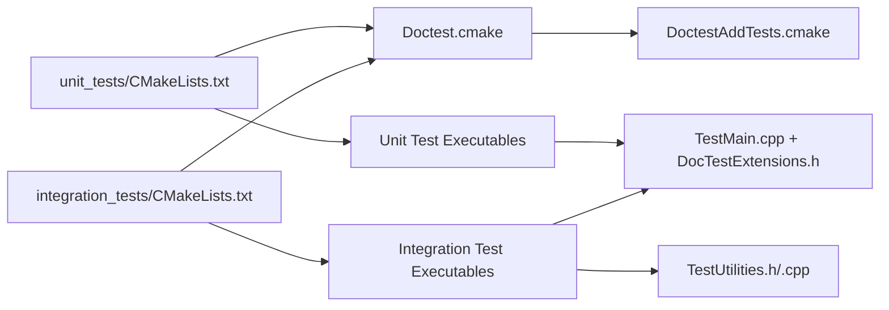

# Unit Testing

<cite>
**Referenced Files in This Document**
- [CMakeLists.txt](file://CMakeLists.txt)
- [Doctest.cmake](file://cmake/Doctest.cmake)
- [DoctestAddTests.cmake](file://cmake/DoctestAddTests.cmake)
- [TestMain.cpp](file://test/misc/TestMain.cpp)
- [DocTestExtensions.h](file://test/misc/DocTestExtensions.h)
- [TestUtilities.h](file://test/misc/TestUtilities.h)
- [TestUtilities.cpp](file://test/misc/TestUtilities.cpp)
- [unit_tests/CMakeLists.txt](file://test/unit_tests/CMakeLists.txt)
- [integration_tests/CMakeLists.txt](file://test/integration_tests/CMakeLists.txt)
- [BoundedQueueTest.cpp](file://test/unit_tests/BoundedQueueTest.cpp)
- [PatternFormatterTest.cpp](file://test/unit_tests/PatternFormatterTest.cpp)
- [ThreadContextManagerTest.cpp](file://test/unit_tests/ThreadContextManagerTest.cpp)
- [LoggerTest.cpp](file://test/unit_tests/LoggerTest.cpp)
- [SinkManagerTest.cpp](file://test/unit_tests/SinkManagerTest.cpp)
- [SingleFrontendThreadTest.cpp](file://test/integration_tests/SingleFrontendThreadTest.cpp)
- [MultiFrontendThreadsTest.cpp](file://test/integration_tests/MultiFrontendThreadsTest.cpp)
</cite>

## Table of Contents
1. [Introduction](#introduction)
2. [Project Structure](#project-structure)
3. [Core Components](#core-components)
4. [Architecture Overview](#architecture-overview)
5. [Detailed Component Analysis](#detailed-component-analysis)
6. [Dependency Analysis](#dependency-analysis)
7. [Performance Considerations](#performance-considerations)
8. [Troubleshooting Guide](#troubleshooting-guide)
9. [Conclusion](#conclusion)
10. [Appendices](#appendices)

## Introduction
This document describes Quill’s unit and integration testing framework built on doctest. It explains how tests are structured, how doctest integrates with CMake for discovery and execution, and how to write reliable, maintainable tests for Quill’s core subsystems such as queues, formatters, loggers, sinks, and thread contexts. It also covers test utilities, assertion patterns, concurrency testing strategies, debugging techniques, and continuous integration setup.

## Project Structure
Quill organizes tests under the test directory:
- test/misc: Shared test harness, main entry, and utilities for doctest and file-based assertions.
- test/unit_tests: Unit tests for internal components (queues, formatters, managers, clocks).
- test/integration_tests: Integration tests exercising the full frontend/backend pipeline.

Key integration points:
- CMake enables testing and conditionally adds subdirectories for unit and integration tests.
- A reusable CMake function constructs test executables, links against the library, and registers doctest-based tests with CTest via a dedicated discovery script.
- The doctest discovery script enumerates test cases at build time and creates individual CTest tests.

**Diagram sources**
- [CMakeLists.txt:95-111](file://CMakeLists.txt#L95-L111)
- [unit_tests/CMakeLists.txt:1-83](file://test/unit_tests/CMakeLists.txt#L1-L83)
- [integration_tests/CMakeLists.txt:1-161](file://test/integration_tests/CMakeLists.txt#L1-L161)
- [Doctest.cmake:107-183](file://cmake/Doctest.cmake#L107-L183)
- [DoctestAddTests.cmake:27-120](file://cmake/DoctestAddTests.cmake#L27-L120)
- [TestMain.cpp:1-3](file://test/misc/TestMain.cpp#L1-L3)
- [DocTestExtensions.h:1-96](file://test/misc/DocTestExtensions.h#L1-L96)
- [TestUtilities.h:1-31](file://test/misc/TestUtilities.h#L1-L31)
- [TestUtilities.cpp:1-171](file://test/misc/TestUtilities.cpp#L1-L171)

**Section sources**
- [CMakeLists.txt:95-111](file://CMakeLists.txt#L95-L111)
- [unit_tests/CMakeLists.txt:1-83](file://test/unit_tests/CMakeLists.txt#L1-L83)
- [integration_tests/CMakeLists.txt:1-161](file://test/integration_tests/CMakeLists.txt#L1-L161)

## Core Components
- Doctest integration: A custom CMake function wraps doctest_discover_tests to register per-case CTest tests, optionally passing sanitizer environment variables.
- Test harness: A single-header define and a small main glue bring doctest into each test executable. Extensions provide convenience assertions and stream capture helpers.
- Utilities: File-based helpers read logs, search content, and validate ordering; additional helpers generate random strings and parse timestamps.

Key patterns:
- TEST_SUITE_BEGIN/TEST_CASE blocks organize unit tests.
- REQUIRE_* macros assert outcomes; custom REQUIRE_STREQ/REQUIRE_WSTREQ compare C-style strings and wide strings.
- CapturedStream captures stdout/stderr for assertions in sink/formatter tests.

**Section sources**
- [unit_tests/CMakeLists.txt:1-54](file://test/unit_tests/CMakeLists.txt#L1-L54)
- [integration_tests/CMakeLists.txt:1-57](file://test/integration_tests/CMakeLists.txt#L1-L57)
- [Doctest.cmake:107-183](file://cmake/Doctest.cmake#L107-L183)
- [DoctestAddTests.cmake:27-120](file://cmake/DoctestAddTests.cmake#L27-L120)
- [TestMain.cpp:1-3](file://test/misc/TestMain.cpp#L1-L3)
- [DocTestExtensions.h:12-96](file://test/misc/DocTestExtensions.h#L12-L96)
- [TestUtilities.h:16-31](file://test/misc/TestUtilities.h#L16-L31)
- [TestUtilities.cpp:20-171](file://test/misc/TestUtilities.cpp#L20-L171)

## Architecture Overview
The test architecture separates concerns:
- Build-time discovery: doctest_discover_tests runs the test binary with --list-test-cases and --list-test-suites to enumerate cases and labels.
- Per-case registration: The discovery script writes a CTest include file that adds each doctest test case as a separate CTest test, preserving working directory and optional properties.
- Execution: CTest executes each registered test case independently, enabling granular pass/fail reporting.

**Diagram sources**
- [Doctest.cmake:107-183](file://cmake/Doctest.cmake#L107-L183)
- [DoctestAddTests.cmake:27-120](file://cmake/DoctestAddTests.cmake#L27-L120)

## Detailed Component Analysis

### Unit Tests: Queues
- BoundedSPSCQueue: Validates read/write cycles, integer overflow behavior, and multithreaded producer/consumer scenarios. Uses REQUIRE_NE, REQUIRE, REQUIRE_EQ, and REQUIRE_FALSE to assert buffer states and values.
- Concurrency: Threads spin-wait with minimal sleeps while preparing reads/writes, asserting correctness across many iterations.

**Diagram sources**
- [BoundedQueueTest.cpp:90-140](file://test/unit_tests/BoundedQueueTest.cpp#L90-L140)

**Section sources**
- [BoundedQueueTest.cpp:15-146](file://test/unit_tests/BoundedQueueTest.cpp#L15-L146)

### Unit Tests: Formatters
- PatternFormatter: Exhaustively tests default and custom patterns, timestamp precision, source location path processing, and function name processing hooks. Uses REQUIRE_EQ for exact matches and REQUIRE_NE for substring containment.
- Mock subclass: A small mock exposes an internal method for targeted unit tests.

**Diagram sources**
- [PatternFormatterTest.cpp:20-556](file://test/unit_tests/PatternFormatterTest.cpp#L20-L556)

**Section sources**
- [PatternFormatterTest.cpp:12-556](file://test/unit_tests/PatternFormatterTest.cpp#L12-L556)

### Unit Tests: Thread Context Manager
- Validates lifecycle of thread contexts: creation, caching, validity checks, and cleanup of invalidated contexts across multiple threads.

**Diagram sources**
- [ThreadContextManagerTest.cpp:14-116](file://test/unit_tests/ThreadContextManagerTest.cpp#L14-L116)

**Section sources**
- [ThreadContextManagerTest.cpp:9-116](file://test/unit_tests/ThreadContextManagerTest.cpp#L9-L116)

### Unit Tests: Logger and Sink Manager
- Logger: Verifies defaults, formatter options propagation, clock source selection, and log level gating.
- SinkManager: Ensures singleton semantics and reuse of sinks by key, plus cleanup behavior.

**Diagram sources**
- [LoggerTest.cpp:14-83](file://test/unit_tests/LoggerTest.cpp#L14-L83)
- [SinkManagerTest.cpp:13-68](file://test/unit_tests/SinkManagerTest.cpp#L13-L68)

**Section sources**
- [LoggerTest.cpp:8-83](file://test/unit_tests/LoggerTest.cpp#L8-L83)
- [SinkManagerTest.cpp:7-68](file://test/unit_tests/SinkManagerTest.cpp#L7-L68)

### Integration Tests: Logging Pipeline
- SingleFrontendThreadTest: Exercises backend startup, preallocation, file sink creation, logging messages, flushing, and post-stop logging. Reads generated file and asserts counts and content presence.
- MultiFrontendThreadsTest: Spawns multiple threads, each with its own logger and sink, validates combined output and cleanup.

**Diagram sources**
- [SingleFrontendThreadTest.cpp:16-72](file://test/integration_tests/SingleFrontendThreadTest.cpp#L16-L72)
- [MultiFrontendThreadsTest.cpp:17-94](file://test/integration_tests/MultiFrontendThreadsTest.cpp#L17-L94)

**Section sources**
- [SingleFrontendThreadTest.cpp:1-72](file://test/integration_tests/SingleFrontendThreadTest.cpp#L1-L72)
- [MultiFrontendThreadsTest.cpp:1-94](file://test/integration_tests/MultiFrontendThreadsTest.cpp#L1-L94)

## Dependency Analysis
- Build-time dependencies:
  - test/unit_tests and test/integration_tests both depend on cmake/Doctest.cmake and cmake/DoctestAddTests.cmake for test discovery.
  - Each test executable links against the quill library and includes the test harness headers.
- Runtime dependencies:
  - Integration tests depend on Backend/Frontend APIs and filesystem IO.
  - Utilities depend on std::filesystem and standard streams.

**Diagram sources**
- [unit_tests/CMakeLists.txt:1-57](file://test/unit_tests/CMakeLists.txt#L1-L57)
- [integration_tests/CMakeLists.txt:1-59](file://test/integration_tests/CMakeLists.txt#L1-L59)
- [Doctest.cmake:107-183](file://cmake/Doctest.cmake#L107-L183)
- [DoctestAddTests.cmake:1-120](file://cmake/DoctestAddTests.cmake#L1-L120)
- [TestMain.cpp:1-3](file://test/misc/TestMain.cpp#L1-L3)
- [DocTestExtensions.h:1-96](file://test/misc/DocTestExtensions.h#L1-L96)
- [TestUtilities.h:1-31](file://test/misc/TestUtilities.h#L1-L31)

**Section sources**
- [unit_tests/CMakeLists.txt:1-57](file://test/unit_tests/CMakeLists.txt#L1-L57)
- [integration_tests/CMakeLists.txt:1-59](file://test/integration_tests/CMakeLists.txt#L1-L59)

## Performance Considerations
- Test throughput: Integration tests log large volumes of messages to stress the pipeline; tune message counts and sinks to balance runtime and coverage.
- Sanitizers: AddressSanitizer and UndefinedBehaviorSanitizer flags are propagated to test binaries to detect memory and threading errors.
- Coverage: Code coverage flags can be enabled via a build option to gather coverage during CI runs.

Practical tips:
- Prefer smaller message counts in unit tests; reserve heavy iterations for integration tests.
- Use preallocation in integration tests to reduce overhead.
- Keep assertions precise to minimize false positives and improve diagnostics.

**Section sources**
- [CMakeLists.txt:145-159](file://CMakeLists.txt#L145-L159)
- [integration_tests/CMakeLists.txt:48-57](file://test/integration_tests/CMakeLists.txt#L48-L57)
- [unit_tests/CMakeLists.txt:46-54](file://test/unit_tests/CMakeLists.txt#L46-L54)

## Troubleshooting Guide
Common issues and remedies:
- Missing test discovery: Ensure QUILL_BUILD_TESTS is ON so test subdirectories are included and CTest is enabled.
- Cross-compilation: doctest_discover_tests relies on running the test binary; set CROSSCOMPILING_EMULATOR appropriately.
- Sanitizer failures: If ASan/UBSan flags are enabled, ensure environment variables are passed to CTest via doctest_discover_tests properties.
- File-based assertions: Use testing::file_contents and testing::file_contains to diagnose missing entries; the latter prints candidate lines on failure.
- Timestamp ordering: Use testing::is_timestamp_ordered to validate monotonicity in multi-threaded logs.

Helpful utilities:
- CapturedStream: Capture stdout/stderr for sink tests that emit to console.
- REQUIRE_STREQ/REQUIRE_WSTREQ: Robust string comparison macros for C-style and wide strings.

**Section sources**
- [CMakeLists.txt:95-111](file://CMakeLists.txt#L95-L111)
- [Doctest.cmake:107-183](file://cmake/Doctest.cmake#L107-L183)
- [DoctestAddTests.cmake:27-120](file://cmake/DoctestAddTests.cmake#L27-L120)
- [TestUtilities.cpp:50-70](file://test/misc/TestUtilities.cpp#L50-L70)
- [DocTestExtensions.h:12-96](file://test/misc/DocTestExtensions.h#L12-L96)

## Conclusion
Quill’s testing framework leverages doctest with a robust CMake-driven discovery mechanism to provide granular, reliable tests across units and integration scenarios. The test harness, utilities, and assertion patterns enable precise validation of logging behavior, formatting, concurrency, and end-to-end pipelines. Following the guidelines and patterns outlined here will keep tests maintainable, fast, and trustworthy.

## Appendices

### Test Compilation and Execution Procedures
- Enable tests: Configure with QUILL_BUILD_TESTS=ON.
- Build: CMake adds test subdirectories and compiles test executables.
- Discover and run: CTest discovers doctest cases and executes them individually; sanitizers can be enabled via build options.

**Section sources**
- [CMakeLists.txt:95-111](file://CMakeLists.txt#L95-L111)
- [unit_tests/CMakeLists.txt:46-54](file://test/unit_tests/CMakeLists.txt#L46-L54)
- [integration_tests/CMakeLists.txt:48-57](file://test/integration_tests/CMakeLists.txt#L48-L57)

### Test Discovery Mechanisms
- doctest_discover_tests queries the test binary for test cases and suites, generating a CTest include file that registers each case as a separate test.

**Section sources**
- [Doctest.cmake:107-183](file://cmake/Doctest.cmake#L107-L183)
- [DoctestAddTests.cmake:27-120](file://cmake/DoctestAddTests.cmake#L27-L120)

### Continuous Integration Setup
- CTest is enabled when QUILL_BUILD_TESTS is ON.
- Sanitizer environment variables can be injected into doctest_discover_tests properties for ASan/UBSan.
- Coverage flags can be enabled via a build option to collect coverage data.

**Section sources**
- [CMakeLists.txt:95-111](file://CMakeLists.txt#L95-L111)
- [CMakeLists.txt:145-159](file://CMakeLists.txt#L145-L159)
- [unit_tests/CMakeLists.txt:48-53](file://test/unit_tests/CMakeLists.txt#L48-L53)
- [integration_tests/CMakeLists.txt:50-56](file://test/integration_tests/CMakeLists.txt#L50-L56)

### Guidelines for Writing Effective Unit Tests
- Isolate components: Use mocks or controlled environments (e.g., ThreadContextManager) to test isolated behaviors.
- Assert precisely: Prefer exact comparisons for deterministic outputs (e.g., formatted strings) and range checks for timing.
- Concurrency: Use minimal sleeps and bounded loops; validate invariants across iterations.
- Naming: Use descriptive test case names and suites to reflect behavior under test.

### Test Case Design Patterns for Concurrent Components
- Producer/consumer loops: Validate that producers can keep up with consumers and that buffers drain correctly.
- Thread lifecycle: Confirm creation, validity, and cleanup of thread contexts.
- Race-free assertions: Use minimal synchronization primitives; rely on deterministic sequences where possible.

### Debugging Techniques for Failing Tests
- Use CapturedStream to capture console output in sink tests.
- Employ file-based utilities to print candidate lines when a substring is not found.
- Validate timestamp ordering to detect out-of-order entries in multi-threaded logs.