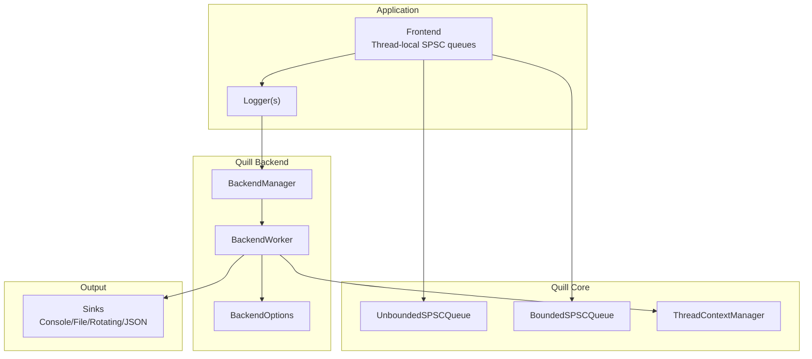
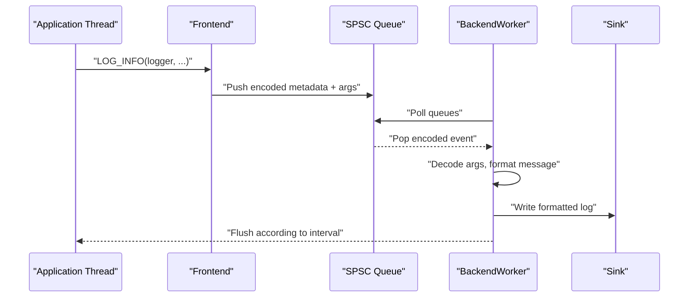
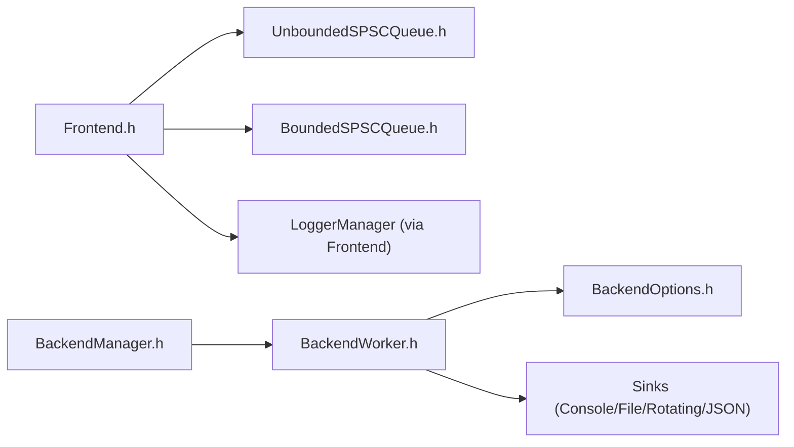

# Best Practices

<cite>
**Referenced Files in This Document**
- [README.md](file://README.md)
- [quick_start.rst](file://docs/quick_start.rst)
- [macro_free_mode.rst](file://docs/macro_free_mode.rst)
- [Frontend.h](file://include/quill/Frontend.h)
- [BackendManager.h](file://include/quill/backend/BackendManager.h)
- [BackendWorker.h](file://include/quill/backend/BackendWorker.h)
- [BackendOptions.h](file://include/quill/backend/BackendOptions.h)
- [FrontendOptions.h](file://include/quill/core/FrontendOptions.h)
- [BoundedSPSCQueue.h](file://include/quill/core/BoundedSPSCQueue.h)
- [UnboundedSPSCQueue.h](file://include/quill/core/UnboundedSPSCQueue.h)
- [recommended_usage.cpp](file://examples/recommended_usage/recommended_usage.cpp)
- [console_logging_macro_free.cpp](file://examples/console_logging_macro_free.cpp)
- [rotating_file_logging.cpp](file://examples/rotating_file_logging.cpp)
- [bounded_dropping_queue_frontend.cpp](file://examples/bounded_dropping_queue_frontend.cpp)
- [custom_frontend_options.cpp](file://examples/custom_frontend_options.cpp)
</cite>

## Table of Contents
1. [Introduction](#introduction)
2. [Project Structure](#project-structure)
3. [Core Components](#core-components)
4. [Architecture Overview](#architecture-overview)
5. [Detailed Component Analysis](#detailed-component-analysis)
6. [Dependency Analysis](#dependency-analysis)
7. [Performance Considerations](#performance-considerations)
8. [Production Deployment and Maintenance](#production-deployment-and-maintenance)
9. [Security and Compliance](#security-and-compliance)
10. [Troubleshooting Guide](#troubleshooting-guide)
11. [Conclusion](#conclusion)

## Introduction
This document consolidates best practices for deploying Quill in production environments. It covers configuration guidelines for queues, backend thread tuning, memory management, performance recommendations across use cases, operational practices (logging rotation, monitoring, resource utilization), macro-free versus macro-based logging, custom type handling, multi-threaded integration, deployment strategies, build optimization, and security/compliance considerations.

## Project Structure
Quill is structured around a frontend-backend separation:
- Frontend: lightweight headers for logging and thread-local SPSC queues.
- Backend: a dedicated worker thread that formats and writes to sinks.
- Core: queue implementations, thread context, and options.
- Sinks: console, file, rotating files, JSON, and platform-specific sinks.

**Diagram sources**
- [Frontend.h:32-111](file://include/quill/Frontend.h#L32-L111)
- [BackendManager.h:38-128](file://include/quill/backend/BackendManager.h#L38-L128)
- [BackendWorker.h:77-207](file://include/quill/backend/BackendWorker.h#L77-L207)
- [BackendOptions.h:30-281](file://include/quill/backend/BackendOptions.h#L30-L281)
- [BoundedSPSCQueue.h:54-196](file://include/quill/core/BoundedSPSCQueue.h#L54-L196)
- [UnboundedSPSCQueue.h:42-160](file://include/quill/core/UnboundedSPSCQueue.h#L42-L160)

**Section sources**
- [quick_start.rst:15-40](file://docs/quick_start.rst#L15-L40)
- [Frontend.h:32-111](file://include/quill/Frontend.h#L32-L111)
- [BackendManager.h:38-128](file://include/quill/backend/BackendManager.h#L38-L128)
- [BackendWorker.h:77-207](file://include/quill/backend/BackendWorker.h#L77-L207)
- [BackendOptions.h:30-281](file://include/quill/backend/BackendOptions.h#L30-L281)
- [BoundedSPSCQueue.h:54-196](file://include/quill/core/BoundedSPSCQueue.h#L54-L196)
- [UnboundedSPSCQueue.h:42-160](file://include/quill/core/UnboundedSPSCQueue.h#L42-L160)

## Core Components
- Frontend queue management:
  - Unbounded queue supports dynamic growth with configurable max capacity and shrinking.
  - Bounded queue enforces fixed capacity with blocking or dropping policies.
- Backend worker:
  - Polls frontend queues, orders messages by timestamp, formats, and flushes sinks.
  - Tunable sleep/idle behavior, CPU affinity, and error notifications.
- Options:
  - FrontendOptions controls queue type, capacities, and huge pages policy.
  - BackendOptions controls thread name, idle behavior, transit buffer sizing, flush intervals, and printable character filtering.

Key production-relevant APIs and options:
- Frontend queue introspection and shrinkage for memory control.
- BackendOptions for strict timestamp ordering grace period, flush intervals, and error notifier hooks.

**Section sources**
- [Frontend.h:45-111](file://include/quill/Frontend.h#L45-L111)
- [FrontendOptions.h:16-50](file://include/quill/core/FrontendOptions.h#L16-L50)
- [BackendOptions.h:30-281](file://include/quill/backend/BackendOptions.h#L30-L281)
- [BackendWorker.h:305-395](file://include/quill/backend/BackendWorker.h#L305-L395)

## Architecture Overview
The logging pipeline:
- Frontend threads enqueue formatted metadata and arguments into thread-local SPSC queues.
- Backend worker drains queues, decodes arguments, formats messages, and writes to sinks.
- Transit event buffers and strict timestamp ordering ensure correctness under concurrency.

**Diagram sources**
- [quick_start.rst:15-40](file://docs/quick_start.rst#L15-L40)
- [BackendWorker.h:479-506](file://include/quill/backend/BackendWorker.h#L479-L506)
- [BackendWorker.h:795-800](file://include/quill/backend/BackendWorker.h#L795-L800)

**Section sources**
- [quick_start.rst:15-40](file://docs/quick_start.rst#L15-L40)
- [BackendWorker.h:305-395](file://include/quill/backend/BackendWorker.h#L305-L395)

## Detailed Component Analysis

### Queue Selection and Memory Management
- Unbounded queue:
  - Grows dynamically up to a maximum; supports shrinking to reclaim memory after bursts.
  - Use shrink_thread_local_queue to lower capacity post-burst.
- Bounded queue:
  - Fixed capacity; choose blocking or dropping based on SLA.
  - Suitable for constrained environments to prevent memory growth.

Recommendations:
- High-throughput services: prefer UnboundedBlocking with conservative shrink thresholds.
- Latency-sensitive services: consider BoundedDropping with tight capacity to avoid stalls.
- Embedded systems: BoundedDropping with minimal initial capacity and strict max limits.

**Section sources**
- [Frontend.h:72-111](file://include/quill/Frontend.h#L72-L111)
- [UnboundedSPSCQueue.h:166-183](file://include/quill/core/UnboundedSPSCQueue.h#L166-L183)
- [BoundedSPSCQueue.h:105-145](file://include/quill/core/BoundedSPSCQueue.h#L105-L145)
- [bounded_dropping_queue_frontend.cpp:21-32](file://examples/bounded_dropping_queue_frontend.cpp#L21-L32)
- [custom_frontend_options.cpp:14-21](file://examples/custom_frontend_options.cpp#L14-L21)

### Backend Thread Optimization
- Idle behavior:
  - sleep_duration balances CPU usage vs. responsiveness.
  - enable_yield_when_idle reduces scheduler priority when idle.
- CPU affinity:
  - Pin backend to a non-critical CPU to minimize contention.
- Strict timestamp ordering:
  - log_timestamp_ordering_grace_period ensures monotonicity at the cost of minor latency.
- Flush intervals:
  - sink_min_flush_interval controls global flush cadence; 0 disables enforced periodic flush.

**Section sources**
- [BackendOptions.h:30-281](file://include/quill/backend/BackendOptions.h#L30-L281)
- [BackendWorker.h:138-207](file://include/quill/backend/BackendWorker.h#L138-L207)

### Macro-Free vs Macro-Based Logging
- Macro-based logging:
  - Compile-time metadata, lower latency, compile-time level removal, and lazy argument evaluation.
- Macro-free logging:
  - Function-based API; cleaner code but higher latency and runtime metadata handling.

Guidance:
- Performance-critical paths: macro-based logging.
- Build simplicity or specific constraints: macro-free logging.

**Section sources**
- [macro_free_mode.rst:10-26](file://docs/macro_free_mode.rst#L10-L26)
- [console_logging_macro_free.cpp:15-61](file://examples/console_logging_macro_free.cpp#L15-L61)

### Custom Type Handling
- Quill supports standard and user-defined types via format codecs.
- For user-defined types, deferred or direct format codecs can be implemented to serialize efficiently.

**Section sources**
- [README.md:192-220](file://README.md#L192-L220)

### Multi-threaded Application Integration
- Pre-allocate thread-local queues during warm-up to avoid first-use allocations.
- Use shrink_thread_local_queue to reduce memory after bursty workloads.
- Ensure logger lifecycle management with remove_logger or remove_logger_blocking when replacing sinks.

**Section sources**
- [Frontend.h:45-111](file://include/quill/Frontend.h#L45-L111)
- [Frontend.h:233-289](file://include/quill/Frontend.h#L233-L289)

### Logging Rotation and Monitoring
- Rotating sinks:
  - Daily rotation and size-based rotation with append options.
- Monitoring hooks:
  - error_notifier for backend exceptions and notifications.
  - backend_worker_on_poll_begin/end for instrumentation.

**Section sources**
- [rotating_file_logging.cpp:14-44](file://examples/rotating_file_logging.cpp#L14-L44)
- [BackendOptions.h:170-192](file://include/quill/backend/BackendOptions.h#L170-L192)

### Build Optimization and Deployment Strategies
- Recommended usage:
  - Encapsulate backend in a static library to minimize frontend header dependencies and compile times.
- Static vs shared linking:
  - Avoid multiple backend singleton instances; prefer shared library exports on platforms where static linking is mixed.

**Section sources**
- [recommended_usage.cpp:1-50](file://examples/recommended_usage/recommended_usage.cpp#L1-L50)
- [README.md:106-121](file://README.md#L106-L121)

## Dependency Analysis

**Diagram sources**
- [Frontend.h:120-179](file://include/quill/Frontend.h#L120-L179)
- [UnboundedSPSCQueue.h:42-85](file://include/quill/core/UnboundedSPSCQueue.h#L42-L85)
- [BoundedSPSCQueue.h:54-95](file://include/quill/core/BoundedSPSCQueue.h#L54-L95)
- [BackendManager.h:38-128](file://include/quill/backend/BackendManager.h#L38-L128)
- [BackendWorker.h:77-207](file://include/quill/backend/BackendWorker.h#L77-L207)
- [BackendOptions.h:30-281](file://include/quill/backend/BackendOptions.h#L30-L281)

**Section sources**
- [Frontend.h:120-179](file://include/quill/Frontend.h#L120-L179)
- [BackendManager.h:38-128](file://include/quill/backend/BackendManager.h#L38-L128)
- [BackendWorker.h:77-207](file://include/quill/backend/BackendWorker.h#L77-L207)

## Performance Considerations
- Latency:
  - Bounded dropping queues offer predictable low latency under overload.
  - Unbounded queues can absorb spikes but risk memory growth; use shrink after bursts.
- Throughput:
  - Backend flush intervals and sink types influence sustained throughput.
- Timestamp ordering:
  - Grace period trades off strict ordering for reduced queue blocking.
- CPU scheduling:
  - Sleep duration and yielding tune responsiveness vs. CPU usage.

[No sources needed since this section provides general guidance]

## Production Deployment and Maintenance
- Initialization:
  - Start backend early; configure BackendOptions for your environment.
- Rotation:
  - Use rotating sinks for long-running services; monitor disk usage.
- Monitoring:
  - Hook error_notifier for backend anomalies; use poll hooks for external instrumentation.
- Lifecycle:
  - Replace sinks safely using remove_logger_blocking to drain queues.
- Build:
  - Prefer static library for backend to minimize frontend dependencies.

**Section sources**
- [rotating_file_logging.cpp:14-44](file://examples/rotating_file_logging.cpp#L14-L44)
- [Frontend.h:233-289](file://include/quill/Frontend.h#L233-L289)
- [recommended_usage.cpp:1-50](file://examples/recommended_usage/recommended_usage.cpp#L1-L50)

## Security and Compliance
- Access control:
  - Restrict file permissions for log destinations; prefer centralized logging with secure transport.
- Audit trails:
  - Enable strict timestamp ordering where required; ensure sinks are durable.
- Data handling:
  - Use printable character filtering to sanitize logs; review log content regularly.
- Singleton safety:
  - Enable backend singleton check to prevent multiple workers in mixed static/shared linkages.

**Section sources**
- [BackendOptions.h:239-240](file://include/quill/backend/BackendOptions.h#L239-L240)
- [BackendOptions.h:279-281](file://include/quill/backend/BackendOptions.h#L279-L281)

## Troubleshooting Guide
Common issues and remedies:
- Backend not stopping or exiting:
  - Verify wait_for_queues_to_empty_before_exit and ensure no continuous logging during shutdown.
- Out-of-order logs:
  - Adjust log_timestamp_ordering_grace_period; consider stricter grace for multi-source threads.
- Dropped messages:
  - Switch to BoundedDropping with adequate capacity or move to UnboundedDropping with monitoring.
- High memory usage:
  - Use shrink_thread_local_queue after bursts; cap unbounded_queue_max_capacity.
- Instrumentation:
  - Use backend_worker_on_poll_begin/end to attach profilers or tracers.

**Section sources**
- [BackendOptions.h:145-146](file://include/quill/backend/BackendOptions.h#L145-L146)
- [BackendOptions.h:132-132](file://include/quill/backend/BackendOptions.h#L132-L132)
- [Frontend.h:72-111](file://include/quill/Frontend.h#L72-L111)
- [BackendWorker.h:305-395](file://include/quill/backend/BackendWorker.h#L305-L395)

## Conclusion
Quill’s frontend-backend design enables high-performance, low-latency logging suitable for demanding production environments. Optimize queue selection and backend thread parameters per workload, enforce strict ordering where required, and adopt robust operational practices for rotation, monitoring, and lifecycle management. Choose macro-based logging for peak performance and macro-free logging when simplicity outweighs microsecond-level latency. Apply security and compliance controls around access, retention, and content sanitization.