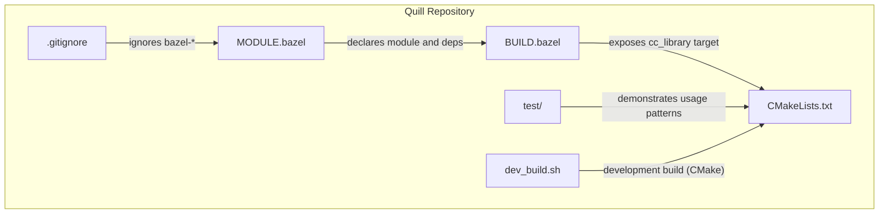
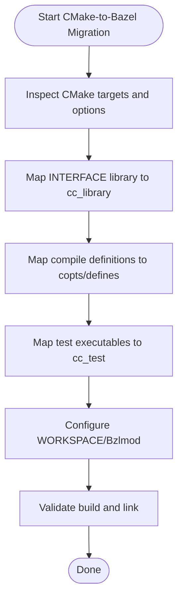
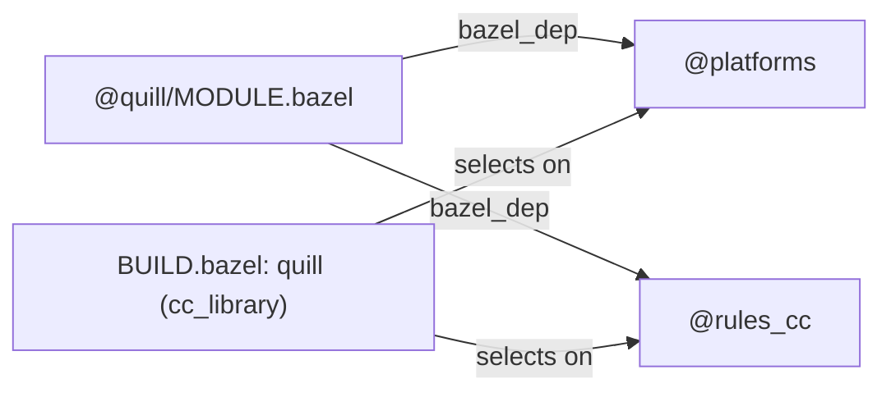

# Bazel Build Integration

<cite>
**Referenced Files in This Document**
- [BUILD.bazel](file://BUILD.bazel)
- [MODULE.bazel](file://MODULE.bazel)
- [README.md](file://README.md)
- [.gitignore](file://.gitignore)
- [dev_build.sh](file://dev_build.sh)
- [CMakeLists.txt](file://CMakeLists.txt)
- [test/CMakeLists.txt](file://test/CMakeLists.txt)
- [test/unit_tests/CMakeLists.txt](file://test/unit_tests/CMakeLists.txt)
- [test/integration_tests/CMakeLists.txt](file://test/integration_tests/CMakeLists.txt)
</cite>

## Table of Contents
1. [Introduction](#introduction)
2. [Project Structure](#project-structure)
3. [Core Components](#core-components)
4. [Architecture Overview](#architecture-overview)
5. [Detailed Component Analysis](#detailed-component-analysis)
6. [Dependency Analysis](#dependency-analysis)
7. [Performance Considerations](#performance-considerations)
8. [Troubleshooting Guide](#troubleshooting-guide)
9. [Conclusion](#conclusion)
10. [Appendices](#appendices)

## Introduction
This document explains how to integrate the Quill logging library into Bazel-based C++ projects. It covers the Bazel module definition, Starlark build targets, and recommended integration patterns. It also provides guidance on dependency management, workspace configuration, and migration from other build systems (notably CMake). Practical examples are provided via file references to the repository’s Bazel configuration and related build files.

## Project Structure
Quill’s repository includes a minimal Bazel configuration:
- A module declaration in MODULE.bazel
- A cc_library target in BUILD.bazel exposing the public headers
- Supporting files for CMake and tests that illustrate typical usage patterns



**Diagram sources**
- [MODULE.bazel:1-9](file://MODULE.bazel#L1-L9)
- [BUILD.bazel:1-23](file://BUILD.bazel#L1-L23)
- [CMakeLists.txt:1-451](file://CMakeLists.txt#L1-L451)
- [.gitignore:24-26](file://.gitignore#L24-L26)

**Section sources**
- [MODULE.bazel:1-9](file://MODULE.bazel#L1-L9)
- [BUILD.bazel:1-23](file://BUILD.bazel#L1-L23)
- [.gitignore:24-26](file://.gitignore#L24-L26)

## Core Components
- Module definition: Declares the module name, version, compatibility level, and required Bazel dependencies for platform and C++ rules.
- Library target: Defines a cc_library named “quill” that exposes public headers and platform-appropriate link options.

Key characteristics:
- Visibility: Public
- Headers: Globbed from include/**.h
- Compiler options: Selects warnings for GCC/Clang
- Link options: Adds pthread and rt on Linux; pthread on other platforms; no Windows-specific libs in the target
- Dependencies: Uses @platforms and @rules_cc

Integration note: The module declares compatibility_level 1, indicating a stable API surface suitable for Bzlmod consumers.

**Section sources**
- [MODULE.bazel:1-9](file://MODULE.bazel#L1-L9)
- [BUILD.bazel:1-23](file://BUILD.bazel#L1-L23)

## Architecture Overview
The Bazel integration centers on a single cc_library target that encapsulates Quill’s public headers and platform-specific linking. Consumers depend on the “quill” target to access Quill’s API.

```mermaid
graph TB
subgraph "Consumer Target"
App["cc_binary/cc_library"]
end
subgraph "Quill Module"
Mod["Module: quill"]
Lib["Target: quill (cc_library)"]
end
App --> |"deps = [\":quill\"]"| Lib
Mod --> Lib
```

**Diagram sources**
- [MODULE.bazel:1-9](file://MODULE.bazel#L1-L9)
- [BUILD.bazel:5-22](file://BUILD.bazel#L5-L22)

**Section sources**
- [MODULE.bazel:1-9](file://MODULE.bazel#L1-L9)
- [BUILD.bazel:5-22](file://BUILD.bazel#L5-L22)

## Detailed Component Analysis

### MODULE.bazel
- Declares module name, version, and compatibility level.
- Declares dependencies on @platforms and @rules_cc.

Best practices:
- Keep compatibility_level aligned with API stability.
- Pin versions for reproducibility.

**Section sources**
- [MODULE.bazel:1-9](file://MODULE.bazel#L1-L9)

### BUILD.bazel
- Defines a cc_library target named “quill”
- Exposes public headers via globbing include/**/*.h
- Applies compiler options conditionally for GCC/Clang
- Adds platform-specific linkopts:
  - Linux: pthread and rt
  - Other Unix-like: pthread
  - Windows: no extra libs in this target
- Sets include path to “include”

Integration guidance:
- Depend on “:quill” from your BUILD.bazel targets.
- Ensure your workspace resolves the module via Bzlmod or a local path.

**Section sources**
- [BUILD.bazel:1-23](file://BUILD.bazel#L1-L23)

### README.md: Bazel Integration Notes
- Mentions availability via Bzlmod with bazel_dep(name = "quill", version = "x.y.z").
- Provides a manual integration example showing a cc_binary depending on a “quill” target in a specific path.

Practical pointers:
- Prefer Bzlmod for versioned consumption.
- Use the manual pattern when integrating from a local path or fork.

**Section sources**
- [README.md:663-677](file://README.md#L663-L677)

### Migration from CMake to Bazel
While this repository does not include a dedicated WORKSPACE file, migration patterns can be derived from existing build files:

- From CMake INTERFACE library to Bazel cc_library:
  - CMake sets target_include_directories and links Threads::Threads; Bazel’s cc_library exposes headers and linkopts.
  - CMake adds platform-specific libraries (e.g., ucrtbase for MinGW, stdc++fs for old GCC); Bazel’s select block mirrors these choices.

- From CMake options to Bazel:
  - CMake compile definitions (e.g., QUILL_NO_EXCEPTIONS) are not exposed in Bazel’s BUILD.bazel; consumers can define their own copts or defines if needed.

- From CMake tests to Bazel:
  - The repository demonstrates test organization via CMake; Bazel users can create cc_test targets and depend on the “quill” library target.



[No sources needed since this diagram shows conceptual workflow, not actual code structure]

**Section sources**
- [CMakeLists.txt:292-352](file://CMakeLists.txt#L292-L352)
- [CMakeLists.txt:336-346](file://CMakeLists.txt#L336-L346)
- [test/CMakeLists.txt:1-2](file://test/CMakeLists.txt#L1-L2)
- [test/unit_tests/CMakeLists.txt:14-54](file://test/unit_tests/CMakeLists.txt#L14-L54)
- [test/integration_tests/CMakeLists.txt:14-57](file://test/integration_tests/CMakeLists.txt#L14-L57)

## Dependency Analysis
- Module dependencies:
  - @platforms: Used by BUILD.bazel select() expressions to apply platform-specific compiler/linker options.
  - @rules_cc: Used by BUILD.bazel select() expressions to apply compiler-specific options.

- Target dependencies:
  - The “quill” cc_library does not declare additional deps beyond platform rules; linkopts handle threading and timing libraries.



**Diagram sources**
- [MODULE.bazel:7-8](file://MODULE.bazel#L7-L8)
- [BUILD.bazel:8-21](file://BUILD.bazel#L8-L21)

**Section sources**
- [MODULE.bazel:7-8](file://MODULE.bazel#L7-L8)
- [BUILD.bazel:8-21](file://BUILD.bazel#L8-L21)

## Performance Considerations
- Compiler options:
  - Bazel applies Wno-gnu-zero-variadic-macro-arguments for GCC/Clang via select(), mirroring CMake’s INTERFACE compile options.
- Linker flags:
  - pthread and rt are linked on Linux; pthread on other Unix-like systems. This ensures thread-safe operation and monotonic clock support.
- Caching:
  - Bazel’s hermetic builds and remote caching can accelerate incremental builds. Use Bazel’s caching strategies and keep dependency versions pinned for reproducibility.

[No sources needed since this section provides general guidance]

## Troubleshooting Guide
Common issues and resolutions:
- Missing platform or C++ rules:
  - Ensure MODULE.bazel resolves @platforms and @rules_cc. If using a local module, verify the WORKSPACE or bzlmod configuration.
- Link errors on Linux:
  - Confirm that linkopts include pthread and rt. If missing, adjust your consuming target’s deps or provide platform-specific linkopts.
- Unexpected warnings:
  - The select() block suppresses specific warnings on GCC/Clang. If you still see warnings, verify toolchain selection and flags propagation.
- Ignored Bazel artifacts:
  - The repository ignores bazel-* directories. Ensure your workspace root excludes these directories from version control.

**Section sources**
- [MODULE.bazel:7-8](file://MODULE.bazel#L7-L8)
- [BUILD.bazel:8-21](file://BUILD.bazel#L8-L21)
- [.gitignore:24-26](file://.gitignore#L24-L26)

## Conclusion
Quill’s Bazel integration is intentionally minimal: a module declaration and a single cc_library target expose the public API and platform-appropriate link settings. For most projects, depending on the “quill” target suffices. When migrating from CMake, map INTERFACE libraries to cc_library, translate compile definitions to copts/defines, and convert test executables to cc_test. Use Bzlmod for versioned consumption and adhere to the module’s compatibility level.

[No sources needed since this section summarizes without analyzing specific files]

## Appendices

### Practical Examples (via file references)
- Bzlmod usage: See the README’s Bazel section for bazel_dep usage and manual integration example.
- Local integration: Use a cc_binary or cc_library that depends on “:quill” from your workspace path.
- Platform-specific linkopts: Refer to BUILD.bazel for pthread/rt usage on Linux and pthread elsewhere.

**Section sources**
- [README.md:663-677](file://README.md#L663-L677)
- [BUILD.bazel:14-21](file://BUILD.bazel#L14-L21)