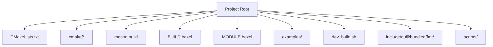
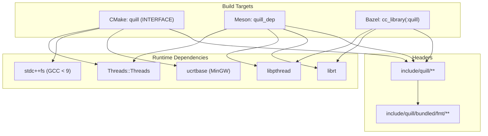
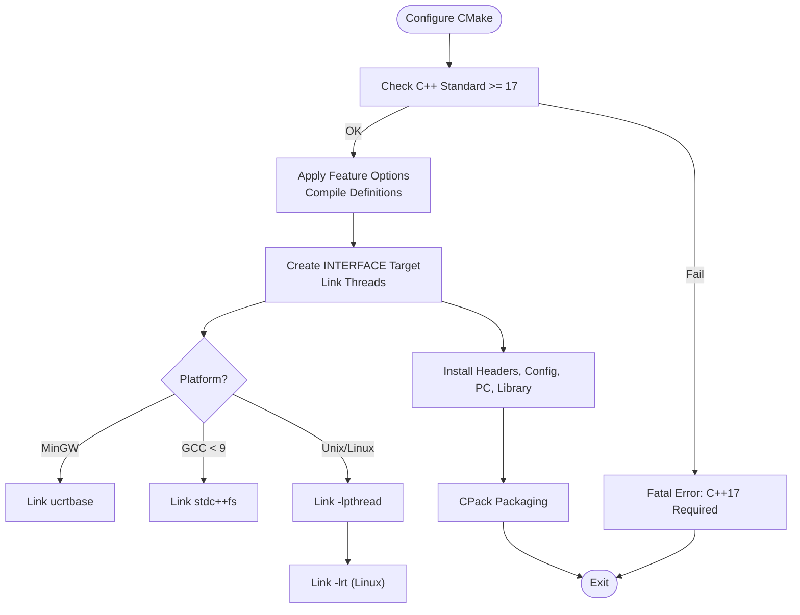
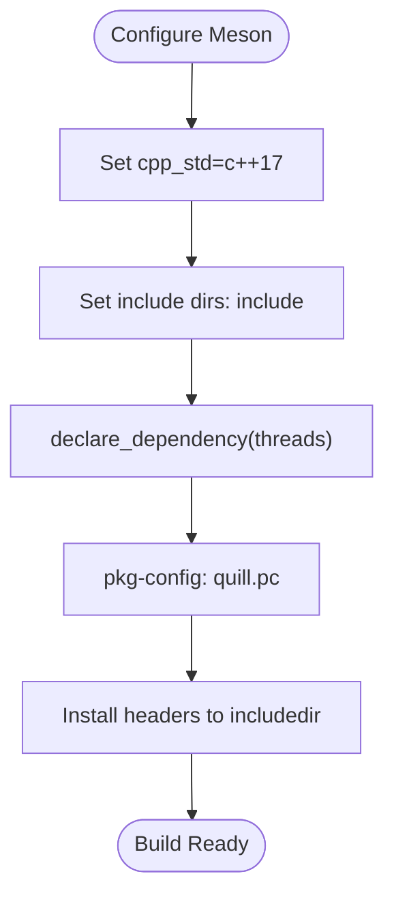
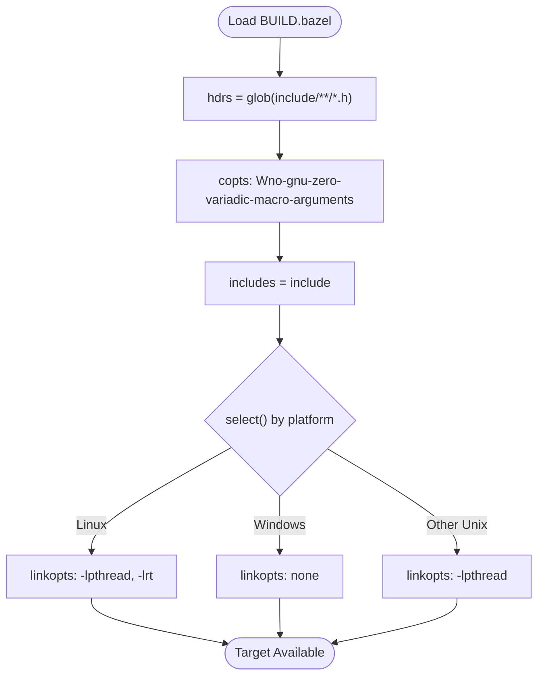
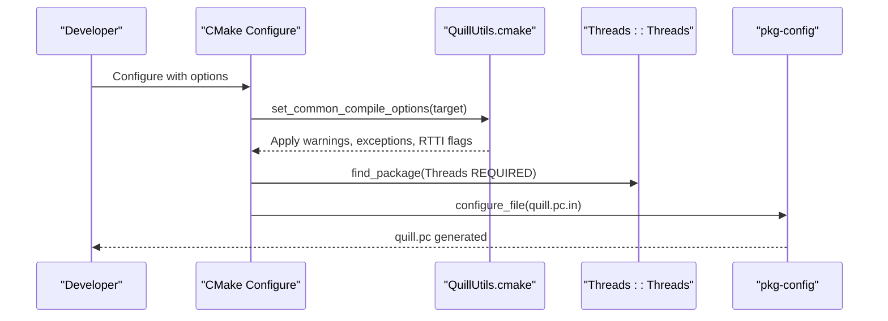
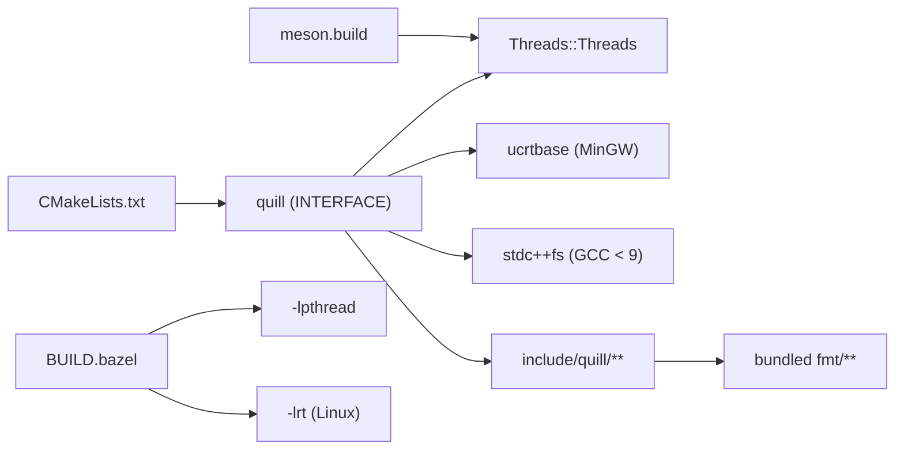

# Build & Deployment Challenges

<cite>
**Referenced Files in This Document**
- [CMakeLists.txt](file://CMakeLists.txt)
- [meson.build](file://meson.build)
- [BUILD.bazel](file://BUILD.bazel)
- [MODULE.bazel](file://MODULE.bazel)
- [cmake/QuillUtils.cmake](file://cmake/QuillUtils.cmake)
- [cmake/quill-config.cmake.in](file://cmake/quill-config.cmake.in)
- [cmake/quill.pc.in](file://cmake/quill.pc.in)
- [dev_build.sh](file://dev_build.sh)
- [examples/CMakeLists.txt](file://examples/CMakeLists.txt)
- [examples/shared_library/CMakeLists.txt](file://examples/shared_library/CMakeLists.txt)
- [examples/recommended_usage/quill_static_lib/CMakeLists.txt](file://examples/recommended_usage/quill_static_lib/CMakeLists.txt)
- [include/quill/Backend.h](file://include/quill/Backend.h)
- [include/quill/Utility.h](file://include/quill/Utility.h)
- [include/quill/bundled/fmt/base.h](file://include/quill/bundled/fmt/base.h)
- [scripts/rename_libfmt.py](file://scripts/rename_libfmt.py)
</cite>

## Table of Contents
1. [Introduction](#introduction)
2. [Project Structure](#project-structure)
3. [Core Components](#core-components)
4. [Architecture Overview](#architecture-overview)
5. [Detailed Component Analysis](#detailed-component-analysis)
6. [Dependency Analysis](#dependency-analysis)
7. [Performance Considerations](#performance-considerations)
8. [Troubleshooting Guide](#troubleshooting-guide)
9. [Conclusion](#conclusion)
10. [Appendices](#appendices)

## Introduction
This document addresses build system and deployment challenges for Quill, focusing on CMake integration, Meson setup, and Bazel configuration. It covers compiler compatibility, standard library requirements, platform-specific considerations, dependency management, library linking, runtime dependencies, packaging, third-party integration, namespace conflicts with external fmt versions, and ABI compatibility. It also provides troubleshooting workflows and step-by-step resolution guides for common build and deployment scenarios.

## Project Structure
Quill supports three primary build systems:
- CMake: Primary build system with extensive options for tests, examples, benchmarks, sanitizers, coverage, and packaging.
- Meson: Lightweight configuration with C++17 and pkg-config generation.
- Bazel: Starlark-based build with platform-specific linkopts and compiler flags.

Key build-related directories and files:
- CMake: Top-level CMakeLists.txt, cmake/QuillUtils.cmake, cmake/quill-config.cmake.in, cmake/quill.pc.in.
- Meson: meson.build.
- Bazel: BUILD.bazel, MODULE.bazel.
- Examples and packaging: examples/, dev_build.sh.
- Bundled fmt: include/quill/bundled/fmt/.
- Scripts: scripts/rename_libfmt.py.

**Diagram sources**
- [CMakeLists.txt](file://CMakeLists.txt)
- [meson.build](file://meson.build)
- [BUILD.bazel](file://BUILD.bazel)
- [MODULE.bazel](file://MODULE.bazel)
- [examples/CMakeLists.txt](file://examples/CMakeLists.txt)
- [dev_build.sh](file://dev_build.sh)
- [include/quill/bundled/fmt/base.h](file://include/quill/bundled/fmt/base.h)
- [scripts/rename_libfmt.py](file://scripts/rename_libfmt.py)

**Section sources**
- [CMakeLists.txt](file://CMakeLists.txt)
- [meson.build](file://meson.build)
- [BUILD.bazel](file://BUILD.bazel)
- [MODULE.bazel](file://MODULE.bazel)
- [examples/CMakeLists.txt](file://examples/CMakeLists.txt)
- [dev_build.sh](file://dev_build.sh)

## Core Components
- CMake library target: An INTERFACE library named quill with public compile definitions controlled by options. It links Threads::Threads and applies platform-specific link libraries.
- Meson library: Declares a dependency on threads with include directories and generates pkg-config metadata.
- Bazel library: Exposes headers via glob, sets include paths, applies compiler flags, and selects pthread and realtime libraries on Unix-like platforms.

Key behaviors:
- C++ standard enforcement to C++17 or newer.
- Conditional compile definitions for features like exceptions, thread names, sequential thread IDs, x86 optimizations, macro prefixes, function/file info, and assertions.
- Platform-specific link libraries: ucrtbase on MinGW, stdc++fs on older GCC, pthreads on Unix-like systems, and rt on Linux.

**Section sources**
- [CMakeLists.txt](file://CMakeLists.txt)
- [meson.build](file://meson.build)
- [BUILD.bazel](file://BUILD.bazel)

## Architecture Overview
The build system integrates with the standard library and threading primitives, exposes a consistent API surface, and manages internal dependencies (notably the bundled fmt). The following diagram maps the build targets and their relationships.

**Diagram sources**
- [CMakeLists.txt](file://CMakeLists.txt)
- [meson.build](file://meson.build)
- [BUILD.bazel](file://BUILD.bazel)
- [include/quill/bundled/fmt/base.h](file://include/quill/bundled/fmt/base.h)

## Detailed Component Analysis

### CMake Integration
- Options and defaults:
  - Feature toggles for exceptions, thread names, sequential thread IDs, x86 optimizations, macro prefixes, function/file info, assertions.
  - Build categories: examples, tests, benchmarks, fuzzing, docs generation.
  - Sanitizers and code coverage flags.
- Compiler and standard:
  - Enforces C++17; errors out if lower.
  - Adds warnings and hardening flags via QuillUtils.cmake.
- Targets and installation:
  - INTERFACE library quill with PUBLIC compile definitions mapped from options.
  - Installs headers, library, CMake package config, pkg-config file, and CPack packaging metadata.
- Packaging and pkg-config:
  - Generates quill.pc with version, includes, libs, and optional Requires field.

**Diagram sources**
- [CMakeLists.txt](file://CMakeLists.txt)
- [cmake/QuillUtils.cmake](file://cmake/QuillUtils.cmake)
- [cmake/quill.pc.in](file://cmake/quill.pc.in)

**Section sources**
- [CMakeLists.txt](file://CMakeLists.txt)
- [cmake/QuillUtils.cmake](file://cmake/QuillUtils.cmake)
- [cmake/quill-config.cmake.in](file://cmake/quill-config.cmake.in)
- [cmake/quill.pc.in](file://cmake/quill.pc.in)

### Meson Setup
- Sets project to C++17 and default warning level.
- Declares an internal dependency with include directories and Threads dependency.
- Installs headers and generates pkg-config metadata.

**Diagram sources**
- [meson.build](file://meson.build)

**Section sources**
- [meson.build](file://meson.build)

### Bazel Configuration
- Defines a cc_library exposing all headers under include/, sets includes, and applies compiler flags to suppress specific warnings on GCC/Clang.
- Selects linkopts based on platform:
  - Linux: -lpthread and -lrt.
  - Windows: no extra linkopts.
  - Other Unix: -lpthread.

**Diagram sources**
- [BUILD.bazel](file://BUILD.bazel)
- [MODULE.bazel](file://MODULE.bazel)

**Section sources**
- [BUILD.bazel](file://BUILD.bazel)
- [MODULE.bazel](file://MODULE.bazel)

### Compiler Compatibility and Standard Library Requirements
- C++ standard: CMake enforces C++17 or newer; Meson sets cpp_std=c++17; Bazel relies on the underlying toolchain to honor C++17.
- Exceptions and RTTI:
  - When QUILL_NO_EXCEPTIONS is enabled, CMake removes MSVC EH flags and adds -fno-exceptions/-fno-rtti for Clang/GCC; MSVC uses /EHs-c- and /GR-.
- Standard library specifics:
  - GCC < 9 requires stdc++fs linkage.
  - MinGW needs ucrtbase linkage.
  - Unix-like systems require pthread; Linux additionally requires rt.

**Section sources**
- [CMakeLists.txt](file://CMakeLists.txt)
- [cmake/QuillUtils.cmake](file://cmake/QuillUtils.cmake)

### Platform-Specific Build Considerations
- Windows:
  - MSVC: Uses /EHsc by default unless QUILL_NO_EXCEPTIONS; defines QUILL_DLL_IMPORT for shared library usage.
  - MinGW: Links ucrtbase; uses ucrtbase for time formatting.
- Linux:
  - Links pthread and rt; ensures atomic availability via a compile check.
- macOS:
  - Inherits generic Unix behavior; pthread is required.

**Section sources**
- [CMakeLists.txt](file://CMakeLists.txt)
- [cmake/QuillUtils.cmake](file://cmake/QuillUtils.cmake)

### Dependency Management and Third-Party Integration
- Threads dependency:
  - CMake and Meson link Threads::Threads; Bazel selects pthreads via linkopts.
- pkg-config:
  - CMake generates quill.pc with version, includes, and libs; optional Requires placeholder for downstream consumers.
- Bundled fmt:
  - Quill bundles a modified fmt (renamed to avoid conflicts). The rename script demonstrates how macros, namespaces, and details are remapped to a custom prefix.

**Diagram sources**
- [CMakeLists.txt](file://CMakeLists.txt)
- [cmake/QuillUtils.cmake](file://cmake/QuillUtils.cmake)
- [cmake/quill.pc.in](file://cmake/quill.pc.in)

**Section sources**
- [CMakeLists.txt](file://CMakeLists.txt)
- [cmake/quill.pc.in](file://cmake/quill.pc.in)
- [include/quill/bundled/fmt/base.h](file://include/quill/bundled/fmt/base.h)
- [scripts/rename_libfmt.py](file://scripts/rename_libfmt.py)

### Namespace Conflicts with External fmt Versions
- Quill bundles a renamed fmt (FMTQUILL prefix) to avoid conflicts with system or project-installed fmt.
- The rename script automates macro and namespace substitution across bundled headers.
- When integrating with external fmt, ensure the project does not link against system fmt or coordinate include paths carefully to prevent symbol collisions.

**Section sources**
- [scripts/rename_libfmt.py](file://scripts/rename_libfmt.py)
- [include/quill/bundled/fmt/base.h](file://include/quill/bundled/fmt/base.h)

### ABI Compatibility Issues
- Feature toggles can alter symbol visibility and exception handling, potentially affecting ABI stability across builds.
- Sequential thread IDs require a single translation unit definition; mismatched definitions across translation units can cause ABI mismatches.
- Compiler flags (e.g., -fno-exceptions, -fno-rtti) change ABI; mixing binaries compiled with different flags is unsafe.

**Section sources**
- [CMakeLists.txt](file://CMakeLists.txt)
- [include/quill/Utility.h](file://include/quill/Utility.h)

### Library Linking and Runtime Dependencies
- Link libraries:
  - CMake: Threads::Threads; MinGW adds ucrtbase; GCC < 9 adds stdc++fs.
  - Meson: Threads dependency; pkg-config emits -lpthread.
  - Bazel: -lpthread and -lrt on Linux; no extra opts on Windows.
- Runtime expectations:
  - pthread availability on Unix-like systems; ucrtbase on MinGW; rt on Linux.

**Section sources**
- [CMakeLists.txt](file://CMakeLists.txt)
- [meson.build](file://meson.build)
- [BUILD.bazel](file://BUILD.bazel)

### Packaging Strategies
- CMake packaging:
  - Installs headers, library, CMake package config, and pkg-config file.
  - CPack configuration for ZIP packaging with RPM metadata.
- Meson packaging:
  - Installs headers to includedir and generates pkg-config metadata.

**Section sources**
- [CMakeLists.txt](file://CMakeLists.txt)
- [meson.build](file://meson.build)

### Example Integration Patterns
- Static library wrapper around quill::quill with proper include directories and linking.
- Shared library example with Windows DLL import definitions and post-build copy steps.

**Section sources**
- [examples/recommended_usage/quill_static_lib/CMakeLists.txt](file://examples/recommended_usage/quill_static_lib/CMakeLists.txt)
- [examples/shared_library/CMakeLists.txt](file://examples/shared_library/CMakeLists.txt)
- [examples/CMakeLists.txt](file://examples/CMakeLists.txt)

## Dependency Analysis

**Diagram sources**
- [CMakeLists.txt](file://CMakeLists.txt)
- [meson.build](file://meson.build)
- [BUILD.bazel](file://BUILD.bazel)
- [include/quill/bundled/fmt/base.h](file://include/quill/bundled/fmt/base.h)

**Section sources**
- [CMakeLists.txt](file://CMakeLists.txt)
- [meson.build](file://meson.build)
- [BUILD.bazel](file://BUILD.bazel)

## Performance Considerations
- CMake options:
  - QUILL_X86ARCH enables x86-specific optimizations; ensure -march is set accordingly.
  - Code coverage and sanitizers increase overhead; use selectively.
- Meson and Bazel:
  - Meson sets warning_level=3; Bazel suppresses specific warnings to reduce noise.
- Atomic availability:
  - A compile check ensures atomics are available before building.

**Section sources**
- [CMakeLists.txt](file://CMakeLists.txt)
- [cmake/QuillUtils.cmake](file://cmake/QuillUtils.cmake)

## Troubleshooting Guide

### CMake Build Failures
Common issues and resolutions:
- C++ standard too low:
  - Set CMAKE_CXX_STANDARD to 17 or higher.
  - Reference: [CMakeLists.txt](file://CMakeLists.txt)
- Missing Threads dependency:
  - Ensure find_package(Threads REQUIRED) succeeds; verify toolchain provides pthreads.
  - Reference: [CMakeLists.txt](file://CMakeLists.txt)
- MinGW time formatting:
  - ucrtbase linkage is automatic; verify ucrtbase availability.
  - Reference: [CMakeLists.txt](file://CMakeLists.txt)
- GCC < 9 filesystem:
  - stdc++fs linkage is automatic; confirm compiler version.
  - Reference: [CMakeLists.txt](file://CMakeLists.txt)
- pkg-config missing:
  - Verify quill.pc.in configuration and configure_file invocation.
  - Reference: [cmake/quill.pc.in](file://cmake/quill.pc.in)
- Installing headers/libraries:
  - Confirm install(DIRECTORY ...) and install(TARGETS ...) directives.
  - Reference: [CMakeLists.txt](file://CMakeLists.txt)

### Meson Build Failures
- cpp_std not set to c++17:
  - Ensure default_options includes cpp_std=c++17.
  - Reference: [meson.build](file://meson.build)
- Threads dependency unresolved:
  - Meson resolves Threads automatically; verify system provides pthreads.
  - Reference: [meson.build](file://meson.build)
- pkg-config generation:
  - Ensure pkgconfig module is imported and generate() invoked.
  - Reference: [meson.build](file://meson.build)

### Bazel Build Failures
- Missing pthread/rt:
  - On Linux, ensure -lpthread and -lrt are linked; on Windows, no extra linkopts.
  - Reference: [BUILD.bazel](file://BUILD.bazel)
- Compiler flags:
  - Suppress Wno-gnu-zero-variadic-macro-arguments for GCC/Clang; verify select conditions.
  - Reference: [BUILD.bazel](file://BUILD.bazel)
- Module metadata:
  - Ensure MODULE.bazel declares module name, version, and dependencies.
  - Reference: [MODULE.bazel](file://MODULE.bazel)

### Dependency Resolution
- Conflicting fmt versions:
  - Prefer the bundled fmt (FMTQUILL prefix) to avoid conflicts; avoid linking external fmt alongside Quill.
  - Reference: [scripts/rename_libfmt.py](file://scripts/rename_libfmt.py), [include/quill/bundled/fmt/base.h](file://include/quill/bundled/fmt/base.h)
- Feature toggle ABI differences:
  - Keep QUILL_NO_EXCEPTIONS and related options consistent across the build graph.
  - Reference: [CMakeLists.txt](file://CMakeLists.txt), [include/quill/Utility.h](file://include/quill/Utility.h)

### Deployment Validation
- Runtime checks:
  - Verify pthread availability on Unix-like systems; ucrtbase on MinGW; rt on Linux.
  - Reference: [CMakeLists.txt](file://CMakeLists.txt), [BUILD.bazel](file://BUILD.bazel)
- Packaging verification:
  - Confirm headers, library, CMake config, and pkg-config are installed.
  - Reference: [CMakeLists.txt](file://CMakeLists.txt), [meson.build](file://meson.build)
- Example integration:
  - Build and run examples to validate linking and runtime behavior.
  - Reference: [examples/CMakeLists.txt](file://examples/CMakeLists.txt), [examples/shared_library/CMakeLists.txt](file://examples/shared_library/CMakeLists.txt), [examples/recommended_usage/quill_static_lib/CMakeLists.txt](file://examples/recommended_usage/quill_static_lib/CMakeLists.txt)

### Step-by-Step Resolution Guides

#### CMake: Build with Examples, Tests, and Benchmarks
- Configure with Ninja and Debug:
  - Enable QUILL_BUILD_EXAMPLES, QUILL_BUILD_TESTS, QUILL_BUILD_BENCHMARKS, QUILL_ENABLE_EXTENSIVE_TESTS.
  - Set CMAKE_EXPORT_COMPILE_COMMANDS for IDE support.
  - Reference: [dev_build.sh](file://dev_build.sh), [CMakeLists.txt](file://CMakeLists.txt)

#### Meson: Generate pkg-config and Install Headers
- Configure with default_options cpp_std=c++17 and warning_level=3.
- Install headers to includedir and generate quill.pc.
- Reference: [meson.build](file://meson.build)

#### Bazel: Cross-Platform Linkopts
- Ensure -lpthread and -lrt on Linux; no extra linkopts on Windows.
- Verify copts suppress Wno-gnu-zero-variadic-macro-arguments for GCC/Clang.
- Reference: [BUILD.bazel](file://BUILD.bazel), [MODULE.bazel](file://MODULE.bazel)

#### Resolve fmt Namespace Conflicts
- Use bundled fmt (FMTQUILL prefix) or coordinate include paths to avoid external fmt.
- If upgrading fmt, run the rename script to remap macros/namespaces.
- Reference: [scripts/rename_libfmt.py](file://scripts/rename_libfmt.py), [include/quill/bundled/fmt/base.h](file://include/quill/bundled/fmt/base.h)

#### Validate Runtime Dependencies
- On Unix-like systems: ensure pthread is available; on Linux, also rt.
- On Windows: ensure ucrtbase is available; on MinGW, verify ucrtbase linkage.
- Reference: [CMakeLists.txt](file://CMakeLists.txt), [BUILD.bazel](file://BUILD.bazel)

## Conclusion
Quill’s multi-build-system design provides flexibility across CMake, Meson, and Bazel environments. Consistent C++17 requirements, careful handling of platform-specific link libraries, and the bundled fmt library mitigate common build and deployment pitfalls. By aligning feature toggles, compiler flags, and dependency management across the build graph, teams can achieve reliable builds and predictable runtime behavior.

## Appendices

### Quick Reference: Key Options and Flags
- CMake options:
  - QUILL_NO_EXCEPTIONS, QUILL_NO_THREAD_NAME_SUPPORT, QUILL_USE_SEQUENTIAL_THREAD_ID, QUILL_X86ARCH, QUILL_DISABLE_NON_PREFIXED_MACROS, QUILL_DISABLE_FUNCTION_NAME, QUILL_DETAILED_FUNCTION_NAME, QUILL_DISABLE_FILE_INFO, QUILL_ENABLE_ASSERTIONS, QUILL_BUILD_EXAMPLES, QUILL_BUILD_TESTS, QUILL_BUILD_BENCHMARKS, QUILL_BUILD_FUZZING, QUILL_SANITIZE_ADDRESS, QUILL_SANITIZE_THREAD, QUILL_CODE_COVERAGE, QUILL_USE_VALGRIND, QUILL_ENABLE_INSTALL, QUILL_DOCS_GEN.
- CMake flags:
  - -fsanitize=address,undefined, -fsanitize=thread, -O0 -fprofile-arcs -ftest-coverage.
- Meson:
  - default_options: warning_level=3, cpp_std=c++17.
- Bazel:
  - copts: Wno-gnu-zero-variadic-macro-arguments.
  - linkopts: -lpthread, -lrt (Linux), none (Windows).

**Section sources**
- [CMakeLists.txt](file://CMakeLists.txt)
- [meson.build](file://meson.build)
- [BUILD.bazel](file://BUILD.bazel)