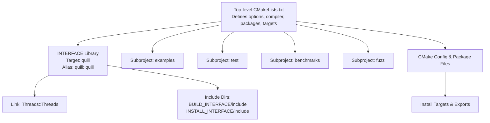
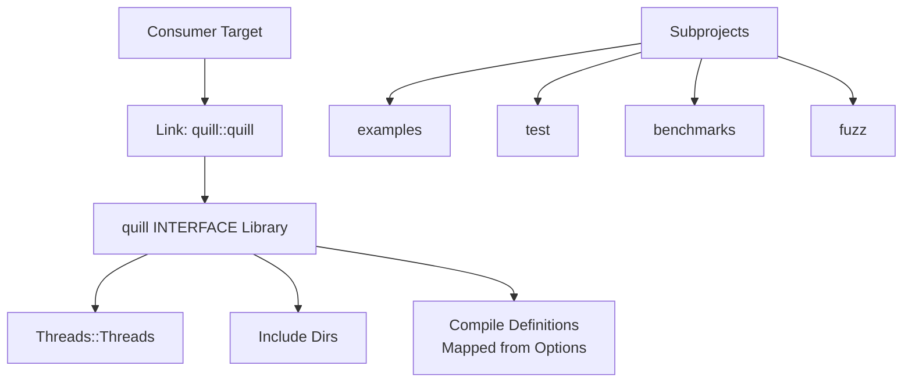
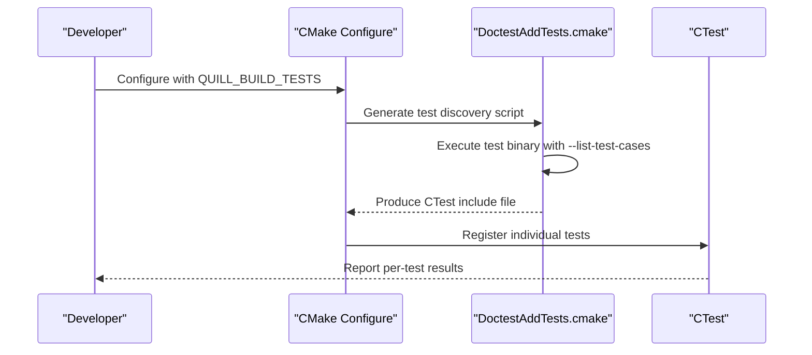
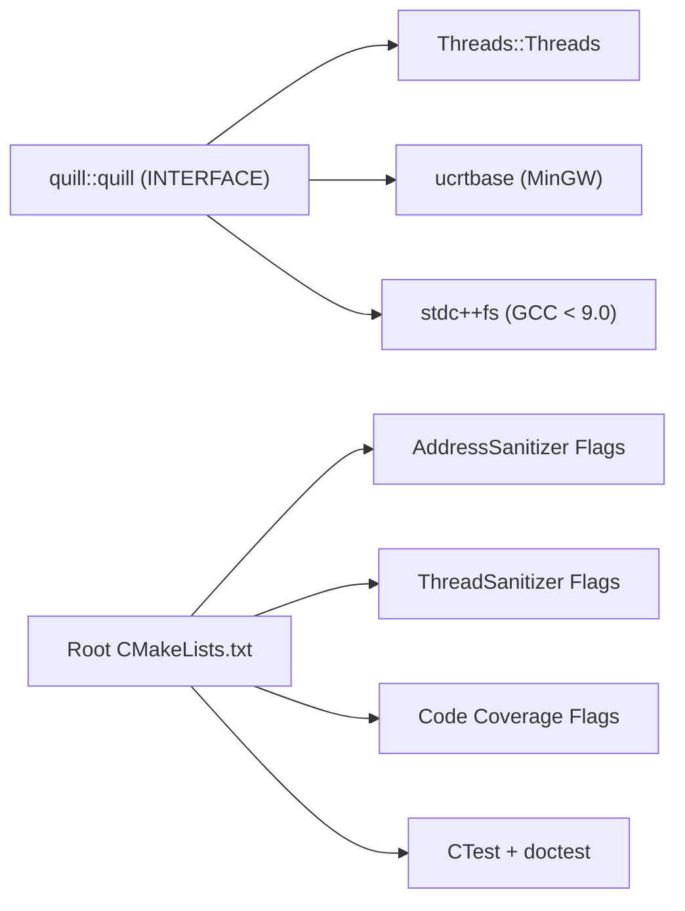

# CMake Integration

<cite>
**Referenced Files in This Document**
- [CMakeLists.txt](file://CMakeLists.txt)
- [cmake/QuillUtils.cmake](file://cmake/QuillUtils.cmake)
- [cmake/CodeCoverage.cmake](file://cmake/CodeCoverage.cmake)
- [cmake/Doctest.cmake](file://cmake/Doctest.cmake)
- [cmake/DoctestAddTests.cmake](file://cmake/DoctestAddTests.cmake)
- [cmake/quill-config.cmake.in](file://cmake/quill-config.cmake.in)
- [cmake/quill.pc.in](file://cmake/quill.pc.in)
- [examples/recommended_usage/quill_static_lib/CMakeLists.txt](file://examples/recommended_usage/quill_static_lib/CMakeLists.txt)
- [examples/shared_library/quill_shared_lib/CMakeLists.txt](file://examples/shared_library/quill_shared_lib/CMakeLists.txt)
- [test/CMakeLists.txt](file://test/CMakeLists.txt)
- [benchmarks/CMakeLists.txt](file://benchmarks/CMakeLists.txt)
</cite>

## Table of Contents
1. [Introduction](#introduction)
2. [Project Structure](#project-structure)
3. [Core Components](#core-components)
4. [Architecture Overview](#architecture-overview)
5. [Detailed Component Analysis](#detailed-component-analysis)
6. [Dependency Analysis](#dependency-analysis)
7. [Performance Considerations](#performance-considerations)
8. [Troubleshooting Guide](#troubleshooting-guide)
9. [Conclusion](#conclusion)
10. [Appendices](#appendices)

## Introduction
This document explains how to integrate Quill into CMake-based projects. It covers all available CMake options, compiler requirements, dependency management, platform-specific configurations, the INTERFACE library approach, target creation and installation, advanced build options (sanitizers, code coverage, fuzzing, testing), and practical integration examples for static and shared libraries. It also provides troubleshooting guidance for common configuration issues and version compatibility.

## Project Structure
Quill’s top-level CMake configuration defines a primary INTERFACE library target named quill and a public alias quill::quill. It exposes compile definitions and platform-specific link dependencies, and supports optional subprojects for examples, tests, benchmarks, and fuzzing. Utility modules provide standardized compiler options and test discovery helpers.

**Diagram sources**
- [CMakeLists.txt:1-451](file://CMakeLists.txt#L1-L451)
- [cmake/quill-config.cmake.in:1-6](file://cmake/quill-config.cmake.in#L1-L6)
- [cmake/quill.pc.in:1-10](file://cmake/quill.pc.in#L1-L10)

**Section sources**
- [CMakeLists.txt:1-451](file://CMakeLists.txt#L1-L451)

## Core Components
- INTERFACE library target quill with alias quill::quill
- Public compile definitions mapped to CMake options
- Platform-specific link dependencies (Threads, ucrtbase on MinGW, stdc++fs for old GCC)
- Optional subprojects for examples, tests, benchmarks, and fuzzing
- CMake package configuration and install/export targets

Key behaviors:
- C++ standard requirement is C++17 or newer
- Threads package is required
- Optional sanitizers, code coverage, and fuzzing support
- Install procedure generates quill-config.cmake and exports targets with namespace quill::

**Section sources**
- [CMakeLists.txt:1-451](file://CMakeLists.txt#L1-L451)
- [cmake/quill-config.cmake.in:1-6](file://cmake/quill-config.cmake.in#L1-L6)
- [cmake/quill.pc.in:1-10](file://cmake/quill.pc.in#L1-L10)

## Architecture Overview
Quill’s CMake architecture centers on a single INTERFACE library that propagates compile definitions and include directories to consumers. Consumers link against quill::quill, which internally links Threads::Threads and applies platform-specific adjustments. Optional subprojects can be included to build examples, tests, benchmarks, or fuzzers.

**Diagram sources**
- [CMakeLists.txt:291-357](file://CMakeLists.txt#L291-L357)
- [cmake/quill-config.cmake.in:1-6](file://cmake/quill-config.cmake.in#L1-L6)

## Detailed Component Analysis

### Build Options and Compile Definitions
Quill exposes numerous CMake options that map to preprocessor definitions on the quill INTERFACE target. Enabling an option adds a corresponding compile definition to quill and quill::quill.

- QUILL_NO_EXCEPTIONS
- QUILL_NO_THREAD_NAME_SUPPORT
- QUILL_USE_SEQUENTIAL_THREAD_ID
- QUILL_X86ARCH
- QUILL_DISABLE_NON_PREFIXED_MACROS
- QUILL_DISABLE_FUNCTION_NAME
- QUILL_DETAILED_FUNCTION_NAME
- QUILL_DISABLE_FILE_INFO
- QUILL_ENABLE_ASSERTIONS

These are applied conditionally when the corresponding CMake option is ON.

Additional toggles:
- QUILL_BUILD_EXAMPLES, QUILL_BUILD_TESTS, QUILL_BUILD_BENCHMARKS, QUILL_BUILD_FUZZING
- QUILL_SANITIZE_ADDRESS, QUILL_SANITIZE_THREAD
- QUILL_CODE_COVERAGE
- QUILL_USE_VALGRIND
- QUILL_ENABLE_INSTALL
- QUILL_DOCS_GEN

Compiler flags:
- AddressSanitizer and ThreadSanitizer flags are appended when enabled
- Code coverage flags are appended when enabled

Notes:
- QUILL_BUILD_FUZZING requires Clang compiler
- QUILL_ENABLE_EXTENSIVE_TESTS requires QUILL_BUILD_TESTS
- QUILL_DOCS_GEN requires QUILL_BUILD_EXAMPLES

**Section sources**
- [CMakeLists.txt:8-46](file://CMakeLists.txt#L8-L46)
- [CMakeLists.txt:145-159](file://CMakeLists.txt#L145-L159)
- [CMakeLists.txt:295-329](file://CMakeLists.txt#L295-L329)

### Compiler Requirements and Toolchain
- Minimum C++ standard is C++17. If CMAKE_CXX_STANDARD is set below 17, configuration fails with a fatal error.
- Threads package is required and linked to the quill target.
- On MinGW, ucrtbase is linked for time formatting support.
- On old GCC (< 9.0), stdc++fs is linked for filesystem support.
- On MSVC with QUILL_NO_EXCEPTIONS, exception handling flags are adjusted.

Warnings and hardening:
- A reusable function sets common compiler warnings and hardening flags for Clang, AppleClang, and GCC, with platform-specific exceptions.
- MSVC flags differ depending on exception mode.

**Section sources**
- [CMakeLists.txt:81-88](file://CMakeLists.txt#L81-L88)
- [CMakeLists.txt](file://CMakeLists.txt#L93)
- [CMakeLists.txt:339-346](file://CMakeLists.txt#L339-L346)
- [cmake/QuillUtils.cmake:28-94](file://cmake/QuillUtils.cmake#L28-L94)

### Platform-Specific Configurations
- Windows: ucrtbase linkage on MinGW; MSVC exception model adjusted when exceptions are disabled; visibility and export macros for shared library builds.
- Unix-like systems: pthread linkage handled via pkg-config template and exported targets.

**Section sources**
- [CMakeLists.txt:339-346](file://CMakeLists.txt#L339-L346)
- [CMakeLists.txt:381-385](file://CMakeLists.txt#L381-L385)
- [cmake/quill.pc.in:1-10](file://cmake/quill.pc.in#L1-L10)

### INTERFACE Library Approach and Target Creation
- The quill target is declared as an INTERFACE library and aliased as quill::quill.
- Header files are optionally exposed via target_sources for supported CMake versions.
- Include directories are exported for both build and install interfaces.
- Compiler options include suppressing a specific Clang warning for variadic macros.
- Link dependencies include Threads::Threads and platform-specific libraries.

**Section sources**
- [CMakeLists.txt:291-357](file://CMakeLists.txt#L291-L357)

### Installation and Package Configuration
- When configured as the master project or when QUILL_ENABLE_INSTALL is ON, the project installs:
  - quill-config.cmake and version file
  - Headers under include/
  - Library target (exported with namespace quill::)
  - pkg-config file (quill.pc) with version and flags
- CPack packaging is configured for distribution.

**Section sources**
- [CMakeLists.txt:358-442](file://CMakeLists.txt#L358-L442)
- [cmake/quill-config.cmake.in:1-6](file://cmake/quill-config.cmake.in#L1-L6)
- [cmake/quill.pc.in:1-10](file://cmake/quill.pc.in#L1-L10)

### Advanced Build Options
- Sanitizers:
  - AddressSanitizer and UndefinedBehaviorSanitizer flags are appended when QUILL_SANITIZE_ADDRESS is ON.
  - ThreadSanitizer flags are appended when QUILL_SANITIZE_THREAD is ON.
- Code Coverage:
  - QUILL_CODE_COVERAGE appends coverage flags.
  - A dedicated module provides coverage setup and reporting targets.
- Fuzzing:
  - QUILL_BUILD_FUZZING enables fuzzing with libFuzzer and sanitizers; requires Clang.
- Testing:
  - QUILL_BUILD_TESTS enables CTest and optional Valgrind usage.
  - A doctest integration module discovers tests at build time and registers them with CTest.

**Section sources**
- [CMakeLists.txt:145-159](file://CMakeLists.txt#L145-L159)
- [CMakeLists.txt:174-180](file://CMakeLists.txt#L174-L180)
- [cmake/CodeCoverage.cmake:100-157](file://cmake/CodeCoverage.cmake#L100-L157)
- [cmake/Doctest.cmake:108-183](file://cmake/Doctest.cmake#L108-L183)
- [cmake/DoctestAddTests.cmake:27-120](file://cmake/DoctestAddTests.cmake#L27-L120)

### Practical Integration Examples

#### Static Library Integration
- Create a static library target and link PUBLIC quill::quill.
- Optionally apply common compile options via the utility function.
- Example demonstrates include directories and linking.

**Section sources**
- [examples/recommended_usage/quill_static_lib/CMakeLists.txt:1-18](file://examples/recommended_usage/quill_static_lib/CMakeLists.txt#L1-L18)

#### Shared Library Integration
- Create a shared library target and link PUBLIC quill::quill.
- Apply -fvisibility=hidden for GCC/Clang on non-Windows platforms.
- Define QUILL_DLL_EXPORT on Windows when building the shared library.
- Example demonstrates include directories, visibility, and export define.

**Section sources**
- [examples/shared_library/quill_shared_lib/CMakeLists.txt:1-28](file://examples/shared_library/quill_shared_lib/CMakeLists.txt#L1-L28)

#### Integrating Subprojects
- Examples: Enabled by QUILL_BUILD_EXAMPLES; adds examples and docs/examples subdirectories.
- Tests: Enabled by QUILL_BUILD_TESTS; adds unit and integration tests.
- Benchmarks: Enabled by QUILL_BUILD_BENCHMARKS; adds latency, throughput, and compile-time benchmarks.
- Fuzzing: Enabled by QUILL_BUILD_FUZZING; adds fuzz subdirectory.

**Section sources**
- [CMakeLists.txt:161-180](file://CMakeLists.txt#L161-L180)
- [test/CMakeLists.txt:1-2](file://test/CMakeLists.txt#L1-L2)
- [benchmarks/CMakeLists.txt:1-3](file://benchmarks/CMakeLists.txt#L1-L3)

### API Workflow: Test Discovery with doctest

**Diagram sources**
- [cmake/Doctest.cmake:108-183](file://cmake/Doctest.cmake#L108-L183)
- [cmake/DoctestAddTests.cmake:27-120](file://cmake/DoctestAddTests.cmake#L27-L120)

## Dependency Analysis
Quill’s CMake target depends on:
- Threads package (always)
- Platform-specific libraries (ucrtbase on MinGW, stdc++fs for old GCC)
- Optional: sanitizers, code coverage, fuzzing, and testing infrastructure

**Diagram sources**
- [CMakeLists.txt:337-346](file://CMakeLists.txt#L337-L346)
- [CMakeLists.txt:145-159](file://CMakeLists.txt#L145-L159)
- [cmake/Doctest.cmake:108-183](file://cmake/Doctest.cmake#L108-L183)

**Section sources**
- [CMakeLists.txt:337-346](file://CMakeLists.txt#L337-L346)
- [cmake/Doctest.cmake:108-183](file://cmake/Doctest.cmake#L108-L183)

## Performance Considerations
- Prefer Release builds by default for production usage.
- Use QUILL_X86ARCH to enable x86-specific optimizations; ensure -march is set accordingly.
- Avoid excessive warnings or hardening flags in performance-sensitive builds unless needed.
- Code coverage and sanitizers introduce overhead; enable only during development or CI stages.

## Troubleshooting Guide
Common issues and resolutions:
- C++ standard too low:
  - Symptom: Configuration fails with a fatal error.
  - Fix: Set CMAKE_CXX_STANDARD to 17 or higher.
- QUILL_BUILD_TESTS enabled without QUILL_ENABLE_EXTENSIVE_TESTS:
  - Symptom: Fatal error when enabling extensive tests without enabling tests.
  - Fix: Enable QUILL_BUILD_TESTS first.
- QUILL_DOCS_GEN enabled without QUILL_BUILD_EXAMPLES:
  - Symptom: Fatal error requiring examples to be enabled.
  - Fix: Enable QUILL_BUILD_EXAMPLES.
- QUILL_BUILD_FUZZING enabled with non-Clang:
  - Symptom: Fatal error requiring Clang.
  - Fix: Switch to a Clang compiler.
- MinGW time formatting:
  - Symptom: Incorrect time formatting.
  - Fix: Ensure ucrtbase is linked (automatic via INTERFACE library).
- Old GCC filesystem:
  - Symptom: Link errors for filesystem features.
  - Fix: Ensure stdc++fs is linked (automatic via INTERFACE library).
- MSVC exception model:
  - Symptom: Unexpected exception handling behavior.
  - Fix: When QUILL_NO_EXCEPTIONS is ON, MSVC flags are adjusted accordingly.

**Section sources**
- [CMakeLists.txt:85-88](file://CMakeLists.txt#L85-L88)
- [CMakeLists.txt:114-116](file://CMakeLists.txt#L114-L116)
- [CMakeLists.txt:444-447](file://CMakeLists.txt#L444-L447)
- [CMakeLists.txt:175-177](file://CMakeLists.txt#L175-L177)
- [CMakeLists.txt](file://CMakeLists.txt#L341)
- [CMakeLists.txt](file://CMakeLists.txt#L345)
- [cmake/QuillUtils.cmake:78-93](file://cmake/QuillUtils.cmake#L78-L93)

## Conclusion
Quill’s CMake integration provides a clean, portable INTERFACE library with comprehensive configuration options, robust platform handling, and optional advanced features for testing, sanitization, and coverage. By linking against quill::quill, consumers inherit all necessary compile definitions, include paths, and platform-specific dependencies. The provided examples demonstrate straightforward integration for static and shared libraries, while the subproject system supports building and installing examples, tests, benchmarks, and fuzzers as needed.

## Appendices

### Appendix A: Option-to-Definition Mapping
- QUILL_NO_EXCEPTIONS → -DQUILL_NO_EXCEPTIONS
- QUILL_NO_THREAD_NAME_SUPPORT → -DQUILL_NO_THREAD_NAME_SUPPORT
- QUILL_USE_SEQUENTIAL_THREAD_ID → -DQUILL_USE_SEQUENTIAL_THREAD_ID
- QUILL_X86ARCH → -DQUILL_X86ARCH
- QUILL_DISABLE_NON_PREFIXED_MACROS → -DQUILL_DISABLE_NON_PREFIXED_MACROS
- QUILL_DISABLE_FUNCTION_NAME → -DQUILL_DISABLE_FUNCTION_NAME
- QUILL_DETAILED_FUNCTION_NAME → -DQUILL_DETAILED_FUNCTION_NAME
- QUILL_DISABLE_FILE_INFO → -DQUILL_DISABLE_FILE_INFO
- QUILL_ENABLE_ASSERTIONS → -DQUILL_ENABLE_ASSERTIONS

**Section sources**
- [CMakeLists.txt:295-329](file://CMakeLists.txt#L295-L329)

### Appendix B: Compiler and Platform Notes
- C++17 minimum enforced.
- Threads package required.
- MinGW: ucrtbase linked automatically.
- GCC < 9.0: stdc++fs linked automatically.
- MSVC: exception model adjusted when QUILL_NO_EXCEPTIONS is ON.

**Section sources**
- [CMakeLists.txt:81-88](file://CMakeLists.txt#L81-L88)
- [CMakeLists.txt](file://CMakeLists.txt#L93)
- [CMakeLists.txt:339-346](file://CMakeLists.txt#L339-L346)
- [cmake/QuillUtils.cmake:78-93](file://cmake/QuillUtils.cmake#L78-L93)