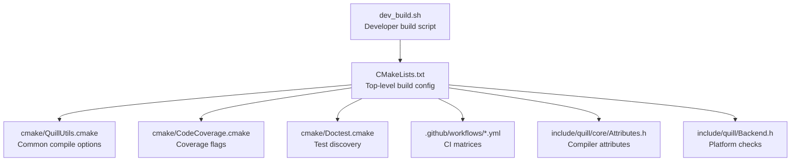
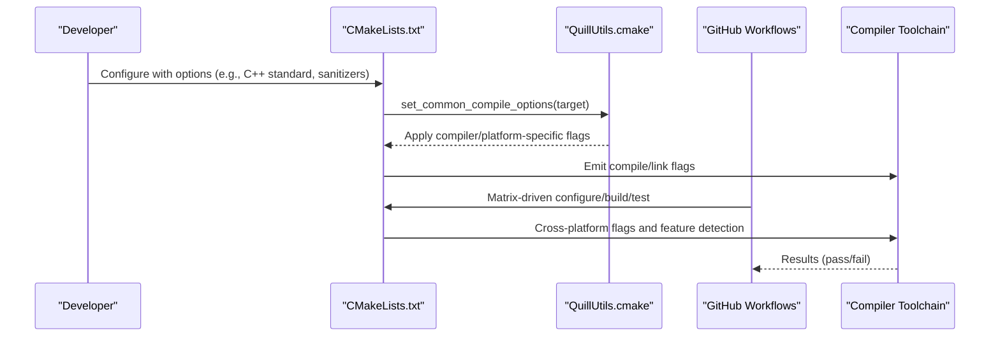
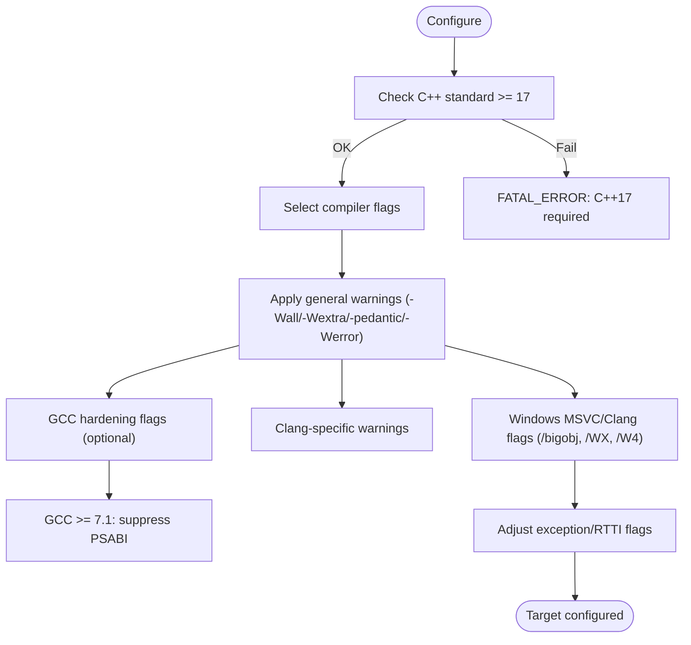
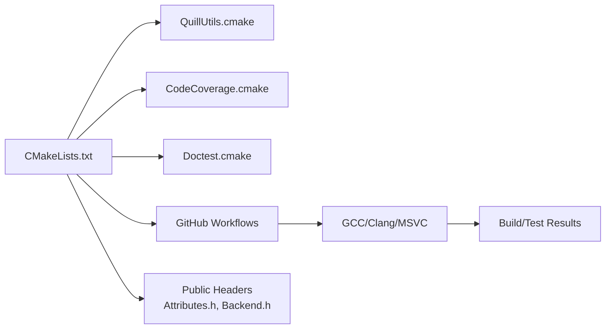

# Compiler Compatibility

<cite>
**Referenced Files in This Document**
- [CMakeLists.txt](file://CMakeLists.txt)
- [QuillUtils.cmake](file://cmake/QuillUtils.cmake)
- [CodeCoverage.cmake](file://cmake/CodeCoverage.cmake)
- [Doctest.cmake](file://cmake/Doctest.cmake)
- [dev_build.sh](file://dev_build.sh)
- [gcc15.yml](file://.github/workflows/gcc15.yml)
- [ubuntu.yml](file://.github/workflows/ubuntu.yml)
- [windows.yml](file://.github/workflows/windows.yml)
- [macos.yml](file://.github/workflows/macos.yml)
- [fuzz.yml](file://.github/workflows/fuzz.yml)
- [coverage.yml](file://.github/workflows/coverage.yml)
- [Attributes.h](file://include/quill/core/Attributes.h)
- [Backend.h](file://include/quill/Backend.h)
</cite>

## Table of Contents
1. [Introduction](#introduction)
2. [Project Structure](#project-structure)
3. [Core Components](#core-components)
4. [Architecture Overview](#architecture-overview)
5. [Detailed Component Analysis](#detailed-component-analysis)
6. [Dependency Analysis](#dependency-analysis)
7. [Performance Considerations](#performance-considerations)
8. [Troubleshooting Guide](#troubleshooting-guide)
9. [Conclusion](#conclusion)
10. [Appendices](#appendices)

## Introduction
This document describes compiler compatibility for Quill, focusing on supported compilers, C++ standard compliance, compiler-specific features, optimizations, warnings, platform adaptations, CMake detection and feature detection, build flags, performance tuning, CI cross-platform configuration, and troubleshooting. It synthesizes configuration from CMake, CI workflows, and platform adaptation headers to provide a practical guide for building Quill across GCC, Clang, and MSVC on Linux, macOS, Windows, and FreeBSD.

## Project Structure
Quill’s compiler compatibility is primarily governed by:
- Top-level CMake configuration enforcing C++17 and selecting compiler-specific flags
- A reusable CMake utility module for common compile options and feature detection
- Continuous integration workflows validating builds across compilers and platforms
- Platform adaptation macros and attributes in headers

**Diagram sources**
- [CMakeLists.txt:1-451](file://CMakeLists.txt#L1-L451)
- [QuillUtils.cmake:1-111](file://cmake/QuillUtils.cmake#L1-L111)
- [CodeCoverage.cmake:1-158](file://cmake/CodeCoverage.cmake#L1-L158)
- [Doctest.cmake:1-190](file://cmake/Doctest.cmake#L1-L190)
- [Attributes.h:42-154](file://include/quill/core/Attributes.h#L42-L154)
- [Backend.h:87-119](file://include/quill/Backend.h#L87-L119)
- [dev_build.sh:1-118](file://dev_build.sh#L1-L118)

**Section sources**
- [CMakeLists.txt:1-451](file://CMakeLists.txt#L1-L451)
- [QuillUtils.cmake:1-111](file://cmake/QuillUtils.cmake#L1-L111)
- [CodeCoverage.cmake:1-158](file://cmake/CodeCoverage.cmake#L1-L158)
- [Doctest.cmake:1-190](file://cmake/Doctest.cmake#L1-L190)
- [dev_build.sh:1-118](file://dev_build.sh#L1-L118)

## Core Components
- C++ standard enforcement: CMake enforces C++17 by default and rejects lower standards.
- Compiler selection and flags:
  - General warnings and error-on-warning policies for Clang/AppleClang/GCC (non-Windows).
  - Compiler-specific flags: GCC hardening, Clang-specific warnings, Windows MSVC/Clang flags.
  - Exception/RTTI toggles for MSVC and other compilers.
- Feature detection:
  - Utility function probes for atomic availability.
- Sanitizers and coverage:
  - AddressSanitizer, ThreadSanitizer, and code coverage flags.
- Platform adaptations:
  - MinGW linking adjustments and filesystem library linkage for older GCC.
  - Conditional platform checks in public headers.

**Section sources**
- [CMakeLists.txt:78-88](file://CMakeLists.txt#L78-L88)
- [CMakeLists.txt:145-159](file://CMakeLists.txt#L145-L159)
- [CMakeLists.txt:339-346](file://CMakeLists.txt#L339-L346)
- [QuillUtils.cmake:28-94](file://cmake/QuillUtils.cmake#L28-L94)
- [QuillUtils.cmake:96-111](file://cmake/QuillUtils.cmake#L96-L111)

## Architecture Overview
The build-time compiler compatibility architecture centers on CMake conditionals and a shared utility module. CI matrices validate multiple compilers and standards across platforms.

**Diagram sources**
- [CMakeLists.txt:78-88](file://CMakeLists.txt#L78-L88)
- [CMakeLists.txt:145-159](file://CMakeLists.txt#L145-L159)
- [CMakeLists.txt:339-346](file://CMakeLists.txt#L339-L346)
- [QuillUtils.cmake:28-94](file://cmake/QuillUtils.cmake#L28-L94)
- [ubuntu.yml:28-76](file://.github/workflows/ubuntu.yml#L28-L76)
- [windows.yml:25-52](file://.github/workflows/windows.yml#L25-L52)
- [gcc15.yml:28-35](file://.github/workflows/gcc15.yml#L28-L35)

## Detailed Component Analysis

### C++ Standard and Minimum Requirements
- Quill requires C++17 by default. If a lower standard is requested, configuration fails early.
- CI validates C++17 and higher standards (e.g., C++20, C++23) across compilers.

**Section sources**
- [CMakeLists.txt:81-88](file://CMakeLists.txt#L81-L88)
- [ubuntu.yml:32-33](file://.github/workflows/ubuntu.yml#L32-L33)
- [gcc15.yml:33-33](file://.github/workflows/gcc15.yml#L33-L33)

### Compiler-Specific Flags and Warnings
- General warnings and error-on-warning:
  - Clang/AppleClang/GCC (non-Windows): broad warning flags and -Werror.
- GCC-specific hardening and security flags:
  - Stack protection, stack clash protection, format hardening, CF protection, date-time, and fortified source.
- GCC >= 7.1:
  - Suppresses PSABI warning.
- Clang-specific:
  - Additional Clang diagnostics and suppression of specific extension warnings for recent Clang versions.
- Windows:
  - MSVC/Clang: /bigobj, /WX, /W4; MSVC exception model adjusted when exceptions disabled.

**Diagram sources**
- [CMakeLists.txt:78-88](file://CMakeLists.txt#L78-L88)
- [QuillUtils.cmake:37-94](file://cmake/QuillUtils.cmake#L37-L94)

**Section sources**
- [QuillUtils.cmake:37-94](file://cmake/QuillUtils.cmake#L37-L94)
- [CMakeLists.txt:354-357](file://CMakeLists.txt#L354-L357)

### Compiler-Specific Optimizations and Intrinsics
- x86 architecture optimizations:
  - Option to enable x86-specific prefetch/clflush instructions via a dedicated compile definition.
  - Requires explicit architecture targeting (e.g., -march) when enabled.
- Compiler attributes and portability:
  - Attributes for nodiscard, unused, hot/cold, likely/unlikely, and export visibility are adapted across compilers and platforms.

**Section sources**
- [CMakeLists.txt:14](file://CMakeLists.txt#L14)
- [CMakeLists.txt:307-309](file://CMakeLists.txt#L307-L309)
- [Attributes.h:70-154](file://include/quill/core/Attributes.h#L70-L154)

### Platform Adaptations
- MinGW:
  - Links against ucrtbase for proper time formatting.
- Older GCC (< 9):
  - Links stdc++fs for filesystem support.
- Public headers:
  - Platform checks for Windows vs. POSIX behavior in backend APIs.

**Section sources**
- [CMakeLists.txt:339-346](file://CMakeLists.txt#L339-L346)
- [Backend.h:87-119](file://include/quill/Backend.h#L87-L119)

### Sanitizers, Coverage, and Static Analysis Integration
- AddressSanitizer and ThreadSanitizer:
  - Flags applied conditionally; TSan may report false positives with non-Clang compilers.
- Code coverage:
  - Dedicated CMake module enforces compiler compatibility (GCC/Clang) and sets coverage flags.
- Static analysis:
  - CI integrates Clang static analysis and AddressSanitizer/UndefinedBehaviorSanitizer for fuzzing.

**Section sources**
- [CMakeLists.txt:145-159](file://CMakeLists.txt#L145-L159)
- [CodeCoverage.cmake:100-158](file://cmake/CodeCoverage.cmake#L100-L158)
- [fuzz.yml:63-65](file://.github/workflows/fuzz.yml#L63-L65)

### CMake Compiler Detection, Feature Detection, and Fallbacks
- Compiler detection:
  - Uses CMAKE_CXX_COMPILER_ID and version checks to apply flags.
- Feature detection:
  - Utility function probes for atomics availability.
- Fallbacks:
  - Older GCC links filesystem library; MinGW links ucrtbase.

**Section sources**
- [QuillUtils.cmake:96-111](file://cmake/QuillUtils.cmake#L96-L111)
- [CMakeLists.txt:339-346](file://CMakeLists.txt#L339-L346)

### Compiler-Specific Build Flags and Performance Tuning
- Developer-focused build:
  - Script demonstrates enabling examples, benchmarks, extensive tests, x86 optimizations, and exporting compile commands for editor tooling.
- CI matrices:
  - Ubuntu: GCC 8, 10, 13, 14, and Clang 14/21 with various standards and sanitizer/valgrind configurations.
  - Windows: MSVC and MinGW toolchains with exception/no-exception builds.
  - macOS: AppleClang with C++17/20.
  - GCC 15 containerized build.

**Section sources**
- [dev_build.sh:34-52](file://dev_build.sh#L34-L52)
- [ubuntu.yml:28-125](file://.github/workflows/ubuntu.yml#L28-L125)
- [windows.yml:25-78](file://.github/workflows/windows.yml#L25-L78)
- [macos.yml:25-57](file://.github/workflows/macos.yml#L25-L57)
- [gcc15.yml:26-28](file://.github/workflows/gcc15.yml#L26-L28)

### Cross-Platform Compilation and CI Setup
- CI covers:
  - Linux (Ubuntu) with GCC and Clang variants, sanitizers, valgrind, and hardened builds.
  - Windows (MSVC and MinGW) with exception/no-exception modes.
  - macOS with AppleClang.
  - Fuzzing with Clang and sanitizers.
  - Coverage reporting with GCC/Clang toolchains.
- Matrix strategies:
  - Multiple standards, build types, and optional features (e.g., QUILL_NO_EXCEPTIONS, QUILL_ENABLE_GCC_HARDENING).

**Section sources**
- [.github/workflows/ubuntu.yml:28-125](file://.github/workflows/ubuntu.yml#L28-L125)
- [.github/workflows/windows.yml:25-78](file://.github/workflows/windows.yml#L25-L78)
- [.github/workflows/macos.yml:25-57](file://.github/workflows/macos.yml#L25-L57)
- [.github/workflows/fuzz.yml:28-38](file://.github/workflows/fuzz.yml#L28-L38)
- [.github/workflows/coverage.yml:17-39](file://.github/workflows/coverage.yml#L17-L39)

### Compiler-Specific Testing Strategies
- Test discovery:
  - Doctest-based discovery supports cross-compilation scenarios and JUnit output.
- CI test runs:
  - Ubuntu matrix includes valgrind, ASan, TSan, and sanitizer-enabled builds.
  - Windows matrix includes MSVC and MinGW with tests.

**Section sources**
- [Doctest.cmake:107-183](file://cmake/Doctest.cmake#L107-L183)
- [ubuntu.yml:85-109](file://.github/workflows/ubuntu.yml#L85-L109)
- [windows.yml:53-78](file://.github/workflows/windows.yml#L53-L78)

## Dependency Analysis
Quill’s compiler compatibility relies on:
- CMakeLists.txt orchestrating standard enforcement, flags, and platform-specific linking.
- QuillUtils.cmake encapsulating portable warning/error policies and compiler-specific tweaks.
- CI workflows validating cross-compiler and cross-platform builds.

**Diagram sources**
- [CMakeLists.txt:1-451](file://CMakeLists.txt#L1-L451)
- [QuillUtils.cmake:1-111](file://cmake/QuillUtils.cmake#L1-L111)
- [CodeCoverage.cmake:1-158](file://cmake/CodeCoverage.cmake#L1-L158)
- [Doctest.cmake:1-190](file://cmake/Doctest.cmake#L1-L190)
- [Attributes.h:42-154](file://include/quill/core/Attributes.h#L42-L154)
- [Backend.h:87-119](file://include/quill/Backend.h#L87-L119)

**Section sources**
- [CMakeLists.txt:1-451](file://CMakeLists.txt#L1-L451)
- [QuillUtils.cmake:1-111](file://cmake/QuillUtils.cmake#L1-L111)
- [CodeCoverage.cmake:1-158](file://cmake/CodeCoverage.cmake#L1-L158)
- [Doctest.cmake:1-190](file://cmake/Doctest.cmake#L1-L190)

## Performance Considerations
- Compiler attributes:
  - Hot/cold and likely/unlikely attributes are conditionally applied to aid branch prediction and static analysis.
- x86 optimizations:
  - Optional x86-specific cache coherence hints; requires explicit architecture targeting.
- Sanitizers and coverage:
  - Introduce overhead; use selectively for diagnostics and CI.

**Section sources**
- [Attributes.h:104-148](file://include/quill/core/Attributes.h#L104-L148)
- [CMakeLists.txt:14](file://CMakeLists.txt#L14)
- [CMakeLists.txt:307-309](file://CMakeLists.txt#L307-L309)
- [CMakeLists.txt:145-159](file://CMakeLists.txt#L145-L159)

## Troubleshooting Guide
- C++ standard too low:
  - Symptom: Configuration fails with a fatal error requiring C++17 or higher.
  - Fix: Set CMAKE_CXX_STANDARD to 17 or higher.
  - Reference: [CMakeLists.txt:81-88](file://CMakeLists.txt#L81-L88)
- Clang-specific macro argument warning:
  - Symptom: Spurious warning about variadic macro arguments.
  - Fix: Quill applies a targeted suppression for Clang/AppleClang on non-Windows.
  - Reference: [QuillUtils.cmake:69-72](file://cmake/QuillUtils.cmake#L69-L72), [CMakeLists.txt:356](file://CMakeLists.txt#L356)
- MSVC exception model conflicts:
  - Symptom: Unexpected exception handling flags.
  - Fix: When QUILL_NO_EXCEPTIONS is enabled, Quill removes /EHsc and adds compiler flags to disable exceptions/RTTI for compatible toolchains.
  - Reference: [QuillUtils.cmake:78-93](file://cmake/QuillUtils.cmake#L78-L93)
- MinGW time formatting issues:
  - Symptom: Incorrect time formatting.
  - Fix: Quill links ucrtbase for MinGW to ensure correct formatting.
  - Reference: [CMakeLists.txt:339-342](file://CMakeLists.txt#L339-L342)
- Older GCC filesystem errors:
  - Symptom: Link errors related to filesystem support.
  - Fix: Quill links stdc++fs for GCC < 9.0.
  - Reference: [CMakeLists.txt:344-346](file://CMakeLists.txt#L344-L346)
- Fuzzing requires Clang:
  - Symptom: Fatal error when enabling fuzzing with non-Clang.
  - Fix: Use Clang as the compiler for QUILL_BUILD_FUZZING.
  - Reference: [CMakeLists.txt:174-178](file://CMakeLists.txt#L174-L178)
- Coverage unsupported compiler:
  - Symptom: Coverage target fails with a fatal error.
  - Fix: Use GCC or Clang for coverage builds.
  - Reference: [CodeCoverage.cmake:114-118](file://cmake/CodeCoverage.cmake#L114-L118)
- CI sanitizer false positives:
  - Symptom: TSan reports issues with non-Clang toolchains.
  - Fix: Prefer Clang for TSan; otherwise interpret results carefully.
  - Reference: [CMakeLists.txt:36](file://CMakeLists.txt#L36)

## Conclusion
Quill enforces C++17 and applies robust compiler- and platform-specific adaptations through CMake and a shared utility module. CI matrices validate compatibility across GCC, Clang, and MSVC on Linux, macOS, Windows, and FreeBSD, with optional sanitizers, coverage, and fuzzing. Developers can tune flags via CMake options and rely on automated checks to maintain cross-compiler stability.

## Appendices

### Appendix A: Supported Compilers and Standards
- GCC: Tested with 8, 10, 13, 14; hardened builds supported.
- Clang: Tested with 14, 21; sanitizer and fuzzing workflows use Clang.
- MSVC: Windows CI jobs validate MSVC builds; MinGW supported.
- Standards: C++17 enforced; C++20/23 validated in CI.

**Section sources**
- [ubuntu.yml:30-76](file://.github/workflows/ubuntu.yml#L30-L76)
- [windows.yml:25-52](file://.github/workflows/windows.yml#L25-L52)
- [gcc15.yml:26-28](file://.github/workflows/gcc15.yml#L26-L28)

### Appendix B: Key CMake Options and Their Effects
- QUILL_NO_EXCEPTIONS: Disables exceptions/RTTI and adjusts MSVC flags accordingly.
- QUILL_X86ARCH: Enables x86-specific optimizations (requires explicit -march).
- QUILL_SANITIZE_ADDRESS/THREAD: Adds sanitizer flags.
- QUILL_CODE_COVERAGE: Enables coverage flags and targets.
- QUILL_BUILD_FUZZING: Requires Clang; enables fuzzing build.
- QUILL_ENABLE_GCC_HARDENING: Applies GCC hardening flags (Linux).
- QUILL_USE_VALGRIND: Configures Valgrind for CTest.

**Section sources**
- [CMakeLists.txt:8-44](file://CMakeLists.txt#L8-L44)
- [CMakeLists.txt:145-159](file://CMakeLists.txt#L145-L159)
- [CMakeLists.txt:174-178](file://CMakeLists.txt#L174-L178)
- [QuillUtils.cmake:44-52](file://cmake/QuillUtils.cmake#L44-L52)