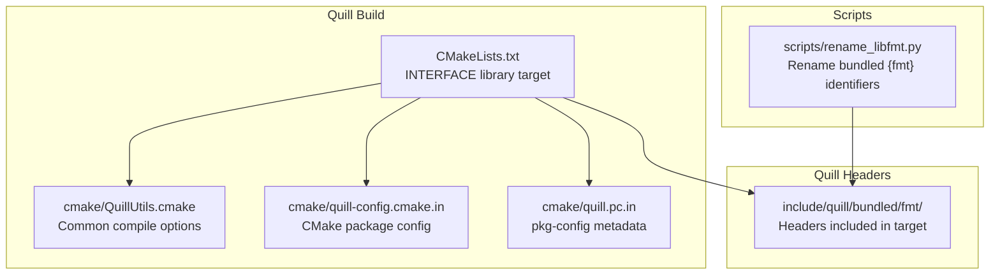
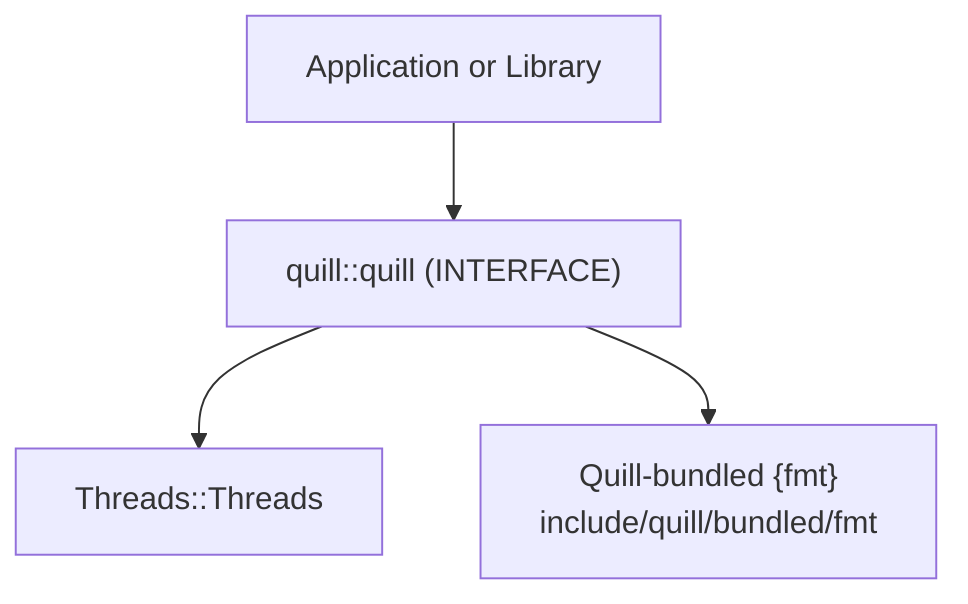
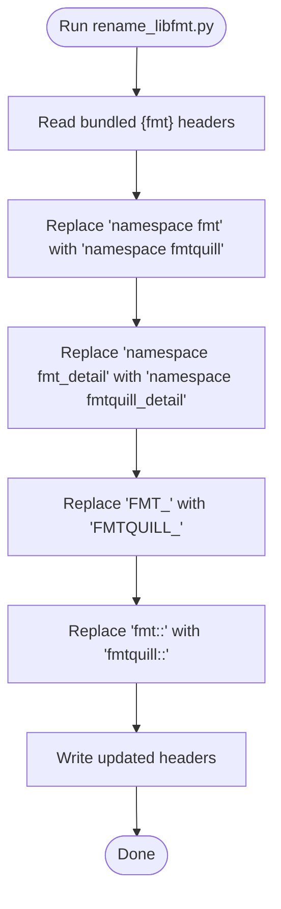
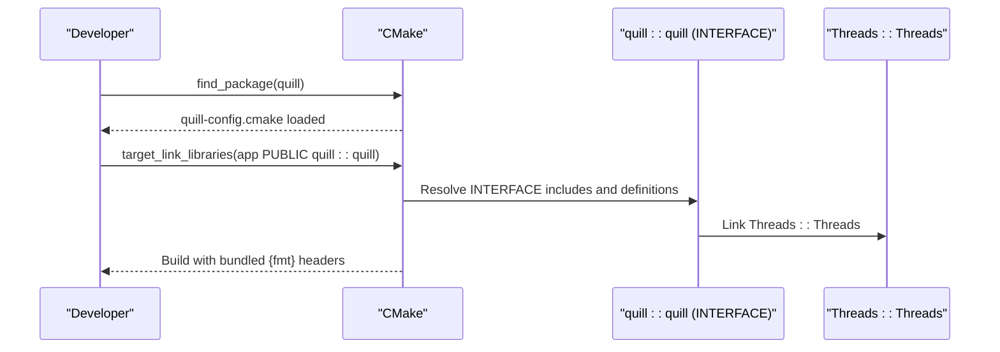
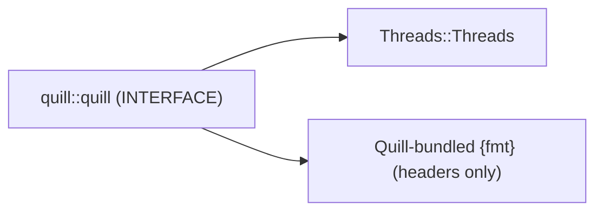

# Dependency Management

<cite>
**Referenced Files in This Document**
- [rename_libfmt.py](file://scripts/rename_libfmt.py)
- [CMakeLists.txt](file://CMakeLists.txt)
- [QuillUtils.cmake](file://cmake/QuillUtils.cmake)
- [quill-config.cmake.in](file://cmake/quill-config.cmake.in)
- [quill.pc.in](file://cmake/quill.pc.in)
- [format.h](file://include/quill/bundled/fmt/format.h)
- [base.h](file://include/quill/bundled/fmt/base.h)
- [installing.rst](file://docs/installing.rst)
- [README.md](file://README.md)
</cite>

## Table of Contents
1. [Introduction](#introduction)
2. [Project Structure](#project-structure)
3. [Core Components](#core-components)
4. [Architecture Overview](#architecture-overview)
5. [Detailed Component Analysis](#detailed-component-analysis)
6. [Dependency Analysis](#dependency-analysis)
7. [Performance Considerations](#performance-considerations)
8. [Troubleshooting Guide](#troubleshooting-guide)
9. [Conclusion](#conclusion)
10. [Appendices](#appendices)

## Introduction
This document explains how Quill manages dependencies, with a focus on the bundled {fmt} library. It covers the integration of the bundled {fmt}, strategies to avoid version and namespace conflicts with external {fmt} installations, and the role of the rename_libfmt.py script. It also documents integration with package managers (vcpkg, Conan, Meson WrapDB, etc.), dependency injection patterns via CMake, and practical guidance for resolving conflicts and ensuring ABI compatibility across multi-library projects.

## Project Structure
Quill ships a self-contained copy of {fmt} under include/quill/bundled/fmt. The build system exposes Quill as a CMake INTERFACE library and installs CMake and pkg-config metadata to support downstream consumption. Package manager documentation is provided alongside the repository.

**Diagram sources**
- [CMakeLists.txt](file://CMakeLists.txt)
- [QuillUtils.cmake](file://cmake/QuillUtils.cmake)
- [quill-config.cmake.in](file://cmake/quill-config.cmake.in)
- [quill.pc.in](file://cmake/quill.pc.in)
- [format.h](file://include/quill/bundled/fmt/format.h)
- [base.h](file://include/quill/bundled/fmt/base.h)
- [rename_libfmt.py](file://scripts/rename_libfmt.py)

**Section sources**
- [CMakeLists.txt](file://CMakeLists.txt)
- [QuillUtils.cmake](file://cmake/QuillUtils.cmake)
- [quill-config.cmake.in](file://cmake/quill-config.cmake.in)
- [quill.pc.in](file://cmake/quill.pc.in)
- [format.h](file://include/quill/bundled/fmt/format.h)
- [base.h](file://include/quill/bundled/fmt/base.h)
- [rename_libfmt.py](file://scripts/rename_libfmt.py)

## Core Components
- Bundled {fmt}: Quill includes a renamed copy of {fmt} under include/quill/bundled/fmt. The headers are explicitly listed in the INTERFACE library target, ensuring downstream consumers include the bundled headers without linking external {fmt}.
- CMake INTERFACE target: The library target is INTERFACE and links only to Threads::Threads. This avoids exposing external {fmt} linkage to consumers.
- CMake and pkg-config metadata: CMake package config and pkg-config files are generated and installed, simplifying discovery and linking.
- Package manager documentation: Installation commands for multiple package managers are documented in the repository.

Key implications:
- Consumers do not need to separately depend on {fmt}; Quill’s bundled {fmt} is used automatically.
- Downstream projects can safely coexist with their own {fmt} installations without symbol or namespace collisions.

**Section sources**
- [CMakeLists.txt](file://CMakeLists.txt)
- [format.h](file://include/quill/bundled/fmt/format.h)
- [base.h](file://include/quill/bundled/fmt/base.h)
- [quill-config.cmake.in](file://cmake/quill-config.cmake.in)
- [quill.pc.in](file://cmake/quill.pc.in)
- [installing.rst](file://docs/installing.rst)
- [README.md](file://README.md)

## Architecture Overview
The dependency architecture centers on bundling {fmt} and exposing Quill as a single, self-contained CMake target. Consumers either use the installed CMake package or add Quill as a subdirectory. In both cases, the INTERFACE library ensures that {fmt} symbols remain internal to Quill.

**Diagram sources**
- [CMakeLists.txt](file://CMakeLists.txt)
- [format.h](file://include/quill/bundled/fmt/format.h)

## Detailed Component Analysis

### Bundled {fmt} Namespace and Renaming
Quill renames the bundled {fmt} namespace and identifiers to avoid collisions. The rename_libfmt.py script performs bulk replacements of:
- Namespace: fmt → fmtquill
- Detail namespace: fmt_detail → fmtquill_detail
- Macro prefixes: FMT_ → FMTQUILL_
- Direct fmt:: references → fmtquill::

These changes are applied across the bundled headers to ensure a clean, isolated namespace.

**Diagram sources**
- [rename_libfmt.py](file://scripts/rename_libfmt.py)

**Section sources**
- [rename_libfmt.py](file://scripts/rename_libfmt.py)
- [format.h](file://include/quill/bundled/fmt/format.h)
- [base.h](file://include/quill/bundled/fmt/base.h)

### CMake Target and Dependency Injection
Quill exposes a single INTERFACE target quill::quill. Consumers link against this target, which:
- Adds include directories for Quill headers
- Links Threads::Threads
- Optionally defines compile-time feature flags exposed by Quill

Downstream projects can consume Quill via:
- find_package(quill) and target_link_libraries(your_target PUBLIC quill::quill)
- add_subdirectory(quill) and link against quill::quill

**Diagram sources**
- [CMakeLists.txt](file://CMakeLists.txt)
- [quill-config.cmake.in](file://cmake/quill-config.cmake.in)

**Section sources**
- [CMakeLists.txt](file://CMakeLists.txt)
- [quill-config.cmake.in](file://cmake/quill-config.cmake.in)

### Package Manager Integration
The repository documents installation via multiple package managers. Consumers can rely on the installed CMake package or system pkg-config metadata.

- vcpkg: vcpkg install quill
- Conan: conan install quill
- Meson WrapDB: meson wrap install quill
- Others: brew, conda, bazel_dep, xmake, nix, build2

**Section sources**
- [installing.rst](file://docs/installing.rst)
- [README.md](file://README.md)

## Dependency Analysis
Quill’s dependency model is intentionally minimal and self-contained:
- Internal dependency: Threads::Threads (required)
- External dependency: None (bundled {fmt} is included via headers and not linked as a separate library)
- Consumer-facing: INTERFACE library with no transitive {fmt} exposure

**Diagram sources**
- [CMakeLists.txt](file://CMakeLists.txt)

**Section sources**
- [CMakeLists.txt](file://CMakeLists.txt)

## Performance Considerations
- Including bundled headers: Since {fmt} is bundled as headers-only in the INTERFACE target, there is no additional shared library loading overhead.
- Symbol visibility: The bundled {fmt} symbols are confined to Quill’s translation units, minimizing global symbol footprint.
- ABI stability: Because {fmt} is bundled and not exposed to consumers, ABI conflicts with external {fmt} installations are avoided.

[No sources needed since this section provides general guidance]

## Troubleshooting Guide
Common issues and resolutions:

- Conflicts with external {fmt} installations
  - Symptom: Linker errors or unexpected symbol resolution.
  - Resolution: Ensure you link only quill::quill. The INTERFACE target includes bundled {fmt} headers and does not expose external {fmt} linkage. Verify that your project does not explicitly link against a system {fmt}.

- Namespace collisions
  - Symptom: Using fmt:: in your code leads to ambiguous or missing symbols.
  - Resolution: Quill’s bundled {fmt} uses fmtquill:: and related identifiers. Do not mix fmt:: and fmtquill:: in the same translation unit. If you need to format your own types, use fmtquill::formatter specializations within Quill’s headers.

- CMake configuration issues
  - Symptom: find_package(quill) fails or targets not found.
  - Resolution: Ensure the CMake package is installed or pass -DCMAKE_PREFIX_PATH to point to the installation directory. Confirm that Threads::Threads is available on your platform.

- pkg-config usage
  - Symptom: .pc file not found or missing pthread flags.
  - Resolution: Verify quill.pc is installed and that the generator sets the correct library path. On Unix-like systems, the pkg-config file includes pthread flags.

- Android NDK specifics
  - Symptom: Missing thread name support or clock source issues.
  - Resolution: Configure with -DQUILL_NO_THREAD_NAME_SUPPORT:BOOL=ON when needed. Use appropriate clock sources as documented.

**Section sources**
- [CMakeLists.txt](file://CMakeLists.txt)
- [quill-config.cmake.in](file://cmake/quill-config.cmake.in)
- [quill.pc.in](file://cmake/quill.pc.in)
- [README.md](file://README.md)

## Conclusion
Quill’s dependency strategy centers on bundling a renamed copy of {fmt} and exposing a minimal, self-contained CMake INTERFACE library. This approach eliminates version and namespace conflicts with external {fmt} installations, simplifies integration across package managers, and reduces the risk of ABI mismatches in multi-library projects.

[No sources needed since this section summarizes without analyzing specific files]

## Appendices

### Best Practices for Managing Dependencies in Multi-Library Projects
- Prefer consuming Quill via find_package(quill) or add_subdirectory to ensure consistent {fmt} usage.
- Avoid linking against system {fmt} when your project or its dependencies also use {fmt} to prevent symbol and ABI conflicts.
- If you must share formatting utilities across libraries, define your own formatter specializations and keep them scoped to your library’s headers.
- Keep feature flags consistent across the tree (e.g., QUILL_NO_EXCEPTIONS) to avoid mixing exception-enabled and exception-disabled code.

[No sources needed since this section provides general guidance]