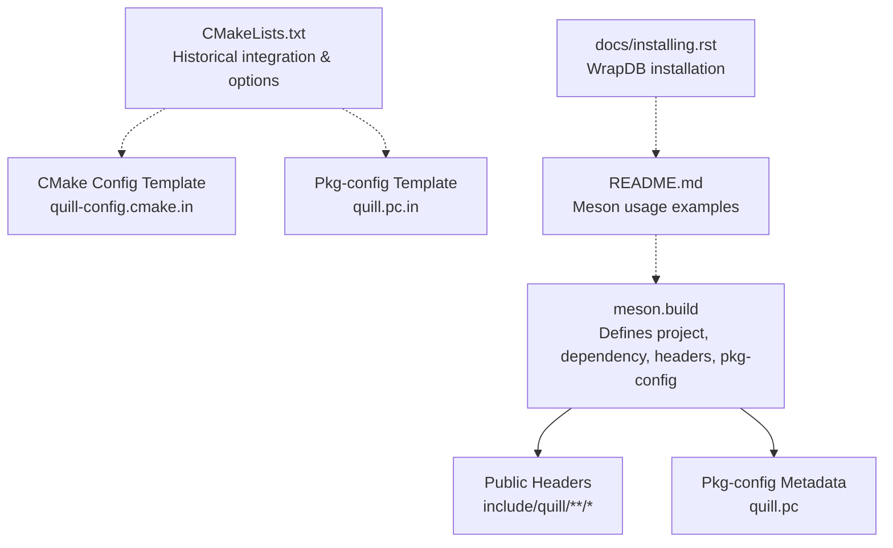
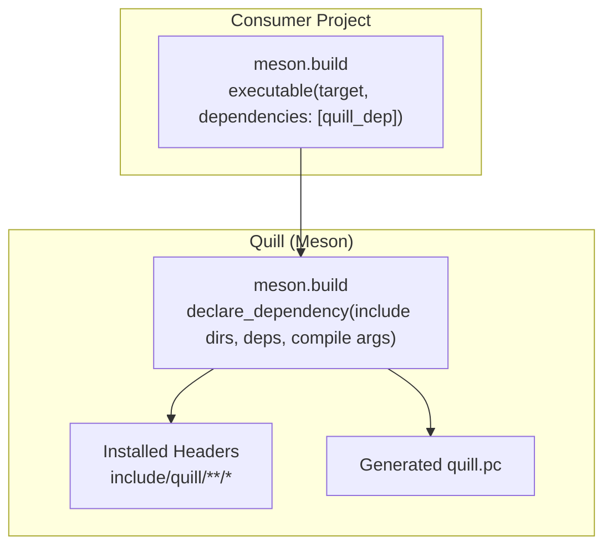
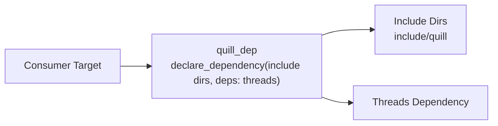

# Meson Build System

<cite>
**Referenced Files in This Document**
- [meson.build](file://meson.build)
- [README.md](file://README.md)
- [CMakeLists.txt](file://CMakeLists.txt)
- [cmake/quill-config.cmake.in](file://cmake/quill-config.cmake.in)
- [cmake/quill.pc.in](file://cmake/quill.pc.in)
- [cmake/QuillUtils.cmake](file://cmake/QuillUtils.cmake)
- [docs/installing.rst](file://docs/installing.rst)
- [CHANGELOG.md](file://CHANGELOG.md)
</cite>

## Table of Contents
1. [Introduction](#introduction)
2. [Project Structure](#project-structure)
3. [Core Components](#core-components)
4. [Architecture Overview](#architecture-overview)
5. [Detailed Component Analysis](#detailed-component-analysis)
6. [Dependency Analysis](#dependency-analysis)
7. [Performance Considerations](#performance-considerations)
8. [Troubleshooting Guide](#troubleshooting-guide)
9. [Conclusion](#conclusion)
10. [Appendices](#appendices)

## Introduction
This document explains how Quill integrates with the Meson build system. It covers the Meson project definition, dependency handling, target exposure via a Meson dependency object, installation of public headers, and pkg-config metadata generation. It also compares Meson and CMake integration patterns, highlights Meson-specific compiler flags, and provides practical integration steps for Meson projects, including subproject usage and WrapDB consumption. Guidance on migrating from CMake to Meson and best practices for Meson-based Quill integration is included.

## Project Structure
Quill’s Meson integration centers on a single top-level build definition that declares the project, exposes a dependency object for consumers, installs public headers, and generates pkg-config metadata. The repository also includes CMake integration for comparison and historical context.

**Diagram sources**
- [meson.build:1-20](file://meson.build#L1-L20)
- [CMakeLists.txt:1-451](file://CMakeLists.txt#L1-L451)
- [cmake/quill-config.cmake.in:1-6](file://cmake/quill-config.cmake.in#L1-L6)
- [cmake/quill.pc.in:1-10](file://cmake/quill.pc.in#L1-L10)
- [README.md:643-661](file://README.md#L643-L661)
- [docs/installing.rst:15](file://docs/installing.rst#L15)

**Section sources**
- [meson.build:1-20](file://meson.build#L1-L20)
- [README.md:643-661](file://README.md#L643-L661)
- [docs/installing.rst:15](file://docs/installing.rst#L15)

## Core Components
- Project definition and defaults
  - Declares the project with C++ language support, version, and default options including warning level and C++ standard.
  - References the public include directory for consumers.
- Dependency object
  - Exposes a Meson dependency object that includes public include directories and links against the threading dependency.
  - Adds a compiler argument to suppress a specific warning for GNU compilers.
- Installation and packaging
  - Installs public headers under the standard include directory with a development install tag.
  - Generates pkg-config metadata for external tooling.

Key implementation references:
- [Project declaration and defaults](file://meson.build#L1)
- [Include directory setup](file://meson.build#L3)
- [Compiler argument for GNU](file://meson.build#L5)
- [Dependency object export:7-9](file://meson.build#L7-L9)
- [Header installation](file://meson.build#L11)
- [Pkg-config generation:13-19](file://meson.build#L13-L19)

**Section sources**
- [meson.build:1-20](file://meson.build#L1-L20)

## Architecture Overview
The Meson integration exposes a single dependency object to consumers. Consumers can either fetch Quill via Meson WrapDB or place the source under subprojects and use the provided dependency variable. The dependency encapsulates include directories and threading linkage, and pkg-config metadata is generated for compatibility with autotools-based toolchains.

**Diagram sources**
- [meson.build:7-19](file://meson.build#L7-L19)
- [README.md:655-661](file://README.md#L655-L661)

**Section sources**
- [meson.build:7-19](file://meson.build#L7-L19)
- [README.md:655-661](file://README.md#L655-L661)

## Detailed Component Analysis

### Meson Project Definition and Defaults
- Project metadata
  - Sets the project name, language, version, and default options including warning level and C++ standard.
- Include directories
  - Establishes the public include directory for consumers.
- Compiler argument
  - Adds a compiler argument to suppress a GNU-specific variadic macro warning for consumers.

References:
- [Project defaults](file://meson.build#L1)
- [Include directory](file://meson.build#L3)
- [GNU warning suppression](file://meson.build#L5)

**Section sources**
- [meson.build:1-6](file://meson.build#L1-L6)

### Dependency Object Exposure
- Purpose
  - Provides a single dependency handle to consumers that includes public include directories and links against the threading dependency.
- Behavior
  - Consumers can retrieve the dependency via a variable exposed by the subproject or WrapDB and pass it to their targets.

References:
- [Dependency declaration:7-9](file://meson.build#L7-L9)
- [WrapDB/manual integration usage:655-661](file://README.md#L655-L661)

**Section sources**
- [meson.build:7-9](file://meson.build#L7-L9)
- [README.md:655-661](file://README.md#L655-L661)

### Header Installation and Pkg-config Generation
- Header installation
  - Installs public headers under the standard include directory with a development install tag.
- Pkg-config metadata
  - Generates a pkg-config file with name, description, version, and subdirectory metadata.

References:
- [Header installation](file://meson.build#L11)
- [Pkg-config generation:13-19](file://meson.build#L13-L19)

**Section sources**
- [meson.build:11-19](file://meson.build#L11-L19)

### Meson vs CMake Integration Patterns
- Quill as an INTERFACE library in CMake
  - CMake defines an INTERFACE library that aggregates public headers and sets compile definitions based on options.
  - Links against Threads and conditionally against platform-specific libraries.
  - Provides pkg-config and CMake package config artifacts.
- Quill as a Meson dependency object
  - Meson exposes a single dependency object that includes include directories and threading linkage.
  - No equivalent INTERFACE library concept; consumers receive a dependency handle directly.

References:
- [CMake INTERFACE library and options:292-357](file://CMakeLists.txt#L292-L357)
- [CMake pkg-config template:1-10](file://cmake/quill.pc.in#L1-L10)
- [CMake config template:1-6](file://cmake/quill-config.cmake.in#L1-L6)
- [Meson dependency object:7-9](file://meson.build#L7-L9)

**Section sources**
- [CMakeLists.txt:292-357](file://CMakeLists.txt#L292-L357)
- [cmake/quill.pc.in:1-10](file://cmake/quill.pc.in#L1-L10)
- [cmake/quill-config.cmake.in:1-6](file://cmake/quill-config.cmake.in#L1-L6)
- [meson.build:7-9](file://meson.build#L7-L9)

### Meson Integration Examples and Subproject Usage
- WrapDB usage
  - Consumers can install Quill from WrapDB and consume it directly.
- Manual subproject usage
  - Consumers can vendor Quill under subprojects and retrieve the dependency variable exposed by the subproject.

References:
- [WrapDB usage:645-651](file://README.md#L645-L651)
- [Manual subproject usage:655-661](file://README.md#L655-L661)
- [WrapDB installation command](file://docs/installing.rst#L15)

**Section sources**
- [README.md:645-661](file://README.md#L645-L661)
- [docs/installing.rst:15](file://docs/installing.rst#L15)

### Platform Adaptations and Compiler Settings
- Compiler argument for GNU
  - Meson adds a compiler argument to suppress a GNU-specific variadic macro warning.
- CMake equivalents
  - CMake applies similar suppression for Clang/AppleClang and defines compile definitions based on options.
  - Applies platform-specific linkages (e.g., MinGW UCRT, GCC stdc++fs) and Windows-specific flags.

References:
- [GNU warning suppression (Meson)](file://meson.build#L5)
- [CMake common compile options:28-94](file://cmake/QuillUtils.cmake#L28-L94)
- [CMake platform-specific linkages:339-346](file://CMakeLists.txt#L339-L346)

**Section sources**
- [meson.build:5](file://meson.build#L5)
- [cmake/QuillUtils.cmake:28-94](file://cmake/QuillUtils.cmake#L28-L94)
- [CMakeLists.txt:339-346](file://CMakeLists.txt#L339-L346)

### Migration Strategies from CMake to Meson
- Replace INTERFACE library usage with Meson dependency object
  - Consumers previously linked against a CMake INTERFACE library; in Meson, link against the dependency object exposed by Quill.
- Translate CMake options to Meson
  - Many CMake options correspond to preprocessor definitions. In Meson, consumers can define similar preprocessor flags at the target level if needed, though Quill’s Meson integration does not expose a direct equivalent to CMake options.
- Keep pkg-config usage
  - Meson generates pkg-config metadata, so tooling expecting pkg-config can remain unchanged.

References:
- [CMake INTERFACE library and options:292-357](file://CMakeLists.txt#L292-L357)
- [Meson dependency object:7-9](file://meson.build#L7-L9)
- [Pkg-config generation:13-19](file://meson.build#L13-L19)

**Section sources**
- [CMakeLists.txt:292-357](file://CMakeLists.txt#L292-L357)
- [meson.build:7-19](file://meson.build#L7-L19)

## Dependency Analysis
The Meson dependency object composes include directories and a threading dependency. Consumers depend on this single dependency handle to access Quill’s public headers and link against pthreads/threads.

**Diagram sources**
- [meson.build:7-9](file://meson.build#L7-L9)

**Section sources**
- [meson.build:7-9](file://meson.build#L7-L9)

## Performance Considerations
- Meson default options
  - The project sets a high warning level by default, which can aid in catching issues early during development.
- CMake performance notes
  - CMake includes extensive compile-time options and platform-specific flags that can influence build performance and runtime characteristics. Meson’s simpler dependency model reduces consumer-side configuration overhead.

References:
- [Meson default options](file://meson.build#L1)
- [CMake common compile options:28-94](file://cmake/QuillUtils.cmake#L28-L94)

**Section sources**
- [meson.build:1](file://meson.build#L1)
- [cmake/QuillUtils.cmake:28-94](file://cmake/QuillUtils.cmake#L28-L94)

## Troubleshooting Guide
- Missing threading dependency
  - Ensure the threading dependency is available on the platform. Meson links against threads; on POSIX systems, this typically resolves to pthreads.
- GNU-specific warning
  - Meson suppresses a GNU variadic macro warning. If encountering similar warnings in consumer code, apply equivalent suppression at the target level.
- Pkg-config availability
  - Meson generates pkg-config metadata. If downstream tools expect pkg-config, confirm the generated file is discoverable.

References:
- [Threads dependency](file://meson.build#L8)
- [GNU warning suppression](file://meson.build#L5)
- [Pkg-config generation:13-19](file://meson.build#L13-L19)

**Section sources**
- [meson.build:8](file://meson.build#L8)
- [meson.build:5](file://meson.build#L5)
- [meson.build:13-19](file://meson.build#L13-L19)

## Conclusion
Quill’s Meson integration is intentionally minimal and pragmatic: it defines the project, exposes a ready-to-use dependency object, installs public headers, and generates pkg-config metadata. Consumers can integrate via WrapDB or subprojects and link against the provided dependency. Compared to CMake’s INTERFACE library and extensive option surface, Meson’s approach reduces configuration complexity while maintaining compatibility with standard packaging mechanisms.

## Appendices

### Appendix A: Meson Integration Patterns
- WrapDB
  - Install and use Quill from Meson WrapDB.
- Subproject
  - Vendor Quill under subprojects and retrieve the dependency variable exposed by the subproject.

References:
- [WrapDB usage:645-651](file://README.md#L645-L651)
- [Manual subproject usage:655-661](file://README.md#L655-L661)
- [WrapDB installation command](file://docs/installing.rst#L15)

**Section sources**
- [README.md:645-661](file://README.md#L645-L661)
- [docs/installing.rst:15](file://docs/installing.rst#L15)

### Appendix B: Historical Context and Change Notes
- Upstreamed Meson build integration
  - The project upstreamed Meson build integration alongside Bazel support.

References:
- [Change log entry](file://CHANGELOG.md#L1005)

**Section sources**
- [CHANGELOG.md:1005](file://CHANGELOG.md#L1005)