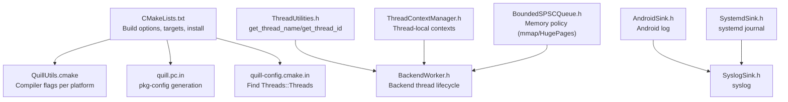
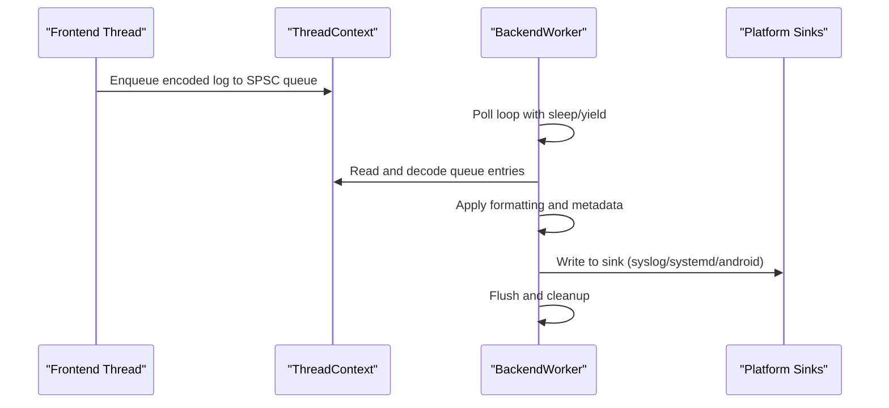
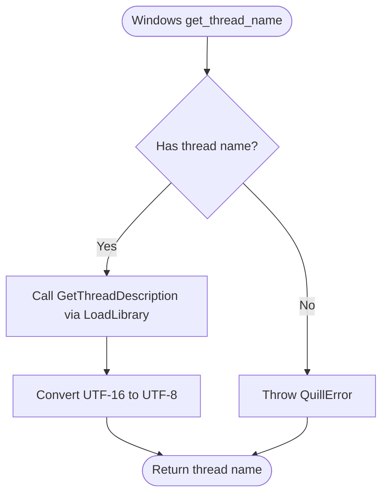
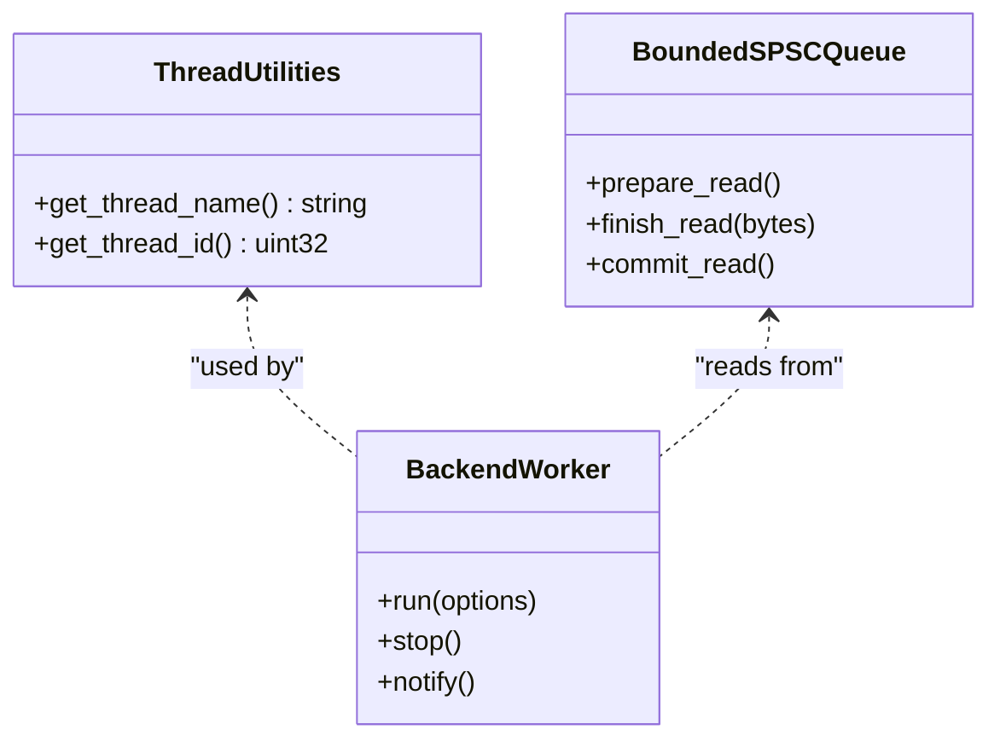
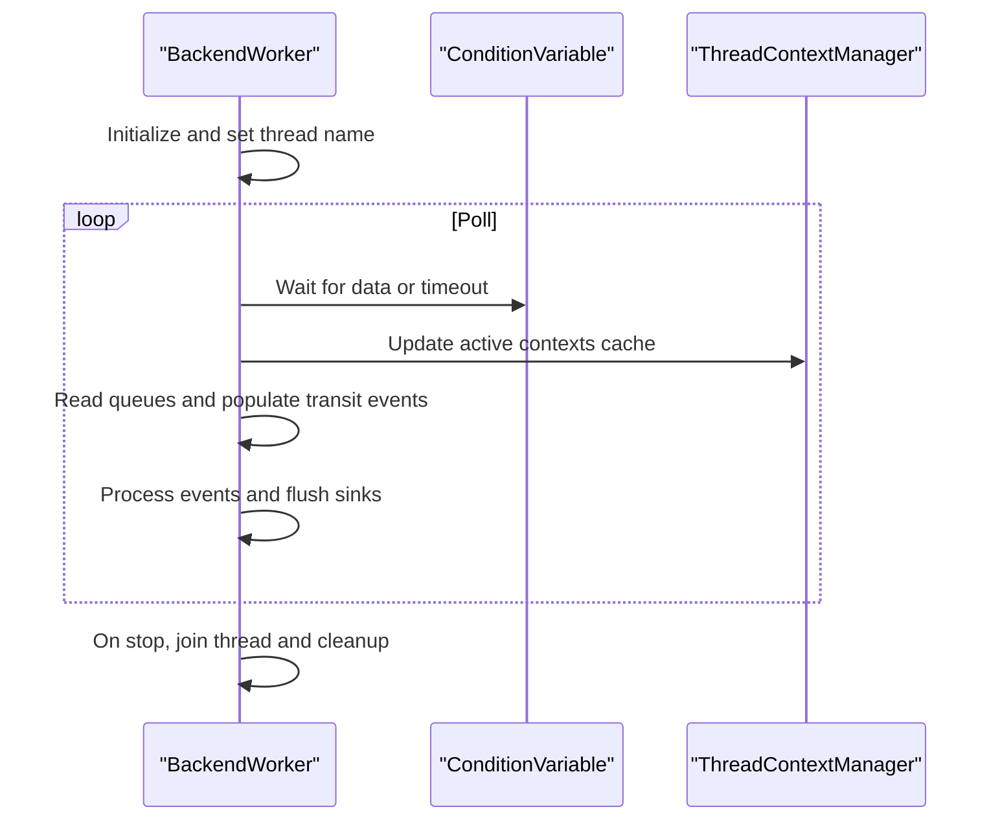
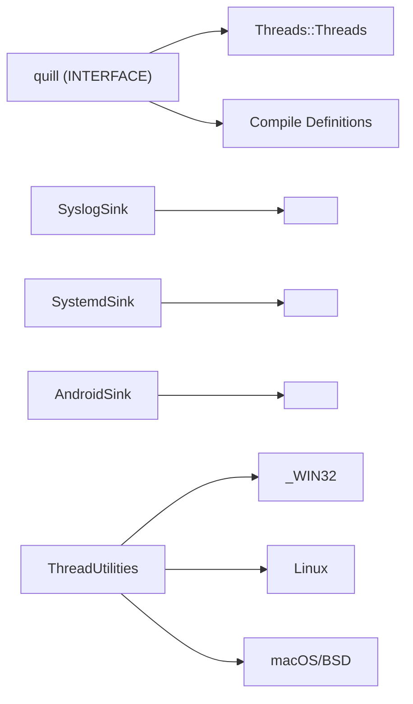

# Platform-Specific Considerations

<cite>
**Referenced Files in This Document**
- [CMakeLists.txt](file://CMakeLists.txt)
- [QuillUtils.cmake](file://cmake/QuillUtils.cmake)
- [quill-config.cmake.in](file://cmake/quill-config.cmake.in)
- [quill.pc.in](file://cmake/quill.pc.in)
- [ThreadUtilities.h](file://include/quill/backend/ThreadUtilities.h)
- [ThreadContextManager.h](file://include/quill/core/ThreadContextManager.h)
- [BackendWorker.h](file://include/quill/backend/BackendWorker.h)
- [Utility.h](file://include/quill/Utility.h)
- [AndroidSink.h](file://include/quill/sinks/AndroidSink.h)
- [SyslogSink.h](file://include/quill/sinks/SyslogSink.h)
- [SystemdSink.h](file://include/quill/sinks/SystemdSink.h)
- [BoundedSPSCQueue.h](file://include/quill/core/BoundedSPSCQueue.h)
</cite>

## Table of Contents
1. [Introduction](#introduction)
2. [Project Structure](#project-structure)
3. [Core Components](#core-components)
4. [Architecture Overview](#architecture-overview)
5. [Detailed Component Analysis](#detailed-component-analysis)
6. [Dependency Analysis](#dependency-analysis)
7. [Performance Considerations](#performance-considerations)
8. [Troubleshooting Guide](#troubleshooting-guide)
9. [Conclusion](#conclusion)
10. [Appendices](#appendices)

## Introduction
This document explains platform-specific considerations for Quill across Windows, Linux, macOS, Android, and other Unix-like systems. It covers threading models, system integration, build configurations, library linking, runtime dependencies, MinGW compatibility, pthread requirements, optimizations, cross-compilation, embedded/mobile considerations, performance characteristics, memory management differences, system call optimizations, testing strategies, CI setup, and deployment.

## Project Structure
Quill’s platform support is implemented through:
- CMake configuration and utilities that adapt compilation and linking per platform.
- Header-only interface library exposing public APIs and compile definitions.
- Backend and core components that branch on platform-specific headers and syscalls.
- Platform-specific sinks for Android, syslog, and systemd.

**Diagram sources**
- [CMakeLists.txt:182-442](file://CMakeLists.txt#L182-L442)
- [QuillUtils.cmake:29-94](file://cmake/QuillUtils.cmake#L29-L94)
- [quill.pc.in:1-10](file://cmake/quill.pc.in#L1-L10)
- [quill-config.cmake.in:1-6](file://cmake/quill-config.cmake.in#L1-L6)
- [ThreadUtilities.h:17-55](file://include/quill/backend/ThreadUtilities.h#L17-L55)
- [BackendWorker.h:138-207](file://include/quill/backend/BackendWorker.h#L138-L207)
- [ThreadContextManager.h:53-214](file://include/quill/core/ThreadContextManager.h#L53-L214)
- [AndroidSink.h:20-128](file://include/quill/sinks/AndroidSink.h#L20-L128)
- [SyslogSink.h:18-185](file://include/quill/sinks/SyslogSink.h#L18-L185)
- [SystemdSink.h:22-182](file://include/quill/sinks/SystemdSink.h#L22-L182)
- [BoundedSPSCQueue.h:315-356](file://include/quill/core/BoundedSPSCQueue.h#L315-L356)

**Section sources**
- [CMakeLists.txt:1-451](file://CMakeLists.txt#L1-L451)
- [QuillUtils.cmake:1-111](file://cmake/QuillUtils.cmake#L1-L111)
- [quill.pc.in:1-10](file://cmake/quill.pc.in#L1-L10)
- [quill-config.cmake.in:1-6](file://cmake/quill-config.cmake.in#L1-L6)

## Core Components
- Build and platform flags:
  - Interface library exposes compile definitions for optional features and exceptions.
  - Platform-specific linking and warnings are applied via CMake utilities.
- Threading:
  - Backend worker thread is created and managed by the backend.
  - Thread utilities provide thread name and ID retrieval with platform branches.
  - Thread-local contexts are tracked globally for backend processing.
- Platform sinks:
  - AndroidSink integrates with Android log.
  - SyslogSink integrates with syslog facilities.
  - SystemdSink integrates with systemd journal.

**Section sources**
- [CMakeLists.txt:295-342](file://CMakeLists.txt#L295-L342)
- [QuillUtils.cmake:29-94](file://cmake/QuillUtils.cmake#L29-L94)
- [BackendWorker.h:138-207](file://include/quill/backend/BackendWorker.h#L138-L207)
- [ThreadUtilities.h:148-226](file://include/quill/backend/ThreadUtilities.h#L148-L226)
- [ThreadContextManager.h:216-430](file://include/quill/core/ThreadContextManager.h#L216-L430)
- [AndroidSink.h:88-128](file://include/quill/sinks/AndroidSink.h#L88-L128)
- [SyslogSink.h:137-185](file://include/quill/sinks/SyslogSink.h#L137-L185)
- [SystemdSink.h:119-182](file://include/quill/sinks/SystemdSink.h#L119-L182)

## Architecture Overview
Quill’s asynchronous logging pipeline is driven by a backend worker thread that polls per-thread SPSC queues, decodes messages, applies formatting, and flushes to sinks. Platform-specific code is isolated to thread utilities and sinks.

**Diagram sources**
- [BackendWorker.h:305-395](file://include/quill/backend/BackendWorker.h#L305-L395)
- [ThreadContextManager.h:216-430](file://include/quill/core/ThreadContextManager.h#L216-L430)
- [SyslogSink.h:156-175](file://include/quill/sinks/SyslogSink.h#L156-L175)
- [SystemdSink.h:137-172](file://include/quill/sinks/SystemdSink.h#L137-L172)
- [AndroidSink.h:105-118](file://include/quill/sinks/AndroidSink.h#L105-L118)

## Detailed Component Analysis

### Windows
- Threading and thread naming:
  - Uses Windows APIs for thread name retrieval via dynamic loading of kernel functions.
  - Provides conversions between narrow/wide strings.
- Backend worker:
  - Creates and manages a dedicated backend thread with CPU affinity and thread name setting.
- MinGW compatibility:
  - Links against ucrtbase for correct time formatting.
- Compiler flags:
  - Applies MSVC-specific flags and disables exceptions/RTTI when configured.

**Diagram sources**
- [ThreadUtilities.h:148-188](file://include/quill/backend/ThreadUtilities.h#L148-L188)

**Section sources**
- [ThreadUtilities.h:17-140](file://include/quill/backend/ThreadUtilities.h#L17-L140)
- [ThreadUtilities.h:148-188](file://include/quill/backend/ThreadUtilities.h#L148-L188)
- [BackendWorker.h:138-207](file://include/quill/backend/BackendWorker.h#L138-L207)
- [CMakeLists.txt:339-342](file://CMakeLists.txt#L339-L342)
- [QuillUtils.cmake:74-94](file://cmake/QuillUtils.cmake#L74-L94)

### Linux
- Threading:
  - Uses POSIX pthreads and syscall(SYS_gettid) for thread IDs.
  - pthread_getname_np is used for thread names on most platforms.
- Backend worker:
  - Uses condition variables and sleep/yield strategies for low overhead polling.
- Memory policy:
  - Bounded SPSC queue supports mmap and huge pages policies for memory behavior.

**Diagram sources**
- [ThreadUtilities.h:198-226](file://include/quill/backend/ThreadUtilities.h#L198-L226)
- [BackendWorker.h:138-207](file://include/quill/backend/BackendWorker.h#L138-L207)
- [BoundedSPSCQueue.h:315-356](file://include/quill/core/BoundedSPSCQueue.h#L315-L356)

**Section sources**
- [ThreadUtilities.h:50-55](file://include/quill/backend/ThreadUtilities.h#L50-L55)
- [ThreadUtilities.h:174-187](file://include/quill/backend/ThreadUtilities.h#L174-L187)
- [ThreadUtilities.h:198-226](file://include/quill/backend/ThreadUtilities.h#L198-L226)
- [BackendWorker.h:238-256](file://include/quill/backend/BackendWorker.h#L238-L256)
- [BoundedSPSCQueue.h:315-356](file://include/quill/core/BoundedSPSCQueue.h#L315-L356)

### macOS
- Threading:
  - Uses pthreads and pthread_threadid_np for thread IDs.
- Compiler flags:
  - General warnings are applied except on Windows.

**Section sources**
- [ThreadUtilities.h:31-34](file://include/quill/backend/ThreadUtilities.h#L31-L34)
- [ThreadUtilities.h:209-212](file://include/quill/backend/ThreadUtilities.h#L209-L212)
- [QuillUtils.cmake:38-76](file://cmake/QuillUtils.cmake#L38-L76)

### BSD Family (FreeBSD, OpenBSD, NetBSD, DragonFly)
- Threading:
  - Uses pthread_np variants and platform-specific thread ID retrieval.
- Compiler flags:
  - General warnings are applied except on Windows.

**Section sources**
- [ThreadUtilities.h:35-49](file://include/quill/backend/ThreadUtilities.h#L35-L49)
- [ThreadUtilities.h:177-222](file://include/quill/backend/ThreadUtilities.h#L177-L222)
- [QuillUtils.cmake:38-76](file://cmake/QuillUtils.cmake#L38-L76)

### Android
- Platform sink:
  - AndroidSink integrates with the Android log system and maps Quill log levels to Android priorities.
- Threading:
  - Thread naming is disabled by default on Android to avoid unsupported APIs.

**Section sources**
- [AndroidSink.h:88-128](file://include/quill/sinks/AndroidSink.h#L88-L128)
- [ThreadUtilities.h:150-153](file://include/quill/backend/ThreadUtilities.h#L150-L153)

### Unix-like Systems (syslog/systemd)
- Syslog:
  - SyslogSink wraps syslog(3) and maps Quill levels to syslog priorities.
  - Notes about macro collisions with unprefixed LOG_ macros.
- systemd:
  - SystemdSink wraps sd_journal_send and maps Quill levels to systemd priorities.
  - Notes about macro collisions with unprefixed LOG_ macros.

**Section sources**
- [SyslogSink.h:137-185](file://include/quill/sinks/SyslogSink.h#L137-L185)
- [SystemdSink.h:119-182](file://include/quill/sinks/SystemdSink.h#L119-L182)

### Threading Model and Backend Worker
- BackendWorker creates a dedicated thread, sets CPU affinity and name, and runs a polling loop.
- Condition variable and mutex protect wake-up signaling; MinGW has a special-case ordering to avoid deadlocks.
- ThreadContextManager tracks per-thread contexts and invalidates them on thread teardown.

**Diagram sources**
- [BackendWorker.h:138-207](file://include/quill/backend/BackendWorker.h#L138-L207)
- [BackendWorker.h:305-395](file://include/quill/backend/BackendWorker.h#L305-L395)
- [ThreadContextManager.h:216-338](file://include/quill/core/ThreadContextManager.h#L216-L338)

**Section sources**
- [BackendWorker.h:238-256](file://include/quill/backend/BackendWorker.h#L238-L256)
- [ThreadContextManager.h:216-338](file://include/quill/core/ThreadContextManager.h#L216-L338)

### Build Configuration and Linking
- Interface library exposes compile definitions for:
  - Exception handling control.
  - Thread name support toggle.
  - Sequential thread ID mode.
  - x86 optimizations.
  - Macro prefixes and function/file info toggles.
  - Assertions.
- Link dependencies:
  - Threads::Threads is always linked.
  - MinGW links ucrtbase.
  - Legacy GCC links stdc++fs when needed.
- pkg-config and CMake package:
  - Generates .pc and CMake package config.
  - On Windows, pthreads linkage is omitted; on Unix-like systems, -lpthread is included.

**Section sources**
- [CMakeLists.txt:295-342](file://CMakeLists.txt#L295-L342)
- [CMakeLists.txt:337-346](file://CMakeLists.txt#L337-L346)
- [CMakeLists.txt:381-385](file://CMakeLists.txt#L381-L385)
- [quill.pc.in:1-10](file://cmake/quill.pc.in#L1-L10)
- [quill-config.cmake.in:1-6](file://cmake/quill-config.cmake.in#L1-L6)

### Cross-Compilation and Embedded Considerations
- Interface library design enables consumption via CMake and pkg-config without embedding sources.
- Thread utilities and sinks are conditionally compiled per platform.
- Sequential thread IDs can be enabled via a compile definition and a single translation unit definition macro.

**Section sources**
- [CMakeLists.txt:295-329](file://CMakeLists.txt#L295-L329)
- [Utility.h:123-130](file://include/quill/Utility.h#L123-L130)

## Dependency Analysis
Quill’s public interface is an INTERFACE library that forwards compile definitions and links Threads::Threads. Platform-specific sinks depend on system headers and APIs.

**Diagram sources**
- [CMakeLists.txt:337-342](file://CMakeLists.txt#L337-L342)
- [SyslogSink.h:18-185](file://include/quill/sinks/SyslogSink.h#L18-L185)
- [SystemdSink.h:22-182](file://include/quill/sinks/SystemdSink.h#L22-L182)
- [AndroidSink.h:20-128](file://include/quill/sinks/AndroidSink.h#L20-L128)
- [ThreadUtilities.h:17-55](file://include/quill/backend/ThreadUtilities.h#L17-L55)

**Section sources**
- [CMakeLists.txt:337-342](file://CMakeLists.txt#L337-L342)
- [SyslogSink.h:18-185](file://include/quill/sinks/SyslogSink.h#L18-L185)
- [SystemdSink.h:22-182](file://include/quill/sinks/SystemdSink.h#L22-L182)
- [AndroidSink.h:20-128](file://include/quill/sinks/AndroidSink.h#L20-L128)
- [ThreadUtilities.h:17-55](file://include/quill/backend/ThreadUtilities.h#L17-L55)

## Performance Considerations
- Backend polling:
  - Sleep duration and yield-on-idle reduce CPU usage when queues are empty.
  - Transit event soft/hard limits balance throughput and ordering guarantees.
- MinGW-specific condition variable handling avoids deadlocks.
- x86 optimizations:
  - Compile-time flag enables cache coherence hints; requires appropriate -march flags.
- Memory policy:
  - Bounded SPSC queue supports mmap and huge pages policies for memory behavior.

**Section sources**
- [BackendWorker.h:368-388](file://include/quill/backend/BackendWorker.h#L368-L388)
- [BackendWorker.h:238-256](file://include/quill/backend/BackendWorker.h#L238-L256)
- [CMakeLists.txt:14-14](file://CMakeLists.txt#L14-L14)
- [BoundedSPSCQueue.h:315-356](file://include/quill/core/BoundedSPSCQueue.h#L315-L356)

## Troubleshooting Guide
- Thread name retrieval failures on Windows:
  - Dynamic loading of kernel functions may fail on unsupported OS versions; code throws a QuillError.
- MinGW condition variable deadlock:
  - Special-case notify ordering is applied to avoid deadlocks.
- Missing pthreads on Unix-like systems:
  - pkg-config emits -lpthread; ensure pthread development packages are installed.
- Syslog/systemd macro collisions:
  - Use QUILL_DISABLE_NON_PREFIXED_MACROS or include sinks in .cpp translation units only.

**Section sources**
- [ThreadUtilities.h:106-139](file://include/quill/backend/ThreadUtilities.h#L106-L139)
- [BackendWorker.h:240-255](file://include/quill/backend/BackendWorker.h#L240-L255)
- [quill.pc.in:8-8](file://cmake/quill.pc.in#L8-L8)
- [SyslogSink.h:24-46](file://include/quill/sinks/SyslogSink.h#L24-L46)
- [SystemdSink.h:28-50](file://include/quill/sinks/SystemdSink.h#L28-L50)

## Conclusion
Quill’s platform support is achieved through a clean separation of concerns: an interface library with compile definitions, platform-aware thread utilities, and platform-specific sinks. The backend worker thread and SPSC queues provide efficient asynchronous logging across Windows, Linux, macOS, BSDs, and Android. Build configuration and pkg-config ensure consistent linking and discovery. Performance-sensitive paths include MinGW-specific condition-variable handling, optional x86 cache hints, and memory policy controls.

## Appendices

### Platform-Specific Build Flags and Definitions
- Windows:
  - ucrtbase linkage for MinGW.
  - MSVC-specific warning flags and exception/RTTI controls.
- Linux/macOS/BSD:
  - POSIX pthreads and platform-specific thread ID retrieval.
  - General compiler warnings except Windows.
- Android:
  - Thread naming disabled by default.
  - Android log sink integration.

**Section sources**
- [CMakeLists.txt:339-342](file://CMakeLists.txt#L339-L342)
- [QuillUtils.cmake:38-94](file://cmake/QuillUtils.cmake#L38-L94)
- [ThreadUtilities.h:150-153](file://include/quill/backend/ThreadUtilities.h#L150-L153)
- [AndroidSink.h:88-128](file://include/quill/sinks/AndroidSink.h#L88-L128)