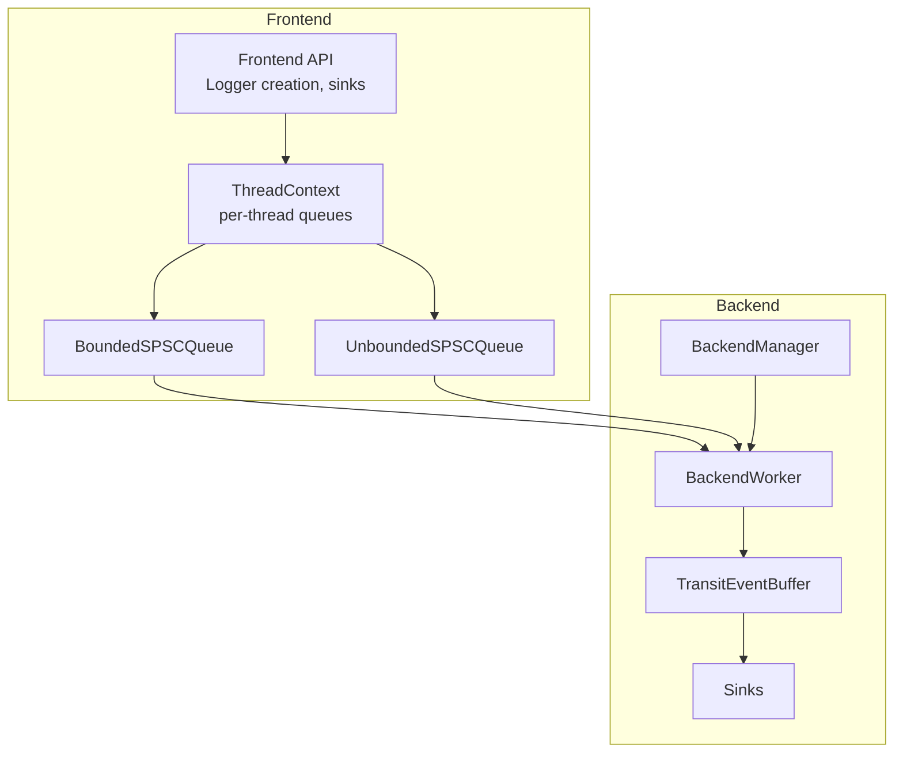
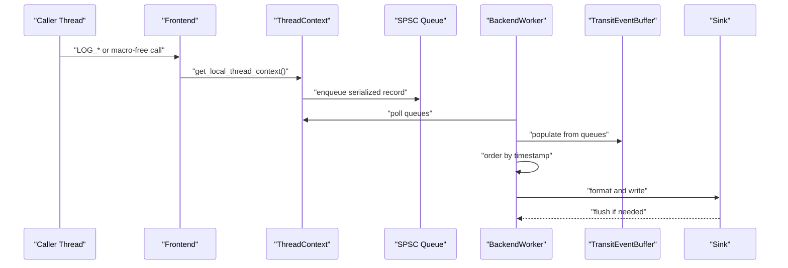
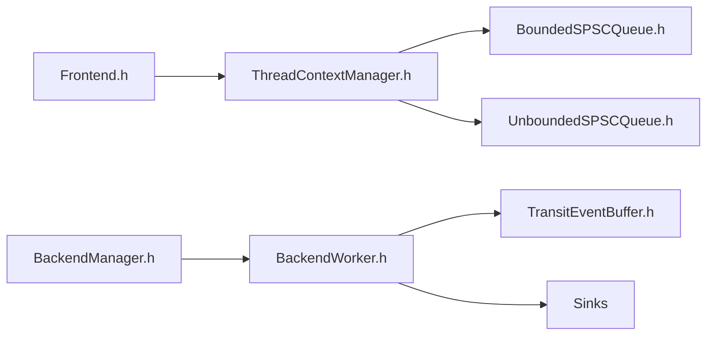

# Common Issues

<cite>
**Referenced Files in This Document**
- [README.md](file://README.md)
- [Frontend.h](file://include/quill/Frontend.h)
- [BackendManager.h](file://include/quill/backend/BackendManager.h)
- [BackendWorker.h](file://include/quill/backend/BackendWorker.h)
- [BackendOptions.h](file://include/quill/backend/BackendOptions.h)
- [FrontendOptions.h](file://include/quill/core/FrontendOptions.h)
- [BoundedSPSCQueue.h](file://include/quill/core/BoundedSPSCQueue.h)
- [UnboundedSPSCQueue.h](file://include/quill/core/UnboundedSPSCQueue.h)
- [TransitEventBuffer.h](file://include/quill/backend/TransitEventBuffer.h)
- [ThreadContextManager.h](file://include/quill/core/ThreadContextManager.h)
- [macro_free_mode.rst](file://docs/macro_free_mode.rst)
- [faq.rst](file://docs/faq.rst)
- [quill_hot_path_rdtsc_clock.cpp](file://benchmarks/hot_path_latency/quill_hot_path_rdtsc_clock.cpp)
- [quill_backend_throughput.cpp](file://benchmarks/backend_throughput/quill_backend_throughput.cpp)
</cite>

## Table of Contents
1. [Introduction](#introduction)
2. [Project Structure](#project-structure)
3. [Core Components](#core-components)
4. [Architecture Overview](#architecture-overview)
5. [Detailed Component Analysis](#detailed-component-analysis)
6. [Dependency Analysis](#dependency-analysis)
7. [Performance Considerations](#performance-considerations)
8. [Troubleshooting Guide](#troubleshooting-guide)
9. [Conclusion](#conclusion)
10. [Appendices](#appendices)

## Introduction
This document focuses on diagnosing and resolving common issues in Quill with a practical, code-backed approach. It covers performance problems (latency, memory, throughput), threading and synchronization pitfalls, configuration trade-offs (queues, backend thread settings, macro-free mode), build and deployment steps, logging-related troubleshooting, and platform/compiler integration tips. The goal is to help you quickly identify root causes and apply targeted fixes grounded in the codebase.

## Project Structure
Quill is organized around a frontend-backend architecture:
- Frontend: lightweight caller-side logging API with lock-free queues per thread.
- Backend: a single dedicated thread that reads, orders, formats, and writes logs.

Key areas for troubleshooting:
- Frontend queues and thread-local state
- Backend worker loop, transit buffers, and sinks
- Options controlling behavior and performance

**Diagram sources**
- [Frontend.h:148-198](file://include/quill/Frontend.h#L148-L198)
- [ThreadContextManager.h:53-214](file://include/quill/core/ThreadContextManager.h#L53-L214)
- [BoundedSPSCQueue.h:55-95](file://include/quill/core/BoundedSPSCQueue.h#L55-L95)
- [UnboundedSPSCQueue.h:42-84](file://include/quill/core/UnboundedSPSCQueue.h#L42-L84)
- [BackendManager.h:38-128](file://include/quill/backend/BackendManager.h#L38-L128)
- [BackendWorker.h:77-207](file://include/quill/backend/BackendWorker.h#L77-L207)
- [TransitEventBuffer.h:19-71](file://include/quill/backend/TransitEventBuffer.h#L19-L71)

**Section sources**
- [README.md:679-703](file://README.md#L679-L703)
- [Frontend.h:148-198](file://include/quill/Frontend.h#L148-L198)
- [ThreadContextManager.h:53-214](file://include/quill/core/ThreadContextManager.h#L53-L214)
- [BackendManager.h:38-128](file://include/quill/backend/BackendManager.h#L38-L128)
- [BackendWorker.h:77-207](file://include/quill/backend/BackendWorker.h#L77-L207)
- [BoundedSPSCQueue.h:55-95](file://include/quill/core/BoundedSPSCQueue.h#L55-L95)
- [UnboundedSPSCQueue.h:42-84](file://include/quill/core/UnboundedSPSCQueue.h#L42-L84)
- [TransitEventBuffer.h:19-71](file://include/quill/backend/TransitEventBuffer.h#L19-L71)

## Core Components
- Frontend API: logger creation, sink management, and thread-local queue controls.
- ThreadContext: per-thread SPSC queues and counters.
- BackendManager: singleton lifecycle and backend thread coordination.
- BackendWorker: main loop, transit buffer population, timestamp ordering, and sink flush.
- Queue types: bounded and unbounded SPSC queues with huge pages support.
- TransitEventBuffer: per-thread staging buffer for ordered processing.

**Section sources**
- [Frontend.h:148-198](file://include/quill/Frontend.h#L148-L198)
- [ThreadContextManager.h:53-214](file://include/quill/core/ThreadContextManager.h#L53-L214)
- [BackendManager.h:38-128](file://include/quill/backend/BackendManager.h#L38-L128)
- [BackendWorker.h:77-207](file://include/quill/backend/BackendWorker.h#L77-L207)
- [BoundedSPSCQueue.h:55-95](file://include/quill/core/BoundedSPSCQueue.h#L55-L95)
- [UnboundedSPSCQueue.h:42-84](file://include/quill/core/UnboundedSPSCQueue.h#L42-L84)
- [TransitEventBuffer.h:19-71](file://include/quill/backend/TransitEventBuffer.h#L19-L71)

## Architecture Overview
The frontend pushes serialized log records into a per-thread SPSC queue. The backend worker polls queues, decodes records, enforces timestamp ordering, formats messages, and writes to sinks. TransitEventBuffer holds staged events for deterministic ordering.

**Diagram sources**
- [Frontend.h:148-198](file://include/quill/Frontend.h#L148-L198)
- [ThreadContextManager.h:53-214](file://include/quill/core/ThreadContextManager.h#L53-L214)
- [BackendWorker.h:479-506](file://include/quill/backend/BackendWorker.h#L479-L506)
- [TransitEventBuffer.h:72-93](file://include/quill/backend/TransitEventBuffer.h#L72-L93)

## Detailed Component Analysis

### Performance Problems: Latency
Symptoms
- High latency in hot path
- Jitter under contention
- Unexpected delays when using TSC timestamps

Root causes and diagnostics
- Backend polling and sleep settings: excessive busy-waiting or long sleep durations impact latency.
- Transit buffer limits: soft/hard limits influence batching and ordering.
- Timestamp ordering grace period: enabling strict ordering can delay reads.
- Queue behavior: bounded vs unbounded and blocking vs dropping affects producer stalls.

Concrete fixes
- Tune BackendOptions: adjust sleep_duration and enable_yield_when_idle for your workload.
- Adjust transit_events_soft_limit and transit_events_hard_limit to balance batching and ordering.
- Reduce log_timestamp_ordering_grace_period for tighter ordering at the cost of more rechecks.
- Prefer UnboundedBlocking for latency-sensitive paths; ensure unbounded_queue_max_capacity is sufficient.

Diagnostic references
- Backend loop and polling: [BackendWorker.h:305-395](file://include/quill/backend/BackendWorker.h#L305-L395)
- Transit buffer population: [BackendWorker.h:479-506](file://include/quill/backend/BackendWorker.h#L479-L506)
- Ordering grace period logic: [BackendWorker.h:631-668](file://include/quill/backend/BackendWorker.h#L631-L668)
- Sleep/yield path: [BackendWorker.h:370-387](file://include/quill/backend/BackendWorker.h#L370-L387)
- Benchmarks for latency: [quill_hot_path_rdtsc_clock.cpp:26-92](file://benchmarks/hot_path_latency/quill_hot_path_rdtsc_clock.cpp#L26-L92)

**Section sources**
- [BackendWorker.h:305-395](file://include/quill/backend/BackendWorker.h#L305-L395)
- [BackendWorker.h:479-506](file://include/quill/backend/BackendWorker.h#L479-L506)
- [BackendWorker.h:631-668](file://include/quill/backend/BackendWorker.h#L631-L668)
- [BackendWorker.h:370-387](file://include/quill/backend/BackendWorker.h#L370-L387)
- [quill_hot_path_rdtsc_clock.cpp:26-92](file://benchmarks/hot_path_latency/quill_hot_path_rdtsc_clock.cpp#L26-L92)

### Performance Problems: Memory Usage
Symptoms
- High memory footprint from queues
- Unbounded queue growth under bursty loads
- Transient memory spikes in backend buffers

Root causes and diagnostics
- Unbounded queue capacity growth: can expand up to unbounded_queue_max_capacity.
- Thread-local queue capacity monitoring and shrinking: use shrink_thread_local_queue and get_thread_local_queue_capacity.
- TransitEventBuffer expansion and shrink requests: buffers expand when full and can be shrunk when empty.

Fixes
- Periodically shrink thread-local queues after bursts: [Frontend.h:72-80](file://include/quill/Frontend.h#L72-L80)
- Monitor queue capacity: [Frontend.h:97-111](file://include/quill/Frontend.h#L97-L111)
- Ensure sinks flush appropriately to release buffers: [BackendWorker.h:443-474](file://include/quill/backend/BackendWorker.h#L443-L474)
- Consider BoundedDropping for memory-constrained environments.

References
- Unbounded queue growth and limits: [UnboundedSPSCQueue.h:244-297](file://include/quill/core/UnboundedSPSCQueue.h#L244-L297)
- Shrink queue API: [Frontend.h:72-80](file://include/quill/Frontend.h#L72-L80)
- Transit buffer expansion/shrink: [TransitEventBuffer.h:128-148](file://include/quill/backend/TransitEventBuffer.h#L128-L148)

**Section sources**
- [Frontend.h:72-80](file://include/quill/Frontend.h#L72-L80)
- [Frontend.h:97-111](file://include/quill/Frontend.h#L97-L111)
- [UnboundedSPSCQueue.h:244-297](file://include/quill/core/UnboundedSPSCQueue.h#L244-L297)
- [TransitEventBuffer.h:128-148](file://include/quill/backend/TransitEventBuffer.h#L128-L148)
- [BackendWorker.h:443-474](file://include/quill/backend/BackendWorker.h#L443-L474)

### Performance Problems: Throughput Bottlenecks
Symptoms
- Backend worker appears starved or overwhelmed
- Slow sink writes or flush intervals
- Excessive busy-waiting or idle yields

Root causes and diagnostics
- Backend sleep_duration and enable_yield_when_idle: tune for throughput vs CPU usage.
- Sink flush intervals: sink_min_flush_interval controls minimum flush cadence.
- Transit buffer limits: soft/hard limits govern batching behavior.

Fixes
- Increase sleep_duration or enable yield to reduce CPU usage when idle.
- Adjust sink_min_flush_interval to balance durability and throughput.
- Review transit_events_soft_limit/transit_events_hard_limit to improve batching.

References
- BackendOptions tuning: [BackendOptions.h:49-224](file://include/quill/backend/BackendOptions.h#L49-L224)
- Backend loop and flush path: [BackendWorker.h:305-395](file://include/quill/backend/BackendWorker.h#L305-L395)
- Throughput benchmark: [quill_backend_throughput.cpp:14-68](file://benchmarks/backend_throughput/quill_backend_throughput.cpp#L14-L68)

**Section sources**
- [BackendOptions.h:49-224](file://include/quill/backend/BackendOptions.h#L49-L224)
- [BackendWorker.h:305-395](file://include/quill/backend/BackendWorker.h#L305-L395)
- [quill_backend_throughput.cpp:14-68](file://benchmarks/backend_throughput/quill_backend_throughput.cpp#L14-L68)

### Threading and Synchronization Issues
Symptoms
- Deadlocks or hangs during shutdown
- Multiple backend instances or singleton misuse
- Race conditions around thread context invalidation

Root causes and diagnostics
- Singleton backend instance detection: BackendManager tracks a once_flag and supports a singleton check.
- ThreadContext invalidation and cleanup: backend removes invalidated contexts after draining queues.
- Shutdown path: BackendWorker.stop() joins the worker thread and resets locks.

Fixes
- Ensure Backend::start() is called once per process; avoid multiple instances.
- Allow proper shutdown with flush and stop; do not log after stop.
- Avoid concurrent removal of the same logger from multiple threads.

References
- BackendManager singleton and lifecycle: [BackendManager.h:38-128](file://include/quill/backend/BackendManager.h#L38-L128)
- ThreadContext invalidation and removal: [ThreadContextManager.h:282-327](file://include/quill/core/ThreadContextManager.h#L282-L327)
- Backend shutdown and stop: [BackendWorker.h:212-232](file://include/quill/backend/BackendWorker.h#L212-L232)

**Section sources**
- [BackendManager.h:38-128](file://include/quill/backend/BackendManager.h#L38-L128)
- [ThreadContextManager.h:282-327](file://include/quill/core/ThreadContextManager.h#L282-L327)
- [BackendWorker.h:212-232](file://include/quill/backend/BackendWorker.h#L212-L232)

### Configuration Problems: Queue Behavior
Symptoms
- Blocking producers under load
- Dropped messages unexpectedly
- Insufficient queue capacity for bursts

Root causes and diagnostics
- QueueType selection: UnboundedBlocking vs UnboundedDropping vs BoundedBlocking vs BoundedDropping.
- FrontendOptions: initial_queue_capacity, blocking_queue_retry_interval_ns, unbounded_queue_max_capacity.
- BackendOptions: transit_events_soft_limit/hard_limit and grace period.

Fixes
- Choose UnboundedDropping for throughput with drop semantics; BoundedDropping for predictable memory.
- Increase unbounded_queue_max_capacity if bursts exceed limits.
- Tune transit limits to reduce reordering checks and improve batching.

References
- FrontendOptions defaults: [FrontendOptions.h:16-50](file://include/quill/core/FrontendOptions.h#L16-L50)
- Unbounded queue growth and drop policy: [UnboundedSPSCQueue.h:244-297](file://include/quill/core/UnboundedSPSCQueue.h#L244-L297)
- Bounded queue internals: [BoundedSPSCQueue.h:55-95](file://include/quill/core/BoundedSPSCQueue.h#L55-L95)
- Backend transit limits: [BackendOptions.h:75-92](file://include/quill/backend/BackendOptions.h#L75-L92)

**Section sources**
- [FrontendOptions.h:16-50](file://include/quill/core/FrontendOptions.h#L16-L50)
- [UnboundedSPSCQueue.h:244-297](file://include/quill/core/UnboundedSPSCQueue.h#L244-L297)
- [BoundedSPSCQueue.h:55-95](file://include/quill/core/BoundedSPSCQueue.h#L55-L95)
- [BackendOptions.h:75-92](file://include/quill/backend/BackendOptions.h#L75-L92)

### Configuration Problems: Backend Thread Settings
Symptoms
- High CPU usage when idle
- Delayed processing due to sleep
- Poor timestamp ordering

Root causes and diagnostics
- sleep_duration and enable_yield_when_idle: control backend idle behavior.
- log_timestamp_ordering_grace_period: strictness of ordering enforcement.
- rdtsc_resync_interval: TSC clock synchronization overhead.

Fixes
- Increase sleep_duration or enable yield for low-power scenarios.
- Adjust grace period to balance ordering and throughput.
- Disable rdtsc or use system clock in tests to avoid calibration overhead.

References
- BackendOptions fields: [BackendOptions.h:49-207](file://include/quill/backend/BackendOptions.h#L49-L207)
- FAQ guidance: [faq.rst:130-142](file://docs/faq.rst#L130-L142)

**Section sources**
- [BackendOptions.h:49-207](file://include/quill/backend/BackendOptions.h#L49-L207)
- [faq.rst:130-142](file://docs/faq.rst#L130-L142)

### Configuration Problems: Macro-Free Mode Trade-offs
Symptoms
- Higher latency and reduced throughput
- Arguments always evaluated
- Additional runtime checks

Root causes and diagnostics
- Macro-free mode performs runtime metadata handling and always-evaluates arguments.
- Recommended for readability; avoid in hot paths.

Fixes
- Prefer macro-based logging in performance-critical paths.
- Use macro-free mode for non-hot paths or tests.

References
- Macro-free mode trade-offs: [macro_free_mode.rst:10-26](file://docs/macro_free_mode.rst#L10-L26)

**Section sources**
- [macro_free_mode.rst:10-26](file://docs/macro_free_mode.rst#L10-L26)

### Build and Deployment Challenges
Symptoms
- Linkage issues with multiple backend instances
- Static vs shared library usage
- Compiler and platform-specific flags

Root causes and diagnostics
- Backend singleton check: BackendOptions.check_backend_singleton_instance.
- Platform flags: Android NDK note for QUILL_NO_THREAD_NAME_SUPPORT.
- Packaging and installation via CMake, Meson, Bazel.

Fixes
- Enable singleton check on Windows to prevent multiple backend instances.
- Use shared library builds when mixing static and shared targets.
- Follow platform-specific flags and examples.

References
- Singleton check and notes: [BackendOptions.h:279-281](file://include/quill/backend/BackendOptions.h#L279-L281)
- Android NDK note: [README.md:612-623](file://README.md#L612-L623)
- Packaging and examples: [README.md:534-677](file://README.md#L534-L677)

**Section sources**
- [BackendOptions.h:279-281](file://include/quill/backend/BackendOptions.h#L279-L281)
- [README.md:612-623](file://README.md#L612-L623)
- [README.md:534-677](file://README.md#L534-L677)

### Logging-Related Troubleshooting and Analysis
Symptoms
- Lost logs on crash
- Need to preserve logs during fatal signals
- Need to analyze ordering and timestamps

Root causes and diagnostics
- Signal handler support to flush on crash.
- Strict timestamp ordering and grace period.
- Transit buffer inspection and backend hooks.

Fixes
- Enable signal handler with SignalHandlerOptions.
- Adjust grace period and flush intervals.
- Use backend_worker_on_poll_begin/end hooks for instrumentation.

References
- Crash handling and signal handler: [faq.rst:146-161](file://docs/faq.rst#L146-L161)
- Backend hooks: [BackendOptions.h:185-192](file://include/quill/backend/BackendOptions.h#L185-L192)

**Section sources**
- [faq.rst:146-161](file://docs/faq.rst#L146-L161)
- [BackendOptions.h:185-192](file://include/quill/backend/BackendOptions.h#L185-L192)

### Platform-Specific and Compiler Compatibility
Symptoms
- MinGW deadlock with notify/condvar
- Android logging integration
- Compiler-specific intrinsics and flags

Root causes and diagnostics
- MinGW-specific notify behavior in BackendWorker.
- AndroidSink and ClockSourceType::System for Android.
- X86 intrinsics and cache-line optimizations.

Fixes
- Use provided Android example and flags.
- Avoid MinGW-specific issues by following documented patterns.

References
- MinGW notify path: [BackendWorker.h:240-255](file://include/quill/backend/BackendWorker.h#L240-L255)
- Android example: [README.md:624-641](file://README.md#L624-L641)
- Intrinsics and cache-line notes: [BoundedSPSCQueue.h:22-39](file://include/quill/core/BoundedSPSCQueue.h#L22-L39)

**Section sources**
- [BackendWorker.h:240-255](file://include/quill/backend/BackendWorker.h#L240-L255)
- [README.md:624-641](file://README.md#L624-L641)
- [BoundedSPSCQueue.h:22-39](file://include/quill/core/BoundedSPSCQueue.h#L22-L39)

## Dependency Analysis
The frontend depends on ThreadContextManager and SPSC queues; the backend depends on ThreadContextManager, TransitEventBuffer, and sinks. BackendManager coordinates the backend thread lifecycle.

**Diagram sources**
- [Frontend.h:148-198](file://include/quill/Frontend.h#L148-L198)
- [ThreadContextManager.h:53-214](file://include/quill/core/ThreadContextManager.h#L53-L214)
- [BoundedSPSCQueue.h:55-95](file://include/quill/core/BoundedSPSCQueue.h#L55-L95)
- [UnboundedSPSCQueue.h:42-84](file://include/quill/core/UnboundedSPSCQueue.h#L42-L84)
- [BackendManager.h:38-128](file://include/quill/backend/BackendManager.h#L38-L128)
- [BackendWorker.h:77-207](file://include/quill/backend/BackendWorker.h#L77-L207)
- [TransitEventBuffer.h:19-71](file://include/quill/backend/TransitEventBuffer.h#L19-L71)

**Section sources**
- [Frontend.h:148-198](file://include/quill/Frontend.h#L148-L198)
- [ThreadContextManager.h:53-214](file://include/quill/core/ThreadContextManager.h#L53-L214)
- [BackendManager.h:38-128](file://include/quill/backend/BackendManager.h#L38-L128)
- [BackendWorker.h:77-207](file://include/quill/backend/BackendWorker.h#L77-L207)
- [BoundedSPSCQueue.h:55-95](file://include/quill/core/BoundedSPSCQueue.h#L55-L95)
- [UnboundedSPSCQueue.h:42-84](file://include/quill/core/UnboundedSPSCQueue.h#L42-L84)
- [TransitEventBuffer.h:19-71](file://include/quill/backend/TransitEventBuffer.h#L19-L71)

## Performance Considerations
- Prefer UnboundedBlocking for latency-sensitive paths; ensure adequate unbounded_queue_max_capacity.
- Tune BackendOptions for your workload: sleep_duration, enable_yield_when_idle, sink_min_flush_interval.
- Use BoundedDropping or UnboundedDropping for throughput with controlled loss.
- Reduce log_timestamp_ordering_grace_period for stricter ordering at the cost of more checks.
- Monitor thread-local queue capacity and shrink after bursts.

[No sources needed since this section provides general guidance]

## Troubleshooting Guide
- Symptom: Backend uses too much CPU
  - Action: Increase sleep_duration or enable yield when idle.
  - Reference: [BackendOptions.h:44-49](file://include/quill/backend/BackendOptions.h#L44-L49), [BackendWorker.h:383-387](file://include/quill/backend/BackendWorker.h#L383-L387)

- Symptom: Logs dropped unexpectedly
  - Action: Switch to UnboundedDropping or BoundedDropping; increase unbounded_queue_max_capacity; review transit limits.
  - References: [UnboundedSPSCQueue.h:244-297](file://include/quill/core/UnboundedSPSCQueue.h#L244-L297), [BackendOptions.h:75-92](file://include/quill/backend/BackendOptions.h#L75-L92)

- Symptom: Out-of-order logs
  - Action: Adjust log_timestamp_ordering_grace_period; ensure sinks flush appropriately.
  - References: [BackendWorker.h:631-668](file://include/quill/backend/BackendWorker.h#L631-L668), [BackendOptions.h:132-132](file://include/quill/backend/BackendOptions.h#L132-L132)

- Symptom: Memory growth under bursts
  - Action: Shrink thread-local queues post-burst; monitor capacity; ensure sinks flush.
  - References: [Frontend.h:72-80](file://include/quill/Frontend.h#L72-L80), [Frontend.h:97-111](file://include/quill/Frontend.h#L97-L111), [BackendWorker.h:443-474](file://include/quill/backend/BackendWorker.h#L443-L474)

- Symptom: Multiple backend instances
  - Action: Enable singleton check; use shared library builds when mixing static/shared.
  - References: [BackendOptions.h:279-281](file://include/quill/backend/BackendOptions.h#L279-L281), [README.md:706-714](file://README.md#L706-L714)

- Symptom: MinGW deadlock on notify
  - Action: Follow the documented notify path in BackendWorker.
  - Reference: [BackendWorker.h:240-255](file://include/quill/backend/BackendWorker.h#L240-L255)

**Section sources**
- [BackendOptions.h:44-49](file://include/quill/backend/BackendOptions.h#L44-L49)
- [BackendWorker.h:383-387](file://include/quill/backend/BackendWorker.h#L383-L387)
- [UnboundedSPSCQueue.h:244-297](file://include/quill/core/UnboundedSPSCQueue.h#L244-L297)
- [BackendOptions.h:75-92](file://include/quill/backend/BackendOptions.h#L75-L92)
- [BackendWorker.h:631-668](file://include/quill/backend/BackendWorker.h#L631-L668)
- [BackendWorker.h:443-474](file://include/quill/backend/BackendWorker.h#L443-L474)
- [Frontend.h:72-80](file://include/quill/Frontend.h#L72-L80)
- [Frontend.h:97-111](file://include/quill/Frontend.h#L97-L111)
- [BackendOptions.h:279-281](file://include/quill/backend/BackendOptions.h#L279-L281)
- [README.md:706-714](file://README.md#L706-L714)
- [BackendWorker.h:240-255](file://include/quill/backend/BackendWorker.h#L240-L255)

## Conclusion
Most Quill issues trace back to queue configuration, backend thread tuning, and timestamp ordering. Use the provided references to diagnose and fix latency, memory, and throughput problems. For threading and synchronization, rely on BackendManager and ThreadContextManager behaviors. Apply platform-specific guidance and packaging instructions for robust builds.

[No sources needed since this section summarizes without analyzing specific files]

## Appendices

### Appendix A: Diagnostic Workflow Template
- Confirm queue type and capacity
  - Check FrontendOptions and queue behavior
  - References: [FrontendOptions.h:16-50](file://include/quill/core/FrontendOptions.h#L16-L50), [UnboundedSPSCQueue.h:244-297](file://include/quill/core/UnboundedSPSCQueue.h#L244-L297)
- Inspect backend settings
  - Adjust BackendOptions and review backend loop
  - References: [BackendOptions.h:49-224](file://include/quill/backend/BackendOptions.h#L49-L224), [BackendWorker.h:305-395](file://include/quill/backend/BackendWorker.h#L305-L395)
- Verify ordering and flush
  - Review grace period and sink flush intervals
  - References: [BackendWorker.h:631-668](file://include/quill/backend/BackendWorker.h#L631-L668), [BackendOptions.h:224-224](file://include/quill/backend/BackendOptions.h#L224-L224)
- Validate lifecycle and platform specifics
  - Singleton checks, MinGW, Android
  - References: [BackendOptions.h:279-281](file://include/quill/backend/BackendOptions.h#L279-L281), [BackendWorker.h:240-255](file://include/quill/backend/BackendWorker.h#L240-L255), [README.md:624-641](file://README.md#L624-L641)

**Section sources**
- [FrontendOptions.h:16-50](file://include/quill/core/FrontendOptions.h#L16-L50)
- [UnboundedSPSCQueue.h:244-297](file://include/quill/core/UnboundedSPSCQueue.h#L244-L297)
- [BackendOptions.h:49-224](file://include/quill/backend/BackendOptions.h#L49-L224)
- [BackendWorker.h:305-395](file://include/quill/backend/BackendWorker.h#L305-L395)
- [BackendWorker.h:631-668](file://include/quill/backend/BackendWorker.h#L631-L668)
- [BackendOptions.h:279-281](file://include/quill/backend/BackendOptions.h#L279-L281)
- [BackendWorker.h:240-255](file://include/quill/backend/BackendWorker.h#L240-L255)
- [README.md:624-641](file://README.md#L624-L641)