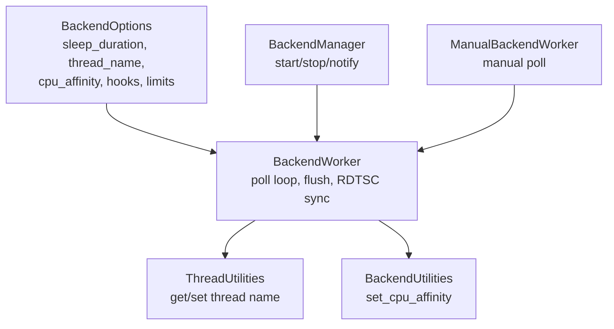
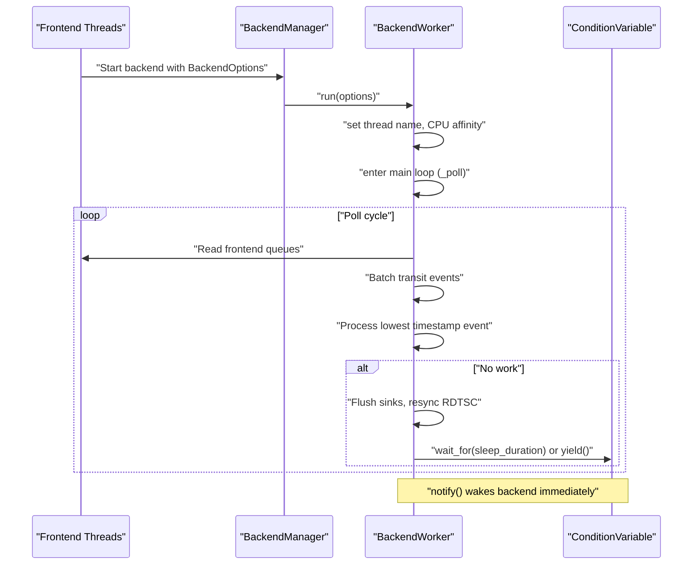
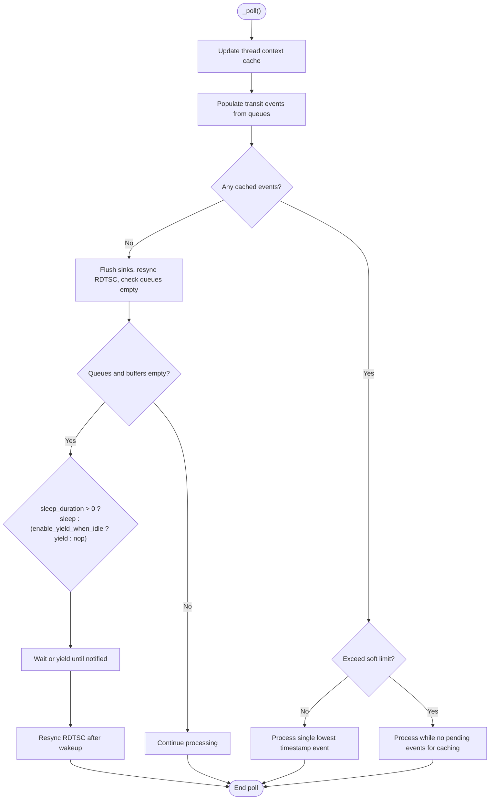
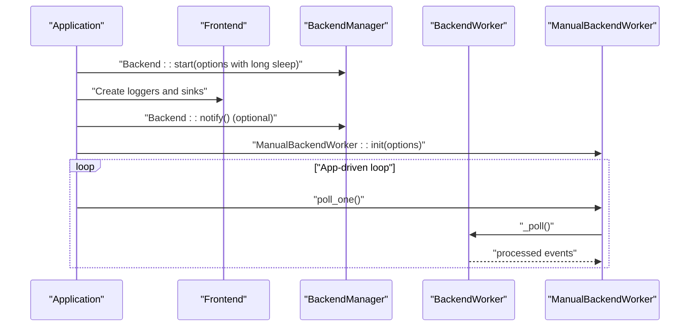
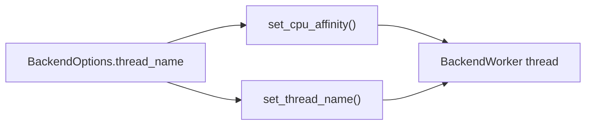
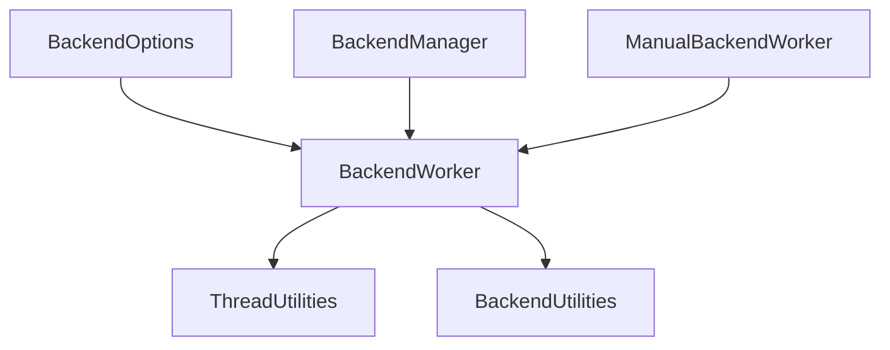

# Backend Thread Configuration

<cite>
**Referenced Files in This Document**
- [BackendOptions.h](file://include/quill/backend/BackendOptions.h)
- [BackendWorker.h](file://include/quill/backend/BackendWorker.h)
- [BackendManager.h](file://include/quill/backend/BackendManager.h)
- [ManualBackendWorker.h](file://include/quill/backend/ManualBackendWorker.h)
- [ThreadUtilities.h](file://include/quill/backend/ThreadUtilities.h)
- [BackendUtilities.h](file://include/quill/backend/BackendUtilities.h)
- [backend_thread_notify.cpp](file://examples/backend_thread_notify.cpp)
- [BackendLongSleepAndNotifyTest.cpp](file://test/integration_tests/BackendLongSleepAndNotifyTest.cpp)
- [quill_backend_throughput.cpp](file://benchmarks/backend_throughput/quill_backend_throughput.cpp)
- [quill_backend_throughput_no_buffering.cpp](file://benchmarks/backend_throughput/quill_backend_throughput_no_buffering.cpp)
</cite>

## Table of Contents
1. [Introduction](#introduction)
2. [Project Structure](#project-structure)
3. [Core Components](#core-components)
4. [Architecture Overview](#architecture-overview)
5. [Detailed Component Analysis](#detailed-component-analysis)
6. [Dependency Analysis](#dependency-analysis)
7. [Performance Considerations](#performance-considerations)
8. [Troubleshooting Guide](#troubleshooting-guide)
9. [Conclusion](#conclusion)
10. [Appendices](#appendices)

## Introduction
This document explains backend thread configuration and optimization in the logging library. It focuses on BackendOptions parameters related to sleep behavior, thread naming, CPU affinity, and notification mechanisms. It also covers CPU usage optimization techniques, thread priority considerations, and troubleshooting for performance issues such as excessive CPU usage, thread starvation, and notification problems. Practical tuning examples are provided for development and production environments.

## Project Structure
The backend thread lives in the backend subsystem and is controlled via BackendOptions. The main components are:
- BackendOptions: configuration struct for the backend thread
- BackendWorker: the backend thread implementation
- BackendManager: lifecycle management (start/stop/notify)
- ManualBackendWorker: optional manual control mode
- ThreadUtilities and BackendUtilities: thread naming and CPU affinity helpers

**Diagram sources**
- [BackendOptions.h:30-281](file://include/quill/backend/BackendOptions.h#L30-L281)
- [BackendWorker.h:138-207](file://include/quill/backend/BackendWorker.h#L138-L207)
- [BackendManager.h:61-96](file://include/quill/backend/BackendManager.h#L61-L96)
- [ManualBackendWorker.h:43-93](file://include/quill/backend/ManualBackendWorker.h#L43-L93)
- [ThreadUtilities.h:148-187](file://include/quill/backend/ThreadUtilities.h#L148-L187)
- [BackendUtilities.h:55-116](file://include/quill/backend/BackendUtilities.h#L55-L116)

**Section sources**
- [BackendOptions.h:30-281](file://include/quill/backend/BackendOptions.h#L30-L281)
- [BackendWorker.h:138-207](file://include/quill/backend/BackendWorker.h#L138-L207)
- [BackendManager.h:61-96](file://include/quill/backend/BackendManager.h#L61-L96)
- [ManualBackendWorker.h:43-93](file://include/quill/backend/ManualBackendWorker.h#L43-L93)
- [ThreadUtilities.h:148-187](file://include/quill/backend/ThreadUtilities.h#L148-L187)
- [BackendUtilities.h:55-116](file://include/quill/backend/BackendUtilities.h#L55-L116)

## Core Components
- BackendOptions
  - sleep_duration: idle sleep duration when no work is available
  - thread_name: backend thread name for debugging and introspection
  - cpu_affinity: bind backend to a specific CPU
  - transit_event_buffer_initial_capacity, transit_events_soft_limit, transit_events_hard_limit: buffering and batching controls
  - log_timestamp_ordering_grace_period: strictness of timestamp ordering
  - sink_min_flush_interval: minimum flush interval for sinks
  - enable_yield_when_idle: busy-wait yielding when idle
  - error_notifier, backend_worker_on_poll_begin/end: diagnostics and instrumentation hooks
  - rdtsc_resync_interval: TSC clock synchronization cadence
  - wait_for_queues_to_empty_before_exit: graceful shutdown behavior
  - check_backend_singleton_instance: singleton instance detection

- BackendWorker
  - run(): starts the backend thread, applies options (thread name, CPU affinity), enters main loop
  - _poll(): main loop logic; reads queues, batches, processes, flushes, sleeps/yields
  - notify(): wakes backend thread via condition variable
  - stop(): signals exit, notifies, joins

- BackendManager
  - start_backend_thread(), stop_backend_thread(), notify_backend_thread()

- ManualBackendWorker
  - init(): prepares backend for manual polling (disables sleep/yield)
  - poll_one()/poll()/poll(timeout): manual invocation of backend processing

**Section sources**
- [BackendOptions.h:30-281](file://include/quill/backend/BackendOptions.h#L30-L281)
- [BackendWorker.h:138-207](file://include/quill/backend/BackendWorker.h#L138-L207)
- [BackendWorker.h:305-395](file://include/quill/backend/BackendWorker.h#L305-L395)
- [BackendWorker.h:238-256](file://include/quill/backend/BackendWorker.h#L238-L256)
- [BackendWorker.h:212-232](file://include/quill/backend/BackendWorker.h#L212-L232)
- [BackendManager.h:61-96](file://include/quill/backend/BackendManager.h#L61-L96)
- [ManualBackendWorker.h:43-93](file://include/quill/backend/ManualBackendWorker.h#L43-L93)

## Architecture Overview
The backend thread runs independently and periodically processes log messages from per-thread frontend queues. It supports:
- Automatic sleep/yield/idle behavior controlled by sleep_duration and enable_yield_when_idle
- Manual notification to wake the backend when sleep_duration is long
- CPU affinity binding for predictable scheduling
- Strict timestamp ordering via grace period
- Periodic sink flushing controlled by sink_min_flush_interval

**Diagram sources**
- [BackendWorker.h:138-207](file://include/quill/backend/BackendWorker.h#L138-L207)
- [BackendWorker.h:305-395](file://include/quill/backend/BackendWorker.h#L305-L395)
- [BackendManager.h:61-96](file://include/quill/backend/BackendManager.h#L61-L96)

## Detailed Component Analysis

### BackendOptions Parameters and Behavior
- sleep_duration
  - When non-zero, the backend sleeps for the given duration between poll cycles
  - When zero and enable_yield_when_idle is true, the backend yields instead of sleeping
  - Used to reduce CPU usage when idle

- thread_name
  - Applied to the backend thread to aid debugging and monitoring
  - Implemented via set_thread_name

- cpu_affinity
  - Pins the backend thread to a specific CPU core
  - Useful for isolating logging overhead from user workloads

- transit_event_buffer_* and soft/hard limits
  - Control buffering and batching of transit events
  - Soft limit triggers batch processing when exceeded
  - Hard limit bounds per-thread buffering capacity

- log_timestamp_ordering_grace_period
  - Adds a grace period to ensure strict ordering across threads
  - Higher values increase correctness but may delay processing

- sink_min_flush_interval
  - Minimum interval between sink flushes
  - Zero disables throttling and flushes whenever possible

- enable_yield_when_idle
  - When sleep_duration is zero, yields instead of sleeping to reduce scheduler latency

- error_notifier, backend_worker_on_poll_begin/end
  - Diagnostics and instrumentation hooks

- rdtsc_resync_interval
  - Controls how often TSC clock is resynchronized

- wait_for_queues_to_empty_before_exit
  - Controls graceful shutdown behavior

- check_backend_singleton_instance
  - Prevents multiple backend instances

**Section sources**
- [BackendOptions.h:30-281](file://include/quill/backend/BackendOptions.h#L30-L281)
- [BackendWorker.h:156-170](file://include/quill/backend/BackendWorker.h#L156-L170)
- [BackendWorker.h:370-387](file://include/quill/backend/BackendWorker.h#L370-L387)

### BackendWorker Poll Loop and Sleep/Yield Logic
The backend loop performs:
- Update thread context cache
- Populate transit events from frontend queues
- Process either single or batched events depending on soft limit
- Flush sinks and resync RDTSC when idle
- Sleep or yield based on options

**Diagram sources**
- [BackendWorker.h:305-395](file://include/quill/backend/BackendWorker.h#L305-L395)

**Section sources**
- [BackendWorker.h:305-395](file://include/quill/backend/BackendWorker.h#L305-L395)

### ManualBackendWorker and Notification Mechanisms
ManualBackendWorker disables automatic sleep/yield and lets the caller drive processing. It requires the backend to be initialized with sleep_duration = 0 and enable_yield_when_idle = false. Notifications are used to wake the backend when sleep_duration is long.

**Diagram sources**
- [ManualBackendWorker.h:43-93](file://include/quill/backend/ManualBackendWorker.h#L43-L93)
- [BackendManager.h:61-96](file://include/quill/backend/BackendManager.h#L61-L96)

**Section sources**
- [ManualBackendWorker.h:43-93](file://include/quill/backend/ManualBackendWorker.h#L43-L93)
- [BackendManager.h:61-96](file://include/quill/backend/BackendManager.h#L61-L96)

### CPU Affinity and Thread Naming
- CPU affinity is applied during backend startup if cpu_affinity is set
- Thread name is set during backend startup for easier debugging

**Diagram sources**
- [BackendWorker.h:156-170](file://include/quill/backend/BackendWorker.h#L156-L170)
- [BackendUtilities.h:55-116](file://include/quill/backend/BackendUtilities.h#L55-L116)
- [ThreadUtilities.h:148-187](file://include/quill/backend/ThreadUtilities.h#L148-L187)

**Section sources**
- [BackendWorker.h:156-170](file://include/quill/backend/BackendWorker.h#L156-L170)
- [BackendUtilities.h:55-116](file://include/quill/backend/BackendUtilities.h#L55-L116)
- [ThreadUtilities.h:148-187](file://include/quill/backend/ThreadUtilities.h#L148-L187)

## Dependency Analysis
- BackendWorker depends on:
  - BackendOptions for configuration
  - ThreadUtilities for thread name
  - BackendUtilities for CPU affinity
  - Logger/Sink managers for formatting and writing
- BackendManager orchestrates BackendWorker lifecycle and exposes notify
- ManualBackendWorker wraps BackendWorker for manual control

**Diagram sources**
- [BackendOptions.h:30-281](file://include/quill/backend/BackendOptions.h#L30-L281)
- [BackendWorker.h:138-207](file://include/quill/backend/BackendWorker.h#L138-L207)
- [BackendManager.h:61-96](file://include/quill/backend/BackendManager.h#L61-L96)
- [ManualBackendWorker.h:43-93](file://include/quill/backend/ManualBackendWorker.h#L43-L93)

**Section sources**
- [BackendWorker.h:138-207](file://include/quill/backend/BackendWorker.h#L138-L207)
- [BackendManager.h:61-96](file://include/quill/backend/BackendManager.h#L61-L96)
- [ManualBackendWorker.h:43-93](file://include/quill/backend/ManualBackendWorker.h#L43-L93)

## Performance Considerations
- Reduce CPU usage by increasing sleep_duration or enabling enable_yield_when_idle when idle
- Use ManualBackendWorker to eliminate periodic wake-ups in tight loops
- Pin backend to a dedicated CPU via cpu_affinity to minimize migration overhead
- Tune transit_event_buffer_initial_capacity, transit_events_soft_limit, and transit_events_hard_limit to balance latency and memory
- Adjust sink_min_flush_interval to reduce I/O pressure
- Use log_timestamp_ordering_grace_period judiciously; larger values improve ordering but may delay processing
- For high-throughput scenarios, consider disabling sleep (sleep_duration = 0) and relying on notifications or manual polling

**Section sources**
- [BackendOptions.h:49](file://include/quill/backend/BackendOptions.h#L49)
- [BackendOptions.h:44](file://include/quill/backend/BackendOptions.h#L44)
- [BackendOptions.h:224](file://include/quill/backend/BackendOptions.h#L224)
- [BackendOptions.h:58](file://include/quill/backend/BackendOptions.h#L58)
- [BackendOptions.h:75](file://include/quill/backend/BackendOptions.h#L75)
- [BackendOptions.h:92](file://include/quill/backend/BackendOptions.h#L92)
- [BackendOptions.h:132](file://include/quill/backend/BackendOptions.h#L132)
- [quill_backend_throughput.cpp:21](file://benchmarks/backend_throughput/quill_backend_throughput.cpp#L21)
- [quill_backend_throughput_no_buffering.cpp:21](file://benchmarks/backend_throughput/quill_backend_throughput_no_buffering.cpp#L21)

## Troubleshooting Guide
- Excessive CPU usage
  - Symptom: backend thread consumes high CPU even when idle
  - Actions:
    - Increase sleep_duration
    - Enable enable_yield_when_idle when sleep_duration is zero
    - Consider ManualBackendWorker to avoid periodic wake-ups
    - Review sink_min_flush_interval and transit limits

- Thread starvation or delayed processing
  - Symptom: logs appear late or not at all with long sleep_duration
  - Actions:
    - Call Backend::notify() to wake the backend proactively
    - Use ManualBackendWorker and poll() in application-controlled loops
    - Reduce sleep_duration or disable sleep for bursty workloads

- Notification problems
  - Symptom: notify() does not wake backend
  - Actions:
    - Ensure backend is started with Backend::start(options)
    - Confirm notify() is called from any thread
    - Verify sleep_duration is non-zero or enable_yield_when_idle is false

- Timestamp ordering anomalies
  - Symptom: out-of-order logs across threads
  - Actions:
    - Increase log_timestamp_ordering_grace_period moderately
    - Ensure clocks are sane; TSC resync cadence is controlled by rdtsc_resync_interval

- Graceful shutdown hangs
  - Symptom: backend does not exit cleanly
  - Actions:
    - Adjust wait_for_queues_to_empty_before_exit
    - Ensure no continuous logging during shutdown

- Singleton conflicts
  - Symptom: multiple backend instances or crashes
  - Actions:
    - Keep check_backend_singleton_instance enabled
    - Avoid mixing static and shared library builds incorrectly

**Section sources**
- [BackendWorker.h:370-387](file://include/quill/backend/BackendWorker.h#L370-L387)
- [BackendWorker.h:238-256](file://include/quill/backend/BackendWorker.h#L238-L256)
- [BackendManager.h:90](file://include/quill/backend/BackendManager.h#L90)
- [BackendOptions.h:145](file://include/quill/backend/BackendOptions.h#L145)
- [BackendOptions.h:132](file://include/quill/backend/BackendOptions.h#L132)
- [BackendOptions.h:280](file://include/quill/backend/BackendOptions.h#L280)

## Conclusion
Backend thread configuration centers on balancing responsiveness and CPU efficiency. For development, shorter sleep durations and frequent notifications help catch issues quickly. For production, tune sleep_duration, CPU affinity, and flush intervals to minimize overhead while preserving correctness. Use ManualBackendWorker for deterministic control, and rely on notify() to wake the backend when necessary.

## Appendices

### Practical Tuning Examples

- Development environment
  - Lower sleep_duration and enable_yield_when_idle to reduce latency
  - Keep log_timestamp_ordering_grace_period small
  - Use default sink_min_flush_interval to observe logs promptly

- Production environment
  - Increase sleep_duration and set enable_yield_when_idle to false
  - Pin backend to a dedicated CPU via cpu_affinity
  - Increase sink_min_flush_interval to reduce I/O churn
  - Monitor dropped messages via error_notifier and adjust transit limits accordingly

- High-throughput scenarios
  - Disable sleep (sleep_duration = 0) and use ManualBackendWorker
  - Reduce log_timestamp_ordering_grace_period to moderate values
  - Tune transit limits to match expected burst sizes

- Long sleep with notifications
  - Set sleep_duration to a large value
  - Proactively call notify() when bursts are expected
  - Validate with tests similar to BackendLongSleepAndNotifyTest

**Section sources**
- [quill_backend_throughput.cpp:21](file://benchmarks/backend_throughput/quill_backend_throughput.cpp#L21)
- [quill_backend_throughput_no_buffering.cpp:21](file://benchmarks/backend_throughput/quill_backend_throughput_no_buffering.cpp#L21)
- [backend_thread_notify.cpp:25-27](file://examples/backend_thread_notify.cpp#L25-L27)
- [BackendLongSleepAndNotifyTest.cpp:25-27](file://test/integration_tests/BackendLongSleepAndNotifyTest.cpp#L25-L27)