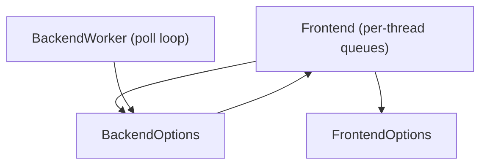
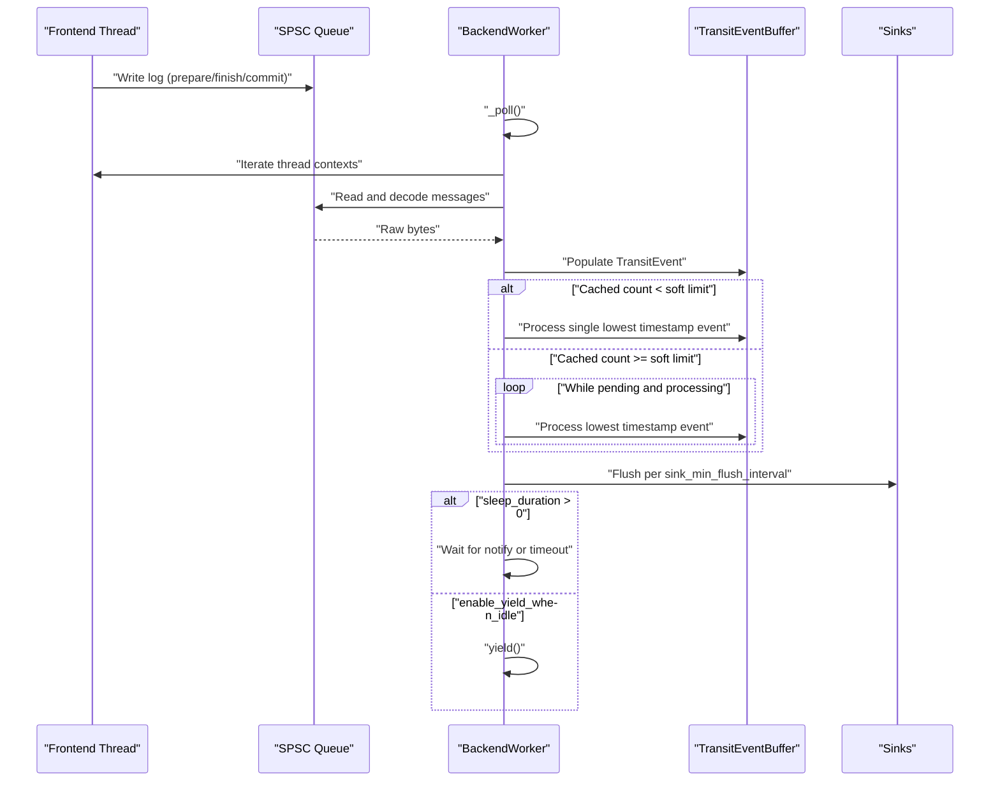
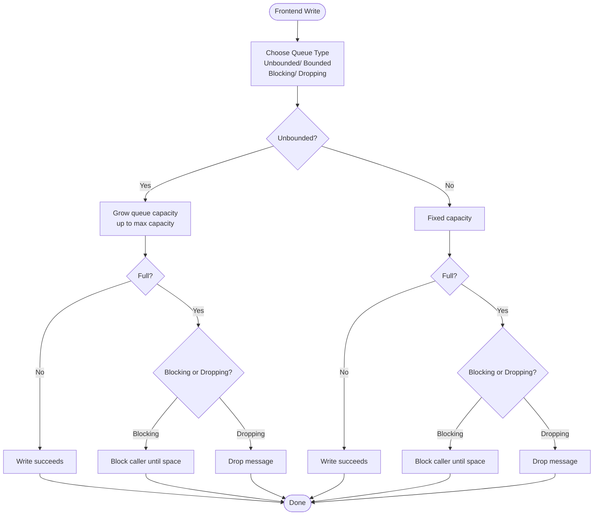
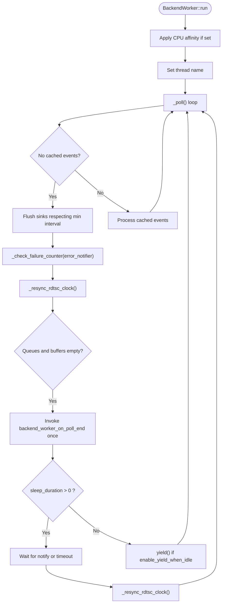
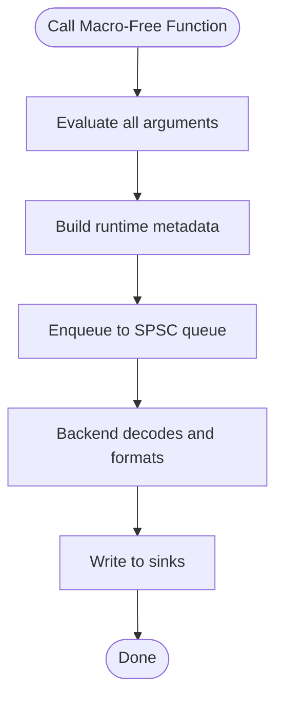
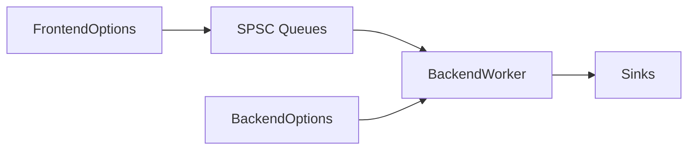

# Configuration Problems

<cite>
**Referenced Files in This Document**
- [BackendOptions.h](file://include/quill/backend/BackendOptions.h)
- [FrontendOptions.h](file://include/quill/core/FrontendOptions.h)
- [BoundedSPSCQueue.h](file://include/quill/core/BoundedSPSCQueue.h)
- [UnboundedSPSCQueue.h](file://include/quill/core/UnboundedSPSCQueue.h)
- [BackendWorker.h](file://include/quill/backend/BackendWorker.h)
- [macro_free_mode.rst](file://docs/macro_free_mode.rst)
- [frontend_options.rst](file://docs/frontend_options.rst)
- [backend_options.rst](file://docs/backend_options.rst)
- [bounded_dropping_queue_frontend.cpp](file://examples/bounded_dropping_queue_frontend.cpp)
- [custom_frontend_options.cpp](file://examples/custom_frontend_options.cpp)
- [console_logging_macro_free.cpp](file://examples/console_logging_macro_free.cpp)
- [backend_thread_notify.cpp](file://examples/backend_thread_notify.cpp)
- [BoundedDroppingQueueTest.cpp](file://test/integration_tests/BoundedDroppingQueueTest.cpp)
- [UnboundedUnlimitedQueueTest.cpp](file://test/integration_tests/UnboundedUnlimitedQueueTest.cpp)
- [MacroFreeBacktraceFlushTest.cpp](file://test/integration_tests/MacroFreeBacktraceFlushTest.cpp)
</cite>

## Table of Contents
1. [Introduction](#introduction)
2. [Project Structure](#project-structure)
3. [Core Components](#core-components)
4. [Architecture Overview](#architecture-overview)
5. [Detailed Component Analysis](#detailed-component-analysis)
6. [Dependency Analysis](#dependency-analysis)
7. [Performance Considerations](#performance-considerations)
8. [Troubleshooting Guide](#troubleshooting-guide)
9. [Conclusion](#conclusion)
10. [Appendices](#appendices)

## Introduction
This document focuses on diagnosing and resolving Quill configuration issues with a strong emphasis on:
- Queue behavior: choosing bounded versus unbounded queues, blocking versus dropping modes, and capacity management
- Backend thread configuration: sleep duration, CPU affinity, and hooks
- Macro-free mode trade-offs and appropriate usage
- FrontendOptions and BackendOptions configuration pitfalls and validations
- Practical troubleshooting workflows and step-by-step resolutions

## Project Structure
Key configuration-related areas:
- Frontend queue configuration: compile-time FrontendOptions and runtime BackendOptions
- Backend worker behavior: sleep scheduling, CPU affinity, flush intervals, and error notifications
- Macro-free logging interface and its performance characteristics
- Examples and tests demonstrating queue modes, backend tuning, and macro-free usage

**Diagram sources**
- [BackendWorker.h:138-207](file://include/quill/backend/BackendWorker.h#L138-L207)
- [BackendOptions.h:30-281](file://include/quill/backend/BackendOptions.h#L30-L281)
- [FrontendOptions.h:16-51](file://include/quill/core/FrontendOptions.h#L16-L51)

**Section sources**
- [BackendWorker.h:138-207](file://include/quill/backend/BackendWorker.h#L138-L207)
- [BackendOptions.h:30-281](file://include/quill/backend/BackendOptions.h#L30-L281)
- [FrontendOptions.h:16-51](file://include/quill/core/FrontendOptions.h#L16-L51)

## Core Components
- FrontendOptions controls compile-time queue behavior and memory policy for each frontend thread
- BackendOptions controls runtime behavior of the backend worker thread, including sleep scheduling, CPU affinity, flush intervals, and error notifications
- BackendWorker implements the backend polling loop, queue consumption, timestamp ordering, and resource management

**Section sources**
- [FrontendOptions.h:16-51](file://include/quill/core/FrontendOptions.h#L16-L51)
- [BackendOptions.h:30-281](file://include/quill/backend/BackendOptions.h#L30-L281)
- [BackendWorker.h:305-395](file://include/quill/backend/BackendWorker.h#L305-L395)

## Architecture Overview
The backend worker runs a continuous poll loop that:
- Updates thread context caches
- Reads all frontend queues and buffers messages as transit events
- Processes the lowest-timestamp transit event(s) based on soft/hard limits
- Flushes sinks according to minimum flush interval
- Sleeps or yields based on sleep_duration and enable_yield_when_idle
- Resynchronizes TSC clock when needed

**Diagram sources**
- [BackendWorker.h:305-395](file://include/quill/backend/BackendWorker.h#L305-L395)
- [BackendWorker.h:479-573](file://include/quill/backend/BackendWorker.h#L479-L573)
- [BackendOptions.h:49-224](file://include/quill/backend/BackendOptions.h#L49-L224)

## Detailed Component Analysis

### Queue Behavior: Bounded vs Unbounded, Blocking vs Dropping, Capacity Management
- Queue types and policies are compile-time via FrontendOptions
- Unbounded queues can reallocate up to a maximum capacity and either block or drop depending on the chosen type
- Bounded queues never reallocate; they either block or drop when full
- Capacity management includes initial capacity, maximum capacity for unbounded queues, and per-queue shrinking for unbounded queues

**Diagram sources**
- [FrontendOptions.h:16-51](file://include/quill/core/FrontendOptions.h#L16-L51)
- [UnboundedSPSCQueue.h:244-297](file://include/quill/core/UnboundedSPSCQueue.h#L244-L297)
- [BoundedSPSCQueue.h:105-145](file://include/quill/core/BoundedSPSCQueue.h#L105-L145)

Practical guidance:
- Prefer UnboundedBlocking for bursty workloads to avoid drops; tune initial and max capacities
- Use BoundedDropping for hard real-time systems where drops are acceptable and memory must not grow
- Monitor queue growth and use per-thread shrinking for unbounded queues when bursts subside

**Section sources**
- [FrontendOptions.h:16-51](file://include/quill/core/FrontendOptions.h#L16-L51)
- [UnboundedSPSCQueue.h:79-183](file://include/quill/core/UnboundedSPSCQueue.h#L79-L183)
- [BoundedSPSCQueue.h:60-95](file://include/quill/core/BoundedSPSCQueue.h#L60-L95)
- [frontend_options.rst:10-31](file://docs/frontend_options.rst#L10-L31)

### Backend Thread Configuration: Sleep Duration, CPU Affinity, Hooks
- sleep_duration controls idle wait time; combined with enable_yield_when_idle for cooperative yielding
- cpu_affinity pins the backend thread to a CPU; use a sentinel value to disable
- sink_min_flush_interval governs minimum flush cadence across all sinks
- backend_worker_on_poll_begin/end hooks allow instrumentation
- error_notifier receives notifications for queue reallocations and drops

**Diagram sources**
- [BackendWorker.h:138-207](file://include/quill/backend/BackendWorker.h#L138-L207)
- [BackendWorker.h:305-395](file://include/quill/backend/BackendWorker.h#L305-L395)
- [BackendOptions.h:36-224](file://include/quill/backend/BackendOptions.h#L36-L224)

Best practices:
- Keep sleep_duration reasonable; use notify() to wake promptly when needed
- Pin backend to a non-critical CPU to reduce contention
- Use hooks for lightweight instrumentation; avoid heavy work in hooks

**Section sources**
- [BackendWorker.h:138-207](file://include/quill/backend/BackendWorker.h#L138-L207)
- [BackendWorker.h:305-395](file://include/quill/backend/BackendWorker.h#L305-L395)
- [BackendOptions.h:36-224](file://include/quill/backend/BackendOptions.h#L36-L224)
- [backend_options.rst:1-46](file://docs/backend_options.rst#L1-L46)

### Macro-Free Mode Trade-offs and Usage
- Macro-free functions are implemented using compiler built-ins and incur overhead compared to macros
- Arguments are always evaluated; compile-time removal is not available
- Additional runtime checks (e.g., null logger) add safety but reduce throughput
- Recommended for scenarios favoring cleaner code over peak hot-path performance

**Diagram sources**
- [macro_free_mode.rst:10-25](file://docs/macro_free_mode.rst#L10-L25)
- [console_logging_macro_free.cpp:15-61](file://examples/console_logging_macro_free.cpp#L15-L61)

**Section sources**
- [macro_free_mode.rst:1-51](file://docs/macro_free_mode.rst#L1-L51)
- [console_logging_macro_free.cpp:15-61](file://examples/console_logging_macro_free.cpp#L15-L61)

### FrontendOptions and BackendOptions Configuration Challenges
Common pitfalls:
- Mismatched queue types across the app (compile-time requirement)
- Invalid transit event buffer limits (must be powers of two; soft ≤ hard)
- Improper CPU affinity values or missing permissions
- Excessive sleep durations leading to delayed flushes
- Disabling character sanitization without considering non-ASCII content

Validation and setup tips:
- Define a single FrontendOptions for the app and use matching FrontendImpl/LoggerImpl types
- Ensure BackendOptions::transit_events_soft_limit and hard_limit are powers of two and soft ≤ hard
- Use BackendOptions::error_notifier to capture queue reallocation/drop events
- Adjust BackendOptions::sink_min_flush_interval to balance latency and throughput

**Section sources**
- [FrontendOptions.h:16-51](file://include/quill/core/FrontendOptions.h#L16-L51)
- [BackendOptions.h:58-92](file://include/quill/backend/BackendOptions.h#L58-L92)
- [BackendOptions.h:421-437](file://include/quill/backend/BackendOptions.h#L421-L437)
- [frontend_options.rst:23-31](file://docs/frontend_options.rst#L23-L31)
- [backend_options.rst:17-46](file://docs/backend_options.rst#L17-L46)

## Dependency Analysis
- FrontendOptions drives queue type and capacity policy at compile time
- BackendOptions influences runtime behavior of BackendWorker
- BackendWorker depends on queue implementations and enforces buffer limits and ordering

**Diagram sources**
- [FrontendOptions.h:16-51](file://include/quill/core/FrontendOptions.h#L16-L51)
- [BackendOptions.h:30-281](file://include/quill/backend/BackendOptions.h#L30-L281)
- [BackendWorker.h:479-573](file://include/quill/backend/BackendWorker.h#L479-L573)

**Section sources**
- [FrontendOptions.h:16-51](file://include/quill/core/FrontendOptions.h#L16-L51)
- [BackendOptions.h:30-281](file://include/quill/backend/BackendOptions.h#L30-L281)
- [BackendWorker.h:479-573](file://include/quill/backend/BackendWorker.h#L479-L573)

## Performance Considerations
- Unbounded queues with large max capacity improve resilience but increase memory footprint
- Bounded queues with dropping reduce memory but risk losing logs under overload
- Lower sleep_duration improves responsiveness but increases CPU usage
- CPU affinity reduces context switches but may concentrate load on specific cores
- Timestamp ordering grace period trades correctness for throughput; tune based on workload

[No sources needed since this section provides general guidance]

## Troubleshooting Guide

### Step-by-Step Resolution Guides

#### Scenario 1: Logs Are Being Dropped Under Load
- Symptom: Missing logs in high-throughput scenarios
- Likely cause: Bounded queue with dropping or unbounded queue hitting max capacity
- Actions:
  - Verify queue type and capacity in FrontendOptions
  - Enable error_notifier to observe drops and reallocations
  - Consider switching to UnboundedBlocking or increasing unbounded_queue_max_capacity
  - For bounded queues, increase initial capacity or switch to BoundedDropping if drops are acceptable

**Section sources**
- [frontend_options.rst:23-31](file://docs/frontend_options.rst#L23-L31)
- [BoundedDroppingQueueTest.cpp:27-80](file://test/integration_tests/BoundedDroppingQueueTest.cpp#L27-L80)

#### Scenario 2: Backend Thread Not Waking Up Promptly
- Symptom: Delayed log flushes despite active logging
- Likely cause: High sleep_duration or long idle periods
- Actions:
  - Reduce BackendOptions::sleep_duration or rely on notify() to wake the backend
  - Use Backend::notify() after bursts to force processing
  - Consider enabling enable_yield_when_idle for cooperative yielding during idle periods

**Section sources**
- [backend_thread_notify.cpp:22-59](file://examples/backend_thread_notify.cpp#L22-L59)
- [BackendWorker.h:370-387](file://include/quill/backend/BackendWorker.h#L370-L387)
- [BackendOptions.h:49-49](file://include/quill/backend/BackendOptions.h#L49-L49)

#### Scenario 3: Out-of-Order Logs Observed
- Symptom: Logs appear out of timestamp order
- Likely cause: Timestamp ordering grace period not configured or mismatched clock sources
- Actions:
  - Set BackendOptions::log_timestamp_ordering_grace_period to a small positive value
  - Ensure consistent clock sources across loggers; TSC requires RDTSC resync configuration

**Section sources**
- [BackendOptions.h:132-132](file://include/quill/backend/BackendOptions.h#L132-L132)
- [BackendWorker.h:481-484](file://include/quill/backend/BackendWorker.h#L481-L484)
- [BackendWorker.h:613-629](file://include/quill/backend/BackendWorker.h#L613-L629)

#### Scenario 4: Backend Thread Consumes Too Much CPU
- Symptom: Elevated CPU usage when idle
- Likely cause: Very low or zero sleep_duration
- Actions:
  - Increase sleep_duration or enable enable_yield_when_idle
  - Use notify() sparingly to avoid frequent wake-ups

**Section sources**
- [BackendWorker.h:370-387](file://include/quill/backend/BackendWorker.h#L370-L387)
- [BackendOptions.h:49-49](file://include/quill/backend/BackendOptions.h#L49-L49)

#### Scenario 5: Non-ASCII Characters Appear Garbled
- Symptom: Non-printable or non-ASCII characters rendered incorrectly
- Likely cause: Character sanitization filtering
- Actions:
  - Disable character sanitization or customize the printable character filter
  - Ensure UTF-8 support is enabled in your environment

**Section sources**
- [backend_options.rst:17-46](file://docs/backend_options.rst#L17-L46)
- [BackendOptions.h:239-240](file://include/quill/backend/BackendOptions.h#L239-L240)

#### Scenario 6: Macro-Free Mode Performance Issues
- Symptom: Higher latency or reduced throughput
- Likely cause: Runtime metadata overhead and argument evaluation
- Actions:
  - Prefer macro-based logging for hot paths
  - Use macro-free mode for cleaner code when performance is less critical

**Section sources**
- [macro_free_mode.rst:10-25](file://docs/macro_free_mode.rst#L10-L25)
- [console_logging_macro_free.cpp:15-61](file://examples/console_logging_macro_free.cpp#L15-L61)

### Validation and Parameter Verification Workflow
- Confirm FrontendOptions queue type and capacities match expectations
- Validate BackendOptions limits (powers of two, soft ≤ hard)
- Verify CPU affinity settings and permissions
- Test with minimal configuration and gradually tune parameters
- Use error_notifier to capture queue behavior in production-like loads

**Section sources**
- [FrontendOptions.h:16-51](file://include/quill/core/FrontendOptions.h#L16-L51)
- [BackendOptions.h:421-437](file://include/quill/backend/BackendOptions.h#L421-L437)
- [frontend_options.rst:23-31](file://docs/frontend_options.rst#L23-L31)

### Runtime Behavior Analysis
- Instrument backend poll cycles using backend_worker_on_poll_begin/end hooks
- Monitor sink flush cadence via sink_min_flush_interval
- Observe transit event buffer sizes and ordering behavior under load

**Section sources**
- [BackendWorker.h:260-279](file://include/quill/backend/BackendWorker.h#L260-L279)
- [BackendOptions.h:185-192](file://include/quill/backend/BackendOptions.h#L185-L192)
- [BackendOptions.h:224-224](file://include/quill/backend/BackendOptions.h#L224-L224)

## Conclusion
Proper Quill configuration hinges on understanding the interplay between frontend queue policies and backend thread behavior. Select queue types based on workload characteristics, validate backend limits and scheduling, and leverage error_notifier and hooks for observability. Use macro-free mode judiciously and tailor settings to your specific performance and correctness requirements.

[No sources needed since this section summarizes without analyzing specific files]

## Appendices

### Practical Examples and Tests
- Custom FrontendOptions and BoundedDropping queue usage
- Macro-free logging across log levels
- Backend notify wake-up patterns
- Integration tests validating queue behavior and macro-free backtrace flushing

**Section sources**
- [custom_frontend_options.cpp:14-27](file://examples/custom_frontend_options.cpp#L14-L27)
- [bounded_dropping_queue_frontend.cpp:21-32](file://examples/bounded_dropping_queue_frontend.cpp#L21-L32)
- [console_logging_macro_free.cpp:35-60](file://examples/console_logging_macro_free.cpp#L35-L60)
- [backend_thread_notify.cpp:22-59](file://examples/backend_thread_notify.cpp#L22-L59)
- [BoundedDroppingQueueTest.cpp:14-25](file://test/integration_tests/BoundedDroppingQueueTest.cpp#L14-L25)
- [UnboundedUnlimitedQueueTest.cpp:14-25](file://test/integration_tests/UnboundedUnlimitedQueueTest.cpp#L14-L25)
- [MacroFreeBacktraceFlushTest.cpp:17-17](file://test/integration_tests/MacroFreeBacktraceFlushTest.cpp#L17-L17)