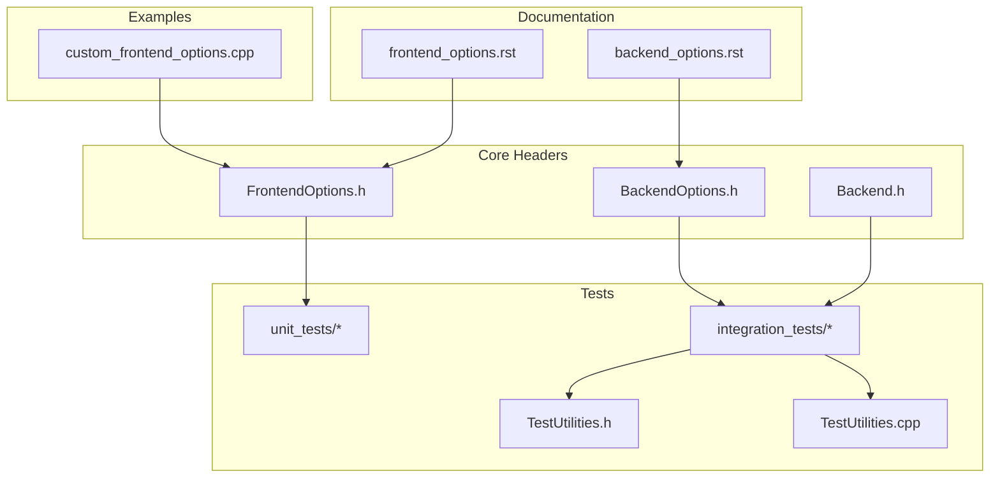
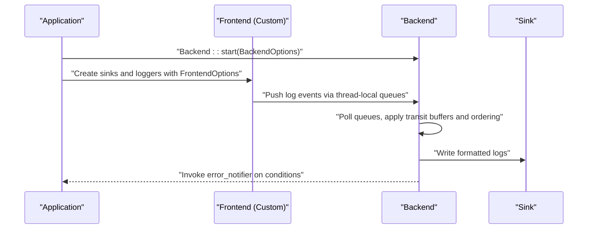
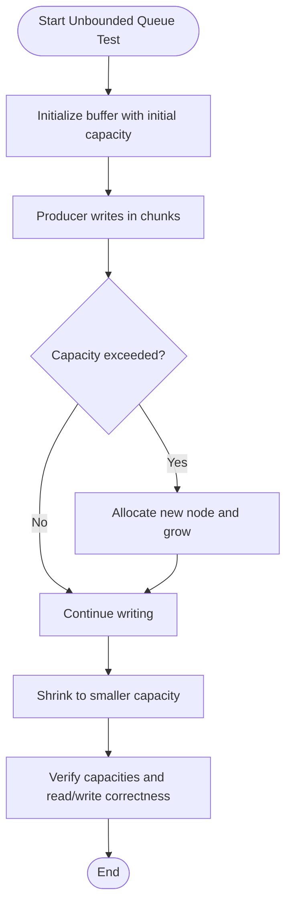
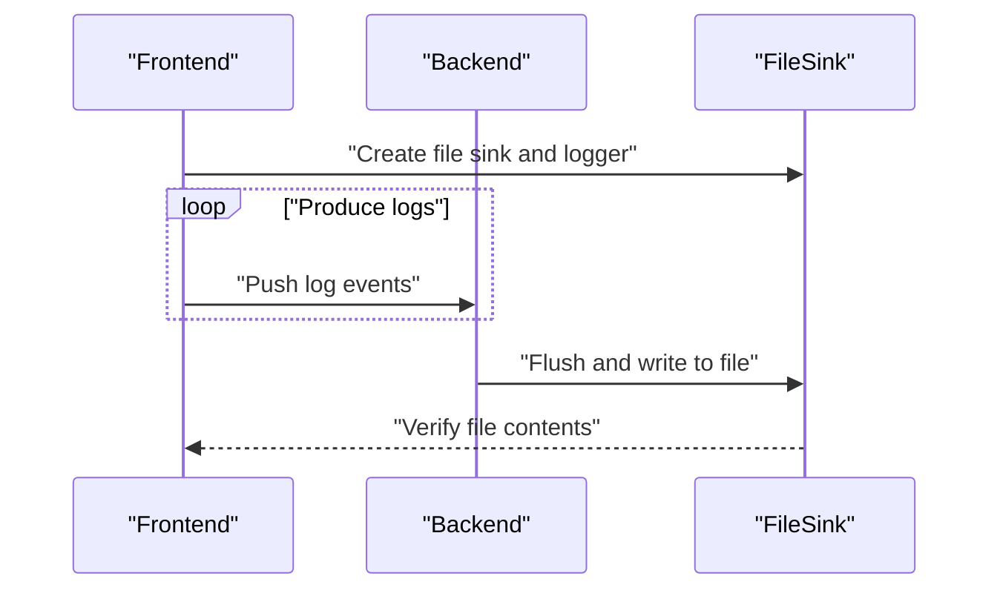
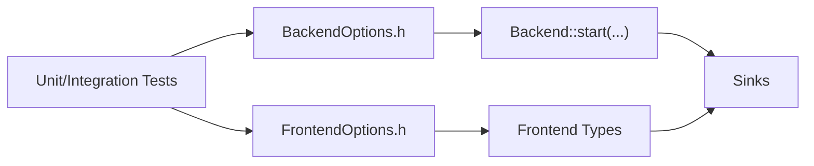

# Configuration Validation Workflow

<cite>
**Referenced Files in This Document**
- [FrontendOptions.h](file://include/quill/core/FrontendOptions.h)
- [BackendOptions.h](file://include/quill/backend/BackendOptions.h)
- [Backend.h](file://include/quill/Backend.h)
- [custom_frontend_options.cpp](file://examples/custom_frontend_options.cpp)
- [frontend_options.rst](file://docs/frontend_options.rst)
- [backend_options.rst](file://docs/backend_options.rst)
- [CMakeLists.txt (unit tests)](file://test/unit_tests/CMakeLists.txt)
- [CMakeLists.txt (integration tests)](file://test/integration_tests/CMakeLists.txt)
- [TestUtilities.h](file://test/misc/TestUtilities.h)
- [TestUtilities.cpp](file://test/misc/TestUtilities.cpp)
- [BackendTransitBufferSoftLimitTest.cpp](file://test/integration_tests/BackendTransitBufferSoftLimitTest.cpp)
- [MultiFrontendThreadsTest.cpp](file://test/integration_tests/MultiFrontendThreadsTest.cpp)
- [UnboundedQueueTest.cpp](file://test/unit_tests/UnboundedQueueTest.cpp)
- [BoundedSPSCQueue.h](file://include/quill/core/BoundedSPSCQueue.h)
- [UnboundedSPSCQueue.h](file://include/quill/core/UnboundedSPSCQueue.h)
</cite>

## Table of Contents
1. [Introduction](#introduction)
2. [Project Structure](#project-structure)
3. [Core Components](#core-components)
4. [Architecture Overview](#architecture-overview)
5. [Detailed Component Analysis](#detailed-component-analysis)
6. [Dependency Analysis](#dependency-analysis)
7. [Performance Considerations](#performance-considerations)
8. [Troubleshooting Guide](#troubleshooting-guide)
9. [Conclusion](#conclusion)
10. [Appendices](#appendices)

## Introduction
This document describes a comprehensive configuration validation and troubleshooting workflow for the Quill logging library. It focuses on validating FrontendOptions and BackendOptions parameter correctness, outlines unit and integration testing methodologies, provides checklists for common validation scenarios, and details debugging techniques for parameter verification, runtime behavior, and performance validation. It also covers migration strategies and backward compatibility considerations during library updates.

## Project Structure
The repository organizes configuration-related code and tests across core headers, documentation, examples, and a robust test suite:
- Core configuration structs: FrontendOptions and BackendOptions
- Backend startup and signal handling
- Example usage of custom FrontendOptions
- Documentation for FrontendOptions and BackendOptions
- Unit and integration tests validating queue behavior and end-to-end logging

**Diagram sources**
- [FrontendOptions.h:16-50](file://include/quill/core/FrontendOptions.h#L16-L50)
- [BackendOptions.h:30-281](file://include/quill/backend/BackendOptions.h#L30-L281)
- [Backend.h:86-111](file://include/quill/Backend.h#L86-L111)
- [frontend_options.rst:1-103](file://docs/frontend_options.rst#L1-L103)
- [backend_options.rst:1-46](file://docs/backend_options.rst#L1-L46)
- [custom_frontend_options.cpp:14-27](file://examples/custom_frontend_options.cpp#L14-L27)
- [CMakeLists.txt (unit tests):1-83](file://test/unit_tests/CMakeLists.txt#L1-L83)
- [CMakeLists.txt (integration tests):1-161](file://test/integration_tests/CMakeLists.txt#L1-L161)
- [TestUtilities.h:16-30](file://test/misc/TestUtilities.h#L16-L30)
- [TestUtilities.cpp:21-171](file://test/misc/TestUtilities.cpp#L21-L171)

**Section sources**
- [FrontendOptions.h:16-50](file://include/quill/core/FrontendOptions.h#L16-L50)
- [BackendOptions.h:30-281](file://include/quill/backend/BackendOptions.h#L30-L281)
- [Backend.h:86-111](file://include/quill/Backend.h#L86-L111)
- [frontend_options.rst:1-103](file://docs/frontend_options.rst#L1-L103)
- [backend_options.rst:1-46](file://docs/backend_options.rst#L1-L46)
- [custom_frontend_options.cpp:14-27](file://examples/custom_frontend_options.cpp#L14-L27)
- [CMakeLists.txt (unit tests):1-83](file://test/unit_tests/CMakeLists.txt#L1-L83)
- [CMakeLists.txt (integration tests):1-161](file://test/integration_tests/CMakeLists.txt#L1-L161)
- [TestUtilities.h:16-30](file://test/misc/TestUtilities.h#L16-L30)
- [TestUtilities.cpp:21-171](file://test/misc/TestUtilities.cpp#L21-L171)

## Core Components
- FrontendOptions: Defines compile-time queue behavior for each frontend thread, including queue type, initial capacity, blocking retry interval, maximum capacity for unbounded queues, and huge pages policy.
- BackendOptions: Defines runtime behavior for the backend worker thread, including thread naming, idle yielding, sleep duration, transit event buffer sizing, timestamp ordering grace period, flush intervals, CPU affinity, error notification hooks, printable character filtering, log level descriptors, and singleton instance checking.

Key responsibilities:
- FrontendOptions governs hot-path queue allocation and growth policies.
- BackendOptions governs backend scheduling, buffering, flushing, and diagnostics.

Validation focus areas:
- Parameter ranges and defaults
- Interdependencies (e.g., queue type with capacity semantics)
- Backend behavior toggles (e.g., busy-wait vs sleep, singleton checks)
- Printable character filtering and UTF-8 handling

**Section sources**
- [FrontendOptions.h:16-50](file://include/quill/core/FrontendOptions.h#L16-L50)
- [BackendOptions.h:30-281](file://include/quill/backend/BackendOptions.h#L30-L281)

## Architecture Overview
The configuration workflow spans compile-time and runtime phases:
- Compile-time: Define FrontendOptions and use them to instantiate custom Frontend and Logger types.
- Runtime: Start the backend with BackendOptions and validate behavior via integration tests and utilities.

**Diagram sources**
- [Backend.h:86-111](file://include/quill/Backend.h#L86-L111)
- [custom_frontend_options.cpp:23-42](file://examples/custom_frontend_options.cpp#L23-L42)
- [BackendOptions.h:30-281](file://include/quill/backend/BackendOptions.h#L30-L281)

## Detailed Component Analysis

### FrontendOptions Validation
FrontendOptions controls per-thread queue behavior and memory policies. Validation should ensure:
- Queue type consistency across the application
- Initial capacity and maximum capacity are reasonable for workload
- Blocking retry interval aligns with expected contention
- Huge pages policy is appropriate for platform support

Recommended validation steps:
- Verify queue type selection matches intended behavior (blocking vs dropping)
- Confirm initial capacity supports bursty logging without immediate blocking/dropping
- Ensure unbounded queue max capacity is sufficient for peak loads
- Validate blocking retry interval for contention scenarios
- Check huge pages policy on supported platforms

Common pitfalls:
- Mismatched queue types across modules
- Excessively small initial capacity causing frequent blocking/dropping
- Ignoring platform-specific huge pages support

**Section sources**
- [FrontendOptions.h:16-50](file://include/quill/core/FrontendOptions.h#L16-L50)
- [frontend_options.rst:10-17](file://docs/frontend_options.rst#L10-L17)
- [frontend_options.rst:33-94](file://docs/frontend_options.rst#L33-L94)

### BackendOptions Validation
BackendOptions controls backend scheduling, buffering, and diagnostics. Validation should ensure:
- Thread naming and CPU affinity are set appropriately
- Sleep duration and idle yielding balance responsiveness and CPU usage
- Transit buffer sizes prevent overflow under sustained load
- Timestamp ordering grace period balances correctness and throughput
- Flush intervals align with desired persistence cadence
- Error notifier and hooks are configured for observability
- Printable character filtering meets content requirements

Recommended validation steps:
- Start backend with default options and confirm basic operation
- Adjust sleep duration and idle yielding to measure impact on latency and CPU
- Tune transit buffer sizes and soft/hard limits under load
- Enable/disable singleton instance check depending on deployment model
- Configure error notifier to capture queue reallocations and drops
- Validate UTF-8 logging by disabling printable character filtering when needed

**Section sources**
- [BackendOptions.h:30-281](file://include/quill/backend/BackendOptions.h#L30-L281)
- [backend_options.rst:1-46](file://docs/backend_options.rst#L1-L46)
- [Backend.h:86-111](file://include/quill/Backend.h#L86-L111)

### Testing Methodologies

#### Unit Testing of Configuration Objects
Unit tests validate low-level queue behavior and configuration assumptions:
- Unbounded queue growth and shrink behavior
- Allocation limits and exceptions when exceeding maximum capacity
- Multithreaded read/write correctness

**Diagram sources**
- [UnboundedQueueTest.cpp:13-100](file://test/unit_tests/UnboundedQueueTest.cpp#L13-L100)
- [UnboundedSPSCQueue.h:79-299](file://include/quill/core/UnboundedSPSCQueue.h#L79-L299)

**Section sources**
- [UnboundedQueueTest.cpp:13-100](file://test/unit_tests/UnboundedQueueTest.cpp#L13-L100)
- [UnboundedSPSCQueue.h:79-299](file://include/quill/core/UnboundedSPSCQueue.h#L79-L299)
- [BoundedSPSCQueue.h:60-91](file://include/quill/core/BoundedSPSCQueue.h#L60-L91)

#### Integration Testing of Complete Setups
Integration tests validate end-to-end behavior with realistic workloads:
- Soft/hard transit buffer limits under sustained logging
- Multi-frontend-thread scenarios and cross-thread correctness
- File sink output verification and ordering checks

**Diagram sources**
- [BackendTransitBufferSoftLimitTest.cpp:17-75](file://test/integration_tests/BackendTransitBufferSoftLimitTest.cpp#L17-L75)
- [MultiFrontendThreadsTest.cpp:17-93](file://test/integration_tests/MultiFrontendThreadsTest.cpp#L17-L93)

**Section sources**
- [BackendTransitBufferSoftLimitTest.cpp:17-75](file://test/integration_tests/BackendTransitBufferSoftLimitTest.cpp#L17-L75)
- [MultiFrontendThreadsTest.cpp:17-93](file://test/integration_tests/MultiFrontendThreadsTest.cpp#L17-L93)
- [TestUtilities.h:16-30](file://test/misc/TestUtilities.h#L16-L30)
- [TestUtilities.cpp:21-171](file://test/misc/TestUtilities.cpp#L21-L171)

### Automated Testing Approaches
- Use CMake-based test discovery to run unit and integration suites
- Leverage doctest for assertion-driven tests
- Utilize TestUtilities helpers for file content parsing and timestamp ordering validation

**Section sources**
- [CMakeLists.txt (unit tests):1-83](file://test/unit_tests/CMakeLists.txt#L1-L83)
- [CMakeLists.txt (integration tests):1-161](file://test/integration_tests/CMakeLists.txt#L1-L161)
- [TestUtilities.h:16-30](file://test/misc/TestUtilities.h#L16-L30)
- [TestUtilities.cpp:21-171](file://test/misc/TestUtilities.cpp#L21-L171)

## Dependency Analysis
Configuration dependencies and relationships:
- FrontendOptions drives queue construction and behavior; BackendOptions depends on runtime environment and sink configurations.
- Backend startup initializes signal handling and backend thread; Frontend creates sinks and loggers bound to FrontendOptions.
- Tests depend on FrontendOptions and BackendOptions to validate correctness and performance.

**Diagram sources**
- [FrontendOptions.h:16-50](file://include/quill/core/FrontendOptions.h#L16-L50)
- [BackendOptions.h:30-281](file://include/quill/backend/BackendOptions.h#L30-L281)
- [Backend.h:86-111](file://include/quill/Backend.h#L86-L111)
- [custom_frontend_options.cpp:23-42](file://examples/custom_frontend_options.cpp#L23-L42)

**Section sources**
- [FrontendOptions.h:16-50](file://include/quill/core/FrontendOptions.h#L16-L50)
- [BackendOptions.h:30-281](file://include/quill/backend/BackendOptions.h#L30-L281)
- [Backend.h:86-111](file://include/quill/Backend.h#L86-L111)
- [custom_frontend_options.cpp:23-42](file://examples/custom_frontend_options.cpp#L23-L42)

## Performance Considerations
- Queue sizing: Choose initial capacity and maximum capacity aligned with burst patterns; use shrink operations for cold-path threads.
- Backend scheduling: Adjust sleep duration and idle yielding to balance latency and CPU usage.
- Transit buffers: Tune soft/hard limits to prevent overflow under sustained load.
- Timestamp ordering: Use grace period judiciously to avoid excessive queue filling at high throughput.
- UTF-8 logging: Disable printable character filtering only when necessary and ensure sink encoding supports UTF-8.

[No sources needed since this section provides general guidance]

## Troubleshooting Guide

### Step-by-Step Validation Procedures
- FrontendOptions
  - Confirm queue type consistency across the application
  - Verify initial capacity supports bursty logging
  - Ensure unbounded max capacity accommodates peak loads
  - Validate blocking retry interval for contention scenarios
  - Check huge pages policy on supported platforms
- BackendOptions
  - Start with defaults; adjust sleep duration and idle yielding
  - Tune transit buffer sizes and soft/hard limits
  - Enable/disable singleton instance check based on deployment
  - Configure error notifier to capture queue reallocations and drops
  - Validate UTF-8 logging by adjusting printable character filtering

### Debugging Techniques
- Parameter verification: Use BackendOptions error_notifier to observe queue reallocations and drops
- Runtime behavior analysis: Utilize TestUtilities to parse file contents and verify timestamp ordering
- Performance validation: Measure latency and CPU usage under varying BackendOptions and FrontendOptions configurations

**Section sources**
- [frontend_options.rst:23-31](file://docs/frontend_options.rst#L23-L31)
- [backend_options.rst:17-46](file://docs/backend_options.rst#L17-L46)
- [TestUtilities.cpp:114-169](file://test/misc/TestUtilities.cpp#L114-L169)

### Common Configuration Scenarios and Checklists
- Queue reallocation and dropping
  - Validate error_notifier captures reallocations and drops
  - Confirm unbounded max capacity is sufficient
- Transit buffer saturation
  - Verify soft/hard limits under sustained load
  - Check backend thread responsiveness
- UTF-8 logging
  - Disable printable character filtering when logging non-ASCII content
  - Ensure sink encoding supports UTF-8
- Multi-threaded logging
  - Validate cross-thread correctness and ordering
  - Confirm file sink output completeness

**Section sources**
- [BackendTransitBufferSoftLimitTest.cpp:17-75](file://test/integration_tests/BackendTransitBufferSoftLimitTest.cpp#L17-L75)
- [MultiFrontendThreadsTest.cpp:17-93](file://test/integration_tests/MultiFrontendThreadsTest.cpp#L17-L93)
- [backend_options.rst:24-45](file://docs/backend_options.rst#L24-L45)

### Migration Strategies and Backward Compatibility
- FrontendOptions
  - Maintain consistent queue type across modules
  - Use custom FrontendOptions when changing queue behavior
  - Apply shrink operations for cold-path threads to conserve memory
- BackendOptions
  - Keep defaults for general use; tune only when necessary
  - Preserve error_notifier and hooks for observability
  - Validate UTF-8 logging behavior when upgrading

**Section sources**
- [frontend_options.rst:19-21](file://docs/frontend_options.rst#L19-L21)
- [frontend_options.rst:72-94](file://docs/frontend_options.rst#L72-L94)
- [backend_options.rst:24-45](file://docs/backend_options.rst#L24-L45)

## Conclusion
This workflow provides a structured approach to validating and troubleshooting Quill configuration. By combining compile-time FrontendOptions tuning with runtime BackendOptions adjustments, and leveraging unit and integration tests, teams can ensure reliable, performant logging across diverse deployment scenarios. Regular validation against the provided checklists and debugging techniques will help maintain backward compatibility and smooth library upgrades.

## Appendices

### Appendix A: Example Usage of Custom FrontendOptions
- Define a custom FrontendOptions struct and use it to create custom Frontend and Logger types
- Start the backend with BackendOptions and log using the custom Frontend

**Section sources**
- [custom_frontend_options.cpp:14-27](file://examples/custom_frontend_options.cpp#L14-L27)
- [custom_frontend_options.cpp:31-42](file://examples/custom_frontend_options.cpp#L31-L42)