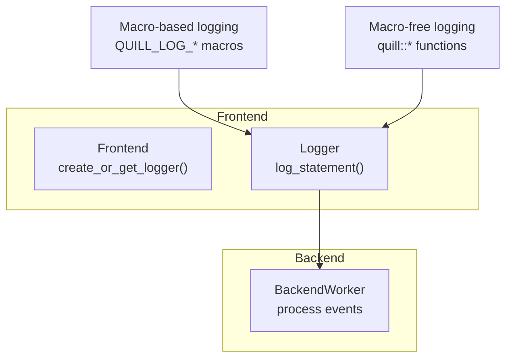
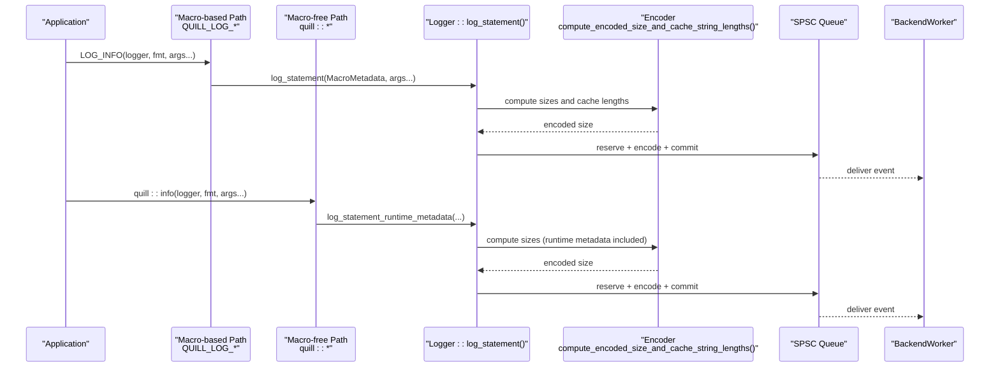
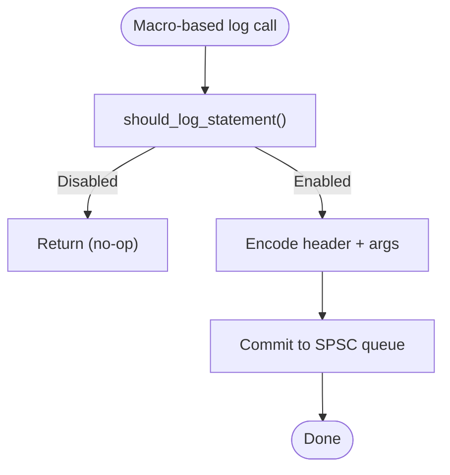
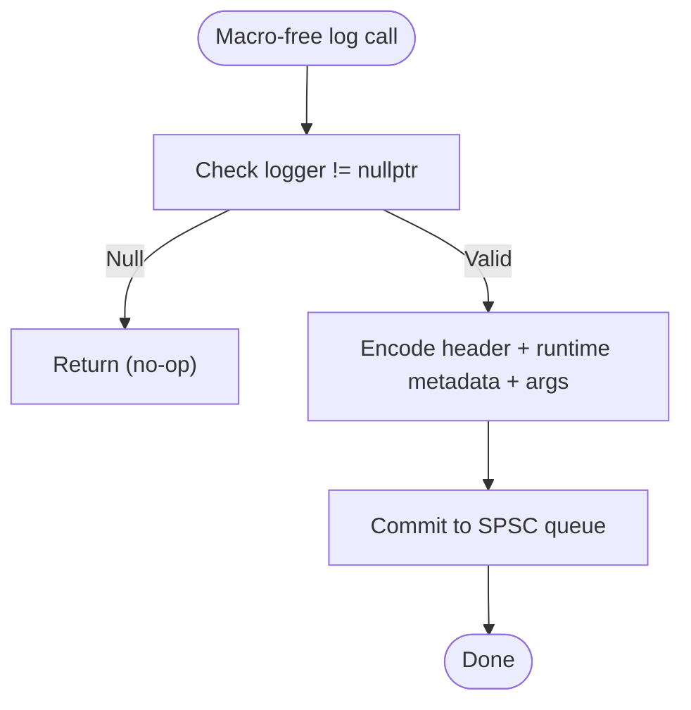
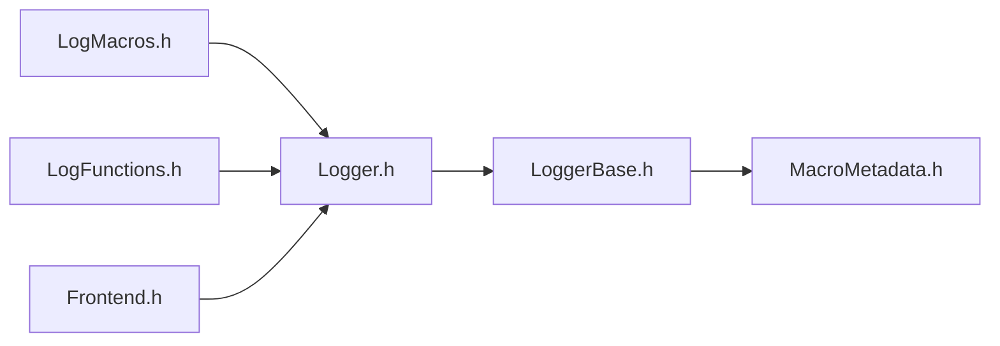

# Interface Selection Tradeoffs

<cite>
**Referenced Files in This Document**
- [LogMacros.h](file://include/quill/LogMacros.h)
- [LogFunctions.h](file://include/quill/LogFunctions.h)
- [macro_free_mode.rst](file://docs/macro_free_mode.rst)
- [console_logging_macro_free.cpp](file://examples/console_logging_macro_free.cpp)
- [Frontend.h](file://include/quill/Frontend.h)
- [Logger.h](file://include/quill/Logger.h)
- [LoggerBase.h](file://include/quill/core/LoggerBase.h)
- [MacroMetadata.h](file://include/quill/core/MacroMetadata.h)
- [quill_hot_path_rdtsc_clock.cpp](file://benchmarks/hot_path_latency/quill_hot_path_rdtsc_clock.cpp)
- [quill_hot_path_system_clock.cpp](file://benchmarks/hot_path_latency/quill_hot_path_system_clock.cpp)
- [quill_backend_throughput.cpp](file://benchmarks/backend_throughput/quill_backend_throughput.cpp)
- [compile_time_bench.cpp](file://benchmarks/compile_time/compile_time_bench.cpp)
- [MacrosTest.cpp](file://test/integration_tests/MacrosTest.cpp)
</cite>

## Table of Contents
1. [Introduction](#introduction)
2. [Project Structure](#project-structure)
3. [Core Components](#core-components)
4. [Architecture Overview](#architecture-overview)
5. [Detailed Component Analysis](#detailed-component-analysis)
6. [Dependency Analysis](#dependency-analysis)
7. [Performance Considerations](#performance-considerations)
8. [Troubleshooting Guide](#troubleshooting-guide)
9. [Conclusion](#conclusion)
10. [Appendices](#appendices)

## Introduction
This document explains the tradeoffs between macro-based and macro-free logging interfaces in Quill, focusing on latency, evaluation behavior, and performance characteristics. It provides decision guidance for selecting the appropriate interface based on performance requirements and code clarity preferences, along with configuration notes and benchmarking considerations.

## Project Structure
Quill exposes two primary logging pathways:
- Macro-based logging via compile-time metadata and optimized hot-path encoding.
- Macro-free logging via runtime metadata injection with convenience function wrappers.

**Diagram sources**
- [Frontend.h:148-198](file://include/quill/Frontend.h#L148-L198)
- [Logger.h:75-136](file://include/quill/Logger.h#L75-L136)
- [LogMacros.h:306-314](file://include/quill/LogMacros.h#L306-L314)
- [LogFunctions.h:325-343](file://include/quill/LogFunctions.h#L325-L343)

**Section sources**
- [Frontend.h:148-198](file://include/quill/Frontend.h#L148-L198)
- [Logger.h:75-136](file://include/quill/Logger.h#L75-L136)
- [LogMacros.h:306-314](file://include/quill/LogMacros.h#L306-L314)
- [LogFunctions.h:325-343](file://include/quill/LogFunctions.h#L325-L343)

## Core Components
- Macro-based logging:
  - Uses compile-time metadata to avoid runtime metadata copying and argument evaluation when disabled.
  - Provides fast hot-path encoding with minimal overhead.
  - Supports advanced features like rate limiting, named arguments, and tags.
- Macro-free logging:
  - Exposes function wrappers for each log level and severity.
  - Injects runtime metadata and performs safety checks (e.g., null logger).
  - Offers clearer code in constrained environments but with measurable overhead.

Key implementation anchors:
- Macro-based hot-path: [Logger.h:75-136](file://include/quill/Logger.h#L75-L136)
- Macro-free runtime path: [Logger.h:155-200](file://include/quill/Logger.h#L155-L200)
- Macro metadata structure: [MacroMetadata.h:22-51](file://include/quill/core/MacroMetadata.h#L22-L51)
- Macro-free function wrappers: [LogFunctions.h:325-343](file://include/quill/LogFunctions.h#L325-L343)

**Section sources**
- [Logger.h:75-136](file://include/quill/Logger.h#L75-L136)
- [Logger.h:155-200](file://include/quill/Logger.h#L155-L200)
- [MacroMetadata.h:22-51](file://include/quill/core/MacroMetadata.h#L22-L51)
- [LogFunctions.h:325-343](file://include/quill/LogFunctions.h#L325-L343)

## Architecture Overview
The macro-based and macro-free paths converge at the logger’s hot-path encoder, differing primarily in metadata availability and argument evaluation timing.

**Diagram sources**
- [LogMacros.h:306-314](file://include/quill/LogMacros.h#L306-L314)
- [LogFunctions.h:325-343](file://include/quill/LogFunctions.h#L325-L343)
- [Logger.h:75-136](file://include/quill/Logger.h#L75-L136)
- [Logger.h:155-200](file://include/quill/Logger.h#L155-L200)

## Detailed Component Analysis

### Macro-Based Logging Interface
- Compile-time metadata:
  - MacroMetadata captures source location, function, format, tags, and event type at compile time.
  - Enables zero-cost filtering and avoids runtime metadata copies.
- Hot-path encoding:
  - Computes encoded sizes and caches string lengths for efficient encoding.
  - Minimizes branching and argument evaluation when levels are disabled.
- Rate limiting and tags:
  - Built-in support for periodic suppression and tag generation macros.

**Diagram sources**
- [LogMacros.h:306-314](file://include/quill/LogMacros.h#L306-L314)
- [LoggerBase.h:170-184](file://include/quill/core/LoggerBase.h#L170-L184)
- [Logger.h:75-136](file://include/quill/Logger.h#L75-L136)

**Section sources**
- [LogMacros.h:306-314](file://include/quill/LogMacros.h#L306-L314)
- [LoggerBase.h:170-184](file://include/quill/core/LoggerBase.h#L170-L184)
- [Logger.h:75-136](file://include/quill/Logger.h#L75-L136)

### Macro-Free Logging Interface
- Runtime metadata:
  - Uses a placeholder MacroMetadata with a runtime metadata event type.
  - Requires copying or shallow-copying metadata to the backend thread.
- Argument evaluation:
  - Arguments are always evaluated regardless of log level, unlike macros.
- Convenience wrappers:
  - Provides function variants for each log level and severity, optionally accepting tags.

**Diagram sources**
- [LogFunctions.h:325-343](file://include/quill/LogFunctions.h#L325-L343)
- [Logger.h:155-200](file://include/quill/Logger.h#L155-L200)

**Section sources**
- [LogFunctions.h:325-343](file://include/quill/LogFunctions.h#L325-L343)
- [Logger.h:155-200](file://include/quill/Logger.h#L155-L200)

### Decision Matrix: Macro vs Macro-Free
- Choose macro-based logging when:
  - Low-latency hot-path is critical.
  - Compile-time filtering and zero-cost disabling are desired.
  - Advanced features (rate limiting, named args, tags) are used.
- Choose macro-free logging when:
  - Code clarity and simplicity are prioritized.
  - The application benefits from avoiding macro pollution.
  - Performance overhead is acceptable and measured.

**Section sources**
- [macro_free_mode.rst:10-25](file://docs/macro_free_mode.rst#L10-L25)
- [LogFunctions.h:21-48](file://include/quill/LogFunctions.h#L21-L48)

## Dependency Analysis
- Macro-based path depends on:
  - MacroMetadata for compile-time capture.
  - Logger::log_statement for fast encoding and queueing.
- Macro-free path depends on:
  - Logger::log_statement_runtime_metadata for runtime metadata handling.
  - Frontend creation APIs to obtain loggers.

**Diagram sources**
- [LogMacros.h:306-314](file://include/quill/LogMacros.h#L306-L314)
- [LogFunctions.h:325-343](file://include/quill/LogFunctions.h#L325-L343)
- [Logger.h:75-136](file://include/quill/Logger.h#L75-L136)
- [LoggerBase.h:170-184](file://include/quill/core/LoggerBase.h#L170-L184)
- [MacroMetadata.h:22-51](file://include/quill/core/MacroMetadata.h#L22-L51)
- [Frontend.h:148-198](file://include/quill/Frontend.h#L148-L198)

**Section sources**
- [LogMacros.h:306-314](file://include/quill/LogMacros.h#L306-L314)
- [LogFunctions.h:325-343](file://include/quill/LogFunctions.h#L325-L343)
- [Logger.h:75-136](file://include/quill/Logger.h#L75-L136)
- [LoggerBase.h:170-184](file://include/quill/core/LoggerBase.h#L170-L184)
- [MacroMetadata.h:22-51](file://include/quill/core/MacroMetadata.h#L22-L51)
- [Frontend.h:148-198](file://include/quill/Frontend.h#L148-L198)

## Performance Considerations
- Latency differences:
  - Macro-based: compile-time metadata reduces runtime overhead; arguments are not evaluated when disabled.
  - Macro-free: runtime metadata injection and argument evaluation incur overhead; logger null checks add minimal overhead.
- Throughput benchmarks:
  - Backend throughput benchmark demonstrates sustained throughput under heavy load.
  - Hot-path latency benchmarks compare RDTSC and system clocks for latency measurement.
- Compile-time overhead:
  - Macro-based logging integrates with compile-time filtering and compile-active-log-level directives.
- Practical examples:
  - Macro-based hot-path latency benchmarks show end-to-end latency measurement.
  - Macro-free example demonstrates function-based logging for console output.

Benchmark references:
- Backend throughput: [quill_backend_throughput.cpp:14-68](file://benchmarks/backend_throughput/quill_backend_throughput.cpp#L14-L68)
- Hot-path latency (RDTSC): [quill_hot_path_rdtsc_clock.cpp:26-91](file://benchmarks/hot_path_latency/quill_hot_path_rdtsc_clock.cpp#L26-L91)
- Hot-path latency (System): [quill_hot_path_system_clock.cpp:26-94](file://benchmarks/hot_path_latency/quill_hot_path_system_clock.cpp#L26-L94)
- Compile-time benchmark harness: [compile_time_bench.cpp:1-100](file://benchmarks/compile_time/compile_time_bench.cpp#L1-L100)

**Section sources**
- [quill_backend_throughput.cpp:14-68](file://benchmarks/backend_throughput/quill_backend_throughput.cpp#L14-L68)
- [quill_hot_path_rdtsc_clock.cpp:26-91](file://benchmarks/hot_path_latency/quill_hot_path_rdtsc_clock.cpp#L26-L91)
- [quill_hot_path_system_clock.cpp:26-94](file://benchmarks/hot_path_latency/quill_hot_path_system_clock.cpp#L26-L94)
- [compile_time_bench.cpp:1-100](file://benchmarks/compile_time/compile_time_bench.cpp#L1-L100)

## Troubleshooting Guide
- Macro-free null logger safety:
  - Macro-free functions check for a null logger and return early, preventing crashes.
- Compile-time filtering:
  - Use compile-time log-level directives to remove higher levels at build time for macro-based logging.
- Integration tests:
  - MacrosTest validates macro expansion, rate limiting, and runtime metadata variants.

**Section sources**
- [LogFunctions.h:328-331](file://include/quill/LogFunctions.h#L328-L331)
- [LogMacros.h:38-40](file://include/quill/LogMacros.h#L38-L40)
- [MacrosTest.cpp:16-94](file://test/integration_tests/MacrosTest.cpp#L16-L94)

## Conclusion
- Prefer macro-based logging for performance-sensitive hot paths, compile-time filtering, and advanced features.
- Choose macro-free logging for simplified code and environments where the small overhead is acceptable.
- Measure latency and throughput in your environment using the provided benchmarks to guide selection.

## Appendices

### Macro-Free Mode Setup and Usage
- Example usage of macro-free logging for console output:
  - See [console_logging_macro_free.cpp:35-60](file://examples/console_logging_macro_free.cpp#L35-L60)
- Documentation overview:
  - See [macro_free_mode.rst:10-25](file://docs/macro_free_mode.rst#L10-L25)

**Section sources**
- [console_logging_macro_free.cpp:35-60](file://examples/console_logging_macro_free.cpp#L35-L60)
- [macro_free_mode.rst:10-25](file://docs/macro_free_mode.rst#L10-L25)