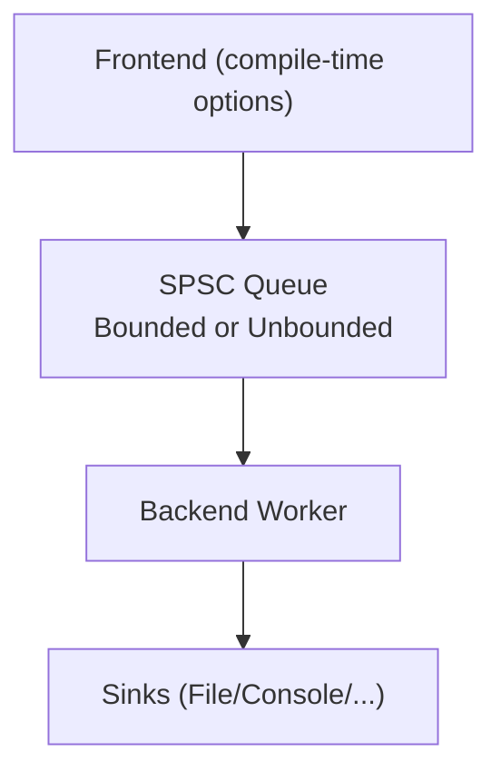
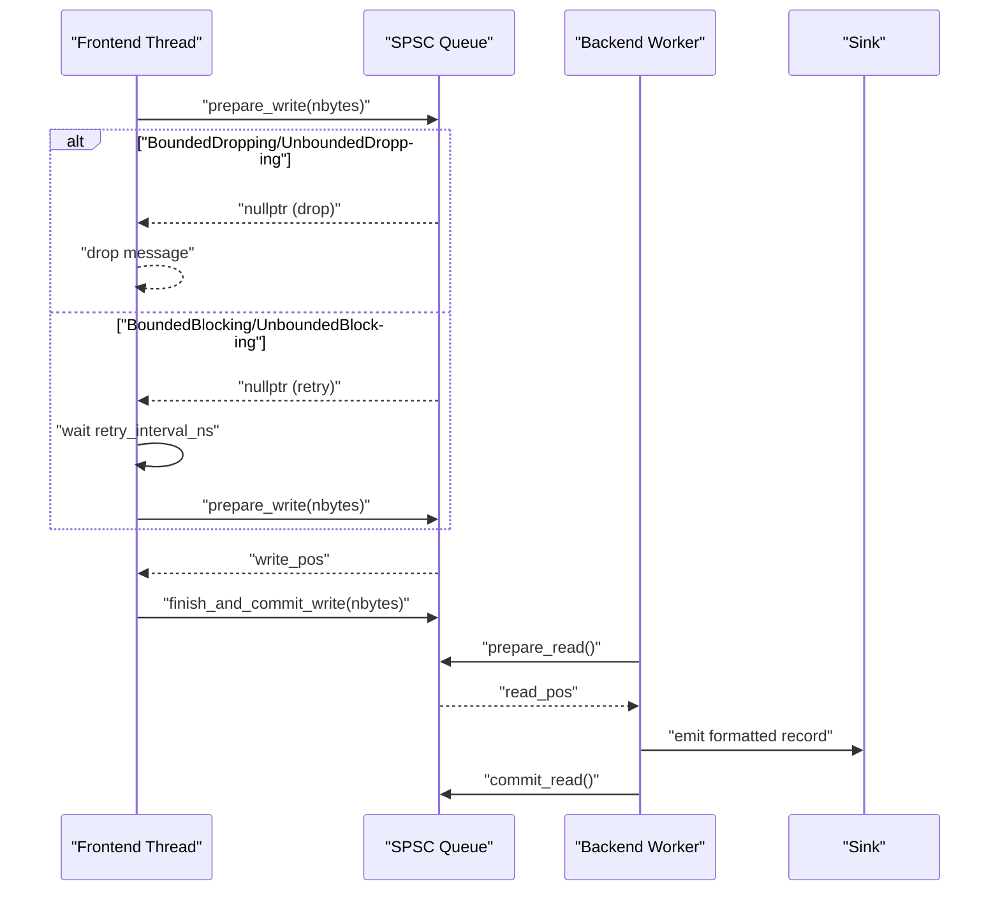
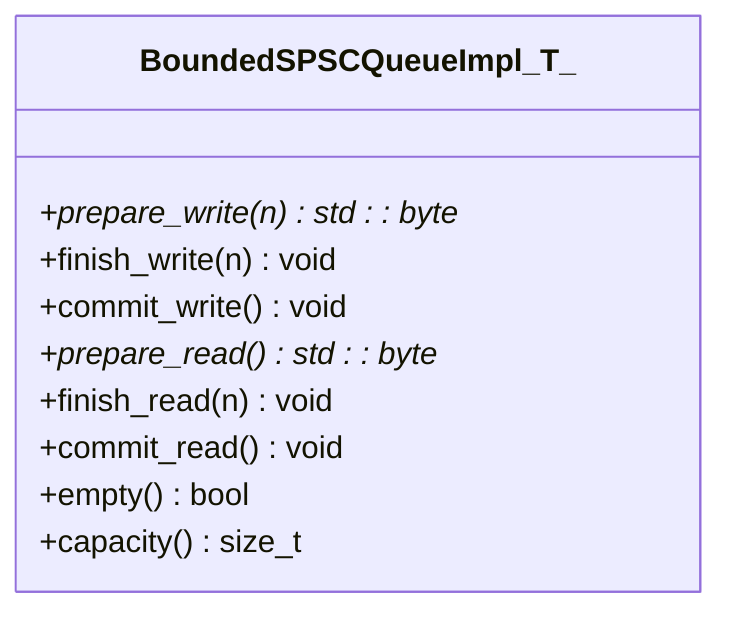
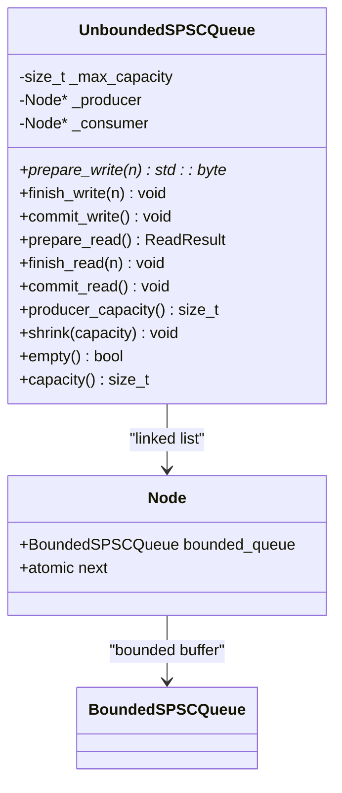
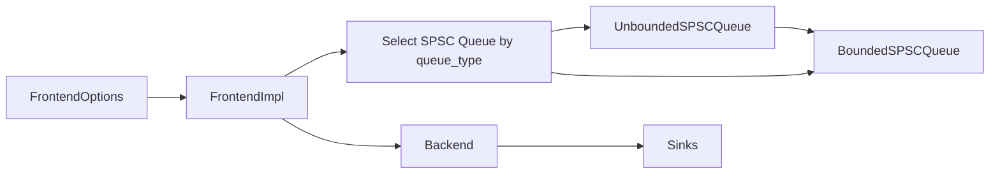
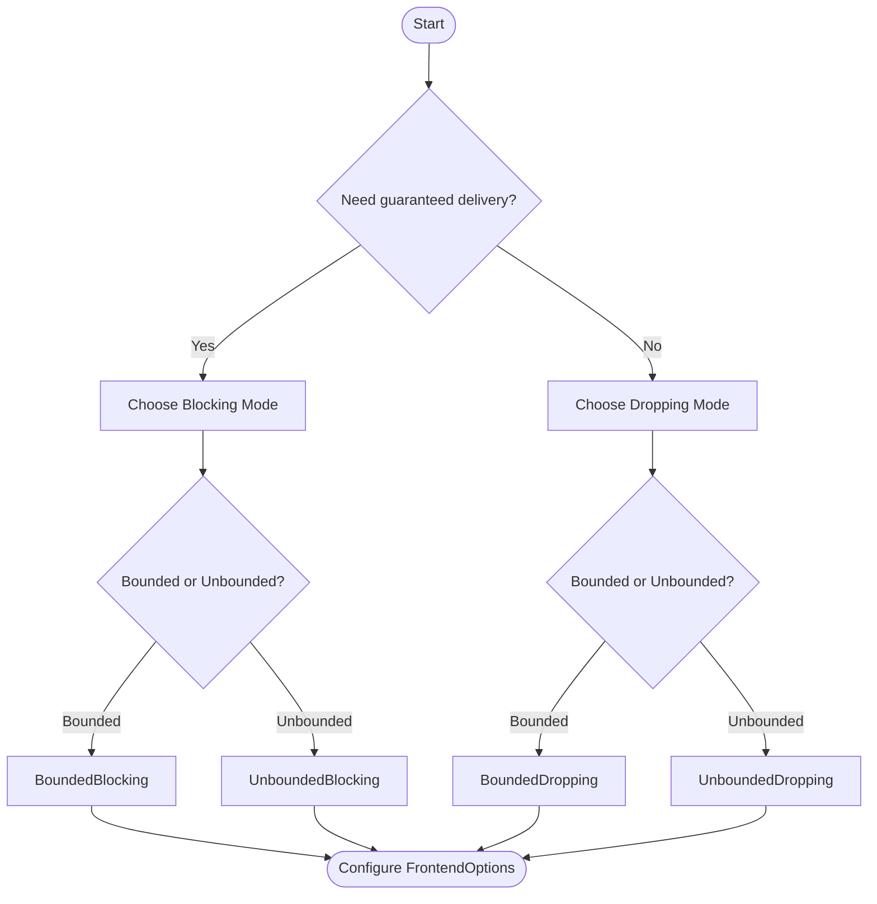

# Queue Behavior Issues

<cite>
**Referenced Files in This Document**
- [FrontendOptions.h](file://include/quill/core/FrontendOptions.h)
- [Common.h](file://include/quill/core/Common.h)
- [BoundedSPSCQueue.h](file://include/quill/core/BoundedSPSCQueue.h)
- [UnboundedSPSCQueue.h](file://include/quill/core/UnboundedSPSCQueue.h)
- [Frontend.h](file://include/quill/Frontend.h)
- [Backend.h](file://include/quill/Backend.h)
- [bounded_dropping_queue_frontend.cpp](file://examples/bounded_dropping_queue_frontend.cpp)
- [custom_frontend_options.cpp](file://examples/custom_frontend_options.cpp)
- [BoundedDroppingQueueTest.cpp](file://test/integration_tests/BoundedDroppingQueueTest.cpp)
- [BoundedBlockingQueueTest.cpp](file://test/integration_tests/BoundedBlockingQueueTest.cpp)
- [UnboundedUnlimitedQueueTest.cpp](file://test/integration_tests/UnboundedUnlimitedQueueTest.cpp)
</cite>

## Table of Contents
1. [Introduction](#introduction)
2. [Project Structure](#project-structure)
3. [Core Components](#core-components)
4. [Architecture Overview](#architecture-overview)
5. [Detailed Component Analysis](#detailed-component-analysis)
6. [Dependency Analysis](#dependency-analysis)
7. [Performance Considerations](#performance-considerations)
8. [Troubleshooting Guide](#troubleshooting-guide)
9. [Conclusion](#conclusion)
10. [Appendices](#appendices)

## Introduction
This document explains queue behavior configuration issues in Quill, focusing on how the frontend SPSC queue affects message delivery guarantees and performance. It covers:
- Differences between bounded and unbounded queues
- Blocking versus dropping queue modes
- How FrontendOptions controls queue behavior
- Practical configuration examples and validation techniques
- Troubleshooting strategies for message drops, overflow, and performance bottlenecks

## Project Structure
The queue behavior is defined by compile-time FrontendOptions and implemented by specialized SPSC queues:
- FrontendOptions defines queue_type, initial_queue_capacity, blocking_queue_retry_interval_ns, unbounded_queue_max_capacity, and huge_pages_policy
- Queue implementations:
  - BoundedSPSCQueue: fixed-capacity ring buffer
  - UnboundedSPSCQueue: linked list of bounded buffers with exponential growth up to a maximum
- Frontend exposes helpers to monitor and shrink queues (Unbounded only)
- Backend coordinates consumption of queued messages

**Diagram sources**
- [FrontendOptions.h:16-50](file://include/quill/core/FrontendOptions.h#L16-L50)
- [BoundedSPSCQueue.h:54-95](file://include/quill/core/BoundedSPSCQueue.h#L54-L95)
- [UnboundedSPSCQueue.h:42-85](file://include/quill/core/UnboundedSPSCQueue.h#L42-L85)
- [Frontend.h:32-111](file://include/quill/Frontend.h#L32-L111)
- [Backend.h:36-57](file://include/quill/Backend.h#L36-L57)

**Section sources**
- [FrontendOptions.h:16-50](file://include/quill/core/FrontendOptions.h#L16-L50)
- [Common.h:145-151](file://include/quill/core/Common.h#L145-L151)
- [BoundedSPSCQueue.h:54-95](file://include/quill/core/BoundedSPSCQueue.h#L54-L95)
- [UnboundedSPSCQueue.h:42-85](file://include/quill/core/UnboundedSPSCQueue.h#L42-L85)
- [Frontend.h:32-111](file://include/quill/Frontend.h#L32-L111)
- [Backend.h:36-57](file://include/quill/Backend.h#L36-L57)

## Core Components
- FrontendOptions
  - queue_type: selects UnboundedBlocking, UnboundedDropping, BoundedBlocking, or BoundedDropping
  - initial_queue_capacity: starting capacity for the queue
  - blocking_queue_retry_interval_ns: retry interval for blocking modes
  - unbounded_queue_max_capacity: maximum growth cap for unbounded queues
  - huge_pages_policy: huge page allocation policy
- QueueType enumeration
  - UnboundedBlocking, UnboundedDropping, BoundedBlocking, BoundedDropping
- BoundedSPSCQueue
  - Fixed-capacity ring buffer with aligned storage and cache-line awareness
  - No reallocation; returns null when full
- UnboundedSPSCQueue
  - Linked list of bounded buffers; doubles capacity on overflow up to max
  - Throws if a single message exceeds max capacity

**Section sources**
- [FrontendOptions.h:16-50](file://include/quill/core/FrontendOptions.h#L16-L50)
- [Common.h:145-151](file://include/quill/core/Common.h#L145-L151)
- [BoundedSPSCQueue.h:54-95](file://include/quill/core/BoundedSPSCQueue.h#L54-L95)
- [UnboundedSPSCQueue.h:244-297](file://include/quill/core/UnboundedSPSCQueue.h#L244-L297)

## Architecture Overview
The frontend thread writes log records into a thread-local SPSC queue. The backend thread drains the queue and writes to sinks. Queue mode determines whether the frontend blocks or drops when the queue is full, and whether the queue can grow without bounds.

**Diagram sources**
- [FrontendOptions.h:18-26](file://include/quill/core/FrontendOptions.h#L18-L26)
- [BoundedSPSCQueue.h:105-145](file://include/quill/core/BoundedSPSCQueue.h#L105-L145)
- [UnboundedSPSCQueue.h:115-149](file://include/quill/core/UnboundedSPSCQueue.h#L115-L149)
- [Frontend.h:55-80](file://include/quill/Frontend.h#L55-L80)

## Detailed Component Analysis

### Queue Types and Delivery Guarantees
- UnboundedBlocking
  - Grows exponentially until unbounded_queue_max_capacity; then blocks
  - Delivery guarantee: best-effort; messages are not dropped
- UnboundedDropping
  - Grows exponentially until unbounded_queue_max_capacity; then drops messages
  - Delivery guarantee: best-effort with potential loss
- BoundedBlocking
  - Fixed capacity; blocks when full
  - Delivery guarantee: best-effort; messages are not dropped
- BoundedDropping
  - Fixed capacity; drops messages when full
  - Delivery guarantee: best-effort with potential loss

**Section sources**
- [FrontendOptions.h:18-26](file://include/quill/core/FrontendOptions.h#L18-L26)
- [Common.h:145-151](file://include/quill/core/Common.h#L145-L151)
- [UnboundedSPSCQueue.h:244-297](file://include/quill/core/UnboundedSPSCQueue.h#L244-L297)
- [BoundedSPSCQueue.h:105-145](file://include/quill/core/BoundedSPSCQueue.h#L105-L145)

### BoundedSPSCQueue Implementation
Key behaviors:
- Capacity is fixed and rounded to a power of two
- Uses aligned storage and cache-line flushing/prefetching on x86
- Returns null from prepare_write when insufficient space
- Reader commits progress periodically via commit_read

**Diagram sources**
- [BoundedSPSCQueue.h:54-195](file://include/quill/core/BoundedSPSCQueue.h#L54-L195)

**Section sources**
- [BoundedSPSCQueue.h:54-195](file://include/quill/core/BoundedSPSCQueue.h#L54-L195)

### UnboundedSPSCQueue Implementation
Key behaviors:
- Maintains a linked chain of bounded buffers
- On overflow, doubles capacity until max; throws if a single message exceeds max
- Supports shrinking the producer queue to a smaller power-of-two capacity
- Exposes producer_capacity for monitoring

**Diagram sources**
- [UnboundedSPSCQueue.h:42-337](file://include/quill/core/UnboundedSPSCQueue.h#L42-L337)

**Section sources**
- [UnboundedSPSCQueue.h:42-337](file://include/quill/core/UnboundedSPSCQueue.h#L42-L337)

### FrontendOptions Configuration Parameters
- queue_type: selects among UnboundedBlocking, UnboundedDropping, BoundedBlocking, BoundedDropping
- initial_queue_capacity: starting capacity for the queue
- blocking_queue_retry_interval_ns: retry interval for blocking modes
- unbounded_queue_max_capacity: maximum capacity for unbounded queues
- huge_pages_policy: huge pages policy for queue storage

**Section sources**
- [FrontendOptions.h:16-50](file://include/quill/core/FrontendOptions.h#L16-L50)
- [Common.h:175-180](file://include/quill/core/Common.h#L175-L180)

### Frontend Helpers for Queue Monitoring and Control
- preallocate(): pre-allocates thread-local queue structures
- shrink_thread_local_queue(capacity): shrinks Unbounded queue to target capacity (no-op for Bounded)
- get_thread_local_queue_capacity(): returns producer capacity for Unbounded, fixed capacity for Bounded

**Section sources**
- [Frontend.h:45-111](file://include/quill/Frontend.h#L45-L111)

### Example Configurations and Validation

#### Bounded Dropping Queue Example
- Demonstrates setting queue_type to BoundedDropping and a small initial_queue_capacity to observe drops
- Validates that logs still reach sinks after drops occur

**Section sources**
- [bounded_dropping_queue_frontend.cpp:21-32](file://examples/bounded_dropping_queue_frontend.cpp#L21-L32)
- [BoundedDroppingQueueTest.cpp:14-25](file://test/integration_tests/BoundedDroppingQueueTest.cpp#L14-L25)

#### Custom Frontend Options Example
- Shows defining a custom FrontendOptions struct and using it to instantiate Frontend and Logger types

**Section sources**
- [custom_frontend_options.cpp:14-27](file://examples/custom_frontend_options.cpp#L14-L27)

#### Bounded Blocking Queue Test
- Demonstrates BoundedBlocking behavior where all logged messages are preserved

**Section sources**
- [BoundedBlockingQueueTest.cpp:14-25](file://test/integration_tests/BoundedBlockingQueueTest.cpp#L14-L25)

#### Unbounded Unlimited Queue Test
- Demonstrates UnboundedBlocking with very large capacity and validates all messages are flushed

**Section sources**
- [UnboundedUnlimitedQueueTest.cpp:14-25](file://test/integration_tests/UnboundedUnlimitedQueueTest.cpp#L14-L25)

## Dependency Analysis
- Frontend depends on FrontendOptions to select the queue type and capacities
- Frontend constructs a thread-local SPSC queue based on queue_type
- Backend consumes from the queue and writes to sinks
- Unbounded queue depends on BoundedSPSCQueue for individual buffers

**Diagram sources**
- [FrontendOptions.h:16-50](file://include/quill/core/FrontendOptions.h#L16-L50)
- [Common.h:145-151](file://include/quill/core/Common.h#L145-L151)
- [Frontend.h:32-49](file://include/quill/Frontend.h#L32-L49)
- [UnboundedSPSCQueue.h:42-85](file://include/quill/core/UnboundedSPSCQueue.h#L42-L85)
- [BoundedSPSCQueue.h:54-95](file://include/quill/core/BoundedSPSCQueue.h#L54-L95)
- [Backend.h:36-57](file://include/quill/Backend.h#L36-L57)

**Section sources**
- [FrontendOptions.h:16-50](file://include/quill/core/FrontendOptions.h#L16-L50)
- [Common.h:145-151](file://include/quill/core/Common.h#L145-L151)
- [Frontend.h:32-49](file://include/quill/Frontend.h#L32-L49)
- [UnboundedSPSCQueue.h:42-85](file://include/quill/core/UnboundedSPSCQueue.h#L42-L85)
- [BoundedSPSCQueue.h:54-95](file://include/quill/core/BoundedSPSCQueue.h#L54-L95)
- [Backend.h:36-57](file://include/quill/Backend.h#L36-L57)

## Performance Considerations
- Unbounded queues can grow to unbounded_queue_max_capacity, potentially increasing memory usage and GC pressure
- Bounded queues prevent growth but may block or drop depending on mode
- Cache-line optimizations and huge pages can reduce TLB misses and improve throughput on supported platforms
- Retry intervals in blocking modes influence CPU usage vs. throughput trade-offs

[No sources needed since this section provides general guidance]

## Troubleshooting Guide

### Message Drops Observed
- Cause: BoundedDropping or UnboundedDropping queue modes
- Mitigation:
  - Switch to BoundedBlocking or UnboundedBlocking to preserve messages
  - Increase initial_queue_capacity or unbounded_queue_max_capacity
  - Reduce log volume or frequency spikes
- Validation:
  - Use tests similar to BoundedDroppingQueueTest to assert expected behavior

**Section sources**
- [BoundedDroppingQueueTest.cpp:27-80](file://test/integration_tests/BoundedDroppingQueueTest.cpp#L27-L80)
- [FrontendOptions.h:40-44](file://include/quill/core/FrontendOptions.h#L40-L44)

### Queue Overflow and Blocking
- Cause: Bounded queue full in BoundedBlocking or Unbounded queue hitting max capacity in UnboundedBlocking
- Mitigation:
  - Increase initial_queue_capacity or unbounded_queue_max_capacity
  - Use UnboundedDropping to avoid blocking at the cost of message loss
  - Monitor queue capacity using Frontend helpers
- Validation:
  - Use BoundedBlockingQueueTest to confirm all messages are preserved

**Section sources**
- [BoundedBlockingQueueTest.cpp:27-80](file://test/integration_tests/BoundedBlockingQueueTest.cpp#L27-L80)
- [UnboundedSPSCQueue.h:244-297](file://include/quill/core/UnboundedSPSCQueue.h#L244-L297)
- [Frontend.h:97-111](file://include/quill/Frontend.h#L97-L111)

### Performance Bottlenecks
- Symptoms: high CPU usage, increased latency, frequent retries
- Mitigation:
  - Adjust blocking_queue_retry_interval_ns for BoundedBlocking/UnboundedBlocking
  - Enable huge_pages_policy on Linux for reduced TLB misses
  - Use UnboundedDropping to avoid blocking under load
- Validation:
  - Measure throughput and latency with benchmarks and adjust FrontendOptions accordingly

**Section sources**
- [FrontendOptions.h:34-38](file://include/quill/core/FrontendOptions.h#L34-L38)
- [FrontendOptions.h:46-49](file://include/quill/core/FrontendOptions.h#L46-L49)
- [BoundedSPSCQueue.h:246-302](file://include/quill/core/BoundedSPSCQueue.h#L246-L302)

### Practical Configuration Examples

#### Configure Bounded Dropping for Low Latency Under Load
- Set queue_type to BoundedDropping
- Keep initial_queue_capacity small to trigger drops early
- Use Frontend::get_thread_local_queue_capacity to monitor growth

**Section sources**
- [bounded_dropping_queue_frontend.cpp:21-32](file://examples/bounded_dropping_queue_frontend.cpp#L21-L32)
- [Frontend.h:97-111](file://include/quill/Frontend.h#L97-L111)

#### Configure Unbounded Blocking for Guaranteed Delivery
- Set queue_type to UnboundedBlocking
- Increase unbounded_queue_max_capacity to accommodate bursts
- Optionally enable huge_pages_policy for performance

**Section sources**
- [custom_frontend_options.cpp:14-21](file://examples/custom_frontend_options.cpp#L14-L21)
- [FrontendOptions.h:40-49](file://include/quill/core/FrontendOptions.h#L40-L49)

#### Validate Behavior with Tests
- Use BoundedDroppingQueueTest and BoundedBlockingQueueTest to validate expected outcomes
- Use UnboundedUnlimitedQueueTest to verify unlimited growth behavior

**Section sources**
- [BoundedDroppingQueueTest.cpp:27-80](file://test/integration_tests/BoundedDroppingQueueTest.cpp#L27-L80)
- [BoundedBlockingQueueTest.cpp:27-80](file://test/integration_tests/BoundedBlockingQueueTest.cpp#L27-L80)
- [UnboundedUnlimitedQueueTest.cpp:27-90](file://test/integration_tests/UnboundedUnlimitedQueueTest.cpp#L27-L90)

## Conclusion
Queue behavior in Quill is controlled by compile-time FrontendOptions and implemented by specialized SPSC queues. Choose Bounded vs. Unbounded and Blocking vs. Dropping modes based on delivery guarantees and performance requirements. Use Frontend helpers to monitor queue capacity and validate configurations with provided tests.

[No sources needed since this section summarizes without analyzing specific files]

## Appendices

### Queue Mode Decision Flowchart

[No sources needed since this diagram shows conceptual workflow, not actual code structure]