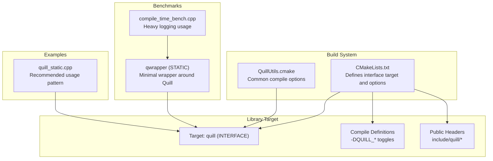
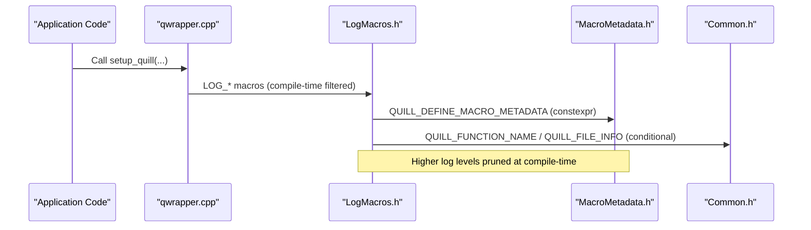
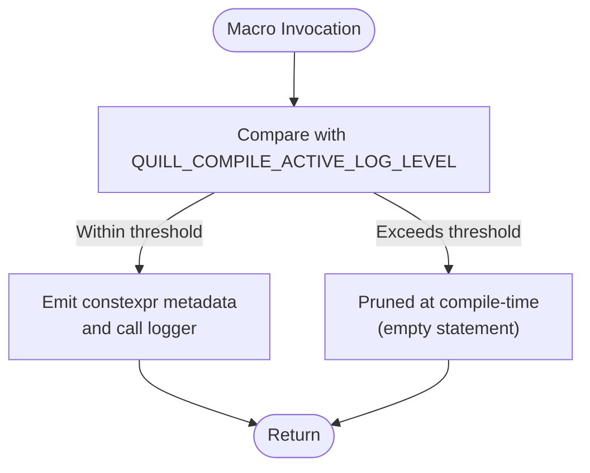
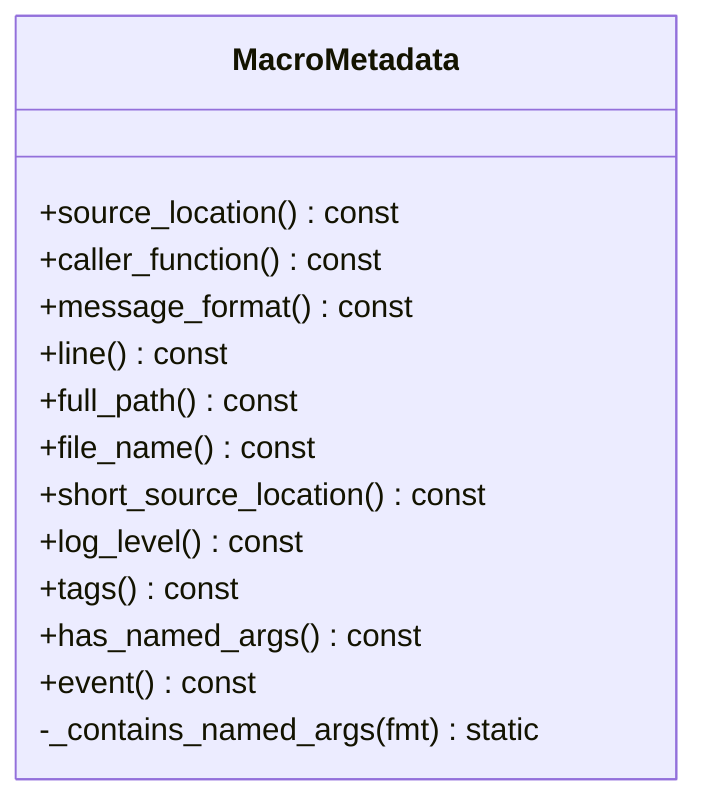
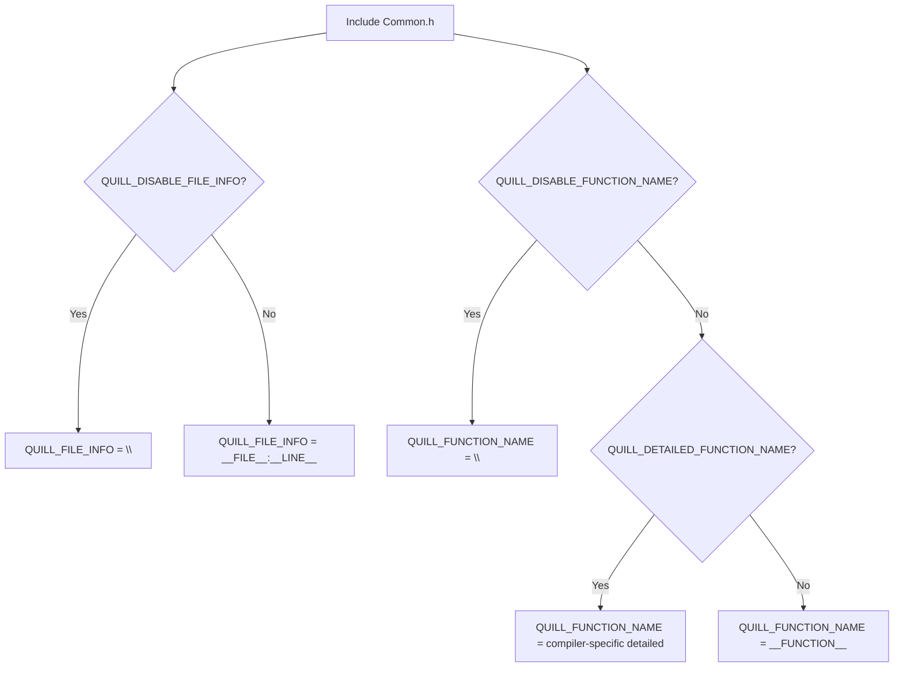
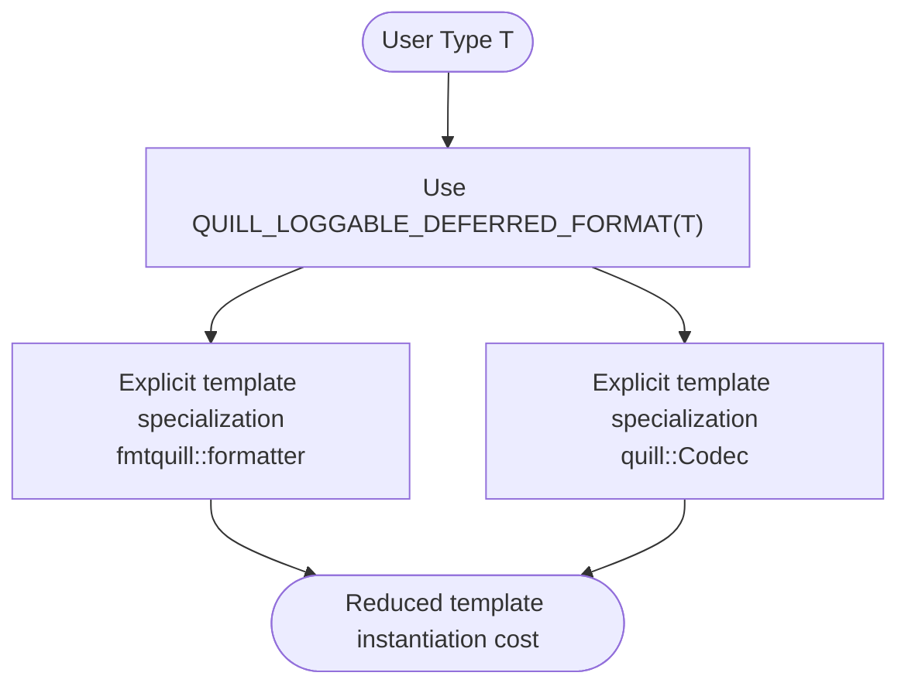
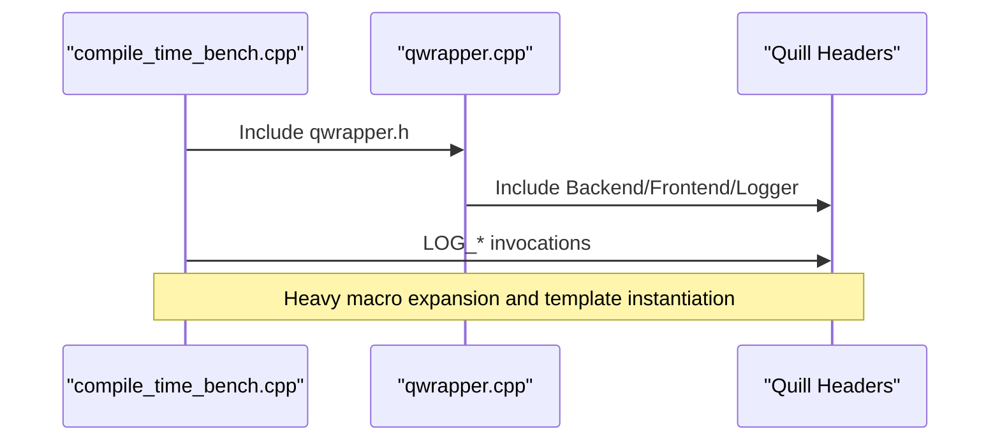
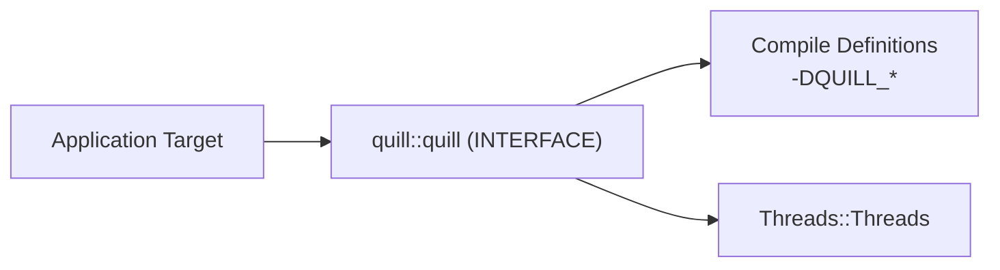

# Compile-time Performance

<cite>
**Referenced Files in This Document**
- [CMakeLists.txt](file://CMakeLists.txt)
- [QuillUtils.cmake](file://cmake/QuillUtils.cmake)
- [LogMacros.h](file://include/quill/LogMacros.h)
- [Common.h](file://include/quill/core/Common.h)
- [MacroMetadata.h](file://include/quill/core/MacroMetadata.h)
- [Utility.h](file://include/quill/Utility.h)
- [HelperMacros.h](file://include/quill/HelperMacros.h)
- [compile_time_bench.cpp](file://benchmarks/compile_time/compile_time_bench.cpp)
- [CMakeLists.txt](file://benchmarks/compile_time/CMakeLists.txt)
- [CMakeLists.txt](file://benchmarks/compile_time/qwrapper/CMakeLists.txt)
- [qwrapper.cpp](file://benchmarks/compile_time/qwrapper/include/qwrapper/qwrapper.cpp)
- [quill_static.cpp](file://examples/recommended_usage/quill_static_lib/quill_static.cpp)
</cite>

## Table of Contents
1. [Introduction](#introduction)
2. [Project Structure](#project-structure)
3. [Core Components](#core-components)
4. [Architecture Overview](#architecture-overview)
5. [Detailed Component Analysis](#detailed-component-analysis)
6. [Dependency Analysis](#dependency-analysis)
7. [Performance Considerations](#performance-considerations)
8. [Troubleshooting Guide](#troubleshooting-guide)
9. [Conclusion](#conclusion)
10. [Appendices](#appendices)

## Introduction
This document focuses on compile-time performance optimization in Quill. It explains how Quill’s design leverages compile-time mechanisms to minimize template instantiation overhead, reduce header inclusion costs, and optimize macro expansions. It also covers build system integration via CMake, compile-time logging level filtering, and practical examples for measuring and improving compilation performance in large-scale projects.

## Project Structure
Quill exposes a header-only interface library with optional compile-time toggles. The top-level CMake configuration defines a primary interface target and forwards compile definitions to consumers. Benchmarks and examples demonstrate realistic usage and compile-time cost measurement.

**Diagram sources**
- [CMakeLists.txt](file://CMakeLists.txt)
- [QuillUtils.cmake](file://cmake/QuillUtils.cmake)
- [compile_time_bench.cpp](file://benchmarks/compile_time/compile_time_bench.cpp)
- [CMakeLists.txt](file://benchmarks/compile_time/CMakeLists.txt)
- [CMakeLists.txt](file://benchmarks/compile_time/qwrapper/CMakeLists.txt)
- [quill_static.cpp](file://examples/recommended_usage/quill_static_lib/quill_static.cpp)

**Section sources**
- [CMakeLists.txt](file://CMakeLists.txt)
- [QuillUtils.cmake](file://cmake/QuillUtils.cmake)

## Core Components
- Compile-time logging level filtering: Macro selection is pruned at compile-time based on a configurable threshold, eliminating higher-level logs from code generation.
- Macro metadata capture: Compile-time metadata reduces runtime overhead by encoding source location, function name, and format strings as constexpr data.
- Header inclusion minimization: Consumers can disable expensive macro features (function name, file info) to reduce template expansion and macro expansion costs.
- Template specialization helpers: Type formatter and codec specializations are provided via macros to avoid repeated template instantiation boilerplate.

Key compile-time toggle options exposed by the build system:
- QUILL_COMPILE_ACTIVE_LOG_LEVEL: Prunes macro branches for disabled log levels.
- QUILL_DISABLE_FUNCTION_NAME / QUILL_DETAILED_FUNCTION_NAME: Controls function name capture in metadata.
- QUILL_DISABLE_FILE_INFO: Controls file and line capture.
- QUILL_NO_EXCEPTIONS / QUILL_NO_THREAD_NAME_SUPPORT / QUILL_X86ARCH: Adjusts platform and feature support.

**Section sources**
- [LogMacros.h](file://include/quill/LogMacros.h)
- [Common.h](file://include/quill/core/Common.h)
- [MacroMetadata.h](file://include/quill/core/MacroMetadata.h)
- [CMakeLists.txt](file://CMakeLists.txt)

## Architecture Overview
The compile-time optimization pipeline centers on:
- Macro-driven logging entry points that conditionally compile based on QUILL_COMPILE_ACTIVE_LOG_LEVEL.
- MacroMetadata capturing compile-time source location and format string information.
- Optional compile definitions controlling function name and file info capture.
- A lightweight wrapper library in benchmarks to isolate Quill’s compile-time cost from application code.

**Diagram sources**
- [compile_time_bench.cpp](file://benchmarks/compile_time/compile_time_bench.cpp)
- [qwrapper.cpp](file://benchmarks/compile_time/qwrapper/include/qwrapper/qwrapper.cpp)
- [LogMacros.h](file://include/quill/LogMacros.h)
- [MacroMetadata.h](file://include/quill/core/MacroMetadata.h)
- [Common.h](file://include/quill/core/Common.h)

## Detailed Component Analysis

### Compile-time Logging Level Filtering
Quill’s logging macros are gated by a compile-time constant that disables entire macro branches for higher log levels. This eliminates branches and reduces the number of constexpr metadata instances generated.

**Diagram sources**
- [LogMacros.h](file://include/quill/LogMacros.h)

**Section sources**
- [LogMacros.h](file://include/quill/LogMacros.h)

### Macro Metadata Capture
MacroMetadata captures source location, function name, and format string at compile time. It includes helpers to detect named arguments and compute offsets for file name extraction, minimizing runtime work.

**Diagram sources**
- [MacroMetadata.h](file://include/quill/core/MacroMetadata.h)

**Section sources**
- [MacroMetadata.h](file://include/quill/core/MacroMetadata.h)

### Header Inclusion Patterns and Macro Expansion Costs
Quill’s Common.h defines QUILL_FUNCTION_NAME and QUILL_FILE_INFO based on compile-time toggles. Disabling function name capture or file info reduces macro expansion and template instantiation overhead.

**Diagram sources**
- [Common.h](file://include/quill/core/Common.h)

**Section sources**
- [Common.h](file://include/quill/core/Common.h)

### Template Specialization Helpers
Helper macros define type formatters and codecs, avoiding repetitive template boilerplate and reducing per-type template instantiations.

**Diagram sources**
- [HelperMacros.h](file://include/quill/HelperMacros.h)

**Section sources**
- [HelperMacros.h](file://include/quill/HelperMacros.h)

### Benchmark Harness for Compile-time Cost Measurement
The compile-time benchmark demonstrates heavy logging usage and measures compilation overhead when integrating Quill into a wrapper library.

**Diagram sources**
- [compile_time_bench.cpp](file://benchmarks/compile_time/compile_time_bench.cpp)
- [qwrapper.cpp](file://benchmarks/compile_time/qwrapper/include/qwrapper/qwrapper.cpp)

**Section sources**
- [compile_time_bench.cpp](file://benchmarks/compile_time/compile_time_bench.cpp)
- [CMakeLists.txt](file://benchmarks/compile_time/CMakeLists.txt)
- [CMakeLists.txt](file://benchmarks/compile_time/qwrapper/CMakeLists.txt)

### Recommended Static Library Usage Pattern
The example shows a minimal initialization pattern that starts the backend and creates a logger once, reducing repeated template instantiation in hot paths.

**Section sources**
- [quill_static.cpp](file://examples/recommended_usage/quill_static_lib/quill_static.cpp)

## Dependency Analysis
Quill’s interface target forwards compile definitions and links against Threads. Consumers inherit these definitions, enabling compile-time toggles without duplicating configuration.

**Diagram sources**
- [CMakeLists.txt](file://CMakeLists.txt)

**Section sources**
- [CMakeLists.txt](file://CMakeLists.txt)

## Performance Considerations
- Prefer compile-time filtering: Set QUILL_COMPILE_ACTIVE_LOG_LEVEL to prune higher log levels at compile-time.
- Minimize macro overhead: Disable function name capture and file info when not needed via QUILL_DISABLE_FUNCTION_NAME and QUILL_DISABLE_FILE_INFO.
- Reduce template instantiation: Use QUILL_LOGGABLE_DEFERRED_FORMAT or QUILL_LOGGABLE_DIRECT_FORMAT to specialize formatters and codecs once per type.
- Build system flags: Leverage set_common_compile_options for consistent warnings and compiler-specific flags; disable exceptions when appropriate via QUILL_NO_EXCEPTIONS.
- Static vs dynamic: The interface target avoids linking overhead; for heavy integration, consider a small wrapper static library (as shown in benchmarks) to amortize header inclusion costs across translation units.

[No sources needed since this section provides general guidance]

## Troubleshooting Guide
- Unexpectedly high compile times:
  - Verify QUILL_COMPILE_ACTIVE_LOG_LEVEL is set appropriately.
  - Ensure QUILL_DISABLE_FUNCTION_NAME and QUILL_DISABLE_FILE_INFO are enabled if not needed.
  - Confirm QUILL_NO_EXCEPTIONS is set to avoid exception/RTTI overhead.
- Macro conflicts:
  - Enable QUILL_DISABLE_NON_PREFIXED_MACROS to keep only QUILL_LOG_* macros.
- Platform-specific issues:
  - On MinGW, ucrtbase linkage is handled automatically.
  - On older GCC, stdc++fs linkage may be required.

**Section sources**
- [CMakeLists.txt](file://CMakeLists.txt)
- [QuillUtils.cmake](file://cmake/QuillUtils.cmake)

## Conclusion
Quill’s compile-time performance model relies on compile-time pruning of logging branches, constexpr metadata capture, and minimal macro expansion through selective feature toggles. By tuning compile definitions and leveraging helper macros, teams can significantly reduce compilation overhead while maintaining flexible logging capabilities.

[No sources needed since this section summarizes without analyzing specific files]

## Appendices

### Practical Integration Checklist
- Set QUILL_COMPILE_ACTIVE_LOG_LEVEL to the minimum required level.
- Disable function name and file info if not used.
- Use QUILL_LOGGABLE_DEFERRED_FORMAT or QUILL_LOGGABLE_DIRECT_FORMAT for user-defined types.
- Configure QUILL_NO_EXCEPTIONS if exceptions are not needed.
- Measure compile times with the benchmark harness and iterate on toggles.

**Section sources**
- [LogMacros.h](file://include/quill/LogMacros.h)
- [HelperMacros.h](file://include/quill/HelperMacros.h)
- [compile_time_bench.cpp](file://benchmarks/compile_time/compile_time_bench.cpp)
- [CMakeLists.txt](file://benchmarks/compile_time/CMakeLists.txt)