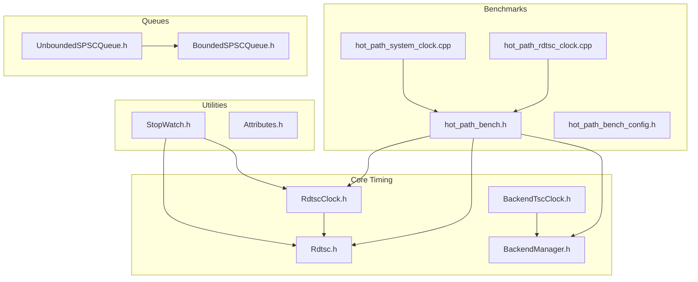
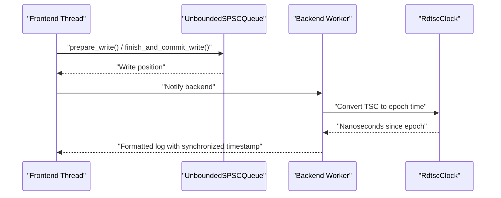
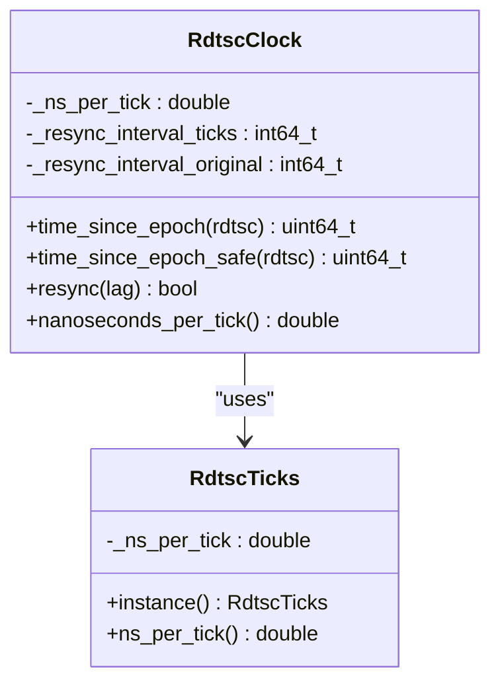
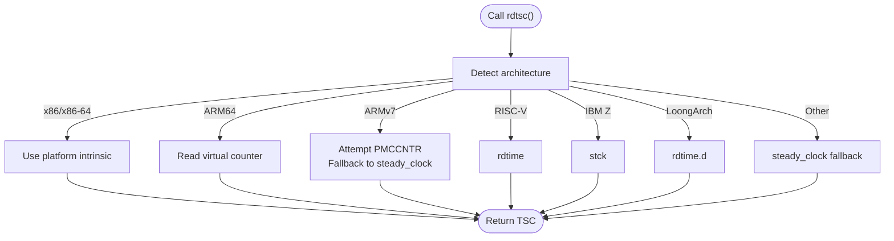
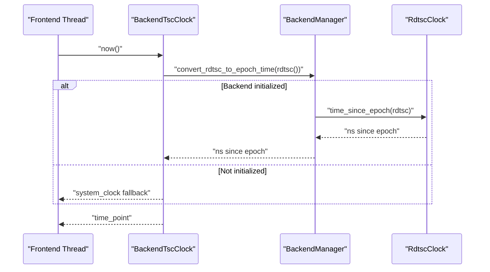
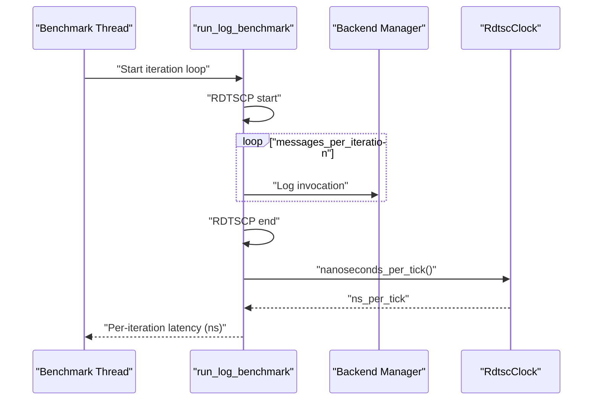
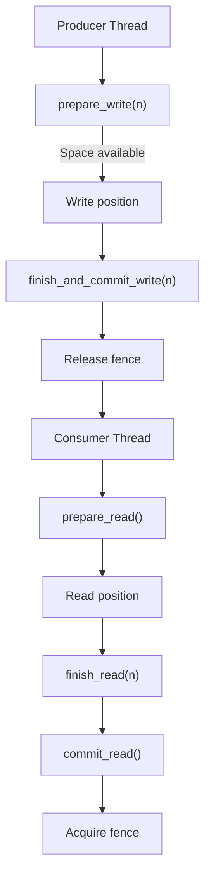
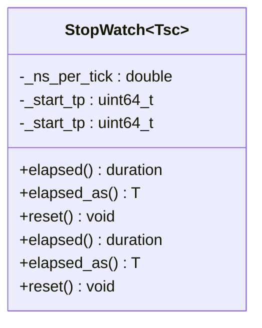
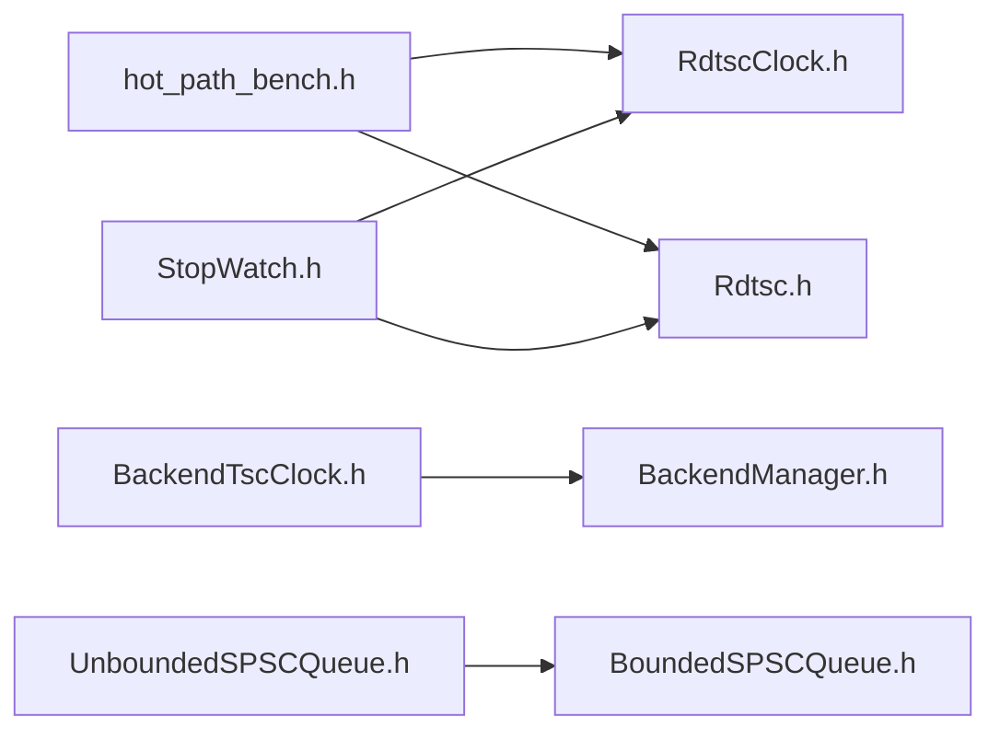

# Latency Optimization

<cite>
**Referenced Files in This Document**
- [quill_hot_path_rdtsc_clock.cpp](file://benchmarks/hot_path_latency/quill_hot_path_rdtsc_clock.cpp)
- [quill_hot_path_system_clock.cpp](file://benchmarks/hot_path_latency/quill_hot_path_system_clock.cpp)
- [hot_path_bench.h](file://benchmarks/hot_path_latency/hot_path_bench.h)
- [hot_path_bench_config.h](file://benchmarks/hot_path_latency/hot_path_bench_config.h)
- [RdtscClock.h](file://include/quill/backend/RdtscClock.h)
- [Rdtsc.h](file://include/quill/core/Rdtsc.h)
- [BackendTscClock.h](file://include/quill/BackendTscClock.h)
- [BackendManager.h](file://include/quill/backend/BackendManager.h)
- [BoundedSPSCQueue.h](file://include/quill/core/BoundedSPSCQueue.h)
- [UnboundedSPSCQueue.h](file://include/quill/core/UnboundedSPSCQueue.h)
- [StopWatch.h](file://include/quill/StopWatch.h)
- [Attributes.h](file://include/quill/core/Attributes.h)
- [RdtscClockTest.cpp](file://test/unit_tests/RdtscClockTest.cpp)
- [BackendTscClockTest.cpp](file://test/integration_tests/BackendTscClockTest.cpp)
- [backend_tsc_clock.cpp](file://examples/backend_tsc_clock.cpp)
</cite>

## Table of Contents
1. [Introduction](#introduction)
2. [Project Structure](#project-structure)
3. [Core Components](#core-components)
4. [Architecture Overview](#architecture-overview)
5. [Detailed Component Analysis](#detailed-component-analysis)
6. [Dependency Analysis](#dependency-analysis)
7. [Performance Considerations](#performance-considerations)
8. [Troubleshooting Guide](#troubleshooting-guide)
9. [Conclusion](#conclusion)
10. [Appendices](#appendices)

## Introduction
This document explains latency optimization in Quill with a focus on the hot path performance characteristics of TSC (Time Stamp Counter) versus system clock, microsecond-level timing precision, and hardware-specific optimizations. It documents latency measurement methodologies using benchmark tools, RDTSC clock configuration, and performance profiling techniques. It also covers micro-optimizations such as queue bypass strategies, zero-copy message passing, and template specialization benefits, and provides practical examples for latency-sensitive applications, measurement setups, and optimization strategies for real-time systems, including platform-specific considerations and hardware requirements.

## Project Structure
The latency-critical parts of the repository relevant to this document are organized around:
- Benchmarks for hot-path latency comparisons between TSC and system clocks
- Core timing infrastructure for TSC and system clocks
- Backend synchronization and conversion of TSC to wall-clock time
- Lock-free SPSC queues enabling wait-free production/consumption
- Stopwatch utilities for TSC- and system-clock-based measurements
- Tests validating TSC clock correctness and synchronization

**Diagram sources**
- [quill_hot_path_rdtsc_clock.cpp:1-95](file://benchmarks/hot_path_latency/quill_hot_path_rdtsc_clock.cpp#L1-L95)
- [quill_hot_path_system_clock.cpp:1-98](file://benchmarks/hot_path_latency/quill_hot_path_system_clock.cpp#L1-L98)
- [hot_path_bench.h:1-202](file://benchmarks/hot_path_latency/hot_path_bench.h#L1-L202)
- [hot_path_bench_config.h:1-37](file://benchmarks/hot_path_latency/hot_path_bench_config.h#L1-L37)
- [Rdtsc.h:1-114](file://include/quill/core/Rdtsc.h#L1-L114)
- [RdtscClock.h:1-265](file://include/quill/backend/RdtscClock.h#L1-L265)
- [BackendTscClock.h:1-100](file://include/quill/BackendTscClock.h#L1-L100)
- [BackendManager.h:1-136](file://include/quill/backend/BackendManager.h#L1-L136)
- [BoundedSPSCQueue.h:1-356](file://include/quill/core/BoundedSPSCQueue.h#L1-L356)
- [UnboundedSPSCQueue.h:1-345](file://include/quill/core/UnboundedSPSCQueue.h#L1-L345)
- [StopWatch.h:1-144](file://include/quill/StopWatch.h#L1-L144)
- [Attributes.h:1-181](file://include/quill/core/Attributes.h#L1-L181)

**Section sources**
- [quill_hot_path_rdtsc_clock.cpp:1-95](file://benchmarks/hot_path_latency/quill_hot_path_rdtsc_clock.cpp#L1-L95)
- [quill_hot_path_system_clock.cpp:1-98](file://benchmarks/hot_path_latency/quill_hot_path_system_clock.cpp#L1-L98)
- [hot_path_bench.h:1-202](file://benchmarks/hot_path_latency/hot_path_bench.h#L1-L202)
- [hot_path_bench_config.h:1-37](file://benchmarks/hot_path_latency/hot_path_bench_config.h#L1-L37)
- [Rdtsc.h:1-114](file://include/quill/core/Rdtsc.h#L1-L114)
- [RdtscClock.h:1-265](file://include/quill/backend/RdtscClock.h#L1-L265)
- [BackendTscClock.h:1-100](file://include/quill/BackendTscClock.h#L1-L100)
- [BackendManager.h:1-136](file://include/quill/backend/BackendManager.h#L1-L136)
- [BoundedSPSCQueue.h:1-356](file://include/quill/core/BoundedSPSCQueue.h#L1-L356)
- [UnboundedSPSCQueue.h:1-345](file://include/quill/core/UnboundedSPSCQueue.h#L1-L345)
- [StopWatch.h:1-144](file://include/quill/StopWatch.h#L1-L144)
- [Attributes.h:1-181](file://include/quill/core/Attributes.h#L1-L181)

## Core Components
- TSC clock calibration and conversion: The backend maintains a synchronized TSC-derived wall time and exposes conversions to epoch time for both backend and frontend threads.
- Hardware-specific TSC acquisition: Platform-specific intrinsics and assembly instructions provide efficient TSC reads across x86, ARM, RISC-V, IBM Z, and LoongArch.
- Hot-path latency benchmark harness: Measures per-iteration latency using RDTSCP sampling and converts raw cycles to nanoseconds via calibrated ns-per-tick.
- Lock-free SPSC queues: Bounded and unbounded variants minimize contention and cache pollution for high-frequency logging.
- Stopwatch utilities: Provide TSC- and system-clock-based elapsed time measurement for micro-benchmarks and runtime diagnostics.

**Section sources**
- [RdtscClock.h:36-265](file://include/quill/backend/RdtscClock.h#L36-L265)
- [Rdtsc.h:42-110](file://include/quill/core/Rdtsc.h#L42-L110)
- [hot_path_bench.h:61-125](file://benchmarks/hot_path_latency/hot_path_bench.h#L61-L125)
- [BoundedSPSCQueue.h:54-356](file://include/quill/core/BoundedSPSCQueue.h#L54-L356)
- [UnboundedSPSCQueue.h:42-345](file://include/quill/core/UnboundedSPSCQueue.h#L42-L345)
- [StopWatch.h:44-144](file://include/quill/StopWatch.h#L44-L144)

## Architecture Overview
The latency-critical path integrates frontend logging macros with a lock-free producer queue and a backend worker that consumes and formats messages. When TSC is enabled, the backend maintains a synchronized TSC-to-wall-time mapping, and frontend threads can query synchronized timestamps.

**Diagram sources**
- [UnboundedSPSCQueue.h:115-149](file://include/quill/core/UnboundedSPSCQueue.h#L115-L149)
- [BoundedSPSCQueue.h:105-145](file://include/quill/core/BoundedSPSCQueue.h#L105-L145)
- [RdtscClock.h:147-166](file://include/quill/backend/RdtscClock.h#L147-L166)
- [BackendManager.h:99-102](file://include/quill/backend/BackendManager.h#L99-L102)

## Detailed Component Analysis

### TSC Clock Calibration and Conversion
- Calibration: The backend initializes a calibrated rate of TSC ticks per nanosecond using steady-clock spans and median filtering to reduce noise.
- Conversion: The backend converts raw TSC values to nanoseconds since Unix epoch using base offsets and ns-per-tick scaling, with periodic resynchronization to prevent drift.
- Safe conversion: A thread-safe path avoids resync and returns zero until the backend initializes synchronization.

**Diagram sources**
- [RdtscClock.h:42-144](file://include/quill/backend/RdtscClock.h#L42-L144)
- [RdtscClock.h:147-193](file://include/quill/backend/RdtscClock.h#L147-L193)

**Section sources**
- [RdtscClock.h:42-144](file://include/quill/backend/RdtscClock.h#L42-L144)
- [RdtscClock.h:147-193](file://include/quill/backend/RdtscClock.h#L147-L193)
- [RdtscClockTest.cpp:10-47](file://test/unit_tests/RdtscClockTest.cpp#L10-L47)

### Hardware-Specific TSC Acquisition
- x86/x86-64: Uses platform intrinsics for fast TSC reads.
- ARM64: Uses virtual counter register for cycle count.
- ARMv7: Attempts PMCCNTR-based cycle counting with fallback.
- RISC-V: Uses rdtime instruction.
- IBM Z: Uses stck instruction.
- LoongArch: Uses rdtime.d instruction.
- Fallback: On unsupported platforms, falls back to steady clock.

**Diagram sources**
- [Rdtsc.h:42-110](file://include/quill/core/Rdtsc.h#L42-L110)

**Section sources**
- [Rdtsc.h:15-110](file://include/quill/core/Rdtsc.h#L15-L110)

### Backend Synchronized Timestamp Access
- BackendTscClock provides synchronized access to the backend’s TSC-derived epoch time and raw TSC values. If no TSC-based logger has initialized the backend clock, it falls back to system clock.

**Diagram sources**
- [BackendTscClock.h:64-73](file://include/quill/BackendTscClock.h#L64-L73)
- [BackendManager.h:99-102](file://include/quill/backend/BackendManager.h#L99-L102)
- [RdtscClock.h:147-166](file://include/quill/backend/RdtscClock.h#L147-L166)

**Section sources**
- [BackendTscClock.h:33-98](file://include/quill/BackendTscClock.h#L33-L98)
- [BackendManager.h:99-102](file://include/quill/backend/BackendManager.h#L99-L102)
- [BackendTscClockTest.cpp:18-65](file://test/integration_tests/BackendTscClockTest.cpp#L18-L65)

### Hot-Path Latency Measurement Harness
- Uses RDTSCP sampling around a batch of log invocations to measure raw cycles per message.
- Converts cycles to nanoseconds using the calibrated ns-per-tick from RdtscClock.
- Aggregates percentiles across iterations and threads for latency reporting.

**Diagram sources**
- [hot_path_bench.h:108-117](file://benchmarks/hot_path_latency/hot_path_bench.h#L108-L117)
- [hot_path_bench.h:140-149](file://benchmarks/hot_path_latency/hot_path_bench.h#L140-L149)
- [RdtscClock.h:233-233](file://include/quill/backend/RdtscClock.h#L233-L233)

**Section sources**
- [hot_path_bench.h:61-125](file://benchmarks/hot_path_latency/hot_path_bench.h#L61-L125)
- [hot_path_bench.h:128-202](file://benchmarks/hot_path_latency/hot_path_bench.h#L128-L202)
- [hot_path_bench_config.h:10-37](file://benchmarks/hot_path_latency/hot_path_bench_config.h#L10-L37)

### Lock-Free SPSC Queues and Zero-Copy Message Passing
- BoundedSPSCQueue: Single-producer, single-consumer ring buffer with cache-line-aligned positions, atomic fences, and prefetching/clflush optimizations for x86 to reduce cache pollution and improve throughput.
- UnboundedSPSCQueue: Chains nodes of bounded queues to grow capacity dynamically without blocking producers beyond doubling policy and maximum capacity checks.

**Diagram sources**
- [BoundedSPSCQueue.h:105-169](file://include/quill/core/BoundedSPSCQueue.h#L105-L169)
- [UnboundedSPSCQueue.h:115-224](file://include/quill/core/UnboundedSPSCQueue.h#L115-L224)

**Section sources**
- [BoundedSPSCQueue.h:54-356](file://include/quill/core/BoundedSPSCQueue.h#L54-L356)
- [UnboundedSPSCQueue.h:42-345](file://include/quill/core/UnboundedSPSCQueue.h#L42-L345)

### Stopwatch Utilities for Micro-Benchmarks
- StopWatchTsc uses calibrated ns-per-tick and raw TSC differences for high-resolution elapsed time.
- StopWatchChrono uses steady_clock for portable, monotonic time measurement.

**Diagram sources**
- [StopWatch.h:44-114](file://include/quill/StopWatch.h#L44-L114)

**Section sources**
- [StopWatch.h:44-144](file://include/quill/StopWatch.h#L44-L144)

### Practical Examples and Scenarios
- Backend TSC clock example: Demonstrates synchronized timestamp retrieval and conversion to wall-clock time when using TSC as the backend clock source.
- Hot-path latency benchmarks: Compare TSC and system clock backends under identical logging loads and configurations.

**Section sources**
- [backend_tsc_clock.cpp:1-63](file://examples/backend_tsc_clock.cpp#L1-L63)
- [quill_hot_path_rdtsc_clock.cpp:26-92](file://benchmarks/hot_path_latency/quill_hot_path_rdtsc_clock.cpp#L26-L92)
- [quill_hot_path_system_clock.cpp:26-95](file://benchmarks/hot_path_latency/quill_hot_path_system_clock.cpp#L26-L95)

## Dependency Analysis
Key dependencies and their roles in latency:
- hot_path_bench.h depends on RdtscClock and Rdtsc for ns-per-tick calibration and cycle sampling.
- BackendTscClock depends on BackendManager for converting backend TSC to epoch time.
- StopWatch depends on RdtscClock and Rdtsc for TSC-based timing.
- UnboundedSPSCQueue composes BoundedSPSCQueue for lock-free, wait-free operations.

**Diagram sources**
- [hot_path_bench.h:10-12](file://benchmarks/hot_path_latency/hot_path_bench.h#L10-L12)
- [RdtscClock.h:1-265](file://include/quill/backend/RdtscClock.h#L1-L265)
- [Rdtsc.h:1-114](file://include/quill/core/Rdtsc.h#L1-L114)
- [BackendTscClock.h:1-100](file://include/quill/BackendTscClock.h#L1-L100)
- [BackendManager.h:1-136](file://include/quill/backend/BackendManager.h#L1-L136)
- [UnboundedSPSCQueue.h:1-345](file://include/quill/core/UnboundedSPSCQueue.h#L1-L345)
- [BoundedSPSCQueue.h:1-356](file://include/quill/core/BoundedSPSCQueue.h#L1-L356)
- [StopWatch.h:1-144](file://include/quill/StopWatch.h#L1-L144)

**Section sources**
- [hot_path_bench.h:10-12](file://benchmarks/hot_path_latency/hot_path_bench.h#L10-L12)
- [BackendTscClock.h:1-100](file://include/quill/BackendTscClock.h#L1-L100)
- [BackendManager.h:1-136](file://include/quill/backend/BackendManager.h#L1-L136)
- [UnboundedSPSCQueue.h:1-345](file://include/quill/core/UnboundedSPSCQueue.h#L1-L345)
- [BoundedSPSCQueue.h:1-356](file://include/quill/core/BoundedSPSCQueue.h#L1-L356)
- [StopWatch.h:1-144](file://include/quill/StopWatch.h#L1-L144)

## Performance Considerations
- TSC vs system clock trade-offs:
  - TSC offers sub-nanosecond precision and low overhead on modern CPUs, but requires careful calibration and periodic resynchronization to maintain wall-clock accuracy.
  - System clock provides monotonic wall time without calibration, but incurs additional syscalls and potential jitter.
- Hardware-specific optimizations:
  - x86 path uses clflush/opt and prefetch hints to reduce cache pollution and improve pipeline behavior.
  - Platform intrinsics and assembly instructions minimize overhead for TSC reads across architectures.
- Queue bypass strategies:
  - UnboundedSPSCQueue grows buffers exponentially and switches nodes atomically, avoiding blocking under moderate contention.
  - BoundedSPSCQueue uses atomic fences and batched commits to reduce memory traffic.
- Template specialization benefits:
  - StopWatch and RdtscClock expose specialized code paths for TSC/system clock, enabling compile-time optimizations and reduced branching.
- Profiling techniques:
  - Use the provided hot-path benchmark harness to measure latency percentiles across threads and iterations.
  - Combine with external profilers to inspect cache behavior and backend synchronization overhead.

[No sources needed since this section provides general guidance]

## Troubleshooting Guide
- TSC clock not initialized:
  - BackendTscClock falls back to system clock if no TSC-based logger has been used. Ensure a logger with TSC clock source is created and at least one log is flushed to initialize the backend clock.
- Timestamp divergence:
  - Validate that the backend clock is periodically resynchronizing. If resync attempts fail, expect increased resync intervals and potential drift.
- Benchmark noise:
  - Use the PERF_ENABLED mode in the benchmark configuration to minimize extra computation during measurements.
- Queue capacity limits:
  - Unbounded queue growth is capped by maximum capacity; oversized messages can trigger exceptions. Adjust FrontendOptions accordingly.

**Section sources**
- [BackendTscClockTest.cpp:33-65](file://test/integration_tests/BackendTscClockTest.cpp#L33-L65)
- [RdtscClockTest.cpp:33-47](file://test/unit_tests/RdtscClockTest.cpp#L33-L47)
- [hot_path_bench_config.h:10-19](file://benchmarks/hot_path_latency/hot_path_bench_config.h#L10-L19)
- [UnboundedSPSCQueue.h:244-297](file://include/quill/core/UnboundedSPSCQueue.h#L244-L297)

## Conclusion
Quill’s latency optimization combines precise TSC calibration and conversion, hardware-aware TSC acquisition, lock-free SPSC queues, and specialized stopwatch utilities. The benchmark harness enables rigorous latency measurement across TSC and system clock modes. By tuning queue capacities, leveraging template specializations, and applying platform-specific optimizations, real-time systems can achieve predictable, low-latency logging performance.

[No sources needed since this section summarizes without analyzing specific files]

## Appendices

### Measurement Setup Procedures
- Configure backend options for minimal sleep and desired CPU affinity.
- Choose ClockSourceType::Tsc for backend to enable synchronized timestamps.
- Run the hot-path latency benchmarks with and without PERF_ENABLED to compare overhead.
- Use BackendTscClock::now() and StopWatchTsc for synchronized timing in latency-sensitive code.

**Section sources**
- [quill_hot_path_rdtsc_clock.cpp:32-57](file://benchmarks/hot_path_latency/quill_hot_path_rdtsc_clock.cpp#L32-L57)
- [quill_hot_path_system_clock.cpp:32-60](file://benchmarks/hot_path_latency/quill_hot_path_system_clock.cpp#L32-L60)
- [hot_path_bench_config.h:21-37](file://benchmarks/hot_path_latency/hot_path_bench_config.h#L21-L37)
- [BackendTscClock.h:64-73](file://include/quill/BackendTscClock.h#L64-L73)
- [StopWatch.h:119-124](file://include/quill/StopWatch.h#L119-L124)

### Optimization Strategies for Real-Time Systems
- Pin backend and frontend threads to isolated cores and disable frequency scaling.
- Prefer UnboundedBlocking queue with large initial capacity to avoid reallocations.
- Use TSC clock source for synchronized, low-overhead timestamps.
- Apply cache-friendly patterns: avoid excessive allocations on hot path, leverage zero-copy message passing via prepared buffers.

[No sources needed since this section provides general guidance]