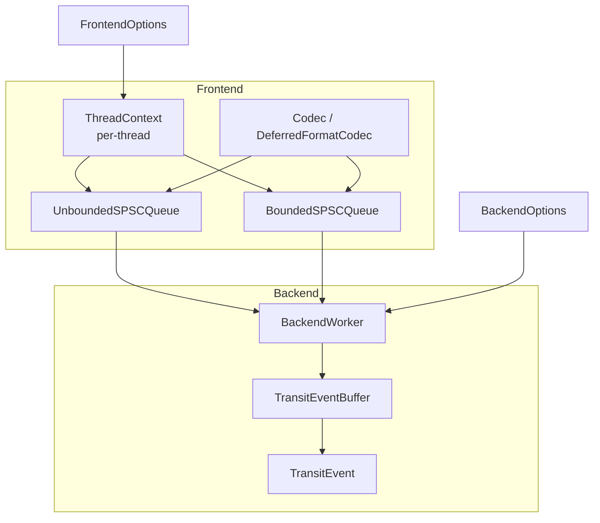
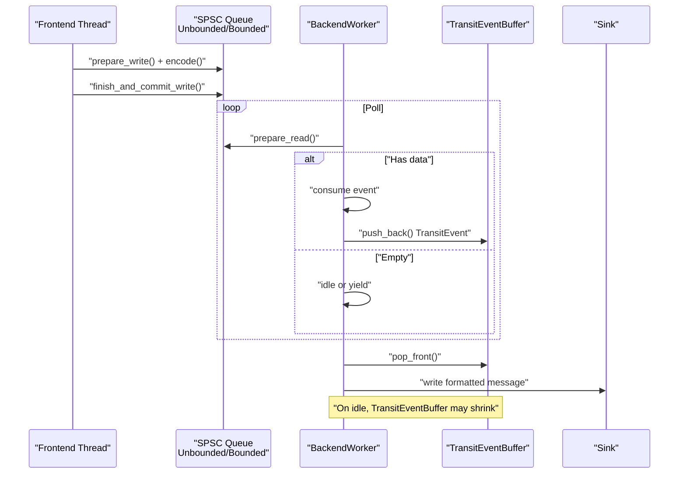
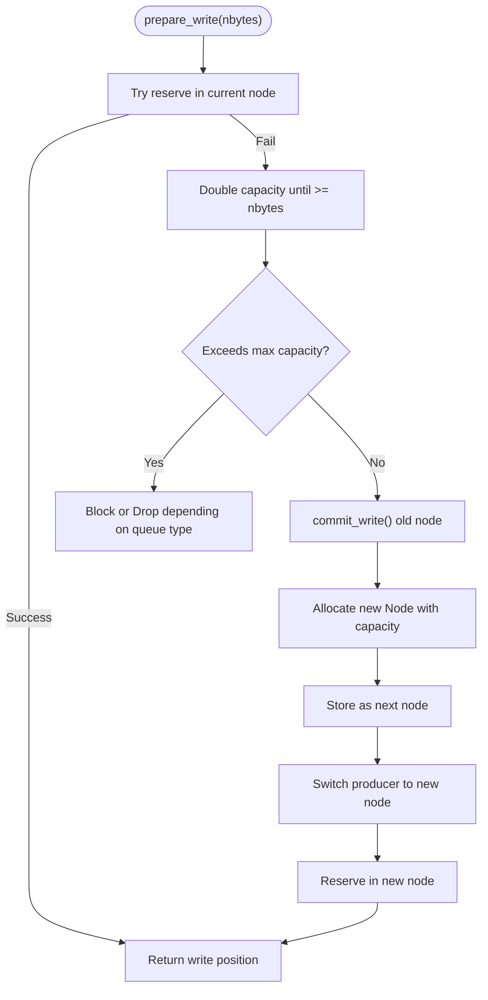
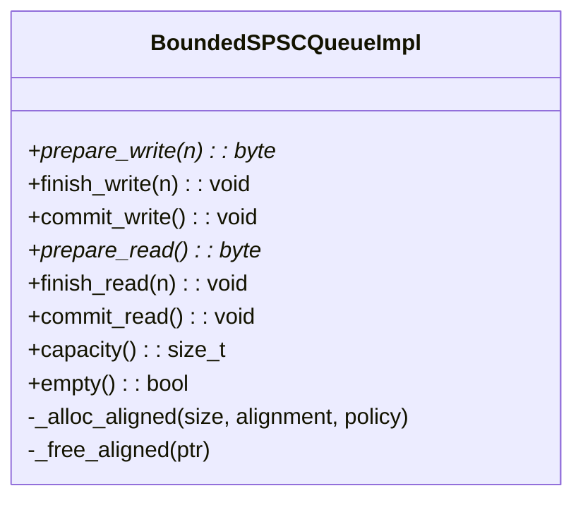
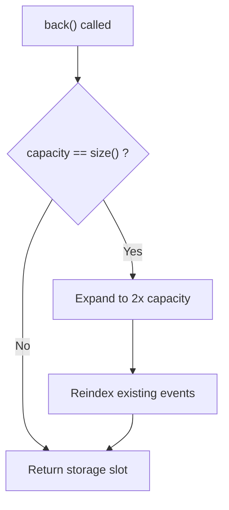
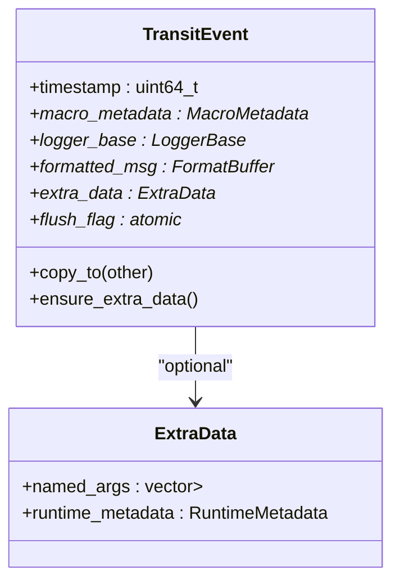
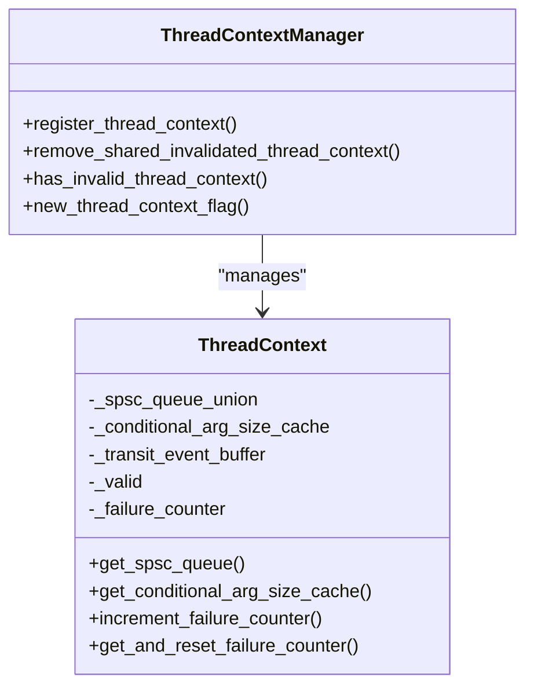
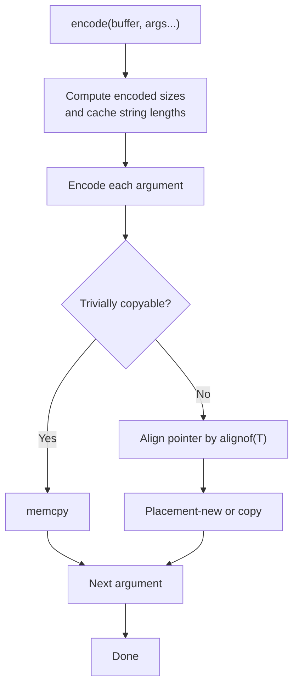
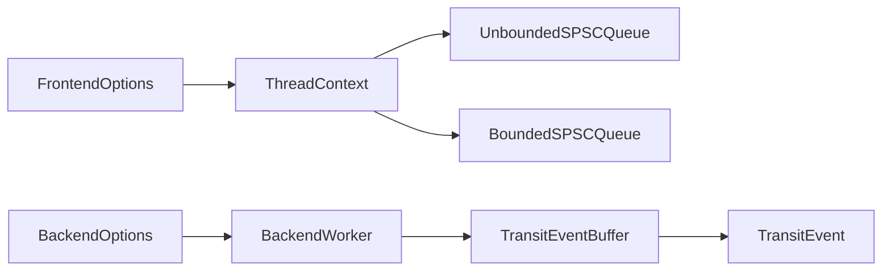

# Memory Usage Analysis

<cite>
**Referenced Files in This Document**
- [UnboundedSPSCQueue.h](file://include/quill/core/UnboundedSPSCQueue.h)
- [BoundedSPSCQueue.h](file://include/quill/core/BoundedSPSCQueue.h)
- [TransitEventBuffer.h](file://include/quill/backend/TransitEventBuffer.h)
- [TransitEvent.h](file://include/quill/backend/TransitEvent.h)
- [ThreadContextManager.h](file://include/quill/core/ThreadContextManager.h)
- [FrontendOptions.h](file://include/quill/core/FrontendOptions.h)
- [BackendOptions.h](file://include/quill/backend/BackendOptions.h)
- [Common.h](file://include/quill/core/Common.h)
- [Codec.h](file://include/quill/core/Codec.h)
- [DeferredFormatCodec.h](file://include/quill/DeferredFormatCodec.h)
- [UnboundedUnlimitedQueueTest.cpp](file://test/integration_tests/UnboundedUnlimitedQueueTest.cpp)
- [ShrinkThreadLocalQueueTest.cpp](file://test/integration_tests/ShrinkThreadLocalQueueTest.cpp)
- [bounded_dropping_queue_frontend.cpp](file://examples/bounded_dropping_queue_frontend.cpp)
- [quill_backend_throughput.cpp](file://benchmarks/backend_throughput/quill_backend_throughput.cpp)
- [BackendWorker.h](file://include/quill/backend/BackendWorker.h)
</cite>

## Table of Contents
1. [Introduction](#introduction)
2. [Project Structure](#project-structure)
3. [Core Components](#core-components)
4. [Architecture Overview](#architecture-overview)
5. [Detailed Component Analysis](#detailed-component-analysis)
6. [Dependency Analysis](#dependency-analysis)
7. [Performance Considerations](#performance-considerations)
8. [Troubleshooting Guide](#troubleshooting-guide)
9. [Conclusion](#conclusion)
10. [Appendices](#appendices)

## Introduction
This document provides a comprehensive memory usage analysis and optimization guide for Quill. It focuses on queue memory expansion behavior, unbounded queue growth patterns, memory allocation strategies, and metrics such as queue buffer sizes, event serialization overhead, and thread-local storage requirements. It also covers memory leak detection, heap usage optimization, memory-efficient logging patterns, practical examples for memory-constrained environments, profiling techniques, configuration strategies for different memory budgets, memory alignment considerations, cache-friendly data structures, and garbage collection impact in managed environments.

## Project Structure
Quill’s memory-critical subsystems are centered around:
- Frontend per-thread queues (SPSC): bounded and unbounded variants
- Backend transit event buffer: unbounded growth with controlled limits
- Thread-local context management: per-thread queue and caches
- Serialization codecs: efficient argument encoding/decoding
- Configuration options: queue capacities, limits, and policies

**Diagram sources**
- [ThreadContextManager.h:53-214](file://include/quill/core/ThreadContextManager.h#L53-L214)
- [UnboundedSPSCQueue.h:42-337](file://include/quill/core/UnboundedSPSCQueue.h#L42-L337)
- [BoundedSPSCQueue.h:54-346](file://include/quill/core/BoundedSPSCQueue.h#L54-L346)
- [TransitEventBuffer.h:19-157](file://include/quill/backend/TransitEventBuffer.h#L19-L157)
- [TransitEvent.h:32-219](file://include/quill/backend/TransitEvent.h#L32-L219)
- [FrontendOptions.h:16-50](file://include/quill/core/FrontendOptions.h#L16-L50)
- [BackendOptions.h:30-92](file://include/quill/backend/BackendOptions.h#L30-L92)

**Section sources**
- [ThreadContextManager.h:53-214](file://include/quill/core/ThreadContextManager.h#L53-L214)
- [UnboundedSPSCQueue.h:42-337](file://include/quill/core/UnboundedSPSCQueue.h#L42-L337)
- [BoundedSPSCQueue.h:54-346](file://include/quill/core/BoundedSPSCQueue.h#L54-L346)
- [TransitEventBuffer.h:19-157](file://include/quill/backend/TransitEventBuffer.h#L19-L157)
- [TransitEvent.h:32-219](file://include/quill/backend/TransitEvent.h#L32-L219)
- [FrontendOptions.h:16-50](file://include/quill/core/FrontendOptions.h#L16-L50)
- [BackendOptions.h:30-92](file://include/quill/backend/BackendOptions.h#L30-L92)

## Core Components
- UnboundedSPSCQueue: A single-producer single-consumer circular buffer that grows exponentially when full, bounded by a maximum capacity. It uses nodes chained via atomic pointers and supports shrinking.
- BoundedSPSCQueue: Fixed-capacity ring buffer with aligned storage, optional huge pages, and cache-line aware positions and batching.
- TransitEventBuffer: Unbounded circular buffer for backend transit events, doubling capacity when full and supporting shrink-to-initial on idle.
- TransitEvent: Lightweight event carrying formatted message and optional runtime metadata; uses small-object optimization and heap-allocated buffers when needed.
- ThreadContextManager: Manages per-thread ThreadContext instances, including the SPSC queue union and a conditional argument size cache.
- FrontendOptions and BackendOptions: Provide knobs for queue capacity, growth limits, huge pages policy, and backend buffer sizing.

Key memory characteristics:
- Per-thread queues: either fixed-size (bounded) or unbounded with exponential growth up to a hard cap.
- Backend transit buffer: unbounded growth per frontend thread, with configurable initial capacity and hard limits.
- Serialization: argument encoding computes sizes and copies data efficiently; deferred codec supports trivially copyable types with alignment-aware placement.

**Section sources**
- [UnboundedSPSCQueue.h:42-337](file://include/quill/core/UnboundedSPSCQueue.h#L42-L337)
- [BoundedSPSCQueue.h:54-346](file://include/quill/core/BoundedSPSCQueue.h#L54-L346)
- [TransitEventBuffer.h:19-157](file://include/quill/backend/TransitEventBuffer.h#L19-L157)
- [TransitEvent.h:32-219](file://include/quill/backend/TransitEvent.h#L32-L219)
- [ThreadContextManager.h:53-214](file://include/quill/core/ThreadContextManager.h#L53-L214)
- [FrontendOptions.h:16-50](file://include/quill/core/FrontendOptions.h#L16-L50)
- [BackendOptions.h:30-92](file://include/quill/backend/BackendOptions.h#L30-L92)

## Architecture Overview
The memory pipeline:
- Frontend threads serialize log arguments via codecs into per-thread SPSC queues.
- Backend worker polls all frontend queues, aggregates events into per-thread TransitEventBuffer, and writes to sinks.
- Memory growth occurs in:
  - UnboundedSPSCQueue nodes when full
  - TransitEventBuffer when capacity is exceeded
- Memory is reclaimed when:
  - UnboundedSPSCQueue shrinks to a smaller power-of-two capacity
  - TransitEventBuffer shrinks back to initial capacity when idle

**Diagram sources**
- [UnboundedSPSCQueue.h:115-149](file://include/quill/core/UnboundedSPSCQueue.h#L115-L149)
- [BoundedSPSCQueue.h:105-169](file://include/quill/core/BoundedSPSCQueue.h#L105-L169)
- [TransitEventBuffer.h:72-93](file://include/quill/backend/TransitEventBuffer.h#L72-L93)
- [BackendWorker.h:1415-1445](file://include/quill/backend/BackendWorker.h#L1415-L1445)

## Detailed Component Analysis

### UnboundedSPSCQueue Memory Expansion Behavior
- Growth pattern: When the current bounded node is full, the queue doubles capacity until sufficient for the requested write, capped by maximum capacity.
- Allocation strategy: New nodes are allocated with aligned storage and inherit the huge pages policy.
- Shrink strategy: Producer can shrink to a smaller power-of-two capacity; consumer switches to the new node after draining and deletes the old one.
- Empty detection: Uses atomic pointers and next-node chaining; empty when no data and no next node.

**Diagram sources**
- [UnboundedSPSCQueue.h:244-296](file://include/quill/core/UnboundedSPSCQueue.h#L244-L296)

**Section sources**
- [UnboundedSPSCQueue.h:244-296](file://include/quill/core/UnboundedSPSCQueue.h#L244-L296)
- [UnboundedSPSCQueue.h:300-329](file://include/quill/core/UnboundedSPSCQueue.h#L300-L329)

### BoundedSPSCQueue Memory Allocation and Cache-Friendliness
- Fixed capacity with power-of-two sizing and bitmask indexing.
- Aligned storage allocation with optional huge pages on Linux; metadata embedded for proper free.
- Cache-line awareness: writer and reader positions are cache-line aligned atomics; periodic cache flush/prefetch on x86.
- Reader batching: commits are batched to reduce atomic writes and cache pollution.

**Diagram sources**
- [BoundedSPSCQueue.h:54-346](file://include/quill/core/BoundedSPSCQueue.h#L54-L346)

**Section sources**
- [BoundedSPSCQueue.h:246-302](file://include/quill/core/BoundedSPSCQueue.h#L246-L302)
- [BoundedSPSCQueue.h:209-220](file://include/quill/core/BoundedSPSCQueue.h#L209-L220)
- [BoundedSPSCQueue.h:175-189](file://include/quill/core/BoundedSPSCQueue.h#L175-L189)

### TransitEventBuffer Unbounded Growth and Shrink-to-Initial
- Doubles capacity when full; moves elements preserving order using circular buffer indices.
- Shrink-to-initial on idle when shrink is requested and buffer is empty.
- Maintains reader/writer positions and mask for O(1) push/pop.

**Diagram sources**
- [TransitEventBuffer.h:83-93](file://include/quill/backend/TransitEventBuffer.h#L83-L93)
- [TransitEventBuffer.h:128-148](file://include/quill/backend/TransitEventBuffer.h#L128-L148)

**Section sources**
- [TransitEventBuffer.h:128-148](file://include/quill/backend/TransitEventBuffer.h#L128-L148)
- [TransitEventBuffer.h:109-125](file://include/quill/backend/TransitEventBuffer.h#L109-L125)

### TransitEvent Serialization Overhead and Memory Layout
- TransitEvent holds a formatted message buffer and optional runtime metadata.
- Small-object optimization: extra data is lazily allocated; formatted message buffer is heap-allocated when needed.
- Copy/move semantics preserve macro metadata pointer after move when runtime metadata is present.

**Diagram sources**
- [TransitEvent.h:32-219](file://include/quill/backend/TransitEvent.h#L32-L219)

**Section sources**
- [TransitEvent.h:88-110](file://include/quill/backend/TransitEvent.h#L88-L110)
- [TransitEvent.h:125-133](file://include/quill/backend/TransitEvent.h#L125-L133)

### Thread-Local Storage Requirements and Failure Counting
- ThreadContext stores per-thread SPSC queue union, a conditional argument size cache, thread identity/name, and a shared transit event buffer pointer.
- Failure counter tracks queue operation failures; reset per poll cycle.
- Thread-local lifetime: ScopedThreadContext creates a shared_ptr ThreadContext owned by the thread; marked invalid on destruction and removed when empty.

**Diagram sources**
- [ThreadContextManager.h:53-214](file://include/quill/core/ThreadContextManager.h#L53-L214)
- [ThreadContextManager.h:216-338](file://include/quill/core/ThreadContextManager.h#L216-L338)

**Section sources**
- [ThreadContextManager.h:188-201](file://include/quill/core/ThreadContextManager.h#L188-L201)
- [ThreadContextManager.h:310-327](file://include/quill/core/ThreadContextManager.h#L310-L327)

### Codec and DeferredFormatCodec Memory Efficiency
- Codec computes encoded sizes and encodes arguments with minimal allocations for strings and arrays.
- DeferredFormatCodec supports trivially copyable types with memcpy; for others, placement-new into aligned storage to avoid extra copies.
- Argument size caching avoids repeated strlen computations.

**Diagram sources**
- [Codec.h:354-388](file://include/quill/core/Codec.h#L354-L388)
- [DeferredFormatCodec.h:90-137](file://include/quill/DeferredFormatCodec.h#L90-L137)

**Section sources**
- [Codec.h:147-189](file://include/quill/core/Codec.h#L147-L189)
- [DeferredFormatCodec.h:96-107](file://include/quill/DeferredFormatCodec.h#L96-L107)

## Dependency Analysis
- ThreadContextManager depends on ThreadContext, which embeds either UnboundedSPSCQueue or BoundedSPSCQueue via a union.
- BackendWorker polls ThreadContext queues and uses TransitEventBuffer per thread.
- FrontendOptions and BackendOptions configure capacities and limits.

**Diagram sources**
- [ThreadContextManager.h:67-80](file://include/quill/core/ThreadContextManager.h#L67-L80)
- [UnboundedSPSCQueue.h:79-84](file://include/quill/core/UnboundedSPSCQueue.h#L79-L84)
- [BoundedSPSCQueue.h:60-69](file://include/quill/core/BoundedSPSCQueue.h#L60-L69)
- [BackendOptions.h:58-92](file://include/quill/backend/BackendOptions.h#L58-L92)

**Section sources**
- [ThreadContextManager.h:67-80](file://include/quill/core/ThreadContextManager.h#L67-L80)
- [BackendWorker.h:1415-1445](file://include/quill/backend/BackendWorker.h#L1415-L1445)

## Performance Considerations
- Cache-line alignment: Both SPSC queues and positions are aligned to cache lines to reduce false sharing.
- x86 optimizations: Cache flush/prefetch on writes and reads to improve memory bandwidth utilization.
- Batched commits: Reader batches commit operations to reduce atomic contention.
- Huge pages: Optional huge pages support on Linux to reduce TLB pressure; configurable per queue.
- Unbounded growth limits: Unbounded queues cap growth at a maximum capacity; bounded queues never reallocate.
- Backend buffer sizing: TransitEventBuffer initial capacity and hard limits control backend memory footprint.

Practical tips:
- Prefer bounded queues in memory-constrained environments to avoid unbounded growth.
- Tune initial queue capacity and unbounded max capacity to match workload.
- Use huge pages on Linux when latency-sensitive and memory footprint is acceptable.
- Monitor backend transit buffer usage and adjust soft/hard limits.

**Section sources**
- [BoundedSPSCQueue.h:75-94](file://include/quill/core/BoundedSPSCQueue.h#L75-L94)
- [BoundedSPSCQueue.h:159-169](file://include/quill/core/BoundedSPSCQueue.h#L159-L169)
- [UnboundedSPSCQueue.h:253-275](file://include/quill/core/UnboundedSPSCQueue.h#L253-L275)
- [BackendOptions.h:58-92](file://include/quill/backend/BackendOptions.h#L58-L92)

## Troubleshooting Guide
- Unbounded queue single-message too large: The queue throws an error when a single message exceeds the maximum capacity. Increase FrontendOptions::unbounded_queue_max_capacity.
- Bounded queue full: Messages are dropped or the thread blocks depending on queue type; tune initial capacity or switch to unbounded.
- Backend buffer overflow: If backend cannot keep up, transit events hard limit prevents indefinite growth; increase limits or reduce throughput.
- Memory leaks: Ensure ThreadContext is properly invalidated and removed; BackendWorker removes invalidated contexts when empty.
- Profiling: Use benchmarks to measure throughput and latency; adjust BackendOptions::sleep_duration and BackendOptions::enable_yield_when_idle.

Concrete examples:
- Unbounded unlimited queue test demonstrates extremely large message logging and verifies backend flush behavior.
- Shrink thread-local queue test verifies queue shrinking and backend idle shrink behavior.
- Bounded dropping queue example shows small capacity leading to message drops.
- Backend throughput benchmark measures end-to-end performance with tuned backend options.

**Section sources**
- [UnboundedSPSCQueue.h:257-270](file://include/quill/core/UnboundedSPSCQueue.h#L257-L270)
- [UnboundedUnlimitedQueueTest.cpp:27-91](file://test/integration_tests/UnboundedUnlimitedQueueTest.cpp#L27-L91)
- [ShrinkThreadLocalQueueTest.cpp:29-98](file://test/integration_tests/ShrinkThreadLocalQueueTest.cpp#L29-L98)
- [bounded_dropping_queue_frontend.cpp:21-32](file://examples/bounded_dropping_queue_frontend.cpp#L21-L32)
- [quill_backend_throughput.cpp:14-68](file://benchmarks/backend_throughput/quill_backend_throughput.cpp#L14-L68)

## Conclusion
Quill’s memory model balances high throughput with predictable memory usage. Frontend queues offer bounded or unbounded growth with explicit limits, while the backend transit buffer grows unboundedly per thread but can shrink when idle. Efficient serialization, cache-aligned structures, and optional huge pages help minimize overhead. Proper configuration of queue capacities, backend limits, and policies enables deployment across diverse memory budgets, from constrained embedded systems to high-throughput servers.

## Appendices

### Memory Consumption Metrics Checklist
- Queue buffer sizes:
  - Frontend initial capacity and max capacity (bytes)
  - Per-thread queue node count and capacity growth rate
- Event serialization overhead:
  - Argument encoding size computation and cache hit rate
  - Formatted message buffer size distribution
- Thread-local storage:
  - ThreadContext size and per-thread queue union size
  - Conditional argument size cache usage
- Backend transit buffer:
  - Initial capacity and hard limits (items)
  - Peak occupancy and shrink-to-initial behavior

### Practical Examples and Configuration Strategies
- Memory-constrained environments:
  - Use BoundedDropping with small initial capacity
  - Disable huge pages
  - Reduce BackendOptions::transit_events_hard_limit
- Balanced throughput and memory:
  - Use UnboundedBlocking with moderate initial capacity and max capacity
  - Enable huge pages on Linux
  - Tune BackendOptions::transit_events_soft_limit and hard_limit
- High-throughput servers:
  - Use UnboundedBlocking with large initial capacity and max capacity
  - Enable huge pages
  - Adjust BackendOptions::sleep_duration and enable_yield_when_idle

### Memory Alignment and Cache-Friendly Data Structures
- Cache-line alignment for positions and unions reduces false sharing.
- Power-of-two capacity and bitmask indexing simplify bounds checking.
- Reader batching and periodic cache flush/prefetch improve memory bandwidth.

### Garbage Collection Impact in Managed Environments
- Quill uses raw pointers and RAII; no GC-managed objects are created.
- Avoid logging managed objects that trigger GC pauses; prefer pre-formatted strings or primitive types.
- Use deferred formatting codecs for user-defined types to minimize intermediate allocations.