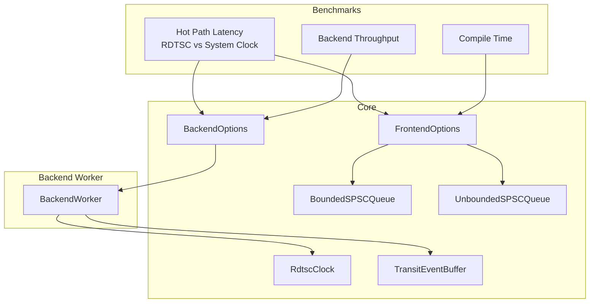
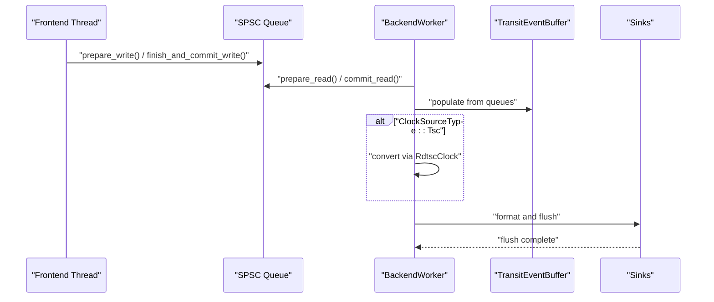
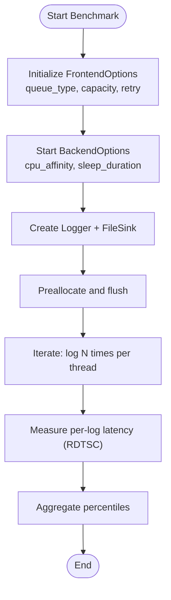
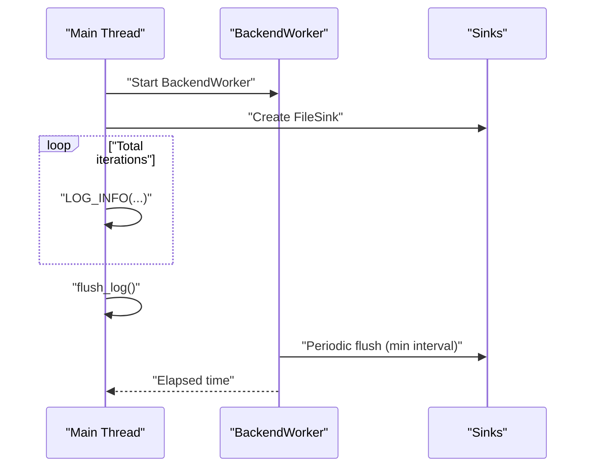
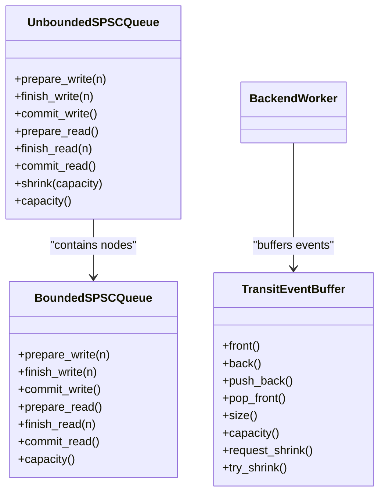
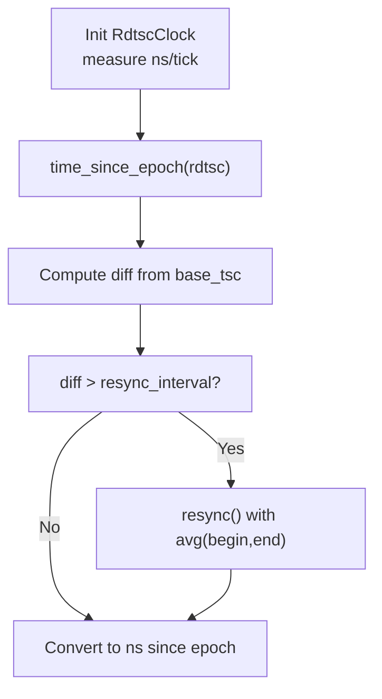
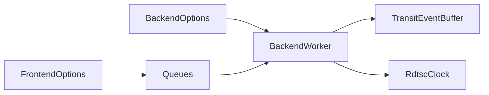

# Performance Issues

<cite>
**Referenced Files in This Document**
- [quill_hot_path_rdtsc_clock.cpp](file://benchmarks/hot_path_latency/quill_hot_path_rdtsc_clock.cpp)
- [quill_hot_path_system_clock.cpp](file://benchmarks/hot_path_latency/quill_hot_path_system_clock.cpp)
- [quill_backend_throughput.cpp](file://benchmarks/backend_throughput/quill_backend_throughput.cpp)
- [compile_time_bench.cpp](file://benchmarks/compile_time/compile_time_bench.cpp)
- [hot_path_bench.h](file://benchmarks/hot_path_latency/hot_path_bench.h)
- [RdtscClock.h](file://include/quill/backend/RdtscClock.h)
- [BackendOptions.h](file://include/quill/backend/BackendOptions.h)
- [FrontendOptions.h](file://include/quill/core/FrontendOptions.h)
- [BoundedSPSCQueue.h](file://include/quill/core/BoundedSPSCQueue.h)
- [UnboundedSPSCQueue.h](file://include/quill/core/UnboundedSPSCQueue.h)
- [BackendWorker.h](file://include/quill/backend/BackendWorker.h)
- [TransitEventBuffer.h](file://include/quill/backend/TransitEventBuffer.h)
- [CMakeLists.txt](file://CMakeLists.txt)
- [CMakeLists.txt](file://benchmarks/compile_time/CMakeLists.txt)
- [CMakeLists.txt](file://examples/recommended_usage/quill_static_lib/CMakeLists.txt)
</cite>

## Table of Contents
1. [Introduction](#introduction)
2. [Project Structure](#project-structure)
3. [Core Components](#core-components)
4. [Architecture Overview](#architecture-overview)
5. [Detailed Component Analysis](#detailed-component-analysis)
6. [Dependency Analysis](#dependency-analysis)
7. [Performance Considerations](#performance-considerations)
8. [Troubleshooting Guide](#troubleshooting-guide)
9. [Conclusion](#conclusion)
10. [Appendices](#appendices)

## Introduction
This document focuses on diagnosing and resolving performance issues in Quill with a strong emphasis on:
- Latency: hot path optimization, TSC clock configuration, and microsecond-level timing considerations
- Throughput: queue configuration, backend thread utilization, and CPU consumption analysis
- Memory: queue expansion behavior, unbounded queue limits, and memory allocation patterns
- Compile-time performance: build optimization strategies, header inclusion patterns, and static library usage
- Diagnostics: benchmark tools, profiling techniques, and performance measurement methodologies

## Project Structure
Quill’s performance-relevant areas are organized into:
- Benchmarks: latency, throughput, and compile-time performance suites
- Core headers: lock-free queues, frontend/backend options, and TSC clock
- Backend worker: central processing loop, transit event buffering, and sink flushing
- Build system: CMake options affecting performance and diagnostics

**Diagram sources**
- [quill_hot_path_rdtsc_clock.cpp:1-95](file://benchmarks/hot_path_latency/quill_hot_path_rdtsc_clock.cpp#L1-L95)
- [quill_hot_path_system_clock.cpp:1-98](file://benchmarks/hot_path_latency/quill_hot_path_system_clock.cpp#L1-L98)
- [quill_backend_throughput.cpp:1-69](file://benchmarks/backend_throughput/quill_backend_throughput.cpp#L1-L69)
- [compile_time_bench.cpp:1-800](file://benchmarks/compile_time/compile_time_bench.cpp#L1-L800)
- [FrontendOptions.h:1-52](file://include/quill/core/FrontendOptions.h#L1-L52)
- [BackendOptions.h:1-283](file://include/quill/backend/BackendOptions.h#L1-L283)
- [BoundedSPSCQueue.h:1-356](file://include/quill/core/BoundedSPSCQueue.h#L1-L356)
- [UnboundedSPSCQueue.h:1-345](file://include/quill/core/UnboundedSPSCQueue.h#L1-L345)
- [RdtscClock.h:1-265](file://include/quill/backend/RdtscClock.h#L1-L265)
- [TransitEventBuffer.h:1-162](file://include/quill/backend/TransitEventBuffer.h#L1-L162)
- [BackendWorker.h:1-800](file://include/quill/backend/BackendWorker.h#L1-L800)

**Section sources**
- [quill_hot_path_rdtsc_clock.cpp:1-95](file://benchmarks/hot_path_latency/quill_hot_path_rdtsc_clock.cpp#L1-L95)
- [quill_hot_path_system_clock.cpp:1-98](file://benchmarks/hot_path_latency/quill_hot_path_system_clock.cpp#L1-L98)
- [quill_backend_throughput.cpp:1-69](file://benchmarks/backend_throughput/quill_backend_throughput.cpp#L1-L69)
- [compile_time_bench.cpp:1-800](file://benchmarks/compile_time/compile_time_bench.cpp#L1-L800)
- [FrontendOptions.h:1-52](file://include/quill/core/FrontendOptions.h#L1-L52)
- [BackendOptions.h:1-283](file://include/quill/backend/BackendOptions.h#L1-L283)
- [BoundedSPSCQueue.h:1-356](file://include/quill/core/BoundedSPSCQueue.h#L1-L356)
- [UnboundedSPSCQueue.h:1-345](file://include/quill/core/UnboundedSPSCQueue.h#L1-L345)
- [RdtscClock.h:1-265](file://include/quill/backend/RdtscClock.h#L1-L265)
- [TransitEventBuffer.h:1-162](file://include/quill/backend/TransitEventBuffer.h#L1-L162)
- [BackendWorker.h:1-800](file://include/quill/backend/BackendWorker.h#L1-L800)

## Core Components
- FrontendOptions controls queue type, initial capacity, blocking retry interval, and unbounded max capacity. These directly impact hot-path latency and memory footprint.
- BackendOptions governs backend thread behavior, transit event buffer sizing, strict timestamp ordering grace period, and TSC resync intervals.
- BoundedSPSCQueue and UnboundedSPSCQueue implement wait-free SPSC queues with cache-friendly layouts and optional huge pages.
- RdtscClock provides high-resolution timestamp conversion with periodic resynchronization.
- BackendWorker orchestrates polling, deserialization, formatting, and sink flushing with configurable idle behavior and yield policies.

**Section sources**
- [FrontendOptions.h:16-52](file://include/quill/core/FrontendOptions.h#L16-L52)
- [BackendOptions.h:30-283](file://include/quill/backend/BackendOptions.h#L30-L283)
- [BoundedSPSCQueue.h:54-356](file://include/quill/core/BoundedSPSCQueue.h#L54-L356)
- [UnboundedSPSCQueue.h:42-345](file://include/quill/core/UnboundedSPSCQueue.h#L42-L345)
- [RdtscClock.h:36-265](file://include/quill/backend/RdtscClock.h#L36-L265)
- [BackendWorker.h:77-800](file://include/quill/backend/BackendWorker.h#L77-L800)

## Architecture Overview
The hot path minimizes contention by using lock-free queues per frontend thread. The backend worker polls queues, deserializes messages, optionally converts timestamps, formats, and flushes to sinks. Strict timestamp ordering introduces a microsecond-level window to mitigate queue-read races.

**Diagram sources**
- [BackendWorker.h:479-755](file://include/quill/backend/BackendWorker.h#L479-L755)
- [RdtscClock.h:147-193](file://include/quill/backend/RdtscClock.h#L147-L193)
- [TransitEventBuffer.h:19-162](file://include/quill/backend/TransitEventBuffer.h#L19-L162)

**Section sources**
- [BackendWorker.h:305-395](file://include/quill/backend/BackendWorker.h#L305-L395)
- [BackendWorker.h:479-755](file://include/quill/backend/BackendWorker.h#L479-L755)
- [RdtscClock.h:119-193](file://include/quill/backend/RdtscClock.h#L119-L193)
- [TransitEventBuffer.h:22-162](file://include/quill/backend/TransitEventBuffer.h#L22-L162)

## Detailed Component Analysis

### Hot Path Latency: RDTSC vs System Clock
- Benchmarks demonstrate measuring per-log latency using TSC sampling and RDTSC-based timestamps versus system clock timestamps.
- Key configuration includes queue type, initial capacity, blocking retry interval, and backend CPU affinity and sleep duration.
- Microsecond-level grace period in BackendOptions ensures strict ordering without excessive reprocessing.

**Diagram sources**
- [quill_hot_path_rdtsc_clock.cpp:26-92](file://benchmarks/hot_path_latency/quill_hot_path_rdtsc_clock.cpp#L26-L92)
- [quill_hot_path_system_clock.cpp:26-95](file://benchmarks/hot_path_latency/quill_hot_path_system_clock.cpp#L26-L95)
- [hot_path_bench.h:128-202](file://benchmarks/hot_path_latency/hot_path_bench.h#L128-L202)

**Section sources**
- [quill_hot_path_rdtsc_clock.cpp:13-57](file://benchmarks/hot_path_latency/quill_hot_path_rdtsc_clock.cpp#L13-L57)
- [quill_hot_path_system_clock.cpp:13-60](file://benchmarks/hot_path_latency/quill_hot_path_system_clock.cpp#L13-L60)
- [hot_path_bench.h:108-124](file://benchmarks/hot_path_latency/hot_path_bench.h#L108-L124)
- [BackendOptions.h:132-132](file://include/quill/backend/BackendOptions.h#L132-L132)

### Backend Throughput
- Measures total time to process a fixed number of log messages, highlighting backend worker spin-loop behavior and flush intervals.
- CPU affinity and minimal sleep duration reduce scheduling overhead and improve sustained throughput.

**Diagram sources**
- [quill_backend_throughput.cpp:14-68](file://benchmarks/backend_throughput/quill_backend_throughput.cpp#L14-L68)
- [BackendWorker.h:345-387](file://include/quill/backend/BackendWorker.h#L345-L387)

**Section sources**
- [quill_backend_throughput.cpp:19-67](file://benchmarks/backend_throughput/quill_backend_throughput.cpp#L19-L67)
- [BackendOptions.h:224-224](file://include/quill/backend/BackendOptions.h#L224-L224)

### Compile-Time Performance
- The compile-time benchmark exercises heavy template instantiation and formatting to stress build times.
- Recommended usage as a static library reduces dynamic linking overhead and can improve startup and link times.

**Diagram sources**
- [compile_time_bench.cpp:1-10](file://benchmarks/compile_time/compile_time_bench.cpp#L1-L10)
- [CMakeLists.txt:1-18](file://examples/recommended_usage/quill_static_lib/CMakeLists.txt#L1-L18)

**Section sources**
- [compile_time_bench.cpp:1-800](file://benchmarks/compile_time/compile_time_bench.cpp#L1-L800)
- [CMakeLists.txt:1-18](file://examples/recommended_usage/quill_static_lib/CMakeLists.txt#L1-L18)

### Queue Behavior and Memory Allocation
- BoundedSPSCQueue: Fixed-capacity ring buffer with cache-line-aligned storage, prefetching, and clflush optimizations for x86 architectures. Enforces minimum capacity and supports huge pages on Linux.
- UnboundedSPSCQueue: Chain of bounded queues that doubles capacity when full, up to a configured maximum. Prevents unbounded growth beyond limits and throws when exceeding max capacity.
- TransitEventBuffer: Circular buffer for transit events that expands on demand and can shrink when empty.

**Diagram sources**
- [BoundedSPSCQueue.h:54-356](file://include/quill/core/BoundedSPSCQueue.h#L54-L356)
- [UnboundedSPSCQueue.h:42-345](file://include/quill/core/UnboundedSPSCQueue.h#L42-L345)
- [TransitEventBuffer.h:19-162](file://include/quill/backend/TransitEventBuffer.h#L19-L162)
- [BackendWorker.h:479-573](file://include/quill/backend/BackendWorker.h#L479-L573)

**Section sources**
- [BoundedSPSCQueue.h:60-136](file://include/quill/core/BoundedSPSCQueue.h#L60-L136)
- [UnboundedSPSCQueue.h:79-297](file://include/quill/core/UnboundedSPSCQueue.h#L79-L297)
- [TransitEventBuffer.h:22-148](file://include/quill/backend/TransitEventBuffer.h#L22-L148)
- [BackendWorker.h:479-573](file://include/quill/backend/BackendWorker.h#L479-L573)

### TSC Clock Configuration and Resynchronization
- RdtscClock computes nanoseconds-per-tick via steady-clock sampling and maintains a small ring buffer of base offsets for resynchronization.
- BackendWorker enforces that backend sleep duration does not exceed the RDTSC resync interval when TSC clock is used.

**Diagram sources**
- [RdtscClock.h:119-166](file://include/quill/backend/RdtscClock.h#L119-L166)
- [BackendWorker.h:112-123](file://include/quill/backend/BackendWorker.h#L112-L123)

**Section sources**
- [RdtscClock.h:58-144](file://include/quill/backend/RdtscClock.h#L58-L144)
- [BackendWorker.h:112-123](file://include/quill/backend/BackendWorker.h#L112-L123)

## Dependency Analysis
- FrontendOptions drives queue selection and sizing; BackendOptions controls backend behavior and strict ordering.
- BackendWorker depends on queues, RdtscClock, and TransitEventBuffer; it coordinates sink flushing and idle behavior.
- Benchmarks depend on FrontendOptions and BackendOptions to simulate realistic workloads.

**Diagram sources**
- [FrontendOptions.h:16-52](file://include/quill/core/FrontendOptions.h#L16-L52)
- [BackendOptions.h:30-283](file://include/quill/backend/BackendOptions.h#L30-L283)
- [BackendWorker.h:77-800](file://include/quill/backend/BackendWorker.h#L77-L800)
- [RdtscClock.h:36-265](file://include/quill/backend/RdtscClock.h#L36-L265)
- [TransitEventBuffer.h:19-162](file://include/quill/backend/TransitEventBuffer.h#L19-L162)

**Section sources**
- [FrontendOptions.h:16-52](file://include/quill/core/FrontendOptions.h#L16-L52)
- [BackendOptions.h:30-283](file://include/quill/backend/BackendOptions.h#L30-L283)
- [BackendWorker.h:77-800](file://include/quill/backend/BackendWorker.h#L77-L800)

## Performance Considerations

### Latency Optimization
- Use UnboundedBlocking or BoundedBlocking queues with appropriate initial capacity to minimize blocking retries.
- Configure blocking_queue_retry_interval_ns to balance latency and CPU usage.
- Pin backend thread to a dedicated CPU via BackendOptions.cpu_affinity and minimize sleep_duration for low-latency scenarios.
- Enable strict timestamp ordering only when necessary; tune log_timestamp_ordering_grace_period to microseconds granularity.

**Section sources**
- [FrontendOptions.h:27-38](file://include/quill/core/FrontendOptions.h#L27-L38)
- [BackendOptions.h:49-132](file://include/quill/backend/BackendOptions.h#L49-L132)
- [quill_hot_path_rdtsc_clock.cpp:32-40](file://benchmarks/hot_path_latency/quill_hot_path_rdtsc_clock.cpp#L32-L40)

### Throughput Bottlenecks
- Increase transit_events_hard_limit and transit_events_soft_limit to reduce stalls when queues fill rapidly.
- Reduce sink_min_flush_interval to ensure timely flushing; be mindful of I/O contention.
- Prefer UnboundedBlocking with generous unbounded_queue_max_capacity to avoid drops under bursty loads.
- Use huge pages on Linux (HugePagesPolicy) to reduce TLB pressure for large queues.

**Section sources**
- [BackendOptions.h:75-92](file://include/quill/backend/BackendOptions.h#L75-L92)
- [BackendOptions.h:224-224](file://include/quill/backend/BackendOptions.h#L224-L224)
- [FrontendOptions.h:44-44](file://include/quill/core/FrontendOptions.h#L44-L44)
- [BoundedSPSCQueue.h:60-68](file://include/quill/core/BoundedSPSCQueue.h#L60-L68)

### Memory Usage Concerns
- UnboundedSPSCQueue doubles capacity on overflow; set unbounded_queue_max_capacity to cap memory growth.
- TransitEventBuffer expands on demand; empty buffers can shrink back to initial capacity.
- BoundedSPSCQueue uses cache-line aligned storage and optional huge pages; ensure platform support.

**Section sources**
- [UnboundedSPSCQueue.h:244-297](file://include/quill/core/UnboundedSPSCQueue.h#L244-L297)
- [TransitEventBuffer.h:128-148](file://include/quill/backend/TransitEventBuffer.h#L128-L148)
- [BoundedSPSCQueue.h:60-94](file://include/quill/core/BoundedSPSCQueue.h#L60-L94)

### Compile-Time Performance
- Prefer building Quill as a static library for reduced dynamic linking overhead.
- Limit header inclusion depth in client code; rely on precompiled headers where applicable.
- Use CMake options to disable unnecessary features (e.g., thread names, function/file info) to reduce template bloat.

**Section sources**
- [CMakeLists.txt:14-24](file://CMakeLists.txt#L14-L24)
- [CMakeLists.txt:1-18](file://examples/recommended_usage/quill_static_lib/CMakeLists.txt#L1-L18)

## Troubleshooting Guide

### Diagnosing Latency Issues
- Compare RDTSC-based latency vs system clock latency using the hot path benchmarks.
- Adjust FrontendOptions.initial_queue_capacity and blocking_queue_retry_interval_ns to reduce blocking.
- Tune BackendOptions.cpu_affinity and sleep_duration to reduce scheduler-induced jitter.

**Section sources**
- [quill_hot_path_rdtsc_clock.cpp:13-57](file://benchmarks/hot_path_latency/quill_hot_path_rdtsc_clock.cpp#L13-L57)
- [quill_hot_path_system_clock.cpp:13-60](file://benchmarks/hot_path_latency/quill_hot_path_system_clock.cpp#L13-L60)
- [hot_path_bench.h:128-202](file://benchmarks/hot_path_latency/hot_path_bench.h#L128-L202)

### Diagnosing Throughput Issues
- Monitor backend worker idle behavior; increase transit_events_hard_limit and soft_limit to reduce stalls.
- Reduce sink_min_flush_interval to prevent long-lived flush cycles.
- Verify queue type and capacity; use UnboundedBlocking with sufficient unbounded_queue_max_capacity.

**Section sources**
- [quill_backend_throughput.cpp:19-67](file://benchmarks/backend_throughput/quill_backend_throughput.cpp#L19-L67)
- [BackendOptions.h:75-92](file://include/quill/backend/BackendOptions.h#L75-L92)
- [FrontendOptions.h:27-44](file://include/quill/core/FrontendOptions.h#L27-L44)

### Memory and Queue Expansion
- If encountering frequent reallocations, raise unbounded_queue_max_capacity or switch to BoundedBlocking with adequate capacity.
- Empty TransitEventBuffer can shrink; ensure buffers are drained to benefit from shrinking.

**Section sources**
- [UnboundedSPSCQueue.h:244-297](file://include/quill/core/UnboundedSPSCQueue.h#L244-L297)
- [TransitEventBuffer.h:109-125](file://include/quill/backend/TransitEventBuffer.h#L109-L125)

### TSC Clock Drift and Resync
- Ensure backend sleep duration does not exceed rdtsc_resync_interval to maintain correctness.
- Periodic resync mitigates drift; monitor backend error notifications for resync failures.

**Section sources**
- [BackendWorker.h:112-123](file://include/quill/backend/BackendWorker.h#L112-L123)
- [RdtscClock.h:196-230](file://include/quill/backend/RdtscClock.h#L196-L230)

### Profiling and Measurement Methodologies
- Use the provided benchmarks as baselines for regression testing.
- Employ CPU counters and cycle-based measurements for hot path analysis.
- For compile-time profiling, leverage CMake build options and static library usage to isolate overhead.

**Section sources**
- [hot_path_bench.h:108-124](file://benchmarks/hot_path_latency/hot_path_bench.h#L108-L124)
- [compile_time_bench.cpp:1-10](file://benchmarks/compile_time/compile_time_bench.cpp#L1-L10)
- [CMakeLists.txt:14-24](file://CMakeLists.txt#L14-L24)

## Conclusion
Optimizing Quill’s performance hinges on tuning queue configuration, backend thread behavior, and timestamp handling. Use the provided benchmarks to quantify improvements, adjust FrontendOptions and BackendOptions accordingly, and apply targeted build optimizations. Carefully manage queue expansion and memory growth, and leverage TSC resynchronization to maintain accurate timestamps without sacrificing throughput.

## Appendices

### Configuration Recommendations
- Latency-sensitive paths:
  - Queue: UnboundedBlocking with large initial capacity and retry interval tuned empirically
  - Backend: cpu_affinity pinned, sleep_duration minimal, strict timestamp ordering disabled or minimal grace period
- Throughput-heavy paths:
  - Queue: UnboundedBlocking with high unbounded_queue_max_capacity
  - Backend: increased transit_events_hard_limit/soft_limit, moderate sink_min_flush_interval
- Memory-conscious paths:
  - Queue: BoundedBlocking with conservative capacity or UnboundedBlocking with lower max capacity
  - Backend: enable TransitEventBuffer shrinking when idle

**Section sources**
- [FrontendOptions.h:27-44](file://include/quill/core/FrontendOptions.h#L27-L44)
- [BackendOptions.h:49-92](file://include/quill/backend/BackendOptions.h#L49-L92)
- [BackendOptions.h:224-224](file://include/quill/backend/BackendOptions.h#L224-L224)
- [TransitEventBuffer.h:109-125](file://include/quill/backend/TransitEventBuffer.h#L109-L125)