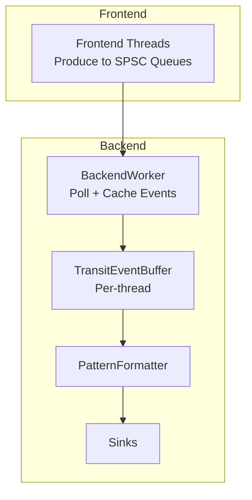
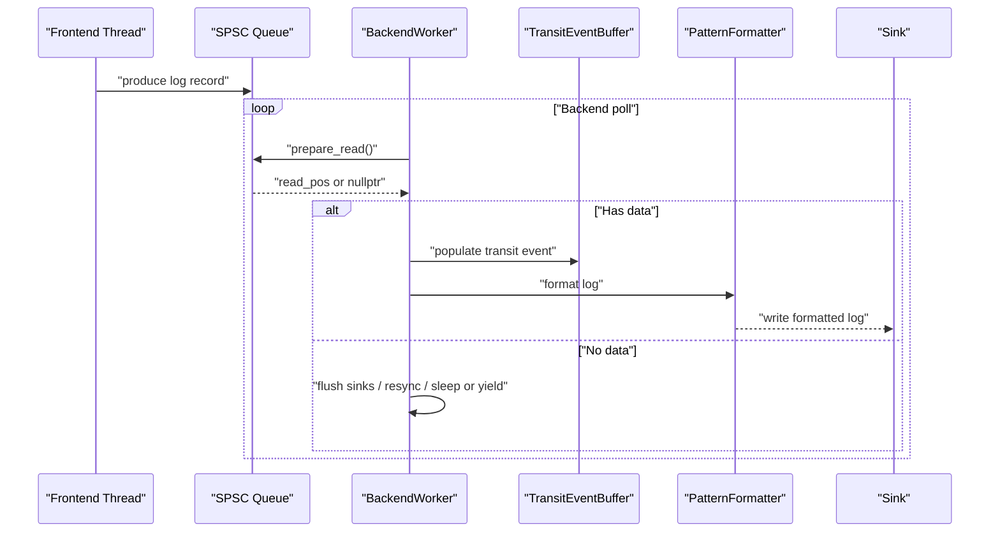
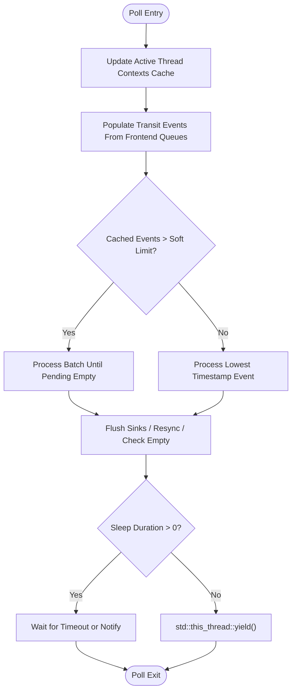
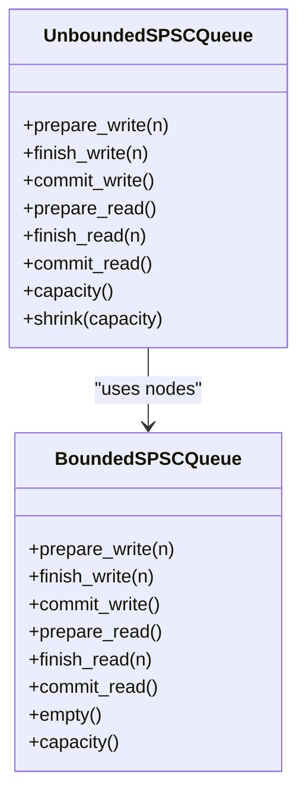
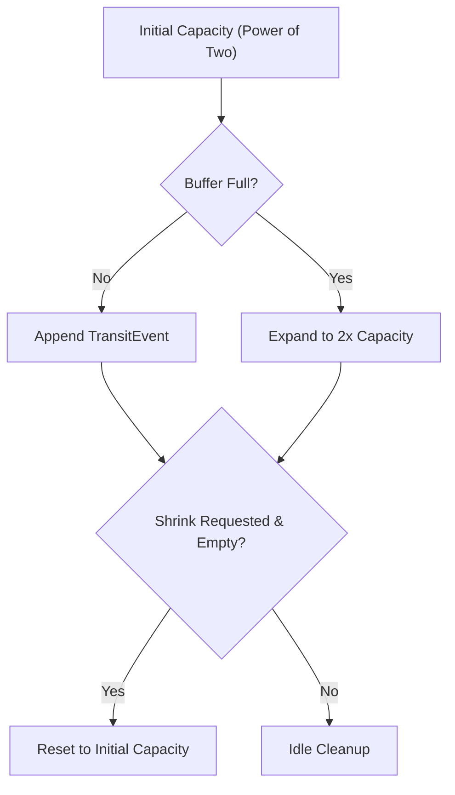
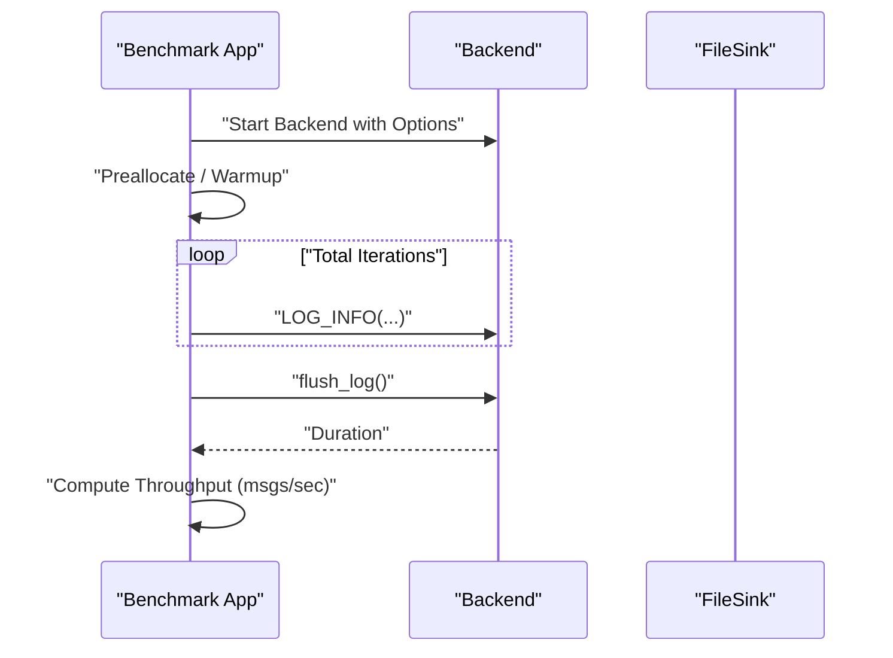
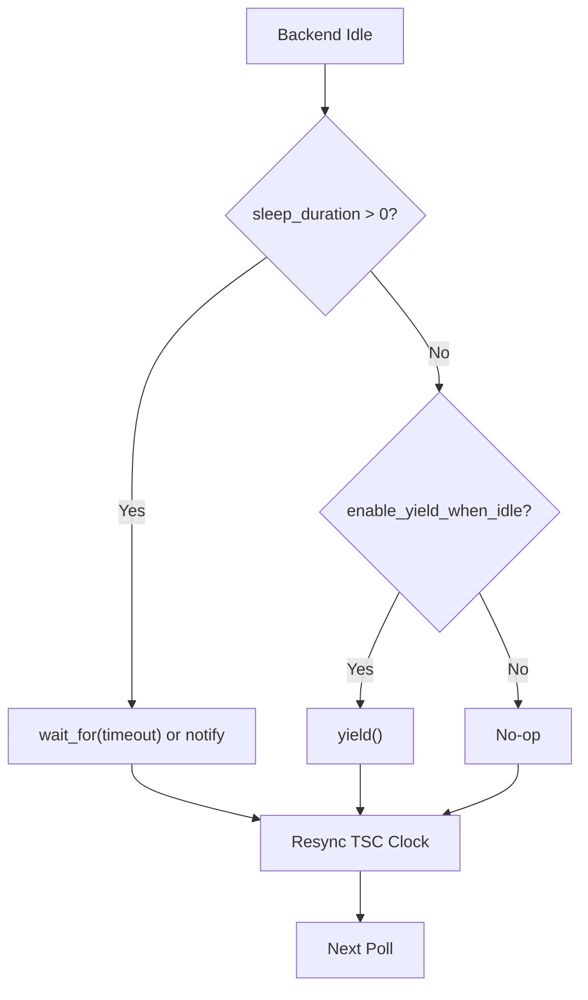
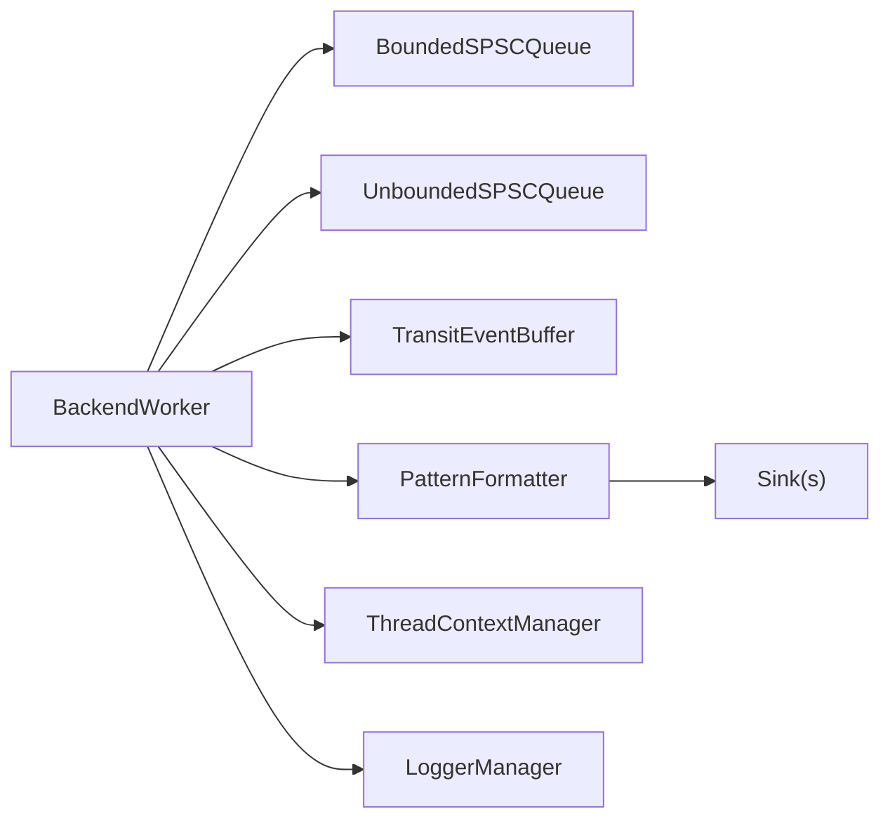

# Throughput Tuning

<cite>
**Referenced Files in This Document**
- [BackendWorker.h](file://include/quill/backend/BackendWorker.h)
- [BackendOptions.h](file://include/quill/backend/BackendOptions.h)
- [BoundedSPSCQueue.h](file://include/quill/core/BoundedSPSCQueue.h)
- [UnboundedSPSCQueue.h](file://include/quill/core/UnboundedSPSCQueue.h)
- [TransitEventBuffer.h](file://include/quill/backend/TransitEventBuffer.h)
- [MathUtilities.h](file://include/quill/core/MathUtilities.h)
- [ThreadUtilities.h](file://include/quill/backend/ThreadUtilities.h)
- [BackendUtilities.h](file://include/quill/backend/BackendUtilities.h)
- [quill_backend_throughput.cpp](file://benchmarks/backend_throughput/quill_backend_throughput.cpp)
- [quill_backend_throughput_no_buffering.cpp](file://benchmarks/backend_throughput/quill_backend_throughput_no_buffering.cpp)
- [hot_path_bench.h](file://benchmarks/hot_path_latency/hot_path_bench.h)
- [bounded_dropping_queue_frontend.cpp](file://examples/bounded_dropping_queue_frontend.cpp)
</cite>

## Table of Contents
1. [Introduction](#introduction)
2. [Project Structure](#project-structure)
3. [Core Components](#core-components)
4. [Architecture Overview](#architecture-overview)
5. [Detailed Component Analysis](#detailed-component-analysis)
6. [Dependency Analysis](#dependency-analysis)
7. [Performance Considerations](#performance-considerations)
8. [Troubleshooting Guide](#troubleshooting-guide)
9. [Conclusion](#conclusion)
10. [Appendices](#appendices)

## Introduction
This document focuses on throughput optimization in Quill, covering backend worker performance characteristics, queue capacity configuration, and buffer management strategies. It explains how to measure throughput using the provided benchmarks, tune queue sizing algorithms, and analyze CPU utilization. Practical examples illustrate high-throughput logging scenarios, bottleneck identification, and scaling strategies. Memory bandwidth and cache efficiency are addressed alongside concurrent logging patterns that influence overall throughput.

## Project Structure
Quill’s throughput pipeline involves:
- Frontend threads producing log records into per-thread SPSC queues (bounded or unbounded).
- A backend worker thread consuming from all frontend queues, buffering events, and writing to sinks.
- Transit event buffers and formatting/pattern formatters applied before sink writes.
- Benchmarks measuring end-to-end throughput and hot-path latency.

**Diagram sources**
- [BackendWorker.h:305-395](file://include/quill/backend/BackendWorker.h#L305-L395)
- [TransitEventBuffer.h:19-100](file://include/quill/backend/TransitEventBuffer.h#L19-L100)

**Section sources**
- [BackendWorker.h:138-207](file://include/quill/backend/BackendWorker.h#L138-L207)
- [BackendOptions.h:30-92](file://include/quill/backend/BackendOptions.h#L30-L92)

## Core Components
- Backend worker loop and polling behavior, including sleep/yield strategies and idle cleanup.
- Queue types: bounded (blocking/dropping) and unbounded (dynamic growth with node chaining).
- Transit event buffering and batch processing thresholds.
- Formatting and sink flushing policies.

Key throughput-relevant options:
- transit_events_soft_limit and transit_events_hard_limit
- sleep_duration and enable_yield_when_idle
- log_timestamp_ordering_grace_period
- sink_min_flush_interval
- cpu_affinity

**Section sources**
- [BackendWorker.h:305-395](file://include/quill/backend/BackendWorker.h#L305-L395)
- [BackendOptions.h:30-224](file://include/quill/backend/BackendOptions.h#L30-L224)

## Architecture Overview
The backend worker performs a tight loop:
- Update active thread contexts cache.
- Populate transit events from all frontend queues (bounded or unbounded).
- If cached events exceed soft limit, process a batch; otherwise process the single earliest event.
- On idle, flush sinks, resync TSC clock, and optionally sleep or yield.

**Diagram sources**
- [BackendWorker.h:479-573](file://include/quill/backend/BackendWorker.h#L479-L573)
- [BackendWorker.h:795-864](file://include/quill/backend/BackendWorker.h#L795-L864)
- [TransitEventBuffer.h:72-100](file://include/quill/backend/TransitEventBuffer.h#L72-L100)

## Detailed Component Analysis

### Backend Worker Polling and Event Processing
- Poll loop reads from all active thread contexts, deserializing log records into transit events.
- Timestamp ordering grace period ensures out-of-order timestamps from fast producers do not cause reordering anomalies.
- Batch processing triggers when cached events exceed soft limit; otherwise single-event processing prioritizes fairness across hot threads.

**Diagram sources**
- [BackendWorker.h:305-395](file://include/quill/backend/BackendWorker.h#L305-L395)
- [BackendWorker.h:479-506](file://include/quill/backend/BackendWorker.h#L479-L506)

**Section sources**
- [BackendWorker.h:305-395](file://include/quill/backend/BackendWorker.h#L305-L395)
- [BackendWorker.h:479-506](file://include/quill/backend/BackendWorker.h#L479-L506)

### Queue Types: Bounded vs Unbounded
- BoundedSPSCQueue: Fixed-capacity ring buffer with aligned storage and cache-line flush/prefetch hints. Supports huge pages on Linux. Reader batching reduces atomic updates.
- UnboundedSPSCQueue: Chain of bounded nodes; grows dynamically up to a configurable maximum. Supports shrinking to reduce memory footprint.

**Diagram sources**
- [BoundedSPSCQueue.h:54-194](file://include/quill/core/BoundedSPSCQueue.h#L54-L194)
- [UnboundedSPSCQueue.h:42-337](file://include/quill/core/UnboundedSPSCQueue.h#L42-L337)

**Section sources**
- [BoundedSPSCQueue.h:54-194](file://include/quill/core/BoundedSPSCQueue.h#L54-L194)
- [UnboundedSPSCQueue.h:42-183](file://include/quill/core/UnboundedSPSCQueue.h#L42-L183)

### Transit Event Buffer Management
- Per-thread circular buffer with power-of-two capacity growth.
- Expand on full; shrink on demand when empty and requested (e.g., after unbounded queue shrink).
- Maintains writer/reader positions and mask for O(1) indexing.

**Diagram sources**
- [TransitEventBuffer.h:19-100](file://include/quill/backend/TransitEventBuffer.h#L19-L100)
- [TransitEventBuffer.h:128-148](file://include/quill/backend/TransitEventBuffer.h#L128-L148)

**Section sources**
- [TransitEventBuffer.h:19-100](file://include/quill/backend/TransitEventBuffer.h#L19-L100)
- [BackendWorker.h:1196-1230](file://include/quill/backend/BackendWorker.h#L1196-L1230)

### Throughput Measurement and Benchmarking
- Backend throughput benchmarks measure total time for a fixed number of log messages and compute millions of messages per second.
- No-buffering variant sets extremely low transit event limits to stress backend processing and sink writes.

**Diagram sources**
- [quill_backend_throughput.cpp:14-68](file://benchmarks/backend_throughput/quill_backend_throughput.cpp#L14-L68)
- [quill_backend_throughput_no_buffering.cpp:14-71](file://benchmarks/backend_throughput/quill_backend_throughput_no_buffering.cpp#L14-L71)

**Section sources**
- [quill_backend_throughput.cpp:14-68](file://benchmarks/backend_throughput/quill_backend_throughput.cpp#L14-L68)
- [quill_backend_throughput_no_buffering.cpp:14-71](file://benchmarks/backend_throughput/quill_backend_throughput_no_buffering.cpp#L14-L71)

### CPU Utilization and Thread Scheduling
- Backend thread CPU affinity can be pinned to a dedicated core to reduce migration overhead.
- Idle behavior controlled by sleep_duration and enable_yield_when_idle to balance responsiveness and CPU usage.

**Diagram sources**
- [BackendWorker.h:370-386](file://include/quill/backend/BackendWorker.h#L370-L386)
- [BackendUtilities.h:55-116](file://include/quill/backend/BackendUtilities.h#L55-L116)

**Section sources**
- [BackendUtilities.h:55-116](file://include/quill/backend/BackendUtilities.h#L55-L116)
- [BackendOptions.h:38-49](file://include/quill/backend/BackendOptions.h#L38-L49)

## Dependency Analysis
- BackendWorker depends on:
  - BoundedSPSCQueue or UnboundedSPSCQueue for frontend queue access.
  - TransitEventBuffer for local caching.
  - PatternFormatter and sinks for final output.
  - ThreadContextManager and LoggerManager for dynamic discovery and cleanup.
- Power-of-two constraints ensure efficient bitmask indexing and cache-friendly layouts.

**Diagram sources**
- [BackendWorker.h:479-506](file://include/quill/backend/BackendWorker.h#L479-L506)
- [TransitEventBuffer.h:19-100](file://include/quill/backend/TransitEventBuffer.h#L19-L100)
- [MathUtilities.h:25-28](file://include/quill/core/MathUtilities.h#L25-L28)

**Section sources**
- [BackendWorker.h:479-506](file://include/quill/backend/BackendWorker.h#L479-L506)
- [MathUtilities.h:25-28](file://include/quill/core/MathUtilities.h#L25-L28)

## Performance Considerations
- Queue sizing algorithms:
  - Unbounded queue doubles capacity until reaching max capacity; supports shrink to reduce memory.
  - Bounded queue uses power-of-two capacity with cache-line-aligned storage and prefetch hints.
- Buffer management:
  - TransitEventBuffer expands on full; shrink requested when unbounded queue shrinks and buffer is empty.
  - Reader batching reduces atomic commit frequency.
- Throughput knobs:
  - transit_events_soft_limit and transit_events_hard_limit control batching and backpressure.
  - log_timestamp_ordering_grace_period trades off strict ordering for reduced stalls.
  - sink_min_flush_interval balances I/O pressure and latency.
- CPU scheduling:
  - Pin backend thread to a non-critical CPU; consider yield when idle to reduce OS scheduling overhead.

[No sources needed since this section provides general guidance]

## Troubleshooting Guide
- Dropped messages:
  - Detected via failure counters when bounded queues drop messages; backend logs via error_notifier.
- Blocking occurrences:
  - Bounded blocking queues increment failure counter; backend logs blocking counts.
- Out-of-order timestamps:
  - Enable grace period to avoid reordering due to producer delays.
- Excessive allocations:
  - Unbounded queue reallocations reported via error_notifier; consider increasing unbounded_queue_max_capacity or switching to bounded.

**Section sources**
- [BackendWorker.h:1074-1105](file://include/quill/backend/BackendWorker.h#L1074-L1105)
- [BackendWorker.h:1196-1230](file://include/quill/backend/BackendWorker.h#L1196-L1230)
- [BackendOptions.h:132-132](file://include/quill/backend/BackendOptions.h#L132-L132)

## Conclusion
Throughput in Quill is governed by the backend worker’s polling strategy, queue capacity and memory layout, and buffer management. Properly tuning transit event limits, CPU affinity, and flush intervals yields significant gains. Benchmarks provide a repeatable way to measure improvements, while queue behavior and buffer dynamics reveal bottlenecks. Adopting bounded or unbounded queues based on workload characteristics, combined with careful sink flushing and cache-aware queue design, delivers high-throughput logging at scale.

[No sources needed since this section summarizes without analyzing specific files]

## Appendices

### Practical Examples and Scaling Strategies
- High-throughput logging:
  - Use unbounded queue with large initial capacity and cap max capacity to control memory.
  - Increase transit_events_hard_limit to reduce stalls under bursty loads.
  - Pin backend thread to a dedicated CPU and disable sleep to minimize latency.
- Bottleneck identification:
  - Compare throughput with and without buffering (see no-buffering benchmark).
  - Monitor dropped/blocking counters; adjust queue type or sizes accordingly.
- Scaling strategies:
  - Add more sinks cautiously; tune sink_min_flush_interval to avoid I/O saturation.
  - Prefer bounded queues for predictable memory usage; use unbounded queues for burst tolerance with upper limits.

**Section sources**
- [quill_backend_throughput.cpp:19-25](file://benchmarks/backend_throughput/quill_backend_throughput.cpp#L19-L25)
- [quill_backend_throughput_no_buffering.cpp:19-26](file://benchmarks/backend_throughput/quill_backend_throughput_no_buffering.cpp#L19-L26)
- [bounded_dropping_queue_frontend.cpp:21-32](file://examples/bounded_dropping_queue_frontend.cpp#L21-L32)

### CPU Affinity and Hot Path Latency Measurement
- CPU affinity helpers set backend thread affinity for stable performance.
- Hot path latency benchmark measures per-iteration latency using hardware timestamps.

**Section sources**
- [BackendUtilities.h:55-116](file://include/quill/backend/BackendUtilities.h#L55-L116)
- [hot_path_bench.h:92-128](file://benchmarks/hot_path_latency/hot_path_bench.h#L92-L128)