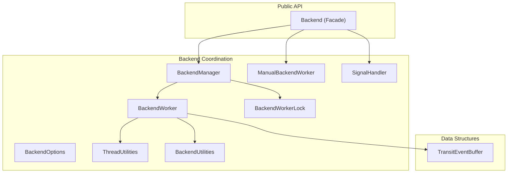
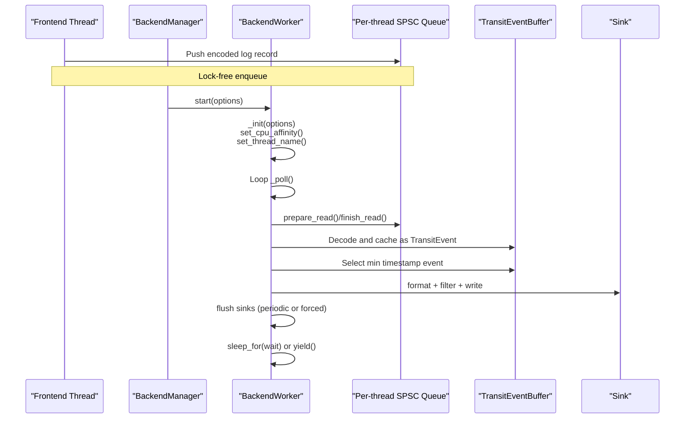
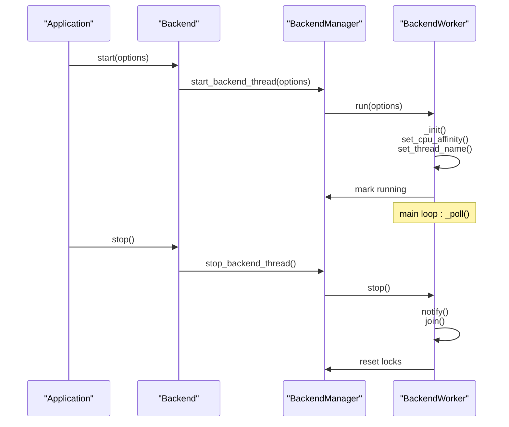
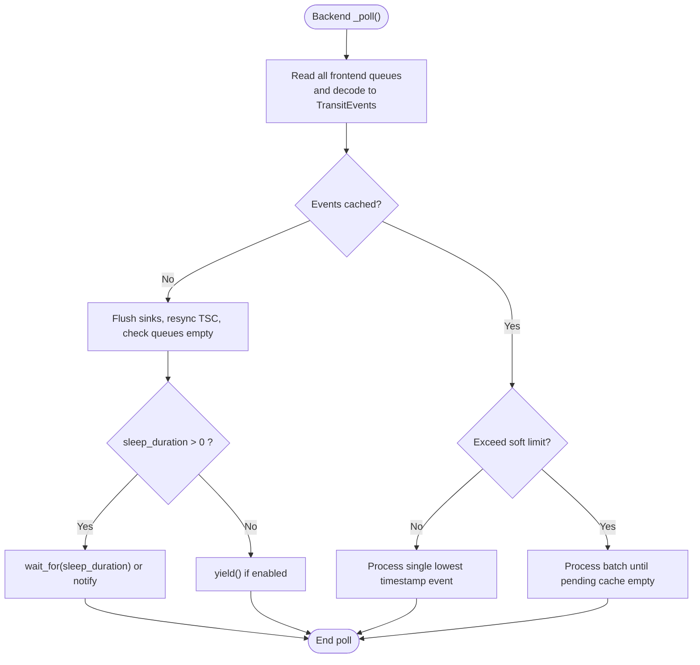
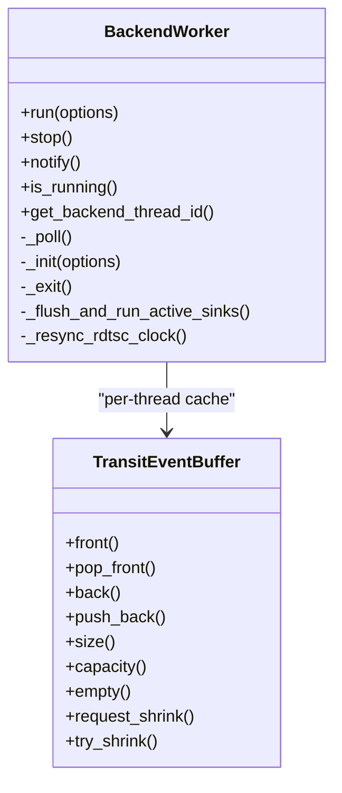
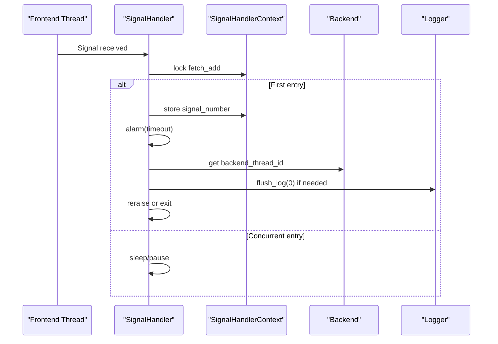
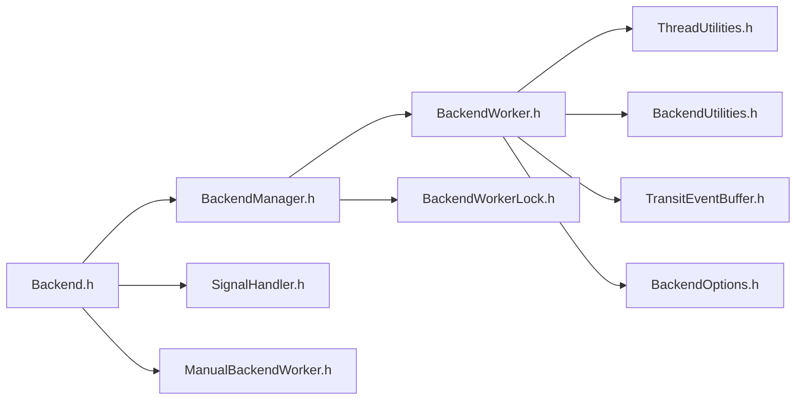

# Backend Thread Coordination

<cite>
**Referenced Files in This Document**
- [Backend.h](file://include/quill/Backend.h)
- [BackendManager.h](file://include/quill/backend/BackendManager.h)
- [BackendWorker.h](file://include/quill/backend/BackendWorker.h)
- [BackendOptions.h](file://include/quill/backend/BackendOptions.h)
- [ThreadUtilities.h](file://include/quill/backend/ThreadUtilities.h)
- [BackendUtilities.h](file://include/quill/backend/BackendUtilities.h)
- [BackendWorkerLock.h](file://include/quill/backend/BackendWorkerLock.h)
- [TransitEventBuffer.h](file://include/quill/backend/TransitEventBuffer.h)
- [SignalHandler.h](file://include/quill/backend/SignalHandler.h)
- [ManualBackendWorker.h](file://include/quill/backend/ManualBackendWorker.h)
- [backend_thread_notify.cpp](file://examples/backend_thread_notify.cpp)
- [signal_handler.cpp](file://examples/signal_handler.cpp)
</cite>

## Table of Contents
1. [Introduction](#introduction)
2. [Project Structure](#project-structure)
3. [Core Components](#core-components)
4. [Architecture Overview](#architecture-overview)
5. [Detailed Component Analysis](#detailed-component-analysis)
6. [Dependency Analysis](#dependency-analysis)
7. [Performance Considerations](#performance-considerations)
8. [Troubleshooting Guide](#troubleshooting-guide)
9. [Conclusion](#conclusion)
10. [Appendices](#appendices)

## Introduction
This document explains the backend thread coordination mechanisms in Quill. It focuses on the dedicated logging thread, lifecycle management, inter-thread communication, signal handler integration for crash-safe logging, graceful shutdown, synchronization primitives, thread priority and CPU affinity, and performance optimization strategies. Practical configuration examples and monitoring/troubleshooting guidance are included.

## Project Structure
The backend thread lives behind a small public facade and a manager that encapsulates lifecycle and thread-safety concerns. Supporting utilities provide thread naming, CPU affinity, and platform-specific helpers. The signal handler integrates with the backend to ensure logs are flushed on fatal signals.

**Diagram sources**
- [Backend.h:36-171](file://include/quill/Backend.h#L36-L171)
- [BackendManager.h:61-96](file://include/quill/backend/BackendManager.h#L61-L96)
- [BackendWorker.h:138-207](file://include/quill/backend/BackendWorker.h#L138-L207)
- [BackendOptions.h:30-281](file://include/quill/backend/BackendOptions.h#L30-L281)
- [ThreadUtilities.h:148-226](file://include/quill/backend/ThreadUtilities.h#L148-L226)
- [BackendUtilities.h:55-170](file://include/quill/backend/BackendUtilities.h#L55-L170)
- [BackendWorkerLock.h:46-103](file://include/quill/backend/BackendWorkerLock.h#L46-L103)
- [TransitEventBuffer.h:19-157](file://include/quill/backend/TransitEventBuffer.h#L19-L157)
- [SignalHandler.h:90-138](file://include/quill/backend/SignalHandler.h#L90-L138)
- [ManualBackendWorker.h:19-118](file://include/quill/backend/ManualBackendWorker.h#L19-L118)

**Section sources**
- [Backend.h:36-171](file://include/quill/Backend.h#L36-L171)
- [BackendManager.h:61-96](file://include/quill/backend/BackendManager.h#L61-L96)
- [BackendWorker.h:138-207](file://include/quill/backend/BackendWorker.h#L138-L207)
- [BackendOptions.h:30-281](file://include/quill/backend/BackendOptions.h#L30-L281)
- [ThreadUtilities.h:148-226](file://include/quill/backend/ThreadUtilities.h#L148-L226)
- [BackendUtilities.h:55-170](file://include/quill/backend/BackendUtilities.h#L55-L170)
- [BackendWorkerLock.h:46-103](file://include/quill/backend/BackendWorkerLock.h#L46-L103)
- [TransitEventBuffer.h:19-157](file://include/quill/backend/TransitEventBuffer.h#L19-L157)
- [SignalHandler.h:90-138](file://include/quill/backend/SignalHandler.h#L90-L138)
- [ManualBackendWorker.h:19-118](file://include/quill/backend/ManualBackendWorker.h#L19-L118)

## Core Components
- Backend facade: Public entry points to start/stop the backend, notify, query status, and acquire manual backend worker.
- BackendManager: Singleton coordinator that manages the backend thread lifecycle, one-time initialization, and thread notifications.
- BackendWorker: The dedicated logging thread implementing the main loop, queue polling, event processing, formatting, and sink dispatch.
- BackendOptions: Tunable configuration for thread name, sleep/idle behavior, transit buffer limits, TSC resync, flush intervals, and hooks.
- ThreadUtilities and BackendUtilities: Cross-platform helpers for thread naming, CPU affinity, and process/thread IDs.
- BackendWorkerLock: Singleton enforcement to prevent duplicate backend workers in the same process.
- TransitEventBuffer: Per-thread circular buffer for cached log events before sink emission.
- SignalHandler: Crash-safe logging on fatal signals and graceful shutdown signaling.
- ManualBackendWorker: Optional manual control mode for running the backend on a user thread.

**Section sources**
- [Backend.h:36-171](file://include/quill/Backend.h#L36-L171)
- [BackendManager.h:61-96](file://include/quill/backend/BackendManager.h#L61-L96)
- [BackendWorker.h:138-207](file://include/quill/backend/BackendWorker.h#L138-L207)
- [BackendOptions.h:30-281](file://include/quill/backend/BackendOptions.h#L30-L281)
- [ThreadUtilities.h:148-226](file://include/quill/backend/ThreadUtilities.h#L148-L226)
- [BackendUtilities.h:55-170](file://include/quill/backend/BackendUtilities.h#L55-L170)
- [BackendWorkerLock.h:46-103](file://include/quill/backend/BackendWorkerLock.h#L46-L103)
- [TransitEventBuffer.h:19-157](file://include/quill/backend/TransitEventBuffer.h#L19-L157)
- [SignalHandler.h:90-138](file://include/quill/backend/SignalHandler.h#L90-L138)
- [ManualBackendWorker.h:19-118](file://include/quill/backend/ManualBackendWorker.h#L19-L118)

## Architecture Overview
The backend thread is a dedicated worker that:
- Initializes options, optional CPU affinity, and thread name.
- Runs a tight loop polling frontend per-thread SPSC queues, caching messages as TransitEvents.
- Maintains a local transit buffer per thread and selects the earliest timestamped event to process.
- Formats and dispatches to sinks, respecting per-sink overrides and filters.
- Flushes sinks at configurable intervals and cleans up invalidated contexts/loggers.
- Sleeps or yields when idle, honoring sleep_duration and enable_yield_when_idle.
- Supports manual operation via ManualBackendWorker.

**Diagram sources**
- [BackendWorker.h:138-207](file://include/quill/backend/BackendWorker.h#L138-L207)
- [BackendWorker.h:305-395](file://include/quill/backend/BackendWorker.h#L305-L395)
- [BackendWorker.h:479-573](file://include/quill/backend/BackendWorker.h#L479-L573)
- [BackendWorker.h:869-952](file://include/quill/backend/BackendWorker.h#L869-L952)
- [BackendWorker.h:1284-1362](file://include/quill/backend/BackendWorker.h#L1284-L1362)
- [BackendUtilities.h:55-116](file://include/quill/backend/BackendUtilities.h#L55-L116)
- [ThreadUtilities.h:119-170](file://include/quill/backend/ThreadUtilities.h#L119-L170)

## Detailed Component Analysis

### Backend Lifecycle and Coordination
- One-time initialization: Backend::start uses a once_flag to ensure the backend is started only once per process and registers atexit to stop gracefully.
- Manager role: BackendManager owns BackendWorker and exposes thread-safe notify/is_running/get_thread_id/convert_rdtsc_to_epoch_time.
- Graceful stop: BackendManager::stop_backend_thread sets a stop flag, notifies, joins the worker, resets locks, and clears the singleton once_flag.

**Diagram sources**
- [Backend.h:36-57](file://include/quill/Backend.h#L36-L57)
- [Backend.h:139-144](file://include/quill/Backend.h#L139-L144)
- [BackendManager.h:61-81](file://include/quill/backend/BackendManager.h#L61-L81)
- [BackendWorker.h:138-207](file://include/quill/backend/BackendWorker.h#L138-L207)
- [BackendWorker.h:212-232](file://include/quill/backend/BackendWorker.h#L212-L232)

**Section sources**
- [Backend.h:36-57](file://include/quill/Backend.h#L36-L57)
- [Backend.h:139-144](file://include/quill/Backend.h#L139-L144)
- [BackendManager.h:61-81](file://include/quill/backend/BackendManager.h#L61-L81)
- [BackendWorker.h:138-207](file://include/quill/backend/BackendWorker.h#L138-L207)
- [BackendWorker.h:212-232](file://include/quill/backend/BackendWorker.h#L212-L232)

### Inter-Thread Communication and Synchronization
- Condition variable and mutex: The backend uses a wake-up mutex/flag and condition variable to sleep and be notified.
- MinGW special-case: Mutex held during notify_one to avoid deadlock.
- Frontend-to-backend queues: Per-thread SPSC queues are lock-free; the backend reads, decodes, and caches into per-thread TransitEventBuffer.
- Flush signaling: TransitEvent carries a flush flag pointer; after processing, the backend stores true to wake the caller.

**Diagram sources**
- [BackendWorker.h:305-395](file://include/quill/backend/BackendWorker.h#L305-L395)
- [BackendWorker.h:238-256](file://include/quill/backend/BackendWorker.h#L238-L256)

**Section sources**
- [BackendWorker.h:238-256](file://include/quill/backend/BackendWorker.h#L238-L256)
- [BackendWorker.h:305-395](file://include/quill/backend/BackendWorker.h#L305-L395)

### Dedicated Logging Thread Implementation
- Thread creation: BackendWorker::run creates a std::thread and initializes options, CPU affinity, and thread name.
- Main loop: _poll() updates thread context cache, reads queues, decodes, formats, and dispatches to sinks.
- Shutdown: _exit() drains queues and cached events, flushes sinks, and cleans up.

**Diagram sources**
- [BackendWorker.h:138-207](file://include/quill/backend/BackendWorker.h#L138-L207)
- [BackendWorker.h:305-395](file://include/quill/backend/BackendWorker.h#L305-L395)
- [TransitEventBuffer.h:19-157](file://include/quill/backend/TransitEventBuffer.h#L19-L157)

**Section sources**
- [BackendWorker.h:138-207](file://include/quill/backend/BackendWorker.h#L138-L207)
- [BackendWorker.h:305-395](file://include/quill/backend/BackendWorker.h#L305-L395)
- [TransitEventBuffer.h:19-157](file://include/quill/backend/TransitEventBuffer.h#L19-L157)

### Signal Handler Integration for Crash-Safe Logging
- Registration: Backend::start with SignalHandlerOptions installs handlers; on POSIX, signals are blocked in main thread and unblocked for spawned threads.
- Context: SignalHandlerContext stores backend thread ID, logger selection, and timeout; ensures only one handler entry.
- Behavior: On fatal signals, logs and flushes; for SIGINT/SIGTERM, exits gracefully; uses alarm on POSIX to enforce termination if handler hangs.
- Windows: Uses exception and console control handlers; logs and flushes before reraise or exit.

**Diagram sources**
- [Backend.h:80-130](file://include/quill/Backend.h#L80-L130)
- [SignalHandler.h:93-138](file://include/quill/backend/SignalHandler.h#L93-L138)
- [SignalHandler.h:154-248](file://include/quill/backend/SignalHandler.h#L154-L248)
- [SignalHandler.h:309-384](file://include/quill/backend/SignalHandler.h#L309-L384)

**Section sources**
- [Backend.h:80-130](file://include/quill/Backend.h#L80-L130)
- [SignalHandler.h:93-138](file://include/quill/backend/SignalHandler.h#L93-L138)
- [SignalHandler.h:154-248](file://include/quill/backend/SignalHandler.h#L154-L248)
- [SignalHandler.h:309-384](file://include/quill/backend/SignalHandler.h#L309-L384)

### Graceful Shutdown Procedures
- Backend::stop clears backend thread ID, stops BackendManager, and deinitializes signal handlers.
- BackendWorker::stop sets running=false, notifies, joins, resets thread ID and lock.
- BackendWorker::_exit drains queues and cached events, flushes sinks, and cleans up.

**Section sources**
- [Backend.h:139-144](file://include/quill/Backend.h#L139-L144)
- [BackendManager.h:74-81](file://include/quill/backend/BackendManager.h#L74-L81)
- [BackendWorker.h:212-232](file://include/quill/backend/BackendWorker.h#L212-L232)
- [BackendWorker.h:443-474](file://include/quill/backend/BackendWorker.h#L443-L474)

### Thread Priority Management and CPU Affinity
- CPU affinity: BackendOptions::cpu_affinity pins the backend thread to a specific CPU; BackendUtilities::set_cpu_affinity applies platform-specific affinity.
- Thread naming: BackendUtilities::set_thread_name and ThreadUtilities::get_thread_name manage thread names across platforms.
- Idle behavior: BackendOptions::sleep_duration and enable_yield_when_idle tune CPU usage when idle.

**Section sources**
- [BackendOptions.h:147-154](file://include/quill/backend/BackendOptions.h#L147-L154)
- [BackendUtilities.h:55-116](file://include/quill/backend/BackendUtilities.h#L55-L116)
- [ThreadUtilities.h:119-170](file://include/quill/backend/ThreadUtilities.h#L119-L170)
- [BackendWorker.h:149-176](file://include/quill/backend/BackendWorker.h#L149-L176)

### Backend Options and Configuration
Key tunables:
- thread_name: Human-readable thread name.
- enable_yield_when_idle: Yield when idle if sleep_duration is zero.
- sleep_duration: Idle sleep duration.
- transit_event_buffer_initial_capacity, transit_events_soft_limit, transit_events_hard_limit: Transit buffer sizing and batching.
- log_timestamp_ordering_grace_period: Strict ordering window to avoid out-of-order logs.
- wait_for_queues_to_empty_before_exit: Drain on exit.
- rdtsc_resync_interval: TSC clock resync interval.
- sink_min_flush_interval: Minimum flush interval for sinks.
- check_printable_char: Printable character filter.
- check_backend_singleton_instance: Prevent duplicate backend instances.

**Section sources**
- [BackendOptions.h:30-281](file://include/quill/backend/BackendOptions.h#L30-L281)

### Manual Backend Worker Mode
- Use case: Advanced users who want to run the backend on their own thread.
- Restrictions: cpu_affinity, thread_name, sleep_duration, enable_yield_when_idle are unsupported in manual mode.
- Safety: Do not call logger->flush_log() from the manual backend thread; single-threaded usage only.

**Section sources**
- [ManualBackendWorker.h:19-118](file://include/quill/backend/ManualBackendWorker.h#L19-L118)
- [Backend.h:226-243](file://include/quill/Backend.h#L226-L243)

## Dependency Analysis

**Diagram sources**
- [Backend.h:9-11](file://include/quill/Backend.h#L9-L11)
- [BackendManager.h:9-12](file://include/quill/backend/BackendManager.h#L9-L12)
- [BackendWorker.h:13-40](file://include/quill/backend/BackendWorker.h#L13-L40)
- [ThreadUtilities.h:9-16](file://include/quill/backend/ThreadUtilities.h#L9-L16)
- [BackendUtilities.h:29-48](file://include/quill/backend/BackendUtilities.h#L29-L48)
- [TransitEventBuffer.h:9-12](file://include/quill/backend/TransitEventBuffer.h#L9-L12)
- [SignalHandler.h:9-17](file://include/quill/backend/SignalHandler.h#L9-L17)
- [ManualBackendWorker.h:9-12](file://include/quill/backend/ManualBackendWorker.h#L9-L12)
- [BackendWorkerLock.h:26-28](file://include/quill/backend/BackendWorkerLock.h#L26-L28)
- [BackendOptions.h:9-18](file://include/quill/backend/BackendOptions.h#L9-L18)

**Section sources**
- [Backend.h:9-11](file://include/quill/Backend.h#L9-L11)
- [BackendManager.h:9-12](file://include/quill/backend/BackendManager.h#L9-L12)
- [BackendWorker.h:13-40](file://include/quill/backend/BackendWorker.h#L13-L40)
- [ThreadUtilities.h:9-16](file://include/quill/backend/ThreadUtilities.h#L9-L16)
- [BackendUtilities.h:29-48](file://include/quill/backend/BackendUtilities.h#L29-L48)
- [TransitEventBuffer.h:9-12](file://include/quill/backend/TransitEventBuffer.h#L9-L12)
- [SignalHandler.h:9-17](file://include/quill/backend/SignalHandler.h#L9-L17)
- [ManualBackendWorker.h:9-12](file://include/quill/backend/ManualBackendWorker.h#L9-L12)
- [BackendWorkerLock.h:26-28](file://include/quill/backend/BackendWorkerLock.h#L26-L28)
- [BackendOptions.h:9-18](file://include/quill/backend/BackendOptions.h#L9-L18)

## Performance Considerations
- Transit buffer sizing: Power-of-two hard/soft limits; adjust based on peak concurrency and throughput.
- Ordering grace period: Microsecond-level grace period trades latency for ordering correctness.
- Flush interval: sink_min_flush_interval balances I/O pressure and latency.
- CPU affinity: Pinning reduces context switches; ensure the chosen CPU is not overloaded.
- Idle strategy: sleep_duration vs yield; zero sleep with notify() allows responsive wake-ups.
- TSC resync: rdtsc_resync_interval controls system clock calls overhead.
- Memory growth: TransitEventBuffer doubles on overflow; request_shrink on user-driven queue shrink.

[No sources needed since this section provides general guidance]

## Troubleshooting Guide
Common issues and remedies:
- Duplicate backend worker: BackendWorkerLock detects multiple instances; ensure consistent linking (prefer shared library).
- Deadlocks on flush: Do not call logger->flush_log() from ManualBackendWorker thread.
- Out-of-order logs: Increase log_timestamp_ordering_grace_period; verify clocks are not skewed.
- High CPU usage: Reduce sleep_duration or enable yield; review sink_min_flush_interval.
- Signal handler not invoked: On POSIX, ensure threads preallocate or log once before signals; on Windows, install per-thread handlers.
- Long shutdown: wait_for_queues_to_empty_before_exit can stall if producers keep logging; consider disabling or tuning.

**Section sources**
- [BackendWorkerLock.h:46-103](file://include/quill/backend/BackendWorkerLock.h#L46-L103)
- [ManualBackendWorker.h:19-118](file://include/quill/backend/ManualBackendWorker.h#L19-L118)
- [BackendOptions.h:132-145](file://include/quill/backend/BackendOptions.h#L132-L145)
- [BackendOptions.h:224-225](file://include/quill/backend/BackendOptions.h#L224-L225)
- [BackendOptions.h:147-154](file://include/quill/backend/BackendOptions.h#L147-L154)
- [Backend.h:80-130](file://include/quill/Backend.h#L80-L130)

## Conclusion
Quill’s backend thread coordination centers on a dedicated worker that efficiently batches and orders log events from per-thread SPSC queues, formats them, and dispatches to sinks. Robust lifecycle management, signal-safe crash logging, and flexible configuration enable high-performance, crash-safe logging across diverse environments. Proper tuning of buffer sizes, flush intervals, and CPU affinity yields predictable latency and throughput.

[No sources needed since this section summarizes without analyzing specific files]

## Appendices

### Backend Thread Configuration Examples
- Long sleep with manual notify:
  - Configure BackendOptions::sleep_duration to a large value.
  - Use Backend::notify() from frontend threads to wake the backend promptly.
  - Reference: [backend_thread_notify.cpp:25-55](file://examples/backend_thread_notify.cpp#L25-L55)

- Crash-safe logging with signal handler:
  - Start backend with BackendOptions and SignalHandlerOptions.
  - Install handlers per thread on Windows; ensure queue readiness on POSIX.
  - Reference: [signal_handler.cpp:50-53](file://examples/signal_handler.cpp#L50-L53), [signal_handler.cpp:65-67](file://examples/signal_handler.cpp#L65-L67)

**Section sources**
- [backend_thread_notify.cpp:25-55](file://examples/backend_thread_notify.cpp#L25-L55)
- [signal_handler.cpp:50-53](file://examples/signal_handler.cpp#L50-L53)
- [signal_handler.cpp:65-67](file://examples/signal_handler.cpp#L65-L67)