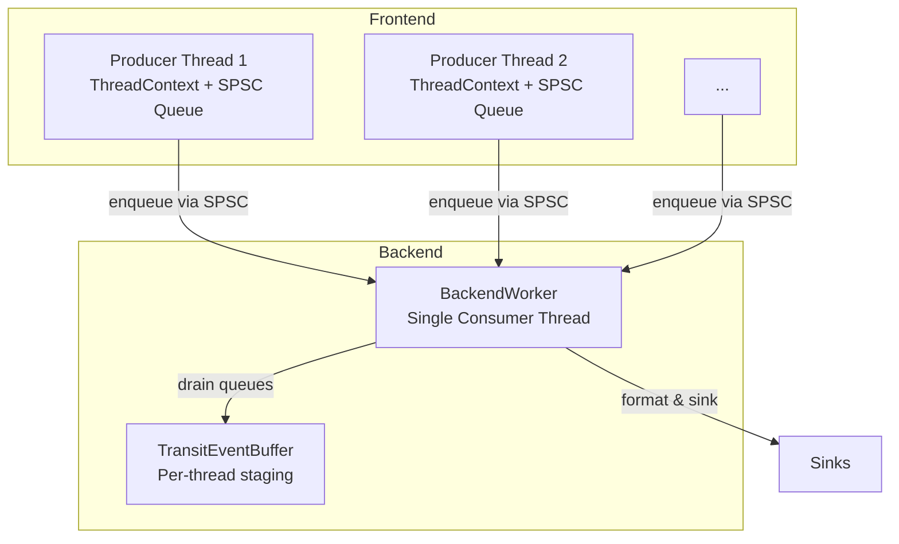
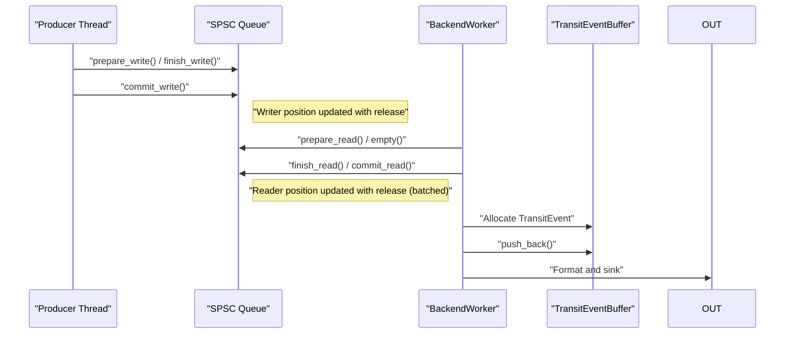
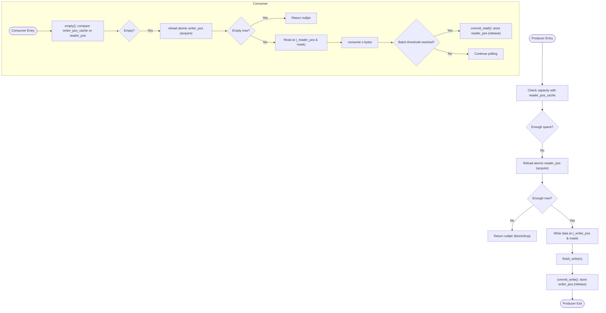
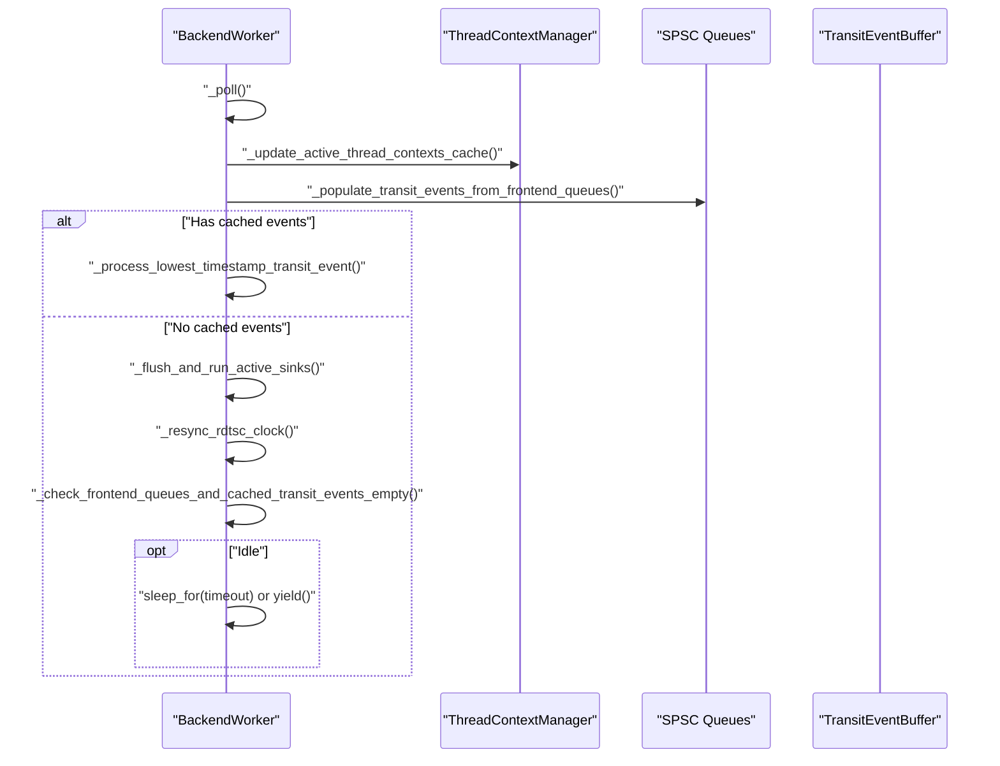
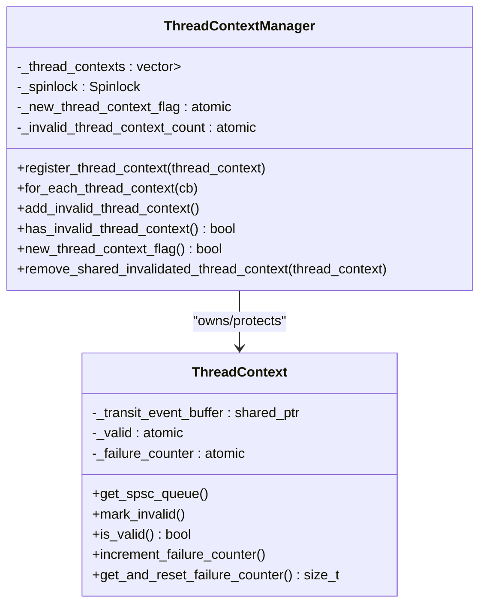
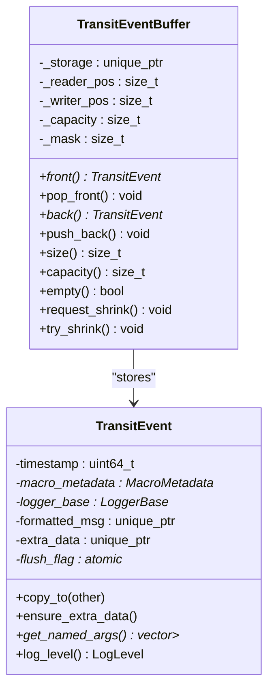
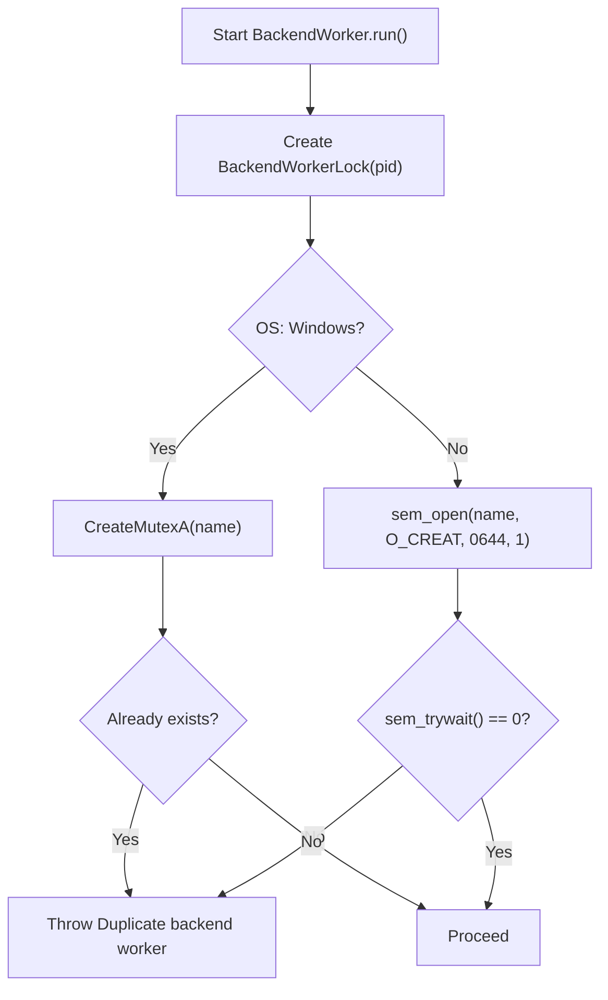
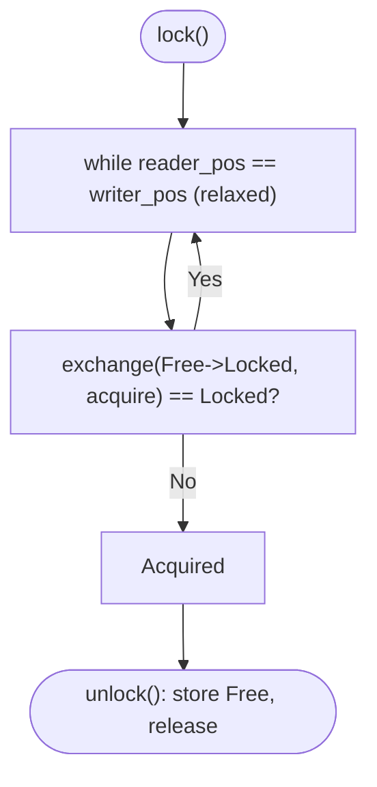
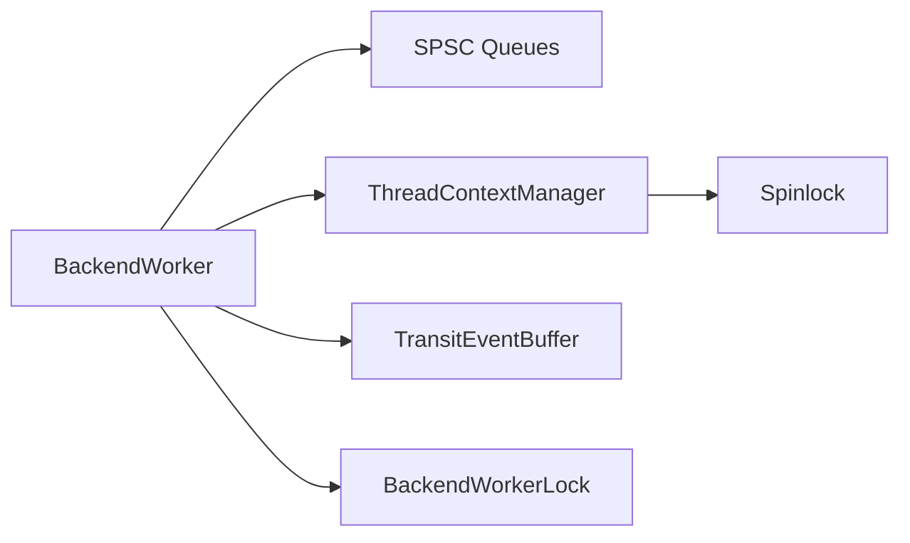

# Race Condition Prevention

<cite>
**Referenced Files in This Document**
- [Spinlock.h](file://include/quill/core/Spinlock.h)
- [BackendWorker.h](file://include/quill/backend/BackendWorker.h)
- [BackendWorkerLock.h](file://include/quill/backend/BackendWorkerLock.h)
- [BoundedSPSCQueue.h](file://include/quill/core/BoundedSPSCQueue.h)
- [UnboundedSPSCQueue.h](file://include/quill/core/UnboundedSPSCQueue.h)
- [ThreadContextManager.h](file://include/quill/core/ThreadContextManager.h)
- [TransitEventBuffer.h](file://include/quill/backend/TransitEventBuffer.h)
- [TransitEvent.h](file://include/quill/backend/TransitEvent.h)
- [Common.h](file://include/quill/core/Common.h)
- [MultiFrontendThreadsTest.cpp](file://test/integration_tests/MultiFrontendThreadsTest.cpp)
- [bounded_dropping_queue_frontend.cpp](file://examples/bounded_dropping_queue_frontend.cpp)
- [QueueStressFuzzer.cpp](file://fuzz/QueueStressFuzzer.cpp)
</cite>

## Table of Contents
1. [Introduction](#introduction)
2. [Project Structure](#project-structure)
3. [Core Components](#core-components)
4. [Architecture Overview](#architecture-overview)
5. [Detailed Component Analysis](#detailed-component-analysis)
6. [Dependency Analysis](#dependency-analysis)
7. [Performance Considerations](#performance-considerations)
8. [Troubleshooting Guide](#troubleshooting-guide)
9. [Conclusion](#conclusion)

## Introduction
This document explains how Quill prevents race conditions in its multi-threaded logging pipeline. It focuses on atomic operations, memory ordering, lock-free queues, and synchronization primitives used to safely coordinate producers (frontend threads) and the backend worker. Practical patterns for thread-safe logging, debugging race conditions, and best practices for custom extensions are provided.

## Project Structure
Quill’s concurrency-critical components are organized around:
- Frontend producers: per-thread SPSC queues (bounded or unbounded) and thread-local contexts
- Backend worker: a single consumer thread that drains queues and writes logs
- Synchronization: atomic flags, spinlocks for protected collections, and OS-level locks for singleton enforcement

**Diagram sources**
- [BackendWorker.h:305-395](file://include/quill/backend/BackendWorker.h#L305-L395)
- [ThreadContextManager.h:53-214](file://include/quill/core/ThreadContextManager.h#L53-L214)
- [BoundedSPSCQueue.h:105-169](file://include/quill/core/BoundedSPSCQueue.h#L105-L169)
- [UnboundedSPSCQueue.h:115-223](file://include/quill/core/UnboundedSPSCQueue.h#L115-L223)
- [TransitEventBuffer.h:19-157](file://include/quill/backend/TransitEventBuffer.h#L19-L157)

**Section sources**
- [BackendWorker.h:138-207](file://include/quill/backend/BackendWorker.h#L138-L207)
- [ThreadContextManager.h:216-338](file://include/quill/core/ThreadContextManager.h#L216-L338)

## Core Components
- Atomic flags and memory ordering: used to coordinate state transitions and visibility across threads
- Lock-free SPSC queues: bounded and unbounded variants for high-throughput producer/consumer channels
- Spinlock and lock guard: lightweight mutual exclusion for protecting small shared collections
- Backend singleton lock: OS-level synchronization to prevent duplicate backend workers
- TransitEventBuffer: per-thread staging buffer for ordered processing

Key concurrency mechanisms:
- Writer/reader positions and masks in SPSC queues ensure lock-free progress
- Release/acquire semantics on atomic flags enforce ordering between producer and consumer
- Relaxed atomics for counters and flags where external ordering is guaranteed by design

**Section sources**
- [BoundedSPSCQueue.h:105-169](file://include/quill/core/BoundedSPSCQueue.h#L105-L169)
- [UnboundedSPSCQueue.h:115-223](file://include/quill/core/UnboundedSPSCQueue.h#L115-L223)
- [Spinlock.h:30-45](file://include/quill/core/Spinlock.h#L30-L45)
- [BackendWorkerLock.h:46-103](file://include/quill/backend/BackendWorkerLock.h#L46-L103)
- [ThreadContextManager.h:216-338](file://include/quill/core/ThreadContextManager.h#L216-L338)
- [TransitEventBuffer.h:19-157](file://include/quill/backend/TransitEventBuffer.h#L19-L157)

## Architecture Overview
The frontend enqueues log records into per-thread SPSC queues. The backend worker periodically polls these queues, deserializes records into TransitEvent objects, and writes them to sinks. Memory ordering and atomic flags ensure correctness without global locks.

**Diagram sources**
- [BoundedSPSCQueue.h:105-169](file://include/quill/core/BoundedSPSCQueue.h#L105-L169)
- [UnboundedSPSCQueue.h:115-223](file://include/quill/core/UnboundedSPSCQueue.h#L115-L223)
- [BackendWorker.h:515-573](file://include/quill/backend/BackendWorker.h#L515-L573)
- [TransitEventBuffer.h:72-98](file://include/quill/backend/TransitEventBuffer.h#L72-L98)

## Detailed Component Analysis

### SPSC Queues: Bounded and Unbounded
- BoundedSPSCQueueImpl:
  - Uses atomic writer/reader positions with acquire/release semantics
  - Prefetching and cache-line flushing reduce contention and improve performance
  - Reader batches updates to reduce atomic traffic
- UnboundedSPSCQueue:
  - Node-linked structure grows by powers of two up to a configurable max
  - Producer switches to next node and publishes with release ordering
  - Consumer detects new node and switches with relaxed loads

**Diagram sources**
- [BoundedSPSCQueue.h:105-169](file://include/quill/core/BoundedSPSCQueue.h#L105-L169)
- [UnboundedSPSCQueue.h:115-223](file://include/quill/core/UnboundedSPSCQueue.h#L115-L223)

**Section sources**
- [BoundedSPSCQueue.h:105-169](file://include/quill/core/BoundedSPSCQueue.h#L105-L169)
- [UnboundedSPSCQueue.h:115-223](file://include/quill/core/UnboundedSPSCQueue.h#L115-L223)

### BackendWorker: Polling, Ordering, and Coordination
- Thread lifecycle:
  - run(): sets running flag with release, waits with seq_cst for readiness
  - stop(): sets running=false (release), notifies, joins
  - notify(): signals wake-up via mutex+condition variable (MinGW special-case)
- Poll loop:
  - Updates active thread contexts cache
  - Drains frontend queues into TransitEventBuffer
  - Enforces strict timestamp ordering when enabled
  - Sleeps or yields when idle, respecting sleep_duration and enable_yield_when_idle
- Memory ordering:
  - Atomic flags use acquire/release semantics for visibility
  - Seq_cst used only when necessary (startup readiness)

**Diagram sources**
- [BackendWorker.h:138-207](file://include/quill/backend/BackendWorker.h#L138-L207)
- [BackendWorker.h:305-395](file://include/quill/backend/BackendWorker.h#L305-L395)
- [ThreadContextManager.h:216-279](file://include/quill/core/ThreadContextManager.h#L216-L279)

**Section sources**
- [BackendWorker.h:138-207](file://include/quill/backend/BackendWorker.h#L138-L207)
- [BackendWorker.h:305-395](file://include/quill/backend/BackendWorker.h#L305-L395)

### ThreadContextManager: Protected Shared Collection
- Protects the vector of thread contexts with a spinlock
- Registers/unregisters contexts with release/acquire semantics for flags
- Tracks invalid contexts and counts to drive cleanup in the backend

**Diagram sources**
- [ThreadContextManager.h:216-338](file://include/quill/core/ThreadContextManager.h#L216-L338)
- [Spinlock.h:18-72](file://include/quill/core/Spinlock.h#L18-L72)

**Section sources**
- [ThreadContextManager.h:216-338](file://include/quill/core/ThreadContextManager.h#L216-L338)
- [Spinlock.h:18-72](file://include/quill/core/Spinlock.h#L18-L72)

### TransitEventBuffer and TransitEvent: Staging and Ownership
- TransitEventBuffer:
  - Circular buffer with reader/writer indices and mask
  - Expands when full; supports shrinking when empty
- TransitEvent:
  - Holds formatted message and optional runtime metadata
  - Supports move/copy semantics carefully to avoid aliasing pointers

**Diagram sources**
- [TransitEventBuffer.h:19-157](file://include/quill/backend/TransitEventBuffer.h#L19-L157)
- [TransitEvent.h:32-219](file://include/quill/backend/TransitEvent.h#L32-L219)

**Section sources**
- [TransitEventBuffer.h:19-157](file://include/quill/backend/TransitEventBuffer.h#L19-L157)
- [TransitEvent.h:32-219](file://include/quill/backend/TransitEvent.h#L32-L219)

### BackendWorkerLock: Singleton Enforcement
- Prevents multiple backend worker threads in the same process
- Uses named mutex on Windows and named semaphore on POSIX (with unlink semantics)

**Diagram sources**
- [BackendWorkerLock.h:46-103](file://include/quill/backend/BackendWorkerLock.h#L46-L103)

**Section sources**
- [BackendWorkerLock.h:46-103](file://include/quill/backend/BackendWorkerLock.h#L46-L103)

### Spinlock: Lightweight Mutual Exclusion
- Implements lock/unlock with acquire/release semantics
- Used to protect small shared collections (e.g., thread context registry)

**Diagram sources**
- [Spinlock.h:30-45](file://include/quill/core/Spinlock.h#L30-L45)

**Section sources**
- [Spinlock.h:30-45](file://include/quill/core/Spinlock.h#L30-L45)

## Dependency Analysis
Concurrency-related dependencies:
- BackendWorker depends on SPSC queues and ThreadContextManager
- ThreadContextManager depends on Spinlock and atomic flags
- TransitEventBuffer is owned by backend and used for staging
- BackendWorkerLock is used during backend startup to enforce singleton

**Diagram sources**
- [BackendWorker.h:77-101](file://include/quill/backend/BackendWorker.h#L77-L101)
- [ThreadContextManager.h:216-338](file://include/quill/core/ThreadContextManager.h#L216-L338)
- [Spinlock.h:18-72](file://include/quill/core/Spinlock.h#L18-L72)
- [TransitEventBuffer.h:19-157](file://include/quill/backend/TransitEventBuffer.h#L19-L157)
- [BackendWorkerLock.h:46-103](file://include/quill/backend/BackendWorkerLock.h#L46-L103)

**Section sources**
- [BackendWorker.h:77-101](file://include/quill/backend/BackendWorker.h#L77-L101)
- [ThreadContextManager.h:216-338](file://include/quill/core/ThreadContextManager.h#L216-L338)

## Performance Considerations
- Cache-line alignment and padding:
  - Atomic positions and queues are aligned to cache line boundaries to avoid false sharing
- Prefetching and cache-line flushes:
  - BoundedSPSCQueue uses prefetch hints and clflush-like operations on x86 to reduce cache pollution
- Batched commit:
  - Reader commits in batches to amortize atomic writes
- Minimal contention:
  - SPSC design eliminates cross-core contention between producer and consumer
- Backoff and yielding:
  - Backend yields or sleeps when idle to reduce CPU usage

**Section sources**
- [Common.h:129-130](file://include/quill/core/Common.h#L129-L130)
- [BoundedSPSCQueue.h:75-94](file://include/quill/core/BoundedSPSCQueue.h#L75-L94)
- [BoundedSPSCQueue.h:123-136](file://include/quill/core/BoundedSPSCQueue.h#L123-L136)
- [UnboundedSPSCQueue.h:190-223](file://include/quill/core/UnboundedSPSCQueue.h#L190-L223)

## Troubleshooting Guide
- Symptom: Out-of-order logs
  - Cause: Strict timestamp ordering disabled or TSC conversion not initialized
  - Action: Enable grace period and ensure backend thread initializes RDTSC clock before use
  - Reference: [BackendWorker.h:618-629](file://include/quill/backend/BackendWorker.h#L618-L629)
- Symptom: Duplicate backend worker threads
  - Cause: Multiple builds linked into the same process
  - Action: Build and link the logging library consistently; BackendWorkerLock will detect duplicates
  - Reference: [BackendWorkerLock.h:63-72](file://include/quill/backend/BackendWorkerLock.h#L63-L72)
- Symptom: High CPU usage when idle
  - Cause: Busy-waiting or missing yield
  - Action: Configure sleep_duration or enable_yield_when_idle in BackendOptions
  - Reference: [BackendWorker.h:383-386](file://include/quill/backend/BackendWorker.h#L383-L386)
- Symptom: Queue drops or blocks under load
  - Cause: BoundedDropping vs UnboundedBlocking differences
  - Action: Choose appropriate queue type and tune capacities
  - References: [bounded_dropping_queue_frontend.cpp:21-32](file://examples/bounded_dropping_queue_frontend.cpp#L21-L32), [UnboundedSPSCQueue.h:166-183](file://include/quill/core/UnboundedSPSCQueue.h#L166-L183)
- Stress testing race conditions
  - Use the queue stress fuzzer to exercise high-load scenarios and detect races
  - Reference: [QueueStressFuzzer.cpp:328-800](file://fuzz/QueueStressFuzzer.cpp#L328-L800)

**Section sources**
- [BackendWorker.h:618-629](file://include/quill/backend/BackendWorker.h#L618-L629)
- [BackendWorkerLock.h:63-72](file://include/quill/backend/BackendWorkerLock.h#L63-L72)
- [BackendWorker.h:383-386](file://include/quill/backend/BackendWorker.h#L383-L386)
- [bounded_dropping_queue_frontend.cpp:21-32](file://examples/bounded_dropping_queue_frontend.cpp#L21-L32)
- [UnboundedSPSCQueue.h:166-183](file://include/quill/core/UnboundedSPSCQueue.h#L166-L183)
- [QueueStressFuzzer.cpp:328-800](file://fuzz/QueueStressFuzzer.cpp#L328-L800)

## Conclusion
Quill’s race-free design relies on:
- Lock-free SPSC queues with precise memory ordering
- Lightweight spinlocks for small critical sections
- Atomic flags and careful batching to minimize contention
- Backend singleton enforcement via OS primitives
- Strict timestamp ordering and staged buffering to preserve log integrity

These patterns provide high throughput and predictable latency while preventing common race conditions in concurrent logging environments.