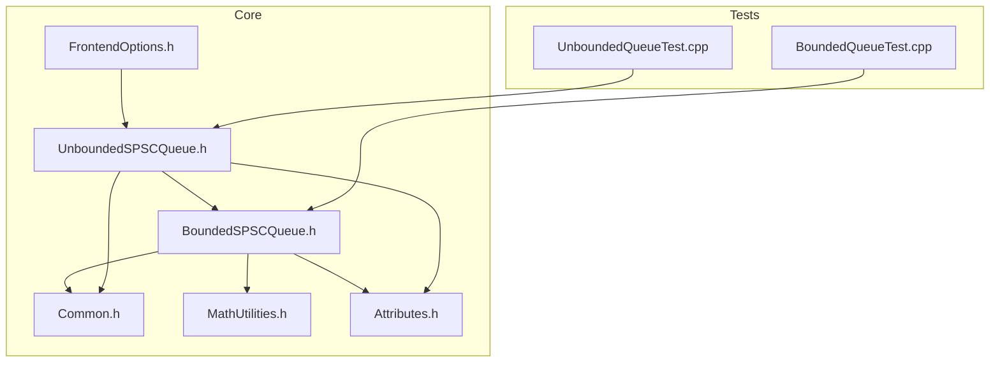
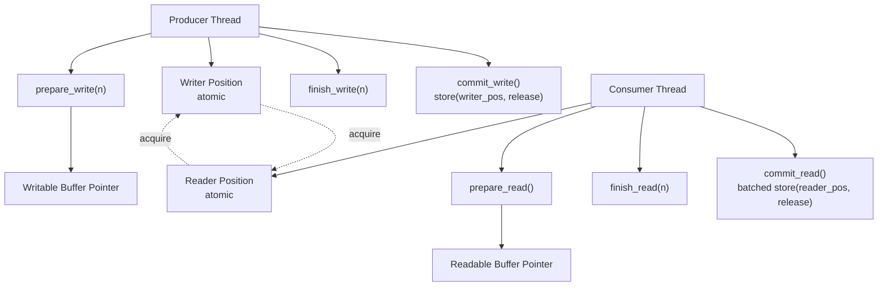
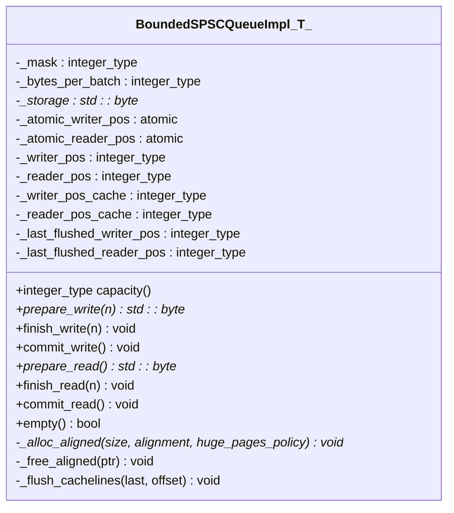
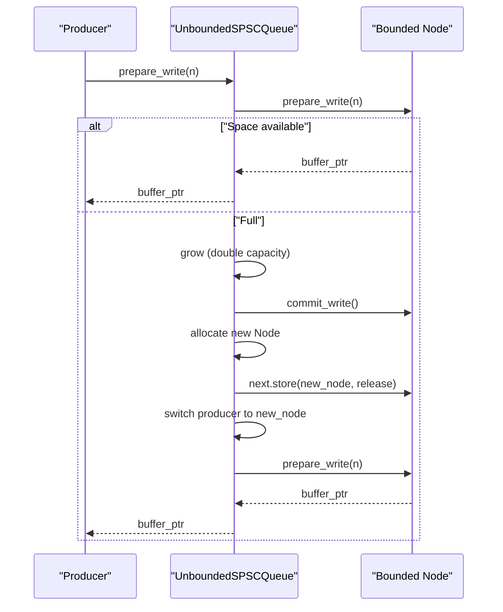
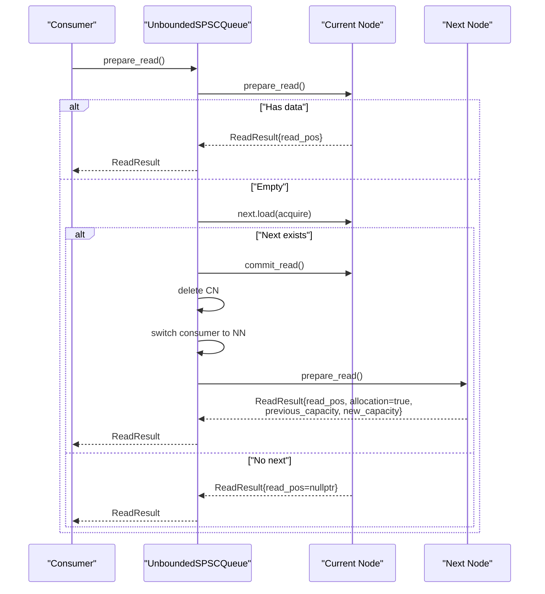
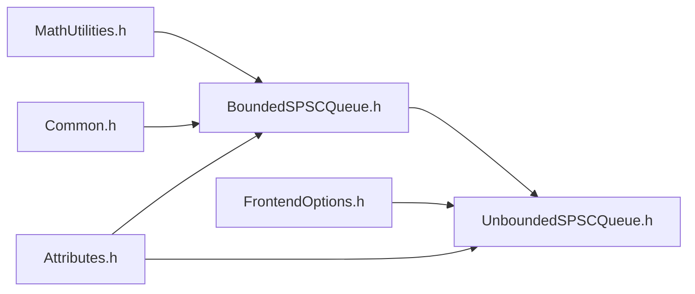

# SPSC Queue Synchronization

<cite>
**Referenced Files in This Document**
- [BoundedSPSCQueue.h](file://include/quill/core/BoundedSPSCQueue.h)
- [UnboundedSPSCQueue.h](file://include/quill/core/UnboundedSPSCQueue.h)
- [Common.h](file://include/quill/core/Common.h)
- [MathUtilities.h](file://include/quill/core/MathUtilities.h)
- [Attributes.h](file://include/quill/core/Attributes.h)
- [FrontendOptions.h](file://include/quill/core/FrontendOptions.h)
- [BoundedQueueTest.cpp](file://test/unit_tests/BoundedQueueTest.cpp)
- [UnboundedQueueTest.cpp](file://test/unit_tests/UnboundedQueueTest.cpp)
</cite>

## Update Summary
**Changes Made**
- Enhanced cache-line optimization implementation documentation with improved member variable responsibility tracking
- Updated cache-line flush and prefetch mechanisms with better responsibility separation
- Improved documentation of `_last_flushed_writer_pos` and `_last_flushed_reader_pos` member variables
- Added detailed explanation of cache-line alignment responsibilities in both producer and consumer contexts
- Enhanced hardware-specific optimization documentation with clearer member variable roles

## Table of Contents
1. [Introduction](#introduction)
2. [Project Structure](#project-structure)
3. [Core Components](#core-components)
4. [Architecture Overview](#architecture-overview)
5. [Detailed Component Analysis](#detailed-component-analysis)
6. [Dependency Analysis](#dependency-analysis)
7. [Performance Considerations](#performance-considerations)
8. [Troubleshooting Guide](#troubleshooting-guide)
9. [Conclusion](#conclusion)
10. [Appendices](#appendices)

## Introduction
This document explains the SPSC (Single Producer Single Consumer) queue synchronization mechanisms in Quill. It focuses on the lock-free ring buffer implementation, atomic operations for position tracking, memory ordering semantics, and the prepare/finish/commit workflows for both producers and consumers. It also covers cache-line optimization, prefetching strategies, hardware-specific optimizations, capacity management, huge page support, and memory alignment requirements. Practical usage patterns and common pitfalls in multi-threaded environments are included.

## Project Structure
The SPSC queue implementation resides in the core module:
- Bounded single-producer single-consumer queue: [BoundedSPSCQueue.h](file://include/quill/core/BoundedSPSCQueue.h)
- Unbounded single-producer single-consumer queue: [UnboundedSPSCQueue.h](file://include/quill/core/UnboundedSPSCQueue.h)
- Shared constants and policies: [Common.h](file://include/quill/core/Common.h)
- Power-of-two helpers: [MathUtilities.h](file://include/quill/core/MathUtilities.h)
- Compiler and attribute helpers: [Attributes.h](file://include/quill/core/Attributes.h)
- Frontend queue configuration: [FrontendOptions.h](file://include/quill/core/FrontendOptions.h)
- Usage examples and tests: [BoundedQueueTest.cpp](file://test/unit_tests/BoundedQueueTest.cpp), [UnboundedQueueTest.cpp](file://test/unit_tests/UnboundedQueueTest.cpp)

**Diagram sources**
- [BoundedSPSCQueue.h:1-358](file://include/quill/core/BoundedSPSCQueue.h#L1-L358)
- [UnboundedSPSCQueue.h:1-345](file://include/quill/core/UnboundedSPSCQueue.h#L1-L345)
- [Common.h:120-183](file://include/quill/core/Common.h#L120-L183)
- [MathUtilities.h:1-73](file://include/quill/core/MathUtilities.h#L1-L73)
- [Attributes.h:100-181](file://include/quill/core/Attributes.h#L100-L181)
- [FrontendOptions.h:16-50](file://include/quill/core/FrontendOptions.h#L16-L50)
- [BoundedQueueTest.cpp:1-146](file://test/unit_tests/BoundedQueueTest.cpp#L1-L146)
- [UnboundedQueueTest.cpp:1-160](file://test/unit_tests/UnboundedQueueTest.cpp#L1-L160)

**Section sources**
- [BoundedSPSCQueue.h:1-358](file://include/quill/core/BoundedSPSCQueue.h#L1-L358)
- [UnboundedSPSCQueue.h:1-345](file://include/quill/core/UnboundedSPSCQueue.h#L1-L345)
- [Common.h:120-183](file://include/quill/core/Common.h#L120-L183)
- [MathUtilities.h:1-73](file://include/quill/core/MathUtilities.h#L1-L73)
- [Attributes.h:100-181](file://include/quill/core/Attributes.h#L100-L181)
- [FrontendOptions.h:16-50](file://include/quill/core/FrontendOptions.h#L16-L50)
- [BoundedQueueTest.cpp:1-146](file://test/unit_tests/BoundedQueueTest.cpp#L1-L146)
- [UnboundedQueueTest.cpp:1-160](file://test/unit_tests/UnboundedQueueTest.cpp#L1-L160)

## Core Components
- BoundedSPSCQueueImpl<T>: Fixed-capacity, lock-free ring buffer with:
  - Atomic writer and reader positions with dedicated cache-line alignment
  - Reader-side batching to amortize atomic updates with optimized batch thresholds
  - Hardware-specific cache-line flush/prefetch on x86 with improved responsibility tracking
  - Huge page allocation support on Linux with fallback behavior
  - Power-of-two capacity and bitmask indexing
- UnboundedSPSCQueue: Producer-driven growth via linked list of bounded buffers with:
  - Node-based chaining with atomic next pointers aligned to cache line boundaries
  - Capacity doubling until a configurable maximum
  - Seamless handover from old to new buffer during reads with proper cleanup

Key constants and policies:
- Cache line size and alignment: [Common.h:129-130](file://include/quill/core/Common.h#L129-L130)
- Huge pages policy: [Common.h:175-180](file://include/quill/core/Common.h#L175-L180)
- Frontend queue defaults: [FrontendOptions.h:16-50](file://include/quill/core/FrontendOptions.h#L16-L50)

**Section sources**
- [BoundedSPSCQueue.h:54-346](file://include/quill/core/BoundedSPSCQueue.h#L54-L346)
- [UnboundedSPSCQueue.h:42-337](file://include/quill/core/UnboundedSPSCQueue.h#L42-L337)
- [Common.h:129-180](file://include/quill/core/Common.h#L129-L180)
- [FrontendOptions.h:16-50](file://include/quill/core/FrontendOptions.h#L16-L50)

## Architecture Overview
The SPSC queues implement a lock-free, cache-line-aware ring buffer with:
- Position tracking via aligned atomics for producer and consumer with dedicated responsibility separation
- Reader-side batching to reduce atomic writes with optimized batch thresholds
- Optional x86-specific cache-line flush/prefetch with improved responsibility tracking
- Memory alignment and optional huge pages for performance

**Diagram sources**
- [BoundedSPSCQueue.h:105-169](file://include/quill/core/BoundedSPSCQueue.h#L105-L169)
- [UnboundedSPSCQueue.h:115-240](file://include/quill/core/UnboundedSPSCQueue.h#L115-L240)

## Detailed Component Analysis

### BoundedSPSCQueueImpl<T>
- Capacity management:
  - Capacity is rounded up to the next power of two using [MathUtilities.h:46-70](file://include/quill/core/MathUtilities.h#L46-L70)
  - Mask is capacity minus one for fast modulo indexing
  - Reader-side batch size computed as percentage of capacity for commit frequency
- Position tracking with enhanced cache-line responsibility separation:
  - Writer position: local counter plus aligned atomic writer position with dedicated cache-line alignment
  - Reader position: local counter plus aligned atomic reader position with dedicated cache-line alignment
  - Mutable writer position cache and reader position cache to reduce atomic loads
  - Dedicated `_last_flushed_writer_pos` and `_last_flushed_reader_pos` member variables track cache-line flush boundaries
- Memory ordering:
  - Writer: prepare_write loads reader with acquire; commit_write stores writer position with release
  - Reader: empty checks load writer with acquire; commit_read conditionally stores reader position with release
- Cache-line optimization with improved responsibility tracking:
  - Storage aligned to cache line boundaries with QUILL_CACHE_LINE_ALIGNED
  - On x86: flush written cache lines and prefetch future lines around write/read positions with responsibility separation
  - Dedicated cache-line flush tracking for both producer and consumer
- Huge pages:
  - Allocation path supports huge pages on Linux with fallback behavior

**Updated** Enhanced cache-line optimization implementation with improved member variable responsibility tracking for both producer and consumer cache-line flush operations.

**Diagram sources**
- [BoundedSPSCQueue.h:54-346](file://include/quill/core/BoundedSPSCQueue.h#L54-L346)

**Section sources**
- [BoundedSPSCQueue.h:55-346](file://include/quill/core/BoundedSPSCQueue.h#L55-L346)
- [MathUtilities.h:46-70](file://include/quill/core/MathUtilities.h#L46-L70)
- [Common.h:129-130](file://include/quill/core/Common.h#L129-L130)

### UnboundedSPSCQueue
- Structure:
  - Node-based chain of bounded queues with atomic next pointer aligned to cache line boundaries
  - Producer and consumer pointers, each aligned to cache line boundaries for optimal performance
- Growth:
  - When prepare_write fails due to insufficient space, capacity doubles until max capacity
  - commit_write is issued on the old buffer before switching
- Handover:
  - Consumer switches to the new buffer when next is observed, commits prior reads, deletes the old node, and returns capacity change metadata
- Capacity queries:
  - producer_capacity returns current node's capacity
  - capacity returns current node's capacity
  - shrink reduces capacity by creating a new node and switching after the old is consumed

**Diagram sources**
- [UnboundedSPSCQueue.h:115-297](file://include/quill/core/UnboundedSPSCQueue.h#L115-L297)

**Diagram sources**
- [UnboundedSPSCQueue.h:190-329](file://include/quill/core/UnboundedSPSCQueue.h#L190-L329)

**Section sources**
- [UnboundedSPSCQueue.h:42-337](file://include/quill/core/UnboundedSPSCQueue.h#L42-L337)
- [FrontendOptions.h:16-50](file://include/quill/core/FrontendOptions.h#L16-L50)

### Memory Ordering Semantics
- Writer path:
  - prepare_write: load reader position with acquire to synchronize with prior commits
  - commit_write: store writer position with release to publish data to reader
- Reader path:
  - empty: load writer position with acquire; if empty, reload writer with acquire to ensure latest
  - commit_read: conditionally store reader position with release after a batch threshold
- Producer/consumer separation:
  - Each pointer is cache-line aligned and modified by only one side to avoid false sharing

**Section sources**
- [BoundedSPSCQueue.h:105-169](file://include/quill/core/BoundedSPSCQueue.h#L105-L169)
- [UnboundedSPSCQueue.h:115-240](file://include/quill/core/UnboundedSPSCQueue.h#L115-L240)
- [Common.h:129-130](file://include/quill/core/Common.h#L129-L130)

### Cache Line Optimization and Prefetching with Enhanced Responsibility Tracking
- Storage is allocated with alignment suitable for cache line boundaries using QUILL_CACHE_LINE_ALIGNED
- On x86:
  - Writer: flush cache lines after committing and prefetch a future cache line ahead of the write cursor with dedicated responsibility tracking
  - Reader: flush cache lines after committing batches with separate responsibility tracking
  - Dedicated `_last_flushed_writer_pos` and `_last_flushed_reader_pos` member variables track cache-line flush boundaries
- Prefetch hints are used to bring cache lines into the CPU early with improved boundary calculations
- Cache-line mask constant `_QUILL_CACHE_LINE_MASK` provides efficient boundary detection

**Updated** Enhanced cache-line optimization implementation with improved member variable responsibility tracking for both producer and consumer cache-line flush operations.

**Section sources**
- [BoundedSPSCQueue.h:75-94](file://include/quill/core/BoundedSPSCQueue.h#L75-L94)
- [BoundedSPSCQueue.h:128-135](file://include/quill/core/BoundedSPSCQueue.h#L128-L135)
- [BoundedSPSCQueue.h:165-168](file://include/quill/core/BoundedSPSCQueue.h#L165-L168)
- [BoundedSPSCQueue.h:200-219](file://include/quill/core/BoundedSPSCQueue.h#L200-L219)
- [BoundedSPSCQueue.h:329-333](file://include/quill/core/BoundedSPSCQueue.h#L329-L333)
- [Common.h:129-130](file://include/quill/core/Common.h#L129-L130)

### Hardware-Specific Optimizations
- x86 intrinsics are used for cache-line flush and prefetch with improved responsibility tracking
- Conditional compilation guards ensure portability
- Dedicated cache-line flush functions `_flush_cachelines` with separate tracking for writer and reader positions

**Updated** Enhanced hardware-specific optimizations with improved cache-line responsibility separation.

**Section sources**
- [BoundedSPSCQueue.h:22-39](file://include/quill/core/BoundedSPSCQueue.h#L22-L39)

### Capacity Management and Huge Page Support
- Capacity:
  - Bounded queue: power-of-two capacity enforced; mask-based indexing
  - Unbounded queue: grows by doubling until reaching configured maximum
- Huge pages:
  - Allocation path supports huge pages on Linux with policy controls (Never, Always, Try)
  - Fallback to normal pages when Try fails on Linux

**Section sources**
- [BoundedSPSCQueue.h:60-68](file://include/quill/core/BoundedSPSCQueue.h#L60-L68)
- [BoundedSPSCQueue.h:246-302](file://include/quill/core/BoundedSPSCQueue.h#L246-L302)
- [UnboundedSPSCQueue.h:244-297](file://include/quill/core/UnboundedSPSCQueue.h#L244-L297)
- [FrontendOptions.h:44-49](file://include/quill/core/FrontendOptions.h#L44-L49)
- [Common.h:175-180](file://include/quill/core/Common.h#L175-L180)

## Dependency Analysis
- BoundedSPSCQueueImpl<T> depends on:
  - Common constants (cache line sizes, policies)
  - MathUtilities for power-of-two rounding
  - Attributes for hot/cold and likely/unlikely hints
- UnboundedSPSCQueue depends on:
  - BoundedSPSCQueue for per-node storage
  - FrontendOptions for maximum capacity defaults
  - Attributes for performance annotations

**Diagram sources**
- [BoundedSPSCQueue.h:1-358](file://include/quill/core/BoundedSPSCQueue.h#L1-L358)
- [UnboundedSPSCQueue.h:1-345](file://include/quill/core/UnboundedSPSCQueue.h#L1-L345)
- [Common.h:120-183](file://include/quill/core/Common.h#L120-L183)
- [MathUtilities.h:1-73](file://include/quill/core/MathUtilities.h#L1-L73)
- [Attributes.h:100-181](file://include/quill/core/Attributes.h#L100-L181)
- [FrontendOptions.h:16-50](file://include/quill/core/FrontendOptions.h#L16-L50)

**Section sources**
- [BoundedSPSCQueue.h:1-358](file://include/quill/core/BoundedSPSCQueue.h#L1-L358)
- [UnboundedSPSCQueue.h:1-345](file://include/quill/core/UnboundedSPSCQueue.h#L1-L345)
- [Common.h:120-183](file://include/quill/core/Common.h#L120-L183)
- [MathUtilities.h:1-73](file://include/quill/core/MathUtilities.h#L1-L73)
- [Attributes.h:100-181](file://include/quill/core/Attributes.h#L100-L181)
- [FrontendOptions.h:16-50](file://include/quill/core/FrontendOptions.h#L16-L50)

## Performance Considerations
- Wait-free production and consumption:
  - Bounded queue: wait-free for producer and consumer with enhanced cache-line responsibility separation
  - Unbounded queue: producer grows without blocking; consumer remains wait-free unless switching nodes
- Reduced atomic contention:
  - Reader batching lowers frequency of atomic reader position updates with optimized batch thresholds
  - Local caches for positions minimize atomic operations
- Cache-line awareness:
  - Aligned storage and flush/prefetch reduce false sharing and improve throughput with dedicated responsibility tracking
  - Separate cache-line flush tracking for producer and consumer improves performance isolation
- Huge pages:
  - Lower TLB pressure on Linux when enabled via policy

## Troubleshooting Guide
- Symptom: Reader observes empty despite producer writing
  - Cause: Missing commit_write or commit_read
  - Fix: Ensure finish_and_commit_write or separate finish_write + commit_write are called by producer; ensure commit_read is invoked by consumer
- Symptom: Frequent blocking or dropping in bounded mode
  - Cause: Insufficient capacity or slow consumer
  - Fix: Increase initial capacity or enable unbounded mode with appropriate max capacity
- Symptom: Excessive allocations in unbounded mode
  - Cause: Large single writes causing rapid doubling
  - Fix: Tune unbounded_queue_max_capacity or split large writes
- Symptom: Performance degradation on x86
  - Cause: Misaligned memory or missing prefetch paths
  - Fix: Use cache-line-aligned allocation and rely on built-in prefetch; verify compiler intrinsics availability
- Symptom: Failure to allocate huge pages
  - Cause: Policy set to Always or insufficient privileges
  - Fix: Use Try policy or adjust OS permissions; fallback to normal pages is automatic when policy is Try
- Symptom: Cache-line flush issues
  - Cause: Improper cache-line flush boundaries or responsibility tracking
  - Fix: Verify `_last_flushed_writer_pos` and `_last_flushed_reader_pos` are properly maintained; ensure QUILL_CACHE_LINE_MASK is correctly applied

**Updated** Added troubleshooting guidance for cache-line flush issues with specific member variable responsibility tracking.

**Section sources**
- [BoundedSPSCQueue.h:123-136](file://include/quill/core/BoundedSPSCQueue.h#L123-L136)
- [BoundedSPSCQueue.h:159-169](file://include/quill/core/BoundedSPSCQueue.h#L159-L169)
- [UnboundedSPSCQueue.h:244-297](file://include/quill/core/UnboundedSPSCQueue.h#L244-L297)
- [FrontendOptions.h:44-49](file://include/quill/core/FrontendOptions.h#L44-L49)

## Conclusion
Quill's SPSC queues provide efficient, lock-free inter-thread communication with careful attention to memory ordering, cache-line alignment, and platform-specific optimizations. The bounded variant offers predictable sizing and minimal overhead with enhanced cache-line responsibility tracking, while the unbounded variant adapts to workload growth up to a configurable limit. Proper usage of the prepare/finish/commit cycle and understanding of batching, huge page policies, and cache-line responsibility separation are essential for optimal performance and correctness.

## Appendices

### Usage Patterns and Examples
- Bounded queue usage pattern:
  - Producer: prepare_write(n), memcpy to returned pointer, finish_write(n), commit_write()
  - Consumer: prepare_read(), memcpy from returned pointer, finish_read(n), commit_read()
- Unbounded queue usage pattern:
  - Producer: prepare_write(n), memcpy, finish_write(n), commit_write(); may grow automatically
  - Consumer: prepare_read(), handle ReadResult with allocation flags and capacity changes, finish_read(n), commit_read()

**Section sources**
- [BoundedQueueTest.cpp:22-87](file://test/unit_tests/BoundedQueueTest.cpp#L22-L87)
- [UnboundedQueueTest.cpp:13-100](file://test/unit_tests/UnboundedQueueTest.cpp#L13-L100)
- [UnboundedQueueTest.cpp:102-157](file://test/unit_tests/UnboundedQueueTest.cpp#L102-L157)