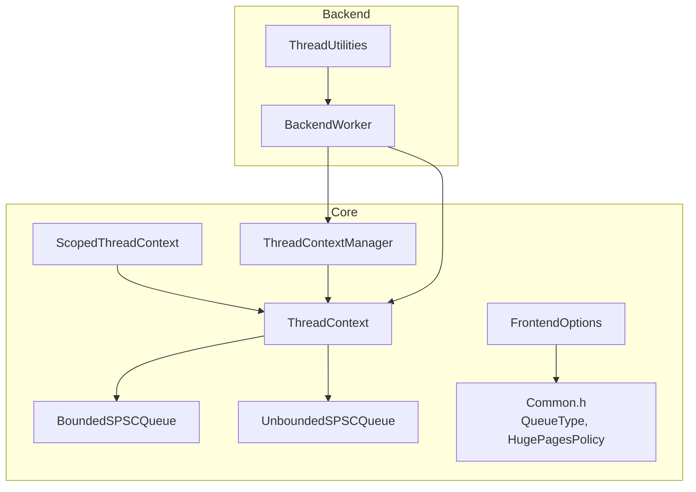
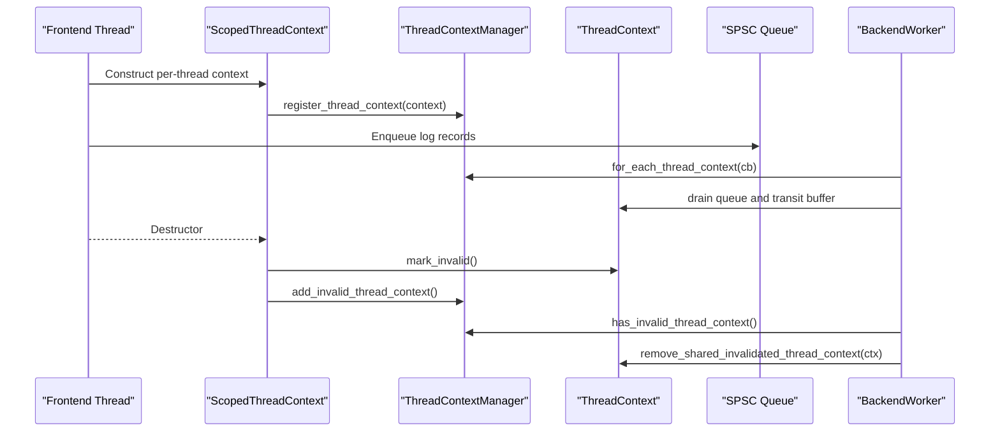
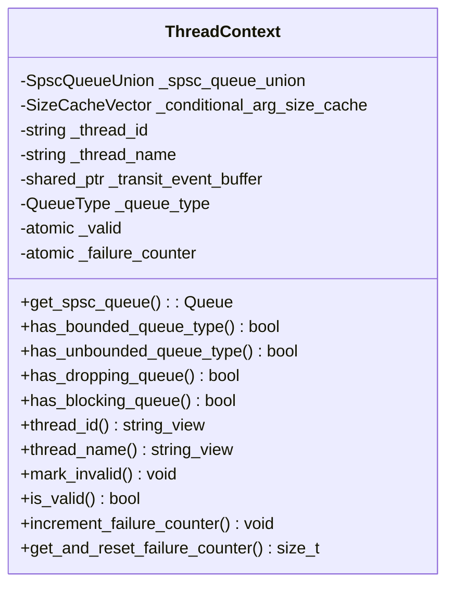
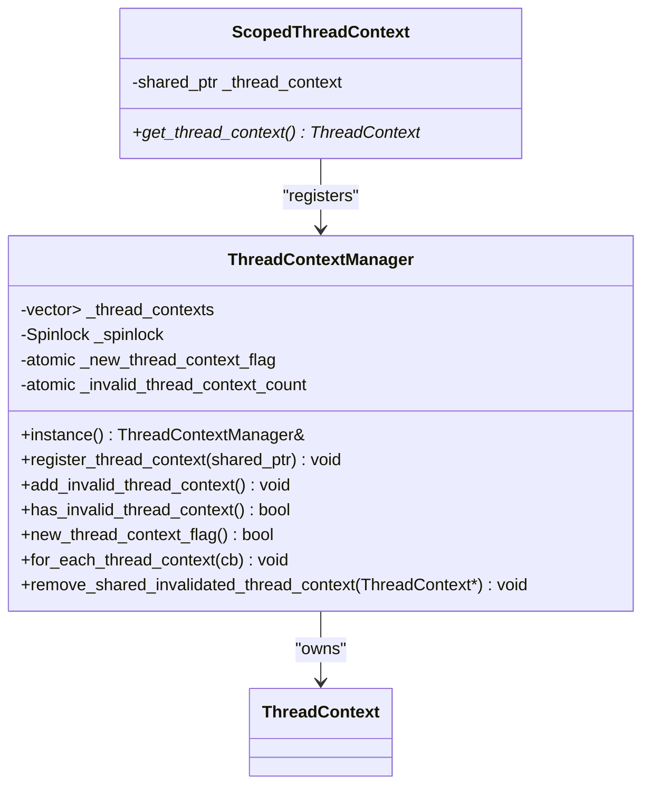
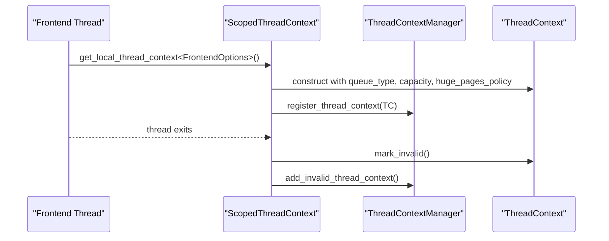
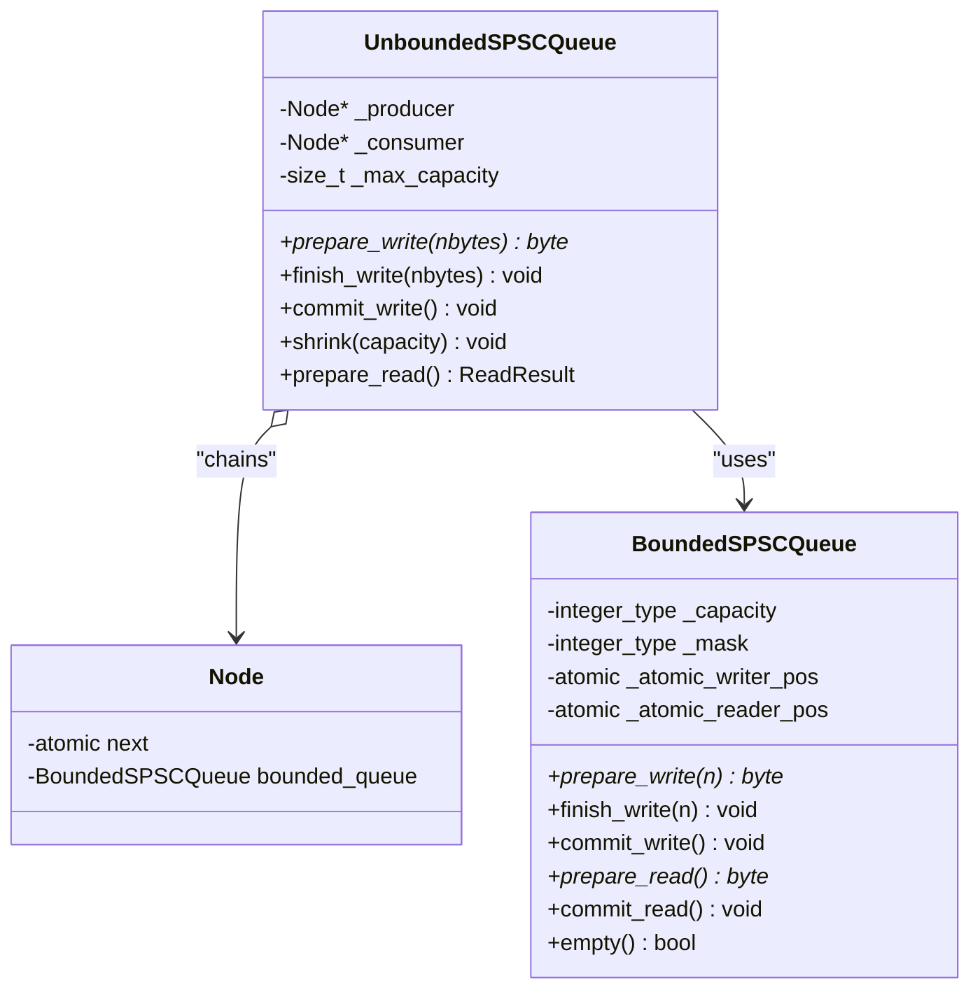
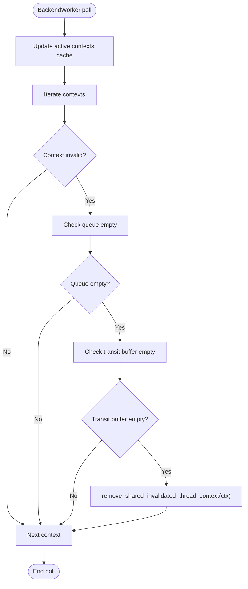
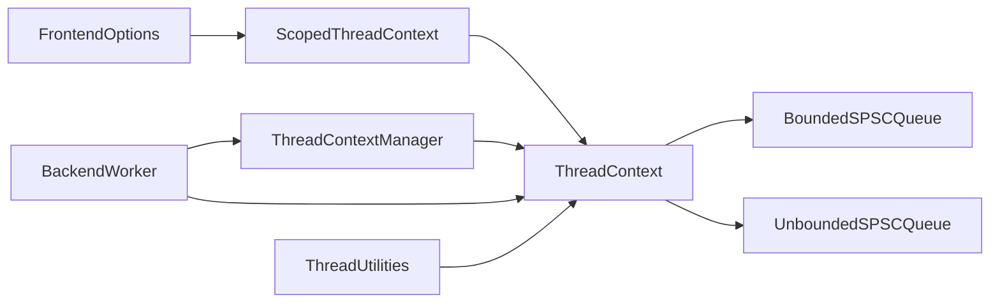

# Thread Context Management

<cite>
**Referenced Files in This Document**
- [ThreadContextManager.h](file://include/quill/core/ThreadContextManager.h)
- [FrontendOptions.h](file://include/quill/core/FrontendOptions.h)
- [Common.h](file://include/quill/core/Common.h)
- [BoundedSPSCQueue.h](file://include/quill/core/BoundedSPSCQueue.h)
- [UnboundedSPSCQueue.h](file://include/quill/core/UnboundedSPSCQueue.h)
- [BackendWorker.h](file://include/quill/backend/BackendWorker.h)
- [ThreadUtilities.h](file://include/quill/backend/ThreadUtilities.h)
- [ThreadContextManagerTest.cpp](file://test/unit_tests/ThreadContextManagerTest.cpp)
</cite>

## Table of Contents
1. [Introduction](#introduction)
2. [Project Structure](#project-structure)
3. [Core Components](#core-components)
4. [Architecture Overview](#architecture-overview)
5. [Detailed Component Analysis](#detailed-component-analysis)
6. [Dependency Analysis](#dependency-analysis)
7. [Performance Considerations](#performance-considerations)
8. [Troubleshooting Guide](#troubleshooting-guide)
9. [Conclusion](#conclusion)

## Introduction
This document explains thread context management in Quill’s asynchronous logging system. It focuses on per-thread queue management, context switching between frontend and backend threads, and thread-local storage utilization. It documents the ThreadContextManager’s role in coordinating thread states, managing queue ownership, and handling thread lifecycle events. It also covers context initialization, cleanup procedures, thread safety guarantees, usage patterns, and debugging techniques for thread-related issues.

## Project Structure
The thread context management spans several core modules:
- Core runtime and queue abstractions: ThreadContext, ThreadContextManager, ScopedThreadContext, SPSC queues
- Backend coordination: BackendWorker orchestrating the backend thread and cleaning up invalidated contexts
- Frontend configuration: FrontendOptions controlling queue types and capacities
- Utilities: ThreadUtilities providing thread identity and naming
- Tests validating lifecycle and cleanup behavior

**Diagram sources**
- [ThreadContextManager.h:53-214](file://include/quill/core/ThreadContextManager.h#L53-L214)
- [ThreadContextManager.h:216-338](file://include/quill/core/ThreadContextManager.h#L216-L338)
- [ThreadContextManager.h:340-399](file://include/quill/core/ThreadContextManager.h#L340-L399)
- [BoundedSPSCQueue.h:54-95](file://include/quill/core/BoundedSPSCQueue.h#L54-L95)
- [UnboundedSPSCQueue.h:42-85](file://include/quill/core/UnboundedSPSCQueue.h#L42-L85)
- [FrontendOptions.h:16-50](file://include/quill/core/FrontendOptions.h#L16-L50)
- [Common.h:145-180](file://include/quill/core/Common.h#L145-L180)
- [BackendWorker.h:77-200](file://include/quill/backend/BackendWorker.h#L77-L200)
- [ThreadUtilities.h:148-188](file://include/quill/backend/ThreadUtilities.h#L148-L188)

**Section sources**
- [ThreadContextManager.h:53-214](file://include/quill/core/ThreadContextManager.h#L53-L214)
- [ThreadContextManager.h:216-338](file://include/quill/core/ThreadContextManager.h#L216-L338)
- [ThreadContextManager.h:340-399](file://include/quill/core/ThreadContextManager.h#L340-L399)
- [BoundedSPSCQueue.h:54-95](file://include/quill/core/BoundedSPSCQueue.h#L54-L95)
- [UnboundedSPSCQueue.h:42-85](file://include/quill/core/UnboundedSPSCQueue.h#L42-L85)
- [FrontendOptions.h:16-50](file://include/quill/core/FrontendOptions.h#L16-L50)
- [Common.h:145-180](file://include/quill/core/Common.h#L145-L180)
- [BackendWorker.h:77-200](file://include/quill/backend/BackendWorker.h#L77-L200)
- [ThreadUtilities.h:148-188](file://include/quill/backend/ThreadUtilities.h#L148-L188)

## Core Components
- ThreadContext: Per-thread structure holding either a bounded or unbounded SPSC queue, thread metadata (id, name), a shared transit event buffer pointer, queue type, validity flag, and failure counter. It exposes typed getters for the underlying queue and helpers to query queue characteristics.
- ThreadContextManager: Singleton registry of all ThreadContext instances, guarded by a spinlock. It tracks new contexts, invalid contexts, and provides iteration and removal APIs.
- ScopedThreadContext: RAII wrapper that constructs a ThreadContext for the current thread using thread-local storage and registers it with ThreadContextManager. Its destructor marks the context invalid and notifies the backend.
- SPSC Queues: BoundedSPSCQueue and UnboundedSPSCQueue implement single-producer single-consumer FIFO buffers. Unbounded queue grows by chaining nodes; bounded queue uses a fixed-capacity ring buffer with cache-line-aware operations.
- BackendWorker: Backend thread coordinator that updates an active context cache, drains invalidated contexts, and cleans up empty queues and transit buffers.
- FrontendOptions: Defines queue type, initial capacity, blocking retry interval, max capacity for unbounded queues, and huge pages policy.
- ThreadUtilities: Provides thread name and OS-assigned thread id retrieval.

**Section sources**
- [ThreadContextManager.h:53-214](file://include/quill/core/ThreadContextManager.h#L53-L214)
- [ThreadContextManager.h:216-338](file://include/quill/core/ThreadContextManager.h#L216-L338)
- [ThreadContextManager.h:340-399](file://include/quill/core/ThreadContextManager.h#L340-L399)
- [BoundedSPSCQueue.h:54-95](file://include/quill/core/BoundedSPSCQueue.h#L54-L95)
- [UnboundedSPSCQueue.h:42-85](file://include/quill/core/UnboundedSPSCQueue.h#L42-L85)
- [BackendWorker.h:1211-1245](file://include/quill/backend/BackendWorker.h#L1211-L1245)
- [BackendWorker.h:1396-1445](file://include/quill/backend/BackendWorker.h#L1396-L1445)
- [FrontendOptions.h:16-50](file://include/quill/core/FrontendOptions.h#L16-L50)
- [ThreadUtilities.h:148-188](file://include/quill/backend/ThreadUtilities.h#L148-L188)

## Architecture Overview
The system separates frontend and backend responsibilities:
- Frontend threads create and own a ThreadContext with a per-thread SPSC queue. Logging calls enqueue records into the queue.
- ThreadContextManager maintains a registry of contexts and coordinates lifecycle events.
- BackendWorker runs in a dedicated thread, iterating the active contexts cache, draining queues and transit buffers, and removing invalidated contexts when empty.
- ThreadUtilities provides thread identity and names for diagnostics.

**Diagram sources**
- [ThreadContextManager.h:340-399](file://include/quill/core/ThreadContextManager.h#L340-L399)
- [ThreadContextManager.h:216-338](file://include/quill/core/ThreadContextManager.h#L216-L338)
- [BackendWorker.h:1396-1445](file://include/quill/backend/BackendWorker.h#L1396-L1445)

## Detailed Component Analysis

### ThreadContext
Responsibilities:
- Owns a union of either a bounded or unbounded SPSC queue, selected at construction based on queue type.
- Caches thread id and name via ThreadUtilities.
- Tracks validity and failure count for lifecycle and diagnostics.
- Exposes helpers to query queue type characteristics and access the underlying queue.

Key behaviors:
- Construction selects queue type and placement-new-initializes the appropriate queue with configured capacity and huge pages policy.
- Destruction matches the queue type to call the correct destructor.
- Provides typed getters for the queue to enforce compile-time queue type correctness.

**Diagram sources**
- [ThreadContextManager.h:53-214](file://include/quill/core/ThreadContextManager.h#L53-L214)

**Section sources**
- [ThreadContextManager.h:53-214](file://include/quill/core/ThreadContextManager.h#L53-L214)

### ThreadContextManager
Responsibilities:
- Singleton registry of all ThreadContext instances.
- Thread-safe registration and notification of new contexts.
- Tracking and removal of invalidated contexts with assertions ensuring emptiness.
- Iteration over all contexts for backend consumption.

Concurrency:
- Uses a spinlock to guard vector mutations.
- Uses atomic flags for lightweight signaling of new or invalid contexts.

Lifecycle:
- New contexts are registered upon ScopedThreadContext construction.
- Invalid contexts are marked by ScopedThreadContext destructor and later removed by BackendWorker when empty.

**Diagram sources**
- [ThreadContextManager.h:216-338](file://include/quill/core/ThreadContextManager.h#L216-L338)
- [ThreadContextManager.h:340-399](file://include/quill/core/ThreadContextManager.h#L340-L399)

**Section sources**
- [ThreadContextManager.h:216-338](file://include/quill/core/ThreadContextManager.h#L216-L338)
- [ThreadContextManager.h:340-399](file://include/quill/core/ThreadContextManager.h#L340-L399)

### ScopedThreadContext and Thread-Local Storage
- Ensures a single ThreadContext per thread via a thread-local wrapper.
- Constructs ThreadContext with queue type and capacity from FrontendOptions.
- Registers the context at construction and marks it invalid at destruction, notifying the backend.

**Diagram sources**
- [ThreadContextManager.h:405-422](file://include/quill/core/ThreadContextManager.h#L405-L422)
- [ThreadContextManager.h:340-399](file://include/quill/core/ThreadContextManager.h#L340-L399)
- [ThreadContextManager.h:243-249](file://include/quill/core/ThreadContextManager.h#L243-L249)

**Section sources**
- [ThreadContextManager.h:405-422](file://include/quill/core/ThreadContextManager.h#L405-L422)
- [ThreadContextManager.h:340-399](file://include/quill/core/ThreadContextManager.h#L340-L399)

### SPSC Queues: Bounded vs Unbounded
- BoundedSPSCQueue: Fixed-capacity ring buffer with writer/reader positions and batched commit/flush semantics. Supports huge pages policy and cache-line optimizations.
- UnboundedSPSCQueue: Chains nodes of bounded queues, allowing growth until max capacity. Supports shrinking and seamless consumption across node boundaries.

**Diagram sources**
- [BoundedSPSCQueue.h:54-95](file://include/quill/core/BoundedSPSCQueue.h#L54-L95)
- [UnboundedSPSCQueue.h:42-85](file://include/quill/core/UnboundedSPSCQueue.h#L42-L85)
- [UnboundedSPSCQueue.h:48-63](file://include/quill/core/UnboundedSPSCQueue.h#L48-L63)

**Section sources**
- [BoundedSPSCQueue.h:54-95](file://include/quill/core/BoundedSPSCQueue.h#L54-L95)
- [UnboundedSPSCQueue.h:42-85](file://include/quill/core/UnboundedSPSCQueue.h#L42-L85)

### BackendWorker Lifecycle and Cleanup
- Maintains an active contexts cache and periodically updates it.
- Drains queues and transit buffers for each context.
- Removes invalidated contexts when both the queue and transit buffer are empty.
- Uses atomic flags and assertions to ensure correctness and detect misuse.

**Diagram sources**
- [BackendWorker.h:1396-1445](file://include/quill/backend/BackendWorker.h#L1396-L1445)
- [BackendWorker.h:1232-1245](file://include/quill/backend/BackendWorker.h#L1232-L1245)

**Section sources**
- [BackendWorker.h:1396-1445](file://include/quill/backend/BackendWorker.h#L1396-L1445)
- [BackendWorker.h:1232-1245](file://include/quill/backend/BackendWorker.h#L1232-L1245)

### FrontendOptions and Queue Configuration
- Controls queue type (UnboundedBlocking, UnboundedDropping, BoundedBlocking, BoundedDropping), initial capacity, blocking retry interval, and max capacity for unbounded queues.
- Huge pages policy can be configured for performance-sensitive deployments.

**Section sources**
- [FrontendOptions.h:16-50](file://include/quill/core/FrontendOptions.h#L16-L50)
- [Common.h:145-180](file://include/quill/core/Common.h#L145-L180)

### Thread Identity and Naming
- ThreadUtilities provides thread name and OS-assigned thread id retrieval, used by ThreadContext to cache identifiers.

**Section sources**
- [ThreadUtilities.h:148-188](file://include/quill/backend/ThreadUtilities.h#L148-L188)

## Dependency Analysis
- ThreadContext depends on SPSC queues and Common enums/types.
- ThreadContextManager depends on ThreadContext and uses a spinlock and atomics.
- ScopedThreadContext depends on ThreadContextManager and FrontendOptions.
- BackendWorker depends on ThreadContextManager, ThreadContext, and SPSC queues.
- ThreadUtilities is used by ThreadContext for thread metadata.

**Diagram sources**
- [ThreadContextManager.h:340-399](file://include/quill/core/ThreadContextManager.h#L340-L399)
- [ThreadContextManager.h:216-338](file://include/quill/core/ThreadContextManager.h#L216-L338)
- [BoundedSPSCQueue.h:54-95](file://include/quill/core/BoundedSPSCQueue.h#L54-L95)
- [UnboundedSPSCQueue.h:42-85](file://include/quill/core/UnboundedSPSCQueue.h#L42-L85)
- [BackendWorker.h:77-200](file://include/quill/backend/BackendWorker.h#L77-L200)
- [ThreadUtilities.h:148-188](file://include/quill/backend/ThreadUtilities.h#L148-L188)

**Section sources**
- [ThreadContextManager.h:216-338](file://include/quill/core/ThreadContextManager.h#L216-L338)
- [ThreadContextManager.h:340-399](file://include/quill/core/ThreadContextManager.h#L340-L399)
- [BackendWorker.h:77-200](file://include/quill/backend/BackendWorker.h#L77-L200)

## Performance Considerations
- SPSC queues are designed for lock-free enqueue/dequeue on the hot path. Bounded queue uses batched commits and cache-line aware operations; unbounded queue chains nodes to scale capacity.
- Huge pages policy can reduce TLB misses for high-throughput scenarios.
- BackendWorker drains queues and transit buffers in batches and uses atomic flags to minimize contention.
- Thread-local storage ensures per-thread access without cross-thread synchronization overhead.

[No sources needed since this section provides general guidance]

## Troubleshooting Guide
Common issues and checks:
- Duplicate contexts per thread: ScopedThreadContext enforces a single instance per thread via a thread-local guard. Mixing default and custom FrontendOptions can violate this design.
- Removing non-empty contexts: ThreadContextManager asserts that invalidated contexts have empty queues before removal.
- Backend not draining: Ensure BackendWorker is running and polling; verify that contexts are being invalidated and that queues/transit buffers are empty.
- Thread identity/name mismatches: Confirm ThreadUtilities availability and platform support for thread naming.

Validation via tests:
- Unit tests spawn multiple threads, verify all contexts are valid and queues are empty, then terminate threads and assert invalidation and removal.

**Section sources**
- [ThreadContextManager.h:349-361](file://include/quill/core/ThreadContextManager.h#L349-L361)
- [ThreadContextManager.h:310-321](file://include/quill/core/ThreadContextManager.h#L310-L321)
- [ThreadContextManagerTest.cpp:15-116](file://test/unit_tests/ThreadContextManagerTest.cpp#L15-L116)

## Conclusion
Quill’s thread context management cleanly separates frontend and backend responsibilities. Each frontend thread owns a ThreadContext with a per-thread SPSC queue, registered with ThreadContextManager. The backend thread drains queues and transit buffers, invalidating and removing contexts when idle. Thread-local storage ensures efficient per-thread access, while atomics and spinlocks guarantee thread safety. Proper configuration via FrontendOptions and adherence to lifecycle rules ensure robust, high-performance logging.