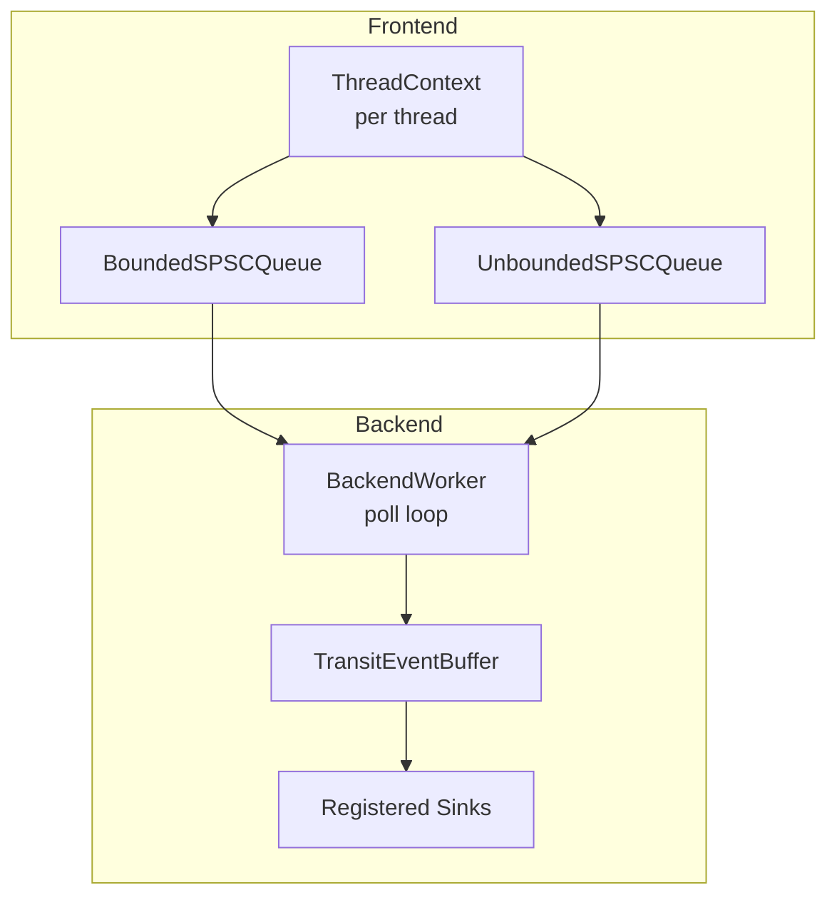
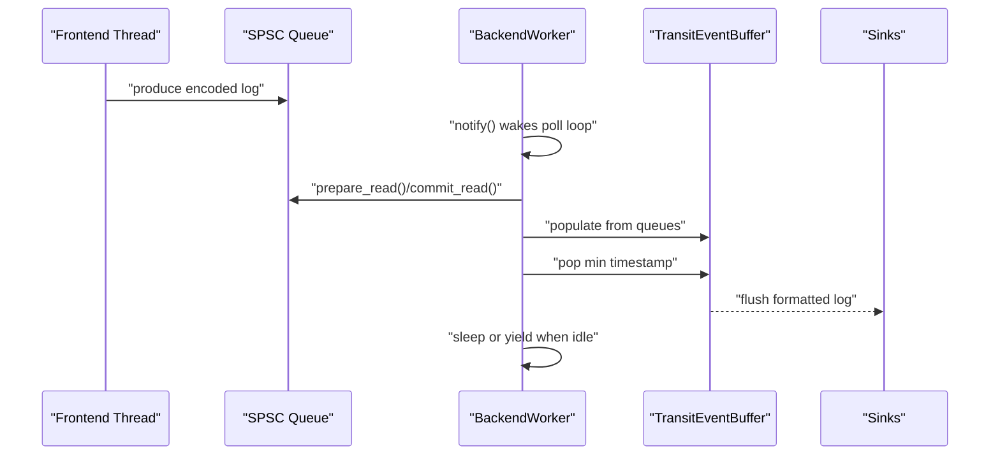
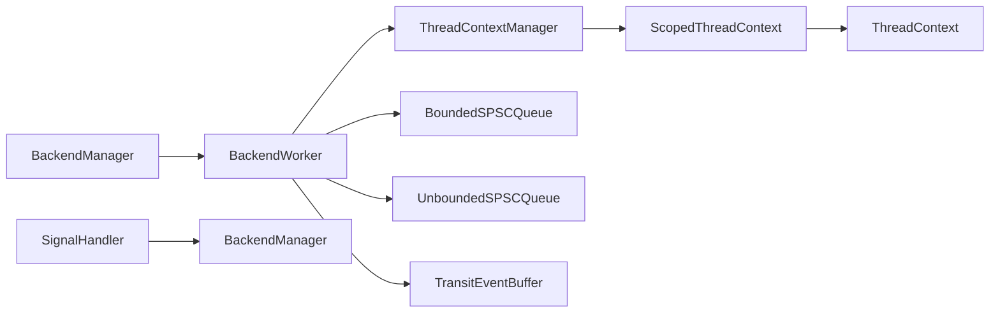

# Threading & Synchronization

<cite>
**Referenced Files in This Document**
- [BackendWorker.h](file://include/quill/backend/BackendWorker.h)
- [BackendWorkerLock.h](file://include/quill/backend/BackendWorkerLock.h)
- [BackendManager.h](file://include/quill/backend/BackendManager.h)
- [ThreadUtilities.h](file://include/quill/backend/ThreadUtilities.h)
- [ThreadContextManager.h](file://include/quill/core/ThreadContextManager.h)
- [BoundedSPSCQueue.h](file://include/quill/core/BoundedSPSCQueue.h)
- [UnboundedSPSCQueue.h](file://include/quill/core/UnboundedSPSCQueue.h)
- [TransitEventBuffer.h](file://include/quill/backend/TransitEventBuffer.h)
- [Spinlock.h](file://include/quill/core/Spinlock.h)
- [SignalHandler.h](file://include/quill/backend/SignalHandler.h)
- [backend_thread_notify.cpp](file://examples/backend_thread_notify.cpp)
- [signal_handler.cpp](file://examples/signal_handler.cpp)
- [MultiFrontendThreadsTest.cpp](file://test/integration_tests/MultiFrontendThreadsTest.cpp)
</cite>

## Table of Contents
1. [Introduction](#introduction)
2. [Project Structure](#project-structure)
3. [Core Components](#core-components)
4. [Architecture Overview](#architecture-overview)
5. [Detailed Component Analysis](#detailed-component-analysis)
6. [Dependency Analysis](#dependency-analysis)
7. [Performance Considerations](#performance-considerations)
8. [Troubleshooting Guide](#troubleshooting-guide)
9. [Conclusion](#conclusion)

## Introduction
This document explains threading and synchronization in Quill, focusing on race conditions, thread safety, and correct usage patterns. It covers:
- Producer-consumer via SPSC queues and the backend polling loop
- Thread-local context management and lifetime
- Backend thread lifecycle, signaling, and graceful shutdown
- Deadlock avoidance, synchronization analysis, and debugging strategies
- Practical examples and solutions for common pitfalls

## Project Structure
Quill separates concerns across frontend and backend:
- Frontend: per-thread logging calls produce encoded messages into SPSC queues
- Backend: a dedicated worker thread polls queues, orders messages, and flushes sinks
- Synchronization primitives: atomics, condition variables, spinlocks, and platform-specific thread utilities

**Diagram sources**
- [BackendWorker.h:305-395](file://include/quill/backend/BackendWorker.h#L305-L395)
- [ThreadContextManager.h:53-214](file://include/quill/core/ThreadContextManager.h#L53-L214)
- [BoundedSPSCQueue.h:105-169](file://include/quill/core/BoundedSPSCQueue.h#L105-L169)
- [UnboundedSPSCQueue.h:115-223](file://include/quill/core/UnboundedSPSCQueue.h#L115-L223)
- [TransitEventBuffer.h:22-107](file://include/quill/backend/TransitEventBuffer.h#L22-L107)

**Section sources**
- [BackendWorker.h:138-232](file://include/quill/backend/BackendWorker.h#L138-L232)
- [ThreadContextManager.h:216-338](file://include/quill/core/ThreadContextManager.h#L216-L338)

## Core Components
- BackendWorker: runs the logging thread, coordinates wake-up, polling, and flushing
- ThreadContextManager: maintains per-thread contexts and thread-local context creation
- SPSC queues: lock-free FIFO queues for producer-consumer messaging
- TransitEventBuffer: backend-side buffer for ordered processing
- SignalHandler: installs handlers to flush logs on fatal signals
- BackendWorkerLock: enforces a single backend worker per process

Key synchronization points:
- Wake-up: mutex + condition variable guarded by a wake-up flag
- Polling loop: periodic work with optional sleep/yield
- Thread-local context: thread-local wrapper with RAII invalidation
- SPSC queues: atomic positions with release/acquire semantics and batching

**Section sources**
- [BackendWorker.h:238-256](file://include/quill/backend/BackendWorker.h#L238-L256)
- [BackendWorker.h:305-395](file://include/quill/backend/BackendWorker.h#L305-L395)
- [ThreadContextManager.h:400-422](file://include/quill/core/ThreadContextManager.h#L400-L422)
- [BoundedSPSCQueue.h:123-169](file://include/quill/core/BoundedSPSCQueue.h#L123-L169)
- [UnboundedSPSCQueue.h:115-223](file://include/quill/core/UnboundedSPSCQueue.h#L115-L223)
- [TransitEventBuffer.h:72-107](file://include/quill/backend/TransitEventBuffer.h#L72-L107)
- [SignalHandler.h:154-248](file://include/quill/backend/SignalHandler.h#L154-L248)
- [BackendWorkerLock.h:50-103](file://include/quill/backend/BackendWorkerLock.h#L50-L103)

## Architecture Overview
The backend worker thread runs a tight loop:
- Initialize and optionally set CPU affinity and thread name
- Loop while running flag is true
- Update active thread contexts cache
- Populate TransitEventBuffer from all SPSC queues
- Process the minimum timestamp event or batch when needed
- On idle: flush sinks, resync TSC, check emptiness, sleep or yield
- On stop: drain queues, flush, cleanup

**Diagram sources**
- [BackendWorker.h:305-395](file://include/quill/backend/BackendWorker.h#L305-L395)
- [BackendWorker.h:479-573](file://include/quill/backend/BackendWorker.h#L479-L573)
- [BoundedSPSCQueue.h:147-169](file://include/quill/core/BoundedSPSCQueue.h#L147-L169)
- [UnboundedSPSCQueue.h:190-223](file://include/quill/core/UnboundedSPSCQueue.h#L190-L223)
- [TransitEventBuffer.h:72-107](file://include/quill/backend/TransitEventBuffer.h#L72-L107)

## Detailed Component Analysis

### Backend Worker Thread Lifecycle and Coordination
- Creation: starts a std::thread with run(options), sets running flag, waits until running
- Wake-up: notify() toggles a wake-up flag and notifies a condition variable
- Poll loop: _poll() updates caches, reads queues, processes events, flushes sinks, sleeps or yields
- Stop: stop() sets running=false, notify(), join, resets lock and thread id

Race conditions mitigated:
- Atomic running flag with acquire/release semantics
- Mutex-protected wake-up flag and condition variable
- Commit read/write in batches to reduce contention

Graceful shutdown:
- stop() ensures draining queues and flushing
- BackendManager resets start once_flag to allow restart

**Section sources**
- [BackendWorker.h:138-232](file://include/quill/backend/BackendWorker.h#L138-L232)
- [BackendWorker.h:305-395](file://include/quill/backend/BackendWorker.h#L305-L395)
- [BackendManager.h:74-81](file://include/quill/backend/BackendManager.h#L74-L81)

### SPSC Queues: Producer-Consumer Patterns
- BoundedSPSCQueue: fixed-capacity ring buffer with writer/reader positions and batching
- UnboundedSPSCQueue: linked list of nodes; grows by doubling capacity; supports shrinking

Concurrency model:
- Single producer, single consumer per queue
- Writer uses release semantics; reader uses acquire semantics
- Batched commit_read/write reduces atomic traffic
- Unbounded queue switches nodes atomically and commits before switching

Common pitfalls:
- Not calling finish_and_commit_write() after writing
- Attempting to shrink while consumer is still reading
- Exceeding maximum capacity in unbounded mode

**Section sources**
- [BoundedSPSCQueue.h:105-169](file://include/quill/core/BoundedSPSCQueue.h#L105-L169)
- [UnboundedSPSCQueue.h:115-223](file://include/quill/core/UnboundedSPSCQueue.h#L115-L223)
- [UnboundedSPSCQueue.h:244-297](file://include/quill/core/UnboundedSPSCQueue.h#L244-L297)

### Thread-Local Context Management
- ThreadContext: per-thread queue union and transient buffers
- ScopedThreadContext: thread-local RAII wrapper ensuring one context per thread
- ThreadContextManager: registers/unregisters contexts, tracks invalid ones, uses Spinlock

Thread-local storage issues:
- Ensure only one ScopedThreadContext per thread
- Destructors invalidate contexts; backend removes them after draining

**Section sources**
- [ThreadContextManager.h:53-214](file://include/quill/core/ThreadContextManager.h#L53-L214)
- [ThreadContextManager.h:340-422](file://include/quill/core/ThreadContextManager.h#L340-L422)
- [Spinlock.h:18-72](file://include/quill/core/Spinlock.h#L18-L72)

### Transit Event Buffer Ordering
- TransitEventBuffer is a circular buffer sized by powers of two
- Backend selects the event with the smallest timestamp among all queues
- Ensures strict ordering when grace period is enabled

Race conditions mitigated:
- Backend reads queues and decodes messages atomically
- Timestamp conversion and ordering checks prevent out-of-order writes

**Section sources**
- [TransitEventBuffer.h:22-107](file://include/quill/backend/TransitEventBuffer.h#L22-L107)
- [BackendWorker.h:576-755](file://include/quill/backend/BackendWorker.h#L576-L755)

### Backend Worker Lock and Singleton Enforcement
- BackendWorkerLock prevents duplicate backend workers per process using named mutex/semaphore
- Throws descriptive errors when duplicates are detected

**Section sources**
- [BackendWorkerLock.h:50-103](file://include/quill/backend/BackendWorkerLock.h#L50-L103)

### Signal Handling and Graceful Shutdown
- SignalHandler installs handlers for fatal signals and logs a final flush
- On Windows: console control and unhandled exception handlers
- On POSIX: alarm-based timeout to guarantee termination

**Section sources**
- [SignalHandler.h:154-248](file://include/quill/backend/SignalHandler.h#L154-L248)
- [SignalHandler.h:443-484](file://include/quill/backend/SignalHandler.h#L443-L484)

### Backend Wake-Up Mechanism
- notify() toggles a wake-up flag and condition variable
- Example shows manual wake-ups when sleep_duration is long

**Section sources**
- [BackendWorker.h:238-256](file://include/quill/backend/BackendWorker.h#L238-L256)
- [backend_thread_notify.cpp:25-55](file://examples/backend_thread_notify.cpp#L25-L55)

## Dependency Analysis

**Diagram sources**
- [BackendWorker.h:305-395](file://include/quill/backend/BackendWorker.h#L305-L395)
- [ThreadContextManager.h:216-338](file://include/quill/core/ThreadContextManager.h#L216-L338)
- [BackendManager.h:61-90](file://include/quill/backend/BackendManager.h#L61-L90)
- [SignalHandler.h:154-248](file://include/quill/backend/SignalHandler.h#L154-L248)

**Section sources**
- [BackendWorker.h:305-395](file://include/quill/backend/BackendWorker.h#L305-L395)
- [ThreadContextManager.h:216-338](file://include/quill/core/ThreadContextManager.h#L216-L338)
- [BackendManager.h:61-90](file://include/quill/backend/BackendManager.h#L61-L90)

## Performance Considerations
- SPSC queues minimize contention with atomic positions and batching
- Backend sleeps or yields when idle to reduce CPU usage
- TransitEventBuffer doubles capacity when full; request_shrink() on empty
- Avoid setting sleep_duration excessively high unless necessary

[No sources needed since this section provides general guidance]

## Troubleshooting Guide

### Race Conditions and Deadlocks
- Symptom: backend never wakes up
  - Ensure notify() is called from any thread and that the wake-up flag is reset properly
  - Verify sleep_duration is not excessively long without manual wake-ups
- Symptom: logs missing or out of order
  - Confirm grace period and timestamp ordering logic in backend
  - Ensure SPSC queues are finished and committed after writing
- Symptom: duplicate backend worker
  - Check BackendWorkerLock diagnostics and ensure consistent linking

**Section sources**
- [BackendWorker.h:238-256](file://include/quill/backend/BackendWorker.h#L238-L256)
- [BackendWorker.h:305-395](file://include/quill/backend/BackendWorker.h#L305-L395)
- [BackendWorkerLock.h:50-103](file://include/quill/backend/BackendWorkerLock.h#L50-L103)

### Deadlock Detection and Prevention
- Use condition variable with a wake-up flag guarded by a mutex
- Avoid holding locks across notify() calls
- Keep notify() lightweight; do heavy work in the poll loop

**Section sources**
- [BackendWorker.h:372-382](file://include/quill/backend/BackendWorker.h#L372-L382)

### Debugging Multi-threaded Scenarios
- Enable assertions to catch invalid queue states and thread-local misuse
- Use tests that spawn many frontend threads to validate correctness
- Example: MultiFrontendThreadsTest validates concurrent logging across threads

**Section sources**
- [MultiFrontendThreadsTest.cpp:17-94](file://test/integration_tests/MultiFrontendThreadsTest.cpp#L17-L94)

### Correct Usage Patterns
- Producer-consumer
  - Use UnboundedSPSCQueue::finish_and_commit_write() after writing
  - Use BoundedSPSCQueue::commit_write() after finishing reads
- Thread-local context
  - Create one ScopedThreadContext per thread; do not mix FrontendOptions
- Backend wake-ups
  - Call Backend::notify() when sleep_duration is long
- Signal handling
  - Install handlers early; on Windows install per thread

**Section sources**
- [UnboundedSPSCQueue.h:115-149](file://include/quill/core/UnboundedSPSCQueue.h#L115-L149)
- [BoundedSPSCQueue.h:123-169](file://include/quill/core/BoundedSPSCQueue.h#L123-L169)
- [ThreadContextManager.h:340-422](file://include/quill/core/ThreadContextManager.h#L340-L422)
- [backend_thread_notify.cpp:25-55](file://examples/backend_thread_notify.cpp#L25-L55)
- [signal_handler.cpp:45-67](file://examples/signal_handler.cpp#L45-L67)

## Conclusion
Quill’s threading model relies on:
- Lock-free SPSC queues for high-throughput producer-consumer
- A dedicated backend worker thread coordinating wake-ups, ordering, and flushing
- Carefully designed synchronization primitives and RAII wrappers to manage thread lifetimes

By following the correct usage patterns—ensuring proper queue completion, respecting thread-local context rules, and using notify() appropriately—you can avoid race conditions, deadlocks, and ordering issues while achieving efficient, scalable logging.