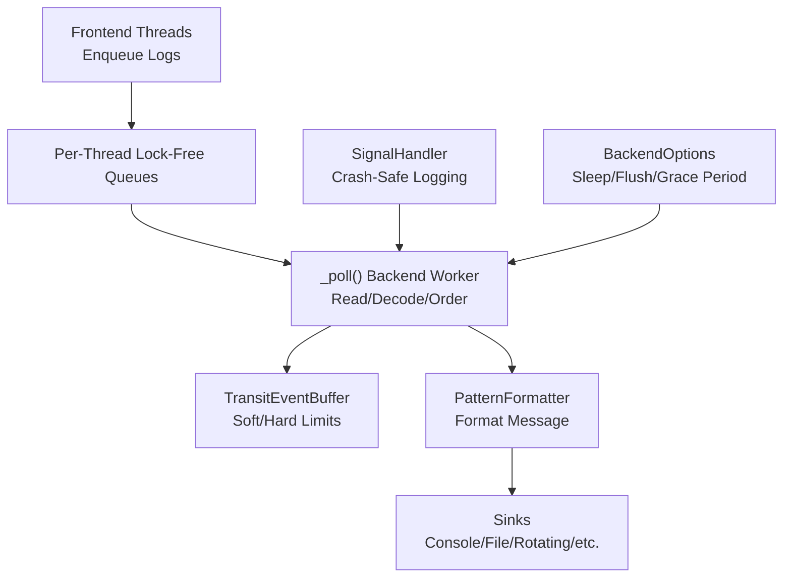
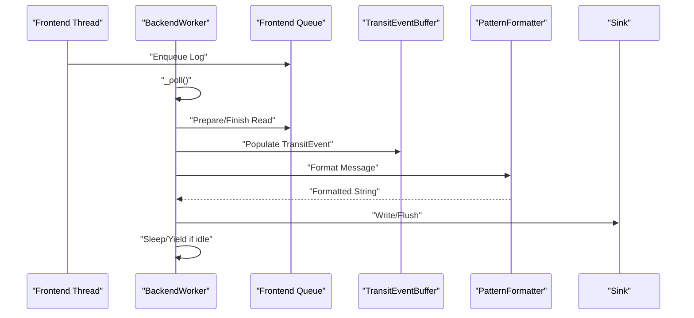
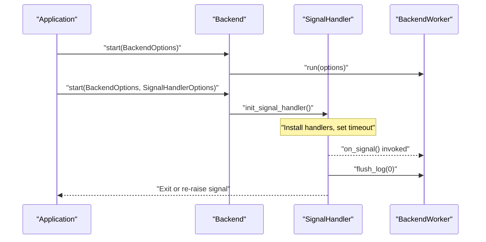
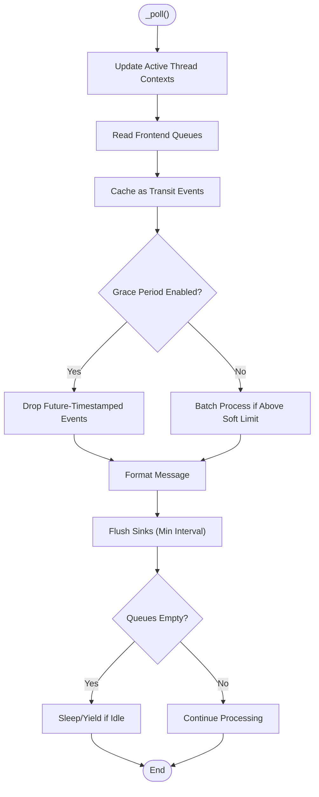
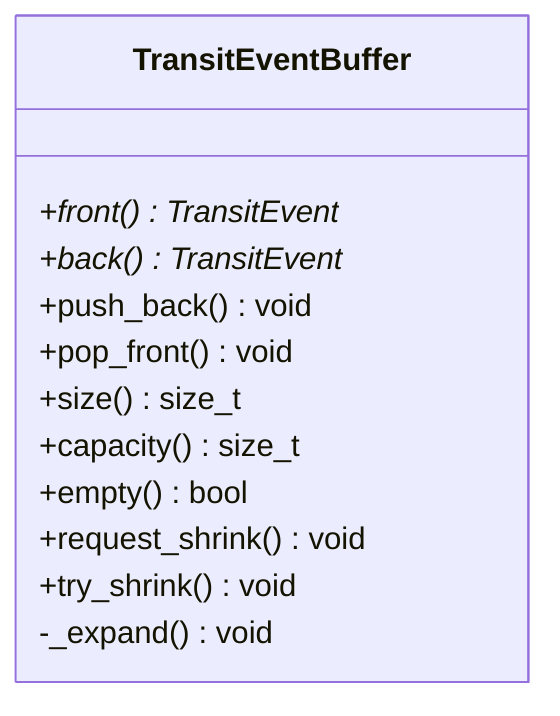
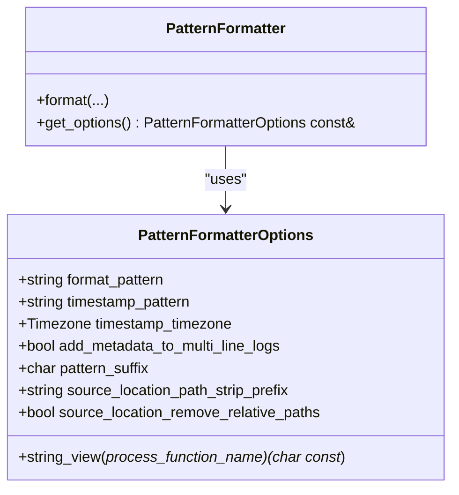
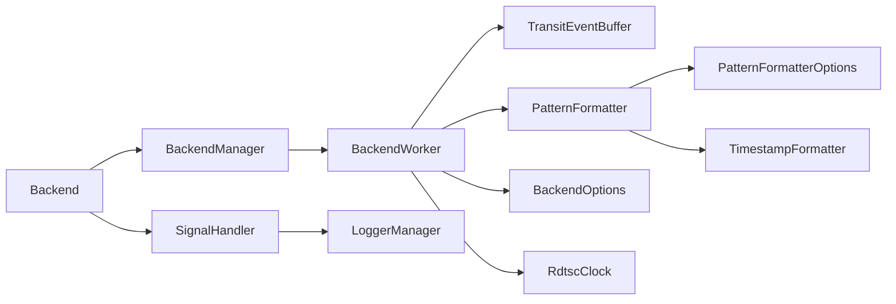

# Debugging Techniques

<cite>
**Referenced Files in This Document**
- [Backend.h](file://include/quill/Backend.h)
- [BackendWorker.h](file://include/quill/backend/BackendWorker.h)
- [BackendOptions.h](file://include/quill/backend/BackendOptions.h)
- [SignalHandler.h](file://include/quill/backend/SignalHandler.h)
- [PatternFormatter.h](file://include/quill/backend/PatternFormatter.h)
- [PatternFormatterOptions.h](file://include/quill/core/PatternFormatterOptions.h)
- [TransitEventBuffer.h](file://include/quill/backend/TransitEventBuffer.h)
- [StopWatch.h](file://include/quill/StopWatch.h)
- [signal_handler.cpp](file://examples/signal_handler.cpp)
- [backend_thread_notify.cpp](file://examples/backend_thread_notify.cpp)
- [stopwatch.cpp](file://examples/stopwatch.cpp)
- [custom_frontend_options.cpp](file://examples/custom_frontend_options.cpp)
- [SignalHandlerTest.cpp](file://test/integration_tests/SignalHandlerTest.cpp)
- [BackendExceptionNotifierTest.cpp](file://test/integration_tests/BackendExceptionNotifierTest.cpp)
- [TransitEventBufferTest.cpp](file://test/unit_tests/TransitEventBufferTest.cpp)
</cite>

## Table of Contents
1. [Introduction](#introduction)
2. [Project Structure](#project-structure)
3. [Core Components](#core-components)
4. [Architecture Overview](#architecture-overview)
5. [Detailed Component Analysis](#detailed-component-analysis)
6. [Dependency Analysis](#dependency-analysis)
7. [Performance Considerations](#performance-considerations)
8. [Troubleshooting Guide](#troubleshooting-guide)
9. [Conclusion](#conclusion)
10. [Appendices](#appendices)

## Introduction
This document provides a comprehensive guide to debugging Quill logging issues and performance problems. It explains techniques for log analysis, performance profiling, and memory debugging, and documents systematic diagnostic workflows for identifying bottlenecks, message loss, and formatting issues. It covers signal handler debugging, crash-safe logging verification, backend thread monitoring, and practical examples such as immediate flush for debugging, log message inspection, and timestamp analysis. It also outlines debugging tools, logging infrastructure validation, and production debugging strategies with step-by-step troubleshooting procedures.

## Project Structure
Quill’s logging pipeline consists of:
- Frontend threads enqueue log messages into lock-free queues.
- A dedicated backend worker thread drains queues, orders messages by timestamp, formats them, and writes to sinks.
- Optional signal handlers capture fatal signals and ensure logs are flushed before termination.
- Formatting and sinks are configurable via options and pattern formatters.

**Diagram sources**
- [BackendWorker.h:305-395](file://include/quill/backend/BackendWorker.h#L305-L395)
- [TransitEventBuffer.h:19-162](file://include/quill/backend/TransitEventBuffer.h#L19-L162)
- [PatternFormatter.h:97-177](file://include/quill/backend/PatternFormatter.h#L97-L177)
- [BackendOptions.h:30-283](file://include/quill/backend/BackendOptions.h#L30-L283)
- [SignalHandler.h:154-248](file://include/quill/backend/SignalHandler.h#L154-L248)

**Section sources**
- [BackendWorker.h:138-207](file://include/quill/backend/BackendWorker.h#L138-L207)
- [BackendOptions.h:30-283](file://include/quill/backend/BackendOptions.h#L30-L283)

## Core Components
- Backend lifecycle and thread control:
  - Start/stop backend, notify, and thread ID retrieval.
  - Optional integrated signal handler setup.
- Backend worker:
  - Poll loop, queue draining, timestamp ordering, formatting, sink flushing, and idle behavior.
- Backend options:
  - Tunables for thread name, sleep duration, yield, transit buffer limits, flush intervals, and error notifier hooks.
- Signal handler:
  - Cross-platform signal handling with crash-safe logging and timeout protection.
- Pattern formatter:
  - Configurable format patterns and attributes for structured logs.
- Transit event buffer:
  - Circular buffer with dynamic growth and shrink-to-initial-capacity behavior.
- Stopwatch utilities:
  - High-resolution timing using TSC or system clock for performance measurements.

**Section sources**
- [Backend.h:36-171](file://include/quill/Backend.h#L36-L171)
- [BackendWorker.h:138-207](file://include/quill/backend/BackendWorker.h#L138-L207)
- [BackendOptions.h:30-283](file://include/quill/backend/BackendOptions.h#L30-L283)
- [SignalHandler.h:50-138](file://include/quill/backend/SignalHandler.h#L50-L138)
- [PatternFormatter.h:79-177](file://include/quill/backend/PatternFormatter.h#L79-L177)
- [TransitEventBuffer.h:19-162](file://include/quill/backend/TransitEventBuffer.h#L19-L162)
- [StopWatch.h:44-126](file://include/quill/StopWatch.h#L44-L126)

## Architecture Overview
The backend worker orchestrates the logging pipeline:
- Initializes options, sets thread name/affinity, marks running, and enters the main loop.
- Updates active thread contexts, reads frontend queues, decodes messages, and caches as transit events.
- Applies strict timestamp ordering with a grace period to prevent out-of-order writes.
- Formats and flushes to sinks respecting minimum flush intervals.
- Sleeps or yields when idle, honoring wake-up notifications.

**Diagram sources**
- [BackendWorker.h:305-395](file://include/quill/backend/BackendWorker.h#L305-L395)
- [TransitEventBuffer.h:72-107](file://include/quill/backend/TransitEventBuffer.h#L72-L107)
- [PatternFormatter.h:97-177](file://include/quill/backend/PatternFormatter.h#L97-L177)

**Section sources**
- [BackendWorker.h:305-395](file://include/quill/backend/BackendWorker.h#L305-L395)

## Detailed Component Analysis

### Backend Lifecycle and Signal Handler
- Backend::start supports:
  - Starting the backend thread with BackendOptions.
  - Overload enabling integrated signal handler with SignalHandlerOptions.
- Backend::stop:
  - Clears backend thread ID, stops backend thread, and deinitializes signal handler.
- Signal handler:
  - On fatal signals, logs crash details, flushes logs, and optionally re-raises the signal.
  - On Windows, installs console control and exception handlers.
  - Uses a lock to serialize first entry and an alarm for timeouts on POSIX.

**Diagram sources**
- [Backend.h:36-130](file://include/quill/Backend.h#L36-L130)
- [SignalHandler.h:154-248](file://include/quill/backend/SignalHandler.h#L154-L248)

**Section sources**
- [Backend.h:36-130](file://include/quill/Backend.h#L36-L130)
- [SignalHandler.h:50-138](file://include/quill/backend/SignalHandler.h#L50-L138)

### Backend Worker Poll Loop and Ordering
- _poll():
  - Updates active thread contexts, reads queues, decodes messages, and caches as transit events.
  - Applies strict timestamp ordering with a grace period to avoid out-of-order writes.
  - Processes a single event when below soft limit, batches when exceeding soft limit.
  - Flushes sinks with minimum interval, resyncs TSC clock, and sleeps/yields when idle.
- Error handling:
  - Wraps poll hooks and processing in try/catch blocks, forwarding exceptions to error_notifier.

**Diagram sources**
- [BackendWorker.h:305-395](file://include/quill/backend/BackendWorker.h#L305-L395)

**Section sources**
- [BackendWorker.h:305-395](file://include/quill/backend/BackendWorker.h#L305-L395)

### Transit Event Buffer and Memory Behavior
- Circular buffer with power-of-two capacity, expanding on demand and shrinking to initial capacity when empty.
- Supports push_back()/pop_front() with reader/writer positions and mask arithmetic.
- Tests validate correctness under stress, reallocation, shrink/regrow, and interleaved operations.

**Diagram sources**
- [TransitEventBuffer.h:19-162](file://include/quill/backend/TransitEventBuffer.h#L19-L162)

**Section sources**
- [TransitEventBuffer.h:19-162](file://include/quill/backend/TransitEventBuffer.h#L19-L162)
- [TransitEventBufferTest.cpp:16-122](file://test/unit_tests/TransitEventBufferTest.cpp#L16-L122)

### Pattern Formatter and Log Formatting
- PatternFormatterOptions controls format pattern, timestamp pattern/timezone, multi-line metadata, suffix, and path processing.
- PatternFormatter converts a log statement into a formatted string using attributes such as time, logger, level, thread, file, line, message, tags, and named args.
- Supports multi-line formatting and optional metadata injection.

**Diagram sources**
- [PatternFormatterOptions.h:23-170](file://include/quill/core/PatternFormatterOptions.h#L23-L170)
- [PatternFormatter.h:79-177](file://include/quill/backend/PatternFormatter.h#L79-L177)

**Section sources**
- [PatternFormatterOptions.h:23-170](file://include/quill/core/PatternFormatterOptions.h#L23-L170)
- [PatternFormatter.h:97-177](file://include/quill/backend/PatternFormatter.h#L97-L177)

### Backend Options and Performance Tunables
Key tunables for debugging and performance:
- thread_name, enable_yield_when_idle, sleep_duration
- transit_event_buffer_initial_capacity, transit_events_soft_limit, transit_events_hard_limit
- log_timestamp_ordering_grace_period
- wait_for_queues_to_empty_before_exit
- cpu_affinity
- backend_worker_on_poll_begin/end hooks
- rdtsc_resync_interval
- sink_min_flush_interval
- check_printable_char
- error_notifier

These options influence throughput, latency, ordering correctness, and crash-safe flushing.

**Section sources**
- [BackendOptions.h:30-283](file://include/quill/backend/BackendOptions.h#L30-L283)

### Stopwatch Utilities for Performance Measurement
- StopWatchTsc and StopWatchChrono measure elapsed time using TSC or steady_clock.
- Useful for diagnosing hot-path latencies and validating performance improvements.

**Section sources**
- [StopWatch.h:44-126](file://include/quill/StopWatch.h#L44-L126)
- [stopwatch.cpp:24-50](file://examples/stopwatch.cpp#L24-L50)

## Dependency Analysis
- Backend depends on BackendManager and BackendWorker.
- BackendWorker depends on:
  - ThreadContextManager, LoggerManager, SinkManager
  - TransitEventBuffer, PatternFormatter, TimestampFormatter
  - BackendOptions, RdtscClock
- SignalHandler depends on LoggerManager and LoggerBase.
- PatternFormatter depends on TimestampFormatter and PatternFormatterOptions.

**Diagram sources**
- [Backend.h:29-171](file://include/quill/Backend.h#L29-L171)
- [BackendWorker.h:77-133](file://include/quill/backend/BackendWorker.h#L77-L133)
- [PatternFormatter.h:79-177](file://include/quill/backend/PatternFormatter.h#L79-L177)
- [BackendOptions.h:30-283](file://include/quill/backend/BackendOptions.h#L30-L283)
- [SignalHandler.h:93-138](file://include/quill/backend/SignalHandler.h#L93-L138)

**Section sources**
- [BackendWorker.h:77-133](file://include/quill/backend/BackendWorker.h#L77-L133)
- [PatternFormatter.h:79-177](file://include/quill/backend/PatternFormatter.h#L79-L177)
- [SignalHandler.h:93-138](file://include/quill/backend/SignalHandler.h#L93-L138)

## Performance Considerations
- Reduce sleep_duration and increase transit event limits for lower latency under moderate load.
- Use log_timestamp_ordering_grace_period judiciously; larger values improve ordering but may reduce throughput.
- Enable backend_worker_on_poll_begin/end hooks for instrumentation (e.g., profiling tools).
- Monitor sink_min_flush_interval to balance I/O pressure and freshness.
- Use StopWatch utilities to measure hot-path latencies and validate improvements.

[No sources needed since this section provides general guidance]

## Troubleshooting Guide

### Immediate Flush for Debugging
- Use logger->flush_log() to force immediate write to sinks.
- For crash-safe verification, enable signal handler and ensure logs flush on fatal signals.

**Section sources**
- [signal_handler.cpp:50-56](file://examples/signal_handler.cpp#L50-L56)
- [SignalHandlerTest.cpp:92-94](file://test/integration_tests/SignalHandlerTest.cpp#L92-L94)

### Log Message Inspection and Timestamp Analysis
- Inspect formatted messages via PatternFormatterOptions and attributes.
- Use StopWatch utilities to correlate timing with log entries.

**Section sources**
- [PatternFormatterOptions.h:68-112](file://include/quill/core/PatternFormatterOptions.h#L68-L112)
- [PatternFormatter.h:97-177](file://include/quill/backend/PatternFormatter.h#L97-L177)
- [stopwatch.cpp:24-50](file://examples/stopwatch.cpp#L24-L50)

### Backend Thread Monitoring
- Check Backend::is_running() and Backend::get_thread_id().
- Use Backend::notify() to wake backend when sleep_duration is long.

**Section sources**
- [Backend.h:159-171](file://include/quill/Backend.h#L159-L171)
- [backend_thread_notify.cpp:25-55](file://examples/backend_thread_notify.cpp#L25-L55)

### Signal Handler Debugging and Crash-Safe Logging
- Validate signal handler installation and timeout behavior.
- Ensure logger_name and excluded_logger_substrings are configured appropriately.
- On Windows, install signal handler per thread.

**Section sources**
- [SignalHandler.h:50-88](file://include/quill/backend/SignalHandler.h#L50-L88)
- [signal_handler.cpp:45-48](file://examples/signal_handler.cpp#L45-L48)

### Memory Debugging and Transit Buffer Behavior
- Validate buffer expansion, shrink-to-initial-capacity, and interleaved push/pop operations.
- Stress-test with large formatted messages and repeated reallocations.

**Section sources**
- [TransitEventBufferTest.cpp:125-194](file://test/unit_tests/TransitEventBufferTest.cpp#L125-L194)
- [TransitEventBufferTest.cpp:197-284](file://test/unit_tests/TransitEventBufferTest.cpp#L197-L284)
- [TransitEventBufferTest.cpp:566-641](file://test/unit_tests/TransitEventBufferTest.cpp#L566-L641)

### Backend Exception Notifier and Error Handling
- Configure error_notifier to capture backend exceptions and invalid configurations.
- Use backend_worker_on_poll_begin/end hooks to detect instrumentation errors.

**Section sources**
- [BackendExceptionNotifierTest.cpp:73-84](file://test/integration_tests/BackendExceptionNotifierTest.cpp#L73-L84)
- [BackendOptions.h:170-178](file://include/quill/backend/BackendOptions.h#L170-L178)

### Production Debugging Strategies
- Increase verbosity temporarily with custom FrontendOptions (bounded dropping queues, larger capacities).
- Reduce sleep_duration and adjust flush intervals for responsiveness.
- Enable strict timestamp ordering only when necessary; tune grace period to balance correctness and throughput.
- Instrument backend polling with hooks for profiling.

**Section sources**
- [custom_frontend_options.cpp:14-27](file://examples/custom_frontend_options.cpp#L14-L27)
- [BackendOptions.h:49-132](file://include/quill/backend/BackendOptions.h#L49-L132)
- [BackendOptions.h:185-192](file://include/quill/backend/BackendOptions.h#L185-L192)

## Conclusion
This guide outlined practical debugging techniques for Quill, covering log analysis, performance profiling, memory behavior, signal handling, and backend thread monitoring. By leveraging BackendOptions, PatternFormatter, TransitEventBuffer, and StopWatch utilities, developers can systematically diagnose bottlenecks, message loss, and formatting issues. The examples and tests provide reproducible scenarios for validating fixes and ensuring crash-safe logging in production.

[No sources needed since this section summarizes without analyzing specific files]

## Appendices

### Step-by-Step: Diagnose Out-of-Order Logs
1. Enable strict timestamp ordering by setting log_timestamp_ordering_grace_period to a small positive value.
2. Observe backend logs for messages being dropped due to future timestamps.
3. Adjust grace_period or reduce contention on hot threads to improve ordering.

**Section sources**
- [BackendWorker.h:631-668](file://include/quill/backend/BackendWorker.h#L631-L668)
- [BackendOptions.h:132-132](file://include/quill/backend/BackendOptions.h#L132-L132)

### Step-by-Step: Investigate Message Loss
1. Confirm wait_for_queues_to_empty_before_exit behavior during shutdown.
2. Verify transit_events_soft_limit and transit_events_hard_limit are appropriate for workload.
3. Check error_notifier for queue-full or allocation-related errors.

**Section sources**
- [BackendOptions.h:145-145](file://include/quill/backend/BackendOptions.h#L145-L145)
- [BackendOptions.h:75-92](file://include/quill/backend/BackendOptions.h#L75-L92)
- [BackendExceptionNotifierTest.cpp:73-84](file://test/integration_tests/BackendExceptionNotifierTest.cpp#L73-L84)

### Step-by-Step: Validate Crash-Safe Logging
1. Start backend with SignalHandlerOptions and configure logger_name and excluded_logger_substrings.
2. Trigger a fatal signal from a frontend thread and verify logs are flushed.
3. On Windows, ensure per-thread signal handler installation.

**Section sources**
- [SignalHandlerTest.cpp:36-39](file://test/integration_tests/SignalHandlerTest.cpp#L36-L39)
- [signal_handler.cpp:45-48](file://examples/signal_handler.cpp#L45-L48)

### Step-by-Step: Measure Hot-Path Latency
1. Use StopWatchTsc to measure elapsed time around logging calls.
2. Compare with StopWatchChrono to validate clock source differences.
3. Correlate with formatted timestamps for end-to-end latency.

**Section sources**
- [StopWatch.h:44-126](file://include/quill/StopWatch.h#L44-L126)
- [stopwatch.cpp:24-50](file://examples/stopwatch.cpp#L24-L50)