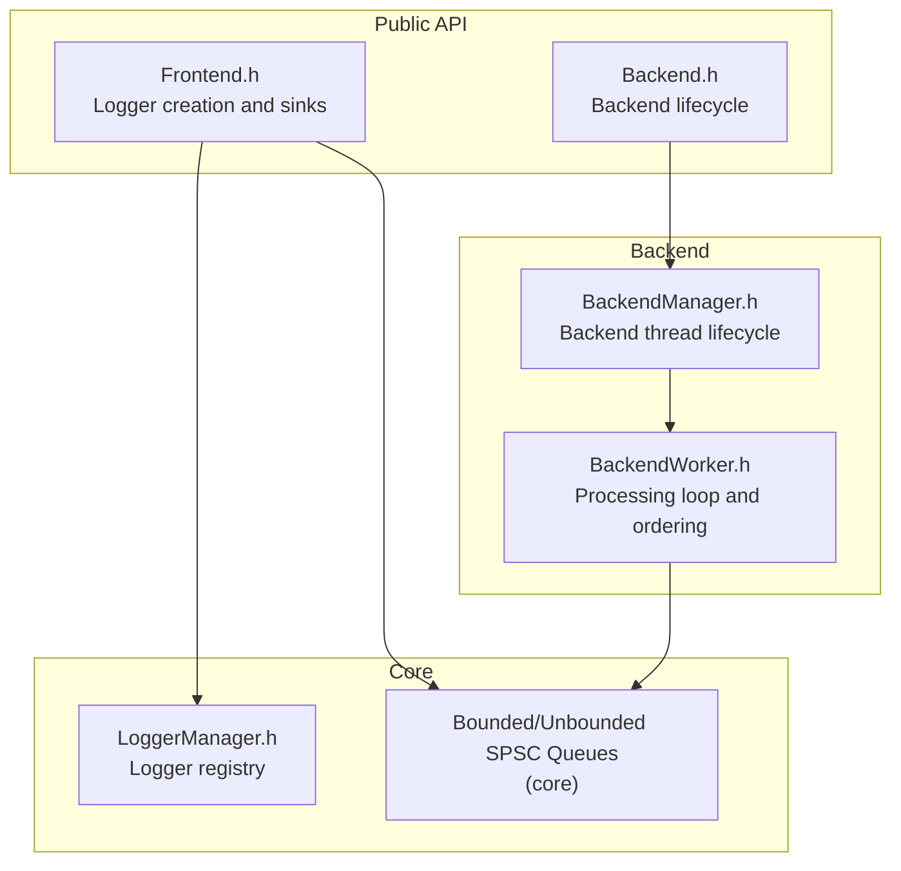
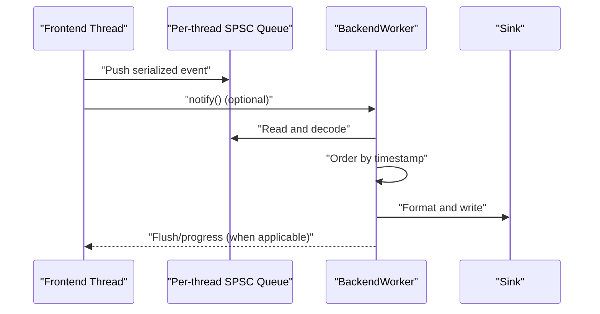
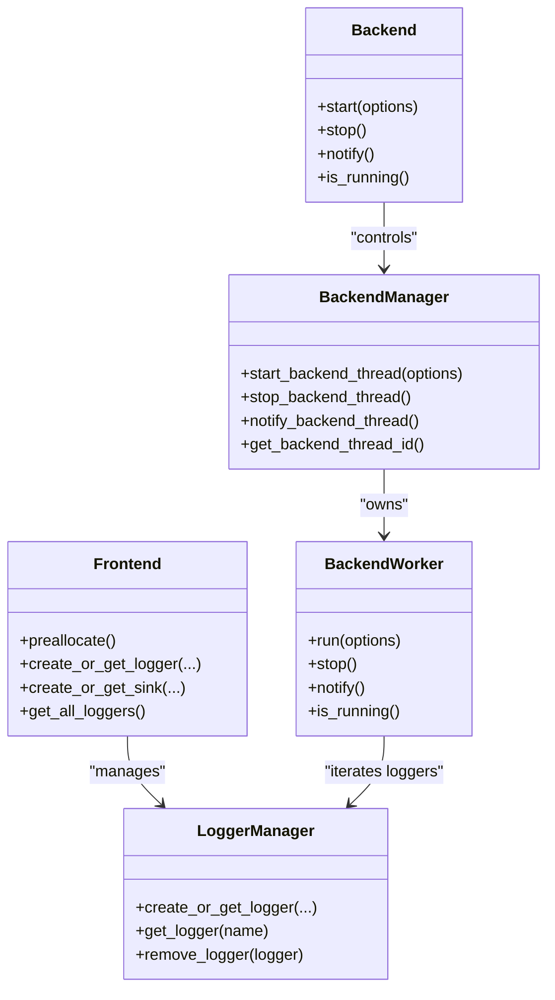

# Troubleshooting & FAQ

<cite>
**Referenced Files in This Document**
- [README.md](file://README.md)
- [faq.rst](file://docs/faq.rst)
- [installing.rst](file://docs/installing.rst)
- [macro_free_mode.rst](file://docs/macro_free_mode.rst)
- [wide_strings.rst](file://docs/wide_strings.rst)
- [Backend.h](file://include/quill/Backend.h)
- [Frontend.h](file://include/quill/Frontend.h)
- [BackendManager.h](file://include/quill/backend/BackendManager.h)
- [BackendWorker.h](file://include/quill/backend/BackendWorker.h)
- [LoggerManager.h](file://include/quill/core/LoggerManager.h)
- [recommended_usage.cpp](file://examples/recommended_usage/recommended_usage.cpp)
- [console_logging.cpp](file://examples/console_logging.cpp)
- [file_logging.cpp](file://examples/file_logging.cpp)
- [filter_logging.cpp](file://examples/filter_logging.cpp)
- [custom_frontend_options.cpp](file://examples/custom_frontend_options.cpp)
</cite>

## Table of Contents
1. [Introduction](#introduction)
2. [Project Structure](#project-structure)
3. [Core Components](#core-components)
4. [Architecture Overview](#architecture-overview)
5. [Detailed Component Analysis](#detailed-component-analysis)
6. [Dependency Analysis](#dependency-analysis)
7. [Performance Considerations](#performance-considerations)
8. [Troubleshooting Guide](#troubleshooting-guide)
9. [Conclusion](#conclusion)
10. [Appendices](#appendices)

## Introduction
This document provides a comprehensive troubleshooting and FAQ guide for Quill, focusing on diagnosing and resolving performance issues (latency, memory, throughput), threading and synchronization problems, logging and profiling techniques, configuration and build issues, and platform-specific caveats. It also covers macro-free mode trade-offs, wide string handling, and production best practices.

## Project Structure
Quill is organized into:
- Public headers for frontend and backend APIs
- Core components for queues, logging managers, and utilities
- Backend worker and managers coordinating the background thread
- Examples and documentation covering usage, performance, and platform specifics

**Diagram sources**
- [Frontend.h](file://include/quill/Frontend.h)
- [Backend.h](file://include/quill/Backend.h)
- [BackendManager.h](file://include/quill/backend/BackendManager.h)
- [BackendWorker.h](file://include/quill/backend/BackendWorker.h)
- [LoggerManager.h](file://include/quill/core/LoggerManager.h)

**Section sources**
- [README.md](file://README.md)
- [installing.rst](file://docs/installing.rst)

## Core Components
- Frontend: lightweight API for creating sinks and loggers, preallocation, and queue introspection.
- Backend: controls the single backend worker thread, notifications, and lifecycle.
- BackendManager: holds the backend worker instance and exposes thread control and notifications.
- BackendWorker: main processing loop, timestamp ordering, formatting, sink dispatch, and idle behavior.
- LoggerManager: registry of loggers with thread-safe access and removal semantics.

Key responsibilities:
- Frontend: minimize hot-path overhead; use preallocate to warm thread-local structures.
- Backend: ensure timely processing; tune sleep/idle behavior; use notify for manual wake-up.
- BackendWorker: enforce strict timestamp ordering; batch processing; failure counters and checks.

**Section sources**
- [Frontend.h](file://include/quill/Frontend.h)
- [Backend.h](file://include/quill/Backend.h)
- [BackendManager.h](file://include/quill/backend/BackendManager.h)
- [BackendWorker.h](file://include/quill/backend/BackendWorker.h)
- [LoggerManager.h](file://include/quill/core/LoggerManager.h)

## Architecture Overview
Quill uses a single backend thread to process all frontend-queued messages. Frontends push serialized log events into per-thread SPSC queues. The backend:
- Polls queues and caches events
- Orders by timestamp (with grace period)
- Formats and forwards to sinks
- Flushes and cleans up on stop or idle periods

**Diagram sources**
- [BackendWorker.h](file://include/quill/backend/BackendWorker.h)
- [Backend.h](file://include/quill/Backend.h)

**Section sources**
- [README.md](file://README.md)
- [BackendWorker.h](file://include/quill/backend/BackendWorker.h)

## Detailed Component Analysis

### Threading Model and Synchronization
- Single backend thread: designed for low latency; timestamp ordering is maintained globally.
- Frontend queues are lock-free; backend batches reads to improve throughput.
- BackendWorker uses condition variables and flags to wake/idle; sleep duration and yield policies can be tuned.
- Logger removal is asynchronous; use blocking removal when changing sinks or closing files.

Common pitfalls:
- Calling logger removal from multiple threads concurrently.
- Expecting synchronous behavior without immediate flush.
- Not preallocating thread-local structures in high-contention scenarios.

**Section sources**
- [BackendWorker.h](file://include/quill/backend/BackendWorker.h)
- [Frontend.h](file://include/quill/Frontend.h)
- [faq.rst](file://docs/faq.rst)

### Performance: Latency, Memory, Throughput
- Latency: macro-based logging minimizes hot-path overhead; macro-free mode adds runtime metadata and argument evaluation costs.
- Memory: unbounded queues expand under load; monitor thread-local queue capacity and shrink when appropriate.
- Throughput: single backend thread; tune sleep/idle behavior and consider manual notify for infrequent logging.

Diagnostic tips:
- Use immediate flush in development to detect ordering and backend stalls.
- Monitor queue capacities and adjust FrontendOptions for bounded/dropping vs unbounded.
- Profile backend sleep/idle settings to balance CPU usage vs latency.

**Section sources**
- [macro_free_mode.rst](file://docs/macro_free_mode.rst)
- [Frontend.h](file://include/quill/Frontend.h)
- [faq.rst](file://docs/faq.rst)

### Logging and Formatting Pipeline
- Frontend serializes metadata and arguments; backend decodes, formats, and dispatches.
- Named arguments and runtime metadata are supported; backend caches templates for performance.
- Timestamps can be TSC, system, or user-defined; TSC requires lazy calibration.

**Section sources**
- [BackendWorker.h](file://include/quill/backend/BackendWorker.h)

### Filters and Conditional Logging
- Sink-level filters can reduce backend workload by dropping messages early.
- Logger-level log level controls whether messages are enqueued.

**Section sources**
- [filter_logging.cpp](file://examples/filter_logging.cpp)
- [file_logging.cpp](file://examples/file_logging.cpp)

### Platform and Build Notes
- Recommended usage: build backend once into a static library and include only frontend headers in application code.
- Android: may require disabling thread name support; use system clock for signal handler stability.
- Wide strings: Windows supports ASCII-encoded wide strings; non-ASCII defaults to hex escapes unless backend sanitization is disabled.

**Section sources**
- [recommended_usage.cpp](file://examples/recommended_usage/recommended_usage.cpp)
- [installing.rst](file://docs/installing.rst)
- [wide_strings.rst](file://docs/wide_strings.rst)
- [README.md](file://README.md)

## Dependency Analysis

**Diagram sources**
- [Frontend.h](file://include/quill/Frontend.h)
- [Backend.h](file://include/quill/Backend.h)
- [BackendManager.h](file://include/quill/backend/BackendManager.h)
- [BackendWorker.h](file://include/quill/backend/BackendWorker.h)
- [LoggerManager.h](file://include/quill/core/LoggerManager.h)

**Section sources**
- [Frontend.h](file://include/quill/Frontend.h)
- [Backend.h](file://include/quill/Backend.h)
- [BackendManager.h](file://include/quill/backend/BackendManager.h)
- [BackendWorker.h](file://include/quill/backend/BackendWorker.h)
- [LoggerManager.h](file://include/quill/core/LoggerManager.h)

## Performance Considerations
- Prefer macro-based logging for hot paths; macro-free mode simplifies code but adds overhead.
- Use unbounded queues in production for reliability; monitor and shrink when safe.
- Tune BackendOptions: sleep duration, yield policy, and transit event limits.
- Avoid frequent backend thread initialization in tests; prefer system clock to skip TSC calibration.
- Use immediate flush sparingly; it blocks callers and reduces throughput.

[No sources needed since this section provides general guidance]

## Troubleshooting Guide

### Performance Problems
- High latency
  - Verify macro-based logging is used in hot paths.
  - Ensure Frontend::preallocate is called during thread initialization.
  - Reduce formatting overhead by minimizing complex types and large strings.
  - Consider immediate flush only for debugging.

- High memory usage
  - Switch to bounded/dropping queues for constrained environments.
  - Monitor thread-local queue capacity and shrink when appropriate.
  - Review FrontendOptions for queue sizing and max capacity.

- Low throughput
  - Single backend thread is intentional; batching and ordering dominate.
  - Increase sleep duration or use manual notify for infrequent logging.
  - Disable unnecessary sinks or filters to reduce I/O.

**Section sources**
- [macro_free_mode.rst](file://docs/macro_free_mode.rst)
- [Frontend.h](file://include/quill/Frontend.h)
- [faq.rst](file://docs/faq.rst)

### Threading Issues and Race Conditions
- BackendWorker is single-threaded; do not call logger->flush_log() from the manual worker thread if using the built-in worker.
- Logger removal must be invoked by a single thread; concurrent removals are unsafe.
- Avoid fork() with multithreading; start backend after fork and write to distinct files.

**Section sources**
- [Backend.h](file://include/quill/Backend.h)
- [Frontend.h](file://include/quill/Frontend.h)
- [README.md](file://README.md)

### Logging-Related Problems
- Messages missing or out of order
  - Ensure strict timestamp ordering is not violated by excessive clock drift.
  - Confirm grace period settings and clock sources are consistent.

- Immediate flush behavior
  - Use logger->set_immediate_flush(1) to block until backend writes; only for debugging.

- Sink filtering not taking effect
  - Verify sink-level filters and logger-level log levels.

**Section sources**
- [BackendWorker.h](file://include/quill/backend/BackendWorker.h)
- [file_logging.cpp](file://examples/file_logging.cpp)
- [filter_logging.cpp](file://examples/filter_logging.cpp)

### Configuration and Build Problems
- Installation and linking
  - Use find_package() or embedded subdirectory as documented.
  - For custom installs, set CMAKE_PREFIX_PATH appropriately.

- Recommended usage pattern
  - Build backend into a static library; include only Logger.h and LogMacros.h in application code.

- Android
  - Disable thread name support if needed; use system clock for signal handler stability.

**Section sources**
- [installing.rst](file://docs/installing.rst)
- [recommended_usage.cpp](file://examples/recommended_usage/recommended_usage.cpp)
- [README.md](file://README.md)

### Deployment Challenges
- Crash handling
  - Enable built-in signal handler to flush pending logs on crash.
  - For custom handlers, call logger->flush_log() before handling.

- Production vs simulation
  - Use dropping queues in production; simulate flush intervals in debug to avoid drops.

**Section sources**
- [faq.rst](file://docs/faq.rst)
- [Backend.h](file://include/quill/Backend.h)

### Macro-Free Mode Trade-offs
- Higher latency due to runtime metadata copying.
- Arguments are always evaluated; compile-time removal not available.
- Additional backend processing and safety checks.

**Section sources**
- [macro_free_mode.rst](file://docs/macro_free_mode.rst)

### Wide String Handling
- Default ASCII-only; non-ASCII becomes hex escapes.
- Windows supports ASCII-encoded wide strings; backend converts to UTF-8.
- STL containers of wide strings are supported; deep nesting not supported.

**Section sources**
- [wide_strings.rst](file://docs/wide_strings.rst)

### Best Practices and Production Considerations
- Use recommended usage pattern to minimize compile-time overhead.
- Tune BackendOptions for your workload; balance CPU usage vs latency.
- Monitor queue behavior and adjust FrontendOptions accordingly.
- Use filters to reduce backend load; avoid unnecessary sinks.

**Section sources**
- [recommended_usage.cpp](file://examples/recommended_usage/recommended_usage.cpp)
- [custom_frontend_options.cpp](file://examples/custom_frontend_options.cpp)
- [faq.rst](file://docs/faq.rst)

## Conclusion
This guide outlined practical diagnostics and fixes for Quill’s performance, threading, logging, configuration, and platform concerns. By understanding the single-backend-worker design, tuning queue and backend options, and following the recommended usage patterns, most issues can be resolved efficiently.

[No sources needed since this section summarizes without analyzing specific files]

## Appendices

### Diagnostic Workflow Checklist
- Confirm macro-based logging in hot paths.
- Warm thread-local structures with preallocate.
- Adjust BackendOptions: sleep duration, yield, and transit event limits.
- Monitor thread-local queue capacity; shrink when safe.
- Use immediate flush only for debugging.
- Enable signal handler for crash scenarios.
- Validate sink filters and logger log levels.
- Rebuild backend into a static library for faster iteration.

**Section sources**
- [Frontend.h](file://include/quill/Frontend.h)
- [Backend.h](file://include/quill/Backend.h)
- [faq.rst](file://docs/faq.rst)
- [recommended_usage.cpp](file://examples/recommended_usage/recommended_usage.cpp)