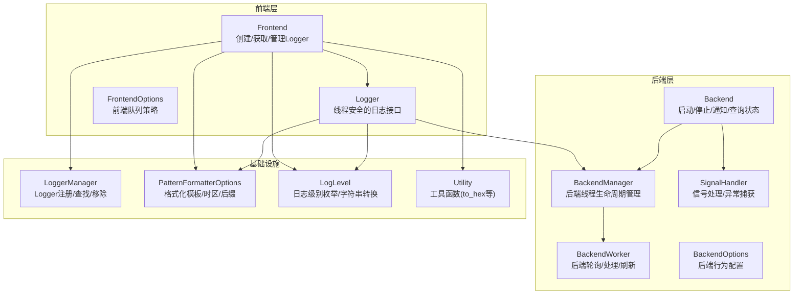
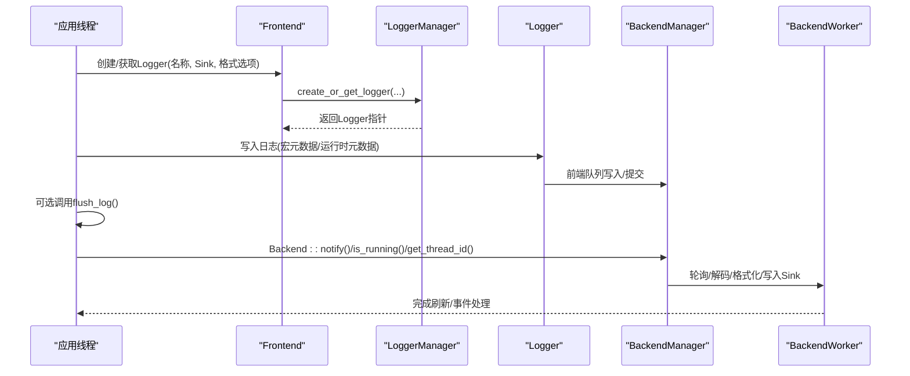
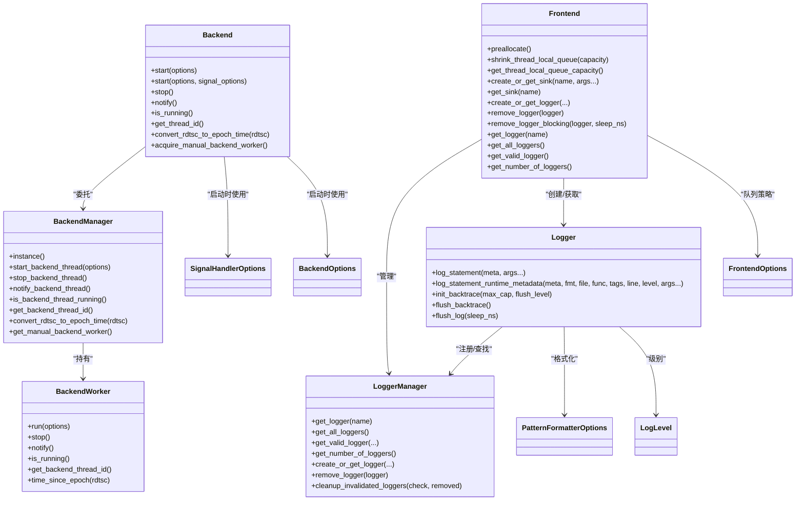
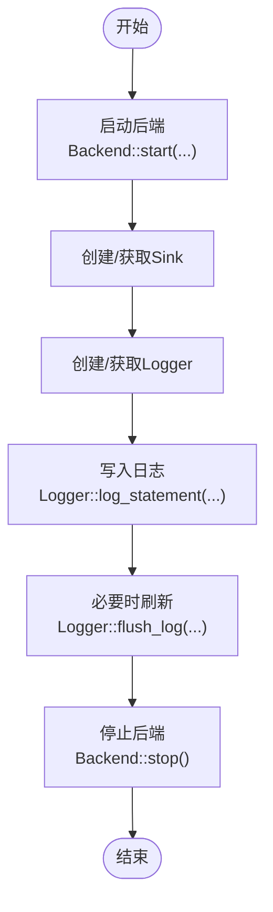

# API参考手册

<cite>
**本文档引用的文件**
- [Backend.h](file://include/quill/Backend.h)
- [Frontend.h](file://include/quill/Frontend.h)
- [Logger.h](file://include/quill/Logger.h)
- [BackendManager.h](file://include/quill/backend/BackendManager.h)
- [BackendWorker.h](file://include/quill/backend/BackendWorker.h)
- [BackendOptions.h](file://include/quill/backend/BackendOptions.h)
- [FrontendOptions.h](file://include/quill/core/FrontendOptions.h)
- [LoggerManager.h](file://include/quill/core/LoggerManager.h)
- [LogLevel.h](file://include/quill/core/LogLevel.h)
- [LogFunctions.h](file://include/quill/LogFunctions.h)
- [SignalHandler.h](file://include/quill/backend/SignalHandler.h)
- [PatternFormatterOptions.h](file://include/quill/core/PatternFormatterOptions.h)
- [Common.h](file://include/quill/core/Common.h)
- [Utility.h](file://include/quill/Utility.h)
- [SimpleSetup.h](file://include/quill/SimpleSetup.h)
</cite>

## 目录
1. [简介](#简介)
2. [项目结构](#项目结构)
3. [核心组件](#核心组件)
4. [架构总览](#架构总览)
5. [详细组件分析](#详细组件分析)
6. [依赖关系分析](#依赖关系分析)
7. [性能考量](#性能考量)
8. [故障排查指南](#故障排查指南)
9. [结论](#结论)
10. [附录](#附录)

## 简介
本手册面向使用 Quill 的开发者，系统梳理 Backend、Frontend、Logger、SignalHandler、PatternFormatterOptions、LogLevel、FrontendOptions、BackendOptions、LoggerManager、Utility 等核心类与模块的公共接口，覆盖函数签名、参数说明、返回值定义、使用示例、注意事项、异常处理与版本兼容性信息。目标是帮助你在不同场景下正确、高效地集成与使用 Quill。

## 项目结构
Quill 采用“前端线程队列 + 后端工作线程”的异步日志架构：前端线程通过无锁单生产者单消费者队列将日志消息发送到后端；后端线程批量拉取、格式化、写入目标（控制台、文件、JSON、CSV 等）。

**图表来源**
- [Frontend.h:32-373](file://include/quill/Frontend.h#L32-L373)
- [Logger.h:47-508](file://include/quill/Logger.h#L47-L508)
- [Backend.h:29-246](file://include/quill/Backend.h#L29-L246)
- [BackendManager.h:38-136](file://include/quill/backend/BackendManager.h#L38-L136)
- [BackendWorker.h:77-800](file://include/quill/backend/BackendWorker.h#L77-L800)
- [BackendOptions.h:30-283](file://include/quill/backend/BackendOptions.h#L30-L283)
- [FrontendOptions.h:16-52](file://include/quill/core/FrontendOptions.h#L16-L52)
- [LoggerManager.h:33-311](file://include/quill/core/LoggerManager.h#L33-L311)
- [PatternFormatterOptions.h:23-170](file://include/quill/core/PatternFormatterOptions.h#L23-L170)
- [LogLevel.h:22-128](file://include/quill/core/LogLevel.h#L22-L128)
- [SignalHandler.h:50-488](file://include/quill/backend/SignalHandler.h#L50-L488)
- [Utility.h:18-130](file://include/quill/Utility.h#L18-L130)

**章节来源**
- [Frontend.h:32-373](file://include/quill/Frontend.h#L32-L373)
- [Backend.h:29-246](file://include/quill/Backend.h#L29-L246)
- [Logger.h:47-508](file://include/quill/Logger.h#L47-L508)
- [BackendManager.h:38-136](file://include/quill/backend/BackendManager.h#L38-L136)
- [BackendWorker.h:77-800](file://include/quill/backend/BackendWorker.h#L77-L800)
- [BackendOptions.h:30-283](file://include/quill/backend/BackendOptions.h#L30-L283)
- [FrontendOptions.h:16-52](file://include/quill/core/FrontendOptions.h#L16-L52)
- [LoggerManager.h:33-311](file://include/quill/core/LoggerManager.h#L33-L311)
- [PatternFormatterOptions.h:23-170](file://include/quill/core/PatternFormatterOptions.h#L23-L170)
- [LogLevel.h:22-128](file://include/quill/core/LogLevel.h#L22-L128)
- [SignalHandler.h:50-488](file://include/quill/backend/SignalHandler.h#L50-L488)
- [Utility.h:18-130](file://include/quill/Utility.h#L18-L130)

## 核心组件
本节概述各核心类的关键职责与公共接口。

- Backend：后端线程生命周期与通知接口，支持带信号处理器的启动方式与手动后端工作器获取。
- Frontend：前端入口，提供创建/获取/删除 Logger、创建/获取 Sink、预分配线程本地队列、查询全局 Logger 列表等。
- Logger：线程安全日志接口，提供带/不带运行时元数据的日志写入、回溯初始化与转储、刷新接口。
- BackendOptions：后端线程行为配置（线程名、睡眠间隔、事件缓冲限制、CPU亲和、错误回调、RDTSC同步、最小刷新间隔、可打印字符检查、日志级别描述等）。
- FrontendOptions：前端队列类型与容量策略（无界/有界、阻塞/丢弃、初始容量、最大容量、阻塞重试间隔、大页策略）。
- LoggerManager：Logger 注册、查找、移除与清理。
- PatternFormatterOptions：日志格式模板、时间戳模板与时区、路径前缀剥离、函数名自定义处理、多行日志元数据附加、后缀控制。
- LogLevel：日志级别枚举及字符串转换。
- SignalHandler：跨平台信号处理（Windows 异常/控制台事件，POSIX 信号），超时保护与日志器选择策略。
- Utility：常用工具函数（如十六进制输出）。
- SimpleSetup：简化版快速初始化（控制台或文件输出）。

**章节来源**
- [Backend.h:29-246](file://include/quill/Backend.h#L29-L246)
- [Frontend.h:32-373](file://include/quill/Frontend.h#L32-L373)
- [Logger.h:47-508](file://include/quill/Logger.h#L47-L508)
- [BackendOptions.h:30-283](file://include/quill/backend/BackendOptions.h#L30-L283)
- [FrontendOptions.h:16-52](file://include/quill/core/FrontendOptions.h#L16-L52)
- [LoggerManager.h:33-311](file://include/quill/core/LoggerManager.h#L33-L311)
- [PatternFormatterOptions.h:23-170](file://include/quill/core/PatternFormatterOptions.h#L23-L170)
- [LogLevel.h:22-128](file://include/quill/core/LogLevel.h#L22-L128)
- [SignalHandler.h:50-488](file://include/quill/backend/SignalHandler.h#L50-L488)
- [Utility.h:18-130](file://include/quill/Utility.h#L18-L130)
- [SimpleSetup.h:22-74](file://include/quill/SimpleSetup.h#L22-L74)

## 架构总览
下面的序列图展示从创建 Logger 到后端处理日志的完整流程。

**图表来源**
- [Frontend.h:148-215](file://include/quill/Frontend.h#L148-L215)
- [Logger.h:75-136](file://include/quill/Logger.h#L75-L136)
- [BackendManager.h:61-96](file://include/quill/backend/BackendManager.h#L61-L96)
- [BackendWorker.h:305-395](file://include/quill/backend/BackendWorker.h#L305-L395)

## 详细组件分析

### Backend 类 API
- start(BackendOptions const& options = BackendOptions{})
  - 功能：启动后端线程，内部确保只初始化一次，并在进程退出时自动停止。
  - 参数：options 后端配置。
  - 返回：无。
  - 注意：线程安全；建议在应用启动阶段调用。
  - 异常：内部可能抛出配置相关异常（例如无效选项组合）。
  - 版本：版本号常量位于头文件顶部，用于版本判断。
- start(BackendOptions const&, SignalHandlerOptions const&)
  - 功能：启动后端线程并安装信号处理器（Windows 使用异常处理，POSIX 使用信号处理与 alarm 超时）。
  - 参数：后端配置 + 信号处理器配置。
  - 返回：无。
  - 注意：POSIX 下需确保非后端线程已进行至少一次日志或 Frontend::preallocate()，以避免信号处理中首次分配导致的异步信号安全问题。
- stop()
  - 功能：停止后端线程，恢复信号处理器默认行为。
  - 返回：无。
- notify() noexcept
  - 功能：唤醒后端线程（当其处于睡眠时）。
  - 返回：无。
- is_running() noexcept
  - 功能：查询后端是否正在运行。
  - 返回：布尔值。
- get_thread_id() noexcept
  - 功能：获取后端线程 ID。
  - 返回：线程 ID。
- convert_rdtsc_to_epoch_time(uint64_t rdtsc_value) noexcept
  - 功能：将 RDTSC 时间戳转换为纪元时间（纳秒）。
  - 参数：RDTSC 值。
  - 返回：纪元时间。
- acquire_manual_backend_worker()
  - 功能：在“手动后端工作器”模式下获取后端工作器实例（高级用户）。
  - 返回：ManualBackendWorker 指针。
  - 注意：仅能调用一次且不能与常规 start() 并存；不支持某些 BackendOptions 选项；线程内日志但不可调用 flush_log()。

使用示例路径
- [Backend.h:36-57](file://include/quill/Backend.h#L36-L57)
- [Backend.h:80-130](file://include/quill/Backend.h#L80-L130)
- [Backend.h:139-144](file://include/quill/Backend.h#L139-L144)
- [Backend.h:159-171](file://include/quill/Backend.h#L159-L171)
- [Backend.h:183-186](file://include/quill/Backend.h#L183-L186)
- [Backend.h:226-243](file://include/quill/Backend.h#L226-L243)

**章节来源**
- [Backend.h:29-246](file://include/quill/Backend.h#L29-L246)

### Frontend 类 API
Frontend 提供静态方法，封装了 Logger/Sink 管理与线程本地队列优化。

- preallocate()
  - 功能：在线程初始化阶段预分配线程本地队列，减少首次日志开销。
  - 返回：无。
- shrink_thread_local_queue(size_t capacity)
  - 功能：收缩当前线程本地队列为指定容量（仅 UnboundedQueue 生效）。
  - 参数：目标容量。
  - 返回：无。
- get_thread_local_queue_capacity() noexcept
  - 功能：查询当前线程本地队列容量（UnboundedQueue 返回动态容量，BoundedQueue 返回固定容量）。
  - 返回：容量大小。
- create_or_get_sink<TSink>(std::string const& sink_name, Args&&...)
  - 功能：按名称创建或获取共享 Sink。
  - 返回：shared_ptr<Sink>。
- get_sink(std::string const& sink_name)
  - 功能：按名称获取现有 Sink。
  - 返回：shared_ptr<Sink> 或空。
- create_or_get_logger(...)
  - 重载1：传入单个 Sink。
  - 重载2：传入多个 Sink。
  - 重载3：传入初始化列表 Sink。
  - 重载4：复制已有 Logger 的配置。
  - 返回：Logger*。
- remove_logger(detail::LoggerBase*)
  - 功能：异步移除 Logger（若其 Sink 不被其他 Logger 使用则关闭底层资源）。
  - 注意：线程安全；同一 Logger 不允许并发移除。
- remove_logger_blocking(logger_t*, uint32_t sleep_duration_ns = 100)
  - 功能：阻塞等待移除完成。
  - 参数：睡眠间隔（纳秒，0 表示 yield）。
  - 返回：无。
- get_logger(std::string const& logger_name)
  - 功能：按名称获取 Logger。
  - 返回：Logger* 或空。
- get_all_loggers()
  - 功能：获取所有有效 Logger。
  - 返回：Logger* 向量。
- get_valid_logger() noexcept
  - 功能：获取任意有效 Logger（无需构建向量）。
  - 返回：Logger* 或空。
- get_number_of_loggers() noexcept
  - 功能：统计所有 Logger 数量（含失效）。
  - 返回：数量。

使用示例路径
- [Frontend.h:45-53](file://include/quill/Frontend.h#L45-L53)
- [Frontend.h:72-80](file://include/quill/Frontend.h#L72-L80)
- [Frontend.h:97-111](file://include/quill/Frontend.h#L97-L111)
- [Frontend.h:120-135](file://include/quill/Frontend.h#L120-L135)
- [Frontend.h:148-198](file://include/quill/Frontend.h#L148-L198)
- [Frontend.h:211-215](file://include/quill/Frontend.h#L211-L215)
- [Frontend.h:233-236](file://include/quill/Frontend.h#L233-L236)
- [Frontend.h:253-289](file://include/quill/Frontend.h#L253-L289)
- [Frontend.h:297-301](file://include/quill/Frontend.h#L297-L301)
- [Frontend.h:309-321](file://include/quill/Frontend.h#L309-L321)
- [Frontend.h:329-333](file://include/quill/Frontend.h#L329-L333)
- [Frontend.h:341-344](file://include/quill/Frontend.h#L341-L344)

**章节来源**
- [Frontend.h:32-373](file://include/quill/Frontend.h#L32-L373)

### Logger 类 API
Logger 是线程安全的日志接口，负责将日志消息写入前端队列并触发后端处理。

- log_statement<enable_immediate_flush>(MacroMetadata const*, Args&&...)
  - 功能：写入带编译期元数据的日志（最快路径）。
  - 返回：true 表示成功写入，false 表示丢弃（在丢弃队列中）。
  - 注意：内部会缓存线程上下文，避免重复查询。
- log_statement_runtime_metadata<enable_immediate_flush>(MacroMetadata const*, char const* fmt, char const* file_path, char const* function_name, char const* tags, uint32_t line_number, LogLevel, Args&&...)
  - 功能：写入带运行时元数据的日志（宏自由模式）。
  - 返回：true/false。
- init_backtrace(uint32_t max_capacity, LogLevel flush_level = LogLevel::None)
  - 功能：初始化回溯缓冲，存储指定数量的消息并在满足级别时自动刷新。
  - 返回：无。
- flush_backtrace()
  - 功能：转储回溯缓冲中的消息。
  - 返回：无。
- flush_log(uint32_t sleep_duration_ns = 100)
  - 功能：阻塞直到后端处理到当前时间点之前的所有消息。
  - 注意：不要在静态对象析构期间调用；长睡眠配置可能导致长时间阻塞。
  - 返回：无。

使用示例路径
- [Logger.h:75-136](file://include/quill/Logger.h#L75-L136)
- [Logger.h:155-260](file://include/quill/Logger.h#L155-L260)
- [Logger.h:269-284](file://include/quill/Logger.h#L269-L284)
- [Logger.h:289-300](file://include/quill/Logger.h#L289-L300)
- [Logger.h:319-352](file://include/quill/Logger.h#L319-L352)

**章节来源**
- [Logger.h:47-508](file://include/quill/Logger.h#L47-L508)

### BackendOptions 配置项
- thread_name：后端线程名。
- enable_yield_when_idle：空闲时让出 CPU。
- sleep_duration：无工作时睡眠时长。
- transit_event_buffer_initial_capacity：后端事件缓冲初始容量（项数，非字节）。
- transit_events_soft_limit：软限制（跨所有前端线程）。
- transit_events_hard_limit：硬限制（每前端线程）。
- log_timestamp_ordering_grace_period：严格时间序容忍窗口（微秒）。
- wait_for_queues_to_empty_before_exit：退出前等待队列清空。
- cpu_affinity：绑定 CPU。
- error_notifier：错误回调。
- backend_worker_on_poll_begin/end：轮询钩子。
- rdtsc_resync_interval：RDTSC 同步周期。
- sink_min_flush_interval：最小刷新间隔。
- check_printable_char：可打印字符检查回调。
- log_level_descriptions/log_level_short_codes：日志级别显示配置。
- check_backend_singleton_instance：后端单例检测。

使用示例路径
- [BackendOptions.h:30-283](file://include/quill/backend/BackendOptions.h#L30-L283)

**章节来源**
- [BackendOptions.h:30-283](file://include/quill/backend/BackendOptions.h#L30-L283)

### FrontendOptions 配置项
- queue_type：队列类型（UnboundedBlocking/UnboundedDropping/BoundedBlocking/BoundedDropping）。
- initial_queue_capacity：初始容量。
- blocking_queue_retry_interval_ns：阻塞重试间隔。
- unbounded_queue_max_capacity：无界队列最大容量。
- huge_pages_policy：大页策略（Linux）。

使用示例路径
- [FrontendOptions.h:16-52](file://include/quill/core/FrontendOptions.h#L16-L52)

**章节来源**
- [FrontendOptions.h:16-52](file://include/quill/core/FrontendOptions.h#L16-L52)

### LoggerManager 管理接口
- get_logger(name)：按名称获取有效 Logger。
- get_all_loggers()：获取所有有效 Logger。
- get_valid_logger(...)：获取首个有效 Logger。
- get_number_of_loggers()：统计总数。
- create_or_get_logger(...)：创建或获取 Logger（多种重载）。
- remove_logger(...)：标记失效（异步移除）。
- cleanup_invalidated_loggers(...)：清理失效 Logger（结合队列为空检查）。

使用示例路径
- [LoggerManager.h:47-122](file://include/quill/core/LoggerManager.h#L47-L122)
- [LoggerManager.h:152-198](file://include/quill/core/LoggerManager.h#L152-L198)
- [LoggerManager.h:201-239](file://include/quill/core/LoggerManager.h#L201-L239)

**章节来源**
- [LoggerManager.h:33-311](file://include/quill/core/LoggerManager.h#L33-L311)

### PatternFormatterOptions 格式化选项
- format_pattern：日志格式模板。
- timestamp_pattern：时间戳格式。
- timestamp_timezone：时区。
- add_metadata_to_multi_line_logs：多行日志是否添加元数据。
- source_location_path_strip_prefix：源路径前缀剥离。
- process_function_name：函数名自定义处理。
- source_location_remove_relative_paths：相对路径去除。
- pattern_suffix/NO_SUFFIX：每条日志后缀控制。

使用示例路径
- [PatternFormatterOptions.h:23-170](file://include/quill/core/PatternFormatterOptions.h#L23-L170)

**章节来源**
- [PatternFormatterOptions.h:23-170](file://include/quill/core/PatternFormatterOptions.h#L23-L170)

### LogLevel 日志级别
- 枚举：TraceL3/L2/L1, Debug, Info, Notice, Warning, Error, Critical, Backtrace, None。
- 字符串转换：loglevel_from_string(...) 支持多种别名。

使用示例路径
- [LogLevel.h:22-128](file://include/quill/core/LogLevel.h#L22-L128)

**章节来源**
- [LogLevel.h:22-128](file://include/quill/core/LogLevel.h#L22-L128)

### SignalHandler 信号处理
- SignalHandlerOptions：catchable_signals、timeout_seconds、logger_name、excluded_logger_substrings。
- init_signal_handler(...)：POSIX 安装信号处理器（含 SIGALRM）。
- init_exception_handler()：Windows 安装异常/控制台事件处理器。
- deinit_signal_handler()：卸载信号处理器。
- on_signal(...)：统一信号处理入口（含超时保护与日志器选择）。

使用示例路径
- [SignalHandler.h:50-88](file://include/quill/backend/SignalHandler.h#L50-L88)
- [SignalHandler.h:391-408](file://include/quill/backend/SignalHandler.h#L391-L408)
- [SignalHandler.h:443-471](file://include/quill/backend/SignalHandler.h#L443-L471)
- [SignalHandler.h:376-384](file://include/quill/backend/SignalHandler.h#L376-L384)
- [SignalHandler.h:412-424](file://include/quill/backend/SignalHandler.h#L412-L424)

**章节来源**
- [SignalHandler.h:50-488](file://include/quill/backend/SignalHandler.h#L50-L488)

### Utility 工具函数
- to_hex(buffer, size, uppercase=true, space_delim=true)：将缓冲区转为十六进制字符串。
  - 参数：缓冲区指针、大小、大小写、空格分隔。
  - 返回：十六进制字符串。
  - 注意：元素大小必须为 1 字节。

使用示例路径
- [Utility.h:31-118](file://include/quill/Utility.h#L31-L118)

**章节来源**
- [Utility.h:18-130](file://include/quill/Utility.h#L18-L130)

### SimpleSetup 快速设置
- simple_logger(std::string const& output = "stdout")
  - 功能：根据输出目标（stdout/stderr/文件名）创建或获取 Logger，并启动带信号处理器的后端。
  - 返回：Logger*。

使用示例路径
- [SimpleSetup.h:46-72](file://include/quill/SimpleSetup.h#L46-L72)

**章节来源**
- [SimpleSetup.h:22-74](file://include/quill/SimpleSetup.h#L22-L74)

## 依赖关系分析

**图表来源**
- [Backend.h:29-246](file://include/quill/Backend.h#L29-L246)
- [BackendManager.h:38-136](file://include/quill/backend/BackendManager.h#L38-L136)
- [BackendWorker.h:77-800](file://include/quill/backend/BackendWorker.h#L77-L800)
- [Frontend.h:32-373](file://include/quill/Frontend.h#L32-L373)
- [Logger.h:47-508](file://include/quill/Logger.h#L47-L508)
- [LoggerManager.h:33-311](file://include/quill/core/LoggerManager.h#L33-L311)
- [SignalHandler.h:50-488](file://include/quill/backend/SignalHandler.h#L50-L488)
- [BackendOptions.h:30-283](file://include/quill/backend/BackendOptions.h#L30-L283)
- [FrontendOptions.h:16-52](file://include/quill/core/FrontendOptions.h#L16-L52)
- [PatternFormatterOptions.h:23-170](file://include/quill/core/PatternFormatterOptions.h#L23-L170)
- [LogLevel.h:22-128](file://include/quill/core/LogLevel.h#L22-L128)

**章节来源**
- [Backend.h:29-246](file://include/quill/Backend.h#L29-L246)
- [Frontend.h:32-373](file://include/quill/Frontend.h#L32-L373)
- [Logger.h:47-508](file://include/quill/Logger.h#L47-L508)
- [BackendManager.h:38-136](file://include/quill/backend/BackendManager.h#L38-L136)
- [BackendWorker.h:77-800](file://include/quill/backend/BackendWorker.h#L77-L800)
- [LoggerManager.h:33-311](file://include/quill/core/LoggerManager.h#L33-L311)
- [SignalHandler.h:50-488](file://include/quill/backend/SignalHandler.h#L50-L488)
- [BackendOptions.h:30-283](file://include/quill/backend/BackendOptions.h#L30-L283)
- [FrontendOptions.h:16-52](file://include/quill/core/FrontendOptions.h#L16-L52)
- [PatternFormatterOptions.h:23-170](file://include/quill/core/PatternFormatterOptions.h#L23-L170)
- [LogLevel.h:22-128](file://include/quill/core/LogLevel.h#L22-L128)

## 性能考量
- 队列策略
  - UnboundedBlocking/UnboundedDropping：适合高吞吐场景，前者在满时阻塞，后者丢弃；后者可能丢失消息但保持低延迟。
  - BoundedBlocking/BoundedDropping：容量固定，前者阻塞，后者丢弃；适合资源受限环境。
- 前端队列容量与收缩
  - 在线程池场景中，先记录突发再收缩，有助于降低内存占用。
- 后端轮询与事件缓冲
  - transit_events_soft_limit/hard_limit 控制批处理与背压；grace_period 影响严格时间序与吞吐平衡。
- 刷新策略
  - sink_min_flush_interval 控制最小刷新间隔；flush_log 会阻塞直到后端处理完成。
- 大页策略
  - FrontendOptions::huge_pages_policy 可在 Linux 上启用大页以降低 TLB 缺失。

[本节为通用指导，无需列出具体文件来源]

## 故障排查指南
- 后端单例冲突
  - 症状：Windows 静态库链接到共享库与主程序导致多个后端线程。
  - 解决：启用 check_backend_singleton_instance 或改为共享库导出符号。
- 信号处理与异步安全
  - 症状：POSIX 信号处理中首次分配导致死锁或未定义行为。
  - 解决：确保非后端线程至少一次日志或调用 Frontend::preallocate()。
- flush_log 死锁风险
  - 症状：在静态对象析构期间调用 flush_log 导致崩溃。
  - 解决：避免在静态对象析构中调用；或确保后端线程仍在运行。
- 队列满与消息丢弃
  - 症状：使用丢弃队列时出现消息丢失。
  - 解决：切换为阻塞队列或增大容量；监控失败计数。
- RDTSC 与系统时钟同步
  - 症状：时间戳漂移或与 NTP 不一致。
  - 解决：调整 rdtsc_resync_interval；注意配置上限与睡眠间隔的关系。

**章节来源**
- [Backend.h:80-130](file://include/quill/Backend.h#L80-L130)
- [Logger.h:319-352](file://include/quill/Logger.h#L319-L352)
- [BackendWorker.h:112-123](file://include/quill/backend/BackendWorker.h#L112-L123)
- [BackendOptions.h:400-438](file://include/quill/backend/BackendOptions.h#L400-L438)

## 结论
本手册系统梳理了 Quill 的核心 API，覆盖从 Logger 创建、写入、刷新，到后端生命周期管理、信号处理、格式化配置与工具函数。遵循本文档的参数范围、异常处理与注意事项，可在保证性能的同时获得稳定可靠的日志能力。对于复杂场景，建议结合 BackendOptions 与 FrontendOptions 进行精细化调优。

[本节为总结性内容，无需列出具体文件来源]

## 附录

### API 版本与兼容性
- 版本号常量：位于 Backend 头文件顶部，包含主/次/补丁版本号与合并后的版本整数。
- 迁移建议：
  - 当升级到新主版本时，优先检查 BackendOptions 与 FrontendOptions 的默认值变化。
  - 若使用宏自由模式，注意其性能与编译期优化差异。
  - 对于信号处理，跨平台行为存在差异，建议在 POSIX 环境中遵循异步安全约束。

**章节来源**
- [Backend.h:23-27](file://include/quill/Backend.h#L23-L27)

### 常见使用流程图

[本图为概念流程，不直接映射到具体代码文件，故不提供图表来源]