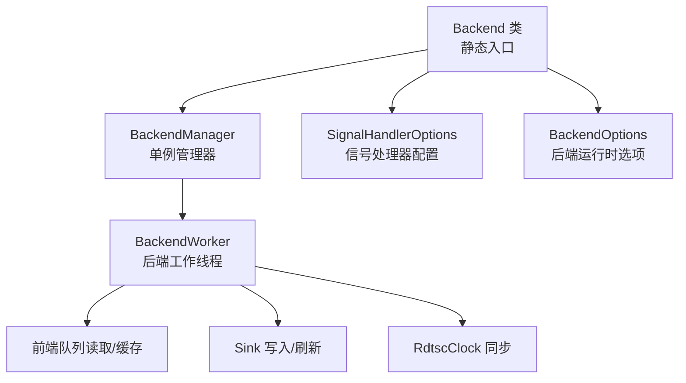
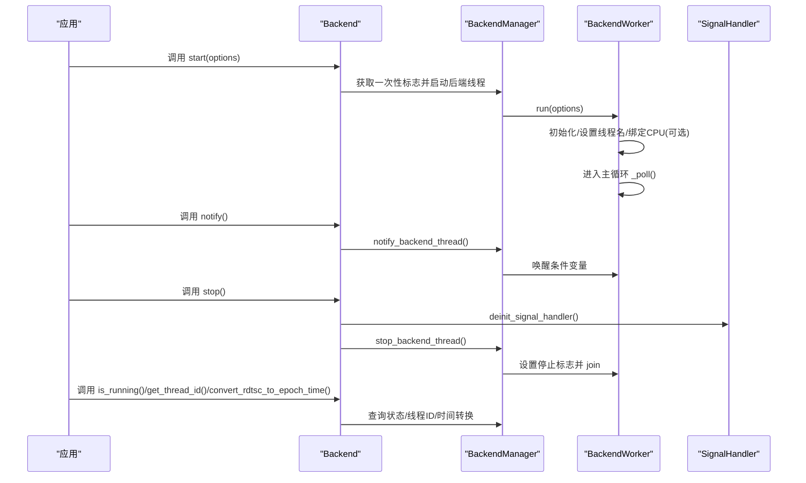
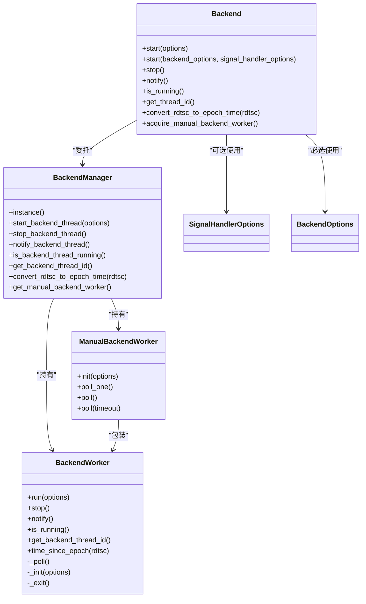

# Backend API

<cite>
**本文引用的文件**
- [Backend.h](file://include/quill/Backend.h)
- [BackendOptions.h](file://include/quill/backend/BackendOptions.h)
- [SignalHandler.h](file://include/quill/backend/SignalHandler.h)
- [BackendManager.h](file://include/quill/backend/BackendManager.h)
- [BackendWorker.h](file://include/quill/backend/BackendWorker.h)
- [ManualBackendWorker.h](file://include/quill/backend/ManualBackendWorker.h)
- [backend_thread_notify.cpp](file://examples/backend_thread_notify.cpp)
- [backend_tsc_clock.cpp](file://examples/backend_tsc_clock.cpp)
- [backend_options.rst](file://docs/backend_options.rst)
</cite>

## 目录
1. [简介](#简介)
2. [项目结构](#项目结构)
3. [核心组件](#核心组件)
4. [架构总览](#架构总览)
5. [详细组件分析](#详细组件分析)
6. [依赖关系分析](#依赖关系分析)
7. [性能考量](#性能考量)
8. [故障排查指南](#故障排查指南)
9. [结论](#结论)
10. [附录：完整用法与示例](#附录完整用法与示例)

## 简介
本文件为 Backend 类的详细 API 文档，覆盖以下内容：
- Backend 类的全部静态方法：start()、stop()、notify()、is_running()、get_thread_id()、convert_rdtsc_to_epoch_time()、acquire_manual_backend_worker()。
- 各方法的参数类型、返回值、线程安全性保证与典型使用场景。
- BackendOptions 与 SignalHandlerOptions 的配置项说明（作用、默认值与建议取值）。
- 完整的代码示例：如何正确初始化/停止后端、如何使用手动后端工作线程、如何在长睡眠模式下唤醒后端、如何将 TSC 时间转换为系统时间戳。
- 后端线程工作机制与性能注意事项。

## 项目结构
Backend API 所在模块位于 include/quill/Backend.h，并通过 BackendManager 与 BackendWorker 协作；信号处理相关逻辑在 SignalHandler.h 中定义；BackendOptions 与 ManualBackendWorker 分别在各自头文件中定义。

图表来源
- [Backend.h:29-246](file://include/quill/Backend.h#L29-L246)
- [BackendManager.h:38-136](file://include/quill/backend/BackendManager.h#L38-L136)
- [BackendWorker.h:77-1765](file://include/quill/backend/BackendWorker.h#L77-L1765)
- [SignalHandler.h:50-88](file://include/quill/backend/SignalHandler.h#L50-L88)
- [BackendOptions.h:30-283](file://include/quill/backend/BackendOptions.h#L30-L283)

章节来源
- [Backend.h:29-246](file://include/quill/Backend.h#L29-L246)
- [BackendManager.h:38-136](file://include/quill/backend/BackendManager.h#L38-L136)
- [BackendWorker.h:77-1765](file://include/quill/backend/BackendWorker.h#L77-L1765)
- [SignalHandler.h:50-88](file://include/quill/backend/SignalHandler.h#L50-L88)
- [BackendOptions.h:30-283](file://include/quill/backend/BackendOptions.h#L30-L283)

## 核心组件
- Backend：对外暴露的静态 API 入口，负责启动/停止后端线程、唤醒后端、查询状态、获取线程 ID、时间戳转换、以及手动后端工作线程的获取。
- BackendManager：Backend 的内部管理器，持有 BackendWorker 实例，负责线程生命周期控制、一次性标志、通知机制与 RDTSC 转换。
- BackendWorker：实际的后端工作线程实现，负责从前端队列读取、缓存、排序、格式化并写入 sinks，支持 TSC 同步、最小刷新间隔、命名参数格式化、字符过滤等。
- ManualBackendWorker：允许用户在自定义线程中运行后端逻辑，需自行调用 poll/poll_one。
- SignalHandlerOptions：内置信号处理器的配置项集合。
- BackendOptions：后端线程运行时可调参数集合。

章节来源
- [Backend.h:29-246](file://include/quill/Backend.h#L29-L246)
- [BackendManager.h:38-136](file://include/quill/backend/BackendManager.h#L38-L136)
- [BackendWorker.h:77-1765](file://include/quill/backend/BackendWorker.h#L77-L1765)
- [ManualBackendWorker.h:19-120](file://include/quill/backend/ManualBackendWorker.h#L19-L120)
- [SignalHandler.h:50-88](file://include/quill/backend/SignalHandler.h#L50-L88)
- [BackendOptions.h:30-283](file://include/quill/backend/BackendOptions.h#L30-L283)

## 架构总览
Backend 静态 API 通过 BackendManager 访问 BackendWorker，后者在独立线程中循环执行 _poll，完成消息去抖、缓存、排序、格式化与写入。信号处理器在跨平台环境下接管致命信号，确保崩溃时能记录日志并安全退出。

图表来源
- [Backend.h:36-168](file://include/quill/Backend.h#L36-L168)
- [BackendManager.h:61-102](file://include/quill/backend/BackendManager.h#L61-L102)
- [BackendWorker.h:138-232](file://include/quill/backend/BackendWorker.h#L138-L232)
- [SignalHandler.h:412-424](file://include/quill/backend/SignalHandler.h#L412-L424)

## 详细组件分析

### Backend 类静态方法 API

- start(BackendOptions const& options = BackendOptions{})
  - 参数：options，BackendOptions 实例，用于配置后端线程行为。
  - 返回值：无。
  - 线程安全性：内部使用一次性标志，保证只启动一次；线程内调用是安全的。
  - 使用场景：首次启动后端线程，通常在应用初始化阶段调用。
  - 注意事项：若已启用内置信号处理器，会注册 atexit 回调以确保退出时停止后端。

- start(BackendOptions const& backend_options, SignalHandlerOptions const& signal_handler_options)
  - 参数：backend_options 与 signal_handler_options。
  - 返回值：无。
  - 线程安全性：同上。
  - 使用场景：需要内置信号处理器时调用，Linux/MacOS 上需确保线程在首次使用锁无队列前至少有一次日志或预分配。
  - 平台差异：Windows 使用异常处理器，非 Windows 使用信号处理器并设置 alarm 保护。

- stop()
  - 参数：无。
  - 返回值：无。
  - 线程安全性：线程安全；会重置后端线程 ID 并反初始化信号处理器。
  - 使用场景：优雅关闭应用时调用，确保所有前端队列清空并刷新 sinks。

- notify() noexcept
  - 参数：无。
  - 返回值：无。
  - 线程安全性：线程安全；可由任意前端线程调用以唤醒后端。
  - 使用场景：当后端 sleep_duration 较大时，前端主动唤醒后端处理积压消息。

- is_running() noexcept
  - 参数：无。
  - 返回值：bool，表示后端是否正在运行。
  - 线程安全性：线程安全。
  - 使用场景：调试或监控后端状态。

- get_thread_id() noexcept
  - 参数：无。
  - 返回值：uint32_t，后端线程 ID。
  - 线程安全性：线程安全。
  - 使用场景：与信号处理器集成，避免在后端线程上再次触发信号处理。

- convert_rdtsc_to_epoch_time(uint64_t rdtsc_value) noexcept
  - 参数：rdtsc_value，RDTSC 计数值。
  - 返回值：uint64_t，对应系统历元纳秒时间。
  - 线程安全性：线程安全；内部使用 RdtscClock 同步。
  - 使用场景：当使用 TSC 时钟源的日志器，需要与日志文件时间对齐的应用时间戳。

- acquire_manual_backend_worker()
  - 参数：无。
  - 返回值：ManualBackendWorker*，手动后端工作线程实例。
  - 线程安全性：仅能在进程范围内调用一次；若已调用过 start() 则不可再调用。
  - 使用场景：高级用户希望在自定义线程中驱动后端逻辑；不推荐普通应用使用。

章节来源
- [Backend.h:36-168](file://include/quill/Backend.h#L36-L168)
- [Backend.h:226-243](file://include/quill/Backend.h#L226-L243)

### BackendOptions 配置项详解
- thread_name：后端线程显示名称，默认 "QuillBackend"。
- enable_yield_when_idle：空闲时让出 CPU，仅在 sleep_duration 为 0 时生效。
- sleep_duration：无工作时的休眠时长，默认约 100 微秒。
- transit_event_buffer_initial_capacity：每个前端线程的 transit 缓冲初始容量（必须为 2 的幂）。
- transit_events_soft_limit：软上限，超过后批处理缓存事件。
- transit_events_hard_limit：硬上限，超过后暂停读取前端队列。
- log_timestamp_ordering_grace_period：严格时间序的宽限期（微秒），0 表示禁用严格顺序。
- wait_for_queues_to_empty_before_exit：退出前等待队列清空。
- cpu_affinity：后端线程 CPU 绑定，默认未绑定。
- error_notifier：错误通知回调，默认输出到标准错误。
- backend_worker_on_poll_begin/end：每次轮询开始/结束的钩子。
- rdtsc_resync_interval：TSC 时钟同步周期（毫秒），仅当使用 TSC 时钟源有效。
- sink_min_flush_interval：最小刷新间隔（毫秒），0 表示尽可能快刷新。
- check_printable_char：字符过滤回调，仅对字符串参数生效。
- log_level_descriptions/log_level_short_codes：日志级别描述与短码数组。
- check_backend_singleton_instance：检测后端单例冲突（Windows 使用命名互斥量，POSIX 使用命名信号量）。

章节来源
- [BackendOptions.h:30-283](file://include/quill/backend/BackendOptions.h#L30-L283)

### SignalHandlerOptions 配置项详解
- catchable_signals：要捕获的信号列表，默认包含终止/中断/异常等致命信号。
- timeout_seconds：信号处理器超时（秒），Linux 下通过 alarm 保护。
- logger_name：崩溃时使用的日志器名称，为空则自动选择。
- excluded_logger_substrings：自动选择时排除的名称子串，默认排除 "__csv__"。

章节来源
- [SignalHandler.h:50-88](file://include/quill/backend/SignalHandler.h#L50-L88)

### ManualBackendWorker 使用要点
- init(BackendOptions options)：必须先调用，内部会强制 sleep_duration=0、enable_yield_when_idle=false。
- poll_one()：单次轮询，必须在同一线程调用且该线程即为后端线程。
- poll()：持续轮询直到队列与缓存清空；poll(timeout)：带超时版本。
- 不支持的 BackendOptions：cpu_affinity、thread_name、sleep_duration、enable_yield_when_idle。
- 注意：不要在 ManualBackendWorker 线程上调用 logger->flush_log()，否则可能导致死锁。

章节来源
- [ManualBackendWorker.h:43-113](file://include/quill/backend/ManualBackendWorker.h#L43-L113)
- [Backend.h:195-210](file://include/quill/Backend.h#L195-L210)

## 依赖关系分析

图表来源
- [Backend.h:29-246](file://include/quill/Backend.h#L29-L246)
- [BackendManager.h:38-136](file://include/quill/backend/BackendManager.h#L38-L136)
- [BackendWorker.h:77-1765](file://include/quill/backend/BackendWorker.h#L77-L1765)
- [ManualBackendWorker.h:19-120](file://include/quill/backend/ManualBackendWorker.h#L19-L120)
- [SignalHandler.h:50-88](file://include/quill/backend/SignalHandler.h#L50-L88)
- [BackendOptions.h:30-283](file://include/quill/backend/BackendOptions.h#L30-L283)

## 性能考量
- 休眠策略：sleep_duration 与 enable_yield_when_idle 共同决定空闲时的调度行为；较长休眠可降低 CPU 占用但增加延迟。
- 缓冲与批处理：soft/hard 限制控制缓存大小与吞吐平衡；合理设置可避免前端队列阻塞与内存膨胀。
- TSC 同步：rdtsc_resync_interval 控制与系统时钟同步频率，越小越准但开销越大。
- 刷新策略：sink_min_flush_interval 控制 sinks 刷新频率，避免频繁 IO；0 表示尽可能快。
- 字符过滤：check_printable_char 对字符串参数进行过滤，可能带来格式化额外开销。
- 单例检查：check_backend_singleton_instance 可避免多库链接导致的重复后端线程，但可能在容器环境产生干扰。

章节来源
- [BackendOptions.h:44-224](file://include/quill/backend/BackendOptions.h#L44-L224)
- [BackendWorker.h:305-395](file://include/quill/backend/BackendWorker.h#L305-L395)

## 故障排查指南
- 后端未启动或无法唤醒
  - 检查是否调用了 start()；确认 sleep_duration 是否过大；必要时调用 notify()。
  - 参考示例：[backend_thread_notify.cpp:22-59](file://examples/backend_thread_notify.cpp#L22-L59)

- 信号处理无效或崩溃无日志
  - 在 Linux/MacOS 上，确保线程在首次使用锁无队列前有至少一次日志或预分配。
  - Windows 使用异常处理器，注意控制台信号处理与异常过滤器的安装。

- TSC 时间转换异常
  - 确认 backend_thread_sleep_duration 不大于 rdtsc_resync_interval；检查 RdtscClock 初始化状态。

- 手动后端工作线程死锁
  - 不要在 ManualBackendWorker 线程上调用 logger->flush_log()；确保 poll_one() 在同一线程调用。

- 字符集问题
  - 默认会对非打印字符进行过滤并转义；如需输出 UTF-8，请按需调整 check_printable_char 或禁用过滤。

章节来源
- [Backend.h:60-79](file://include/quill/Backend.h#L60-L79)
- [BackendWorker.h:112-123](file://include/quill/backend/BackendWorker.h#L112-L123)
- [ManualBackendWorker.h:69-70](file://include/quill/backend/ManualBackendWorker.h#L69-L70)
- [backend_options.rst:17-46](file://docs/backend_options.rst#L17-L46)

## 结论
Backend 提供了简洁而强大的后端线程管理接口，配合 BackendOptions 与 SignalHandlerOptions 可满足大多数应用场景。对于需要精细控制的高级用户，ManualBackendWorker 提供了在自定义线程中运行后端的能力，但需遵循严格的约束以避免死锁与性能退化。通过合理配置缓冲、批处理、刷新与 TSC 同步策略，可在低延迟与高吞吐之间取得良好平衡。

## 附录：完整用法与示例

- 正确初始化与停止后端
  - 示例路径：[backend_thread_notify.cpp:22-59](file://examples/backend_thread_notify.cpp#L22-L59)

- 使用长睡眠唤醒后端
  - 示例路径：[backend_thread_notify.cpp:22-59](file://examples/backend_thread_notify.cpp#L22-L59)

- 将 TSC 时间转换为系统时间戳
  - 示例路径：[backend_tsc_clock.cpp:19-63](file://examples/backend_tsc_clock.cpp#L19-L63)

- BackendOptions 基本使用与字符过滤
  - 文档路径：[backend_options.rst:1-46](file://docs/backend_options.rst#L1-L46)

- ManualBackendWorker 使用模板
  - 方法注释与使用说明：[Backend.h:195-224](file://include/quill/Backend.h#L195-L224)