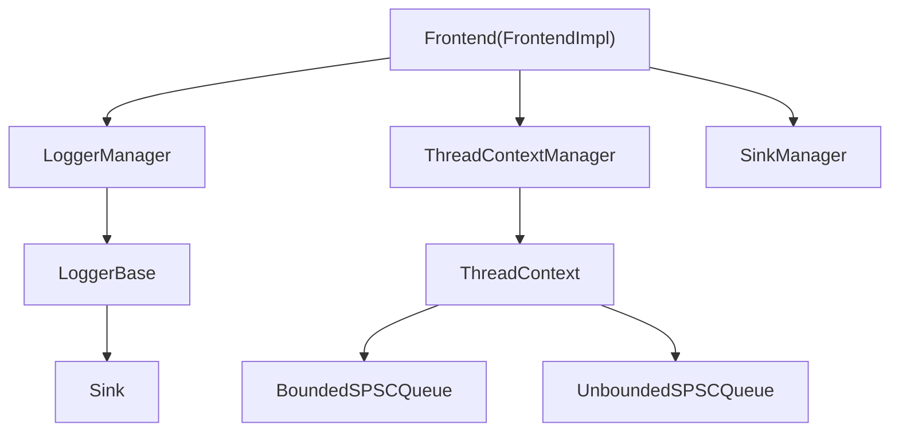
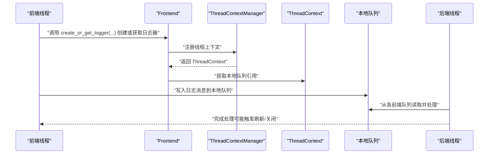
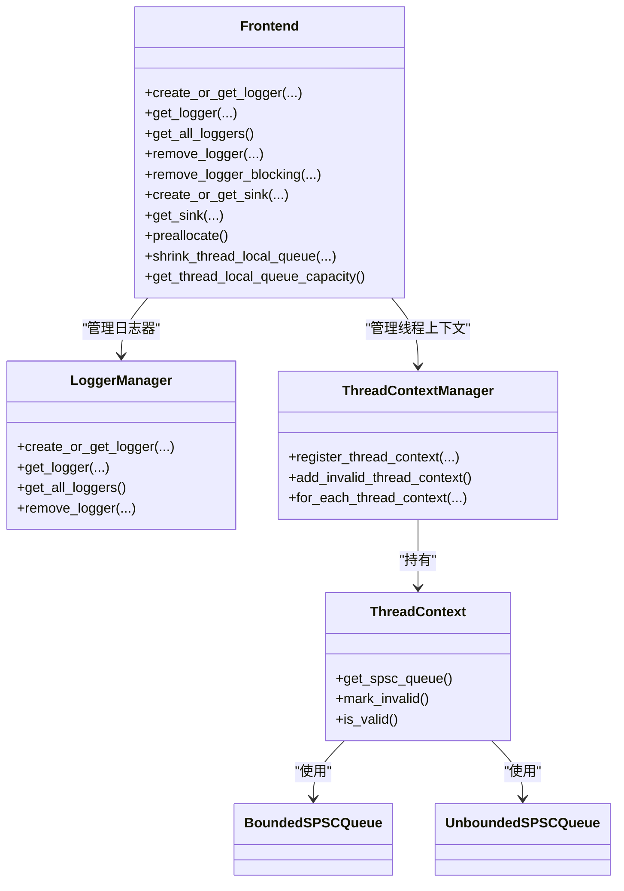

# 前端API

<cite>
**本文引用的文件**
- [Frontend.h](file://include/quill/Frontend.h)
- [FrontendOptions.h](file://include/quill/core/FrontendOptions.h)
- [ThreadContextManager.h](file://include/quill/core/ThreadContextManager.h)
- [LoggerManager.h](file://include/quill/core/LoggerManager.h)
- [Common.h](file://include/quill/core/Common.h)
- [BoundedSPSCQueue.h](file://include/quill/core/BoundedSPSCQueue.h)
- [UnboundedSPSCQueue.h](file://include/quill/core/UnboundedSPSCQueue.h)
- [LoggerBase.h](file://include/quill/core/LoggerBase.h)
- [custom_frontend_options.cpp](file://examples/custom_frontend_options.cpp)
- [bounded_dropping_queue_frontend.cpp](file://examples/bounded_dropping_queue_frontend.cpp)
- [MultiFrontendThreadsTest.cpp](file://test/integration_tests/MultiFrontendThreadsTest.cpp)
- [frontend_options.rst](file://docs/frontend_options.rst)
</cite>

## 目录
1. [简介](#简介)
2. [项目结构](#项目结构)
3. [核心组件](#核心组件)
4. [架构总览](#架构总览)
5. [详细组件分析](#详细组件分析)
6. [依赖关系分析](#依赖关系分析)
7. [性能考量](#性能考量)
8. [故障排查指南](#故障排查指南)
9. [结论](#结论)
10. [附录](#附录)

## 简介
本文件为 Quill 库中 Frontend 类的完整 API 文档，聚焦于以下目标：
- 详尽记录 Frontend 的所有静态方法（如 create_or_get_logger、preallocate、get_or_create_channel 等）及其行为语义
- 解释 FrontendOptions 的配置项（如 buffer_size、pending_full_policy 等）对队列行为的影响
- 说明线程上下文管理与“预分配”机制在热路径上的作用
- 提供日志器创建、通道（Sink）管理、线程安全与并发使用的示例与最佳实践
- 阐述前端线程与后端线程的交互方式与工作流程

## 项目结构
Frontend 是一个模板类 FrontendImpl<TFrontendOptions> 的别名，其核心职责是：
- 为每个前端线程提供独立的线程上下文与本地队列
- 提供日志器（Logger）与 Sink 的创建/获取与管理
- 提供线程上下文的预分配、容量查询与收缩能力
- 提供日志器的异步/同步移除能力

图示来源
- [Frontend.h:32-370](file://include/quill/Frontend.h#L32-L370)
- [ThreadContextManager.h:53-214](file://include/quill/core/ThreadContextManager.h#L53-L214)
- [LoggerManager.h:33-307](file://include/quill/core/LoggerManager.h#L33-L307)

章节来源
- [Frontend.h:32-370](file://include/quill/Frontend.h#L32-L370)
- [ThreadContextManager.h:216-429](file://include/quill/core/ThreadContextManager.h#L216-L429)
- [LoggerManager.h:33-307](file://include/quill/core/LoggerManager.h#L33-L307)

## 核心组件
- Frontend：提供静态方法用于创建/获取日志器、创建/获取 Sink、预分配线程上下文、查询/收缩本地队列容量、以及日志器的异步/同步移除。
- FrontendOptions：编译期配置，决定队列类型、初始容量、阻塞重试间隔、最大容量与是否启用大页策略。
- ThreadContextManager：管理所有前端线程的 ThreadContext 生命周期，负责注册、失效标记与清理。
- LoggerManager：集中管理日志器的创建、查找、有效性检查与异步清理。
- 队列实现：BoundedSPSCQueue 与 UnboundedSPSCQueue，分别对应有界/无界单生产者单消费者队列。

章节来源
- [Frontend.h:32-370](file://include/quill/Frontend.h#L32-L370)
- [FrontendOptions.h:16-50](file://include/quill/core/FrontendOptions.h#L16-L50)
- [ThreadContextManager.h:216-429](file://include/quill/core/ThreadContextManager.h#L216-L429)
- [LoggerManager.h:33-307](file://include/quill/core/LoggerManager.h#L33-L307)
- [BoundedSPSCQueue.h:54-200](file://include/quill/core/BoundedSPSCQueue.h#L54-L200)
- [UnboundedSPSCQueue.h:42-200](file://include/quill/core/UnboundedSPSCQueue.h#L42-L200)

## 架构总览
前端线程通过 Frontend 在 ThreadContext 中持有本地队列（SPSC），日志消息先写入本地队列；后端线程从各前端的队列中消费并落盘/输出。FrontendOptions 决定队列类型与容量策略，ThreadContextManager 负责线程上下文的生命周期管理。

图示来源
- [Frontend.h:138-198](file://include/quill/Frontend.h#L138-L198)
- [ThreadContextManager.h:243-327](file://include/quill/core/ThreadContextManager.h#L243-L327)
- [LoggerManager.h:152-198](file://include/quill/core/LoggerManager.h#L152-L198)

## 详细组件分析

### Frontend 类静态方法详解
- create_or_get_logger(...)
  - 功能：创建或获取指定名称的日志器，并绑定一个或多个 Sink；支持复制已有日志器的配置。
  - 行为要点：内部委托给 LoggerManager 完成查找/创建；返回强类型 Logger 指针。
  - 使用场景：应用启动时初始化全局日志器、按需创建多路日志器。
  - 参考路径：[Frontend.h:138-198](file://include/quill/Frontend.h#L138-L198)

- get_logger(...)
  - 功能：根据名称获取已存在的有效日志器。
  - 返回值：若存在且有效则返回指针，否则返回空。
  - 参考路径：[Frontend.h:297-301](file://include/quill/Frontend.h#L297-L301)

- get_all_loggers() / get_valid_logger() / get_number_of_loggers()
  - 功能：列举有效日志器、获取任意有效日志器、统计日志器数量（含无效）。
  - 注意：remove_logger() 后日志器可能被异步清理，列表可能过期。
  - 参考路径：[Frontend.h:309-344](file://include/quill/Frontend.h#L309-L344)

- remove_logger(...) / remove_logger_blocking(...)
  - 功能：异步移除日志器（标记无效）与阻塞等待移除完成。
  - 行为要点：调用方需确保同一日志器仅由单一线程移除；移除后不应再使用该日志器。
  - 参考路径：[Frontend.h:233-289](file://include/quill/Frontend.h#L233-L289)

- create_or_get_sink(...) / get_sink(...)
  - 功能：创建或获取命名 Sink；用于为日志器提供输出目的地。
  - 参考路径：[Frontend.h:120-135](file://include/quill/Frontend.h#L120-L135)

- preallocate()
  - 功能：在当前线程初始化阶段预分配本地队列资源，减少首次日志的开销。
  - 行为要点：建议在业务线程开始产生日志前调用；内部会触达本地队列容量信息以触发分配。
  - 参考路径：[Frontend.h:45-53](file://include/quill/Frontend.h#L45-L53)

- shrink_thread_local_queue(size_t) / get_thread_local_queue_capacity()
  - 功能：收缩未绑定队列容量（仅在使用 UnboundedQueue 时生效）、查询当前本地队列容量。
  - 行为要点：仅影响调用线程的本地队列；对 BoundedQueue 无影响。
  - 参考路径：[Frontend.h:72-111](file://include/quill/Frontend.h#L72-L111)

章节来源
- [Frontend.h:45-111](file://include/quill/Frontend.h#L45-L111)
- [Frontend.h:120-198](file://include/quill/Frontend.h#L120-L198)
- [Frontend.h:233-344](file://include/quill/Frontend.h#L233-L344)

### FrontendOptions 配置项说明
- queue_type
  - 作用：选择前端线程本地队列类型（UnboundedBlocking、UnboundedDropping、BoundedBlocking、BoundedDropping）。
  - 影响：决定队列扩容策略与满载时的行为（阻塞/丢弃）。
  - 参考路径：[FrontendOptions.h:27](file://include/quill/core/FrontendOptions.h#L27)

- initial_queue_capacity
  - 作用：初始队列容量（以元素为单位）。
  - 影响：决定首次分配的内存大小与热路径的冷启动成本。
  - 参考路径：[FrontendOptions.h:32](file://include/quill/core/FrontendOptions.h#L32)

- blocking_queue_retry_interval_ns
  - 作用：在阻塞型队列（BoundedBlocking/UnboundedBlocking）下，重试可用空间的时间间隔。
  - 影响：影响阻塞等待的粒度与 CPU 占用。
  - 参考路径：[FrontendOptions.h:38](file://include/quill/core/FrontendOptions.h#L38)

- unbounded_queue_max_capacity
  - 作用：无界队列的最大容量阈值。
  - 影响：超过此阈值后，UnboundedBlocking 将阻塞，UnboundedDropping 将丢弃。
  - 参考路径：[FrontendOptions.h:44](file://include/quill/core/FrontendOptions.h#L44)

- huge_pages_policy
  - 作用：是否在 Linux 上为队列存储启用大页策略。
  - 影响：降低 TLB 缺失，提升缓存局部性，但可能增加分配失败风险。
  - 参考路径：[FrontendOptions.h:49](file://include/quill/core/FrontendOptions.h#L49)

- 说明：FrontendOptions 为编译期常量配置，必须作为模板参数传递给 FrontendImpl 以生成自定义 Frontend 类型。

章节来源
- [FrontendOptions.h:16-50](file://include/quill/core/FrontendOptions.h#L16-L50)
- [frontend_options.rst:1-18](file://docs/frontend_options.rst#L1-L18)

### 线程上下文管理与预分配机制
- 线程上下文生命周期
  - 前端线程启动时由 ThreadContextManager 注册 ScopedThreadContext，创建 ThreadContext 并持有本地队列。
  - 线程结束时 ScopedThreadContext 析构，标记 ThreadContext 为无效并通知后端进行清理。
  - 参考路径：[ThreadContextManager.h:340-399](file://include/quill/core/ThreadContextManager.h#L340-L399)

- 预分配（preallocate）
  - 作用：在业务线程开始产生日志前，提前分配本地队列资源，避免首次日志的动态扩容开销。
  - 实现：通过访问本地队列容量触发底层分配，避免后续热路径上的阻塞/分配。
  - 参考路径：[Frontend.h:45-53](file://include/quill/Frontend.h#L45-L53)

- 本地队列容量管理
  - 查询容量：get_thread_local_queue_capacity() 返回当前线程本地队列容量（有界队列为固定容量，无界队列为生产者容量）。
  - 收缩容量：shrink_thread_local_queue() 仅在无界队列模式下生效，允许将队列收缩至更小容量。
  - 参考路径：[Frontend.h:72-111](file://include/quill/Frontend.h#L72-L111)

- 队列类型与行为
  - 有界队列：容量固定，满载时阻塞（BoundedBlocking）或丢弃（BoundedDropping）。
  - 无界队列：容量可增长至上限，满载时阻塞（UnboundedBlocking）或丢弃（UnboundedDropping）。
  - 参考路径：[BoundedSPSCQueue.h:54-200](file://include/quill/core/BoundedSPSCQueue.h#L54-L200)、[UnboundedSPSCQueue.h:42-200](file://include/quill/core/UnboundedSPSCQueue.h#L42-L200)

章节来源
- [Frontend.h:45-111](file://include/quill/Frontend.h#L45-L111)
- [ThreadContextManager.h:340-399](file://include/quill/core/ThreadContextManager.h#L340-L399)
- [BoundedSPSCQueue.h:54-200](file://include/quill/core/BoundedSPSCQueue.h#L54-L200)
- [UnboundedSPSCQueue.h:42-200](file://include/quill/core/UnboundedSPSCQueue.h#L42-L200)

### 日志器与 Sink 管理
- 日志器创建/获取
  - 支持单/多 Sink 绑定，支持复制现有日志器的配置。
  - 参考路径：[Frontend.h:138-198](file://include/quill/Frontend.h#L138-L198)

- 日志器有效性与移除
  - 异步移除：标记无效并交由后端清理；同步移除：阻塞直到清理完成。
  - 参考路径：[Frontend.h:233-289](file://include/quill/Frontend.h#L233-L289)

- Sink 管理
  - 通过命名创建/获取 Sink，便于复用与跨日志器共享。
  - 参考路径：[Frontend.h:120-135](file://include/quill/Frontend.h#L120-L135)

章节来源
- [Frontend.h:120-198](file://include/quill/Frontend.h#L120-L198)
- [Frontend.h:233-289](file://include/quill/Frontend.h#L233-L289)

### 前端线程工作机制与后端交互
- 工作机制
  - 前端线程：负责将日志消息写入本地队列，维护线程上下文与队列容量。
  - 后端线程：从各前端队列消费消息，执行格式化与输出。
- 交互方式
  - 通过 ThreadContextManager 维护前端线程集合，后端周期性扫描并消费。
  - 日志器有效性与无效化通过原子标志位在前后端之间同步。
- 参考路径：[ThreadContextManager.h:216-327](file://include/quill/core/ThreadContextManager.h#L216-L327)、[LoggerBase.h:190-200](file://include/quill/core/LoggerBase.h#L190-L200)

章节来源
- [ThreadContextManager.h:216-327](file://include/quill/core/ThreadContextManager.h#L216-L327)
- [LoggerBase.h:190-200](file://include/quill/core/LoggerBase.h#L190-L200)

### 使用示例与最佳实践
- 自定义 FrontendOptions 示例
  - 展示如何定义自定义 FrontendOptions 并使用对应的 Frontend/Logger 类型。
  - 参考路径：[custom_frontend_options.cpp:14-27](file://examples/custom_frontend_options.cpp#L14-L27)

- 有界丢弃队列示例
  - 展示如何将队列类型设置为 BoundedDropping，并设置较小初始容量以演示丢弃行为。
  - 参考路径：[bounded_dropping_queue_frontend.cpp:21-32](file://examples/bounded_dropping_queue_frontend.cpp#L21-L32)

- 多前端线程并发示例
  - 展示在多线程环境下预分配、创建日志器、写入日志与清理的完整流程。
  - 参考路径：[MultiFrontendThreadsTest.cpp:34-72](file://test/integration_tests/MultiFrontendThreadsTest.cpp#L34-L72)

章节来源
- [custom_frontend_options.cpp:14-27](file://examples/custom_frontend_options.cpp#L14-L27)
- [bounded_dropping_queue_frontend.cpp:21-32](file://examples/bounded_dropping_queue_frontend.cpp#L21-L32)
- [MultiFrontendThreadsTest.cpp:34-72](file://test/integration_tests/MultiFrontendThreadsTest.cpp#L34-L72)

## 依赖关系分析
- Frontend 依赖
  - LoggerManager：日志器的创建/查找/移除
  - ThreadContextManager：线程上下文注册/失效/清理
  - SinkManager：Sink 的创建/获取
- 队列实现
  - BoundedSPSCQueue：固定容量，满载时阻塞或丢弃
  - UnboundedSPSCQueue：可增长至上限，满载时阻塞或丢弃
- 公共枚举与策略
  - QueueType、ClockSourceType、HugePagesPolicy 等

图示来源
- [Frontend.h:32-370](file://include/quill/Frontend.h#L32-L370)
- [LoggerManager.h:33-307](file://include/quill/core/LoggerManager.h#L33-L307)
- [ThreadContextManager.h:53-214](file://include/quill/core/ThreadContextManager.h#L53-L214)
- [BoundedSPSCQueue.h:54-200](file://include/quill/core/BoundedSPSCQueue.h#L54-L200)
- [UnboundedSPSCQueue.h:42-200](file://include/quill/core/UnboundedSPSCQueue.h#L42-L200)

章节来源
- [Frontend.h:32-370](file://include/quill/Frontend.h#L32-L370)
- [LoggerManager.h:33-307](file://include/quill/core/LoggerManager.h#L33-L307)
- [ThreadContextManager.h:53-214](file://include/quill/core/ThreadContextManager.h#L53-L214)

## 性能考量
- 队列类型选择
  - UnboundedBlocking：吞吐高但内存占用可能持续增长，适合高负载场景。
  - UnboundedDropping：避免内存无限增长，适合对内存敏感场景。
  - BoundedBlocking：稳定延迟，适合实时系统。
  - BoundedDropping：限制内存，可能出现丢消息。
- 初始容量与大页策略
  - initial_queue_capacity 越大，冷启动分配越少，但占用内存越多。
  - huge_pages_policy 在 Linux 上可降低 TLB 缺失，提升缓存命中率。
- 预分配与容量收缩
  - 预分配减少首次日志的阻塞/分配开销。
  - 在线程池场景，可在任务切换时收缩队列容量以节省内存。
- 参考路径：[FrontendOptions.h:27-49](file://include/quill/core/FrontendOptions.h#L27-L49)、[frontend_options.rst:10-18](file://docs/frontend_options.rst#L10-L18)

## 故障排查指南
- 日志器移除后仍被使用
  - 现象：崩溃或未定义行为。
  - 排查：确认 remove_logger/remove_logger_blocking 已调用且未在其他线程重复移除。
  - 参考路径：[Frontend.h:233-289](file://include/quill/Frontend.h#L233-L289)

- 队列满导致阻塞或丢弃
  - 现象：日志写入延迟或丢失。
  - 排查：检查 FrontendOptions 的 queue_type 与 initial_queue_capacity；必要时调整为 BoundedDropping 或增大容量。
  - 参考路径：[FrontendOptions.h:27-49](file://include/quill/core/FrontendOptions.h#L27-L49)

- 线程上下文冲突
  - 现象：断言失败或行为异常。
  - 排查：确保每线程仅使用一种 FrontendOptions 配置，避免混用默认与自定义配置。
  - 参考路径：[ThreadContextManager.h:346-361](file://include/quill/core/ThreadContextManager.h#L346-L361)

- 多线程并发移除同一日志器
  - 现象：未定义行为。
  - 排查：保证同一日志器仅由单一线程调用 remove_logger/remove_logger_blocking。
  - 参考路径：[Frontend.h:233-289](file://include/quill/Frontend.h#L233-L289)

章节来源
- [Frontend.h:233-289](file://include/quill/Frontend.h#L233-L289)
- [FrontendOptions.h:27-49](file://include/quill/core/FrontendOptions.h#L27-L49)
- [ThreadContextManager.h:346-361](file://include/quill/core/ThreadContextManager.h#L346-L361)

## 结论
Frontend 提供了高性能、线程安全的日志基础设施，结合 FrontendOptions 可灵活适配不同场景。通过 ThreadContextManager 与本地队列实现，Frontend 在热路径上最小化锁竞争与分配开销；配合 LoggerManager 与 SinkManager，实现了日志器与输出目的地的统一管理。合理配置队列类型与容量、在合适时机进行预分配与容量收缩，是获得稳定性能的关键。

## 附录
- 常用 API 快速索引
  - 日志器：create_or_get_logger(...)、get_logger(...)、get_all_loggers()、remove_logger(...)、remove_logger_blocking(...)
  - Sink：create_or_get_sink(...)、get_sink(...)
  - 线程上下文：preallocate()、get_thread_local_queue_capacity()、shrink_thread_local_queue(...)